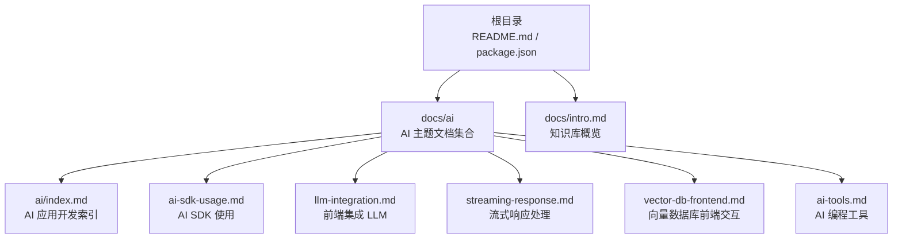
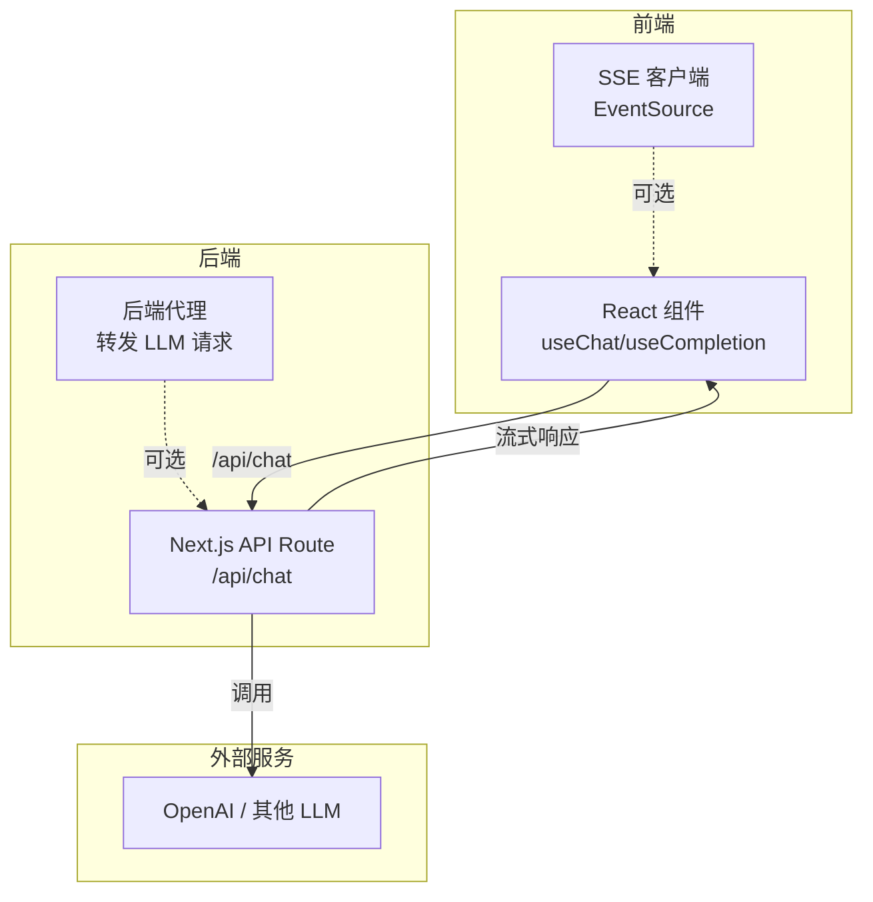
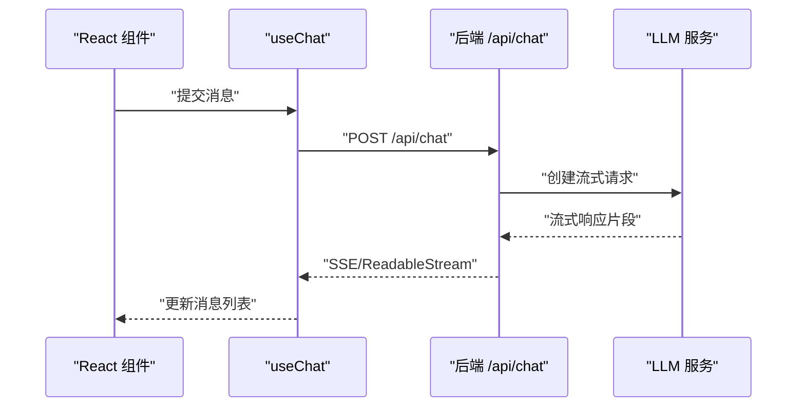
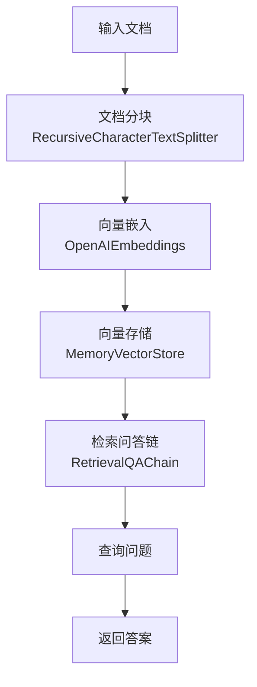
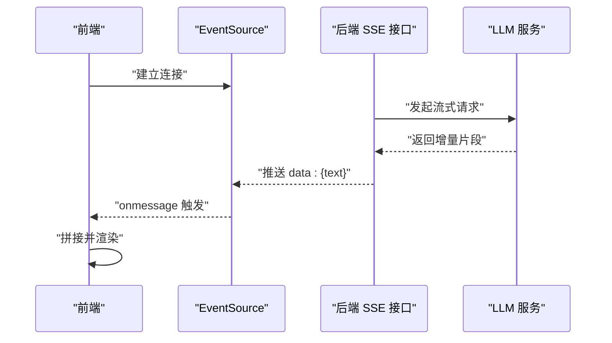
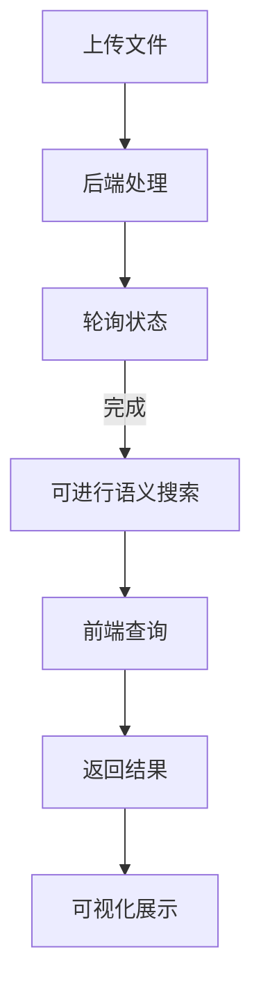
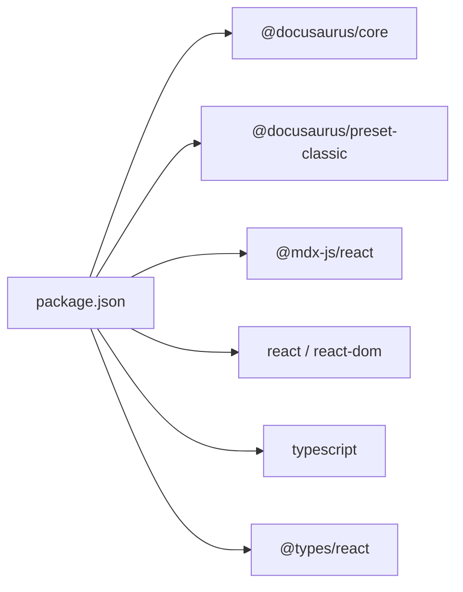

# AI SDK 使用指南

<cite>
**本文引用的文件**
- [README.md](file://README.md)
- [package.json](file://package.json)
- [docs/intro.md](file://docs/intro.md)
- [docs/ai/index.md](file://docs/ai/index.md)
- [docs/ai/ai-sdk-usage.md](file://docs/ai/ai-sdk-usage.md)
- [docs/ai/llm-integration.md](file://docs/ai/llm-integration.md)
- [docs/ai/streaming-response.md](file://docs/ai/streaming-response.md)
- [docs/ai/vector-db-frontend.md](file://docs/ai/vector-db-frontend.md)
- [docs/ai/ai-tools.md](file://docs/ai/ai-tools.md)
</cite>

## 目录
1. [简介](#简介)
2. [项目结构](#项目结构)
3. [核心组件](#核心组件)
4. [架构总览](#架构总览)
5. [详细组件分析](#详细组件分析)
6. [依赖分析](#依赖分析)
7. [性能考量](#性能考量)
8. [故障排除指南](#故障排除指南)
9. [结论](#结论)
10. [附录](#附录)

## 简介
本指南面向希望在前端与全栈应用中集成 AI 能力的工程师，系统讲解两大主流 AI SDK 的使用方法与最佳实践：Vercel AI SDK 与 LangChain.js，并结合流式响应、向量数据库、安全集成等主题，覆盖从安装配置、初始化、到核心 API、事件与异步处理模式的完整路径。同时提供浏览器端、Node.js 与移动端的集成思路与对比分析，帮助你在不同开发环境中做出合适的选择。

## 项目结构
该仓库基于 Docusaurus 构建，AI 相关内容集中在 docs/ai 目录下，围绕“LLM 集成”“流式响应”“AI SDK 使用”“向量数据库前端交互”“AI 编程工具”等主题形成知识体系。根目录提供安装与本地开发脚本，便于快速启动与部署。

图表来源
- [docs/ai/index.md:1-16](file://docs/ai/index.md#L1-L16)
- [docs/ai/ai-sdk-usage.md:1-139](file://docs/ai/ai-sdk-usage.md#L1-L139)
- [docs/ai/llm-integration.md:1-103](file://docs/ai/llm-integration.md#L1-L103)
- [docs/ai/streaming-response.md:1-166](file://docs/ai/streaming-response.md#L1-L166)
- [docs/ai/vector-db-frontend.md:1-178](file://docs/ai/vector-db-frontend.md#L1-L178)
- [docs/ai/ai-tools.md:1-150](file://docs/ai/ai-tools.md#L1-L150)
- [docs/intro.md:1-35](file://docs/intro.md#L1-L35)
- [README.md:1-42](file://README.md#L1-L42)
- [package.json:1-50](file://package.json#L1-L50)

章节来源
- [README.md:1-42](file://README.md#L1-L42)
- [package.json:1-50](file://package.json#L1-L50)
- [docs/intro.md:1-35](file://docs/intro.md#L1-L35)
- [docs/ai/index.md:1-16](file://docs/ai/index.md#L1-L16)

## 核心组件
- Vercel AI SDK：提供 generateText、streamText、generateObject 等核心能力，配套 React Hooks（useChat、useCompletion）简化前端集成。
- LangChain.js：面向复杂 AI 应用链（如 RAG），提供 ChatOpenAI、OpenAIEmbeddings、MemoryVectorStore、RecursiveCharacterTextSplitter、RetrievalQAChain 等模块。
- 流式响应：支持 SSE（Server-Sent Events）与 Vercel AI SDK 的封装，适配 LLM 的逐步输出。
- 向量数据库前端交互：涵盖文档上传、状态轮询、语义搜索、可视化与 API 封装。
- AI 编程工具：对比 GitHub Copilot、Cursor、Claude Code、Windsurf、Cline 等工具，给出使用技巧与局限性。

章节来源
- [docs/ai/ai-sdk-usage.md:10-139](file://docs/ai/ai-sdk-usage.md#L10-L139)
- [docs/ai/streaming-response.md:14-166](file://docs/ai/streaming-response.md#L14-L166)
- [docs/ai/vector-db-frontend.md:18-178](file://docs/ai/vector-db-frontend.md#L18-L178)
- [docs/ai/ai-tools.md:10-150](file://docs/ai/ai-tools.md#L10-L150)

## 架构总览
以下图展示了从前端到后端再到 LLM 的典型调用链路，以及两种 SDK 的定位差异与适用场景。

图表来源
- [docs/ai/llm-integration.md:43-66](file://docs/ai/llm-integration.md#L43-L66)
- [docs/ai/streaming-response.md:101-122](file://docs/ai/streaming-response.md#L101-L122)

## 详细组件分析

### Vercel AI SDK 使用
- 安装与导入：通过包管理器安装核心包与模型提供商适配包，导入 generateText、streamText、generateObject 与 ai/react 的 Hooks。
- 核心 API
  - generateText：输入提示词，获得纯文本结果。
  - streamText：开启流式生成，逐步接收增量文本。
  - generateObject：结合 Zod Schema，获得结构化 JSON 输出。
- React Hooks
  - useChat：适用于对话式场景，内置消息管理、输入处理与加载状态。
  - useCompletion：适用于文本补全场景，简化单次补全的交互。
- 适用场景：前端快速集成 LLM，强调易用性与体积小。

图表来源
- [docs/ai/ai-sdk-usage.md:47-73](file://docs/ai/ai-sdk-usage.md#L47-L73)
- [docs/ai/llm-integration.md:43-66](file://docs/ai/llm-integration.md#L43-L66)

章节来源
- [docs/ai/ai-sdk-usage.md:10-73](file://docs/ai/ai-sdk-usage.md#L10-L73)

### LangChain.js 使用
- 基础使用：通过 ChatOpenAI 与消息对象进行调用，适合需要更细粒度控制的场景。
- RAG 链路：包含文档分块（RecursiveCharacterTextSplitter）、向量嵌入（OpenAIEmbeddings）、向量存储（MemoryVectorStore）与检索问答链（RetrievalQAChain）的完整流程。
- 适用场景：复杂 AI Pipeline、需要 RAG 的企业级应用。

图表来源
- [docs/ai/ai-sdk-usage.md:91-120](file://docs/ai/ai-sdk-usage.md#L91-L120)

章节来源
- [docs/ai/ai-sdk-usage.md:75-120](file://docs/ai/ai-sdk-usage.md#L75-L120)

### 流式响应处理
- 为什么使用流式：LLM 生成文本耗时，流式响应能逐步呈现，改善用户体验。
- SSE（Server-Sent Events）：后端以流形式推送数据，前端通过 ReadableStream 或 EventSource 接收增量。
- Vercel AI SDK：封装了流式响应的复杂逻辑，推荐在前端直接使用。
- 对比：SSE 单向（服务端→客户端），WebSocket 双向；LLM 场景通常只需 SSE。

图表来源
- [docs/ai/streaming-response.md:14-57](file://docs/ai/streaming-response.md#L14-L57)
- [docs/ai/streaming-response.md:124-148](file://docs/ai/streaming-response.md#L124-L148)

章节来源
- [docs/ai/streaming-response.md:10-166](file://docs/ai/streaming-response.md#L10-L166)

### 向量数据库前端交互
- 文档处理：前端上传文件至后端，后端处理完成后返回 documentId，前端轮询状态直至完成。
- 语义搜索：前端发送查询，后端返回 topK 结果与相似度分数，前端渲染结果卡片。
- 可视化：对高维向量进行降维（如 t-SNE/PCA）后绘制散点图，辅助理解向量空间分布。
- API 封装：提供 upsert、query、delete 等常用接口，便于复用。

图表来源
- [docs/ai/vector-db-frontend.md:18-110](file://docs/ai/vector-db-frontend.md#L18-L110)
- [docs/ai/vector-db-frontend.md:112-178](file://docs/ai/vector-db-frontend.md#L112-L178)

章节来源
- [docs/ai/vector-db-frontend.md:18-178](file://docs/ai/vector-db-frontend.md#L18-L178)

### AI 编程工具
- 工具对比：GitHub Copilot（IDE 插件）、Cursor（VS Code 分支）、Claude Code（CLI/IDE）、Windsurf（IDE）、Cline（VS Code 插件）。
- 使用技巧：注释驱动开发、测试驱动、@ 符号引用（文件/目录/代码库/网络/文档）。
- 最佳实践：为 Claude Code 编写 CLAUDE.md 项目说明，进行代码审查与测试生成。
- 局限性：AI 工具是辅助，核心判断仍需人工；需审查安全与性能敏感代码。

章节来源
- [docs/ai/ai-tools.md:10-150](file://docs/ai/ai-tools.md#L10-L150)

## 依赖分析
- 项目运行时依赖 Docusaurus 核心包、MDX 渲染、React 与 Prism 语法高亮等。
- 开发时依赖 TypeScript、类型别名与 Docusaurus 类型定义。
- Node.js 版本要求：>= 20.0。

图表来源
- [package.json:17-33](file://package.json#L17-L33)

章节来源
- [package.json:1-50](file://package.json#L1-L50)

## 性能考量
- 包体积与加载：Vercel AI SDK 体积较小，适合前端直接集成；LangChain.js 体积较大，适合后端或复杂场景。
- 流式传输：优先采用 SSE，减少双向通信开销；合理处理中断与重试，避免资源泄漏。
- 向量检索：topK 与阈值参数影响召回与性能；对高维向量进行降维可视化，有助于优化策略。
- 安全与成本：后端代理保护密钥，实现用户认证、限流与内容过滤；关注 Token 用量与成本控制。

## 故障排除指南
- API Key 暴露风险：严禁在前端代码中暴露密钥；通过后端代理转发请求。
- 流式响应异常：确认后端 SSE 响应头与数据帧格式；前端使用 AbortController 处理中断；EventSource 错误回调及时关闭连接。
- RAG 链路问题：检查文档分块参数、向量维度与嵌入模型一致性；确保检索器与问答链配置匹配。
- 向量数据库：上传失败时检查后端处理状态轮询逻辑；查询结果为空时调整阈值与 topK。
- 工具使用：提示词质量决定输出质量；对 AI 生成代码进行人工审查，尤其涉及安全与性能的部分。

章节来源
- [docs/ai/llm-integration.md:68-103](file://docs/ai/llm-integration.md#L68-L103)
- [docs/ai/streaming-response.md:150-166](file://docs/ai/streaming-response.md#L150-L166)
- [docs/ai/vector-db-frontend.md:171-178](file://docs/ai/vector-db-frontend.md#L171-L178)
- [docs/ai/ai-tools.md:121-150](file://docs/ai/ai-tools.md#L121-L150)

## 结论
- 选择 SDK：若追求前端快速集成与轻量体验，优先 Vercel AI SDK；若需要构建复杂 AI Pipeline 或内置 RAG，选择 LangChain.js。
- 流式响应：在 LLM 场景中推荐 SSE，配合 Vercel AI SDK 的 Hooks 能显著降低前端复杂度。
- 向量数据库：前端负责上传、轮询与语义搜索，后端负责处理与检索；可视化有助于理解与优化。
- 安全与成本：始终通过后端代理访问 LLM，实现认证、限流与内容过滤；关注 Token 用量与成本控制。
- 工具辅助：AI 编程工具能提升效率，但需人工审查与把关，避免架构与业务逻辑层面的偏差。

## 附录

### 安装与本地开发
- 安装依赖：使用包管理器安装项目依赖。
- 本地启动：启动本地开发服务器，支持热更新。
- 构建与部署：构建静态内容并部署到任意静态托管服务；支持 SSH 与非 SSH 部署方式。

章节来源
- [README.md:5-42](file://README.md#L5-L42)

### 在不同环境中的集成要点
- 浏览器端：优先使用 Vercel AI SDK 的 Hooks；通过后端代理转发请求，避免密钥泄露。
- Node.js 环境：可直接使用 LangChain.js 构建复杂链路；结合 SSE/WS 处理流式响应。
- 移动端：通过 WebView 或跨平台框架调用后端 API；注意网络中断与重试策略。

章节来源
- [docs/ai/llm-integration.md:10-103](file://docs/ai/llm-integration.md#L10-L103)
- [docs/ai/streaming-response.md:150-166](file://docs/ai/streaming-response.md#L150-L166)