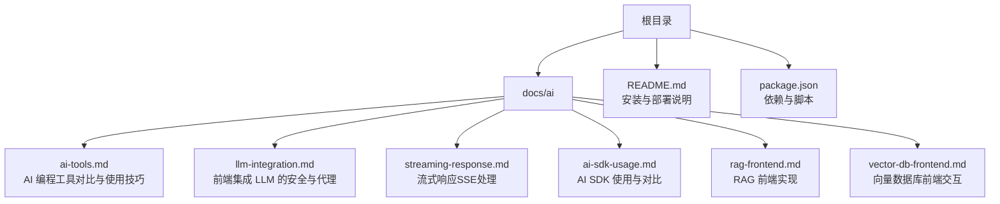
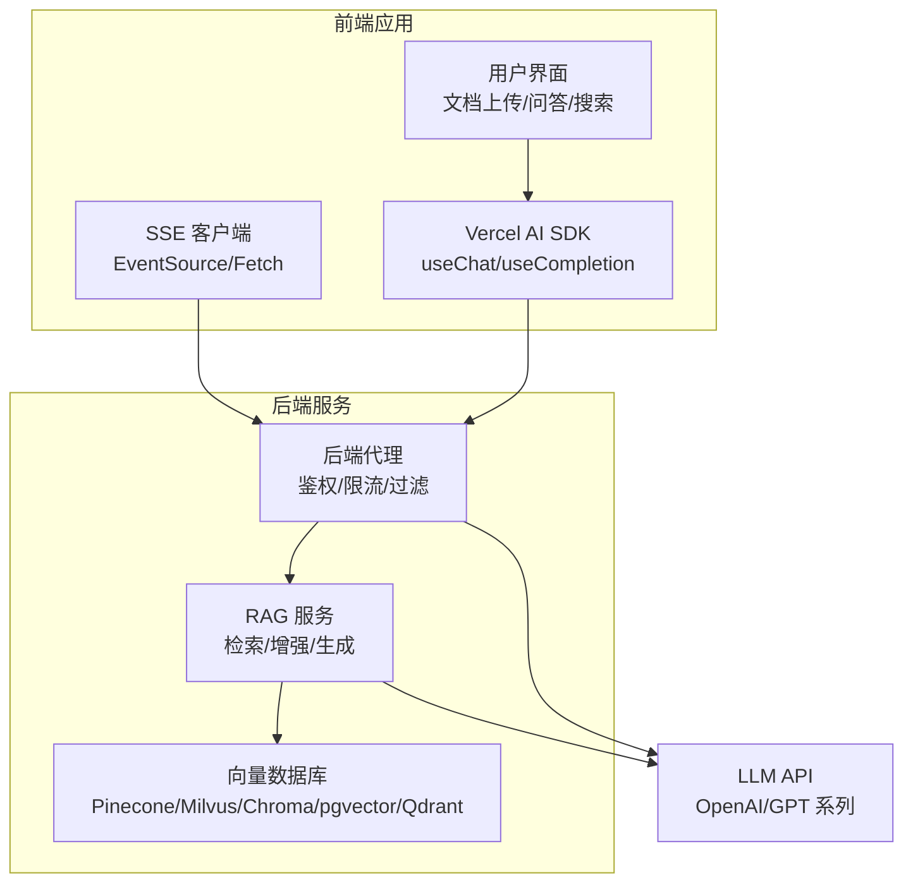
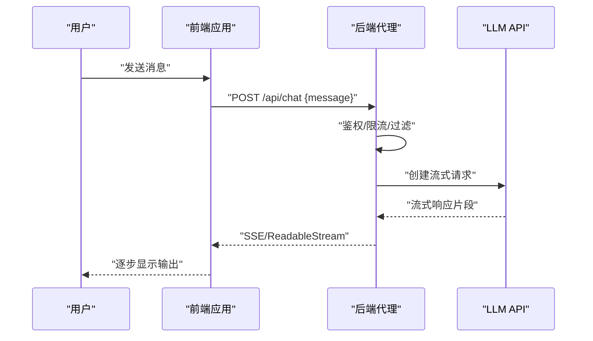
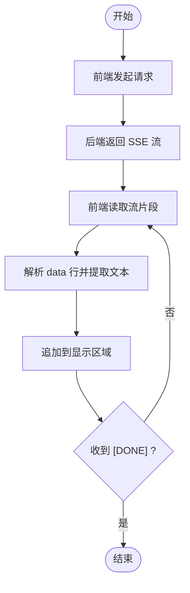
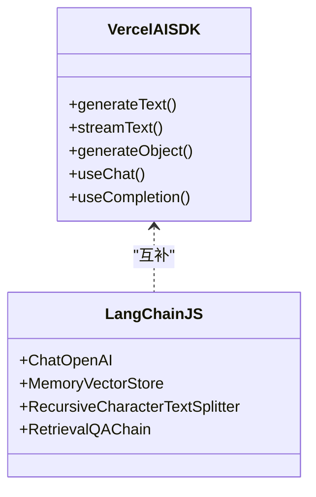
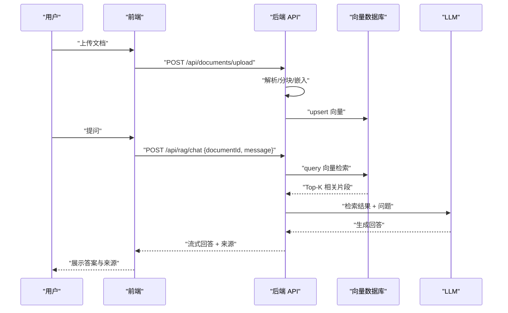
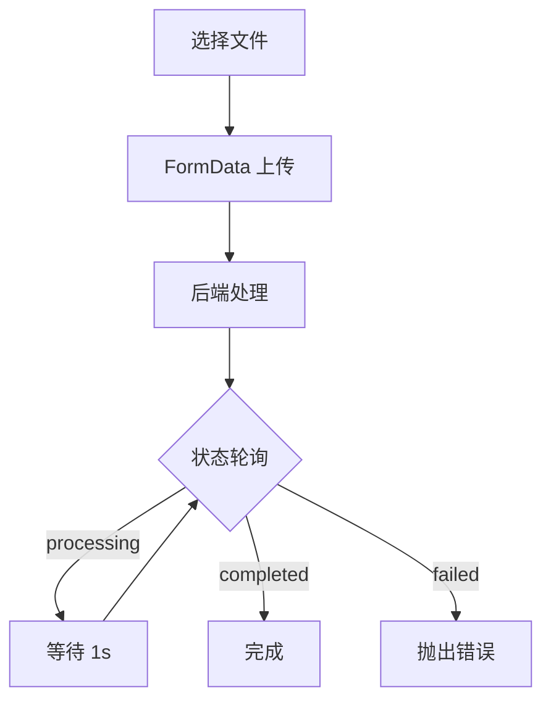
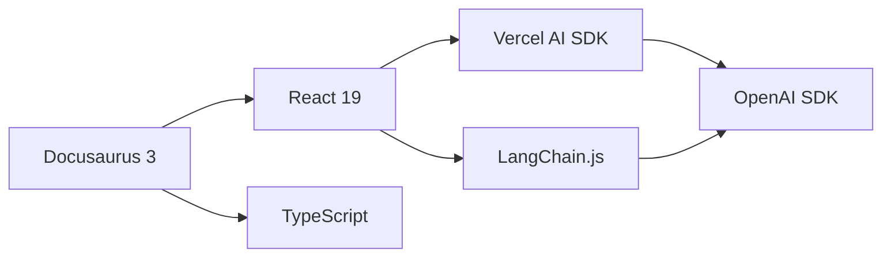

# AI 工具应用

<cite>
**本文引用的文件**
- [README.md](file://README.md)
- [package.json](file://package.json)
- [docs/intro.md](file://docs/intro.md)
- [docs/ai/index.md](file://docs/ai/index.md)
- [docs/ai/ai-tools.md](file://docs/ai/ai-tools.md)
- [docs/ai/llm-integration.md](file://docs/ai/llm-integration.md)
- [docs/ai/streaming-response.md](file://docs/ai/streaming-response.md)
- [docs/ai/ai-sdk-usage.md](file://docs/ai/ai-sdk-usage.md)
- [docs/ai/rag-frontend.md](file://docs/ai/rag-frontend.md)
- [docs/ai/vector-db-frontend.md](file://docs/ai/vector-db-frontend.md)
</cite>

## 目录
1. [简介](#简介)
2. [项目结构](#项目结构)
3. [核心组件](#核心组件)
4. [架构总览](#架构总览)
5. [详细组件分析](#详细组件分析)
6. [依赖关系分析](#依赖关系分析)
7. [性能考量](#性能考量)
8. [故障排查指南](#故障排查指南)
9. [结论](#结论)
10. [附录](#附录)

## 简介
本技术文档面向希望在应用中集成 AI 工具与能力的开发者，系统介绍智能写作助手、代码补全工具、图像生成工具、语音识别工具等常见 AI 功能的使用场景与集成方法。文档重点覆盖以下方面：
- 前端集成 LLM 的安全实践与代理模式
- 流式响应（SSE）的实现与消费方式
- AI SDK（Vercel AI SDK、LangChain.js）的使用与对比
- RAG（检索增强生成）的前端实现路径
- 向量数据库的前端交互与可视化
- 工具选择指南、成本效益与隐私安全考量

本仓库基于 Docusaurus 构建，AI 专题内容集中在 docs/ai 目录下，配合实战示例与最佳实践，帮助开发者快速落地智能化功能。

章节来源
- [docs/intro.md:1-35](file://docs/intro.md#L1-L35)
- [docs/ai/index.md:1-16](file://docs/ai/index.md#L1-L16)

## 项目结构
该仓库采用 Docusaurus 静态站点生成器，AI 相关内容位于 docs/ai 下，包含多个主题文档，涵盖 LLM 集成、流式响应、AI SDK 使用、RAG 前端实现以及向量数据库交互等。

图表来源
- [docs/ai/ai-tools.md:1-150](file://docs/ai/ai-tools.md#L1-L150)
- [docs/ai/llm-integration.md:1-103](file://docs/ai/llm-integration.md#L1-L103)
- [docs/ai/streaming-response.md:1-166](file://docs/ai/streaming-response.md#L1-L166)
- [docs/ai/ai-sdk-usage.md:1-139](file://docs/ai/ai-sdk-usage.md#L1-L139)
- [docs/ai/rag-frontend.md:1-144](file://docs/ai/rag-frontend.md#L1-L144)
- [docs/ai/vector-db-frontend.md:1-178](file://docs/ai/vector-db-frontend.md#L1-L178)
- [README.md:1-42](file://README.md#L1-L42)
- [package.json:1-50](file://package.json#L1-L50)

章节来源
- [README.md:1-42](file://README.md#L1-L42)
- [package.json:1-50](file://package.json#L1-L50)

## 核心组件
本节从“工具选择—集成方式—安全与性能—可维护性”的维度，梳理 AI 工具在前端应用中的关键组件与实践要点。

- AI 编程工具
  - 工具类型与适用场景：IDE 插件（如 GitHub Copilot）、VS Code 分支（Cursor）、CLI/IDE（Claude Code）、全代码感知（Windsurf）、自编译代理（Cline）
  - 使用技巧：注释驱动开发、测试驱动、内联编辑、对话模式、@符号引用
  - 局限性：模板代码、测试生成、补全与重构、解释复杂代码、生成文档；需人工审查安全、性能、第三方 API 使用；不适合架构设计、需求理解与复杂业务推理
  - 关键点：工具是辅助，提示词决定输出质量，必须审查 AI 生成代码，不同工具适合不同场景，可组合使用

- 前端集成 LLM
  - 不推荐在前端直接暴露 API Key；推荐通过后端代理转发请求，保护密钥
  - 后端代理需实现用户认证、限流、内容过滤，并将 LLM 流式输出透传给前端
  - Vercel AI SDK 简化前端集成，提供 useChat/useCompletion 等 React Hooks

- 流式响应（SSE）
  - LLM 生成文本耗时，SSE 提供逐步输出，改善用户体验
  - SSE 单向（服务端→客户端），自动重连，适合 LLM 流式输出；WebSocket 更适合双向聊天
  - 前端消费方式：原生 Fetch + ReadableStream、Vercel AI SDK、EventSource（SSE 客户端）

- AI SDK 使用
  - Vercel AI SDK：generateText/streamText/generateObject，适合前端快速集成；体积小、学习曲线低
  - LangChain.js：适合构建复杂 AI Pipeline，内置 RAG 支持；体积较大、学习曲线较高
  - 对比维度：定位、体积、学习曲线、RAG 支持、流式支持、适用场景

- RAG 前端实现
  - 核心流程：检索 → 增强 → 生成
  - 前端组件：文档上传、问答界面、来源引用展示
  - 向量数据库选择：Pinecone、Milvus、Chroma、pgvector、Qdrant

- 向量数据库前端交互
  - 文档处理：上传文件 → 后端处理 → 轮询状态 → 完成
  - 语义搜索：查询接口 + topK + 阈值参数
  - 可视化：Embedding 降维（PCA/t-SNE）到 2D 散点图
  - API 封装：upsert/query/delete 等常用操作

章节来源
- [docs/ai/ai-tools.md:1-150](file://docs/ai/ai-tools.md#L1-L150)
- [docs/ai/llm-integration.md:1-103](file://docs/ai/llm-integration.md#L1-L103)
- [docs/ai/streaming-response.md:1-166](file://docs/ai/streaming-response.md#L1-L166)
- [docs/ai/ai-sdk-usage.md:1-139](file://docs/ai/ai-sdk-usage.md#L1-L139)
- [docs/ai/rag-frontend.md:1-144](file://docs/ai/rag-frontend.md#L1-L144)
- [docs/ai/vector-db-frontend.md:1-178](file://docs/ai/vector-db-frontend.md#L1-L178)

## 架构总览
下图展示了前端应用与后端服务、LLM 与向量数据库之间的典型交互路径，突出“安全代理”“流式响应”“RAG 检索增强”三个关键环节。

图表来源
- [docs/ai/llm-integration.md:68-94](file://docs/ai/llm-integration.md#L68-L94)
- [docs/ai/streaming-response.md:14-56](file://docs/ai/streaming-response.md#L14-L56)
- [docs/ai/rag-frontend.md:18-41](file://docs/ai/rag-frontend.md#L18-L41)
- [docs/ai/vector-db-frontend.md:18-51](file://docs/ai/vector-db-frontend.md#L18-L51)

## 详细组件分析

### 组件一：前端集成 LLM（安全代理与 SDK）
- 安全原则
  - 永远不要在前端暴露 API Key；通过后端代理转发请求
  - 后端实现用户认证、限流与内容过滤
- 代理实现要点
  - 接收前端消息，调用 LLM API，开启流式输出
  - 将流式响应透传给前端（ReadableStream/SSE）
- SDK 使用
  - Vercel AI SDK 提供 useChat/useCompletion，简化前端集成
  - 适合快速原型与中小型项目

图表来源
- [docs/ai/llm-integration.md:29-41](file://docs/ai/llm-integration.md#L29-L41)
- [docs/ai/llm-integration.md:68-94](file://docs/ai/llm-integration.md#L68-L94)
- [docs/ai/streaming-response.md:14-56](file://docs/ai/streaming-response.md#L14-L56)

章节来源
- [docs/ai/llm-integration.md:10-103](file://docs/ai/llm-integration.md#L10-L103)
- [docs/ai/streaming-response.md:10-166](file://docs/ai/streaming-response.md#L10-L166)

### 组件二：流式响应（SSE）处理
- 为什么使用 SSE
  - LLM 生成文本耗时，SSE 提供逐步输出，改善用户体验
- 后端实现
  - 使用 LLM SDK 的流式接口，封装为 ReadableStream/SSE
  - 设置合适的响应头（Content-Type/Cached-Control/Connection）
- 前端消费
  - 原生 Fetch + ReadableStream：读取字节流，解析 data 行，拼接文本
  - Vercel AI SDK：useChat 自动处理 SSE
  - EventSource：SSE 客户端监听，处理 [DONE] 结束信号

图表来源
- [docs/ai/streaming-response.md:14-56](file://docs/ai/streaming-response.md#L14-L56)
- [docs/ai/streaming-response.md:61-99](file://docs/ai/streaming-response.md#L61-L99)
- [docs/ai/streaming-response.md:124-148](file://docs/ai/streaming-response.md#L124-L148)

章节来源
- [docs/ai/streaming-response.md:10-166](file://docs/ai/streaming-response.md#L10-L166)

### 组件三：AI SDK 使用（Vercel AI SDK 与 LangChain.js）
- Vercel AI SDK
  - generateText/streamText/generateObject：文本生成、流式生成、结构化输出
  - React Hooks：useChat/useCompletion，简化前端交互
  - 优点：体积小、学习曲线低、流式支持优秀
- LangChain.js
  - 适合复杂 AI Pipeline 与 RAG 链路
  - 优点：内置 RAG、生态丰富
  - 缺点：体积较大、学习曲线高
- 对比与选择
  - 前端快速集成：优先 Vercel AI SDK
  - 复杂应用与研究：LangChain.js

图表来源
- [docs/ai/ai-sdk-usage.md:10-139](file://docs/ai/ai-sdk-usage.md#L10-L139)

章节来源
- [docs/ai/ai-sdk-usage.md:1-139](file://docs/ai/ai-sdk-usage.md#L1-L139)

### 组件四：RAG 前端实现
- 核心流程
  - 文档上传 → 后端处理与向量化 → 向量数据库存储
  - 用户提问 → 向量检索 → 上下文增强 → LLM 生成
- 前端组件
  - 文档上传组件：支持多格式、上传中状态、成功回调
  - RAG 聊天界面：基于 useChat，展示消息与来源引用
- 向量数据库选择
  - Pinecone（全托管）、Milvus（开源高性能）、Chroma（轻量）、pgvector（已有 PG）、Qdrant（高性能）

图表来源
- [docs/ai/rag-frontend.md:43-81](file://docs/ai/rag-frontend.md#L43-L81)
- [docs/ai/rag-frontend.md:83-125](file://docs/ai/rag-frontend.md#L83-L125)
- [docs/ai/vector-db-frontend.md:18-51](file://docs/ai/vector-db-frontend.md#L18-L51)

章节来源
- [docs/ai/rag-frontend.md:1-144](file://docs/ai/rag-frontend.md#L1-L144)
- [docs/ai/vector-db-frontend.md:1-178](file://docs/ai/vector-db-frontend.md#L1-L178)

### 组件五：向量数据库前端交互与可视化
- 文档处理流程
  - 上传文件 → 后端处理 → 轮询状态直到完成或失败
- 语义搜索界面
  - 输入查询 → 发送请求（topK、阈值）→ 展示结果与相似度
- Embedding 可视化
  - 降维（PCA/t-SNE）到 2D，散点图展示类别分布
- API 封装
  - upsert/query/delete 等常用操作封装为客户端类

图表来源
- [docs/ai/vector-db-frontend.md:18-51](file://docs/ai/vector-db-frontend.md#L18-L51)
- [docs/ai/vector-db-frontend.md:53-110](file://docs/ai/vector-db-frontend.md#L53-L110)
- [docs/ai/vector-db-frontend.md:112-133](file://docs/ai/vector-db-frontend.md#L112-L133)
- [docs/ai/vector-db-frontend.md:135-169](file://docs/ai/vector-db-frontend.md#L135-L169)

章节来源
- [docs/ai/vector-db-frontend.md:1-178](file://docs/ai/vector-db-frontend.md#L1-L178)

### 组件六：AI 编程工具（Copilot/Cursor/Claude Code 等）
- 工具对比
  - Copilot：IDE 插件，行级/函数级补全
  - Cursor：VS Code 分支，全局上下文理解
  - Claude Code：CLI/IDE，深度代码理解
  - Windsurf：全代码感知
  - Cline：自编译代理
- 使用技巧
  - 注释驱动开发、测试驱动、内联编辑、对话模式、@ 符号引用
- 局限性与关键点
  - 适合模板代码、测试、补全与重构、解释复杂代码、生成文档
  - 需人工审查安全、性能、第三方 API 使用
  - 不适合架构设计、需求理解、复杂业务推理
  - 工具是辅助，提示词决定输出质量，不同工具适合不同场景，可组合使用

章节来源
- [docs/ai/ai-tools.md:1-150](file://docs/ai/ai-tools.md#L1-L150)

## 依赖关系分析
- 技术栈
  - 前端：React 19、TypeScript、Docusaurus 3
  - AI 集成：Vercel AI SDK、LangChain.js（可选）
  - 后端：Next.js API Routes（示例）、OpenAI SDK
- 依赖与脚本
  - 安装与本地开发：yarn、yarn start
  - 构建与部署：yarn build、yarn deploy

图表来源
- [package.json:17-33](file://package.json#L17-L33)
- [docs/ai/ai-sdk-usage.md:10-45](file://docs/ai/ai-sdk-usage.md#L10-L45)
- [docs/ai/ai-sdk-usage.md:75-90](file://docs/ai/ai-sdk-usage.md#L75-L90)

章节来源
- [package.json:1-50](file://package.json#L1-50)
- [README.md:5-25](file://README.md#L5-L25)

## 性能考量
- 流式响应
  - 使用 SSE/ReadableStream 降低首字节延迟，提升交互体验
  - 注意中断（AbortController）与错误重试机制
- 包体积与加载
  - Vercel AI SDK 体积小，适合前端直接集成；LangChain.js 体积较大，适合后端或复杂应用
- Token 用量与成本控制
  - 后端代理实现限流与配额控制，避免滥用
  - 合理设置模型参数（温度、最大长度）以平衡质量与成本
- 向量检索性能
  - 向量数据库选择与索引策略影响检索速度与精度
  - 分块策略（chunkSize/chunkOverlap）影响检索质量

章节来源
- [docs/ai/streaming-response.md:160-166](file://docs/ai/streaming-response.md#L160-L166)
- [docs/ai/ai-sdk-usage.md:122-139](file://docs/ai/ai-sdk-usage.md#L122-L139)
- [docs/ai/llm-integration.md:96-103](file://docs/ai/llm-integration.md#L96-L103)
- [docs/ai/rag-frontend.md:127-136](file://docs/ai/rag-frontend.md#L127-L136)

## 故障排查指南
- API Key 暴露风险
  - 症状：前端报错或被拦截
  - 处理：将密钥移至后端环境变量，前端仅调用自有后端接口
- SSE 断流与重连
  - 症状：输出中断、无 [DONE] 结束信号
  - 处理：使用 AbortController 中断请求，EventSource 自动重连；前端解析 data 行时忽略无效行
- 向量数据库状态轮询
  - 症状：上传后一直 processing
  - 处理：检查后端处理日志，确认分块与嵌入是否成功；前端轮询间隔合理设置
- RAG 检索质量差
  - 症状：检索结果不相关或为空
  - 处理：调整分块策略、阈值与 topK；确认 Embedding 模型与向量数据库配置

章节来源
- [docs/ai/llm-integration.md:68-94](file://docs/ai/llm-integration.md#L68-L94)
- [docs/ai/streaming-response.md:124-148](file://docs/ai/streaming-response.md#L124-L148)
- [docs/ai/vector-db-frontend.md:38-51](file://docs/ai/vector-db-frontend.md#L38-L51)
- [docs/ai/rag-frontend.md:127-136](file://docs/ai/rag-frontend.md#L127-L136)

## 结论
本仓库提供了从工具选择、安全集成、流式响应到 RAG 与向量数据库的完整实践路径。对于大多数前端项目，建议：
- 优先采用 Vercel AI SDK 与后端代理的安全模式
- 使用 SSE 提升用户体验，结合合理的中断与重试机制
- 在需要复杂检索增强与生成链路时，考虑 LangChain.js
- 重视向量数据库的选择与分块策略，确保检索质量
- 将 AI 工具作为辅助手段，持续审查与优化生成内容

章节来源
- [docs/ai/ai-tools.md:143-150](file://docs/ai/ai-tools.md#L143-L150)
- [docs/ai/ai-sdk-usage.md:133-139](file://docs/ai/ai-sdk-usage.md#L133-L139)
- [docs/ai/llm-integration.md:96-103](file://docs/ai/llm-integration.md#L96-L103)

## 附录
- 工具选择指南
  - 初学者与快速原型：Vercel AI SDK
  - 复杂应用与研究：LangChain.js
  - 编程辅助：Copilot/Cursor/Claude Code/Windsurf/Cline
- 成本效益分析
  - 评估 Token 用量、并发与限流策略，结合模型价格与后端资源成本
- 隐私与安全
  - 前端不暴露密钥；后端实现鉴权、限流与内容过滤；对敏感数据进行脱敏或本地化处理

章节来源
- [docs/ai/ai-sdk-usage.md:122-139](file://docs/ai/ai-sdk-usage.md#L122-L139)
- [docs/ai/ai-tools.md:10-19](file://docs/ai/ai-tools.md#L10-L19)
- [docs/ai/llm-integration.md:68-103](file://docs/ai/llm-integration.md#L68-L103)