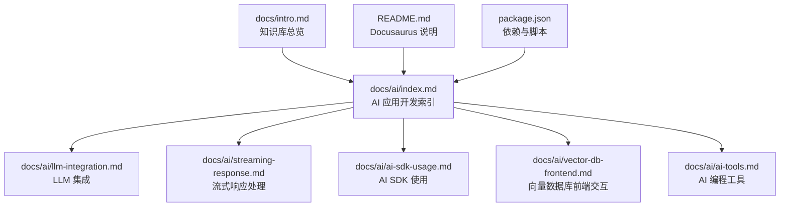
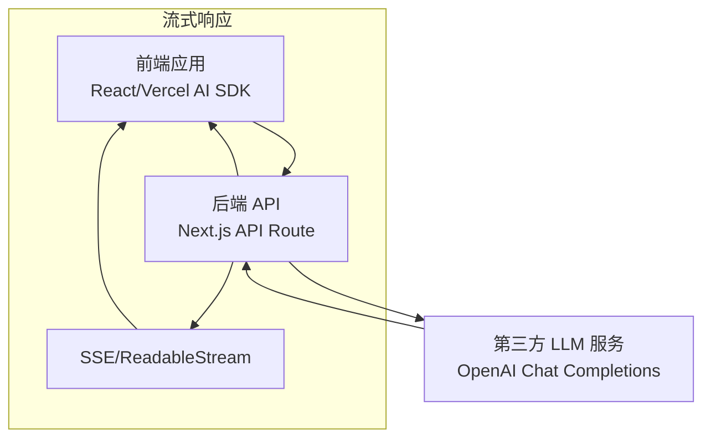
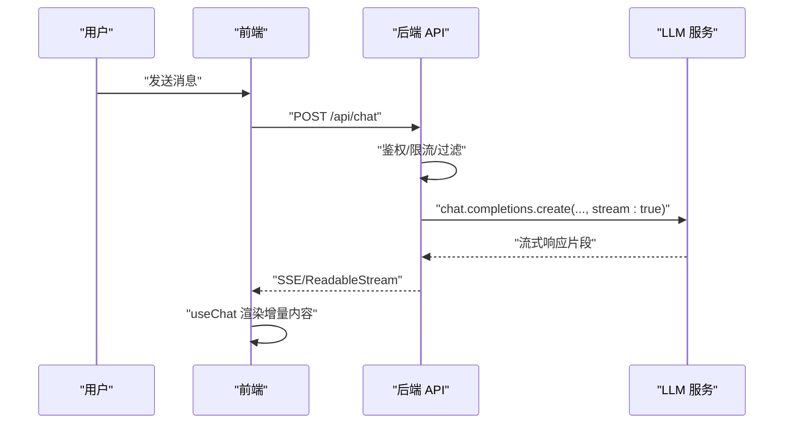
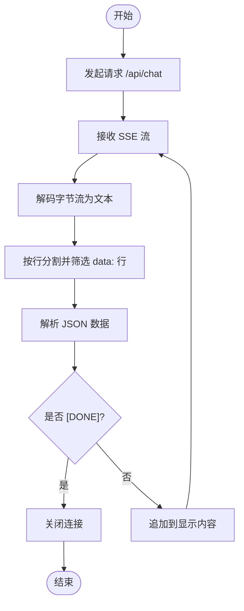
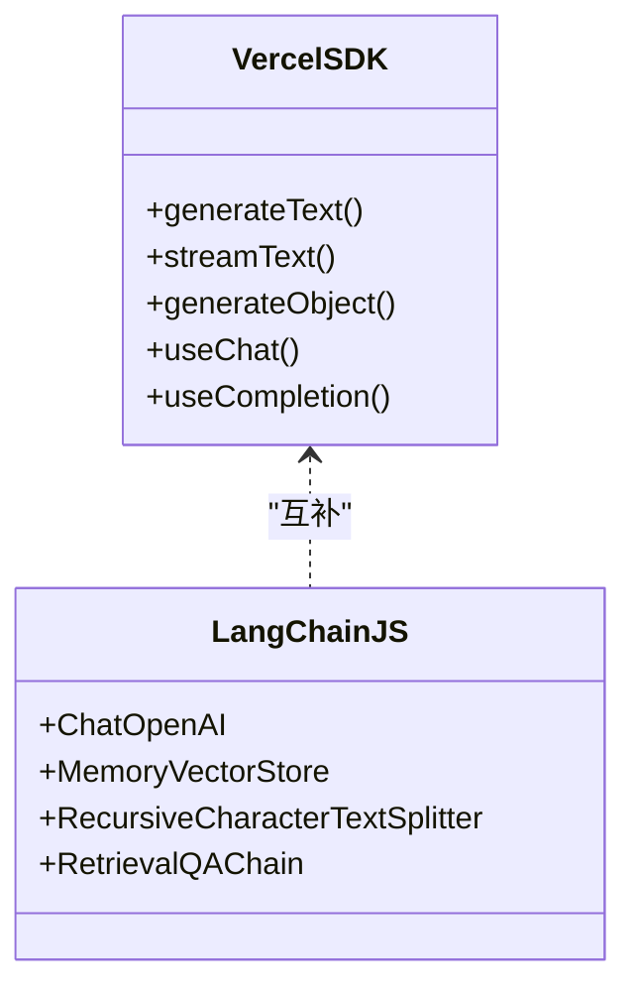
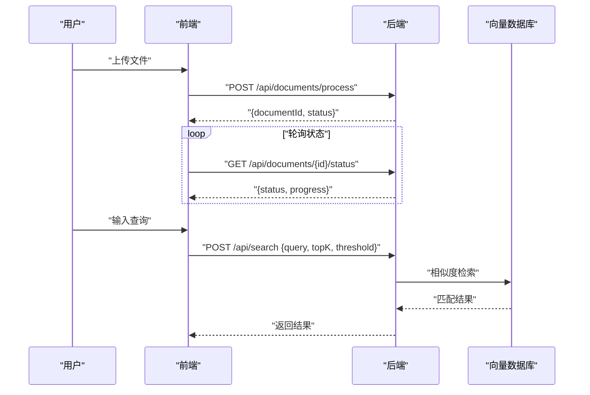
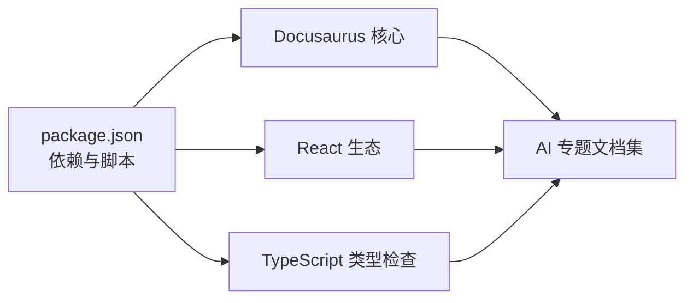

# AI 应用开发专题

<cite>
**本文引用的文件**
- [docs/ai/index.md](file://docs/ai/index.md)
- [docs/ai/llm-integration.md](file://docs/ai/llm-integration.md)
- [docs/ai/streaming-response.md](file://docs/ai/streaming-response.md)
- [docs/ai/ai-sdk-usage.md](file://docs/ai/ai-sdk-usage.md)
- [docs/ai/ai-tools.md](file://docs/ai/ai-tools.md)
- [docs/ai/vector-db-frontend.md](file://docs/ai/vector-db-frontend.md)
- [docs/intro.md](file://docs/intro.md)
- [README.md](file://README.md)
- [package.json](file://package.json)
</cite>

## 目录
1. [简介](#简介)
2. [项目结构](#项目结构)
3. [核心组件](#核心组件)
4. [架构总览](#架构总览)
5. [详细组件分析](#详细组件分析)
6. [依赖关系分析](#依赖关系分析)
7. [性能考量](#性能考量)
8. [故障排查指南](#故障排查指南)
9. [结论](#结论)
10. [附录](#附录)

## 简介
本专题面向希望在现代 Web 应用中集成 AI 能力的工程师与架构师，系统讲解大语言模型（LLM）集成、流式响应处理、AI SDK 使用以及 AI 工具应用等关键主题。文档基于仓库内的知识库内容，结合前端开发的实际需求，提供从原理到实践的完整路径，并给出可操作的实现要点与最佳实践。

## 项目结构
该知识库采用 Docusaurus 静态站点生成器组织内容，AI 专题位于 docs/ai 目录下，包含多个子主题文档，覆盖 LLM 集成、流式响应、AI SDK、向量数据库交互与 AI 编程工具等方向。整体结构清晰，便于按主题检索与学习。

图表来源
- [docs/ai/index.md:1-16](file://docs/ai/index.md#L1-L16)
- [docs/ai/llm-integration.md:1-103](file://docs/ai/llm-integration.md#L1-L103)
- [docs/ai/streaming-response.md:1-166](file://docs/ai/streaming-response.md#L1-L166)
- [docs/ai/ai-sdk-usage.md:1-139](file://docs/ai/ai-sdk-usage.md#L1-L139)
- [docs/ai/vector-db-frontend.md:1-178](file://docs/ai/vector-db-frontend.md#L1-L178)
- [docs/intro.md:1-35](file://docs/intro.md#L1-L35)
- [README.md:1-42](file://README.md#L1-L42)
- [package.json:1-50](file://package.json#L1-L50)

章节来源
- [docs/ai/index.md:1-16](file://docs/ai/index.md#L1-L16)
- [docs/intro.md:1-35](file://docs/intro.md#L1-L35)
- [README.md:1-42](file://README.md#L1-L42)
- [package.json:1-50](file://package.json#L1-L50)

## 核心组件
- LLM 集成：讲解前端如何安全地调用 LLM API，推荐通过后端代理转发请求，避免在前端暴露密钥；同时介绍 Vercel AI SDK 的 useChat 等能力。
- 流式响应：对比 SSE 与 WebSocket，强调 LLM 场景下单向流式输出的适用性；提供原生 ReadableStream、Vercel AI SDK 与 EventSource 的多种消费方式。
- AI SDK 使用：对比 Vercel AI SDK 与 LangChain.js，分别适用于前端快速集成与复杂 AI 管道；介绍 generateText、streamText、generateObject 等能力。
- 向量数据库前端交互：讲解文档上传、状态轮询、语义搜索与可视化等前端交互流程，封装向量数据库 API 客户端。
- AI 编程工具：对比主流 AI 编程工具（Copilot、Cursor、Claude Code 等），总结使用技巧与局限性，强调“辅助而非替代”的原则。

章节来源
- [docs/ai/llm-integration.md:10-103](file://docs/ai/llm-integration.md#L10-L103)
- [docs/ai/streaming-response.md:10-166](file://docs/ai/streaming-response.md#L10-L166)
- [docs/ai/ai-sdk-usage.md:10-139](file://docs/ai/ai-sdk-usage.md#L10-L139)
- [docs/ai/vector-db-frontend.md:18-178](file://docs/ai/vector-db-frontend.md#L18-L178)
- [docs/ai/ai-tools.md:10-150](file://docs/ai/ai-tools.md#L10-L150)

## 架构总览
下图展示了前端与后端在 LLM 集成与流式响应中的典型交互路径，以及 AI SDK 在其中的角色定位。

图表来源
- [docs/ai/llm-integration.md:29-93](file://docs/ai/llm-integration.md#L29-L93)
- [docs/ai/streaming-response.md:14-56](file://docs/ai/streaming-response.md#L14-L56)

## 详细组件分析

### LLM 集成
- 安全性优先：绝不将 API Key 暴露于前端，推荐通过后端代理转发请求；后端使用环境变量保存密钥。
- 后端代理示例：接收前端消息，进行身份校验、限流与内容过滤，再调用 LLM 并返回流式响应。
- Vercel AI SDK：简化前端集成，useChat 可直接消费后端流式输出，自动管理消息、输入与加载状态。

图表来源
- [docs/ai/llm-integration.md:79-93](file://docs/ai/llm-integration.md#L79-L93)
- [docs/ai/streaming-response.md:23-56](file://docs/ai/streaming-response.md#L23-L56)

章节来源
- [docs/ai/llm-integration.md:10-103](file://docs/ai/llm-integration.md#L10-L103)

### 流式响应处理
- 推荐使用 SSE：LLM 输出为单向流式文本，SSE 更简单可靠；WebSocket 更适合双向通信场景。
- 原生实现：通过 ReadableStream 读取后端 SSE，逐行解析 data 字段，拼接增量文本。
- Vercel AI SDK：useChat 封装了 SSE 消费细节，自动处理 done 标记、错误与重试。
- EventSource：浏览器原生 SSE 客户端，适合轻量场景。

图表来源
- [docs/ai/streaming-response.md:61-99](file://docs/ai/streaming-response.md#L61-L99)
- [docs/ai/streaming-response.md:124-148](file://docs/ai/streaming-response.md#L124-L148)

章节来源
- [docs/ai/streaming-response.md:10-166](file://docs/ai/streaming-response.md#L10-L166)

### AI SDK 使用
- Vercel AI SDK：提供 generateText、streamText、generateObject 等高层抽象；React Hook useChat/useCompletion 降低前端接入门槛。
- LangChain.js：更适合构建复杂 AI 管道（如 RAG Chain），内置检索与链式调用能力。
- 对比与选型：体积、学习曲线、RAG 支持与适用场景差异明显，需结合项目复杂度与性能要求选择。

图表来源
- [docs/ai/ai-sdk-usage.md:10-139](file://docs/ai/ai-sdk-usage.md#L10-L139)

章节来源
- [docs/ai/ai-sdk-usage.md:10-139](file://docs/ai/ai-sdk-usage.md#L10-L139)

### 向量数据库前端交互
- 文档处理流程：前端上传文件至后端，后端处理并返回 documentId；前端轮询处理状态直至完成。
- 语义搜索：前端发起查询请求，传入 topK 与阈值参数，后端返回匹配结果与相似度分数。
- 可视化：可将高维向量降维后绘制散点图，辅助理解向量空间分布。
- API 封装：提供 upsert、query、delete 等常用接口的客户端封装，便于复用。

图表来源
- [docs/ai/vector-db-frontend.md:20-51](file://docs/ai/vector-db-frontend.md#L20-L51)
- [docs/ai/vector-db-frontend.md:55-110](file://docs/ai/vector-db-frontend.md#L55-L110)

章节来源
- [docs/ai/vector-db-frontend.md:18-178](file://docs/ai/vector-db-frontend.md#L18-L178)

### AI 编程工具
- 工具对比：GitHub Copilot（IDE 插件）、Cursor（VS Code 分支）、Claude Code（CLI/IDE）、Windsurf、Cline 等，各有侧重。
- 使用技巧：注释驱动开发、测试驱动、对话模式与 @ 符号引用；好的提示词能显著提升输出质量。
- 局限性：AI 工具是辅助手段，核心判断仍需人工；尤其在安全、性能与第三方 API 使用方面必须严格审查。

章节来源
- [docs/ai/ai-tools.md:10-150](file://docs/ai/ai-tools.md#L10-L150)

## 依赖关系分析
- 项目依赖 Docusaurus 3.x 与 React 生态，使用 TypeScript 进行类型检查；构建与部署脚本由 yarn 提供。
- AI 专题文档之间存在强关联：LLM 集成与流式响应紧密配合；向量数据库前端交互与 RAG 场景相辅相成；AI SDK 与编程工具共同提升开发效率。

图表来源
- [package.json:17-33](file://package.json#L17-L33)
- [README.md:3-25](file://README.md#L3-L25)

章节来源
- [package.json:1-50](file://package.json#L1-L50)
- [README.md:1-42](file://README.md#L1-L42)

## 性能考量
- 流式渲染：优先使用 SSE 与增量更新，减少首屏等待与内存占用；合理拆分消息，避免一次性渲染大量内容。
- 请求与重试：为流式连接设置合理的超时与重试策略；在前端使用 AbortController 中断无效请求。
- 包体积与加载：在前端直接集成时，优先考虑 Vercel AI SDK 的小体积优势；复杂场景再引入 LangChain.js。
- 向量检索：topK 与阈值参数影响召回质量与性能；对高维向量检索可考虑近似最近邻算法或缓存热点查询。

## 故障排查指南
- API 密钥泄露：确保密钥仅存在于后端环境变量中，前端通过自有 API 转发请求。
- 流式连接中断：检查后端 SSE 响应头配置与浏览器兼容性；前端实现自动重连与错误回调。
- CORS 与跨域：确认后端允许前端域名访问，并正确设置响应头。
- 向量数据库异常：关注上传状态轮询与错误码；对失败任务进行重试与日志记录。
- AI 工具误判：对 AI 生成代码进行二次审查，尤其涉及安全与性能的部分。

章节来源
- [docs/ai/llm-integration.md:68-103](file://docs/ai/llm-integration.md#L68-L103)
- [docs/ai/streaming-response.md:150-166](file://docs/ai/streaming-response.md#L150-L166)
- [docs/ai/vector-db-frontend.md:171-178](file://docs/ai/vector-db-frontend.md#L171-L178)
- [docs/ai/ai-tools.md:121-150](file://docs/ai/ai-tools.md#L121-L150)

## 结论
本专题系统梳理了前端集成 LLM 的安全实践、流式响应的实现与优化、主流 AI SDK 的选型与使用、向量数据库的前端交互以及 AI 编程工具的应用策略。结合仓库现有文档，读者可在保证安全性与可维护性的前提下，快速落地具备良好用户体验的 AI 应用。

## 附录
- 快速上手建议
  - 优先采用后端代理 + SSE 的方案，兼顾安全与体验。
  - 在前端使用 Vercel AI SDK 的 useChat，降低接入成本。
  - 对复杂检索增强生成（RAG）场景，评估 LangChain.js 的适用性。
  - 利用 AI 编程工具提升开发效率，但始终保留人工审查环节。