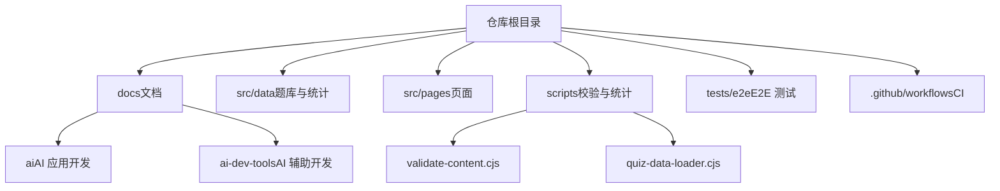
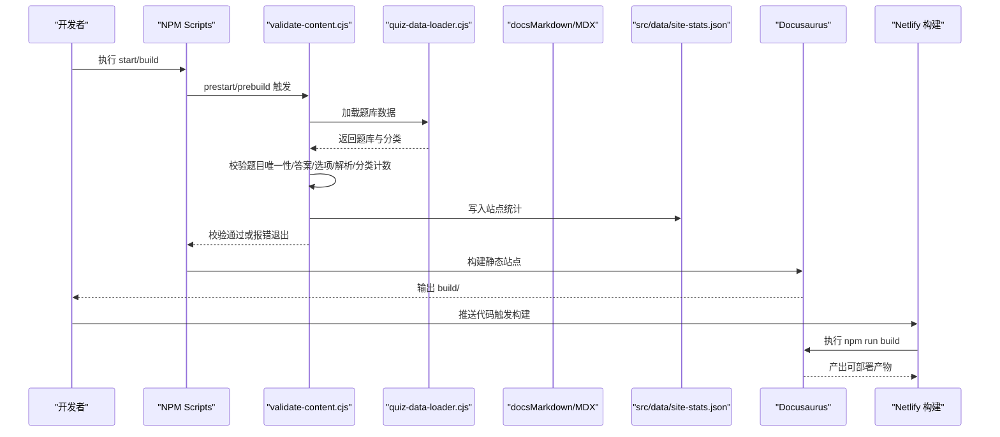
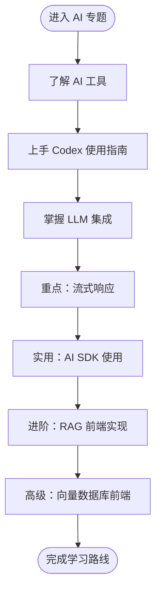
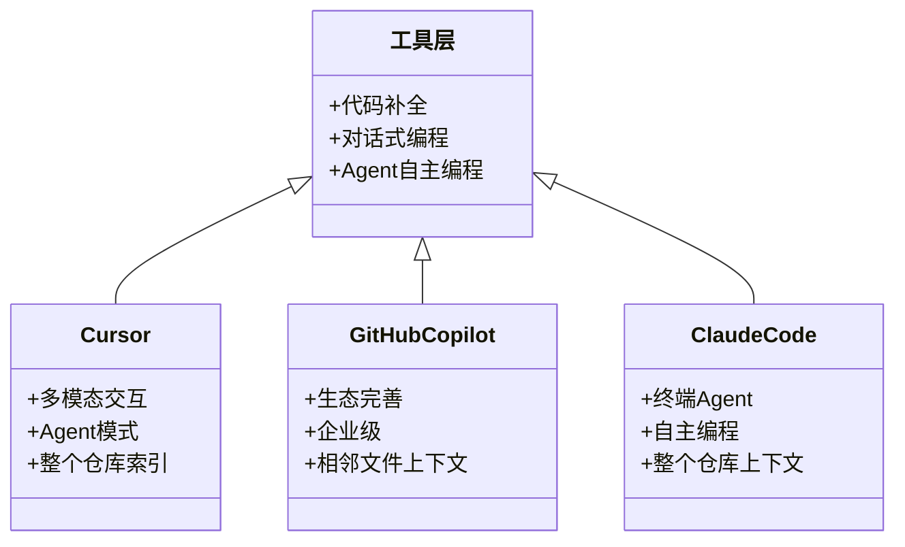
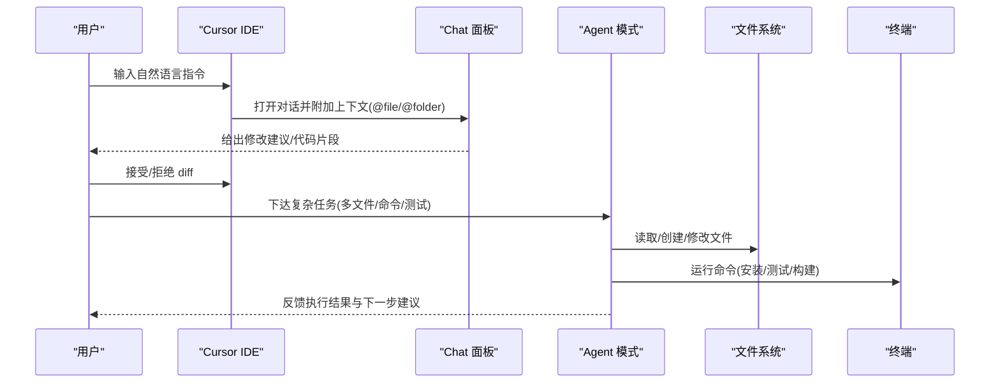
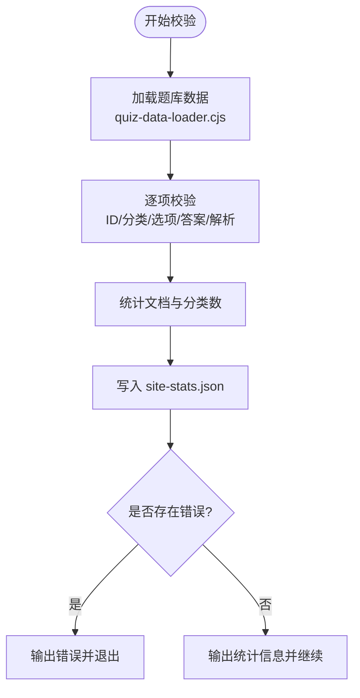
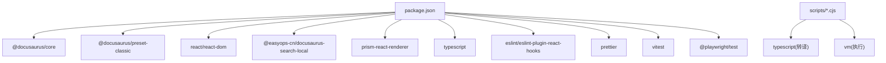

# AI辅助开发工具

<cite>
**本文引用的文件**
- [README.md](file://README.md)
- [package.json](file://package.json)
- [intro.md](file://docs/intro.md)
- [about.md](file://docs/about.md)
- [ai/index.md](file://docs/ai/index.md)
- [ai-dev-tools/index.md](file://docs/ai-dev-tools/index.md)
- [ai-dev-tools/cursor-guide.md](file://docs/ai-dev-tools/cursor-guide.md)
- [scripts/validate-content.cjs](file://scripts/validate-content.cjs)
- [scripts/quiz-data-loader.cjs](file://scripts/quiz-data-loader.cjs)
</cite>

## 目录
1. [简介](#简介)
2. [项目结构](#项目结构)
3. [核心组件](#核心组件)
4. [架构总览](#架构总览)
5. [详细组件分析](#详细组件分析)
6. [依赖分析](#依赖分析)
7. [性能考虑](#性能考虑)
8. [故障排查指南](#故障排查指南)
9. [结论](#结论)
10. [附录](#附录)

## 简介
本项目是一个基于 Docusaurus 的前端面试与 AI 开发知识库，提供系统化文档、在线测验、错题本和答题历史。内容覆盖 JavaScript、TypeScript、React、Vue、浏览器、网络、工程化、AI、性能优化等专题，并特别包含 AI 应用开发与 AI 辅助开发工具的专题文档。

- 项目规模：238 篇知识文档、255 道测验题、47 个内容分类
- 本地开发要求 Node.js 20+
- 构建与部署：Docusaurus 静态站点生成，Netlify 使用 npm run build 构建并发布 build/

章节来源
- [README.md:1-88](file://README.md#L1-L88)
- [package.json:1-67](file://package.json#L1-L67)
- [intro.md:1-36](file://docs/intro.md#L1-L36)
- [about.md:1-111](file://docs/about.md#L1-L111)

## 项目结构
仓库采用“文档驱动 + 脚本校验”的结构：
- docs：Markdown/MDX 文档（含 AI 与 AI 辅助开发专题）
- src/data：题库与自动生成的站点统计
- src/pages：首页与测验页面
- scripts：内容统计与题库校验脚本
- tests/e2e：Playwright 端到端测试
- .github/workflows：持续集成配置

图表来源
- [README.md:51-61](file://README.md#L51-L61)
- [package.json:5-24](file://package.json#L5-L24)

章节来源
- [README.md:51-61](file://README.md#L51-L61)
- [package.json:5-24](file://package.json#L5-L24)

## 核心组件
- 文档体系：以 docs 为内容源，按主题分目录组织，AI 相关集中在 ai 与 ai-dev-tools 两个子目录
- 测验系统：题库数据位于 src/data，通过脚本在启动/构建前进行质量校验，并生成站点统计
- 构建与运行：Docusaurus 负责静态站点生成；npm scripts 串联校验、类型检查、Lint、格式化、测试与构建
- 部署：Netlify 使用 npm run build 产出 build/ 目录

章节来源
- [README.md:14-34](file://README.md#L14-L34)
- [README.md:81-83](file://README.md#L81-L83)
- [package.json:5-24](file://package.json#L5-L24)

## 架构总览
从“内容生产 → 质量校验 → 站点构建 → 部署发布”的流水线如下：

图表来源
- [package.json:5-24](file://package.json#L5-L24)
- [scripts/validate-content.cjs:1-55](file://scripts/validate-content.cjs#L1-L55)
- [scripts/quiz-data-loader.cjs:1-17](file://scripts/quiz-data-loader.cjs#L1-L17)
- [README.md:81-83](file://README.md#L81-L83)

## 详细组件分析

### AI 应用开发专题（docs/ai）
- 内容导航：LLM 集成、流式响应、RAG 前端实现、AI SDK 使用、AI 工具、Codex 使用指南、向量数据库前端
- 学习路线：从入门到进阶的渐进路径
- 面试考察重点：API 设计、Token 管理、成本控制、SSE vs WebSocket、RAG 架构、Vercel AI SDK 使用、实际场景落地

图表来源
- [ai/index.md:1-41](file://docs/ai/index.md#L1-L41)

章节来源
- [ai/index.md:1-41](file://docs/ai/index.md#L1-L41)

### AI 辅助开发概述（docs/ai-dev-tools/index.md）
- 时代背景：2023-2026 工具演进时间线，AI IDE 元年
- 工具生态全景图：代码补全 → 对话式编程 → Agent 自主编程
- 主流工具对比：Cursor、GitHub Copilot、Cline、WindSurf、Augment、Claude Code
- 效率提升数据：多项行业研究结论
- 局限性：幻觉、上下文限制、安全风险、一致性、复杂逻辑、调试能力
- 选型指南：个人/小型团队/企业级推荐方案
- 学习路线建议：三阶段进阶路径

图表来源
- [ai-dev-tools/index.md:1-223](file://docs/ai-dev-tools/index.md#L1-L223)

章节来源
- [ai-dev-tools/index.md:1-223](file://docs/ai-dev-tools/index.md#L1-L223)

### Cursor IDE 完全指南（docs/ai-dev-tools/cursor-guide.md）
- 定位：AI-first IDE，VS Code 深度定制，兼容插件生态与快捷键
- 核心功能：Tab 补全、Cmd+K 内联编辑、Chat 对话（@file/@folder/@docs/@web/@code/@git）、Composer 多文件编辑、Agent 模式
- 快捷键速查表：macOS 与 Windows/Linux 对照
- .cursorrules 配置：编码规范、样式规范、注释要求、禁止事项
- 实战案例：React 组件生成、Agent 修复 Bug
- 高级技巧：上下文管理、Prompt 优化建议
- 常见问题与解决方案：补全速度、风格一致性、Agent 卡住、引用无效、上下文丢失、模型输出截断
- 安全提醒：云端处理与隐私模式

图表来源
- [ai-dev-tools/cursor-guide.md:1-384](file://docs/ai-dev-tools/cursor-guide.md#L1-L384)

章节来源
- [ai-dev-tools/cursor-guide.md:1-384](file://docs/ai-dev-tools/cursor-guide.md#L1-L384)

### 测验系统与内容校验（scripts）
- 题库加载器：使用 TypeScript 编译与 vm 执行，动态加载 src/data/quiz-questions.ts
- 内容校验器：校验题目 ID 唯一、分类合法、选项不重复、答案存在且结构正确、解析非空、分类统计与实际一致；同时统计文档数量与分类数，写入 src/data/site-stats.json
- 触发时机：prestart 与 prebuild 钩子自动执行，确保构建前数据质量

图表来源
- [scripts/quiz-data-loader.cjs:1-17](file://scripts/quiz-data-loader.cjs#L1-L17)
- [scripts/validate-content.cjs:1-55](file://scripts/validate-content.cjs#L1-L55)
- [package.json:16-18](file://package.json#L16-L18)

章节来源
- [scripts/quiz-data-loader.cjs:1-17](file://scripts/quiz-data-loader.cjs#L1-L17)
- [scripts/validate-content.cjs:1-55](file://scripts/validate-content.cjs#L1-L55)
- [package.json:16-18](file://package.json#L16-L18)

## 依赖分析
- 运行时依赖：Docusaurus 3、React 19、搜索插件、Prism 语法高亮等
- 开发依赖：TypeScript、ESLint、Prettier、Vitest、Playwright
- 脚本依赖：Node.js fs/path/vm、TypeScript（用于转译题库 TS 文件）

图表来源
- [package.json:26-50](file://package.json#L26-L50)
- [scripts/quiz-data-loader.cjs:1-17](file://scripts/quiz-data-loader.cjs#L1-L17)

章节来源
- [package.json:26-50](file://package.json#L26-L50)
- [scripts/quiz-data-loader.cjs:1-17](file://scripts/quiz-data-loader.cjs#L1-L17)

## 性能考虑
- 构建前校验：通过 prestart/prebuild 钩子提前发现数据问题，避免无效构建
- 静态站点：Docusaurus 生成静态路由与 404 页面，无需 SPA 全站重定向，利于缓存与 CDN 分发
- 内容体积：合理拆分文档与图片资源，按需启用搜索索引
- 测试策略：单元测试与 E2E 并行执行，缩短反馈周期

[本节为通用指导，不直接分析具体文件]

## 故障排查指南
- 题库校验失败
  - 常见原因：题目 ID 重复、未知分类、选项值重复、答案不在选项中、单选/多选答案结构不正确、分类统计不一致
  - 解决步骤：根据控制台错误提示修正对应题目或分类；确保解析与思路字段非空
- 构建失败
  - 可能原因：Node 版本过低、依赖未安装、脚本校验未通过
  - 解决步骤：升级至 Node.js 20+；执行 npm ci；先运行 npm run validate:content 确认数据质量
- E2E 测试环境缺失
  - 现象：Playwright 找不到 Chromium
  - 解决步骤：执行 npx playwright install chromium

章节来源
- [README.md:63-79](file://README.md#L63-L79)
- [scripts/validate-content.cjs:1-55](file://scripts/validate-content.cjs#L1-L55)
- [package.json:16-24](file://package.json#L16-L24)

## 结论
本项目将“AI 应用开发”与“AI 辅助开发工具”两大前沿方向纳入系统化知识库，并通过严格的脚本校验保障内容质量。借助 Docusaurus 的静态站点能力与 CI/CD 流程，可实现高效的内容生产与稳定的发布体验。对于学习者而言，遵循专题学习路线与工具选型建议，能够快速掌握 AI 在前端领域的集成与实践。

[本节为总结性内容，不直接分析具体文件]

## 附录
- 快速开始
  - 安装依赖：npm ci
  - 启动开发服务器：npm start
  - 构建生产包：npm run build
  - 完整质量检查：npm run check
- 贡献规范
  - 新增题目需符合题库数据结构与校验规则
  - 提交前请确保构建、类型检查、Lint、格式化、单元测试与内容校验全部通过

章节来源
- [README.md:14-34](file://README.md#L14-L34)
- [README.md:63-79](file://README.md#L63-L79)
- [about.md:61-102](file://docs/about.md#L61-L102)