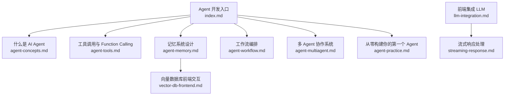
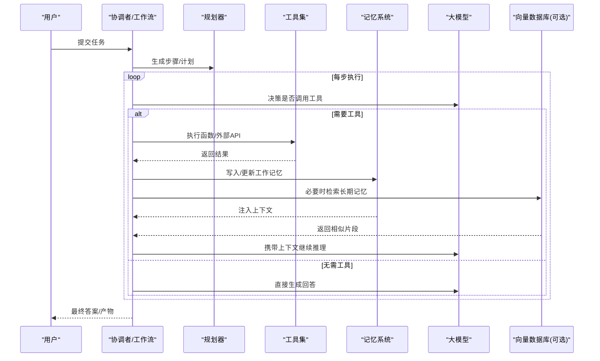
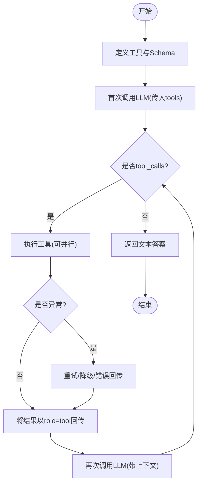
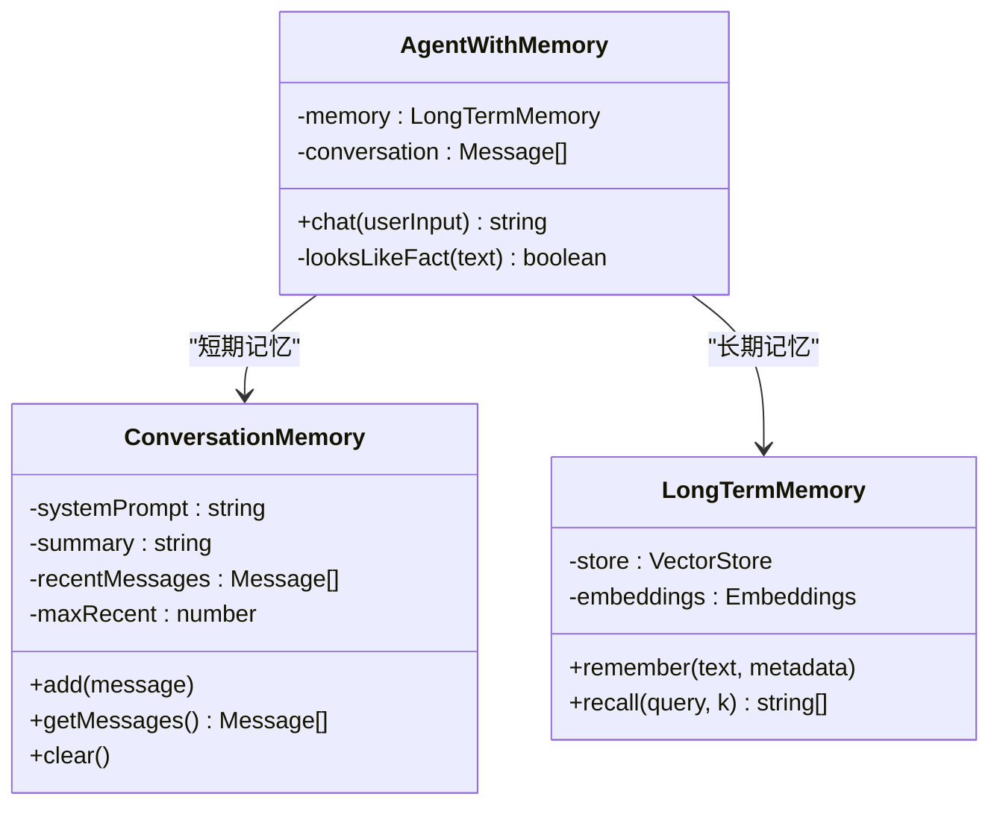
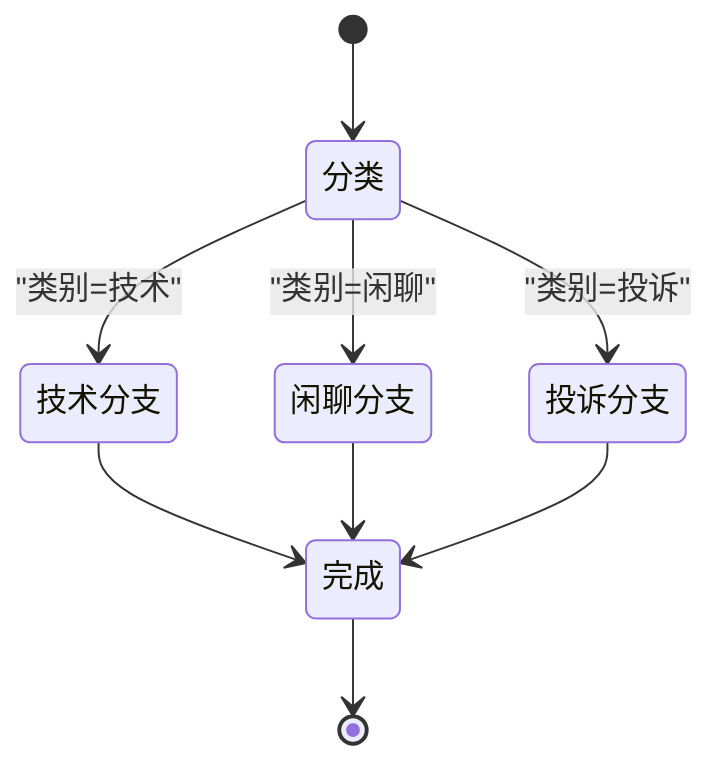
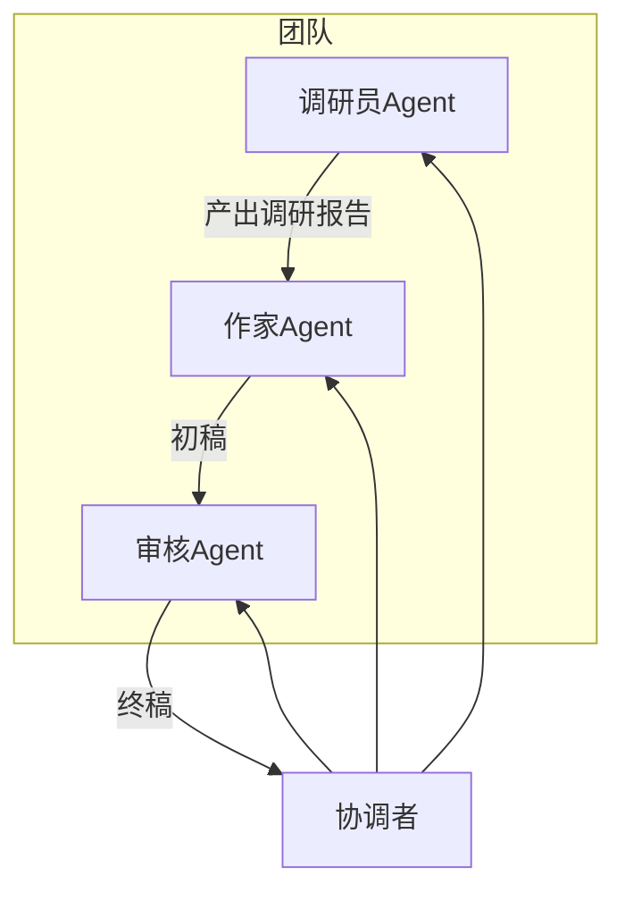
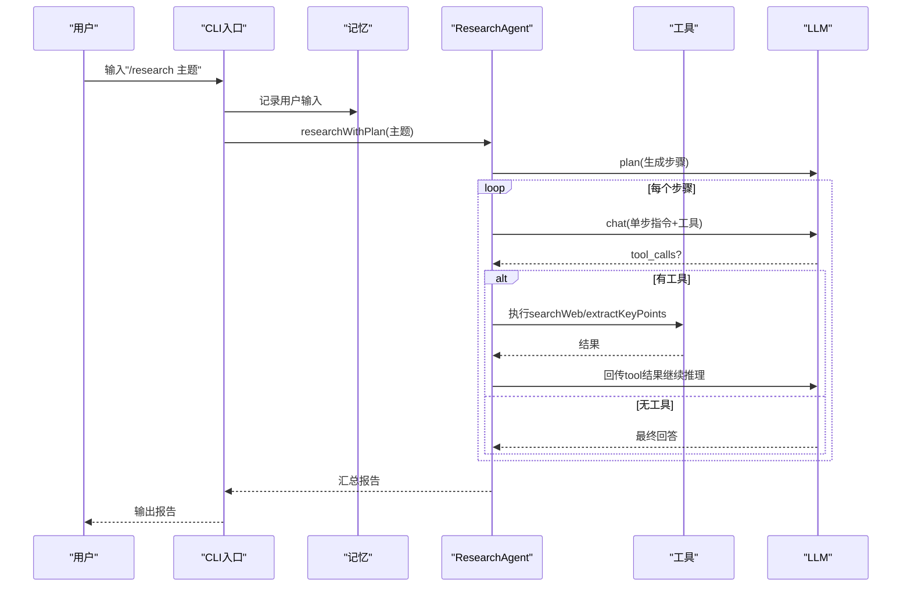
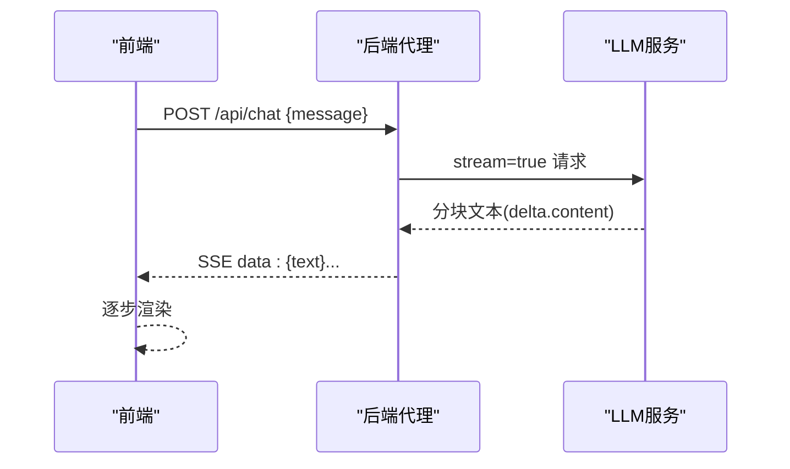
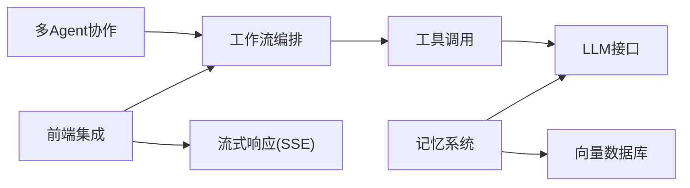

# Agent 开发专题

<cite>
**本文引用的文件**   
- [docs/agent-development/index.md](file://docs/agent-development/index.md)
- [docs/agent-development/agent-concepts.md](file://docs/agent-development/agent-concepts.md)
- [docs/agent-development/agent-tools.md](file://docs/agent-development/agent-tools.md)
- [docs/agent-development/agent-memory.md](file://docs/agent-development/agent-memory.md)
- [docs/agent-development/agent-workflow.md](file://docs/agent-development/agent-workflow.md)
- [docs/agent-development/agent-multiagent.md](file://docs/agent-development/agent-multiagent.md)
- [docs/agent-development/agent-practice.md](file://docs/agent-development/agent-practice.md)
- [docs/ai/llm-integration.md](file://docs/ai/llm-integration.md)
- [docs/ai/streaming-response.md](file://docs/ai/streaming-response.md)
- [docs/ai/vector-db-frontend.md](file://docs/ai/vector-db-frontend.md)
</cite>

## 目录
1. [引言](#引言)
2. [项目结构](#项目结构)
3. [核心组件](#核心组件)
4. [架构总览](#架构总览)
5. [详细组件分析](#详细组件分析)
6. [依赖关系分析](#依赖关系分析)
7. [性能与成本考量](#性能与成本考量)
8. [故障排查指南](#故障排查指南)
9. [结论](#结论)
10. [附录：学习路径与最佳实践](#附录学习路径与最佳实践)

## 引言
本专题面向希望从零构建 AI Agent 的开发者，系统梳理“感知—规划—行动—记忆—反思”的核心链路，结合仓库中的实战文档，给出从概念到落地的完整知识图谱。内容覆盖 Agent 基础、工具调用（Function Calling）、记忆系统、工作流编排、多 Agent 协作，以及一个可运行的调研 Agent 实战案例，并补充前端集成 LLM 与流式响应等工程化要点。

## 项目结构
Agent 开发相关文档集中在 docs/agent-development 目录下，辅以 docs/ai 下的 LLM 集成与流式输出指南，形成“理论 + 实战 + 工程”三位一体的学习体系。

图表来源
- [docs/agent-development/index.md:1-140](file://docs/agent-development/index.md#L1-L140)
- [docs/ai/llm-integration.md:1-103](file://docs/ai/llm-integration.md#L1-L103)
- [docs/ai/streaming-response.md:1-166](file://docs/ai/streaming-response.md#L1-L166)
- [docs/ai/vector-db-frontend.md:1-178](file://docs/ai/vector-db-frontend.md#L1-L178)

章节来源
- [docs/agent-development/index.md:1-140](file://docs/agent-development/index.md#L1-L140)

## 核心组件
- Agent 基础认知：定义、与 Chatbot 的区别、四大特征（自主性、工具使用、规划能力、记忆能力）与典型场景
- 工具调用（Function Calling）：Schema 设计、执行分发器、错误重试与降级、串行/并行/条件编排
- 记忆系统：短期（滑动窗口/摘要压缩）、长期（向量检索）、工作记忆（任务中间态），上下文窗口管理技巧
- 工作流编排：顺序、分支、循环；LangGraph 图模型；人机协作（HITL）；可视化与调试；错误处理策略
- 多 Agent 协作：主从/对等/层级模式；通信机制（消息/黑板）；角色设计与冲突解决；CrewAI 思想
- 实战项目：信息调研 Agent（对话→工具→记忆→规划→健壮性），含运行效果与部署优化建议
- 工程化：前端安全集成 LLM、SSE 流式输出、向量数据库前端交互

章节来源
- [docs/agent-development/agent-concepts.md:1-198](file://docs/agent-development/agent-concepts.md#L1-L198)
- [docs/agent-development/agent-tools.md:1-449](file://docs/agent-development/agent-tools.md#L1-L449)
- [docs/agent-development/agent-memory.md:1-400](file://docs/agent-development/agent-memory.md#L1-L400)
- [docs/agent-development/agent-workflow.md:1-465](file://docs/agent-development/agent-workflow.md#L1-L465)
- [docs/agent-development/agent-multiagent.md:1-550](file://docs/agent-development/agent-multiagent.md#L1-L550)
- [docs/agent-development/agent-practice.md:1-666](file://docs/agent-development/agent-practice.md#L1-L666)
- [docs/ai/llm-integration.md:1-103](file://docs/ai/llm-integration.md#L1-L103)
- [docs/ai/streaming-response.md:1-166](file://docs/ai/streaming-response.md#L1-L166)
- [docs/ai/vector-db-frontend.md:1-178](file://docs/ai/vector-db-frontend.md#L1-L178)

## 架构总览
下图展示了一个通用 Agent 系统的端到端流程：用户输入进入协调层，依次经过规划、工具调用、记忆读写、结果汇总与输出；在复杂场景中可扩展为多 Agent 协作与工作流编排。

图表来源
- [docs/agent-development/agent-tools.md:1-449](file://docs/agent-development/agent-tools.md#L1-L449)
- [docs/agent-development/agent-memory.md:1-400](file://docs/agent-development/agent-memory.md#L1-L400)
- [docs/agent-development/agent-workflow.md:1-465](file://docs/agent-development/agent-workflow.md#L1-L465)
- [docs/agent-development/agent-multiagent.md:1-550](file://docs/agent-development/agent-multiagent.md#L1-L550)
- [docs/ai/vector-db-frontend.md:1-178](file://docs/ai/vector-db-frontend.md#L1-L178)

## 详细组件分析

### 组件一：工具调用与 Function Calling
- 工作原理：提供工具 Schema → 模型决定调用哪个工具及参数 → 你的代码执行函数 → 将结果以 tool 角色回传模型 → 模型据此作答
- 关键实现要点
  - Tool Schema 用 JSON Schema 描述，name 语义化、description 具体、required 准确
  - 工具执行分发器集中管理，支持注册表避免 switch-case 膨胀
  - 错误处理：指数退避重试、把错误作为 tool 结果让模型自我纠错、超时与降级
  - 编排模式：串行（依赖链）、并行（Promise.all）、条件（动态路由）
- 复杂度与性能
  - 单次调用 O(1)，并行调用受限于并发上限与外部 API 吞吐
  - 工具数量建议控制在 5~15 个，过多会降低选择准确率
- 参考路径
  - [工具定义与 Schema:115-156](file://docs/agent-development/agent-tools.md#L115-L156)
  - [完整示例与 ReAct 循环:157-262](file://docs/agent-development/agent-tools.md#L157-L262)
  - [错误处理与重试:263-316](file://docs/agent-development/agent-tools.md#L263-L316)
  - [工具注册表与类型安全:317-381](file://docs/agent-development/agent-tools.md#L317-L381)
  - [串行/并行/条件编排:389-436](file://docs/agent-development/agent-tools.md#L389-L436)

图表来源
- [docs/agent-development/agent-tools.md:1-449](file://docs/agent-development/agent-tools.md#L1-L449)

章节来源
- [docs/agent-development/agent-tools.md:1-449](file://docs/agent-development/agent-tools.md#L1-L449)

### 组件二：记忆系统设计
- 三种记忆
  - 短期记忆：对话历史，滑动窗口或摘要压缩控制 Token
  - 长期记忆：向量数据库，Embedding 存储与相似度检索
  - 工作记忆：任务执行中间状态（临时变量/状态）
- 关键实现要点
  - 滑动窗口保留 System Prompt，避免人设丢失
  - 摘要压缩触发阈值与增量合并策略
  - 长期记忆写入时机（事实/偏好/关键结果）、检索时机（关键词/小模型判断）、遗忘策略（过期+重要性）
  - 上下文窗口管理：Token 估算、分层保留、Top-K 检索、工具结果精简
- 复杂度与性能
  - 写入 O(logN) 或 O(1) 取决于底层存储；检索 Top-K 近似最近邻，K 越大越慢
  - 建议只取 Top-K 最相关片段，避免上下文爆炸
- 参考路径
  - [短期记忆：滑动窗口/摘要压缩](file://docs/agent-development/agent-memory.md:53-L166)
  - [长期记忆：向量数据库与示例](file://docs/agent-development/agent-memory.md:167-L285)
  - [记忆管理策略：何时存/取/忘](file://docs/agent-development/agent-memory.md:287-L349)
  - [上下文窗口管理技巧](file://docs/agent-development/agent-memory.md:351-L387)

图表来源
- [docs/agent-development/agent-memory.md:53-166](file://docs/agent-development/agent-memory.md#L53-L166)
- [docs/agent-development/agent-memory.md:167-285](file://docs/agent-development/agent-memory.md#L167-L285)

章节来源
- [docs/agent-development/agent-memory.md:1-400](file://docs/agent-development/agent-memory.md#L1-L400)

### 组件三：工作流编排
- 常见模式
  - 顺序：A→B→C 流水线
  - 条件分支：根据分类/评分路由不同处理节点
  - 循环：写稿→评估→不达标再写，直到分数达标或达到最大迭代
- LangGraph 图模型
  - 节点（Node）= 处理步骤；边（Edge）= 跳转；条件边 = 按状态路由；状态（State）= 共享数据
  - 优势：可视化、状态自动传递、持久化 checkpoint
- 人机协作（HITL）
  - 高风险操作暂停等待人工确认（前端按钮/审核台/审批流）
- 调试与错误处理
  - 节点日志包装、重试/降级/跳过/中断/回滚策略
- 参考路径
  - [顺序/分支/循环工作流](file://docs/agent-development/agent-workflow.md:27-L218)
  - [LangGraph 示例](file://docs/agent-development/agent-workflow.md:220-L331)
  - [人机协作模式](file://docs/agent-development/agent-workflow.md:332-L382)
  - [调试与错误处理](file://docs/agent-development/agent-workflow.md:383-L452)

图表来源
- [docs/agent-development/agent-workflow.md:70-156](file://docs/agent-development/agent-workflow.md#L70-L156)

章节来源
- [docs/agent-development/agent-workflow.md:1-465](file://docs/agent-development/agent-workflow.md#L1-L465)

### 组件四：多 Agent 协作系统
- 协作模式
  - 主从（Hub-and-Spoke）：中心协调，清晰可控
  - 对等（P2P）：灵活并行，易发散
  - 层级：适合超大型任务，但信息失真风险高
- 通信机制
  - 直接消息传递；共享黑板（Blackboard）
- 角色设计与冲突解决
  - 职责不重叠、目标可衡量、工具专精、边界明确
  - 仲裁者、投票、迭代收敛
- 参考路径
  - [协作模式与通信](file://docs/agent-development/agent-multiagent.md:18-L187)
  - [角色设计与 CrewAI 思路](file://docs/agent-development/agent-multiagent.md:189-L308)
  - [冲突解决与双 Agent 实战](file://docs/agent-development/agent-multiagent.md:310-L518)

图表来源
- [docs/agent-development/agent-multiagent.md:385-518](file://docs/agent-development/agent-multiagent.md#L385-L518)

章节来源
- [docs/agent-development/agent-multiagent.md:1-550](file://docs/agent-development/agent-multiagent.md#L1-L550)

### 组件五：从零构建你的第一个 Agent（调研助手）
- 分步演进
  - Step 1 基础对话：OpenAI SDK 调用
  - Step 2 添加工具：searchWeb、extractKeyPoints，ReAct 循环
  - Step 3 添加记忆：滑动窗口 + 摘要
  - Step 4 添加规划：plan → researchWithPlan
  - Step 5 健壮性：错误处理、重试、交互命令
- 运行效果与扩展
  - 终端交互、深度调研命令 /research
  - 部署优化：真实搜索 API、流式输出、Web 界面、成本控制
- 参考路径
  - [Step 1-5 完整实现](file://docs/agent-development/agent-practice.md:85-L577)
  - [运行效果与部署建议](file://docs/agent-development/agent-practice.md:579-L625)

图表来源
- [docs/agent-development/agent-practice.md:387-577](file://docs/agent-development/agent-practice.md#L387-L577)

章节来源
- [docs/agent-development/agent-practice.md:1-666](file://docs/agent-development/agent-practice.md#L1-L666)

### 组件六：前端集成 LLM 与流式响应
- 安全集成
  - 永远不在前端暴露 API Key，通过后端代理转发
  - 鉴权、限流、内容过滤
- 流式输出
  - SSE（Server-Sent Events）单向流，适合 LLM 逐字输出
  - 前端可用原生 Fetch + ReadableStream 或 Vercel AI SDK
- 参考路径
  - [前端集成 LLM](file://docs/ai/llm-integration.md:1-L103)
  - [流式响应处理](file://docs/ai/streaming-response.md:1-L166)

图表来源
- [docs/ai/llm-integration.md:1-103](file://docs/ai/llm-integration.md#L1-L103)
- [docs/ai/streaming-response.md:1-166](file://docs/ai/streaming-response.md#L1-L166)

章节来源
- [docs/ai/llm-integration.md:1-103](file://docs/ai/llm-integration.md#L1-L103)
- [docs/ai/streaming-response.md:1-166](file://docs/ai/streaming-response.md#L1-L166)

### 组件七：向量数据库前端交互
- 上传与处理：前端上传文件 → 后端切块/Embedding → 存入向量库 → 前端轮询进度
- 语义搜索：前端发起查询 → 后端计算向量相似度 → 返回 Top-K 结果
- 可视化：t-SNE/PCA 降维展示向量分布
- 参考路径
  - [向量数据库前端交互](file://docs/ai/vector-db-frontend.md:1-L178)

章节来源
- [docs/ai/vector-db-frontend.md:1-178](file://docs/ai/vector-db-frontend.md#L1-L178)

## 依赖关系分析
- 模块内聚与耦合
  - 工具调用与 ReAct 循环强耦合于 LLM 接口；记忆系统与向量库解耦良好，便于替换存储
  - 工作流编排与具体 Agent 解耦，可通过 LangGraph 复用
  - 多 Agent 协作通过消息/黑板抽象通信，降低耦合度
- 外部依赖
  - OpenAI SDK（或兼容接口）
  - 向量数据库（本地 MemoryVectorStore 或生产级 Pinecone/Weaviate/Qdrant/Milvus/pgvector）
  - 前端流式：SSE 或 WebSocket（推荐 SSE 用于单向流）

图表来源
- [docs/agent-development/agent-tools.md:1-449](file://docs/agent-development/agent-tools.md#L1-L449)
- [docs/agent-development/agent-memory.md:1-400](file://docs/agent-development/agent-memory.md#L1-L400)
- [docs/agent-development/agent-workflow.md:1-465](file://docs/agent-development/agent-workflow.md#L1-L465)
- [docs/agent-development/agent-multiagent.md:1-550](file://docs/agent-development/agent-multiagent.md#L1-L550)
- [docs/ai/llm-integration.md:1-103](file://docs/ai/llm-integration.md#L1-L103)
- [docs/ai/streaming-response.md:1-166](file://docs/ai/streaming-response.md#L1-L166)
- [docs/ai/vector-db-frontend.md:1-178](file://docs/ai/vector-db-frontend.md#L1-L178)

## 性能与成本考量
- 工具调用
  - 并行执行独立工具，减少整体时延
  - 限制工具数量，提升选择准确率
  - 失败重试采用指数退避，避免雪崩
- 记忆系统
  - 滑动窗口 + 摘要压缩控制 Token 用量
  - 长期记忆仅取 Top-K，避免上下文爆炸
  - 估算 Token 数并裁剪，确保不超过上下文窗口
- 工作流
  - 关键节点加重试与降级，非关键节点失败可跳过
  - HITL 仅在高风险路径启用，避免阻塞
- 前端流式
  - 优先 SSE，减少连接开销
  - 合理设置断线重连与中止（AbortController）
- 成本优化
  - 规划阶段用小模型，关键步骤用更强模型
  - 缓存高频结果，减少重复调用

[本节为通用指导，不直接分析具体文件]

## 故障排查指南
- 工具调用失败
  - 检查 Tool Schema 的 required 与 description 是否足够明确
  - 查看工具执行日志与错误回传，确认参数是否正确
  - 增加重试与降级策略，必要时提示用户换种方式
  - 参考路径：[错误处理与重试](file://docs/agent-development/agent-tools.md:263-L316)
- 上下文溢出
  - 使用滑动窗口与摘要压缩，确保 System Prompt 不被丢弃
  - 控制 Top-K 检索数量，精简工具结果
  - 参考路径：[上下文窗口管理技巧](file://docs/agent-development/agent-memory.md:351-L387)
- 工作流卡死或死循环
  - 设置最大迭代次数与退出条件
  - 为每个节点加日志，定位瓶颈
  - 参考路径：[调试与错误处理](file://docs/agent-development/agent-workflow.md:383-L452)
- 多 Agent 冲突
  - 引入仲裁者或投票机制，限制讨论轮次
  - 使用共享黑板减少信息失真
  - 参考路径：[冲突解决与共识机制](file://docs/agent-development/agent-multiagent.md:310-L384)
- 前端流式问题
  - 检查 Content-Type 与事件格式，确保 [DONE] 终止信号
  - 处理网络中断与重连
  - 参考路径：[流式响应处理](file://docs/ai/streaming-response.md:1-L166)

章节来源
- [docs/agent-development/agent-tools.md:263-316](file://docs/agent-development/agent-tools.md#L263-L316)
- [docs/agent-development/agent-memory.md:351-387](file://docs/agent-development/agent-memory.md#L351-L387)
- [docs/agent-development/agent-workflow.md:383-452](file://docs/agent-development/agent-workflow.md#L383-L452)
- [docs/agent-development/agent-multiagent.md:310-384](file://docs/agent-development/agent-multiagent.md#L310-L384)
- [docs/ai/streaming-response.md:1-166](file://docs/ai/streaming-response.md#L1-L166)

## 结论
- Agent 的本质是“思考—行动—观察”的闭环，围绕工具调用、记忆、规划与工作流展开
- 先掌握单 Agent 的 ReAct 循环与记忆管理，再扩展到工作流与多 Agent 协作
- 工程化落地需重视安全、流式体验、错误处理与成本控制
- 本专题提供的实战路径与图示有助于快速上手并持续优化

[本节为总结性内容，不直接分析具体文件]

## 附录：学习路径与最佳实践
- 学习路线
  - 建立认知：什么是 AI Agent、与 Chatbot 的区别
  - 理解骨架：架构模式（ReAct、Plan-and-Execute、状态机）
  - 学会动手：工具调用与 Function Calling
  - 学会记住：短期/长期/工作记忆与上下文管理
  - 学会思考：规划与推理（思维链、任务分解、自我反思）
  - 学会组织：工作流编排（顺序/分支/循环、LangGraph、HITL）
  - 学会协作：多 Agent 协作（主从/对等/层级、冲突解决）
  - 综合实战：从零构建调研 Agent
  - 持续打磨：Prompt 工程与用户体验优化
- 最佳实践清单
  - 工具单一职责、Schema 描述具体、数量适中
  - 记忆“何时存/取/忘”，严格控制上下文长度
  - 工作流可视化与节点日志，关键路径加重试与降级
  - 多 Agent 谨慎拆分，能单 Agent 就别多 Agent
  - 前端安全集成 LLM，优先 SSE 流式输出

章节来源
- [docs/agent-development/index.md:40-70](file://docs/agent-development/index.md#L40-L70)
- [docs/agent-development/agent-concepts.md:1-198](file://docs/agent-development/agent-concepts.md#L1-L198)
- [docs/agent-development/agent-tools.md:1-449](file://docs/agent-development/agent-tools.md#L1-L449)
- [docs/agent-development/agent-memory.md:1-400](file://docs/agent-development/agent-memory.md#L1-L400)
- [docs/agent-development/agent-workflow.md:1-465](file://docs/agent-development/agent-workflow.md#L1-L465)
- [docs/agent-development/agent-multiagent.md:1-550](file://docs/agent-development/agent-multiagent.md#L1-L550)
- [docs/agent-development/agent-practice.md:1-666](file://docs/agent-development/agent-practice.md#L1-L666)