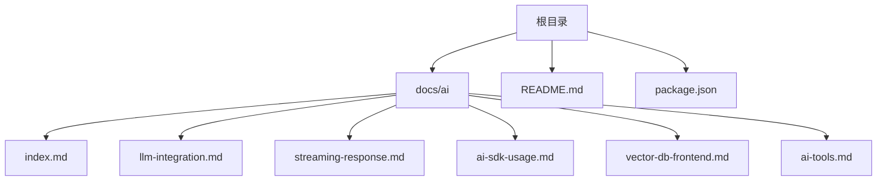
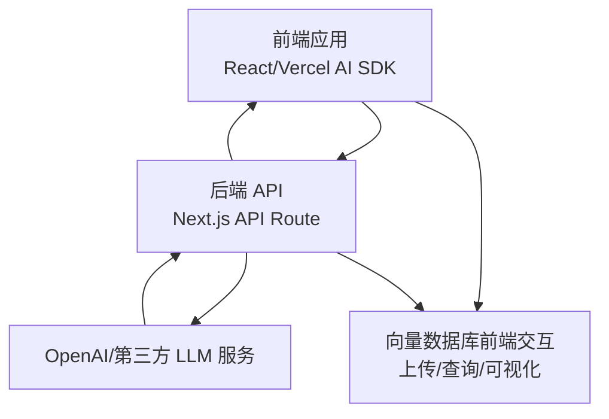
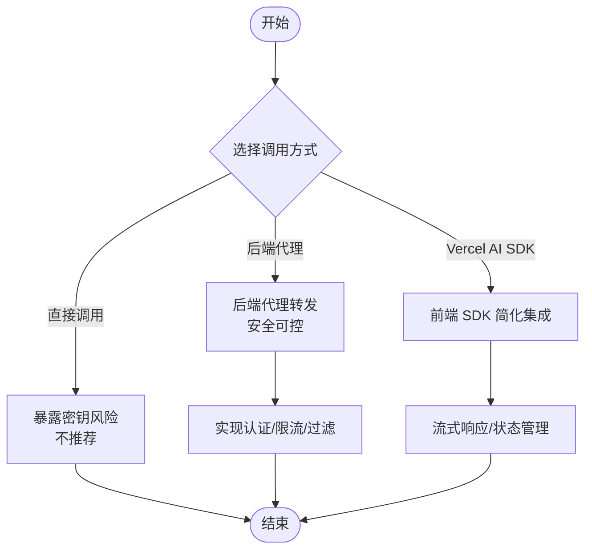
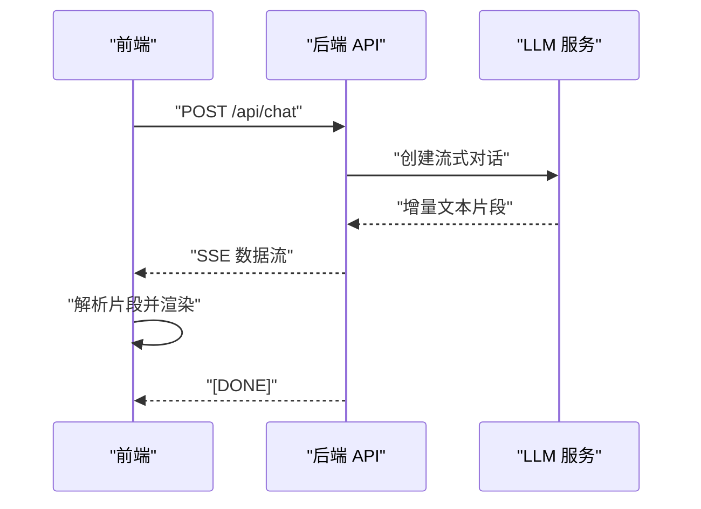
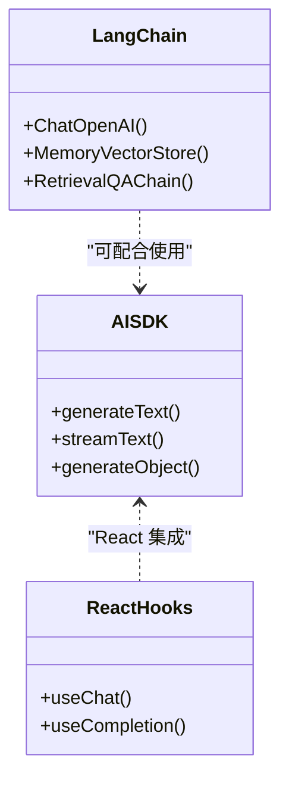
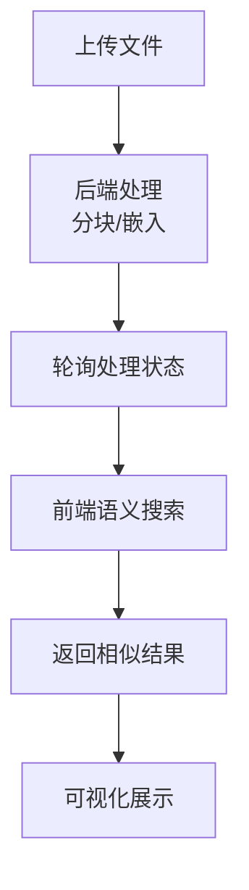
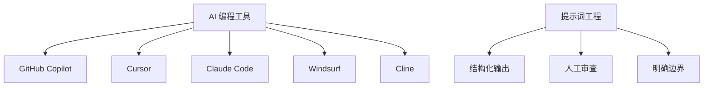
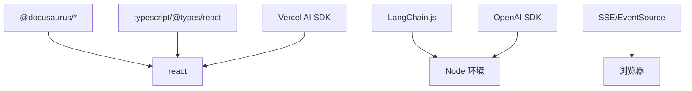

# LLM 集成与应用

<cite>
**本文引用的文件**
- [README.md](file://README.md)
- [package.json](file://package.json)
- [docs/ai/index.md](file://docs/ai/index.md)
- [docs/ai/llm-integration.md](file://docs/ai/llm-integration.md)
- [docs/ai/streaming-response.md](file://docs/ai/streaming-response.md)
- [docs/ai/ai-sdk-usage.md](file://docs/ai/ai-sdk-usage.md)
- [docs/ai/vector-db-frontend.md](file://docs/ai/vector-db-frontend.md)
- [docs/ai/ai-tools.md](file://docs/ai/ai-tools.md)
</cite>

## 目录
1. [简介](#简介)
2. [项目结构](#项目结构)
3. [核心组件](#核心组件)
4. [架构总览](#架构总览)
5. [详细组件分析](#详细组件分析)
6. [依赖关系分析](#依赖关系分析)
7. [性能考量](#性能考量)
8. [故障排查指南](#故障排查指南)
9. [结论](#结论)
10. [附录](#附录)

## 简介
本技术文档围绕“大语言模型（LLM）集成与应用”展开，结合仓库中的 AI 相关文档，系统讲解前端集成 LLM 的安全策略、流式响应处理、AI SDK 使用、向量数据库前端交互以及 AI 编程工具的应用。文档重点覆盖以下主题：
- 前端调用 LLM 的三种方式与安全注意事项
- 流式响应（SSE）的实现与消费
- Vercel AI SDK 与 LangChain.js 的使用与对比
- 向量数据库的前端交互与语义搜索
- 提示词工程、温度参数调优与上下文管理的最佳实践
- 常见错误处理与性能优化建议

## 项目结构
该仓库采用 Docusaurus 静态站点生成器，AI 相关内容集中在 docs/ai 目录下，包含多个专题文档，涵盖从基础集成到高级应用的完整路径。

图表来源
- [docs/ai/index.md:1-16](file://docs/ai/index.md#L1-L16)
- [docs/ai/llm-integration.md:1-103](file://docs/ai/llm-integration.md#L1-L103)
- [docs/ai/streaming-response.md:1-166](file://docs/ai/streaming-response.md#L1-L166)
- [docs/ai/ai-sdk-usage.md:1-139](file://docs/ai/ai-sdk-usage.md#L1-L139)
- [docs/ai/vector-db-frontend.md:1-178](file://docs/ai/vector-db-frontend.md#L1-L178)
- [docs/ai/ai-tools.md:1-150](file://docs/ai/ai-tools.md#L1-L150)
- [README.md:1-42](file://README.md#L1-L42)
- [package.json:1-50](file://package.json#L1-L50)

章节来源
- [README.md:1-42](file://README.md#L1-L42)
- [package.json:1-50](file://package.json#L1-L50)
- [docs/ai/index.md:1-16](file://docs/ai/index.md#L1-L16)

## 核心组件
- 前端 LLM 集成策略：提供三种调用方式，强调后端代理的安全性与 Vercel AI SDK 的易用性。
- 流式响应处理：基于 SSE 的服务端推送与前端消费，支持多种消费方式与错误处理。
- AI SDK 使用：Vercel AI SDK 与 LangChain.js 的能力对比与典型用法。
- 向量数据库前端交互：文档上传、状态轮询、语义搜索与可视化。
- AI 编程工具：主流 AI 编程工具的对比与使用技巧，强调提示词工程的重要性。

章节来源
- [docs/ai/llm-integration.md:10-103](file://docs/ai/llm-integration.md#L10-L103)
- [docs/ai/streaming-response.md:10-166](file://docs/ai/streaming-response.md#L10-L166)
- [docs/ai/ai-sdk-usage.md:10-139](file://docs/ai/ai-sdk-usage.md#L10-L139)
- [docs/ai/vector-db-frontend.md:18-178](file://docs/ai/vector-db-frontend.md#L18-L178)
- [docs/ai/ai-tools.md:10-150](file://docs/ai/ai-tools.md#L10-L150)

## 架构总览
下图展示了前端与后端在 LLM 集成中的典型交互流程，包括安全代理、流式响应与向量数据库查询。

图表来源
- [docs/ai/llm-integration.md:29-94](file://docs/ai/llm-integration.md#L29-L94)
- [docs/ai/streaming-response.md:14-57](file://docs/ai/streaming-response.md#L14-L57)
- [docs/ai/vector-db-frontend.md:18-110](file://docs/ai/vector-db-frontend.md#L18-L110)

## 详细组件分析

### 组件一：前端 LLM 集成与安全策略
- 三种调用方式
  - 直接调用 API（不推荐，存在密钥泄露风险）
  - 通过后端代理转发（推荐，保护密钥与实现风控）
  - 使用 Vercel AI SDK（简化前端集成）
- 安全要点
  - 永远不要在前端暴露 API Key
  - 在后端实现用户认证、限流与内容过滤
  - 控制 Token 用量与成本

图表来源
- [docs/ai/llm-integration.md:12-103](file://docs/ai/llm-integration.md#L12-L103)

章节来源
- [docs/ai/llm-integration.md:10-103](file://docs/ai/llm-integration.md#L10-L103)

### 组件二：流式响应处理（SSE）
- 服务端：使用 OpenAI SDK 创建流式响应，并封装为可读流或 SSE 响应头
- 前端：支持原生 Fetch + ReadableStream、Vercel AI SDK 与 EventSource（SSE 客户端）
- 对比：SSE 单向推送，WebSocket 双向通信；LLM 场景推荐 SSE

图表来源
- [docs/ai/streaming-response.md:14-57](file://docs/ai/streaming-response.md#L14-L57)

章节来源
- [docs/ai/streaming-response.md:10-166](file://docs/ai/streaming-response.md#L10-L166)

### 组件三：AI SDK 使用（Vercel AI SDK 与 LangChain.js）
- Vercel AI SDK
  - 核心能力：generateText、streamText、generateObject
  - React Hooks：useChat、useCompletion
- LangChain.js
  - 适合复杂 AI 管道与 RAG 链路
  - 示例：消息角色组织、RAG Chain 构建与执行
- 对比
  - Vercel AI SDK：轻量、易用、适合前端直连
  - LangChain.js：功能全面、适合复杂场景

图表来源
- [docs/ai/ai-sdk-usage.md:10-139](file://docs/ai/ai-sdk-usage.md#L10-L139)

章节来源
- [docs/ai/ai-sdk-usage.md:10-139](file://docs/ai/ai-sdk-usage.md#L10-L139)

### 组件四：向量数据库前端交互
- 文档上传与处理
  - 前端上传文件至后端，后端进行分块与嵌入，前端轮询处理状态
- 语义搜索
  - 前端发起查询，后端返回相似结果与元信息
- 可视化
  - 将高维向量降维后进行散点图可视化
- API 封装
  - 提供 upsert、query、delete 等常用操作的封装类

图表来源
- [docs/ai/vector-db-frontend.md:18-110](file://docs/ai/vector-db-frontend.md#L18-L110)

章节来源
- [docs/ai/vector-db-frontend.md:10-178](file://docs/ai/vector-db-frontend.md#L10-L178)

### 组件五：AI 编程工具与提示词工程
- 工具对比：GitHub Copilot、Cursor、Claude Code、Windsurf、Cline
- 使用技巧：注释驱动开发、测试驱动、对话模式、@ 符号引用
- 最佳实践：提示词工程、结构化输出、代码审查与人工把关
- 局限性：不适合架构设计与需求判断，需人工审查安全与性能相关代码

图表来源
- [docs/ai/ai-tools.md:10-150](file://docs/ai/ai-tools.md#L10-L150)

章节来源
- [docs/ai/ai-tools.md:10-150](file://docs/ai/ai-tools.md#L10-L150)

## 依赖关系分析
- 技术栈
  - 前端：React、TypeScript、Docusaurus
  - 后端：Next.js（示例）、OpenAI SDK
  - AI SDK：Vercel AI SDK、LangChain.js
  - 向量数据库：前端交互与可视化
- 依赖关系示意

图表来源
- [package.json:17-33](file://package.json#L17-L33)
- [docs/ai/ai-sdk-usage.md:10-139](file://docs/ai/ai-sdk-usage.md#L10-L139)
- [docs/ai/streaming-response.md:14-57](file://docs/ai/streaming-response.md#L14-L57)

章节来源
- [package.json:17-33](file://package.json#L17-L33)

## 性能考量
- 流式响应
  - 使用 SSE 推送增量文本，避免一次性等待完整响应
  - 前端及时渲染与滚动，减少重排
- Token 用量控制
  - 合理设置 max_tokens 与 temperature，避免过度消耗
  - 对长上下文进行截断或摘要
- 向量数据库
  - 选择合适的 topK 与阈值，平衡召回率与性能
  - 对高维向量进行降维可视化，辅助理解与调参
- 包体积与加载
  - 前端优先选择轻量 SDK（如 Vercel AI SDK），复杂场景再引入 LangChain.js

## 故障排查指南
- 密钥与权限
  - 确认后端环境变量已正确配置，且未在前端暴露
- 请求与响应
  - 检查后端 API 是否正确转发请求并返回流式数据
  - 前端确保正确解析 SSE 数据帧与 [DONE] 结束标记
- 错误处理
  - SSE 断开时自动关闭连接，必要时实现重连策略
  - 对解析异常进行捕获与日志记录
- 向量数据库
  - 上传失败时检查后端处理状态轮询与错误返回
  - 语义搜索结果为空时调整阈值与 topK 参数

章节来源
- [docs/ai/llm-integration.md:68-103](file://docs/ai/llm-integration.md#L68-L103)
- [docs/ai/streaming-response.md:150-166](file://docs/ai/streaming-response.md#L150-L166)
- [docs/ai/vector-db-frontend.md:171-178](file://docs/ai/vector-db-frontend.md#L171-L178)

## 结论
本仓库提供了从基础集成到高级应用的完整 LLM 开发路径。通过后端代理与流式响应，前端可以安全高效地集成主流 LLM 平台；借助 Vercel AI SDK 与 LangChain.js，开发者可以在不同复杂度场景下快速落地；向量数据库与语义搜索进一步提升了应用的知识检索能力。同时，AI 编程工具与提示词工程为开发效率与质量提供了重要支撑。

## 附录
- 快速参考
  - 前端集成：优先使用后端代理与 Vercel AI SDK
  - 流式响应：SSE 单向推送，适合 LLM 输出
  - 向量数据库：文档上传、状态轮询、语义搜索与可视化
  - 提示词工程：明确角色、约束与结构化输出，重视人工审查