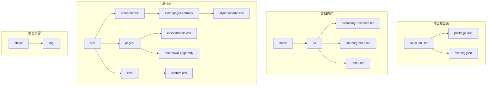
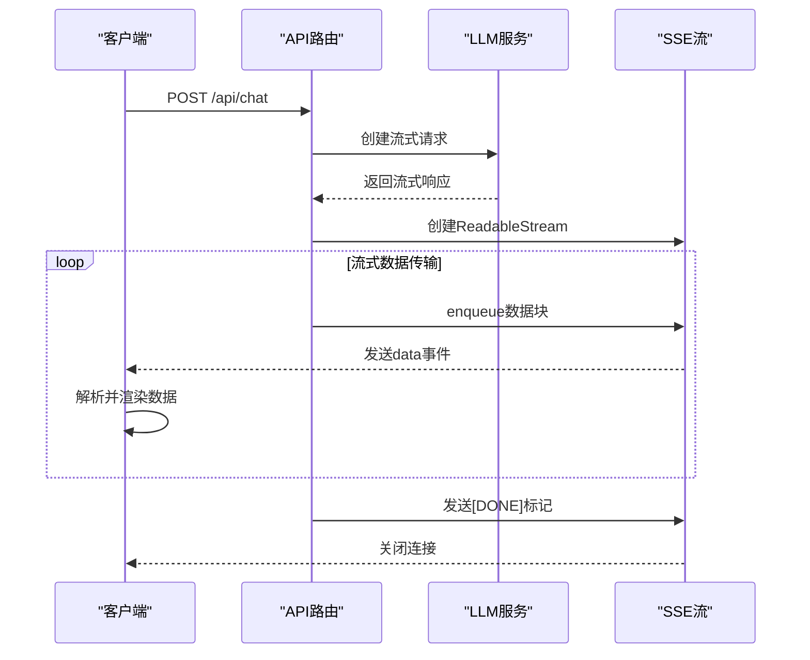
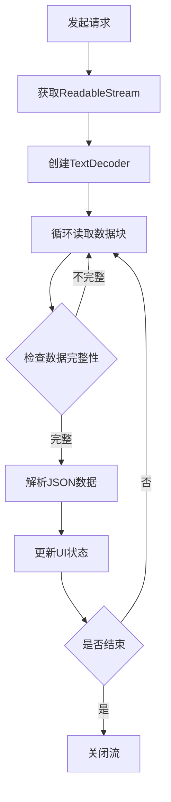
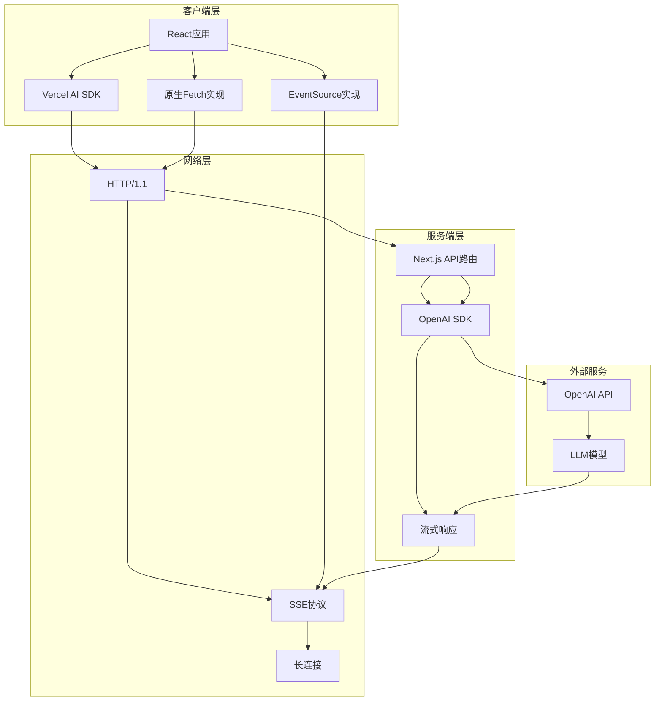
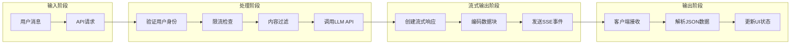
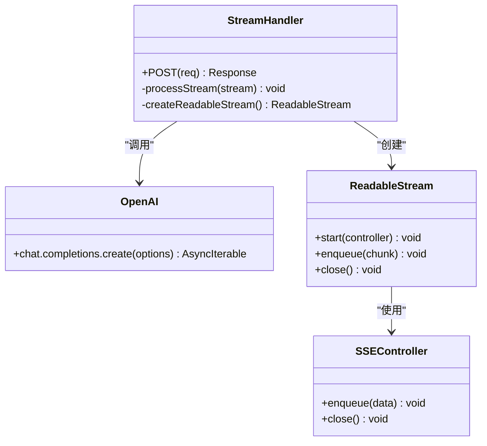
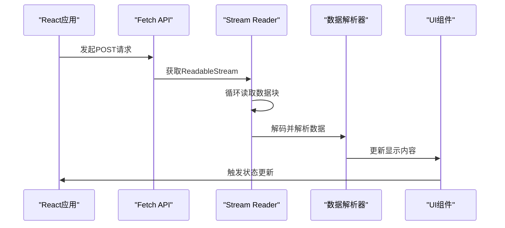
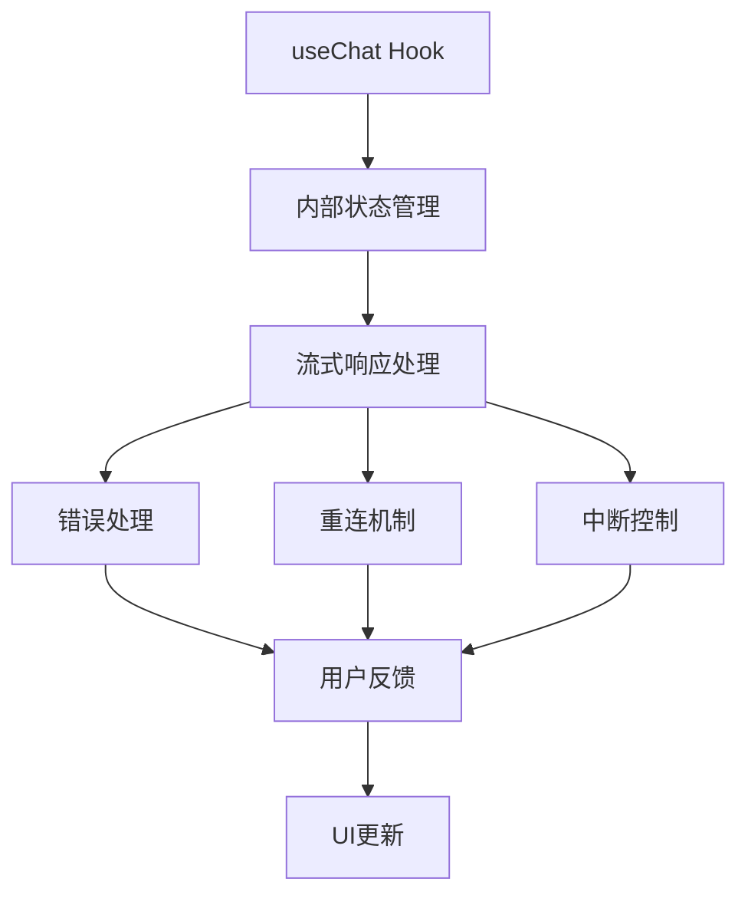
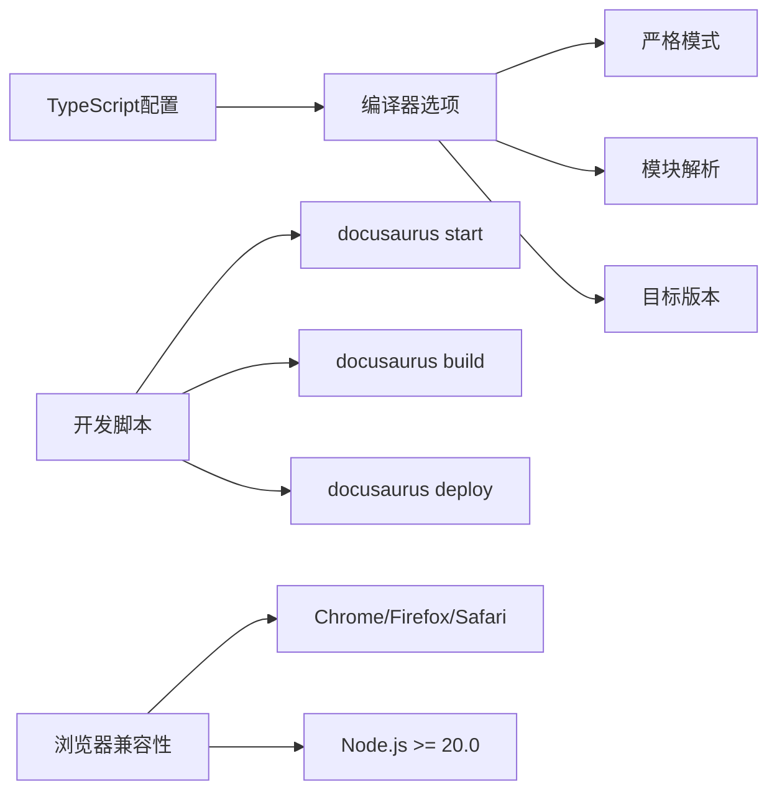
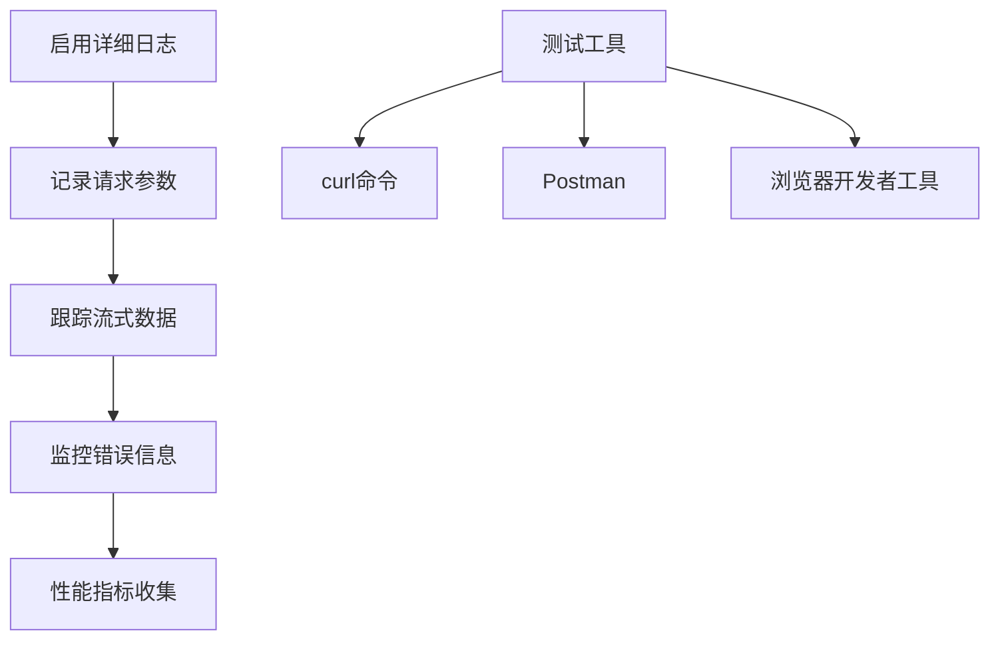

# 流式响应处理

<cite>
**本文档引用的文件**
- [streaming-response.md](file://docs/ai/streaming-response.md)
- [llm-integration.md](file://docs/ai/llm-integration.md)
- [README.md](file://README.md)
- [package.json](file://package.json)
- [custom.css](file://src/css/custom.css)
- [index.module.css](file://src/pages/index.module.css)
- [styles.module.css](file://src/components/HomepageFeatures/styles.module.css)
- [markdown-page.mdx](file://src/pages/markdown-page.mdx)
- [tsconfig.json](file://tsconfig.json)
</cite>

## 目录
1. [简介](#简介)
2. [项目结构](#项目结构)
3. [核心组件](#核心组件)
4. [架构概览](#架构概览)
5. [详细组件分析](#详细组件分析)
6. [依赖关系分析](#依赖关系分析)
7. [性能考虑](#性能考虑)
8. [故障排除指南](#故障排除指南)
9. [结论](#结论)
10. [附录](#附录)

## 简介

流式响应处理是现代Web应用中实现实时数据传输和用户体验优化的关键技术。本文档深入探讨了流式响应的概念、实现原理和应用场景，特别关注于AI应用中的LLM（大语言模型）对话系统。

在传统的HTTP请求响应模式中，客户端必须等待整个响应完成才能开始处理数据。而流式响应允许服务器在生成数据的过程中逐步发送数据块，客户端可以立即开始处理接收到的部分数据，从而显著提升用户体验。

本文档基于实际的AI知识库项目，详细分析了Server-Sent Events (SSE)、原生Fetch + ReadableStream以及Vercel AI SDK三种流式响应实现方式，并提供了完整的代码实现示例和最佳实践指导。

## 项目结构

该项目是一个基于Docusaurus的静态网站生成器，专门用于构建AI知识库文档。项目采用模块化的文档组织方式，重点围绕AI应用开发，特别是流式响应处理技术。



**图表来源**
- [README.md:1-42](file://README.md#L1-L42)
- [package.json:1-50](file://package.json#L1-L50)
- [streaming-response.md:1-166](file://docs/ai/streaming-response.md#L1-L166)

**章节来源**
- [README.md:1-42](file://README.md#L1-L42)
- [package.json:1-50](file://package.json#L1-L50)

## 核心组件

### 流式响应实现方式对比

项目提供了三种主要的流式响应实现方式，每种都有其特定的应用场景和优势：

#### 1. Server-Sent Events (SSE) 实现

SSE是一种基于HTTP的单向通信协议，特别适合LLM流式输出场景。它使用`text/event-stream`内容类型，支持自动重连和错误处理。



**图表来源**
- [streaming-response.md:16-56](file://docs/ai/streaming-response.md#L16-L56)

#### 2. 原生Fetch + ReadableStream 实现

这种方式提供了最大的灵活性，允许开发者完全控制流式数据的读取和处理过程。



**图表来源**
- [streaming-response.md:63-91](file://docs/ai/streaming-response.md#L63-L91)

#### 3. Vercel AI SDK 实现

封装了复杂的流式响应逻辑，提供简化的API接口，推荐用于生产环境。

**章节来源**
- [streaming-response.md:10-166](file://docs/ai/streaming-response.md#L10-L166)

## 架构概览

### 整体系统架构



**图表来源**
- [streaming-response.md:16-56](file://docs/ai/streaming-response.md#L16-L56)
- [llm-integration.md:71-93](file://docs/ai/llm-integration.md#L71-L93)

### 数据流处理流程



**图表来源**
- [llm-integration.md:79-93](file://docs/ai/llm-integration.md#L79-L93)
- [streaming-response.md:32-56](file://docs/ai/streaming-response.md#L32-L56)

## 详细组件分析

### SSE后端实现

#### OpenAI流式响应处理

后端使用OpenAI SDK创建流式响应，通过`ReadableStream`实现数据的逐步传输：



**图表来源**
- [streaming-response.md:16-56](file://docs/ai/streaming-response.md#L16-L56)

#### 关键实现要点

1. **流式数据处理**: 使用`for await (const chunk of stream)`逐个处理LLM的输出块
2. **数据格式转换**: 将LLM的delta内容转换为SSE格式的数据块
3. **连接管理**: 正确设置Content-Type为`text/event-stream`，启用缓存控制
4. **结束信号**: 发送`[DONE]`标记通知客户端流式传输完成

**章节来源**
- [streaming-response.md:16-56](file://docs/ai/streaming-response.md#L16-L56)

### 前端消费实现

#### 原生Fetch + ReadableStream方案



**图表来源**
- [streaming-response.md:63-91](file://docs/ai/streaming-response.md#L63-L91)

#### Vercel AI SDK封装方案

Vercel AI SDK提供了简化的API，封装了复杂的流式响应处理逻辑：



**图表来源**
- [streaming-response.md:101-122](file://docs/ai/streaming-response.md#L101-L122)

**章节来源**
- [streaming-response.md:59-148](file://docs/ai/streaming-response.md#L59-L148)

### SSE vs WebSocket 对比分析

| 特性 | SSE | WebSocket |
|------|-----|-----------|
| **方向** | 服务端 → 客户端（单向） | 双向通信 |
| **协议** | HTTP基础协议 | 独立协议(ws://) |
| **自动重连** | 支持onerror事件 | 需要手动实现重连逻辑 |
| **数据格式** | 文本格式 | 文本/二进制均可 |
| **适用场景** | LLM流式输出、实时通知 | 聊天室、实时协作、游戏 |
| **实现复杂度** | 中等 | 较高 |
| **浏览器兼容性** | 良好 | 良好 |

**章节来源**
- [streaming-response.md:150-159](file://docs/ai/streaming-response.md#L150-L159)

## 依赖关系分析

### 核心依赖关系

```mermaid
graph TB
subgraph "运行时依赖"
A[react ^19.0.0] --> B[react-dom ^19.0.0]
C[@docusaurus/core 3.10.1] --> D[@docusaurus/preset-classic 3.10.1]
E[@mdx-js/react ^3.0.0] --> F[prism-react-renderer ^2.3.0]
end
subgraph "开发依赖"
G[typescript ~6.0.2] --> H[@docusaurus/tsconfig 3.10.1]
I[@types/react ^19.0.0] --> J[@docusaurus/module-type-aliases 3.10.1]
end
subgraph "AI相关依赖"
K[openai] --> L[流式响应处理]
M[ai/react] --> N[Vercel AI SDK]
end
A --> O[流式响应组件]
C --> P[文档渲染]
K --> Q[LLM集成]
M --> R[简化API]
```

**图表来源**
- [package.json:17-33](file://package.json#L17-L33)

### 开发工具链配置

项目使用TypeScript进行类型检查，确保代码质量和开发体验：



**图表来源**
- [tsconfig.json:4-12](file://tsconfig.json#L4-L12)
- [package.json:5-15](file://package.json#L5-L15)

**章节来源**
- [package.json:17-49](file://package.json#L17-L49)
- [tsconfig.json:4-12](file://tsconfig.json#L4-L12)

## 性能考虑

### 流式响应性能优化策略

#### 1. 连接管理优化

- **Keep-Alive设置**: 保持HTTP连接活跃，减少连接建立开销
- **缓存控制**: 禁用缓存以确保实时数据传输
- **超时处理**: 合理设置请求超时和重连间隔

#### 2. 数据传输优化

- **数据块大小**: 选择合适的数据块大小平衡延迟和带宽利用率
- **压缩策略**: 对于大量文本数据，考虑适当的压缩算法
- **错误恢复**: 实现断线重连和数据完整性检查

#### 3. 客户端渲染优化

- **虚拟滚动**: 对于大量消息的场景，使用虚拟滚动技术
- **增量渲染**: 只更新变化的部分，避免全量重新渲染
- **防抖处理**: 对频繁的UI更新进行防抖处理

### 性能监控指标

| 指标类型 | 目标值 | 监控方法 |
|----------|--------|----------|
| **首字节时间** | < 100ms | 测量从请求到第一个数据块的时间 |
| **平均延迟** | < 50ms | 统计连续数据块之间的间隔 |
| **吞吐量** | > 1KB/s | 计算单位时间内传输的数据量 |
| **内存使用** | < 50MB | 监控客户端内存占用情况 |

## 故障排除指南

### 常见问题及解决方案

#### 1. 连接中断问题

**症状**: 流式响应突然中断，无法继续接收数据

**诊断步骤**:
1. 检查网络连接稳定性
2. 验证SSE连接头设置
3. 查看服务器日志是否有异常

**解决方案**:
- 实现自动重连机制
- 设置合理的重连间隔和最大重试次数
- 添加连接状态监听和错误处理

#### 2. 数据解析错误

**症状**: 客户端无法正确解析SSE数据格式

**诊断步骤**:
1. 检查服务器端数据格式是否符合SSE规范
2. 验证客户端解析逻辑的健壮性
3. 确认字符编码一致性

**解决方案**:
- 实现数据格式验证和错误恢复
- 添加try-catch异常处理
- 提供降级处理方案

#### 3. 内存泄漏问题

**症状**: 长时间运行后内存使用持续增长

**诊断步骤**:
1. 检查事件监听器是否正确清理
2. 验证ReadableStream是否正确关闭
3. 确认定时器和回调函数的生命周期管理

**解决方案**:
- 实现组件卸载时的清理逻辑
- 使用AbortController取消未完成的请求
- 定期清理无用的DOM节点和事件监听器

### 调试技巧

#### 1. 服务器端调试



#### 2. 客户端调试

- **网络面板**: 监控SSE连接状态和数据传输
- **控制台日志**: 输出关键事件和错误信息
- **性能面板**: 分析内存使用和渲染性能

**章节来源**
- [streaming-response.md:160-166](file://docs/ai/streaming-response.md#L160-L166)

## 结论

流式响应处理技术为现代Web应用提供了强大的实时数据传输能力，特别是在AI应用领域展现出了巨大的价值。通过合理选择和实现流式响应方案，可以显著提升用户体验和应用性能。

基于本项目的分析，我们建议：

1. **LLM场景优先选择SSE**: 单向流式输出的特性完美匹配LLM的响应模式
2. **生产环境使用Vercel AI SDK**: 封装了复杂的流式响应逻辑，提供更好的稳定性和维护性
3. **实现完善的错误处理**: 包括断线重连、数据验证和降级处理
4. **关注性能优化**: 合理的连接管理和数据传输策略
5. **重视安全性**: 在前端避免暴露敏感的API密钥

通过遵循这些最佳实践，开发者可以构建出高性能、可维护的流式响应应用，为用户提供流畅的实时交互体验。

## 附录

### 最佳实践清单

#### 开发阶段
- [ ] 实现完整的错误处理和重试机制
- [ ] 编写单元测试覆盖关键业务逻辑
- [ ] 进行性能基准测试和压力测试
- [ ] 实现详细的日志记录和监控

#### 部署阶段
- [ ] 配置适当的服务器超时和缓冲区设置
- [ ] 实现负载均衡和水平扩展策略
- [ ] 设置监控告警和健康检查
- [ ] 准备应急预案和回滚方案

#### 维护阶段
- [ ] 定期审查和优化性能指标
- [ ] 跟踪用户反馈和使用统计
- [ ] 及时更新依赖包和安全补丁
- [ ] 持续改进用户体验和功能特性

### 相关资源

- **官方文档**: [Docusaurus文档](https://docusaurus.io/docs)
- **AI SDK参考**: [Vercel AI SDK文档](https://sdk.vercel.ai/docs)
- **SSE规范**: [W3C Server-Sent Events规范](https://www.w3.org/TR/2021/REC-eventsource-20210623/)
- **React Hooks**: [React官方Hooks文档](https://reactjs.org/docs/hooks-intro.html)