# CSS 基础知识

<cite>
**本文档引用的文件**
- [custom.css](file://src/css/custom.css)
- [styles.module.css](file://src/components/HomepageFeatures/styles.module.css)
- [styles.module.css](file://src/components/Quiz/styles.module.css)
- [index.module.css](file://src/pages/index.module.css)
- [box-model.md](file://docs/css/box-model.md)
- [flexbox-grid.md](file://docs/css/flexbox-grid.md)
- [positioning.md](file://docs/css/positioning.md)
- [responsive.md](file://docs/css/responsive.md)
- [animation.md](file://docs/css/animation.md)
- [modern-css.md](file://docs/css/modern-css.md)
- [package.json](file://package.json)
</cite>

## 目录
1. [引言](#引言)
2. [项目结构](#项目结构)
3. [核心组件](#核心组件)
4. [架构概览](#架构概览)
5. [详细组件分析](#详细组件分析)
6. [依赖分析](#依赖分析)
7. [性能考虑](#性能考虑)
8. [故障排除指南](#故障排除指南)
9. [结论](#结论)

## 引言

这是一个基于 Docusaurus 3.10.1 构建的知识库项目，专注于前端 CSS 基础知识的教学和展示。该项目采用现代化的 CSS 设计理念，结合 Docusaurus 的文档功能，为学习者提供了一个美观、响应式的 CSS 学习环境。

项目的核心特色包括：
- 现代化的 CSS 变量系统和主题支持
- 响应式设计和移动端优化
- 组件化的样式管理（CSS Modules）
- 丰富的 CSS 新特性演示
- 交互式的学习体验

## 项目结构

该项目采用模块化的文件组织方式，主要分为以下几个部分：

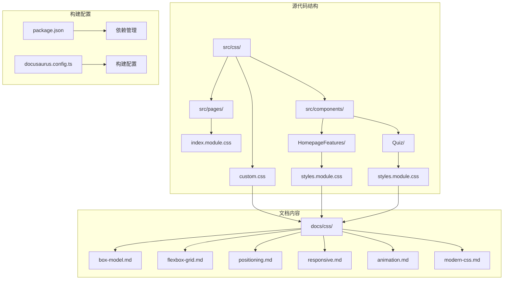

**图表来源**
- [custom.css:1-800](file://src/css/custom.css#L1-L800)
- [index.module.css:1-683](file://src/pages/index.module.css#L1-L683)
- [styles.module.css:1-119](file://src/components/HomepageFeatures/styles.module.css#L1-L119)

**章节来源**
- [custom.css:1-800](file://src/css/custom.css#L1-L800)
- [package.json:1-51](file://package.json#L1-L51)

## 核心组件

### 全局样式系统

项目采用了基于 CSS 变量的现代化样式系统，提供了完整的明暗主题支持：

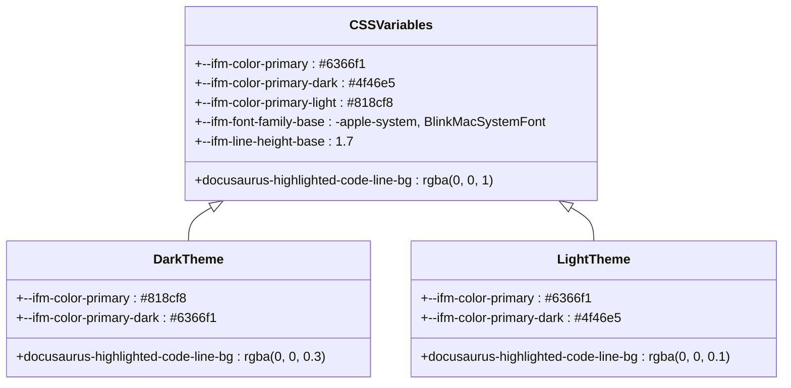

**图表来源**
- [custom.css:7-33](file://src/css/custom.css#L7-L33)

### 组件化样式架构

项目采用 CSS Modules 的组件化样式管理方式，确保样式的局部作用域和更好的维护性：

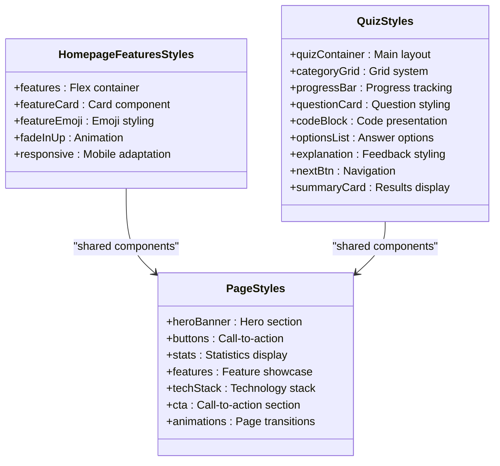

**图表来源**
- [styles.module.css:1-119](file://src/components/HomepageFeatures/styles.module.css#L1-L119)
- [styles.module.css:1-896](file://src/components/Quiz/styles.module.css#L1-L896)
- [index.module.css:1-683](file://src/pages/index.module.css#L1-L683)

**章节来源**
- [styles.module.css:1-119](file://src/components/HomepageFeatures/styles.module.css#L1-L119)
- [styles.module.css:1-896](file://src/components/Quiz/styles.module.css#L1-L896)
- [index.module.css:1-683](file://src/pages/index.module.css#L1-L683)

## 架构概览

### 样式层次结构

项目建立了清晰的样式层次结构，从全局变量到具体组件的完整体系：

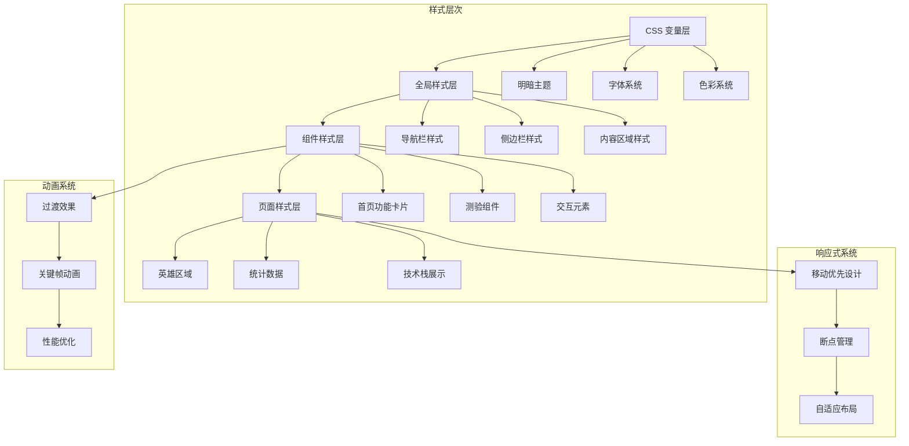

**图表来源**
- [custom.css:1-800](file://src/css/custom.css#L1-L800)
- [styles.module.css:1-119](file://src/components/HomepageFeatures/styles.module.css#L1-L119)
- [styles.module.css:1-896](file://src/components/Quiz/styles.module.css#L1-L896)

### 文档内容架构

项目文档按照 CSS 学习路径组织，从基础概念到高级特性：

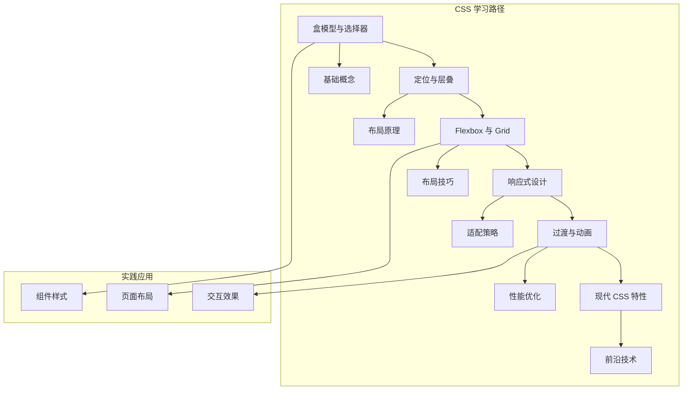

**图表来源**
- [box-model.md:1-188](file://docs/css/box-model.md#L1-L188)
- [positioning.md:1-237](file://docs/css/positioning.md#L1-L237)
- [flexbox-grid.md:1-288](file://docs/css/flexbox-grid.md#L1-L288)
- [responsive.md:1-275](file://docs/css/responsive.md#L1-L275)
- [animation.md:1-308](file://docs/css/animation.md#L1-L308)
- [modern-css.md:1-352](file://docs/css/modern-css.md#L1-L352)

**章节来源**
- [box-model.md:1-188](file://docs/css/box-model.md#L1-L188)
- [positioning.md:1-237](file://docs/css/positioning.md#L1-L237)
- [flexbox-grid.md:1-288](file://docs/css/flexbox-grid.md#L1-L288)
- [responsive.md:1-275](file://docs/css/responsive.md#L1-L275)
- [animation.md:1-308](file://docs/css/animation.md#L1-L308)
- [modern-css.md:1-352](file://docs/css/modern-css.md#L1-L352)

## 详细组件分析

### 盒模型与选择器系统

盒模型是 CSS 的基础概念，项目实现了标准的盒模型计算方式：

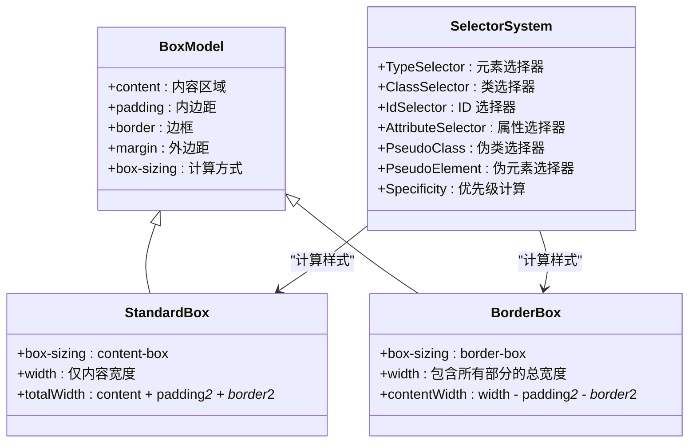

**图表来源**
- [box-model.md:12-45](file://docs/css/box-model.md#L12-L45)

### 定位与层叠系统

定位系统是 CSS 布局的核心，项目展示了多种定位方式的实现：

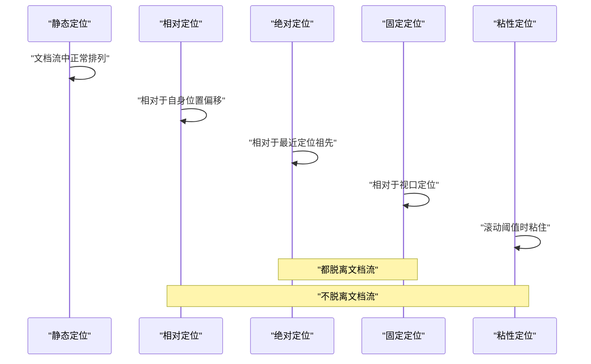

**图表来源**
- [positioning.md:14-44](file://docs/css/positioning.md#L14-L44)

### Flexbox 与 Grid 布局系统

现代 CSS 布局的两大支柱，项目提供了完整的实现示例：

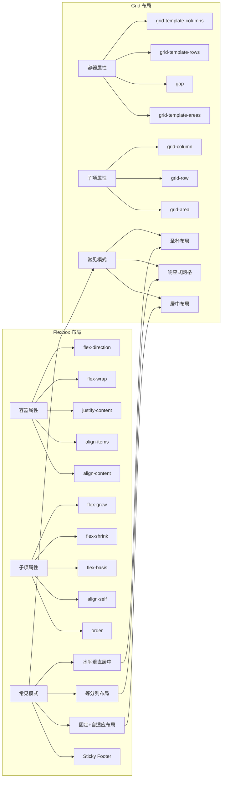

**图表来源**
- [flexbox-grid.md:14-141](file://docs/css/flexbox-grid.md#L14-L141)
- [flexbox-grid.md:147-250](file://docs/css/flexbox-grid.md#L147-L250)

### 响应式设计系统

响应式设计是现代网页开发的基本要求，项目实现了完整的响应式解决方案：

```mermaid
flowchart TD
subgraph "响应式策略"
A[移动优先] --> B[min-width 断点]
C[桌面优先] --> D[max-width 断点]
B --> E[渐进增强]
D --> F[优雅降级]
end
subgraph "断点系统"
G[1200px] --> H[大屏幕]
I[996px] --> J[平板]
K[768px] --> L[手机横屏]
M[480px] --> N[超小屏]
end
subgraph "单位系统"
O[相对单位] --> P[rem/em/vw/vh]
O --> Q[clamp/min/max]
R[容器查询] --> S[@container]
R --> T[容器类型]
end
A --> G
C --> K
P --> O
S --> R
```

**图表来源**
- [responsive.md:24-99](file://docs/css/responsive.md#L24-L99)
- [responsive.md:107-154](file://docs/css/responsive.md#L107-L154)

### 动画与过渡系统

现代网页的交互体验离不开动画效果，项目提供了完整的动画解决方案：

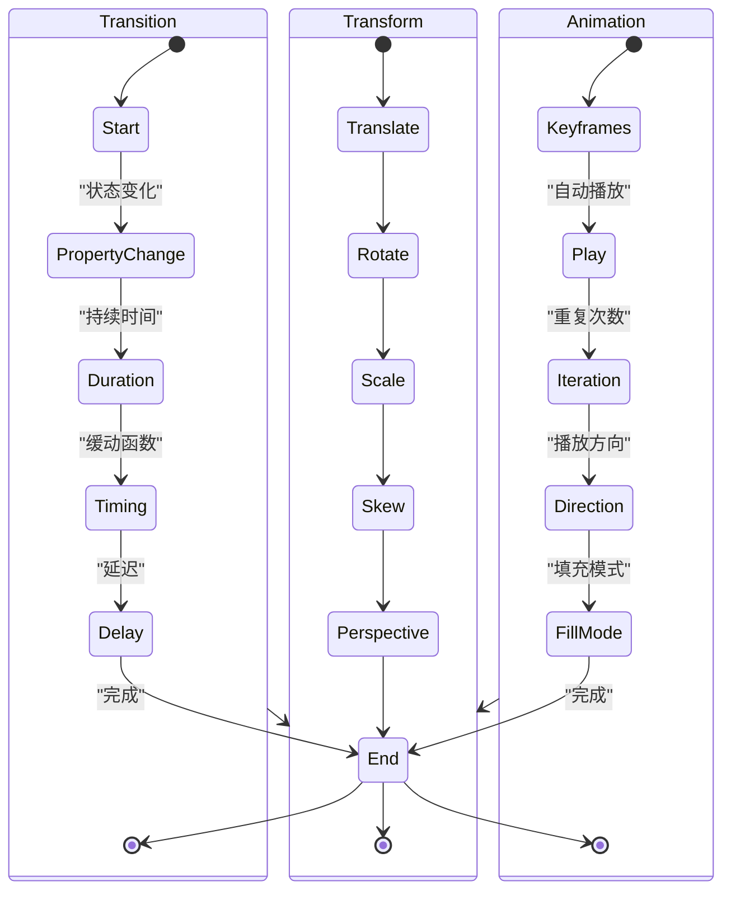

**图表来源**
- [animation.md:14-90](file://docs/css/animation.md#L14-L90)
- [animation.md:96-137](file://docs/css/animation.md#L96-L137)

### 现代 CSS 特性系统

随着 CSS 标准的发展，项目展示了最新的 CSS 特性：

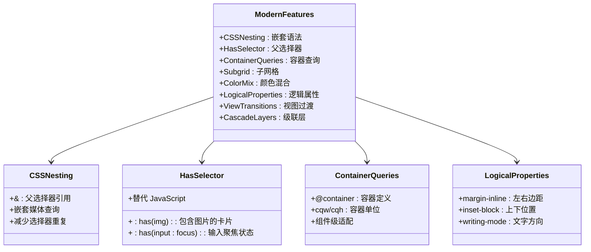

**图表来源**
- [modern-css.md:14-47](file://docs/css/modern-css.md#L14-L47)
- [modern-css.md:49-82](file://docs/css/modern-css.md#L49-L82)
- [modern-css.md:85-117](file://docs/css/modern-css.md#L85-L117)
- [modern-css.md:231-258](file://docs/css/modern-css.md#L231-L258)

**章节来源**
- [box-model.md:10-188](file://docs/css/box-model.md#L10-L188)
- [positioning.md:10-237](file://docs/css/positioning.md#L10-L237)
- [flexbox-grid.md:10-288](file://docs/css/flexbox-grid.md#L10-L288)
- [responsive.md:10-275](file://docs/css/responsive.md#L10-L275)
- [animation.md:10-308](file://docs/css/animation.md#L10-L308)
- [modern-css.md:10-352](file://docs/css/modern-css.md#L10-L352)

## 依赖分析

### 构建工具链

项目基于 Docusaurus 3.10.1 构建，采用了现代化的前端开发工具链：

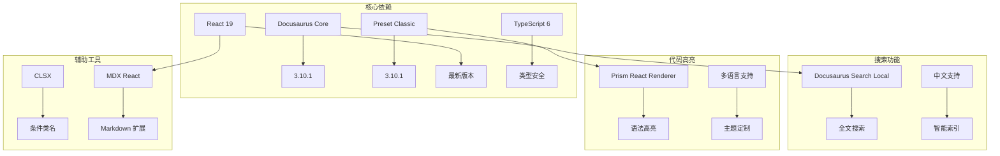

**图表来源**
- [package.json:17-26](file://package.json#L17-L26)

### 浏览器兼容性

项目针对现代浏览器进行了优化，同时保持了良好的兼容性：

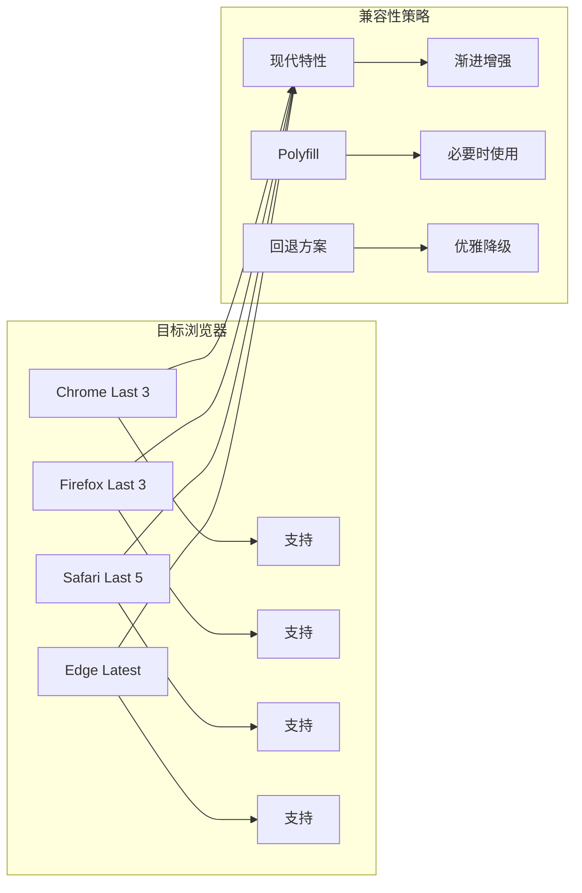

**图表来源**
- [package.json:35-49](file://package.json#L35-L49)

**章节来源**
- [package.json:1-51](file://package.json#L1-L51)

## 性能考虑

### 样式性能优化

项目在样式层面采用了多项性能优化策略：

1. **CSS 变量缓存**：通过 CSS 变量减少重复计算
2. **硬件加速**：合理使用 transform 和 opacity
3. **媒体查询优化**：使用移动优先策略
4. **组件化样式**：避免全局样式污染

### 构建性能优化

1. **Tree Shaking**：移除未使用的样式
2. **代码分割**：按需加载样式
3. **缓存策略**：利用浏览器缓存
4. **压缩优化**：生产环境自动压缩

## 故障排除指南

### 常见样式问题

1. **盒模型计算错误**
   - 确保使用统一的 box-sizing: border-box
   - 检查 padding 和 border 的累加效果

2. **定位问题**
   - 理解包含块的概念
   - 注意 transform 对 fixed 定位的影响

3. **响应式断点**
   - 使用移动优先策略
   - 合理设置断点值

4. **动画性能**
   - 优先使用 transform 和 opacity
   - 避免触发布局的属性动画

### 调试技巧

1. **开发者工具**
   - 使用 Elements 面板查看计算样式
   - 使用 Computed 面板分析最终样式

2. **样式检查**
   - 检查选择器优先级
   - 验证 CSS 变量的继承关系

3. **性能监控**
   - 使用 Performance 面板分析渲染性能
   - 监控合成层的使用情况

## 结论

这个 CSS 基础知识项目展示了现代前端开发的最佳实践，通过 Docusaurus 平台提供了丰富的学习资源。项目不仅涵盖了 CSS 的基础知识，还深入介绍了现代 CSS 的新特性和最佳实践。

项目的主要优势包括：
- 完整的 CSS 知识体系
- 现代化的开发工具链
- 优秀的用户体验设计
- 良好的性能表现
- 详细的文档说明

对于学习 CSS 的开发者来说，这是一个非常有价值的学习资源，既适合初学者入门，也能为有经验的开发者提供深入的技术洞察。