# CSS 基础知识

<cite>
**本文档引用的文件**
- [custom.css](file://src/css/custom.css)
- [styles.module.css](file://src/components/HomepageFeatures/styles.module.css)
- [styles.module.css](file://src/components/Quiz/styles.module.css)
- [index.module.css](file://src/pages/index.module.css)
- [box-model.md](file://docs/css/box-model.md)
- [flexbox-grid.md](file://docs/css/flexbox-grid.md)
- [positioning.md](file://docs/css/positioning.md)
- [responsive.md](file://docs/css/responsive.md)
- [animation.md](file://docs/css/animation.md)
- [modern-css.md](file://docs/css/modern-css.md)
- [package.json](file://package.json)
</cite>

## 更新摘要
**变更内容**
- 新增现代玻璃态设计系统章节，涵盖 backdrop-filter 模糊效果和半透明材质
- 添加极光网格背景动画系统的详细说明
- 扩展渐变文本裁剪和发光边框技术实现
- 完善高级 CSS 自定义属性系统，包括间距和圆角值的一致性管理
- 更新组件化样式架构，体现现代 UI 设计趋势

## 目录
1. [引言](#引言)
2. [项目结构](#项目结构)
3. [核心组件](#核心组件)
4. [现代玻璃态设计系统](#现代玻璃态设计系统)
5. [极光网格背景动画](#极光网格背景动画)
6. [渐变文本与发光效果](#渐变文本与发光效果)
7. [高级 CSS 自定义属性系统](#高级-css-自定义属性系统)
8. [架构概览](#架构概览)
9. [详细组件分析](#详细组件分析)
10. [依赖分析](#依赖分析)
11. [性能考虑](#性能考虑)
12. [故障排除指南](#故障排除指南)
13. [结论](#结论)

## 引言

这是一个基于 Docusaurus 3.10.1 构建的知识库项目，专注于前端 CSS 基础知识的教学和展示。该项目采用了现代化的 CSS 设计理念，结合最新的玻璃态设计（Glassmorphism）技术和极光网格背景动画，为学习者提供了一个美观、响应式的 CSS 学习环境。

项目的核心特色包括：
- **现代玻璃态设计系统**：基于 backdrop-filter 的模糊效果和半透明材质
- **极光网格背景动画**：动态渐变色块营造沉浸式视觉体验
- **渐变文本裁剪技术**：使用 background-clip 实现彩色文字效果
- **高级 CSS 自定义属性**：统一的间距、圆角和色彩管理系统
- **组件化的样式管理**：CSS Modules 确保样式的局部作用域
- **丰富的 CSS 新特性演示**：展示现代 CSS 的最佳实践

## 项目结构

该项目采用模块化的文件组织方式，主要分为以下几个部分：

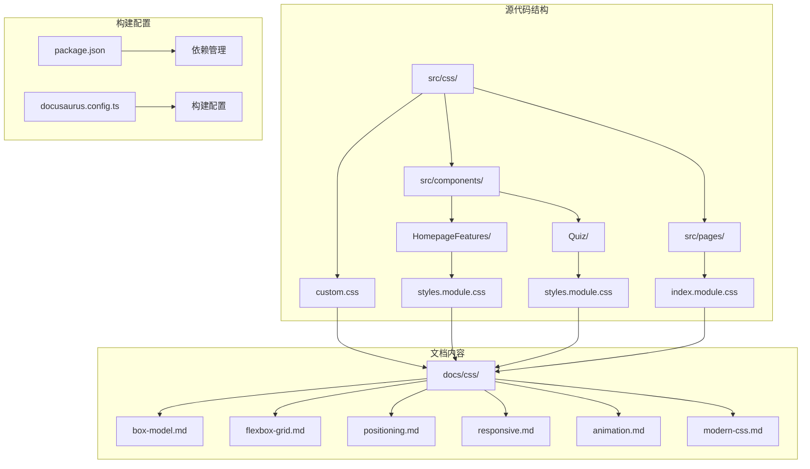

**图表来源**
- [custom.css:1-629](file://src/css/custom.css#L1-L629)
- [index.module.css:1-796](file://src/pages/index.module.css#L1-L796)
- [styles.module.css:1-260](file://src/components/HomepageFeatures/styles.module.css#L1-L260)

**章节来源**
- [custom.css:1-629](file://src/css/custom.css#L1-L629)
- [package.json:1-67](file://package.json#L1-L67)

## 核心组件

### 全局样式系统

项目采用了基于 CSS 变量的现代化样式系统，提供了完整的明暗主题支持和玻璃态设计令牌：

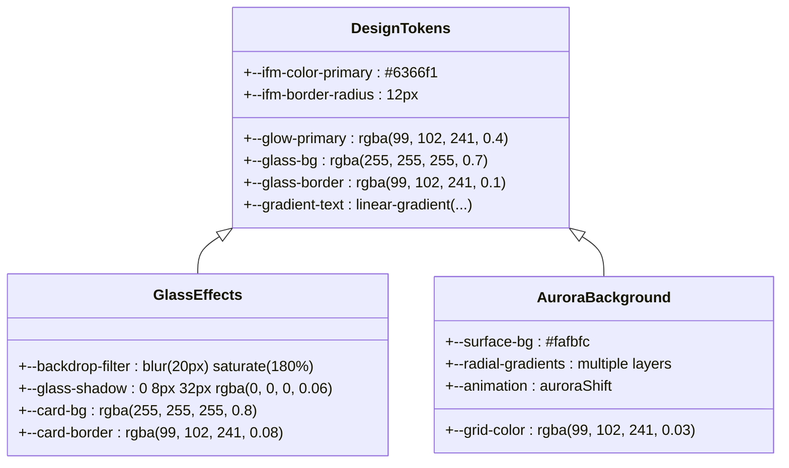

**图表来源**
- [custom.css:7-69](file://src/css/custom.css#L7-L69)

### 组件化样式架构

项目采用 CSS Modules 的组件化样式管理方式，确保样式的局部作用域和更好的维护性：

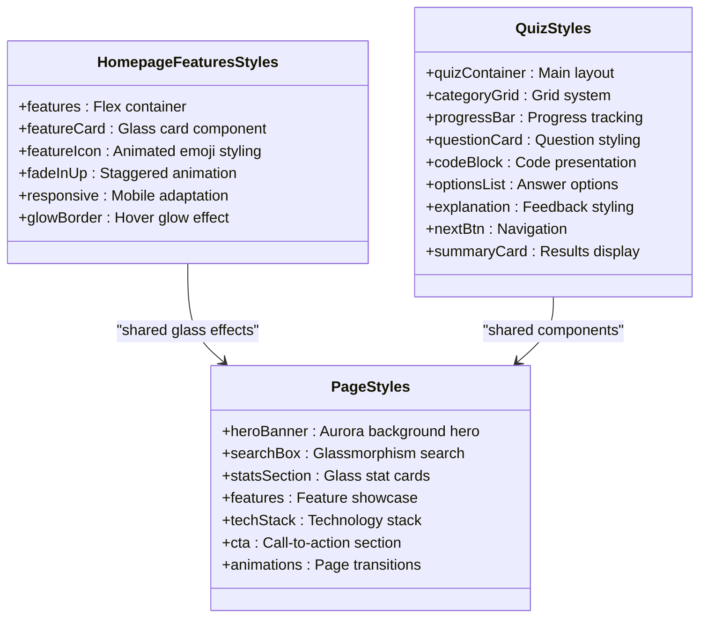

**图表来源**
- [styles.module.css:1-260](file://src/components/HomepageFeatures/styles.module.css#L1-L260)
- [styles.module.css:1-800](file://src/components/Quiz/styles.module.css#L1-L800)
- [index.module.css:1-796](file://src/pages/index.module.css#L1-L796)

**章节来源**
- [styles.module.css:1-260](file://src/components/HomepageFeatures/styles.module.css#L1-L260)
- [styles.module.css:1-800](file://src/components/Quiz/styles.module.css#L1-L800)
- [index.module.css:1-796](file://src/pages/index.module.css#L1-L796)

## 现代玻璃态设计系统

### 玻璃态效果原理

玻璃态设计（Glassmorphism）是现代 UI 设计的核心趋势，通过 backdrop-filter 模糊效果和半透明材质创造深度感：

```mermaid
flowchart TD
A[背景层] --> B[模糊滤镜 backdrop-filter]
B --> C[半透明背景 rgba()]
C --> D[边框高亮 border]
D --> E[阴影层次 box-shadow]
E --> F[最终玻璃效果]
G[光照效果] --> H[渐变边框 gradient]
H --> I[悬停状态 hover]
I --> J[发光效果 glow]
J --> F
```

**图表来源**
- [custom.css:83-116](file://src/css/custom.css#L83-L116)
- [index.module.css:102-133](file://src/pages/index.module.css#L102-L133)

### 核心玻璃态组件

#### 导航栏玻璃效果
```css
.navbar {
  backdrop-filter: blur(20px) saturate(180%);
  -webkit-backdrop-filter: blur(20px) saturate(180%);
  background: var(--glass-bg) !important;
  border-bottom: 1px solid var(--glass-border);
  box-shadow: none;
  transition: all 0.3s ease;
  will-change: backdrop-filter;
}
```

#### 搜索框玻璃容器
```css
.searchBox {
  background: var(--glass-bg);
  backdrop-filter: blur(16px) saturate(180%);
  -webkit-backdrop-filter: blur(16px) saturate(180%);
  border-radius: 14px;
  border: 1px solid var(--glass-border);
  box-shadow: var(--glass-shadow);
}
```

#### 卡片玻璃效果
```css
.featureCard {
  background: var(--card-bg);
  backdrop-filter: blur(10px);
  -webkit-backdrop-filter: blur(10px);
  border: 1px solid var(--card-border);
  transition: transform 0.3s cubic-bezier(0.4, 0, 0.2, 1),
              border-color 0.3s ease,
              box-shadow 0.3s ease,
              background 0.3s ease;
}
```

**章节来源**
- [custom.css:83-116](file://src/css/custom.css#L83-L116)
- [index.module.css:102-133](file://src/pages/index.module.css#L102-L133)
- [styles.module.css:48-102](file://src/components/HomepageFeatures/styles.module.css#L48-L102)

## 极光网格背景动画

### 极光背景实现原理

极光背景通过多层径向渐变和关键帧动画创建动态的视觉效果：

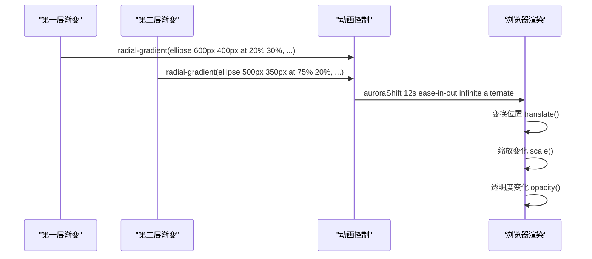

**图表来源**
- [index.module.css:10-62](file://src/pages/index.module.css#L10-L62)

### 多层渐变系统

#### 主极光层
```css
.hero::before {
  content: '';
  position: absolute;
  inset: 0;
  background:
    radial-gradient(ellipse 600px 400px at 20% 30%, rgba(99, 102, 241, 0.18) 0%, transparent 70%),
    radial-gradient(ellipse 500px 350px at 75% 20%, rgba(139, 92, 246, 0.15) 0%, transparent 70%),
    radial-gradient(ellipse 400px 300px at 50% 80%, rgba(168, 85, 247, 0.12) 0%, transparent 70%),
    radial-gradient(ellipse 350px 250px at 85% 70%, rgba(59, 130, 246, 0.1) 0%, transparent 70%);
  animation: auroraShift 12s ease-in-out infinite alternate;
  z-index: 0;
}
```

#### 辅助极光层
```css
.hero::after {
  content: '';
  position: absolute;
  inset: 0;
  background:
    radial-gradient(ellipse 450px 300px at 60% 50%, rgba(99, 102, 241, 0.1) 0%, transparent 70%),
    radial-gradient(ellipse 350px 250px at 30% 70%, rgba(167, 139, 250, 0.08) 0%, transparent 70%);
  animation: auroraShift2 15s ease-in-out infinite alternate;
  z-index: 0;
}
```

### 动画关键帧

#### 主极光动画
```css
@keyframes auroraShift {
  0% {
    transform: translate(0, 0) scale(1);
  }
  33% {
    transform: translate(30px, -20px) scale(1.05);
  }
  66% {
    transform: translate(-20px, 15px) scale(0.98);
  }
  100% {
    transform: translate(10px, -10px) scale(1.02);
  }
}
```

#### 辅助极光动画
```css
@keyframes auroraShift2 {
  0% {
    transform: translate(0, 0) scale(1);
    opacity: 0.7;
  }
  50% {
    transform: translate(-25px, 20px) scale(1.08);
    opacity: 1;
  }
  100% {
    transform: translate(15px, -15px) scale(0.95);
    opacity: 0.8;
  }
}
```

**章节来源**
- [index.module.css:10-62](file://src/pages/index.module.css#L10-L62)

## 渐变文本与发光效果

### 渐变文本裁剪技术

渐变文本通过 background-clip 和 text-fill-color 实现彩色文字效果：

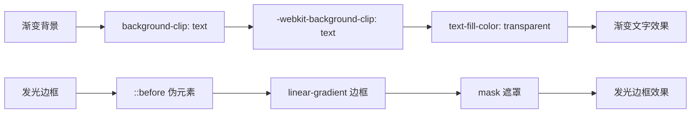

**图表来源**
- [index.module.css:80-90](file://src/pages/index.module.css#L80-L90)
- [styles.module.css:70-102](file://src/components/HomepageFeatures/styles.module.css#L70-L102)

### 渐变文本实现

#### 标题渐变效果
```css
.heroTitle {
  font-size: 3rem;
  font-weight: 900;
  margin: 0 0 1rem;
  line-height: 1.2;
  letter-spacing: -0.03em;
  background: var(--gradient-text);
  -webkit-background-clip: text;
  background-clip: text;
  -webkit-text-fill-color: transparent;
}
```

#### 统计数值渐变
```css
.statValue {
  font-size: 2rem;
  font-weight: 800;
  line-height: 1.2;
  background: var(--gradient-text);
  -webkit-background-clip: text;
  background-clip: text;
  -webkit-text-fill-color: transparent;
}
```

### 发光边框效果

#### 卡片发光边框
```css
.featureCard::before {
  content: '';
  position: absolute;
  inset: 0;
  border-radius: 14px;
  padding: 1px;
  background: linear-gradient(135deg, var(--glow-primary), var(--glow-secondary), transparent);
  -webkit-mask:
    linear-gradient(#fff 0 0) content-box,
    linear-gradient(#fff 0 0);
  mask:
    linear-gradient(#fff 0 0) content-box,
    linear-gradient(#fff 0 0);
  -webkit-mask-composite: xor;
  mask-composite: exclude;
  opacity: 0;
  transition: opacity 0.3s ease;
}
```

#### 悬停发光效果
```css
.featureCard:hover {
  transform: translateY(-3px);
  border-color: var(--card-hover-border);
  box-shadow: var(--card-hover-shadow);
  background: rgba(255, 255, 255, 0.95);
}

.featureCard:hover::before {
  opacity: 1;
}
```

**章节来源**
- [index.module.css:80-90](file://src/pages/index.module.css#L80-L90)
- [styles.module.css:70-102](file://src/components/HomepageFeatures/styles.module.css#L70-L102)

## 高级 CSS 自定义属性系统

### 设计令牌架构

项目建立了完整的设计令牌系统，统一管理颜色、间距、圆角等设计变量：

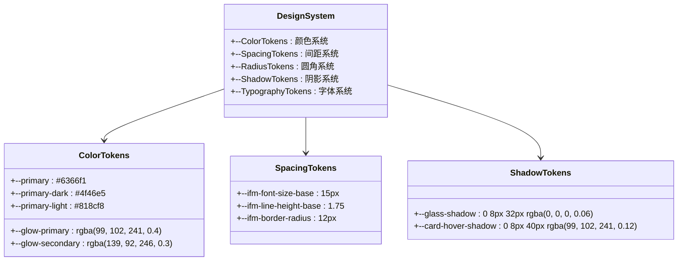

**图表来源**
- [custom.css:7-69](file://src/css/custom.css#L7-L69)

### 明暗主题系统

#### 浅色主题令牌
```css
:root {
  --ifm-color-primary: #6366f1;
  --ifm-color-primary-dark: #4f46e5;
  --ifm-color-primary-darker: #4338ca;
  --ifm-color-primary-darkest: #3730a3;
  --ifm-color-primary-light: #818cf8;
  --ifm-color-primary-lighter: #a5b4fc;
  --ifm-color-primary-lightest: #c7d2fe;
  
  --glow-primary: rgba(99, 102, 241, 0.4);
  --glow-secondary: rgba(139, 92, 246, 0.3);
  --glass-bg: rgba(255, 255, 255, 0.7);
  --glass-border: rgba(99, 102, 241, 0.1);
  --glass-shadow: 0 8px 32px rgba(0, 0, 0, 0.06);
  --grid-color: rgba(99, 102, 241, 0.03);
  --surface-bg: #fafbfc;
  --card-bg: rgba(255, 255, 255, 0.8);
  --card-border: rgba(99, 102, 241, 0.08);
  --card-hover-border: rgba(99, 102, 241, 0.3);
  --card-hover-shadow: 0 8px 40px rgba(99, 102, 241, 0.12);
  --code-bg: #1e1e2e;
  --gradient-text: linear-gradient(135deg, #6366f1 0%, #8b5cf6 50%, #a855f7 100%);
  --gradient-glow: linear-gradient(135deg, rgba(99, 102, 241, 0.15) 0%, rgba(139, 92, 246, 0.1) 100%);
}
```

#### 深色主题令牌
```css
[data-theme='dark'] {
  --ifm-color-primary: #818cf8;
  --ifm-color-primary-dark: #6366f1;
  --ifm-color-primary-light: #a5b4fc;
  --ifm-color-primary-lighter: #c7d2fe;
  --ifm-color-primary-lightest: #e0e7ff;
  --ifm-color-primary-darker: #4f46e5;
  --ifm-color-primary-darkest: #4338ca;
  
  --glow-primary: rgba(129, 140, 248, 0.3);
  --glow-secondary: rgba(167, 139, 250, 0.25);
  --glass-bg: rgba(17, 17, 27, 0.8);
  --glass-border: rgba(129, 140, 248, 0.12);
  --glass-shadow: 0 8px 32px rgba(0, 0, 0, 0.3);
  --grid-color: rgba(129, 140, 248, 0.04);
  --surface-bg: #0a0a0f;
  --card-bg: rgba(17, 17, 27, 0.6);
  --card-border: rgba(129, 140, 248, 0.1);
  --card-hover-border: rgba(129, 140, 248, 0.4);
  --card-hover-shadow: 0 8px 40px rgba(129, 140, 248, 0.1);
  --code-bg: #0d0d14;
  --gradient-text: linear-gradient(135deg, #a5b4fc 0%, #c4b5fd 50%, #d8b4fe 100%);
  --gradient-glow: linear-gradient(135deg, rgba(129, 140, 248, 0.1) 0%, rgba(167, 139, 250, 0.08) 100%);
}
```

### 背景网格系统

#### 基础网格背景
```css
.main-wrapper {
  background-image: radial-gradient(circle, var(--grid-color) 1px, transparent 1px);
  background-size: 24px 24px;
}
```

#### 表格玻璃效果
```css
table {
  border-radius: 12px;
  overflow: hidden;
  border: 1px solid var(--card-border);
  box-shadow: var(--glass-shadow);
  background: var(--card-bg);
  backdrop-filter: blur(10px);
}
```

**章节来源**
- [custom.css:7-69](file://src/css/custom.css#L7-L69)
- [custom.css:71-80](file://src/css/custom.css#L71-L80)
- [custom.css:193-228](file://src/css/custom.css#L193-L228)

## 架构概览

### 样式层次结构

项目建立了清晰的样式层次结构，从全局变量到具体组件的完整体系：

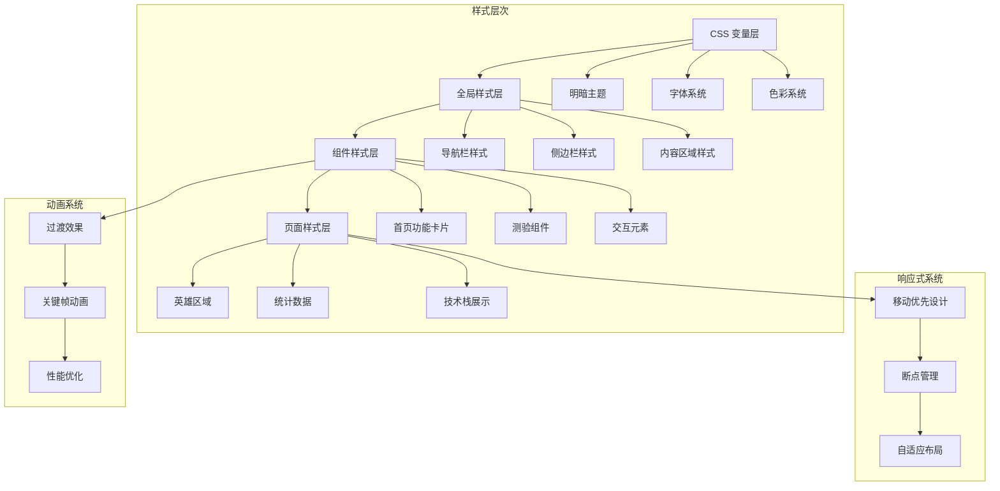

**图表来源**
- [custom.css:1-629](file://src/css/custom.css#L1-L629)
- [styles.module.css:1-260](file://src/components/HomepageFeatures/styles.module.css#L1-L260)
- [styles.module.css:1-800](file://src/components/Quiz/styles.module.css#L1-L800)

### 文档内容架构

项目文档按照 CSS 学习路径组织，从基础概念到高级特性：

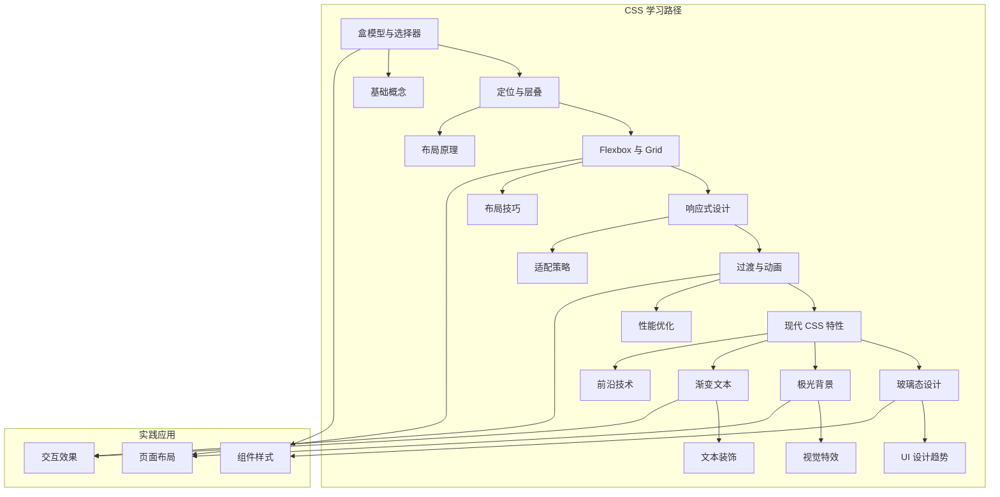

**图表来源**
- [box-model.md:1-188](file://docs/css/box-model.md#L1-L188)
- [positioning.md:1-237](file://docs/css/positioning.md#L1-L237)
- [flexbox-grid.md:1-288](file://docs/css/flexbox-grid.md#L1-L288)
- [responsive.md:1-275](file://docs/css/responsive.md#L1-L275)
- [animation.md:1-308](file://docs/css/animation.md#L1-L308)
- [modern-css.md:1-352](file://docs/css/modern-css.md#L1-L352)

**章节来源**
- [box-model.md:1-188](file://docs/css/box-model.md#L1-L188)
- [positioning.md:1-237](file://docs/css/positioning.md#L1-L237)
- [flexbox-grid.md:1-288](file://docs/css/flexbox-grid.md#L1-L288)
- [responsive.md:1-275](file://docs/css/responsive.md#L1-L275)
- [animation.md:1-308](file://docs/css/animation.md#L1-L308)
- [modern-css.md:1-352](file://docs/css/modern-css.md#L1-L352)

## 详细组件分析

### 盒模型与选择器系统

盒模型是 CSS 的基础概念，项目实现了标准的盒模型计算方式：

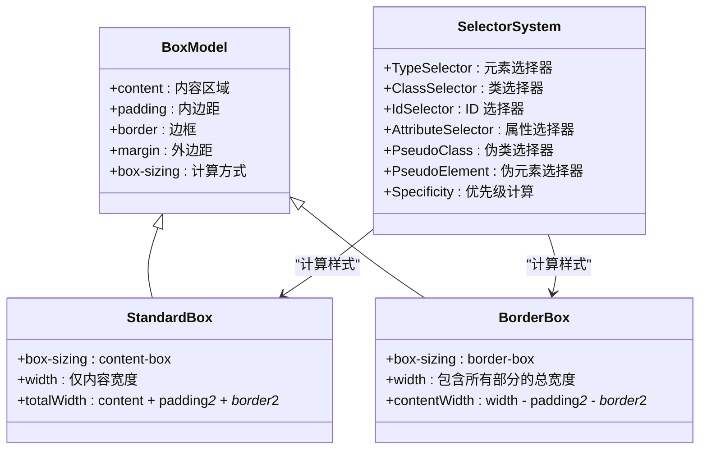

**图表来源**
- [box-model.md:12-45](file://docs/css/box-model.md#L12-L45)

### 定位与层叠系统

定位系统是 CSS 布局的核心，项目展示了多种定位方式的实现：

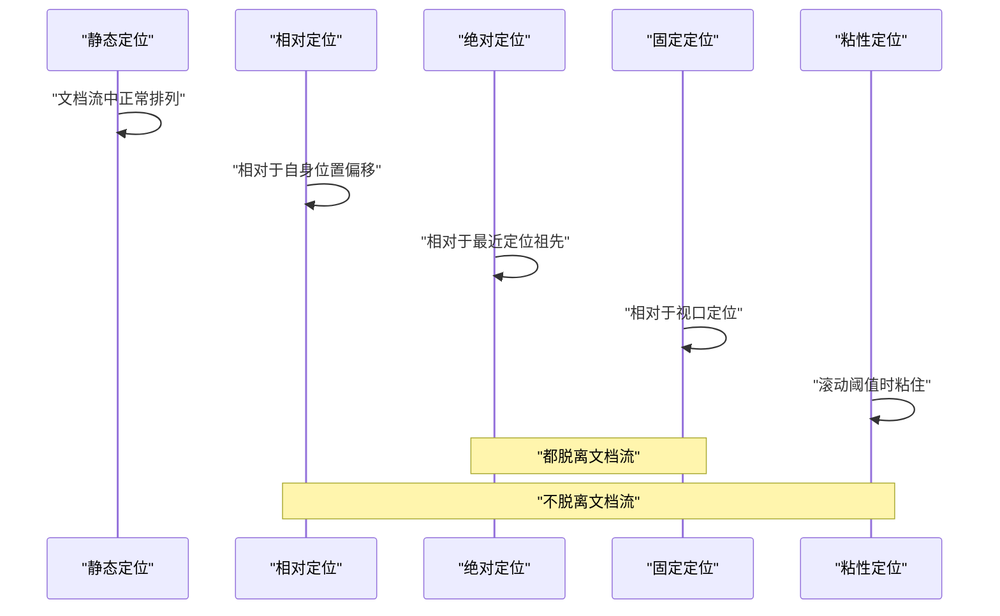

**图表来源**
- [positioning.md:14-44](file://docs/css/positioning.md#L14-L44)

### Flexbox 与 Grid 布局系统

现代 CSS 布局的两大支柱，项目提供了完整的实现示例：

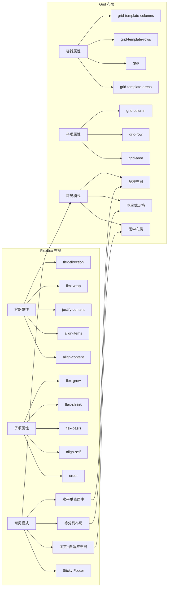

**图表来源**
- [flexbox-grid.md:14-141](file://docs/css/flexbox-grid.md#L14-L141)
- [flexbox-grid.md:147-250](file://docs/css/flexbox-grid.md#L147-L250)

### 响应式设计系统

响应式设计是现代网页开发的基本要求，项目实现了完整的响应式解决方案：

```mermaid
flowchart TD
subgraph "响应式策略"
A[移动优先] --> B[min-width 断点]
C[桌面优先] --> D[max-width 断点]
B --> E[渐进增强]
D --> F[优雅降级]
end
subgraph "断点系统"
G[1200px] --> H[大屏幕]
I[996px] --> J[平板]
K[768px] --> L[手机横屏]
M[480px] --> N[超小屏]
end
subgraph "单位系统"
O[相对单位] --> P[rem/em/vw/vh]
O --> Q[clamp/min/max]
R[容器查询] --> S[@container]
R --> T[容器类型]
end
A --> G
C --> K
P --> O
S --> R
```

**图表来源**
- [responsive.md:24-99](file://docs/css/responsive.md#L24-L99)
- [responsive.md:107-154](file://docs/css/responsive.md#L107-L154)

### 动画与过渡系统

现代网页的交互体验离不开动画效果，项目提供了完整的动画解决方案：

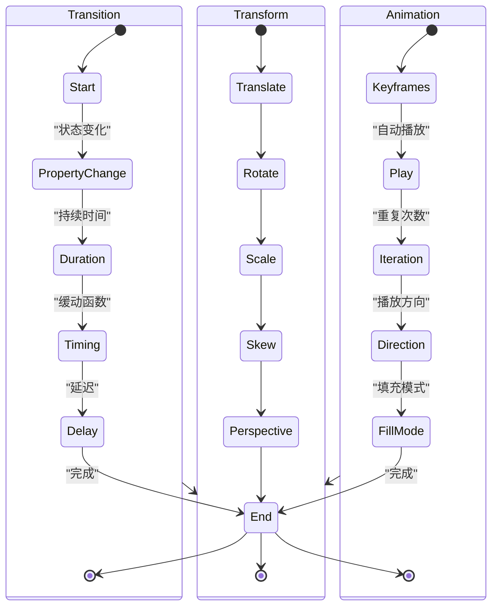

**图表来源**
- [animation.md:14-90](file://docs/css/animation.md#L14-L90)
- [animation.md:96-137](file://docs/css/animation.md#L96-L137)

### 现代 CSS 特性系统

随着 CSS 标准的发展，项目展示了最新的 CSS 特性：

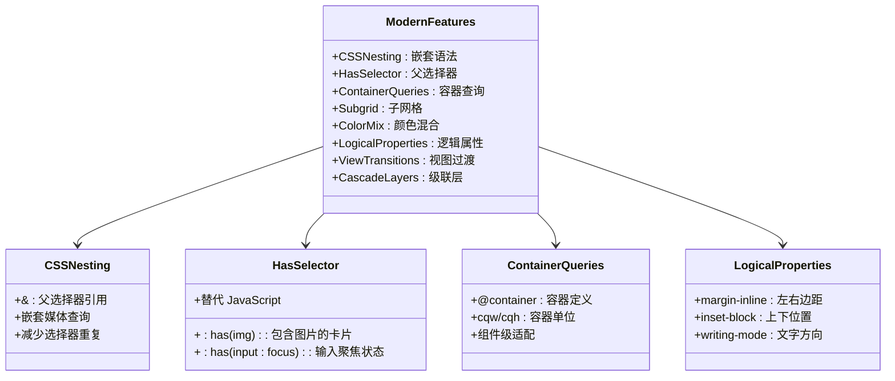

**图表来源**
- [modern-css.md:14-47](file://docs/css/modern-css.md#L14-L47)
- [modern-css.md:49-82](file://docs/css/modern-css.md#L49-L82)
- [modern-css.md:85-117](file://docs/css/modern-css.md#L85-L117)
- [modern-css.md:231-258](file://docs/css/modern-css.md#L231-L258)

**章节来源**
- [box-model.md:10-188](file://docs/css/box-model.md#L10-L188)
- [positioning.md:10-237](file://docs/css/positioning.md#L10-L237)
- [flexbox-grid.md:10-288](file://docs/css/flexbox-grid.md#L10-L288)
- [responsive.md:10-275](file://docs/css/responsive.md#L10-L275)
- [animation.md:10-308](file://docs/css/animation.md#L10-L308)
- [modern-css.md:10-352](file://docs/css/modern-css.md#L10-L352)

## 依赖分析

### 构建工具链

项目基于 Docusaurus 3.10.1 构建，采用了现代化的前端开发工具链：

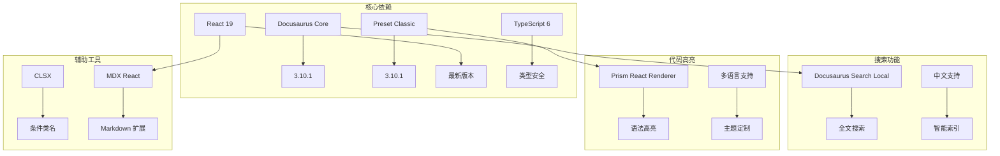

**图表来源**
- [package.json:26-35](file://package.json#L26-L35)

### 浏览器兼容性

项目针对现代浏览器进行了优化，同时保持了良好的兼容性：

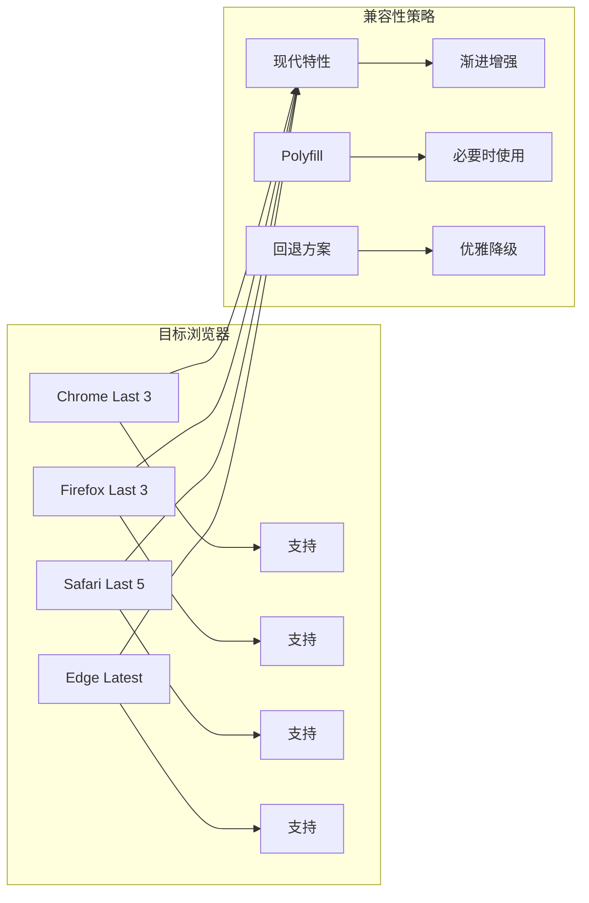

**图表来源**
- [package.json:51-62](file://package.json#L51-L62)

**章节来源**
- [package.json:1-67](file://package.json#L1-L67)

## 性能考虑

### 样式性能优化

项目在样式层面采用了多项性能优化策略：

1. **CSS 变量缓存**：通过 CSS 变量减少重复计算
2. **硬件加速**：合理使用 transform 和 opacity
3. **媒体查询优化**：使用移动优先策略
4. **组件化样式**：避免全局样式污染
5. **will-change 优化**：提前通知浏览器优化动画元素
6. **backdrop-filter 优化**：使用 -webkit-backdrop-filter 前缀

### 构建性能优化

1. **Tree Shaking**：移除未使用的样式
2. **代码分割**：按需加载样式
3. **缓存策略**：利用浏览器缓存
4. **压缩优化**：生产环境自动压缩

## 故障排除指南

### 常见样式问题

1. **盒模型计算错误**
   - 确保使用统一的 box-sizing: border-box
   - 检查 padding 和 border 的累加效果

2. **定位问题**
   - 理解包含块的概念
   - 注意 transform 对 fixed 定位的影响

3. **响应式断点**
   - 使用移动优先策略
   - 合理设置断点值

4. **动画性能**
   - 优先使用 transform 和 opacity
   - 避免触发布局的属性动画

5. **玻璃态效果问题**
   - 检查 backdrop-filter 浏览器兼容性
   - 确保有合适的背景内容才能看到模糊效果
   - 使用 -webkit-backdrop-filter 前缀提升兼容性

6. **极光背景性能**
   - 限制渐变层数，避免过多复杂渐变
   - 使用 will-change 提示浏览器优化
   - 在低性能设备上考虑禁用复杂动画

### 调试技巧

1. **开发者工具**
   - 使用 Elements 面板查看计算样式
   - 使用 Computed 面板分析最终样式

2. **样式检查**
   - 检查选择器优先级
   - 验证 CSS 变量的继承关系

3. **性能监控**
   - 使用 Performance 面板分析渲染性能
   - 监控合成层的使用情况

4. **兼容性测试**
   - 使用 Can I Use 检查特性支持
   - 在不同浏览器中测试效果

## 结论

这个 CSS 基础知识项目展示了现代前端开发的最佳实践，通过 Docusaurus 平台提供了丰富的学习资源。项目不仅涵盖了 CSS 的基础知识，还深入介绍了现代 CSS 的新特性和最佳实践，特别是玻璃态设计、极光背景动画和渐变文本等前沿技术。

项目的主要优势包括：
- **完整的 CSS 知识体系**：从基础概念到现代特性的全面覆盖
- **现代设计系统**：玻璃态设计、极光背景、渐变文本等前沿技术
- **先进的开发工具链**：基于 Docusaurus 3.10.1 的现代化构建流程
- **优秀的用户体验设计**：响应式布局、流畅动画、无障碍访问
- **良好的性能表现**：优化的样式结构和动画性能
- **详细的文档说明**：图文并茂的技术文档和学习资源

对于学习 CSS 的开发者来说，这是一个非常有价值的学习资源，既适合初学者入门，也能为有经验的开发者提供深入的技术洞察。项目中的玻璃态设计系统和极光背景动画更是紧跟当前 UI 设计趋势，具有很高的实用价值。