# ES6+ 新特性

<cite>
**本文档引用的文件**
- [es-features.md](file://docs/javascript/es-features.md)
- [async-patterns.md](file://docs/javascript/async-patterns.md)
- [closure-scope.md](file://docs/javascript/closure-scope.md)
- [prototype-chain.md](file://docs/javascript/prototype-chain.md)
- [type-system.md](file://docs/javascript/type-system.md)
- [index.md](file://docs/javascript/index.md)
- [package.json](file://package.json)
- [README.md](file://README.md)
</cite>

## 目录
1. [简介](#简介)
2. [项目结构](#项目结构)
3. [核心组件](#核心组件)
4. [架构概览](#架构概览)
5. [详细组件分析](#详细组件分析)
6. [依赖分析](#依赖分析)
7. [性能考虑](#性能考虑)
8. [故障排除指南](#故障排除指南)
9. [结论](#结论)
10. [附录](#附录)

## 简介

本项目是一个基于 Docusaurus 的现代化静态网站生成器，专门用于构建技术知识库文档。该项目的核心内容围绕 JavaScript 技术栈，特别是 ES6+ 新特性及其在现代前端开发中的应用。

ES6+（ECMAScript 2015 及后续版本）引入了许多革命性的语言特性，显著提升了 JavaScript 的表达能力和开发效率。从解构赋值到模块化，从箭头函数到 Promise，这些特性不仅改变了我们编写代码的方式，也为现代前端开发奠定了坚实的基础。

本知识库旨在为开发者提供系统化的 ES6+ 学习资源，涵盖：
- 核心语言特性详解与最佳实践
- 异步编程模式的深度解析
- 与传统 JavaScript 的兼容性与迁移策略
- 面试常见问题的深入分析
- 性能影响与优化建议

## 项目结构

该项目采用 Docusaurus 框架构建，具有清晰的文档组织结构：

```mermaid
graph TB
subgraph "项目根目录"
Root[项目根目录]
Docs[docs/ 文档目录]
Src[src/ 源码目录]
Static[static/ 静态资源]
end
subgraph "文档结构"
JSDocs[javascript/ JavaScript 文档]
AIDocs[ai/ AI 相关文档]
EngDocs[engineering/ 工程化文档]
VueDocs[vue/ Vue 相关文档]
ReactDocs[react/ React 相关文档]
TS Docs[typescript/ TypeScript 文档]
PerfDocs[performance/ 性能优化文档]
end
subgraph "JavaScript 文档子目录"
ES6[es-features.md]
Async[async-patterns.md]
Closure[closure-scope.md]
Proto[prototype-chain.md]
Type[type-system.md]
end
Root --> Docs
Root --> Src
Root --> Static
Docs --> JSDocs
Docs --> AIDocs
Docs --> EngDocs
Docs --> VueDocs
Docs --> ReactDocs
Docs --> TS Docs
Docs --> PerfDocs
JSDocs --> ES6
JSDocs --> Async
JSDocs --> Closure
JSDocs --> Proto
JSDocs --> Type
```

**图表来源**
- [README.md:1-42](file://README.md#L1-L42)
- [package.json:1-50](file://package.json#L1-L50)

**章节来源**
- [README.md:1-42](file://README.md#L1-L42)
- [package.json:1-50](file://package.json#L1-L50)

## 核心组件

### ES6+ 常用特性模块

该模块是整个知识库的核心，系统性地介绍了 ES6+ 的关键特性。内容涵盖了从基础语法到高级特性的完整体系。

### 异步编程模式模块

专注于现代 JavaScript 异步编程模型，深入解析 Promise、async/await 等异步处理机制。

### 语言基础模块

提供 JavaScript 语言核心概念的深度解析，包括闭包、作用域、原型链和类型系统等基础知识。

**章节来源**
- [es-features.md:1-98](file://docs/javascript/es-features.md#L1-L98)
- [async-patterns.md:1-106](file://docs/javascript/async-patterns.md#L1-L106)
- [closure-scope.md:1-88](file://docs/javascript/closure-scope.md#L1-L88)

## 架构概览

项目采用模块化架构设计，各个功能模块相对独立又相互关联：

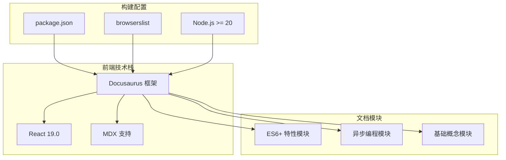

**图表来源**
- [package.json:17-49](file://package.json#L17-L49)

**章节来源**
- [package.json:17-49](file://package.json#L17-L49)

## 详细组件分析

### 解构赋值与展开运算符

解构赋值是 ES6 最具革命性的特性之一，它提供了简洁而强大的数据提取方式。

#### 核心特性对比

| 特性 | 对象解构 | 数组解构 | 嵌套解构 |
|------|----------|----------|----------|
| 语法 | `{ name, age }` | `[first, ...rest]` | `{ a: { b } }` |
| 默认值 | `age = 18` | 不支持 | 支持嵌套默认值 |
| 重命名 | `name: newName` | 不支持 | 支持嵌套重命名 |
| 嵌套支持 | ✅ | ❌ | ✅ |

#### 实际应用场景

解构赋值在以下场景中特别有用：
- 函数参数处理和默认值设置
- 对象属性的条件提取
- 数组元素的模式匹配
- 嵌套数据结构的扁平化处理

**章节来源**
- [es-features.md:10-24](file://docs/javascript/es-features.md#L10-L24)

### 箭头函数与传统函数

箭头函数提供了更简洁的函数语法，但其行为与传统函数存在重要差异。

#### 行为差异对比

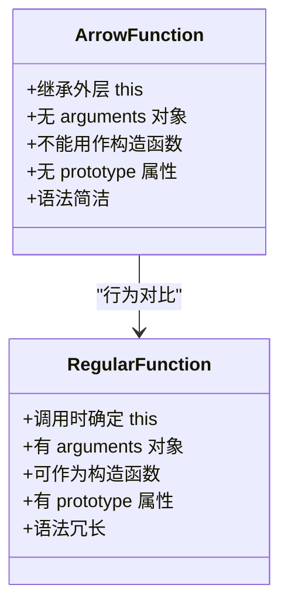

**图表来源**
- [es-features.md:39-58](file://docs/javascript/es-features.md#L39-L58)

#### 使用场景选择

- **箭头函数适用场景**：回调函数、简短的纯函数、事件处理器
- **传统函数适用场景**：构造函数、方法定义、需要动态 this 绑定的场景

**章节来源**
- [es-features.md:39-58](file://docs/javascript/es-features.md#L39-L58)

### Map 数据结构与 Object 对比

Map 提供了更强大和灵活的数据存储解决方案。

#### 功能对比表

| 特性 | Map | Object |
|------|-----|--------|
| 键的类型 | 任意类型 | 字符串/Symbol |
| 插入顺序 | 保持插入顺序 | 无序 |
| 大小获取 | `map.size` | 需要手动计算 |
| 迭代支持 | 直接可迭代 | 需要额外方法 |
| 性能表现 | 适合频繁增删 | 适合固定结构数据 |
| 内存管理 | 弱引用支持 | 强引用持有 |

#### 性能特征分析

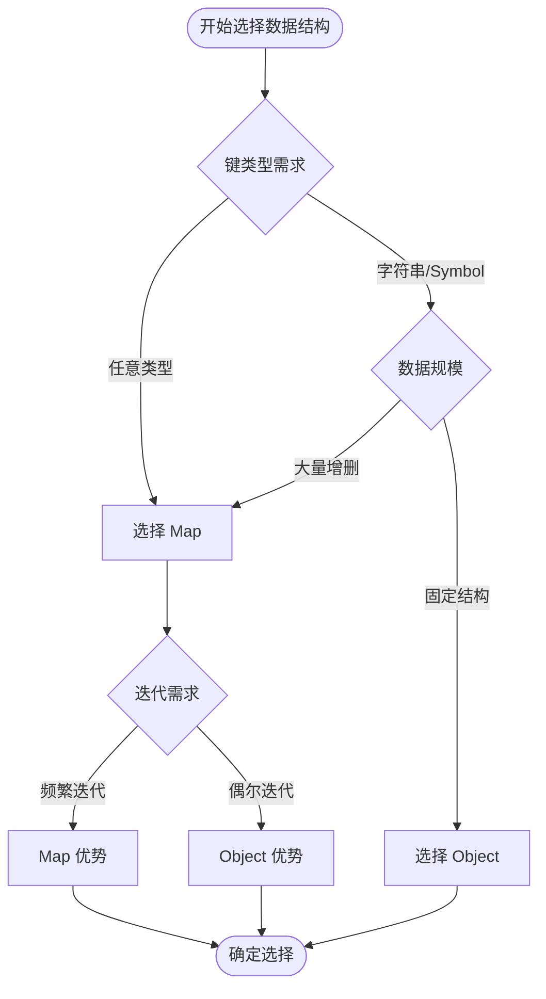

**图表来源**
- [es-features.md:60-76](file://docs/javascript/es-features.md#L60-L76)

**章节来源**
- [es-features.md:60-76](file://docs/javascript/es-features.md#L60-L76)

### 可选链与空值合并操作符

这两个操作符显著简化了深层对象访问和默认值处理。

#### 操作符语义对比

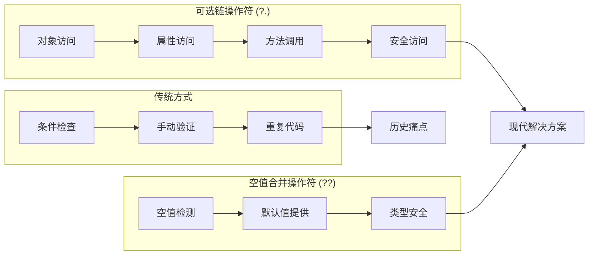

**图表来源**
- [es-features.md:78-90](file://docs/javascript/es-features.md#L78-L90)

#### 使用场景分析

- **可选链**：API 响应处理、DOM 元素访问、深层对象遍历
- **空值合并**：配置项默认值、用户输入验证、条件渲染

**章节来源**
- [es-features.md:78-90](file://docs/javascript/es-features.md#L78-L90)

### 异步编程模式深度解析

异步编程是现代 JavaScript 开发的核心技能，涉及多种模式和技术。

#### Promise 执行流程

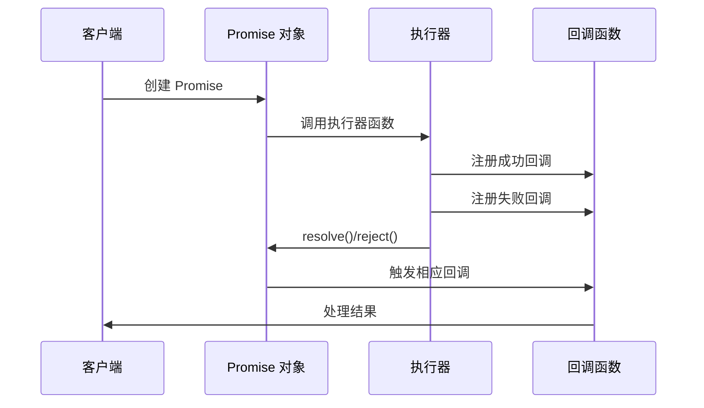

**图表来源**
- [async-patterns.md:10-18](file://docs/javascript/async-patterns.md#L10-L18)

#### async/await 执行顺序

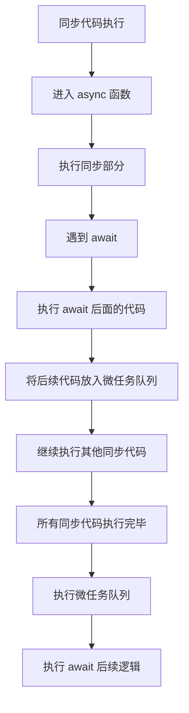

**图表来源**
- [async-patterns.md:48-66](file://docs/javascript/async-patterns.md#L48-L66)

**章节来源**
- [async-patterns.md:10-106](file://docs/javascript/async-patterns.md#L10-L106)

### 闭包与作用域机制

闭包是 JavaScript 中最重要的概念之一，理解闭包对于掌握现代 JavaScript 至关重要。

#### 闭包形成机制

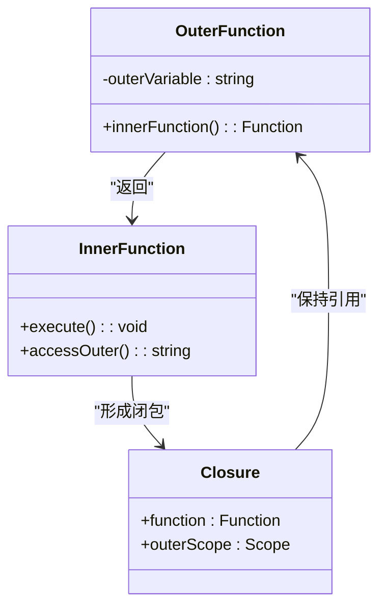

**图表来源**
- [closure-scope.md:10-27](file://docs/javascript/closure-scope.md#L10-L27)

#### 经典问题解决

**循环中的闭包陷阱**：
- 问题：使用 `var` 声明的循环变量在所有回调中共享
- 解决方案：使用 `let` 实现块级作用域，或使用 IIFE 创建独立作用域

**章节来源**
- [closure-scope.md:29-61](file://docs/javascript/closure-scope.md#L29-L61)

### 原型链与继承机制

JavaScript 的原型链系统是理解面向对象编程的关键。

#### 原型三角关系

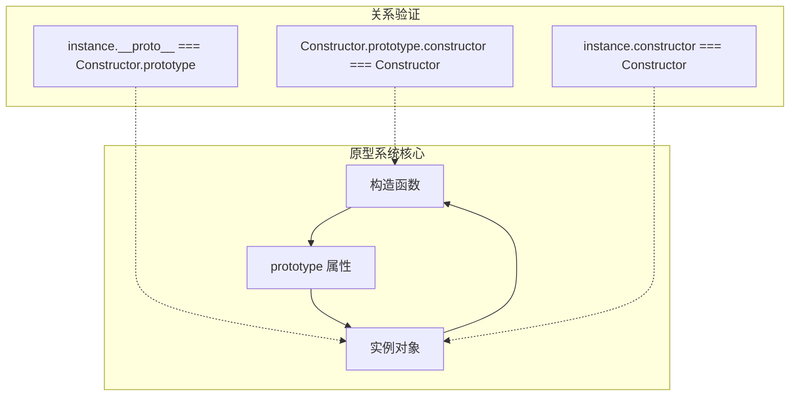

**图表来源**
- [prototype-chain.md:10-34](file://docs/javascript/prototype-chain.md#L10-L34)

#### ES6 Class 语法糖

ES6 的 `class` 关键字本质上是原型链继承的语法糖：

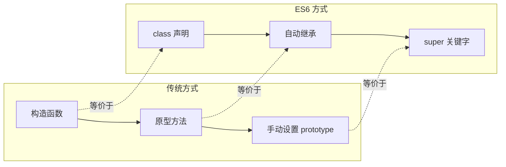

**图表来源**
- [prototype-chain.md:51-68](file://docs/javascript/prototype-chain.md#L51-L68)

**章节来源**
- [prototype-chain.md:51-68](file://docs/javascript/prototype-chain.md#L51-L68)

### 类型系统与类型判断

准确的类型判断是 JavaScript 开发中的基础技能。

#### 类型系统概览

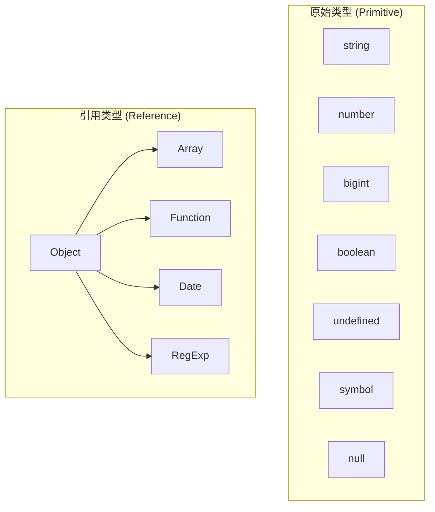

**图表来源**
- [type-system.md:10-14](file://docs/javascript/type-system.md#L10-L14)

#### 类型判断工具函数

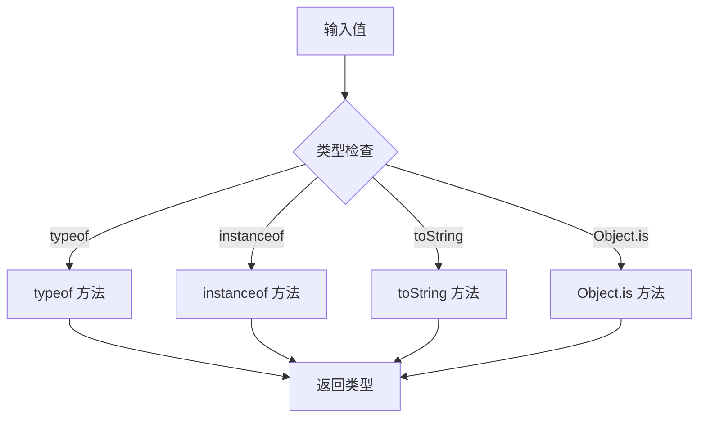

**图表来源**
- [type-system.md:27-39](file://docs/javascript/type-system.md#L27-L39)

**章节来源**
- [type-system.md:16-68](file://docs/javascript/type-system.md#L16-L68)

## 依赖分析

项目的技术栈和依赖关系体现了现代前端开发的最佳实践：

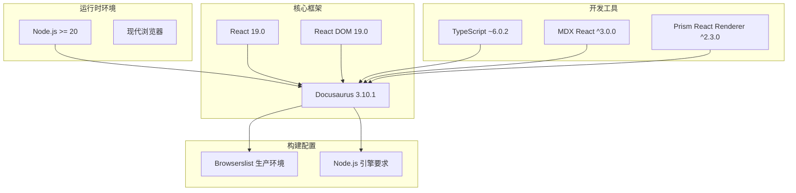

**图表来源**
- [package.json:17-49](file://package.json#L17-L49)

### 浏览器兼容性矩阵

| 浏览器 | Chrome | Firefox | Safari | Edge |
|--------|--------|---------|--------|------|
| 支持版本 | 最新 3 个版本 | 最新 3 个版本 | 最新 5 个版本 | >0.5% 市场份额 |
| 兼容性 | 良好 | 良好 | 良好 | 良好 |

**章节来源**
- [package.json:34-48](file://package.json#L34-L48)

## 性能考虑

### ES6+ 特性性能影响分析

#### 解构赋值性能
- **优点**：语法简洁，减少样板代码
- **缺点**：在大型对象上可能产生额外的属性访问开销
- **建议**：对性能敏感的场景谨慎使用深层解构

#### 箭头函数性能
- **优点**：编译后代码更简洁
- **缺点**：无法使用 `new` 关键字，无 `arguments`
- **建议**：在不需要动态 `this` 的场景使用箭头函数

#### Map vs Object
- **Map**：适合频繁增删的场景，内存占用更合理
- **Object**：适合固定结构的配置数据
- **建议**：根据使用模式选择合适的数据结构

### 异步编程性能优化

#### Promise 链式调用优化
- 避免不必要的中间 Promise 创建
- 合理使用 `Promise.all` 并行处理
- 注意错误处理的性能开销

#### async/await 性能考量
- `await` 会阻塞当前函数执行
- 合理安排并发和串行操作
- 注意微任务队列的性能影响

## 故障排除指南

### 常见问题诊断

#### 解构赋值相关问题
- **问题**：解构失败或得到 `undefined`
- **原因**：目标对象属性不存在或为 `null`
- **解决方案**：使用默认值或条件检查

#### 箭头函数 `this` 绑定问题
- **问题**：箭头函数中 `this` 指向不正确
- **原因**：箭头函数继承外层作用域的 `this`
- **解决方案**：在需要动态 `this` 的场景使用传统函数

#### Map 键值类型问题
- **问题**：Map 键值类型不符合预期
- **原因**：Map 可以接受任意类型的键
- **解决方案**：明确键值类型约定，避免类型混淆

### 调试技巧

#### 异步代码调试
- 使用浏览器开发者工具的断点调试
- 利用 `console.trace()` 追踪异步调用链
- 分析微任务队列的执行顺序

#### 闭包内存泄漏排查
- 使用内存分析工具检测对象引用
- 检查闭包是否意外持有大对象引用
- 及时清理不再使用的闭包引用

**章节来源**
- [es-features.md:92-98](file://docs/javascript/es-features.md#L92-L98)

## 结论

ES6+ 新特性为现代 JavaScript 开发带来了革命性的变化。通过系统学习和实践这些特性，开发者可以：

1. **提升开发效率**：简洁的语法和强大的功能减少了样板代码
2. **改善代码质量**：更好的抽象能力使代码更易维护
3. **增强团队协作**：标准化的特性使用提高了代码一致性
4. **适应现代开发**：掌握这些特性有助于使用最新的前端工具链

本知识库提供了从基础概念到高级应用的完整学习路径，配合实际的代码示例和最佳实践建议，帮助开发者在实际项目中有效运用 ES6+ 特性。

## 附录

### 面试常见问题索引

#### ES6+ 基础特性
- 解构赋值的语法和应用场景
- 箭头函数与传统函数的区别
- 模板字符串的使用技巧
- Set/Map 的性能对比

#### 异步编程
- Promise 的状态转换和链式调用
- async/await 的执行机制
- Generator 函数的使用场景
- 事件循环的理解和应用

#### 高级概念
- 闭包的形成机制和应用场景
- 原型链的工作原理
- 类继承的实现方式
- 模块化系统的理解

### 学习路径建议

1. **入门阶段**：掌握基础语法特性（解构、箭头函数、模板字符串）
2. **进阶阶段**：深入理解异步编程模式（Promise、async/await）
3. **高级阶段**：掌握复杂概念（闭包、原型链、模块化）
4. **实践阶段**：在实际项目中应用所学知识