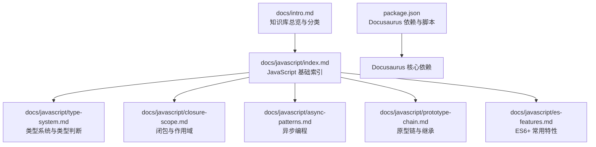
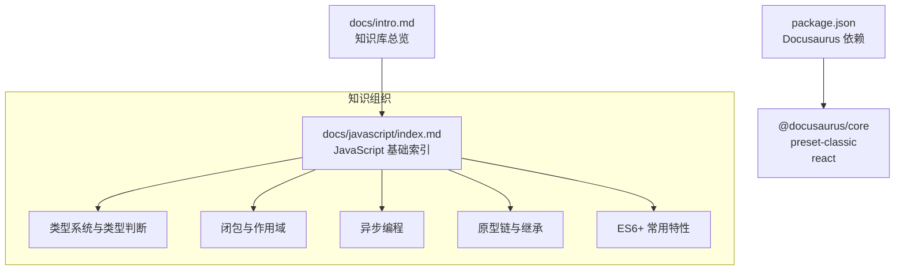
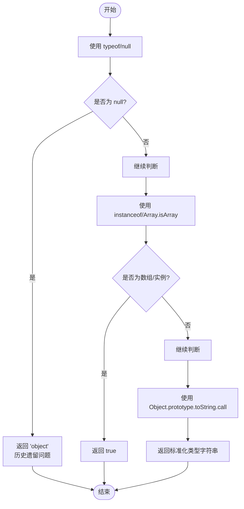
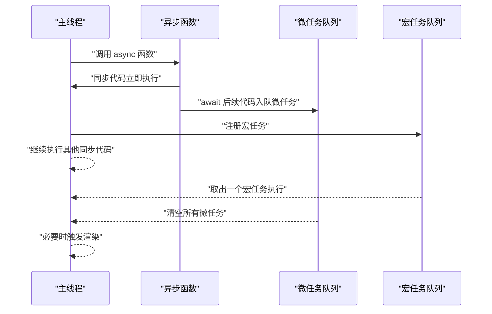
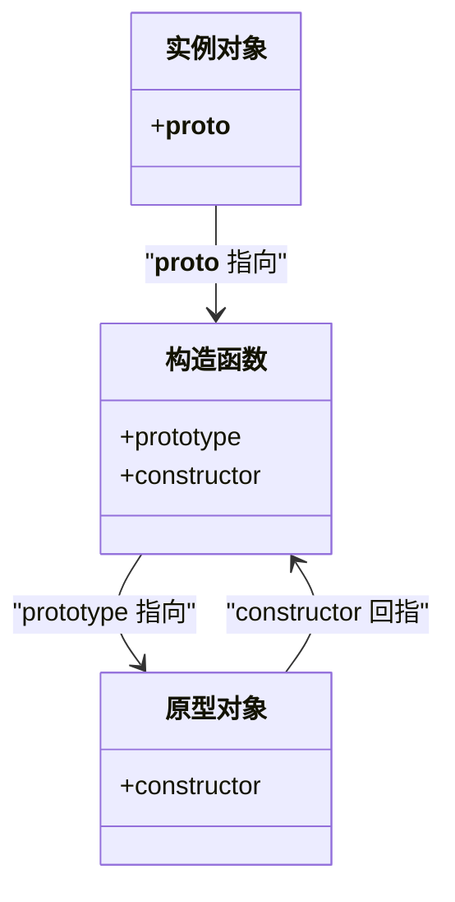
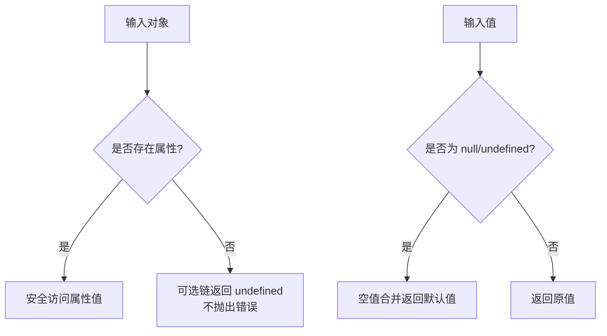
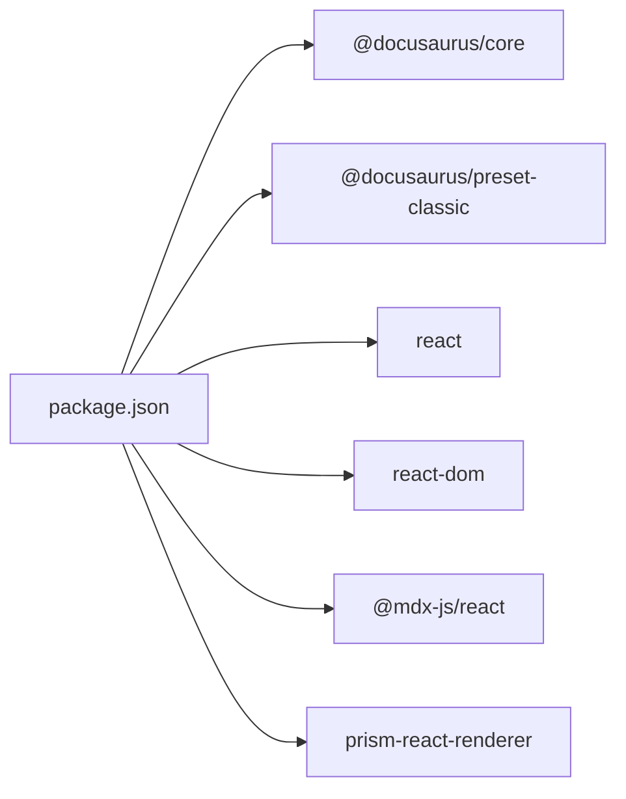

# JavaScript 基础知识

<cite>
**本文引用的文件**
- [docs/javascript/index.md](file://docs/javascript/index.md)
- [docs/javascript/type-system.md](file://docs/javascript/type-system.md)
- [docs/javascript/closure-scope.md](file://docs/javascript/closure-scope.md)
- [docs/javascript/async-patterns.md](file://docs/javascript/async-patterns.md)
- [docs/javascript/prototype-chain.md](file://docs/javascript/prototype-chain.md)
- [docs/javascript/es-features.md](file://docs/javascript/es-features.md)
- [docs/intro.md](file://docs/intro.md)
- [package.json](file://package.json)
</cite>

## 目录
1. [引言](#引言)
2. [项目结构](#项目结构)
3. [核心组件](#核心组件)
4. [架构总览](#架构总览)
5. [详细组件分析](#详细组件分析)
6. [依赖分析](#依赖分析)
7. [性能考虑](#性能考虑)
8. [故障排查指南](#故障排查指南)
9. [结论](#结论)
10. [附录](#附录)

## 引言
本文件面向前端面试与工程实践，系统梳理 JavaScript 的核心知识体系，覆盖类型系统、闭包与作用域、异步编程模式、原型链机制与继承、ES6+ 新特性等关键主题。文档以“理论—应用—面试”为主线，既适合初学者循序渐进学习，也为有经验的开发者提供深入的技术细节与最佳实践建议。文中所有示例均来自仓库内的 Markdown 文档，便于读者对照学习与查阅。

## 项目结构
该知识库基于 Docusaurus 构建，采用按主题分门别类的组织方式。JavaScript 基础模块位于 docs/javascript 目录下，包含独立的知识卡片式文档，配合侧边栏导航与难度标签，便于按需学习与复习。



图表来源
- [docs/javascript/index.md:1-16](file://docs/javascript/index.md#L1-L16)
- [docs/javascript/type-system.md:1-68](file://docs/javascript/type-system.md#L1-L68)
- [docs/javascript/closure-scope.md:1-88](file://docs/javascript/closure-scope.md#L1-L88)
- [docs/javascript/async-patterns.md:1-106](file://docs/javascript/async-patterns.md#L1-L106)
- [docs/javascript/prototype-chain.md:1-108](file://docs/javascript/prototype-chain.md#L1-L108)
- [docs/javascript/es-features.md:1-98](file://docs/javascript/es-features.md#L1-L98)
- [package.json:17-26](file://package.json#L17-L26)

章节来源
- [docs/javascript/index.md:1-16](file://docs/javascript/index.md#L1-L16)
- [docs/intro.md:1-35](file://docs/intro.md#L1-L35)
- [package.json:1-50](file://package.json#L1-L50)

## 核心组件
本知识库围绕以下六大主题构建，每个主题对应一个独立的知识卡片文档，便于按需学习与复习：
- 类型系统与类型判断：原始类型、引用类型、typeof 与 instanceof、严格相等与 Object.is、常见陷阱与修复策略
- 闭包与作用域：闭包定义、作用域链、经典循环闭包问题与修复方案
- 异步编程：Promise 基础、手写 Promise.all、async/await 执行顺序、事件循环与微任务/宏任务
- 原型链与继承：原型三角关系、new 操作符实现、ES6 class 继承、寄生组合继承、instanceof 原理
- ES6+ 常用特性：解构赋值、展开/剩余运算符、箭头函数、Map/Object、可选链与空值合并
- JavaScript 基础索引：面试题汇总与导航入口

章节来源
- [docs/javascript/type-system.md:1-68](file://docs/javascript/type-system.md#L1-L68)
- [docs/javascript/closure-scope.md:1-88](file://docs/javascript/closure-scope.md#L1-L88)
- [docs/javascript/async-patterns.md:1-106](file://docs/javascript/async-patterns.md#L1-L106)
- [docs/javascript/prototype-chain.md:1-108](file://docs/javascript/prototype-chain.md#L1-L108)
- [docs/javascript/es-features.md:1-98](file://docs/javascript/es-features.md#L1-L98)
- [docs/javascript/index.md:1-16](file://docs/javascript/index.md#L1-L16)

## 架构总览
从知识组织的角度看，本知识库采用“主题卡片 + 导航索引”的结构化布局：
- 主入口：docs/javascript/index.md 提供 JavaScript 基础主题的导航与题单入口
- 子主题：各知识点文档独立成篇，包含理论要点、示例与关键点总结
- 技术栈：Docusaurus 3.x + React，通过 MDX 支持富文本与交互式组件



图表来源
- [docs/javascript/index.md:1-16](file://docs/javascript/index.md#L1-L16)
- [docs/intro.md:1-35](file://docs/intro.md#L1-L35)
- [package.json:17-26](file://package.json#L17-L26)

## 详细组件分析

### 类型系统与类型判断
- 数据类型划分
  - 原始类型：字符串、数值、BigInt、布尔、未定义、Symbol、Null
  - 引用类型：Object 及其派生（Array、Function、Date、RegExp 等）
- 类型判断工具
  - typeof：对原始类型有效，但存在历史遗留问题（如 typeof null === "object"）
  - instanceof：基于原型链判断实例关系，适合对象类型判断
  - Object.prototype.toString.call：最精确的通用类型判断方法
- 相等性比较
  - ==：存在隐式类型转换，易引发意外结果
  - ===：严格相等，不进行类型转换
  - Object.is：区分 +0/-0 与 NaN，比 === 更严格
- 实战建议
  - 判断数组优先使用 Array.isArray()
  - 精确类型判断统一使用 Object.prototype.toString.call
  - 尽量使用 ===，避免 == 的隐式转换陷阱



图表来源
- [docs/javascript/type-system.md:16-39](file://docs/javascript/type-system.md#L16-L39)

章节来源
- [docs/javascript/type-system.md:1-68](file://docs/javascript/type-system.md#L1-L68)

### 闭包与作用域
- 闭包定义与特征
  - 闭包 = 函数 + 外部作用域的引用
  - 即使外部函数执行完毕，内部仍可访问外部变量
- 作用域链
  - 词法作用域（静态作用域），在函数定义时确定
  - 查找顺序遵循“当前作用域 -> 外部作用域 -> 全局作用域”
- 经典面试题：循环中的闭包
  - 问题：var 声明的循环变量在回调中被共享，导致输出异常
  - 修复方案：
    - 使用 let/const（块级作用域）
    - 使用 IIFE 为每次迭代创建独立作用域
- 实战建议
  - 闭包常用于数据私有化、函数工厂、柯里化等场景
  - 注意闭包持有的外部变量可能造成内存泄漏，及时释放引用

```mermaid
sequenceDiagram
participant Loop as "循环"
participant Fn as "回调函数"
participant Scope as "外部作用域"
Loop->>Scope : "i 初始化"
loop "i 从 0 到 4"
Loop->>Fn : "注册回调捕获 i 的引用"
end
Note over Loop,Fn : "所有回调共享同一 i 引用"
Fn-->>Loop : "执行回调时输出最终 i 值"
Note over Loop,Scope : "修复：使用 let 或 IIFE"
```

图表来源
- [docs/javascript/closure-scope.md:29-61](file://docs/javascript/closure-scope.md#L29-L61)

章节来源
- [docs/javascript/closure-scope.md:1-88](file://docs/javascript/closure-scope.md#L1-L88)

### 异步编程
- Promise 基础
  - Promise 构造函数中的代码同步执行
  - then/catch 注册的回调属于微任务，优先级高于宏任务
- 手写 Promise.all
  - 并发等待多个 Promise，任一失败即整体失败
  - 保持输入顺序，收集结果数组
- async/await 执行顺序
  - 同步代码先执行
  - await 后的代码进入微任务队列
  - 宏任务每次取一个，微任务每次清空全部
- 事件循环（Event Loop）
  - 宏任务队列：定时器、I/O、UI 渲染
  - 微任务队列：Promise.then、MutationObserver、queueMicrotask
  - 渲染阶段：在合适的时机进行



图表来源
- [docs/javascript/async-patterns.md:76-98](file://docs/javascript/async-patterns.md#L76-L98)

章节来源
- [docs/javascript/async-patterns.md:1-106](file://docs/javascript/async-patterns.md#L1-L106)

### 原型链与继承
- 原型三角关系
  - 构造函数 ←── 原型对象
  - 实例对象 ←── 原型链
  - 每个对象的 __proto__ 指向其构造函数的 prototype
- new 操作符的实现
  - 创建空对象，原型指向构造函数的 prototype
  - 以新对象为 this 执行构造函数
  - 若构造函数返回对象则返回该对象，否则返回新对象
- 继承方式
  - ES6 class 继承：语法糖，本质为寄生组合继承
  - 寄生组合继承：通过 Object.create 与原型链修正实现高效继承
- instanceof 原理
  - 通过逐层比较对象的 __proto__ 与其构造函数的 prototype，直到 null



图表来源
- [docs/javascript/prototype-chain.md:10-34](file://docs/javascript/prototype-chain.md#L10-L34)

章节来源
- [docs/javascript/prototype-chain.md:1-108](file://docs/javascript/prototype-chain.md#L1-L108)

### ES6+ 常用特性
- 解构赋值
  - 对象/数组解构、默认值、嵌套解构
- 展开运算符 vs 剩余参数
  - 展开运算符用于展开数组/对象
  - 剩余参数用于收集剩余参数为数组
- 箭头函数 vs 普通函数
  - this 绑定差异、无 arguments/new、无 prototype
- Map vs Object
  - 键类型、顺序、大小、迭代方式差异
- 可选链与空值合并
  - 可选链 ?.: 安全访问深层属性
  - 空值合并 ??: 仅在 null/undefined 时生效，不同于 || 的 falsy 判断



图表来源
- [docs/javascript/es-features.md:78-90](file://docs/javascript/es-features.md#L78-L90)

章节来源
- [docs/javascript/es-features.md:1-98](file://docs/javascript/es-features.md#L1-L98)

## 依赖分析
- 技术栈
  - Docusaurus 3.x：文档站点框架，支持 MDX、主题与插件生态
  - React 19：页面渲染与组件化
  - @docusaurus/preset-classic：经典主题预设
- 开发与运行
  - Node.js >= 20
  - 常用脚本：start、build、serve、deploy、clear、write-heading-ids、typecheck



图表来源
- [package.json:17-26](file://package.json#L17-L26)

章节来源
- [package.json:1-50](file://package.json#L1-L50)

## 性能考虑
- 类型判断与相等性
  - 使用 Array.isArray 与 Object.prototype.toString.call 替代 ==，减少隐式转换带来的性能与可读性问题
- 闭包与内存
  - 避免在闭包中长期持有大型对象或全局引用，防止内存泄漏
- 异步执行
  - 合理使用 Promise.all 并发控制，避免过多并发导致资源争用
  - 使用可选链与空值合并在访问深层属性时减少不必要的 try/catch
- 原型链与继承
  - ES6 class 继承更直观，寄生组合继承在需要兼容旧环境时更高效

## 故障排查指南
- typeof null 返回 "object"
  - 现象：typeof null === "object"
  - 原因：历史遗留问题
  - 解决：改用 Object.prototype.toString.call 或 Array.isArray 判断
- 循环中的闭包陷阱
  - 症状：回调输出相同值（通常是循环结束后的最终值）
  - 修复：使用 let/const 或 IIFE 为每次迭代创建独立作用域
- Promise.all 与错误传播
  - 症状：任一 Promise 失败导致整体失败
  - 建议：在并发请求中对单个请求进行容错处理，或使用 race 控制超时
- 箭头函数与 this
  - 症状：箭头函数内无法访问到正确的 this
  - 修复：在需要动态 this 的场景使用普通函数或显式绑定
- 可选链与空值合并误用
  - 症状：|| 与 ?? 混淆导致逻辑错误
  - 建议：明确语义差异，仅在 null/undefined 时回退使用 ??

章节来源
- [docs/javascript/type-system.md:16-68](file://docs/javascript/type-system.md#L16-L68)
- [docs/javascript/closure-scope.md:29-88](file://docs/javascript/closure-scope.md#L29-L88)
- [docs/javascript/async-patterns.md:20-46](file://docs/javascript/async-patterns.md#L20-L46)
- [docs/javascript/es-features.md:78-98](file://docs/javascript/es-features.md#L78-L98)

## 结论
本知识库以“JavaScript 基础”为主题，系统覆盖类型系统、闭包与作用域、异步编程、原型链与继承、ES6+ 特性等核心知识点，并结合面试高频考点与实战建议，形成从入门到进阶的完整学习路径。建议读者按主题顺序学习，配合仓库中的示例与练习，逐步建立扎实的前端基础能力。

## 附录
- 学习路径建议
  - 初学者：从类型系统与 ES6+ 特性入手，再深入闭包与作用域，最后掌握异步编程与原型链
  - 进阶者：重点攻克异步执行顺序与事件循环、原型链实现与继承模式、闭包在工程中的最佳实践
- 面试关注点
  - 类型判断与相等性：区分 typeof/instanceof/Object.prototype.toString.call
  - 闭包与作用域：循环闭包、内存泄漏防范
  - 异步编程：Promise.all、async/await、事件循环优先级
  - 原型链与继承：new 实现、ES6 class、寄生组合继承、instanceof 原理
  - ES6+：解构、展开/剩余、箭头函数、Map/Object、可选链与空值合并