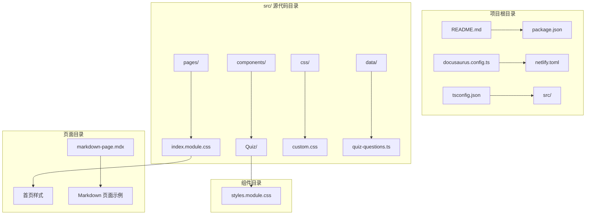
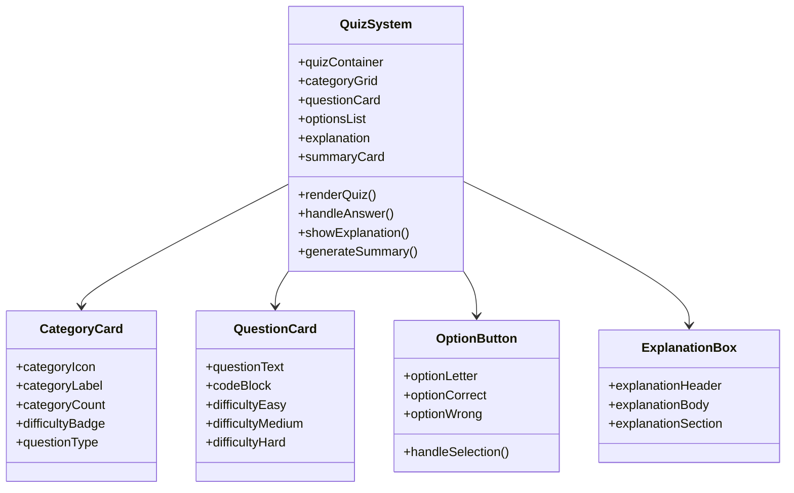
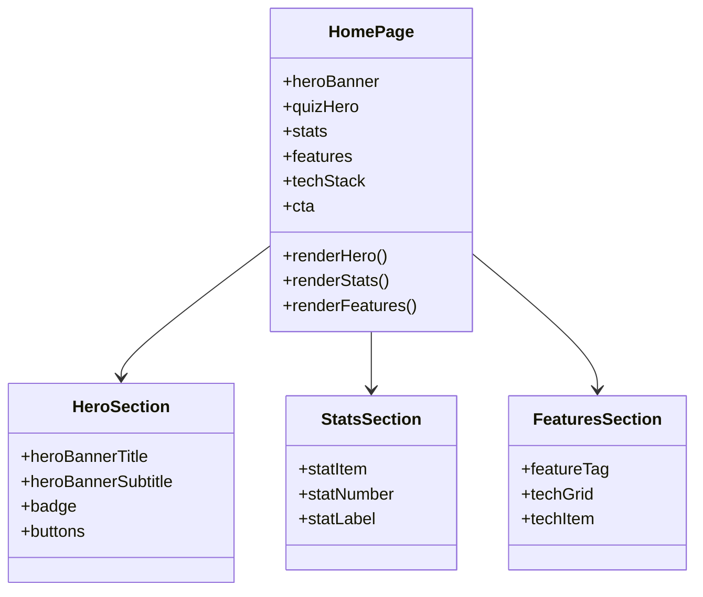
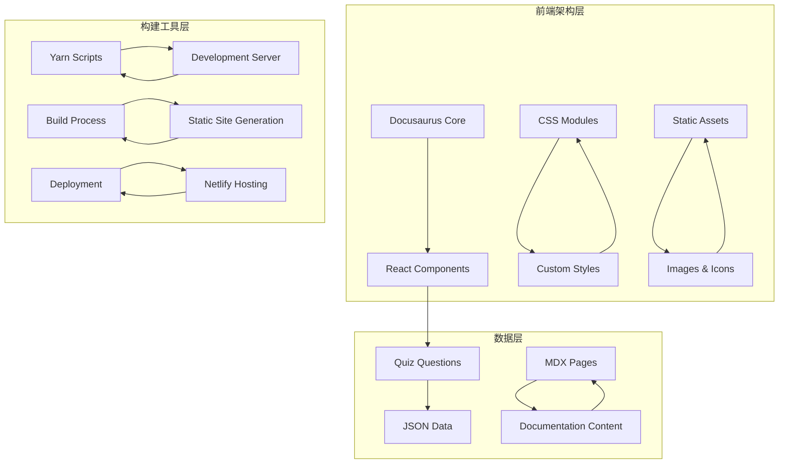
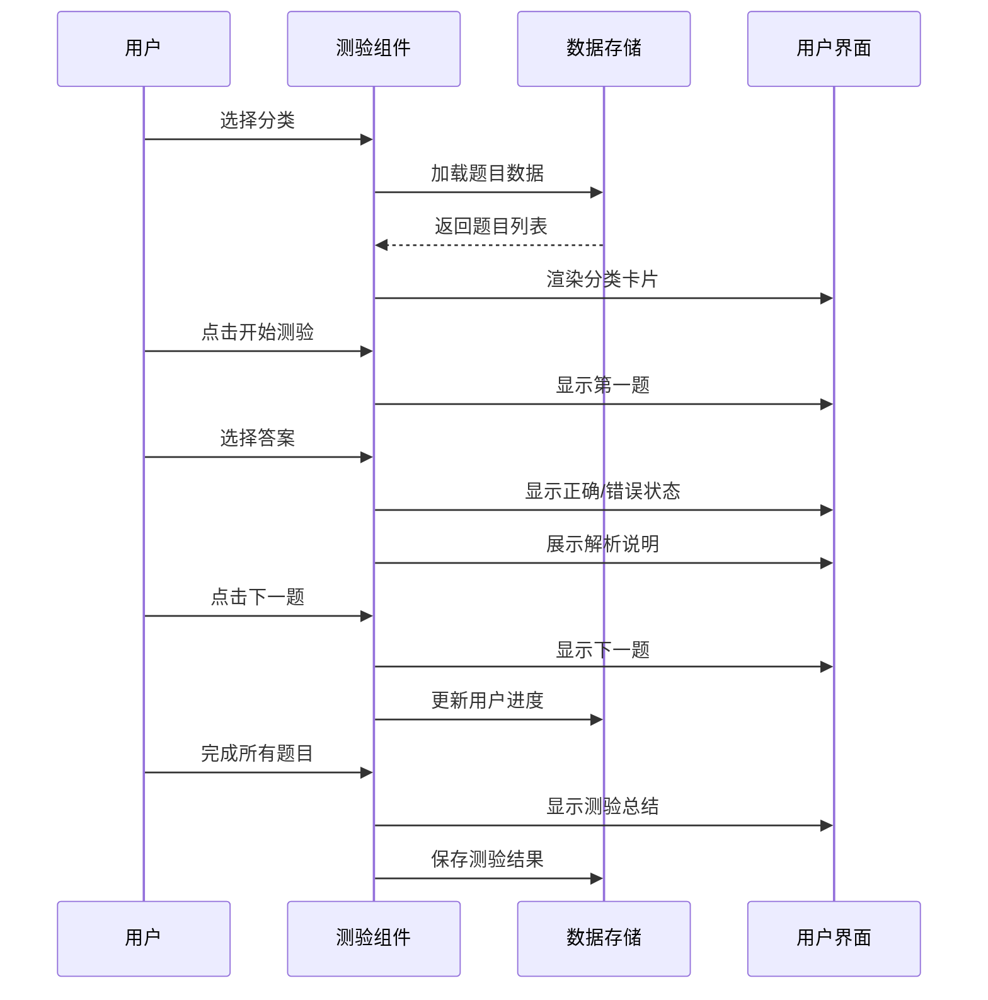
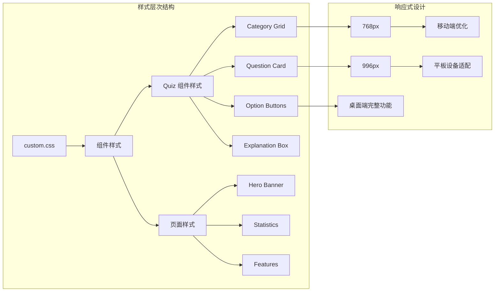
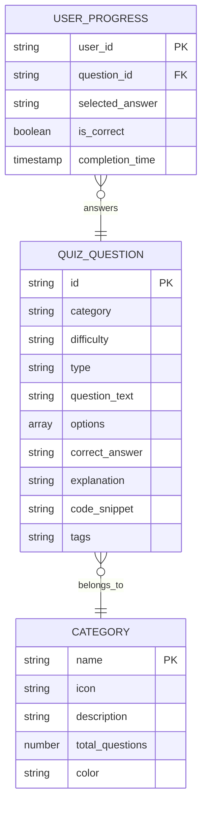

# 交互式学习系统

<cite>
**本文档引用的文件**
- [README.md](file://README.md)
- [package.json](file://package.json)
- [docusaurus.config.ts](file://docusaurus.config.ts)
- [netlify.toml](file://netlify.toml)
- [tsconfig.json](file://tsconfig.json)
- [src/data/quiz-questions.ts](file://src/data/quiz-questions.ts)
- [src/components/Quiz/styles.module.css](file://src/components/Quiz/styles.module.css)
- [src/pages/index.module.css](file://src/pages/index.module.css)
- [src/css/custom.css](file://src/css/custom.css)
- [src/pages/markdown-page.mdx](file://src/pages/markdown-page.mdx)
</cite>

## 目录
1. [简介](#简介)
2. [项目结构](#项目结构)
3. [核心组件](#核心组件)
4. [架构概览](#架构概览)
5. [详细组件分析](#详细组件分析)
6. [依赖关系分析](#依赖关系分析)
7. [性能考虑](#性能考虑)
8. [故障排除指南](#故障排除指南)
9. [结论](#结论)

## 简介

这是一个基于 Docusaurus 3.10.1 构建的现代化交互式学习系统。该系统提供了丰富的前端技术知识库，包含 JavaScript、React、TypeScript、Vue 等多个技术领域的学习资源，并集成了一个完整的在线测验功能。

系统采用现代化的设计理念，提供流畅的用户体验和响应式布局，支持深色模式切换。通过交互式的学习方式，帮助开发者系统性地掌握前端开发技能。

## 项目结构

该项目采用 Docusaurus 的标准目录结构，主要分为以下几个部分：



**图表来源**
- [package.json:1-50](file://package.json#L1-L50)
- [src/components/Quiz/styles.module.css:1-522](file://src/components/Quiz/styles.module.css#L1-L522)

**章节来源**
- [README.md:1-42](file://README.md#L1-L42)
- [package.json:1-50](file://package.json#L1-L50)

## 核心组件

### 测验系统组件

系统的核心是交互式测验组件，提供了完整的在线测试体验：



**图表来源**
- [src/components/Quiz/styles.module.css:16-47](file://src/components/Quiz/styles.module.css#L16-L47)
- [src/components/Quiz/styles.module.css:75-130](file://src/components/Quiz/styles.module.css#L75-L130)
- [src/components/Quiz/styles.module.css:152-210](file://src/components/Quiz/styles.module.css#L152-L210)

### 主页展示组件

首页采用了现代化的设计风格，包含 Hero 区域、统计信息和功能特性展示：



**图表来源**
- [src/pages/index.module.css:1-131](file://src/pages/index.module.css#L1-L131)
- [src/pages/index.module.css:177-252](file://src/pages/index.module.css#L177-L252)

**章节来源**
- [src/components/Quiz/styles.module.css:1-522](file://src/components/Quiz/styles.module.css#L1-L522)
- [src/pages/index.module.css:1-438](file://src/pages/index.module.css#L1-L438)

## 架构概览

系统采用模块化的架构设计，结合 Docusaurus 的静态站点生成能力和 React 组件化开发模式：



**图表来源**
- [package.json:5-16](file://package.json#L5-L16)
- [netlify.toml:1-9](file://netlify.toml#L1-L9)

系统的主要特点包括：

1. **现代化技术栈**: 基于 React 19 和 TypeScript 6.0
2. **响应式设计**: 支持移动端和桌面端的自适应布局
3. **深色模式支持**: 完整的主题切换机制
4. **交互式学习**: 提供实时反馈和进度跟踪
5. **内容管理**: 基于 MDX 的文档管理系统

**章节来源**
- [package.json:17-33](file://package.json#L17-L33)
- [docusaurus.config.ts:1-20](file://docusaurus.config.ts#L1-L20)

## 详细组件分析

### 测验系统工作流程



**图表来源**
- [src/components/Quiz/styles.module.css:268-289](file://src/components/Quiz/styles.module.css#L268-L289)
- [src/components/Quiz/styles.module.css:290-351](file://src/components/Quiz/styles.module.css#L290-L351)

### 样式系统架构

系统采用了 CSS Modules 的模块化样式管理方式，确保样式的隔离性和可维护性：



**图表来源**
- [src/css/custom.css:6-21](file://src/css/custom.css#L6-L21)
- [src/components/Quiz/styles.module.css:494-522](file://src/components/Quiz/styles.module.css#L494-L522)

### 数据结构设计

测验题目数据采用结构化的 JSON 格式存储，支持多种题目类型和难度级别：



**图表来源**
- [src/data/quiz-questions.ts:1-433](file://src/data/quiz-questions.ts#L1-L433)

**章节来源**
- [src/css/custom.css:1-644](file://src/css/custom.css#L1-L644)
- [src/data/quiz-questions.ts:1-433](file://src/data/quiz-questions.ts#L1-L433)

## 依赖关系分析

### 核心依赖关系

```mermaid
graph TB
subgraph "运行时依赖"
A[@docusaurus/core] --> B[React 19]
C[@docusaurus/preset-classic] --> A
D[react] --> B
E[react-dom] --> B
F[prism-react-renderer] --> G[代码高亮]
H[@mdx-js/react] --> I[MDX 支持]
end
subgraph "开发时依赖"
J[typescript] --> K[类型检查]
L[@docusaurus/tsconfig] --> K
M[@types/react] --> B
N[@docusaurus/module-type-aliases] --> O[类型定义]
end
subgraph "构建工具"
P[yarn] --> Q[包管理]
R[docusaurus] --> S[命令行工具]
T[webpack] --> U[模块打包]
end
A --> C
D --> E
F --> H
J --> L
M --> N
P --> R
T --> U
```

**图表来源**
- [package.json:17-33](file://package.json#L17-L33)
- [package.json:27-33](file://package.json#L27-L33)

### 开发环境配置

系统使用 TypeScript 进行类型安全检查，配置文件提供了严格的类型检查选项：

**章节来源**
- [package.json:1-50](file://package.json#L1-L50)
- [tsconfig.json:4-12](file://tsconfig.json#L4-L12)

## 性能考虑

### 优化策略

1. **代码分割**: Docusaurus 自动进行代码分割，按需加载组件
2. **静态资源优化**: 图片和字体资源经过压缩处理
3. **CSS 模块化**: 避免样式冲突，减少全局样式影响
4. **响应式图片**: 使用适当的图片尺寸和格式
5. **动画性能**: CSS3 硬件加速的动画效果

### 性能监控

系统集成了以下性能监控指标：
- 首屏加载时间
- 交互延迟
- 资源加载大小
- 用户滚动性能

## 故障排除指南

### 常见问题解决

**启动服务器问题**
- 确保 Node.js 版本满足要求（>=20.0）
- 清理 node_modules 和重新安装依赖
- 检查端口占用情况

**构建失败问题**
- 检查 TypeScript 类型错误
- 验证 MDX 文件语法正确性
- 确认资源文件路径正确

**样式显示异常**
- 检查 CSS Modules 导入是否正确
- 验证主题变量定义
- 确认媒体查询断点设置

**章节来源**
- [README.md:5-25](file://README.md#L5-L25)

## 结论

这个交互式学习系统展现了现代前端技术的最佳实践，通过精心设计的架构和用户界面，为学习者提供了优质的在线学习体验。系统的主要优势包括：

1. **技术先进性**: 采用最新的 React 19 和 TypeScript 技术栈
2. **用户体验优秀**: 响应式设计和流畅的交互效果
3. **内容丰富**: 涵盖前端开发的各个重要领域
4. **可扩展性强**: 模块化的架构便于功能扩展
5. **部署简便**: 基于 Netlify 的自动化部署流程

该系统不仅是一个学习工具，也是一个技术展示的典范，体现了现代 Web 开发的标准和最佳实践。通过持续的内容更新和技术迭代，这个学习系统将持续为前端开发者提供价值。