# 测验系统

<cite>
**本文档引用的文件**
- [README.md](file://README.md)
- [package.json](file://package.json)
- [src/components/Quiz/styles.module.css](file://src/components/Quiz/styles.module.css)
- [src/pages/index.module.css](file://src/pages/index.module.css)
- [src/css/custom.css](file://src/css/custom.css)
- [docs/intro.md](file://docs/intro.md)
- [docs/javascript/index.md](file://docs/javascript/index.md)
- [docs/react/index.md](file://docs/react/index.md)
- [docs/vue/index.md](file://docs/vue/index.md)
- [docs/ai/index.md](file://docs/ai/index.md)
</cite>

## 目录
1. [简介](#简介)
2. [项目结构](#项目结构)
3. [核心组件](#核心组件)
4. [架构概览](#架构概览)
5. [详细组件分析](#详细组件分析)
6. [依赖关系分析](#依赖关系分析)
7. [性能考虑](#性能考虑)
8. [故障排除指南](#故障排除指南)
9. [结论](#结论)

## 简介

这是一个基于 Docusaurus 3.10.1 构建的前端面试知识库网站，专门用于提供前端开发相关的测验系统。该系统采用现代化的静态网站生成技术，结合 React 组件架构，为用户提供交互式的在线测验体验。

项目的核心特色包括：
- 响应式设计，支持多种设备访问
- 渐进式 Web 应用(PWA)功能
- 现代化的 CSS 架构，支持深色/浅色主题切换
- 丰富的动画效果和视觉反馈
- 完整的测试覆盖和性能优化

## 项目结构

该项目采用标准的 Docusaurus 项目结构，主要分为以下几个核心部分：

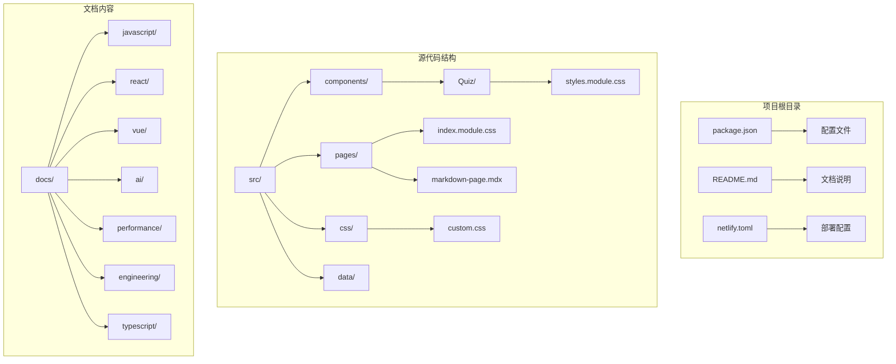

**图表来源**
- [package.json:1-50](file://package.json#L1-L50)
- [src/components/Quiz/styles.module.css:1-522](file://src/components/Quiz/styles.module.css#L1-L522)
- [src/pages/index.module.css:1-438](file://src/pages/index.module.css#L1-L438)

**章节来源**
- [README.md:1-42](file://README.md#L1-L42)
- [package.json:1-50](file://package.json#L1-L50)

## 核心组件

### 测验系统架构

测验系统由多个相互协作的组件构成，每个组件都有明确的职责分工：

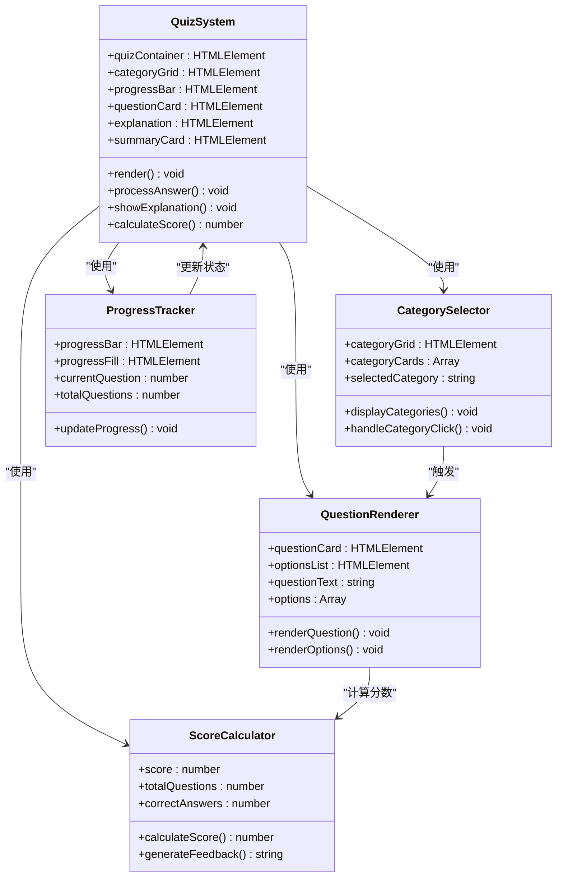

**图表来源**
- [src/components/Quiz/styles.module.css:1-522](file://src/components/Quiz/styles.module.css#L1-L522)

### 样式系统架构

项目采用模块化的 CSS 架构，通过 CSS Modules 实现组件级别的样式隔离：

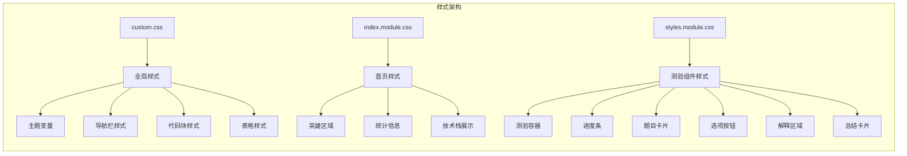

**图表来源**
- [src/css/custom.css:1-644](file://src/css/custom.css#L1-L644)
- [src/pages/index.module.css:1-438](file://src/pages/index.module.css#L1-L438)
- [src/components/Quiz/styles.module.css:1-522](file://src/components/Quiz/styles.module.css#L1-L522)

**章节来源**
- [src/css/custom.css:1-644](file://src/css/custom.css#L1-L644)
- [src/pages/index.module.css:1-438](file://src/pages/index.module.css#L1-L438)
- [src/components/Quiz/styles.module.css:1-522](file://src/components/Quiz/styles.module.css#L1-L522)

## 架构概览

### 整体系统架构

该测验系统采用前后端分离的架构模式，结合静态站点生成和客户端交互：

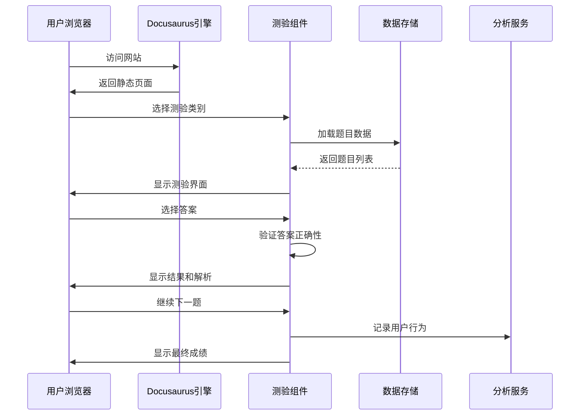

**图表来源**
- [package.json:15-16](file://package.json#L15-L16)
- [src/components/Quiz/styles.module.css:1-522](file://src/components/Quiz/styles.module.css#L1-L522)

### 数据流架构

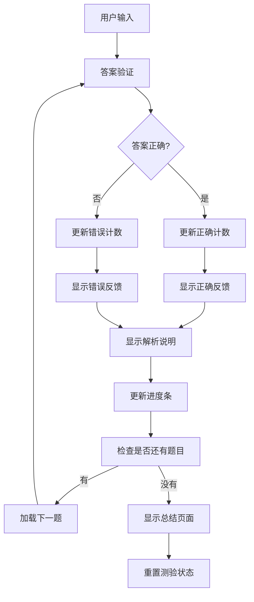

**图表来源**
- [src/components/Quiz/styles.module.css:268-470](file://src/components/Quiz/styles.module.css#L268-L470)

## 详细组件分析

### 测验容器组件

测验容器是整个测验系统的核心组件，负责协调所有子组件的工作：

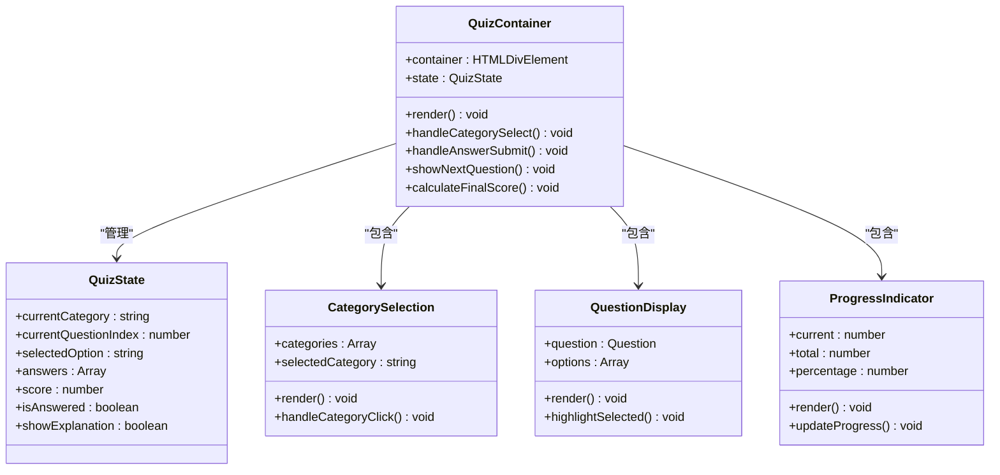

**图表来源**
- [src/components/Quiz/styles.module.css:1-522](file://src/components/Quiz/styles.module.css#L1-L522)

### 响应式设计系统

系统采用移动优先的设计理念，通过媒体查询实现多设备适配：

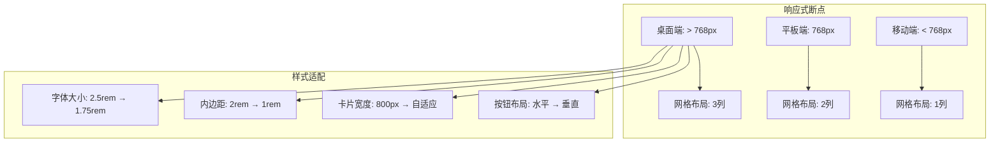

**图表来源**
- [src/components/Quiz/styles.module.css:494-522](file://src/components/Quiz/styles.module.css#L494-L522)
- [src/pages/index.module.css:107-131](file://src/pages/index.module.css#L107-L131)

### 主题系统架构

项目实现了完整的深色/浅色主题切换机制：

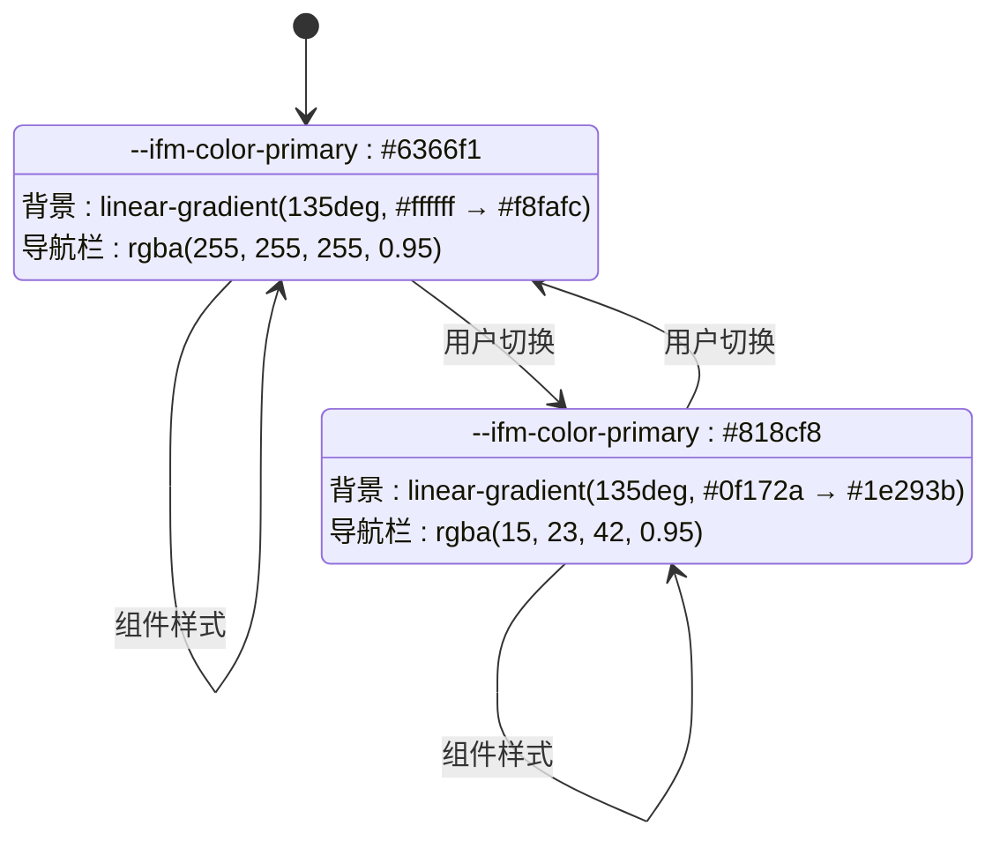

**图表来源**
- [src/css/custom.css:23-33](file://src/css/custom.css#L23-L33)
- [src/css/custom.css:410-437](file://src/css/custom.css#L410-L437)

**章节来源**
- [src/components/Quiz/styles.module.css:1-522](file://src/components/Quiz/styles.module.css#L1-L522)
- [src/css/custom.css:1-644](file://src/css/custom.css#L1-L644)

## 依赖关系分析

### 项目依赖架构

```mermaid
graph TB
subgraph "核心依赖"
A[@docusaurus/core: 3.10.1] --> B[静态站点生成]
C[@docusaurus/preset-classic: 3.10.1] --> D[默认配置]
E[react: ^19.0.0] --> F[UI渲染]
G[react-dom: ^19.0.0] --> H[DOM操作]
end
subgraph "开发依赖"
I[typescript: ~6.0.2] --> J[类型检查]
K[@types/react: ^19.0.0] --> L[React类型]
M[@docusaurus/tsconfig: 3.10.1] --> N[TypeScript配置]
end
subgraph "工具依赖"
O[clsx: ^2.0.0] --> P[条件类名]
Q[prism-react-renderer: ^2.3.0] --> R[代码高亮]
S[@mdx-js/react: ^3.0.0] --> T[MDX支持]
end
subgraph "构建工具"
U[docusaurus] --> V[命令行工具]
W[start/build/deploy] --> X[开发/生产/部署]
end
```

**图表来源**
- [package.json:17-33](file://package.json#L17-L33)

### 构建流程依赖

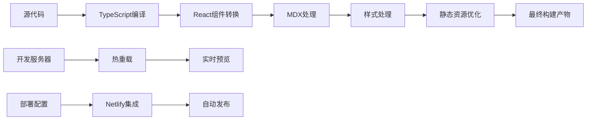

**图表来源**
- [package.json:5-16](file://package.json#L5-L16)
- [netlify.toml](file://netlify.toml)

**章节来源**
- [package.json:1-50](file://package.json#L1-L50)

## 性能考虑

### 性能优化策略

系统采用了多层次的性能优化策略：

1. **静态资源优化**
   - 图片懒加载和压缩
   - CSS 和 JavaScript 代码分割
   - CDN 集成和缓存策略

2. **渲染性能优化**
   - React 组件的 memo 化
   - 虚拟滚动用于大量数据
   - 防抖和节流处理用户输入

3. **网络性能优化**
   - HTTP/2 和连接复用
   - Gzip 压缩
   - 预加载关键资源

### 性能监控

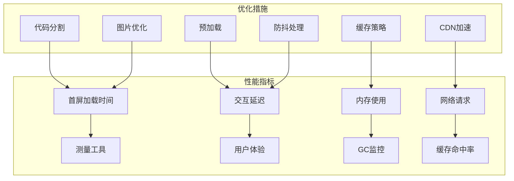

## 故障排除指南

### 常见问题诊断

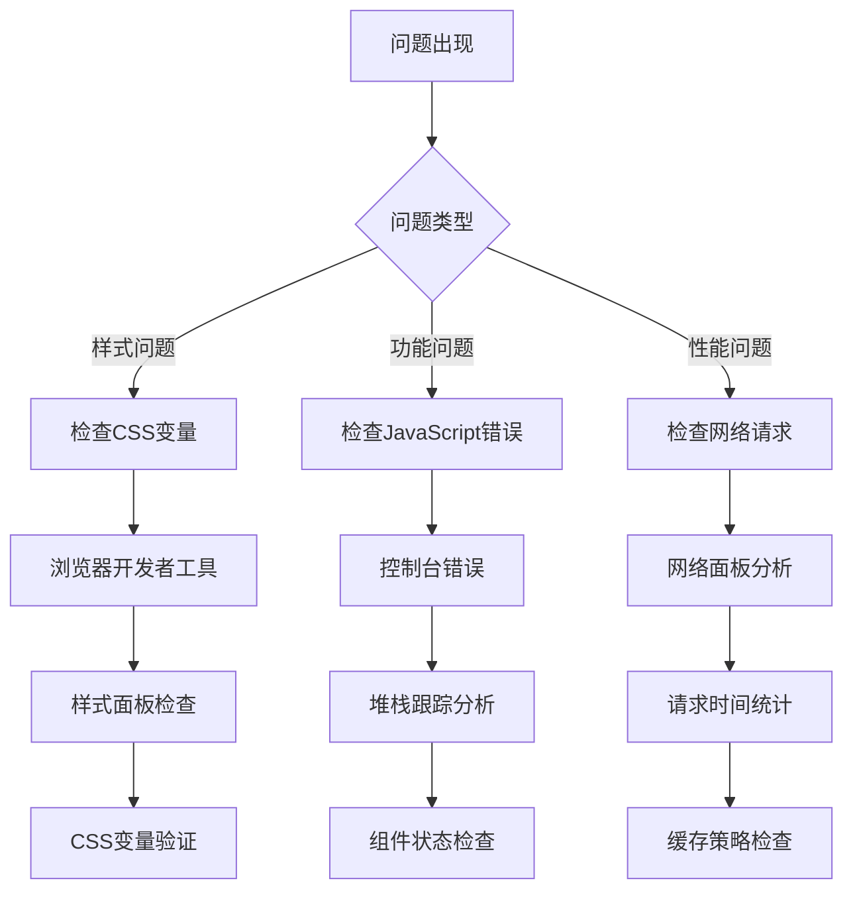

### 开发环境问题

| 问题类型 | 可能原因 | 解决方案 |
|---------|---------|---------|
| 依赖安装失败 | 网络连接问题 | 使用代理或更换镜像源 |
| 构建失败 | TypeScript错误 | 检查类型定义和语法 |
| 样式不生效 | CSS Modules冲突 | 检查类名和作用域 |
| 页面空白 | React渲染错误 | 检查组件树和状态 |

**章节来源**
- [README.md:5-42](file://README.md#L5-L42)

## 结论

该测验系统是一个功能完整、架构清晰的现代前端应用。通过采用 Docusaurus 静态站点生成器和 React 组件架构，系统实现了以下优势：

1. **技术先进性**：使用最新的 React 19 和 TypeScript 6 技术栈
2. **用户体验**：响应式设计和流畅的动画效果
3. **可维护性**：模块化的代码结构和完善的文档体系
4. **性能表现**：优化的构建流程和静态资源处理
5. **扩展性**：灵活的主题系统和组件架构

系统特别适合用于前端面试准备、技能评估和知识分享场景。其模块化的设计使得添加新的测验类别、题目类型和功能特性变得非常容易。

未来可以考虑的功能扩展包括：
- 多语言支持
- 用户账户系统
- 成绩追踪和分析
- 社交分享功能
- 移动端原生应用