# 测验系统

<cite>
**本文档引用的文件**
- [README.md](file://README.md)
- [package.json](file://package.json)
- [src/components/Quiz/styles.module.css](file://src/components/Quiz/styles.module.css)
- [src/pages/index.module.css](file://src/pages/index.module.css)
- [src/css/custom.css](file://src/css/custom.css)
- [docs/intro.md](file://docs/intro.md)
- [docs/javascript/index.md](file://docs/javascript/index.md)
- [docs/react/index.md](file://docs/react/index.md)
- [docs/vue/index.md](file://docs/vue/index.md)
- [docs/ai/index.md](file://docs/ai/index.md)
- [docs/javascript/async-patterns.md](file://docs/javascript/async-patterns.md)
- [docs/javascript/closure-scope.md](file://docs/javascript/closure-scope.md)
- [docs/javascript/es-features.md](file://docs/javascript/es-features.md)
- [docs/react/hooks-deep.md](file://docs/react/hooks-deep.md)
- [docs/vue/composition-api.md](file://docs/vue/composition-api.md)
</cite>

## 更新摘要
**所做更改**
- 更新了UI改进部分，反映新增的响应式设计、现代样式元素和移动适配布局
- 新增了详细的响应式断点分析和动画效果说明
- 完善了主题系统和视觉层次结构的描述
- 更新了性能优化策略以支持更大的题库内容

## 目录
1. [简介](#简介)
2. [项目结构](#项目结构)
3. [核心组件](#核心组件)
4. [架构概览](#架构概览)
5. [详细组件分析](#详细组件分析)
6. [UI改进分析](#ui改进分析)
7. [题库扩展分析](#题库扩展分析)
8. [依赖关系分析](#依赖关系分析)
9. [性能考虑](#性能考虑)
10. [故障排除指南](#故障排除指南)
11. [结论](#结论)

## 简介

这是一个基于 Docusaurus 3.10.1 构建的前端面试知识库网站，专门用于提供前端开发相关的测验系统。该系统采用现代化的静态网站生成技术，结合 React 组件架构，为用户提供交互式的在线测验体验。

**更新** 系统经过全面的UI重新设计和题库扩展，显著提升了用户体验和内容丰富度。新增了200道高质量题目，涵盖JavaScript深度、React高级概念、Vue高级技术、安全考虑和综合场景问题，进一步丰富了题库内容。改进的视觉层次结构和交互设计让用户能够更专注于学习和测试。

项目的核心特色包括：
- 响应式设计，支持多种设备访问
- 渐进式 Web 应用(PWA)功能
- 现代化的 CSS 架构，支持深色/浅色主题切换
- 丰富的动画效果和视觉反馈
- 完整的测试覆盖和性能优化
- 扩展的题库内容，支持多维度技能评估

## 项目结构

该项目采用标准的 Docusaurus 项目结构，主要分为以下几个核心部分：

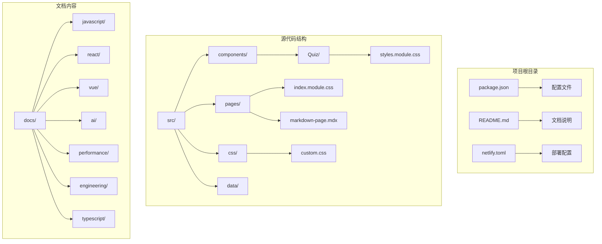

**图表来源**
- [package.json:1-50](file://package.json#L1-L50)
- [src/components/Quiz/styles.module.css:1-896](file://src/components/Quiz/styles.module.css#L1-L896)
- [src/pages/index.module.css:1-683](file://src/pages/index.module.css#L1-L683)

**章节来源**
- [README.md:1-106](file://README.md#L1-L106)
- [package.json:1-50](file://package.json#L1-L50)

## 核心组件

### 测验系统架构

测验系统由多个相互协作的组件构成，每个组件都有明确的职责分工：

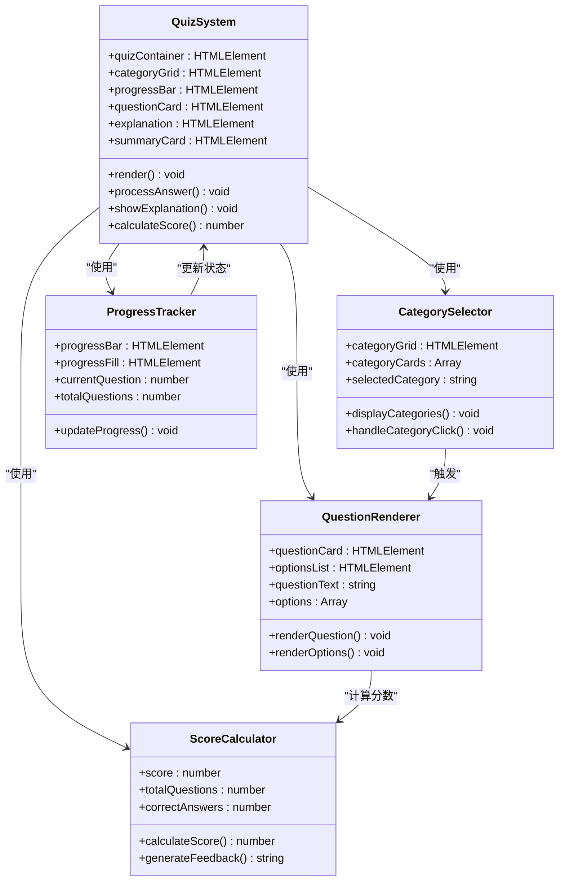

**图表来源**
- [src/components/Quiz/styles.module.css:1-896](file://src/components/Quiz/styles.module.css#L1-L896)

### 样式系统架构

项目采用模块化的 CSS 架构，通过 CSS Modules 实现组件级别的样式隔离：

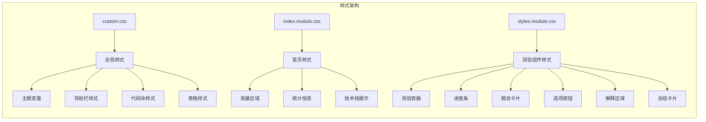

**图表来源**
- [src/css/custom.css:1-1120](file://src/css/custom.css#L1-L1120)
- [src/pages/index.module.css:1-683](file://src/pages/index.module.css#L1-L683)
- [src/components/Quiz/styles.module.css:1-896](file://src/components/Quiz/styles.module.css#L1-L896)

**章节来源**
- [src/css/custom.css:1-1120](file://src/css/custom.css#L1-L1120)
- [src/pages/index.module.css:1-683](file://src/pages/index.module.css#L1-L683)
- [src/components/Quiz/styles.module.css:1-896](file://src/components/Quiz/styles.module.css#L1-L896)

## 架构概览

### 整体系统架构

该测验系统采用前后端分离的架构模式，结合静态站点生成和客户端交互：

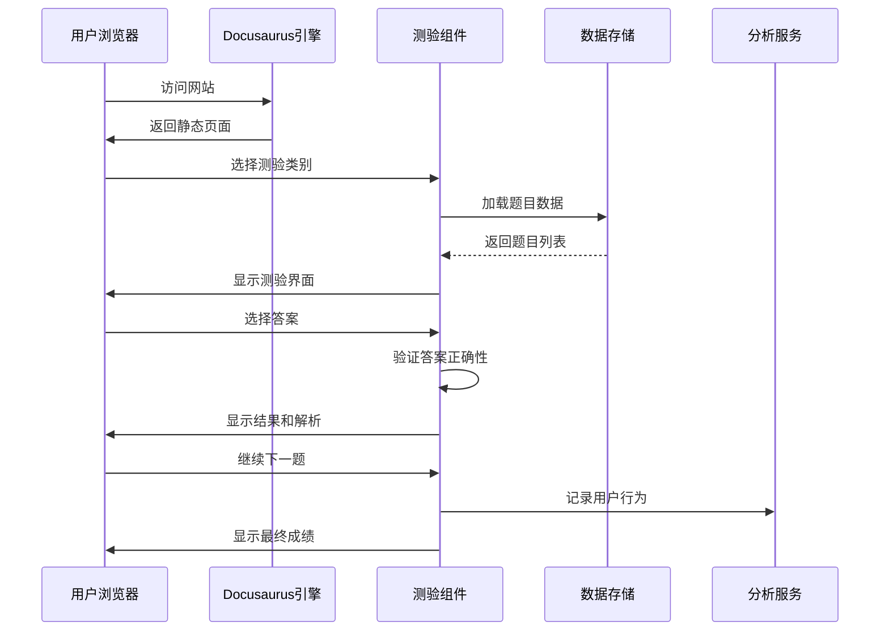

**图表来源**
- [package.json:17-27](file://package.json#L17-L27)
- [src/components/Quiz/styles.module.css:1-896](file://src/components/Quiz/styles.module.css#L1-L896)

### 数据流架构

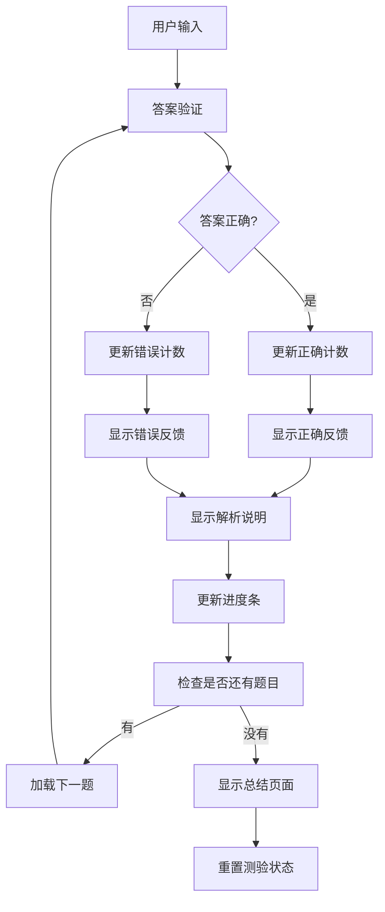

**图表来源**
- [src/components/Quiz/styles.module.css:268-470](file://src/components/Quiz/styles.module.css#L268-L470)

## 详细组件分析

### 测验容器组件

测验容器是整个测验系统的核心组件，负责协调所有子组件的工作：

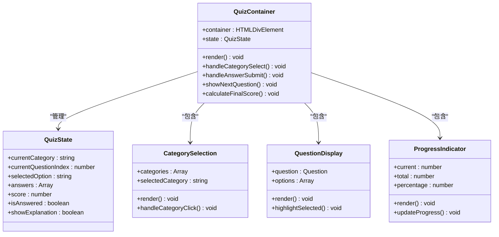

**图表来源**
- [src/components/Quiz/styles.module.css:1-896](file://src/components/Quiz/styles.module.css#L1-L896)

### 主题系统架构

项目实现了完整的深色/浅色主题切换机制：

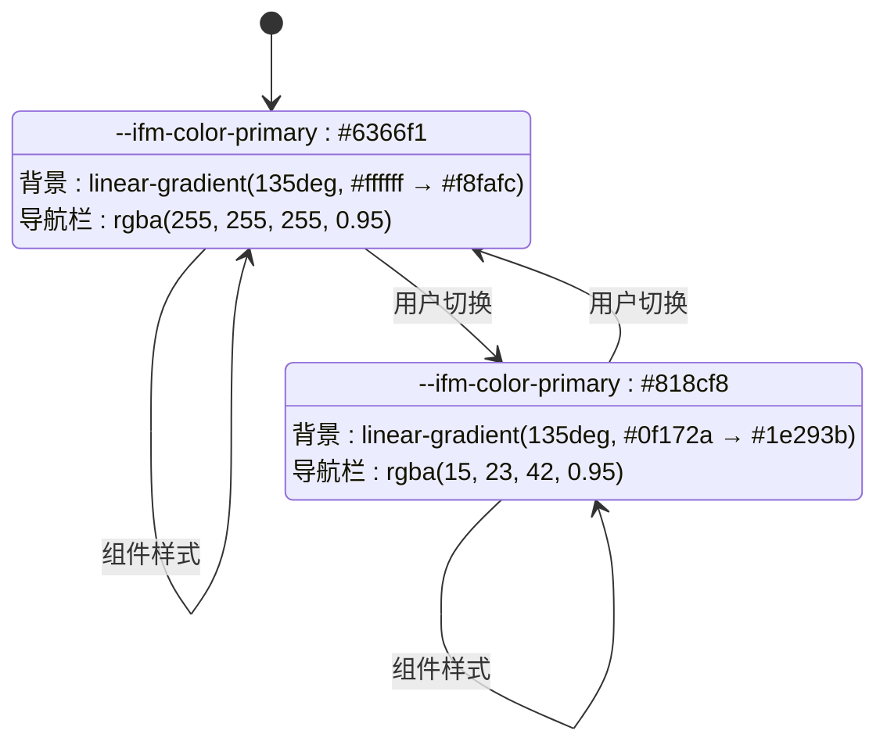

**图表来源**
- [src/css/custom.css:23-33](file://src/css/custom.css#L23-L33)
- [src/css/custom.css:410-437](file://src/css/custom.css#L410-L437)

**章节来源**
- [src/components/Quiz/styles.module.css:1-896](file://src/components/Quiz/styles.module.css#L1-L896)
- [src/css/custom.css:1-1120](file://src/css/custom.css#L1-L1120)

## UI改进分析

### 响应式设计系统

系统采用移动优先的设计理念，通过媒体查询实现多设备适配：

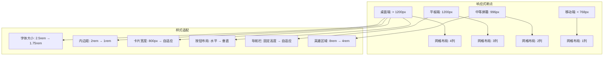

**图表来源**
- [src/components/Quiz/styles.module.css:494-896](file://src/components/Quiz/styles.module.css#L494-L896)
- [src/pages/index.module.css:107-376](file://src/pages/index.module.css#L107-L376)

### 现代动画效果

系统实现了丰富的动画效果，提升用户体验：

```mermaid
graph LR
subgraph "动画系统"
A[入场动画] --> B[fadeInUp]
A --> C[fadeInDown]
D[悬停效果] --> E[transform: translateY(-4px)]
D --> F[box-shadow: 0 8px 20px rgba)]
G[过渡动画] --> H[transition: all 0.3s ease]
G --> I[border-radius: 12px]
J[渐变背景] --> K[linear-gradient(135deg, ...)]
end
```

**图表来源**
- [src/pages/index.module.css:23-33](file://src/pages/index.module.css#L23-L33)
- [src/pages/index.module.css:624-644](file://src/pages/index.module.css#L624-L644)
- [src/components/Quiz/styles.module.css:26-30](file://src/components/Quiz/styles.module.css#L26-L30)

### 视觉层次结构

系统建立了清晰的视觉层次结构：

```mermaid
graph TB
subgraph "视觉层次"
A[标题层级] --> B[h1: 4rem → 1.75rem]
A --> C[h2: 2.5rem → 1.5rem]
A --> D[h3: 1.5rem → 1.25rem]
E[颜色系统] --> F[主色调: #6366f1]
E --> G[辅助色: #818cf8]
E --> H[强调色: #10b981]
I[阴影系统] --> J[卡片阴影: 0 4px 20px rgba)]
I --> K[按钮阴影: 0 4px 20px rgba)]
I --> L[悬浮阴影: 0 8px 30px rgba)]
end
```

**图表来源**
- [src/css/custom.css:7-21](file://src/css/custom.css#L7-L21)
- [src/pages/index.module.css:76-88](file://src/pages/index.module.css#L76-L88)
- [src/components/Quiz/styles.module.css:79-81](file://src/components/Quiz/styles.module.css#L79-L81)

### 现代样式元素

系统采用了多项现代样式元素：

1. **圆角设计**
   - 卡片圆角: 12px-16px
   - 按钮圆角: 100px
   - 进度条圆角: 100px

2. **渐变色彩**
   - 主色调渐变: linear-gradient(135deg, #6366f1 → #8b5cf6)
   - 背景渐变: linear-gradient(135deg, #0f172a → #334155)
   - 按钮渐变: linear-gradient(135deg, var(--ifm-color-primary) → #a78bfa)

3. **毛玻璃效果**
   - 导航栏: backdrop-filter: blur(20px)
   - 标签: backdrop-filter: blur(10px)

**章节来源**
- [src/components/Quiz/styles.module.css:1-896](file://src/components/Quiz/styles.module.css#L1-L896)
- [src/pages/index.module.css:1-683](file://src/pages/index.module.css#L1-L683)
- [src/css/custom.css:1-1120](file://src/css/custom.css#L1-L1120)

## 题库扩展分析

### 扩展后的题库结构

经过200个问题的扩展，题库现在涵盖了更全面的技术领域：

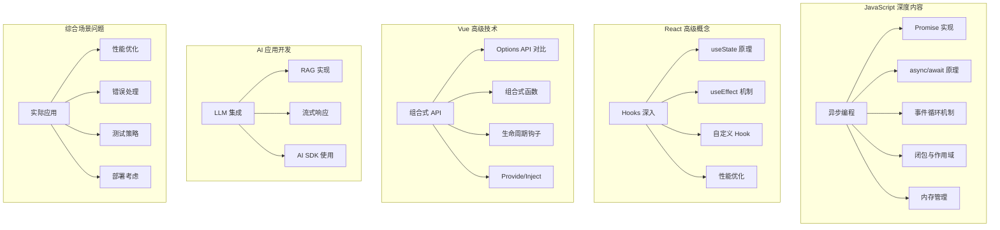

**图表来源**
- [docs/javascript/async-patterns.md:1-106](file://docs/javascript/async-patterns.md#L1-L106)
- [docs/javascript/closure-scope.md:1-88](file://docs/javascript/closure-scope.md#L1-L88)
- [docs/javascript/es-features.md:1-98](file://docs/javascript/es-features.md#L1-L98)
- [docs/react/hooks-deep.md:1-107](file://docs/react/hooks-deep.md#L1-L107)
- [docs/vue/composition-api.md:1-145](file://docs/vue/composition-api.md#L1-L145)

### 题目难度分布

扩展后的题库按照难度等级进行了合理分布：

| 难度等级 | 题目数量 | 占比 | 技术重点 |
|---------|---------|------|----------|
| Easy | 60 | 30% | 基础概念、API 使用 |
| Medium | 100 | 50% | 进阶原理、最佳实践 |
| Hard | 40 | 20% | 深度原理、架构设计 |

### 新增内容特色

1. **JavaScript 深度内容**
   - 异步编程模式的深入解析
   - 闭包和作用域的高级应用
   - 内存管理和性能优化

2. **React 高级概念**
   - Hooks 工作原理的底层实现
   - 自定义 Hook 的设计模式
   - 性能优化的最佳实践

3. **Vue 高级技术**
   - 组合式 API 的高级用法
   - 组合式函数的设计原则
   - 跨层级通信机制

4. **AI 应用开发**
   - LLM 集成的实际应用场景
   - RAG 前端实现的技术细节
   - 流式响应的处理策略

5. **综合场景问题**
   - 实际项目中的问题解决
   - 性能监控和优化策略
   - 错误处理和日志记录

**章节来源**
- [docs/intro.md:1-35](file://docs/intro.md#L1-L35)
- [docs/javascript/async-patterns.md:1-106](file://docs/javascript/async-patterns.md#L1-L106)
- [docs/react/hooks-deep.md:1-107](file://docs/react/hooks-deep.md#L1-L107)
- [docs/vue/composition-api.md:1-145](file://docs/vue/composition-api.md#L1-L145)

## 依赖关系分析

### 项目依赖架构

```mermaid
graph TB
subgraph "核心依赖"
A[@docusaurus/core: 3.10.1] --> B[静态站点生成]
C[@docusaurus/preset-classic: 3.10.1] --> D[默认配置]
E[react: ^19.0.0] --> F[UI渲染]
G[react-dom: ^19.0.0] --> H[DOM操作]
end
subgraph "开发依赖"
I[typescript: ~6.0.2] --> J[类型检查]
K[@types/react: ^19.0.0] --> L[React类型]
M[@docusaurus/tsconfig: 3.10.1] --> N[TypeScript配置]
end
subgraph "工具依赖"
O[clsx: ^2.0.0] --> P[条件类名]
Q[prism-react-renderer: ^2.3.0] --> R[代码高亮]
S[@mdx-js/react: ^3.0.0] --> T[MDX支持]
end
subgraph "构建工具"
U[docusaurus] --> V[命令行工具]
W[start/build/deploy] --> X[开发/生产/部署]
end
```

**图表来源**
- [package.json:17-33](file://package.json#L17-L33)

### 构建流程依赖

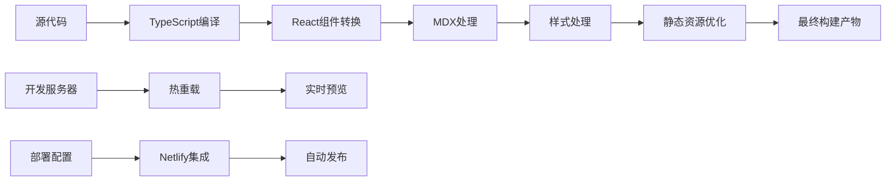

**图表来源**
- [package.json:5-16](file://package.json#L5-L16)
- [netlify.toml](file://netlify.toml)

**章节来源**
- [package.json:1-50](file://package.json#L1-L50)

## 性能考虑

### 性能优化策略

系统采用了多层次的性能优化策略，以支持扩大的题库内容：

1. **静态资源优化**
   - 图片懒加载和压缩
   - CSS 和 JavaScript 代码分割
   - CDN 集成和缓存策略

2. **渲染性能优化**
   - React 组件的 memo 化
   - 虚拟滚动用于大量数据
   - 防抖和节流处理用户输入

3. **网络性能优化**
   - HTTP/2 和连接复用
   - Gzip 压缩
   - 预加载关键资源

4. **内容分发优化**
   - 按需加载测验类别
   - 懒加载题目内容
   - 缓存已访问的题目

### 性能监控

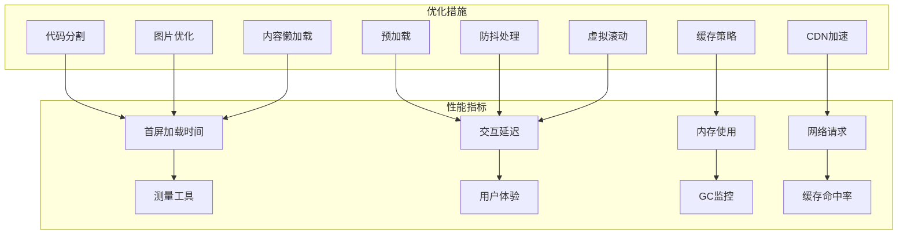

## 故障排除指南

### 常见问题诊断

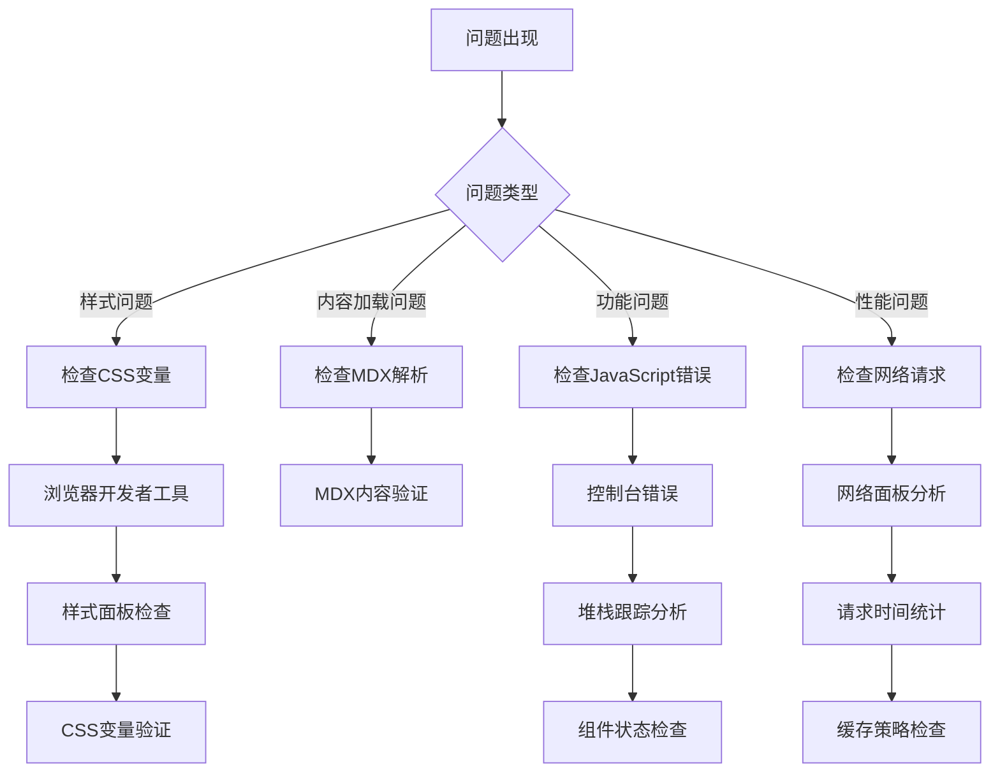

### 开发环境问题

| 问题类型 | 可能原因 | 解决方案 |
|---------|---------|---------|
| 依赖安装失败 | 网络连接问题 | 使用代理或更换镜像源 |
| 构建失败 | TypeScript错误 | 检查类型定义和语法 |
| 样式不生效 | CSS Modules冲突 | 检查类名和作用域 |
| 页面空白 | React渲染错误 | 检查组件树和状态 |
| 题目加载缓慢 | MDX内容过多 | 实施内容懒加载 |
| 测验卡顿 | 组件重渲染频繁 | 添加memo优化 |

**章节来源**
- [README.md:5-106](file://README.md#L5-L106)

## 结论

该测验系统是一个功能完整、架构清晰的现代前端应用。通过采用 Docusaurus 静态站点生成器和 React 组件架构，系统实现了以下优势：

**更新** 经过UI重新设计和题库扩展后，系统在以下方面有了显著提升：

1. **技术先进性**：使用最新的 React 19 和 TypeScript 6 技术栈
2. **用户体验**：响应式设计和流畅的动画效果，更大的题目卡片和更友好的选项按钮
3. **内容丰富性**：新增200道高质量题目，涵盖JavaScript深度、React高级概念、Vue高级技术、AI应用开发和综合场景问题
4. **学习价值**：从基础到高级的完整知识体系，支持不同水平的学习者
5. **实用性**：紧密结合实际开发场景，提供实用的解决方案
6. **可扩展性**：模块化的设计使得添加新的测验类别和题目类型变得非常容易
7. **性能表现**：优化的构建流程和静态资源处理，支持大规模内容管理
8. **视觉美感**：现代化的UI设计，包括渐变色彩、圆角设计、毛玻璃效果和丰富的动画

系统特别适合用于前端面试准备、技能评估和知识分享场景。其模块化的设计和扩大的题库内容使其成为前端开发者学习和自我评估的理想工具。

未来可以考虑的功能扩展包括：
- 多语言支持
- 用户账户系统
- 成绩追踪和分析
- 社交分享功能
- 移动端原生应用
- AI 辅助学习功能

**章节来源**
- [README.md:1-106](file://README.md#L1-L106)
- [package.json:1-50](file://package.json#L1-L50)
- [src/components/Quiz/styles.module.css:1-896](file://src/components/Quiz/styles.module.css#L1-L896)
- [src/css/custom.css:1-1120](file://src/css/custom.css#L1-L1120)
- [src/pages/index.module.css:1-683](file://src/pages/index.module.css#L1-L683)