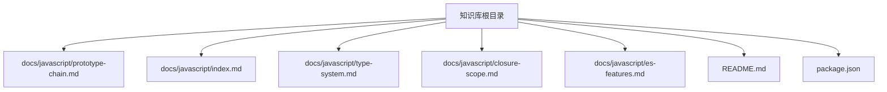
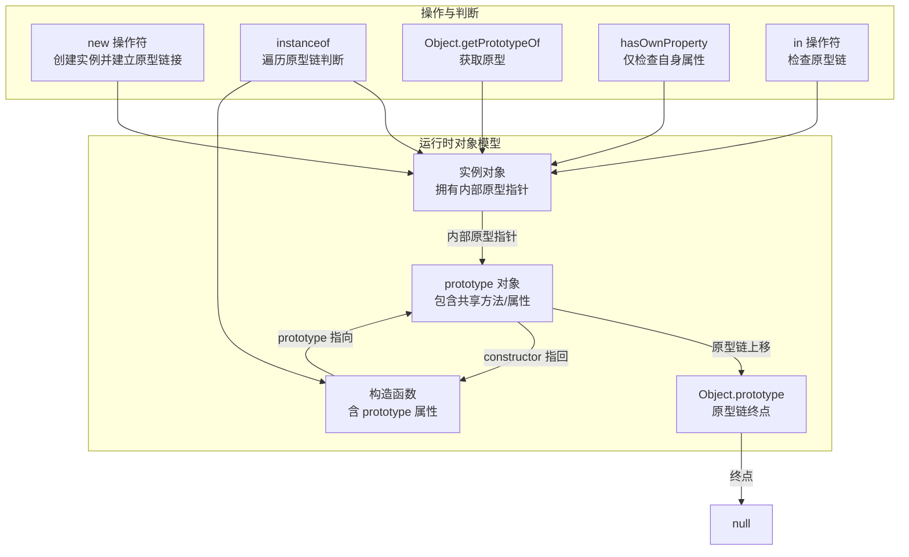
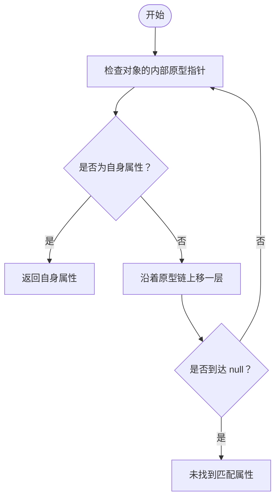
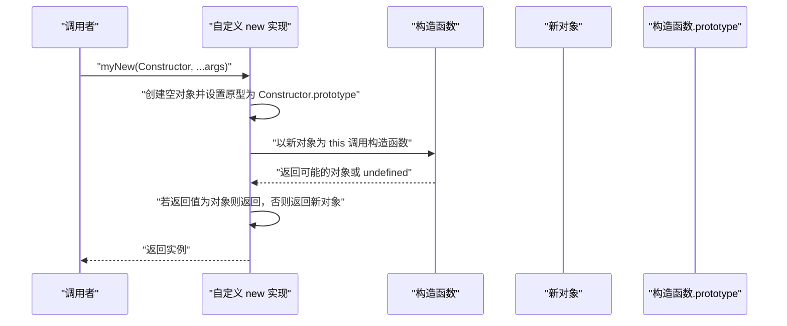
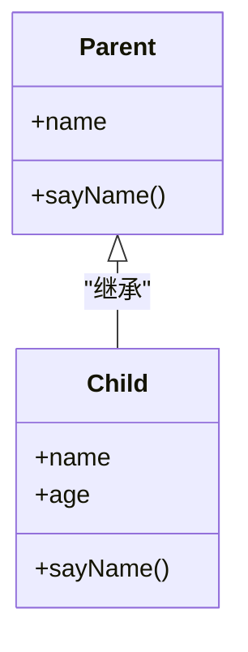
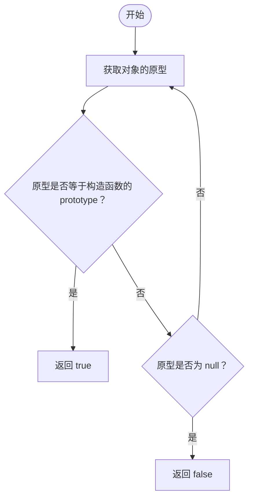
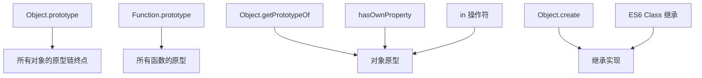

# 原型链机制

<cite>
**本文档引用的文件**
- [docs/javascript/prototype-chain.md](file://docs/javascript/prototype-chain.md)
- [docs/javascript/index.md](file://docs/javascript/index.md)
- [docs/javascript/type-system.md](file://docs/javascript/type-system.md)
- [docs/javascript/closure-scope.md](file://docs/javascript/closure-scope.md)
- [docs/javascript/es-features.md](file://docs/javascript/es-features.md)
- [README.md](file://README.md)
- [package.json](file://package.json)
</cite>

## 目录
1. [引言](#引言)
2. [项目结构](#项目结构)
3. [核心组件](#核心组件)
4. [架构总览](#架构总览)
5. [详细组件分析](#详细组件分析)
6. [依赖分析](#依赖分析)
7. [性能考虑](#性能考虑)
8. [故障排除指南](#故障排除指南)
9. [结论](#结论)
10. [附录](#附录)

## 引言
本文件围绕 JavaScript 原型链机制展开，系统阐述原型与原型链的基本概念、构造函数与实例的关系、内置原型对象（如 Object.prototype、Function.prototype）的作用，以及与之相关的 API（如 hasOwnProperty、in 操作符、Object.getPrototypeOf）、new 操作符的执行过程、instanceof 与 Object.create 等关键概念。文档同时结合面向对象编程与实际开发场景，帮助读者建立对原型链的深入理解与实践能力。

## 项目结构
该项目是一个基于 Docusaurus 的静态网站知识库，前端技术栈包含 React、TypeScript 与 Docusaurus 3。JavaScript 主题下的文档涵盖了原型链、类型系统、闭包与作用域、ES6+ 特性等多个主题。本文档聚焦于原型链相关内容，同时参考类型系统、闭包与作用域、ES6+ 特性等辅助主题，以形成完整的知识体系。

图表来源
- [docs/javascript/prototype-chain.md:1-108](file://docs/javascript/prototype-chain.md#L1-L108)
- [docs/javascript/index.md:1-16](file://docs/javascript/index.md#L1-L16)
- [docs/javascript/type-system.md:1-68](file://docs/javascript/type-system.md#L1-L68)
- [docs/javascript/closure-scope.md:1-88](file://docs/javascript/closure-scope.md#L1-L88)
- [docs/javascript/es-features.md:1-98](file://docs/javascript/es-features.md#L1-L98)
- [README.md:1-42](file://README.md#L1-L42)
- [package.json:1-50](file://package.json#L1-L50)

章节来源
- [docs/javascript/prototype-chain.md:1-108](file://docs/javascript/prototype-chain.md#L1-L108)
- [docs/javascript/index.md:1-16](file://docs/javascript/index.md#L1-L16)
- [README.md:1-42](file://README.md#L1-L42)
- [package.json:1-50](file://package.json#L1-L50)

## 核心组件
本节从原型链机制的角度，梳理与之直接相关的核心知识点与示例路径，帮助读者快速定位到具体实现与原理说明。

- 原型三角关系与基本属性查找
  - 示例路径：[原型三角关系与基本属性查找:10-34](file://docs/javascript/prototype-chain.md#L10-L34)
  - 关键点：每个对象的内部原型指针指向其构造函数的 prototype；原型链终点为 null；通过 hasOwnProperty 与 in 操作符区分自身属性与原型链属性。

- new 操作符的实现与原型链应用
  - 示例路径：[new 操作符的实现:36-47](file://docs/javascript/prototype-chain.md#L36-L47)
  - 关键点：使用 Object.create 将新对象的原型连接到构造函数的 prototype；执行构造函数并将 this 绑定到新对象；若构造函数返回对象则直接返回，否则返回新对象。

- 继承的几种方式
  - ES6 Class 继承（推荐）
    - 示例路径：[ES6 Class 继承（推荐）:51-68](file://docs/javascript/prototype-chain.md#L51-L68)
  - 寄生组合继承
    - 示例路径：[寄生组合继承:70-87](file://docs/javascript/prototype-chain.md#L70-L87)

- instanceof 原理
  - 示例路径：[instanceof 原理:89-100](file://docs/javascript/prototype-chain.md#L89-L100)
  - 关键点：沿着对象的原型链逐层比较，直到找到构造函数的 prototype 或到达 null。

- 与原型链相关的 API
  - hasOwnProperty、in 操作符、Object.getPrototypeOf
    - 示例路径：[关键点（包含 hasOwnProperty、in、Object.getPrototypeOf）:102-108](file://docs/javascript/prototype-chain.md#L102-L108)
  - 类型判断与原型链的关系
    - 示例路径：[typeof 与 instanceof 的差异:16-25](file://docs/javascript/type-system.md#L16-L25)
    - 示例路径：[手写类型判断函数:27-39](file://docs/javascript/type-system.md#L27-L39)

- 与其他 JavaScript 概念的关联
  - 闭包与作用域
    - 示例路径：[闭包与作用域:10-27](file://docs/javascript/closure-scope.md#L10-L27)
    - 示例路径：[作用域链:63-80](file://docs/javascript/closure-scope.md#L63-L80)
  - ES6+ 特性（箭头函数、类等）
    - 示例路径：[ES6+ 常用特性:1-98](file://docs/javascript/es-features.md#L1-L98)

章节来源
- [docs/javascript/prototype-chain.md:10-108](file://docs/javascript/prototype-chain.md#L10-L108)
- [docs/javascript/type-system.md:16-39](file://docs/javascript/type-system.md#L16-L39)
- [docs/javascript/closure-scope.md:10-80](file://docs/javascript/closure-scope.md#L10-L80)
- [docs/javascript/es-features.md:1-98](file://docs/javascript/es-features.md#L1-L98)

## 架构总览
下图展示了原型链机制在 JavaScript 中的运行时架构：对象通过内部原型指针连接到构造函数的 prototype，从而形成原型链；new 操作符负责创建对象并建立原型链接；instanceof 通过遍历原型链判断类型关系；hasOwnProperty 与 in 操作符分别用于区分自身属性与原型链属性。

图表来源
- [docs/javascript/prototype-chain.md:10-108](file://docs/javascript/prototype-chain.md#L10-L108)
- [docs/javascript/type-system.md:16-39](file://docs/javascript/type-system.md#L16-L39)

## 详细组件分析

### 原型三角关系与属性查找
- 概念要点
  - 每个对象都具有内部原型指针，指向其构造函数的 prototype。
  - 原型链的终点是 null，Object.prototype.__proto__ === null。
  - hasOwnProperty 仅检查对象自身的属性，不包含原型链上的属性；in 操作符会检查原型链。
- 实现与示例
  - 示例路径：[原型三角关系与基本属性查找:10-34](file://docs/javascript/prototype-chain.md#L10-L34)
  - 示例路径：[关键点（包含 hasOwnProperty、in、Object.getPrototypeOf）:102-108](file://docs/javascript/prototype-chain.md#L102-L108)

图表来源
- [docs/javascript/prototype-chain.md:102-108](file://docs/javascript/prototype-chain.md#L102-L108)

章节来源
- [docs/javascript/prototype-chain.md:10-34](file://docs/javascript/prototype-chain.md#L10-L34)
- [docs/javascript/prototype-chain.md:102-108](file://docs/javascript/prototype-chain.md#L102-L108)

### new 操作符的实现与原型链
- 执行流程
  - 使用 Object.create 将新对象的原型连接到构造函数的 prototype。
  - 执行构造函数并将 this 绑定到新对象。
  - 若构造函数返回对象则直接返回，否则返回新对象。
- 实现与示例
  - 示例路径：[new 操作符的实现:36-47](file://docs/javascript/prototype-chain.md#L36-L47)

图表来源
- [docs/javascript/prototype-chain.md:36-47](file://docs/javascript/prototype-chain.md#L36-L47)

章节来源
- [docs/javascript/prototype-chain.md:36-47](file://docs/javascript/prototype-chain.md#L36-L47)

### 继承的几种方式
- ES6 Class 继承（推荐）
  - 示例路径：[ES6 Class 继承（推荐）:51-68](file://docs/javascript/prototype-chain.md#L51-L68)
  - 特点：语法简洁，本质仍是寄生组合继承的语法糖。
- 寄生组合继承
  - 示例路径：[寄生组合继承:70-87](file://docs/javascript/prototype-chain.md#L70-L87)
  - 步骤：先调用父类构造函数初始化子类实例，再通过 Object.create 设置子类 prototype 并修正 constructor。

图表来源
- [docs/javascript/prototype-chain.md:51-87](file://docs/javascript/prototype-chain.md#L51-L87)

章节来源
- [docs/javascript/prototype-chain.md:51-87](file://docs/javascript/prototype-chain.md#L51-L87)

### instanceof 原理与原型链
- 原理
  - 从对象的原型开始，逐层向上查找，直到匹配到构造函数的 prototype 或到达 null。
- 实现与示例
  - 示例路径：[instanceof 原理:89-100](file://docs/javascript/prototype-chain.md#L89-L100)
  - 类型判断对比
    - 示例路径：[typeof 与 instanceof 的差异:16-25](file://docs/javascript/type-system.md#L16-L25)

图表来源
- [docs/javascript/prototype-chain.md:89-100](file://docs/javascript/prototype-chain.md#L89-L100)
- [docs/javascript/type-system.md:16-25](file://docs/javascript/type-system.md#L16-L25)

章节来源
- [docs/javascript/prototype-chain.md:89-100](file://docs/javascript/prototype-chain.md#L89-L100)
- [docs/javascript/type-system.md:16-25](file://docs/javascript/type-system.md#L16-L25)

### 与原型链相关的 API
- hasOwnProperty
  - 仅检查对象自身的属性，不包含原型链上的属性。
  - 示例路径：[关键点（包含 hasOwnProperty、in、Object.getPrototypeOf）:102-108](file://docs/javascript/prototype-chain.md#L102-L108)
- in 操作符
  - 检查对象自身或原型链上的属性是否存在。
  - 示例路径：[关键点（包含 hasOwnProperty、in、Object.getPrototypeOf）:102-108](file://docs/javascript/prototype-chain.md#L102-L108)
- Object.getPrototypeOf
  - 获取对象的内部原型指针所指向的原型对象。
  - 示例路径：[关键点（包含 hasOwnProperty、in、Object.getPrototypeOf）:102-108](file://docs/javascript/prototype-chain.md#L102-L108)
  - instanceof 原理中也使用了该 API。
  - 示例路径：[instanceof 原理:89-100](file://docs/javascript/prototype-chain.md#L89-L100)

章节来源
- [docs/javascript/prototype-chain.md:102-108](file://docs/javascript/prototype-chain.md#L102-L108)
- [docs/javascript/prototype-chain.md:89-100](file://docs/javascript/prototype-chain.md#L89-L100)

### 与原型链相关的概念扩展
- Object.create
  - 以指定原型创建新对象，常用于继承实现。
  - 示例路径：[寄生组合继承中的 Object.create](file://docs/javascript/prototype-chain.md#L85)
- 箭头函数与原型链
  - 箭头函数没有 prototype，不能作为构造函数使用。
  - 示例路径：[ES6+ 常用特性（箭头函数 vs 普通函数）:39-58](file://docs/javascript/es-features.md#L39-L58)
- 类型判断与原型链
  - typeof 与 instanceof 的差异，以及更精确的类型判断方法。
  - 示例路径：[typeof 与 instanceof 的差异:16-25](file://docs/javascript/type-system.md#L16-L25)
  - 示例路径：[手写类型判断函数:27-39](file://docs/javascript/type-system.md#L27-L39)

章节来源
- [docs/javascript/prototype-chain.md:85](file://docs/javascript/prototype-chain.md#L85)
- [docs/javascript/es-features.md:39-58](file://docs/javascript/es-features.md#L39-L58)
- [docs/javascript/type-system.md:16-39](file://docs/javascript/type-system.md#L16-L39)

## 依赖分析
- 内置原型对象
  - Object.prototype：所有对象的原型链终点，提供通用方法（如 toString、valueOf 等）。
  - Function.prototype：所有函数的原型，包含 call、apply、bind 等方法。
- 与原型链相关的 API 依赖
  - Object.getPrototypeOf：用于获取对象的原型，是 instanceof 原理的基础。
  - hasOwnProperty/in：用于区分自身属性与原型链属性，影响属性访问行为。
- 继承实现依赖
  - ES6 Class 继承本质上是寄生组合继承的语法糖，底层仍依赖原型链。
  - 寄生组合继承通过 Object.create 与构造函数协作，确保原型链正确建立。

图表来源
- [docs/javascript/prototype-chain.md:102-108](file://docs/javascript/prototype-chain.md#L102-L108)
- [docs/javascript/prototype-chain.md:85](file://docs/javascript/prototype-chain.md#L85)
- [docs/javascript/prototype-chain.md:51-68](file://docs/javascript/prototype-chain.md#L51-L68)

章节来源
- [docs/javascript/prototype-chain.md:102-108](file://docs/javascript/prototype-chain.md#L102-L108)
- [docs/javascript/prototype-chain.md:51-68](file://docs/javascript/prototype-chain.md#L51-L68)
- [docs/javascript/prototype-chain.md:85](file://docs/javascript/prototype-chain.md#L85)

## 性能考虑
- 原型链查找成本
  - 属性访问时需要沿着原型链逐层查找，层级越深，性能开销越大。建议：
    - 合理设计原型结构，避免过深的继承层级。
    - 将常用方法放在较低层级的原型上，减少查找次数。
- 避免不必要的属性覆盖
  - 在原型链上频繁覆盖属性会增加查找分支，影响性能。
- 使用 hasOwnProperty 区分自身属性
  - 在遍历对象属性时，优先使用 hasOwnProperty 过滤自身属性，减少对原型链的扫描。
- instanceof 与类型判断
  - instanceof 会遍历原型链，对于深层继承链可能带来额外开销。在性能敏感场景可考虑使用更轻量的类型判断方式（如 Object.prototype.toString）。

## 故障排除指南
- 常见问题与排查
  - 误以为 hasOwnProperty 会检查原型链：hasOwnProperty 仅检查自身属性，原型链上的属性不会被识别。
    - 参考路径：[关键点（包含 hasOwnProperty、in、Object.getPrototypeOf）:102-108](file://docs/javascript/prototype-chain.md#L102-L108)
  - instanceof 返回值不符合预期：检查对象的原型链是否正确连接到构造函数的 prototype。
    - 参考路径：[instanceof 原理:89-100](file://docs/javascript/prototype-chain.md#L89-L100)
  - 继承后方法被意外覆盖：确认子类 prototype 是否正确设置为父类 prototype 的副本，并修正 constructor。
    - 参考路径：[寄生组合继承:70-87](file://docs/javascript/prototype-chain.md#L70-L87)
  - new 操作符返回非期望结果：若构造函数返回对象，new 会直接返回该对象；否则返回新创建的对象。
    - 参考路径：[new 操作符的实现:36-47](file://docs/javascript/prototype-chain.md#L36-L47)
- 类型判断错误
  - typeof null 返回 "object" 是历史遗留问题，应使用 Array.isArray 或 Object.prototype.toString 进行更准确的类型判断。
    - 参考路径：[typeof 与 instanceof 的差异:16-25](file://docs/javascript/type-system.md#L16-L25)
    - 参考路径：[手写类型判断函数:27-39](file://docs/javascript/type-system.md#L27-L39)

章节来源
- [docs/javascript/prototype-chain.md:36-47](file://docs/javascript/prototype-chain.md#L36-L47)
- [docs/javascript/prototype-chain.md:70-87](file://docs/javascript/prototype-chain.md#L70-L87)
- [docs/javascript/prototype-chain.md:89-100](file://docs/javascript/prototype-chain.md#L89-L100)
- [docs/javascript/prototype-chain.md:102-108](file://docs/javascript/prototype-chain.md#L102-L108)
- [docs/javascript/type-system.md:16-39](file://docs/javascript/type-system.md#L16-L39)

## 结论
原型链是 JavaScript 面向对象编程的核心机制，贯穿构造函数、实例、继承与类型判断等各个方面。通过理解原型三角关系、new 操作符的实现、instanceof 的原理以及与 hasOwnProperty、in、Object.getPrototypeOf 等 API 的配合使用，开发者可以在实际项目中更高效地构建可维护的继承体系。同时，结合 ES6 Class 语法与寄生组合继承思想，能够在现代开发实践中平衡易用性与灵活性。

## 附录
- 开发环境与部署
  - 本地开发与构建命令
    - 示例路径：[本地开发与构建命令:11-25](file://README.md#L11-L25)
  - 依赖与脚本
    - 示例路径：[依赖与脚本:1-50](file://package.json#L1-L50)

章节来源
- [README.md:11-25](file://README.md#L11-L25)
- [package.json:1-50](file://package.json#L1-L50)