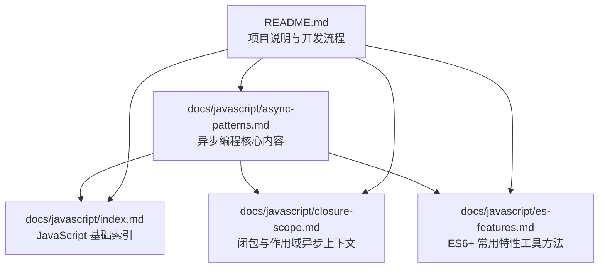
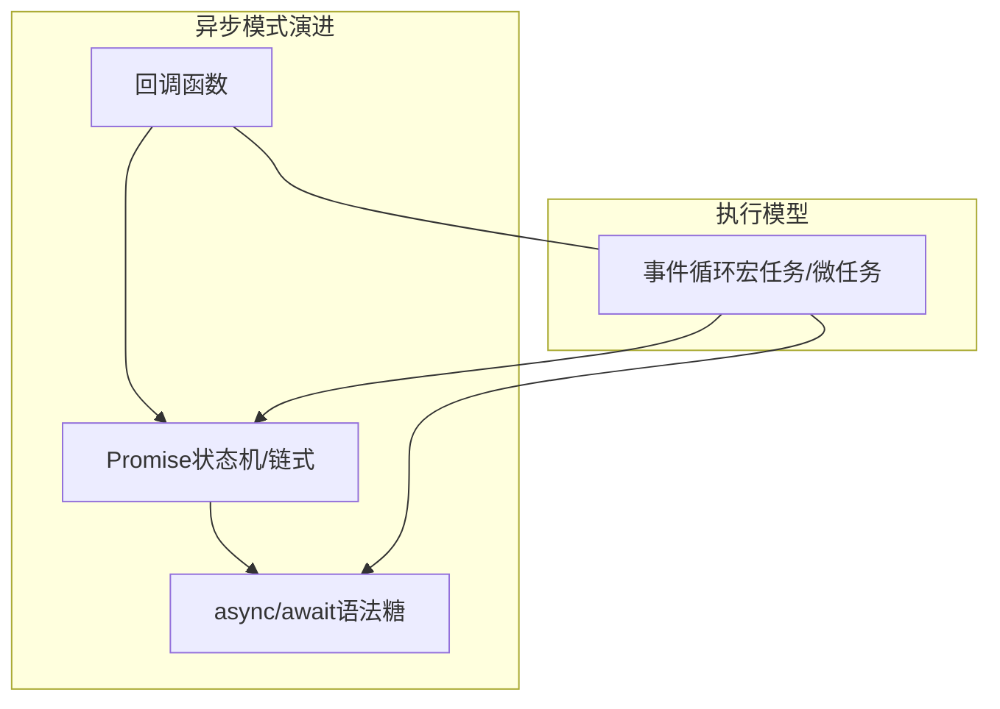
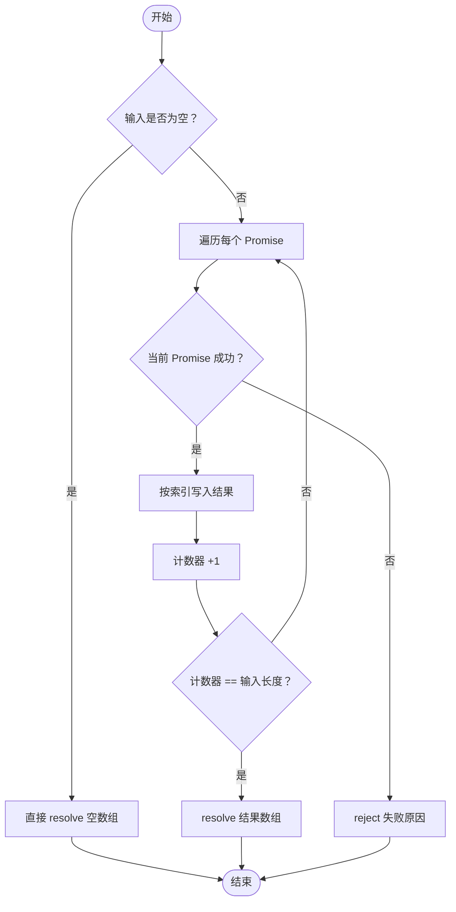
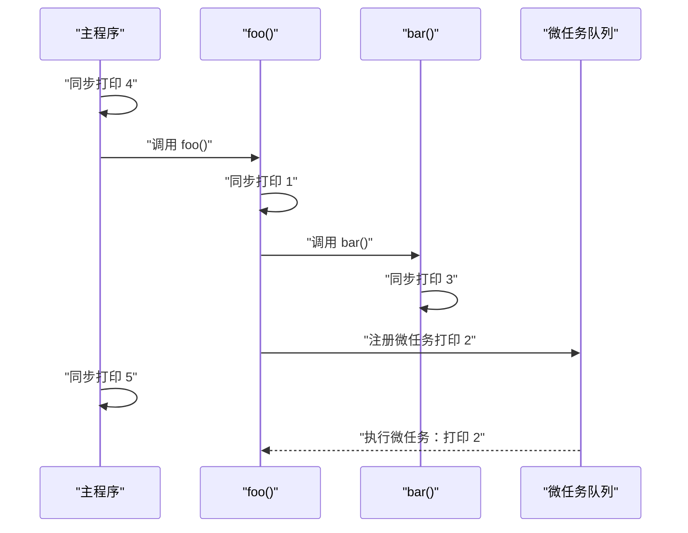
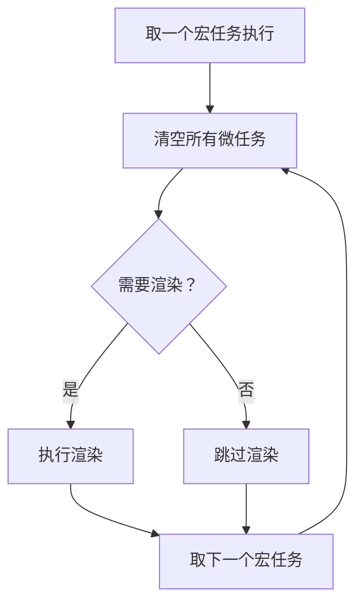
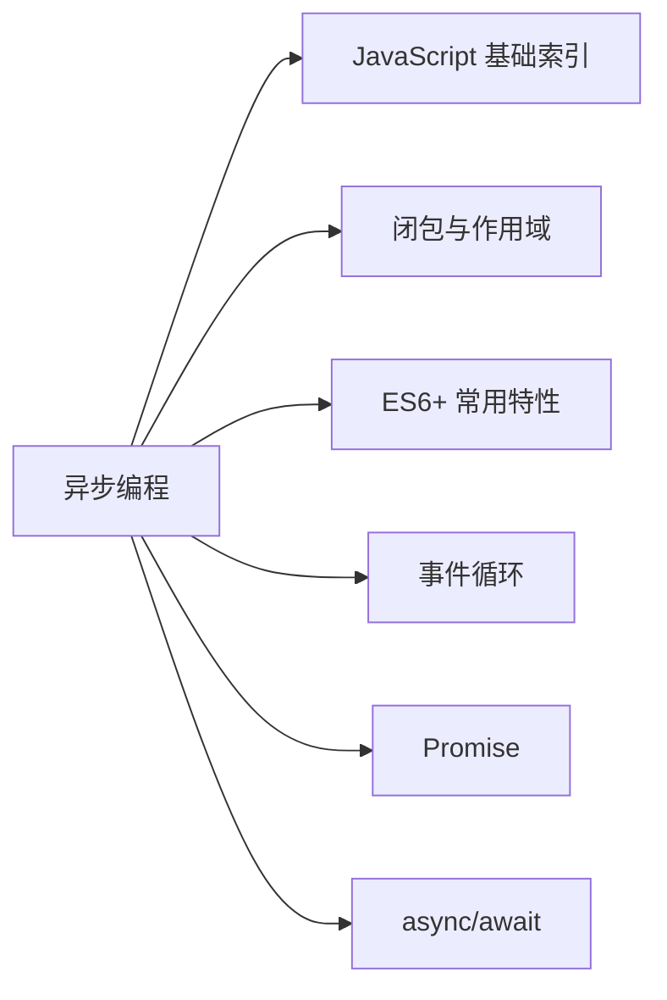

# 异步编程模式

<cite>
**本文引用的文件**
- [async-patterns.md](file://docs/javascript/async-patterns.md)
- [index.md](file://docs/javascript/index.md)
- [closure-scope.md](file://docs/javascript/closure-scope.md)
- [es-features.md](file://docs/javascript/es-features.md)
- [README.md](file://README.md)
</cite>

## 目录
1. [引言](#引言)
2. [项目结构](#项目结构)
3. [核心组件](#核心组件)
4. [架构总览](#架构总览)
5. [详细组件分析](#详细组件分析)
6. [依赖关系分析](#依赖关系分析)
7. [性能考量](#性能考量)
8. [故障排查指南](#故障排查指南)
9. [结论](#结论)
10. [附录](#附录)

## 引言
本篇文档围绕 JavaScript 异步编程模式展开，系统梳理回调函数、Promise、async/await 的发展脉络与适用场景；深入解析 Promise 的状态机、链式调用与错误处理；阐明 async/await 的语法糖本质与使用注意事项；并结合事件循环、微任务/宏任务机制，给出并发控制、错误处理、超时控制等最佳实践与常见问题的解决方案。同时，结合前端面试高频异步题目进行深入分析，帮助读者建立从原理到实战的完整知识体系。

## 项目结构
该仓库为 Docusaurus 静态站点，JavaScript 主题下的异步编程相关内容集中在单个文档中，配合其他 JavaScript 基础主题文档形成知识体系。

图表来源
- [async-patterns.md:1-106](file://docs/javascript/async-patterns.md#L1-L106)
- [index.md:1-16](file://docs/javascript/index.md#L1-L16)
- [closure-scope.md:1-88](file://docs/javascript/closure-scope.md#L1-L88)
- [es-features.md:1-98](file://docs/javascript/es-features.md#L1-L98)
- [README.md:1-42](file://README.md#L1-L42)

章节来源
- [README.md:1-42](file://README.md#L1-L42)
- [index.md:1-16](file://docs/javascript/index.md#L1-L16)

## 核心组件
- 回调函数：早期异步模式，通过传入回调处理成功/失败结果，易导致“回调地狱”。
- Promise：引入状态机与链式调用，统一错误处理，支持并发聚合（如 Promise.all）。
- async/await：基于 Promise 的语法糖，以同步风格编写异步逻辑，提升可读性与可维护性。
- 事件循环与任务队列：区分宏任务与微任务，明确执行顺序与时机，是理解异步行为的关键。

章节来源
- [async-patterns.md:10-18](file://docs/javascript/async-patterns.md#L10-L18)
- [async-patterns.md:20-46](file://docs/javascript/async-patterns.md#L20-L46)
- [async-patterns.md:48-75](file://docs/javascript/async-patterns.md#L48-L75)
- [async-patterns.md:76-98](file://docs/javascript/async-patterns.md#L76-L98)
- [async-patterns.md:100-106](file://docs/javascript/async-patterns.md#L100-L106)

## 架构总览
下图展示了异步编程在 JavaScript 中的演进路径与关键抽象之间的关系：回调作为基础，Promise 提供状态与链式能力，async/await 将 Promise 以同步语法呈现，事件循环决定执行顺序。

## 详细组件分析

### 回调函数与回调地狱
- 特征：以函数作为参数传递，按约定处理成功/失败。
- 风险：多层嵌套导致代码难以维护，错误处理分散，难以复用。
- 适用场景：简单一次性任务或历史遗留代码迁移。

章节来源
- [async-patterns.md:10-18](file://docs/javascript/async-patterns.md#L10-L18)

### Promise：状态机、链式调用与错误处理
- 状态机：pending → fulfilled/rejected，不可逆。
- 链式调用：then/catch/finally 返回新的 Promise，支持串联与统一错误处理。
- 并发聚合：Promise.all 等方法实现并行等待与结果收集。
- 手写 Promise.all：遍历输入，收集结果并按索引填充，任一失败即整体失败。

图表来源
- [async-patterns.md:20-46](file://docs/javascript/async-patterns.md#L20-L46)

章节来源
- [async-patterns.md:10-18](file://docs/javascript/async-patterns.md#L10-L18)
- [async-patterns.md:20-46](file://docs/javascript/async-patterns.md#L20-L46)

### async/await：语法糖与执行顺序
- 本质：编译期/运行期将 async 函数内部的 await 语法转换为 Promise 链，并将 await 后续代码放入微任务队列。
- 执行顺序：同步代码先于微任务执行；await 后的代码在本轮事件循环末尾的微任务阶段执行。
- 注意事项：await 仅对 Promise 生效；非 Promise 值会被包装为已解决的 Promise；await 后的代码属于微任务。

图表来源
- [async-patterns.md:48-75](file://docs/javascript/async-patterns.md#L48-L75)

章节来源
- [async-patterns.md:48-75](file://docs/javascript/async-patterns.md#L48-L75)
- [async-patterns.md:100-106](file://docs/javascript/async-patterns.md#L100-L106)

### 事件循环与任务队列：宏任务与微任务
- 宏任务：setTimeout/setInterval、I/O、UI 渲染等，每次取一个执行。
- 微任务：Promise.then/catch、MutationObserver、queueMicrotask 等，每次清空全部。
- 优先级：微任务优先于宏任务；不同微任务之间遵循先进先出。
- 实践要点：理解执行顺序有助于设计合理的并发策略与错误处理。

图表来源
- [async-patterns.md:76-98](file://docs/javascript/async-patterns.md#L76-L98)

章节来源
- [async-patterns.md:76-98](file://docs/javascript/async-patterns.md#L76-L98)
- [async-patterns.md:100-106](file://docs/javascript/async-patterns.md#L100-L106)

### 并发控制、错误处理与超时控制
- 并发控制：合理使用 Promise.all、Promise.race 等控制并发度与超时；对大量请求采用分批并发，避免阻塞主线程。
- 错误处理：统一在链末端集中处理异常；对可恢复错误采用重试策略，对不可恢复错误及时中断并上报。
- 超时控制：通过 Promise.race 与定时器组合实现超时；注意清理资源，避免内存泄漏。
- 最佳实践：将异步逻辑封装为可复用的工具函数；在 UI 层提供加载态与错误态反馈；在服务端/客户端分别考虑网络抖动与资源限制。

章节来源
- [async-patterns.md:20-46](file://docs/javascript/async-patterns.md#L20-L46)
- [async-patterns.md:76-98](file://docs/javascript/async-patterns.md#L76-L98)

### 常见问题与解决方案
- 回调地狱：通过 Promise/async/await 替换深层回调，保持代码扁平化。
- 竞态条件：使用互斥锁、防抖节流或原子操作避免并发冲突；在 UI 层禁用重复提交。
- 内存泄漏：避免闭包持有大对象；及时清理定时器与事件监听；使用 WeakMap/WeakSet 存储临时引用。
- 错误传播：确保每个 Promise 都有对应的 catch；在 async/await 中使用 try/catch 包裹可能抛错的段落。
- 性能瓶颈：减少不必要的微任务堆积；合并多次 UI 更新；使用 Web Workers 处理重型计算。

章节来源
- [closure-scope.md:1-88](file://docs/javascript/closure-scope.md#L1-L88)
- [async-patterns.md:100-106](file://docs/javascript/async-patterns.md#L100-L106)

### 面试高频异步题目解析
- 事件循环与执行顺序：结合宏任务/微任务模型，解释常见输出序列与调试技巧。
- Promise 链式调用：考察 then/catch/finally 的返回值与错误冒泡机制。
- async/await 与 Promise 的关系：理解 await 的微任务语义与异常捕获。
- 并发与超时：设计合理的并发策略与超时控制方案。
- 闭包与异步：利用闭包保存状态，但需警惕内存泄漏风险。

章节来源
- [async-patterns.md:48-75](file://docs/javascript/async-patterns.md#L48-L75)
- [async-patterns.md:76-98](file://docs/javascript/async-patterns.md#L76-L98)
- [closure-scope.md:29-61](file://docs/javascript/closure-scope.md#L29-L61)

## 依赖关系分析
- 文档间依赖：异步编程文档与 JavaScript 基础索引、闭包与作用域、ES6+ 特性共同构成知识闭环。
- 技术依赖：异步编程依赖事件循环模型；Promise/async/await 依赖语言规范与运行时支持。
- 工具依赖：ES6+ 特性（如解构、展开/剩余、可选链/空值合并）可简化异步代码组织与错误处理。

图表来源
- [async-patterns.md:1-106](file://docs/javascript/async-patterns.md#L1-L106)
- [index.md:1-16](file://docs/javascript/index.md#L1-L16)
- [closure-scope.md:1-88](file://docs/javascript/closure-scope.md#L1-L88)
- [es-features.md:1-98](file://docs/javascript/es-features.md#L1-L98)

章节来源
- [index.md:1-16](file://docs/javascript/index.md#L1-L16)
- [closure-scope.md:1-88](file://docs/javascript/closure-scope.md#L1-L88)
- [es-features.md:1-98](file://docs/javascript/es-features.md#L1-L98)

## 性能考量
- 避免微任务堆积：减少过多微任务导致的 UI 卡顿；必要时拆分任务或使用 requestIdleCallback。
- 控制并发度：批量请求时限制并发数量，降低网络拥塞与服务器压力。
- 资源释放：及时取消未完成的请求与定时器；在组件卸载时清理订阅。
- 缓存与去抖：对频繁触发的异步操作进行缓存与去抖，减少无效请求。

## 故障排查指南
- 症状：输出顺序不符合预期
  - 排查：确认宏任务与微任务边界，检查 await 后的微任务注册位置。
- 症状：错误未被捕获
  - 排查：在 Promise 链末端添加 catch；在 async/await 中使用 try/catch。
- 症状：内存占用持续上升
  - 排查：检查闭包是否持有大对象；确认定时器与事件监听是否正确清理。
- 症状：请求过多导致卡顿
  - 排查：优化并发策略，增加超时与重试控制，必要时启用分页或懒加载。

章节来源
- [async-patterns.md:76-98](file://docs/javascript/async-patterns.md#L76-L98)
- [closure-scope.md:82-88](file://docs/javascript/closure-scope.md#L82-L88)

## 结论
异步编程是现代 JavaScript 开发的核心能力。从回调到 Promise，再到 async/await，技术不断演进以提升可读性与可维护性。掌握事件循环与任务队列机制，是理解异步行为与设计高性能应用的关键。建议在实践中坚持“封装、并发控制、错误处理、超时控制”的原则，并结合 ES6+ 新特性优化代码组织与可读性。

## 附录
- 相关文档入口
  - [JavaScript 基础索引](file://docs/javascript/index.md)
  - [闭包与作用域](file://docs/javascript/closure-scope.md)
  - [ES6+ 常用特性](file://docs/javascript/es-features.md)
- 项目开发与部署
  - [项目说明与开发流程](file://README.md)