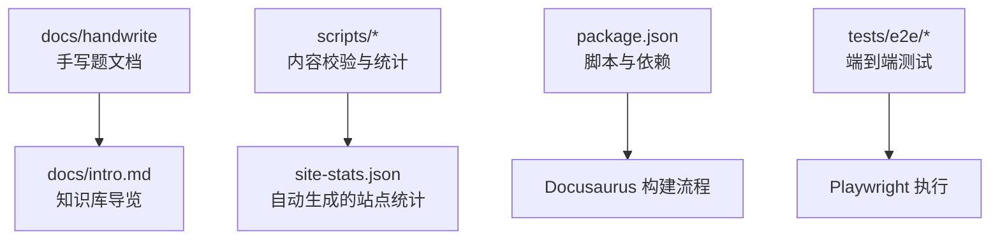
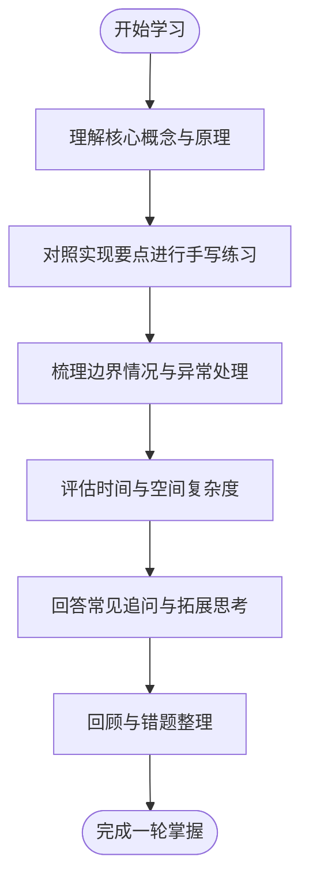
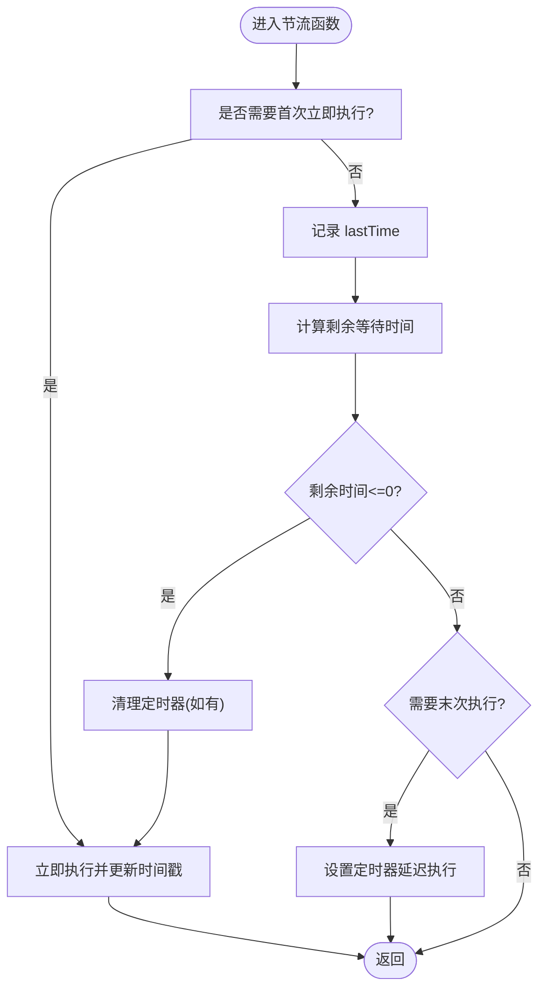
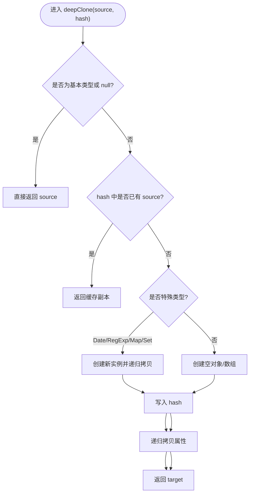
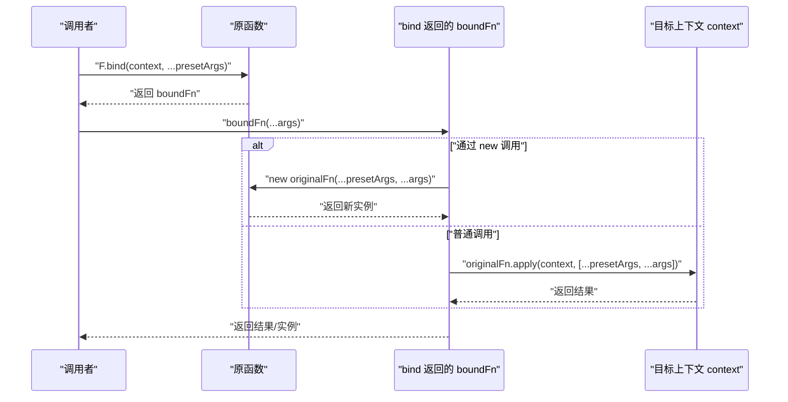
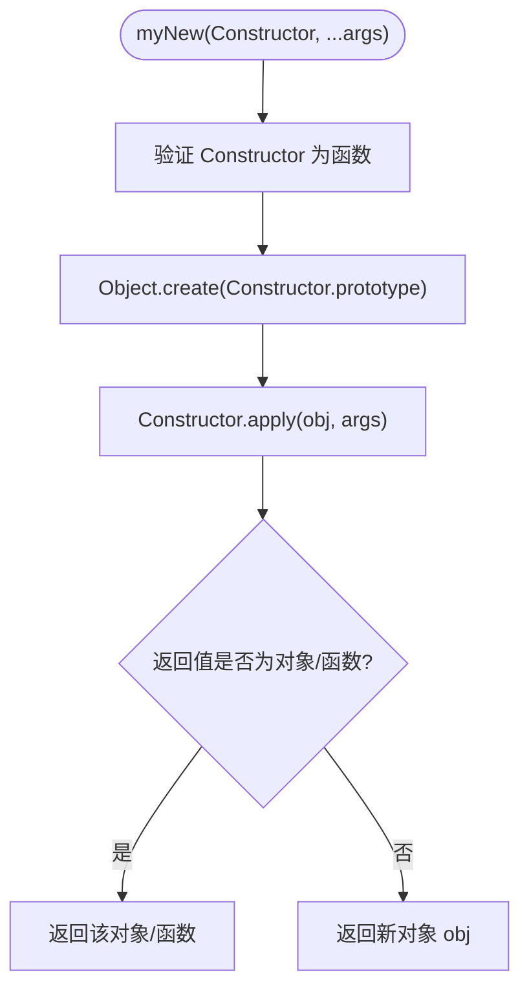
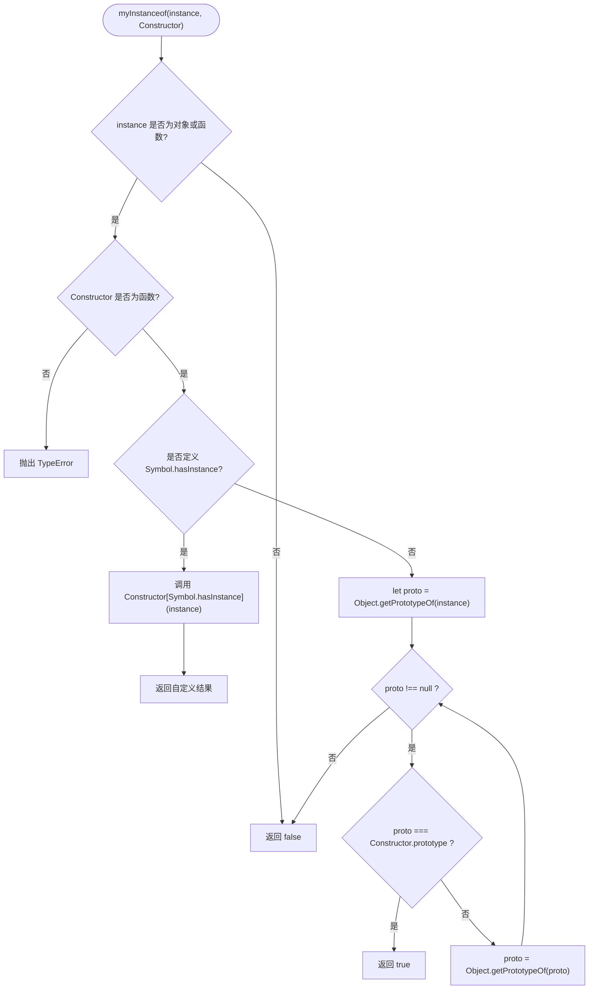
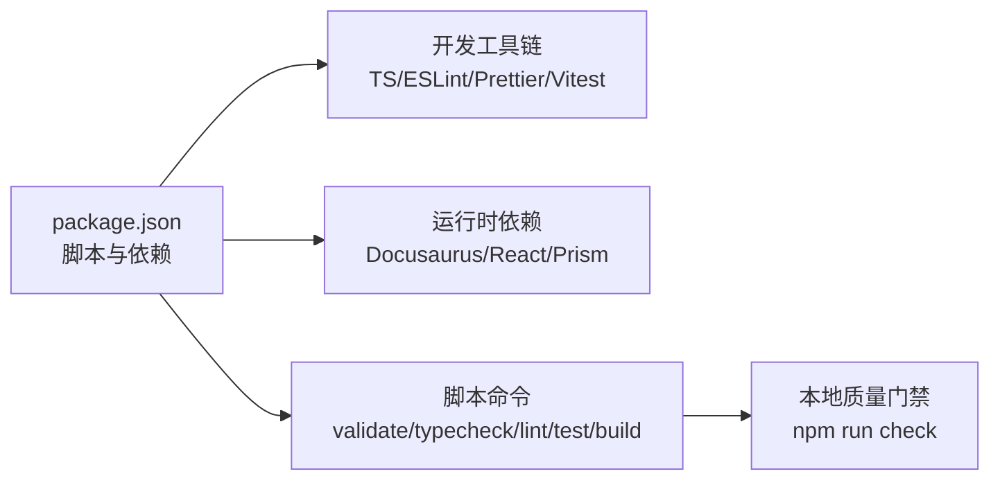

# 手写代码挑战

<cite>
**本文引用的文件**
- [README.md](file://README.md)
- [package.json](file://package.json)
- [docs/intro.md](file://docs/intro.md)
- [docs/handwrite/index.md](file://docs/handwrite/index.md)
- [docs/handwrite/throttle.md](file://docs/handwrite/throttle.md)
- [docs/handwrite/deep-clone.md](file://docs/handwrite/deep-clone.md)
- [docs/handwrite/call-apply-bind.md](file://docs/handwrite/call-apply-bind.md)
- [docs/handwrite/my-new.md](file://docs/handwrite/my-new.md)
- [docs/handwrite/my-instanceof.md](file://docs/handwrite/my-instanceof.md)
</cite>

## 目录
1. [简介](#简介)
2. [项目结构](#项目结构)
3. [核心组件](#核心组件)
4. [架构总览](#架构总览)
5. [详细组件分析](#详细组件分析)
6. [依赖分析](#依赖分析)
7. [性能考量](#性能考量)
8. [故障排查指南](#故障排查指南)
9. [结论](#结论)
10. [附录](#附录)

## 简介
本仓库是一个基于 Docusaurus 的前端面试知识库，重点覆盖 JavaScript、TypeScript、React、Vue、浏览器、网络、工程化与 AI 等专题。其中“手写题”模块聚焦高频面试题，包括防抖/节流、深拷贝、call/apply/bind、new、instanceof 等，配套详尽的思路、实现要点、边界情况与复杂度分析，适合系统化备考与实战演练。

## 项目结构
- docs：Markdown/MDX 文档，按主题分目录组织；手写题集中在 docs/handwrite
- src/pages、src/components、src/utils：站点页面与可复用逻辑（测验相关）
- scripts：内容校验与统计脚本
- tests/e2e：端到端测试
- package.json：构建、校验、测试、格式化等脚本与依赖

图表来源
- [README.md:51-61](file://README.md#L51-L61)
- [package.json:15-24](file://package.json#L15-L24)

章节来源
- [README.md:1-88](file://README.md#L1-L88)
- [package.json:1-67](file://package.json#L1-L67)
- [docs/intro.md:1-36](file://docs/intro.md#L1-L36)

## 核心组件
- 手写题知识体系：以“题目描述—核心思路—实现要点—边界情况—复杂度—追问”为主线，形成统一的学习路径
- 关键题型：
  - 节流 throttle：时间戳版与定时器版两种范式，支持 leading/trailing 配置与取消
  - 深拷贝 deepClone：WeakMap 解决循环引用，处理 Date/RegExp/Map/Set 等特殊类型
  - call/apply/bind：this 绑定机制、Symbol 临时属性、原型链维护与 new 调用兼容
  - new 操作符：创建对象、连接原型链、构造函数执行与返回值处理
  - instanceof：沿原型链查找，支持 Symbol.hasInstance 扩展

章节来源
- [docs/handwrite/index.md:10-42](file://docs/handwrite/index.md#L10-L42)
- [docs/handwrite/throttle.md:18-33](file://docs/handwrite/throttle.md#L18-L33)
- [docs/handwrite/deep-clone.md:18-41](file://docs/handwrite/deep-clone.md#L18-L41)
- [docs/handwrite/call-apply-bind.md:17-30](file://docs/handwrite/call-apply-bind.md#L17-L30)
- [docs/handwrite/my-new.md:12-28](file://docs/handwrite/my-new.md#L12-L28)
- [docs/handwrite/my-instanceof.md:15-25](file://docs/handwrite/my-instanceof.md#L15-L25)

## 架构总览
手写题知识体系采用“概念—实现—边界—复杂度—追问”的递进式结构，便于从理解到实践再到复盘。

[本图为概念性流程图，不直接映射具体源码文件]

## 详细组件分析

### 节流 throttle
- 目标：在单位时间内只允许函数执行一次，适用于滚动加载、拖拽移动、搜索联想等场景
- 实现范式：
  - 时间戳版：首次立即执行，停止触发后不再执行
  - 定时器版：延迟执行，停止触发后会再执行一次
  - 终极版：支持 leading/trailing 选项与 cancel 方法
- 关键点：
  - this 上下文透传与参数透传
  - 时间精度与内存泄漏防护（cancel）
  - 与 requestAnimationFrame 的结合使用

图表来源
- [docs/handwrite/throttle.md:93-153](file://docs/handwrite/throttle.md#L93-L153)

章节来源
- [docs/handwrite/throttle.md:1-267](file://docs/handwrite/throttle.md#L1-L267)

### 深拷贝 deepClone
- 目标：对对象进行深度复制，支持基本类型、普通对象/数组、Date/RegExp/Map/Set 以及循环引用
- 关键点：
  - WeakMap 缓存已拷贝对象，避免无限递归
  - 通过 Object.getPrototypeOf/Object.create 保持原型链
  - 遍历自身属性（含 Symbol），必要时处理不可枚举属性与 getter/setter
  - 特殊类型构造新实例并拷贝必要状态（如 RegExp.lastIndex）

图表来源
- [docs/handwrite/deep-clone.md:44-112](file://docs/handwrite/deep-clone.md#L44-L112)
- [docs/handwrite/deep-clone.md:116-207](file://docs/handwrite/deep-clone.md#L116-L207)

章节来源
- [docs/handwrite/deep-clone.md:1-304](file://docs/handwrite/deep-clone.md#L1-L304)

### call/apply/bind
- 目标：手动实现 Function.prototype.call/apply/bind，理解 this 绑定与原型链
- 关键点：
  - call/apply：将函数挂载为对象的临时方法，执行后删除，注意 Symbol 避免冲突
  - bind：返回新函数，合并预设参数与调用参数，正确处理 new 调用与原型链
  - 边界：context 为 null/undefined、基本类型装箱、箭头函数不可改变 this

图表来源
- [docs/handwrite/call-apply-bind.md:95-173](file://docs/handwrite/call-apply-bind.md#L95-L173)

章节来源
- [docs/handwrite/call-apply-bind.md:1-302](file://docs/handwrite/call-apply-bind.md#L1-L302)

### new 操作符
- 目标：模拟 new 的行为，理解对象创建、原型链连接与构造函数执行
- 关键点：
  - 使用 Object.create 建立原型链
  - apply 执行构造函数，this 指向新对象
  - 若构造函数返回对象/函数则使用该返回值，否则返回新对象

图表来源
- [docs/handwrite/my-new.md:68-96](file://docs/handwrite/my-new.md#L68-L96)

章节来源
- [docs/handwrite/my-new.md:1-273](file://docs/handwrite/my-new.md#L1-L273)

### instanceof
- 目标：沿原型链查找，判断 Constructor.prototype 是否在实例的原型链上
- 关键点：
  - 使用 Object.getPrototypeOf 迭代原型链至 null
  - 支持 Symbol.hasInstance 自定义行为
  - 处理基本类型、null/undefined 与非函数右侧参数的边界

图表来源
- [docs/handwrite/my-instanceof.md:85-126](file://docs/handwrite/my-instanceof.md#L85-L126)

章节来源
- [docs/handwrite/my-instanceof.md:1-293](file://docs/handwrite/my-instanceof.md#L1-L293)

## 依赖分析
- 运行时依赖：Docusaurus 生态（@docusaurus/core、preset-classic）、React、prism-react-renderer、clsx 等
- 开发依赖：TypeScript、ESLint、Prettier、Vitest、Playwright
- 脚本链路：prestart/prebuild 会先运行内容校验，确保题库质量后再启动/构建

图表来源
- [package.json:15-24](file://package.json#L15-L24)
- [package.json:26-50](file://package.json#L26-L50)

章节来源
- [package.json:1-67](file://package.json#L1-L67)

## 性能考量
- 节流：优先选择时间戳版本用于“首触即发”的场景；定时器版本适合“末次必达”；复杂场景结合 leading/trailing 与 cancel
- 深拷贝：大对象建议迭代替代递归以避免栈溢出；仅含基本类型的对象可使用 JSON.parse(JSON.stringify()) 优化；结构化数据可用 structuredClone
- call/apply/bind：避免频繁创建闭包与临时属性；在 React 中注意 memo 与稳定引用
- instanceof：原生实现由引擎优化，手写仅作理解用途

[本节提供通用指导，不直接分析具体文件]

## 故障排查指南
- 内容校验失败：检查题目 ID 唯一性、分类合法性、选项值重复、答案存在性、解析非空、分类统计一致性
- 构建失败：确认 Node.js 版本满足要求，安装依赖后执行 npm ci 与 npm start
- 单元测试失败：定位 Vitest 报错用例，核对断言与边界条件
- E2E 测试失败：确保已安装 Chromium 浏览器（npx playwright install chromium）

章节来源
- [README.md:63-79](file://README.md#L63-L79)
- [README.md:36-40](file://README.md#L36-L40)
- [package.json:15-24](file://package.json#L15-L24)

## 结论
本知识库围绕“手写题”构建了系统化的学习闭环：从高频清单到逐题拆解，从实现要点到边界与复杂度，再到追问与实战建议。配合自动化校验与测试，保证内容质量与可维护性，适合面试准备与能力进阶。

[本节为总结性内容，不直接分析具体文件]

## 附录
- 快速上手
  - 安装与启动：参考 README 中的本地开发与常用命令
  - 题库校验：提交前运行 npm run validate:content 与 npm run check
- 学习路径建议
  - 先通读 docs/handwrite/index.md 了解清单与难度分布
  - 按顺序精读各题文档，边看边写，完成后自测边界与复杂度
  - 结合随堂测验巩固掌握程度

章节来源
- [README.md:14-34](file://README.md#L14-L34)
- [docs/handwrite/index.md:1-53](file://docs/handwrite/index.md#L1-L53)