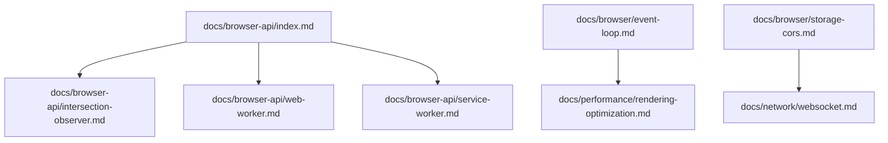
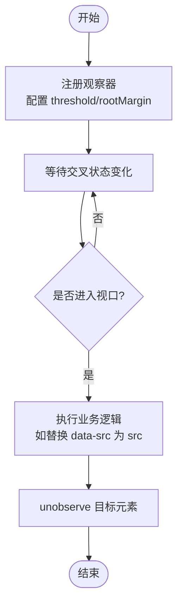
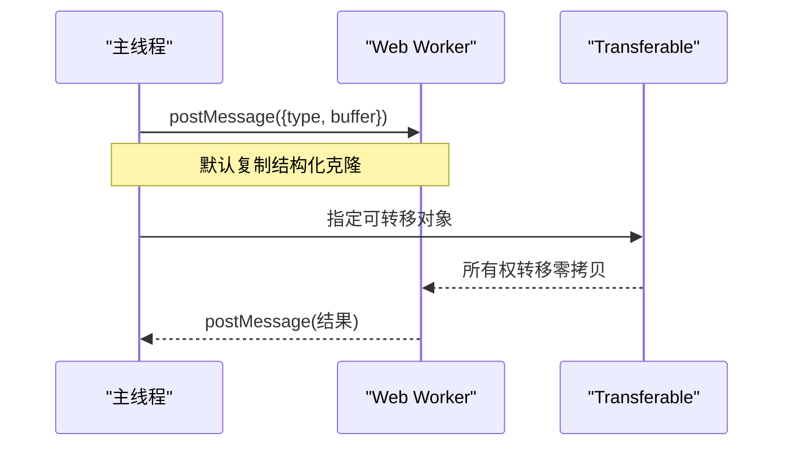
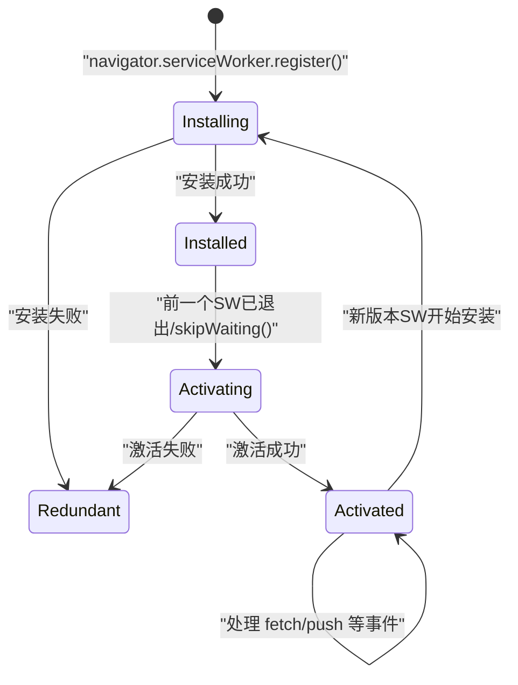
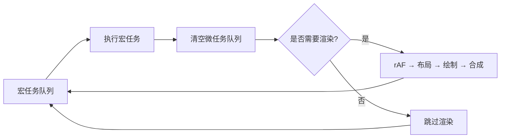
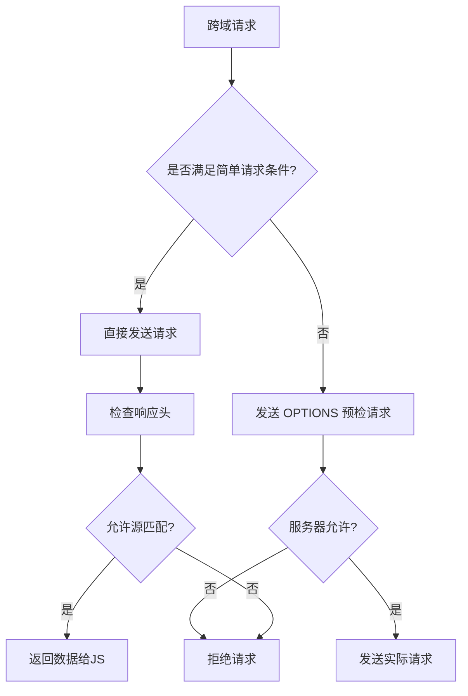
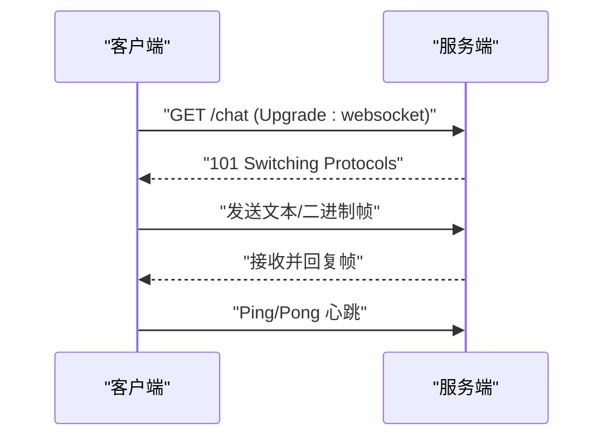
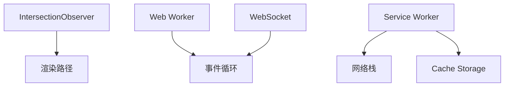

# 浏览器API进阶

<cite>
**本文引用的文件**
- [docs/browser-api/index.md](file://docs/browser-api/index.md)
- [docs/browser-api/intersection-observer.md](file://docs/browser-api/intersection-observer.md)
- [docs/browser-api/web-worker.md](file://docs/browser-api/web-worker.md)
- [docs/browser-api/service-worker.md](file://docs/browser-api/service-worker.md)
- [docs/browser/event-loop.md](file://docs/browser/event-loop.md)
- [docs/browser/storage-cors.md](file://docs/browser/storage-cors.md)
- [docs/performance/rendering-optimization.md](file://docs/performance/rendering-optimization.md)
- [docs/network/websocket.md](file://docs/network/websocket.md)
</cite>

## 目录
1. [引言](#引言)
2. [项目结构](#项目结构)
3. [核心组件](#核心组件)
4. [架构总览](#架构总览)
5. [详细组件分析](#详细组件分析)
6. [依赖关系分析](#依赖关系分析)
7. [性能考量](#性能考量)
8. [故障排查指南](#故障排查指南)
9. [结论](#结论)
10. [附录](#附录)

## 引言
本章节面向希望系统掌握“浏览器 API 进阶”的前端开发者，围绕观测类、并行计算、存储与网络等关键能力，结合事件循环、渲染路径与跨域安全等底层机制，构建从原理到实战的完整知识体系。内容覆盖 IntersectionObserver、Web Worker/SharedWorker、Service Worker、WebSocket/SSE、存储与同源策略等高频考点，并给出面试要点与实践建议。

## 项目结构
仓库采用文档型知识库组织方式，按主题分目录存放 Markdown 文档，便于检索与学习。与“浏览器 API 进阶”直接相关的文档集中在 docs 目录下：
- browser-api：IntersectionObserver、Web Worker、Service Worker 专题
- browser：事件循环、存储与跨域
- performance：渲染优化（重排重绘、动画、长任务拆分）
- network：WebSocket 与实时通信



图表来源
- [docs/browser-api/index.md:1-113](file://docs/browser-api/index.md#L1-L113)
- [docs/browser/event-loop.md:1-376](file://docs/browser/event-loop.md#L1-L376)
- [docs/browser/storage-cors.md:1-480](file://docs/browser/storage-cors.md#L1-L480)
- [docs/performance/rendering-optimization.md:1-747](file://docs/performance/rendering-optimization.md#L1-L747)
- [docs/network/websocket.md:1-371](file://docs/network/websocket.md#L1-L371)

章节来源
- [docs/browser-api/index.md:1-113](file://docs/browser-api/index.md#L1-L113)

## 核心组件
本节聚焦三大核心能力：观测器、工作线程、后台代理。

- 观测器（Observer）
  - 作用：以异步、批处理的方式监听元素可见性、尺寸变化、DOM 变更与性能指标，替代传统频繁触发的事件回调，避免强制回流。
  - 典型场景：图片懒加载、无限滚动、广告曝光统计、吸顶导航。
  - 参考实现与对比见：[docs/browser-api/intersection-observer.md:1-405](file://docs/browser-api/intersection-observer.md#L1-L405)。

- 工作线程（Web Worker / SharedWorker）
  - 作用：将耗时计算移出主线程，避免阻塞 UI；支持多页面共享状态与消息通道；可配合 Transferable Objects 实现零拷贝传输。
  - 典型场景：大数据计算、图像处理、加密解密、复杂算法、大文件分片处理。
  - 参考实现与最佳实践见：[docs/browser-api/web-worker.md:1-510](file://docs/browser-api/web-worker.md#L1-L510)。

- 后台代理（Service Worker）
  - 作用：拦截网络请求、缓存资源、离线优先、推送通知；具备独立生命周期与版本管理。
  - 典型场景：PWA 离线体验、静态资源预缓存、API 请求降级、后台同步。
  - 参考实现与策略选型见：[docs/browser-api/service-worker.md:1-506](file://docs/browser-api/service-worker.md#L1-L506)。

章节来源
- [docs/browser-api/index.md:1-113](file://docs/browser-api/index.md#L1-L113)
- [docs/browser-api/intersection-observer.md:1-405](file://docs/browser-api/intersection-observer.md#L1-L405)
- [docs/browser-api/web-worker.md:1-510](file://docs/browser-api/web-worker.md#L1-L510)
- [docs/browser-api/service-worker.md:1-506](file://docs/browser-api/service-worker.md#L1-L506)

## 架构总览
下图展示浏览器 API 在应用中的整体协作关系：主线程负责 UI 与交互，观测器提供非阻塞感知，工作线程承担计算，Service Worker 作为网络层代理与缓存中枢。

```mermaid
graph TB
subgraph "主线程"
UI["UI 渲染"]
JS["JavaScript 执行"]
OBS["IntersectionObserver<br/>ResizeObserver<br/>MutationObserver"]
end
subgraph "工作线程"
WW["Web Worker"]
SWO["SharedWorker"]
end
subgraph "后台代理"
SWS["Service Worker"]
CACHE["Cache Storage"]
end
subgraph "网络"
NET["HTTP/WebSocket/SSE"]
end
JS --> OBS
JS < --> |postMessage| WW
JS < --> |port| SWO
JS --> |注册| SWS
SWS --> |拦截请求| NET
SWS --> |读写| CACHE
```

图表来源
- [docs/browser-api/index.md:79-105](file://docs/browser-api/index.md#L79-L105)
- [docs/browser-api/web-worker.md:1-120](file://docs/browser-api/web-worker.md#L1-L120)
- [docs/browser-api/service-worker.md:1-120](file://docs/browser-api/service-worker.md#L1-L120)

## 详细组件分析

### 组件一：IntersectionObserver 详解
- 工作原理
  - 浏览器内部线程批量计算交叉状态，异步回调，避免主线程频繁 getBoundingClientRect 导致的强制回流。
  - 适用场景：懒加载、无限滚动、广告曝光、吸顶导航。
- 关键参数与行为
  - threshold：触发回调的交叉比例阈值，支持数组监听多个阈值。
  - rootMargin：扩大或缩小根判定范围，常用于提前加载。
  - root：自定义根元素，支持相对容器而非仅视口。
- 性能对比
  - 相比 scroll 事件：减少主线程占用、无强制回流、无需手动节流。
- 兼容性与降级
  - IE 不支持，需 polyfill 或回退为立即加载。



图表来源
- [docs/browser-api/intersection-observer.md:1-120](file://docs/browser-api/intersection-observer.md#L1-L120)
- [docs/browser-api/intersection-observer.md:353-379](file://docs/browser-api/intersection-observer.md#L353-L379)

章节来源
- [docs/browser-api/intersection-observer.md:1-405](file://docs/browser-api/intersection-observer.md#L1-L405)

### 组件二：Web Worker 与 SharedWorker
- 通信模型
  - 主线程与 Worker 通过 postMessage 通信，数据默认结构化克隆复制；Transferable Objects 可实现零拷贝转移。
  - SharedWorker 允许多个页面共享同一实例，适合跨标签页状态同步。
- 可用 API 与限制
  - 不可访问 DOM、window、document；可使用 Fetch、IndexedDB、WebAssembly 等。
- 高级用法
  - Comlink：基于 Proxy 封装 postMessage，使远程调用更像本地方法。
  - 线程池：复用 Worker 实例，降低创建销毁开销。
  - 大文件处理：分片读取、哈希计算、进度上报。



图表来源
- [docs/browser-api/web-worker.md:1-120](file://docs/browser-api/web-worker.md#L1-L120)
- [docs/browser-api/web-worker.md:200-281](file://docs/browser-api/web-worker.md#L200-L281)

章节来源
- [docs/browser-api/web-worker.md:1-510](file://docs/browser-api/web-worker.md#L1-L510)

### 组件三：Service Worker 详解
- 生命周期
  - installing → installed → activating → activated；新版本安装后需 skipWaiting 或客户端切换控制才能激活。
- 缓存策略
  - Cache First：静态资源优先命中缓存。
  - Network First：API 优先网络，失败回退缓存。
  - Stale While Revalidate：先返回缓存，后台更新缓存。
- 离线优先
  - 预缓存关键资源，导航请求优先网络，失败返回离线页面。
- 推送通知
  - 订阅 → 发送订阅信息到服务端 → 服务端通过推送服务下发 → SW 处理 push 事件并显示通知。
- 版本更新
  - 定期检查更新，提示用户并跳过等待，刷新页面生效。



图表来源
- [docs/browser-api/service-worker.md:1-101](file://docs/browser-api/service-worker.md#L1-L101)

章节来源
- [docs/browser-api/service-worker.md:1-506](file://docs/browser-api/service-worker.md#L1-L506)

### 组件四：事件循环与渲染路径
- 事件循环
  - 宏任务与微任务的调度顺序决定异步代码的执行时机；Promise.then、MutationObserver、queueMicrotask 属于微任务。
  - requestAnimationFrame 在渲染前执行，requestIdleCallback 在帧末尾空闲时间执行。
- 渲染路径
  - HTML/CSS 解析 → DOM/CSSOM → Render Tree → Layout → Paint → Composite。
  - 避免强制同步布局，批量读写属性；使用 transform/opacity 提升合成层性能。
- 长任务拆分
  - 时间切片、scheduler.yield、Web Worker 分担计算压力。



图表来源
- [docs/browser/event-loop.md:86-127](file://docs/browser/event-loop.md#L86-L127)
- [docs/performance/rendering-optimization.md:16-62](file://docs/performance/rendering-optimization.md#L16-L62)

章节来源
- [docs/browser/event-loop.md:1-376](file://docs/browser/event-loop.md#L1-L376)
- [docs/performance/rendering-optimization.md:1-747](file://docs/performance/rendering-optimization.md#L1-L747)

### 组件五：存储与跨域
- 存储方案
  - Cookie：体积有限、自动携带、可设置 SameSite/HttpOnly/Secure。
  - localStorage/sessionStorage：键值对字符串存储，同步 API。
  - IndexedDB：异步结构化存储，适合大量数据。
- 同源策略
  - 协议+主机+端口三者一致才算同源；影响 AJAX、DOM 访问、Cookie/Storage 访问。
- CORS
  - 简单请求与预检请求的区别；常用响应头 Access-Control-Allow-*。
- 其他跨域方案
  - JSONP（已过时）、postMessage（iframe 通信）、反向代理（Nginx）。



图表来源
- [docs/browser/storage-cors.md:220-289](file://docs/browser/storage-cors.md#L220-L289)

章节来源
- [docs/browser/storage-cors.md:1-480](file://docs/browser/storage-cors.md#L1-L480)

### 组件六：WebSocket 与实时通信
- 通信方式对比
  - HTTP 轮询、长轮询、SSE、WebSocket 的适用场景与优缺点。
- WebSocket 握手与帧格式
  - 通过 HTTP Upgrade 建立连接；帧包含 opcode、payload 长度、掩码等。
- 心跳与重连
  - Ping/Pong 保活；指数退避 + 随机抖动重连策略。
- SSE
  - 单向推送、自动重连、Last-Event-ID 断点续传。



图表来源
- [docs/network/websocket.md:46-109](file://docs/network/websocket.md#L46-L109)
- [docs/network/websocket.md:148-240](file://docs/network/websocket.md#L148-L240)

章节来源
- [docs/network/websocket.md:1-371](file://docs/network/websocket.md#L1-L371)

## 依赖关系分析
- 组件内聚与耦合
  - IntersectionObserver 与渲染路径紧密相关，应避免在回调中触发强制回流。
  - Web Worker 与主线程解耦，通过消息传递耦合，注意序列化与内存占用。
  - Service Worker 与网络栈耦合，需关注缓存策略与版本更新。
- 外部依赖与集成点
  - 网络层：Fetch、WebSocket、SSE。
  - 存储层：localStorage、sessionStorage、IndexedDB、Cache Storage。
  - 运行时：事件循环、渲染管线。



图表来源
- [docs/browser-api/intersection-observer.md:1-120](file://docs/browser-api/intersection-observer.md#L1-L120)
- [docs/browser-api/web-worker.md:1-120](file://docs/browser-api/web-worker.md#L1-L120)
- [docs/browser-api/service-worker.md:1-120](file://docs/browser-api/service-worker.md#L1-L120)
- [docs/network/websocket.md:1-120](file://docs/network/websocket.md#L1-L120)
- [docs/performance/rendering-optimization.md:16-62](file://docs/performance/rendering-optimization.md#L16-L62)

章节来源
- [docs/browser-api/index.md:1-113](file://docs/browser-api/index.md#L1-L113)

## 性能考量
- 避免强制同步布局
  - 批量读取与写入，减少 getBoundingClientRect、offsetWidth 等读操作穿插写操作。
- 使用合适的动画属性
  - 优先 transform/opacity，必要时开启 will-change 提升合成层。
- 长任务拆分
  - 时间切片、requestIdleCallback、scheduler.yield、Web Worker。
- 列表渲染优化
  - 虚拟列表、只渲染可视区域，减少 DOM 节点数量。
- 事件处理优化
  - 事件委托、防抖与节流，降低高频事件带来的开销。

章节来源
- [docs/performance/rendering-optimization.md:1-747](file://docs/performance/rendering-optimization.md#L1-L747)

## 故障排查指南
- IntersectionObserver
  - 现象：回调未触发或频繁触发。
  - 排查：确认 rootMargin/threshold 配置；确保目标元素未被 display:none 隐藏；及时 unobserve 释放资源。
- Web Worker
  - 现象：主线程卡顿、内存飙升。
  - 排查：避免在主线程进行大对象复制；使用 Transferable Objects；合理划分任务粒度；监控 worker.onerror。
- Service Worker
  - 现象：缓存不更新、离线页面不生效。
  - 排查：检查 install/activate/fetch 事件；确认 cacheName 版本；使用 clients.claim 与 skipWaiting；HTTPS 环境要求。
- WebSocket
  - 现象：连接频繁断开、消息丢失。
  - 排查：实现心跳与指数退避重连；记录 Last-Event-ID（SSE）；校验握手与帧格式。
- 跨域问题
  - 现象：CORS 报错、预检失败。
  - 排查：核对 Origin、Allow-Methods、Allow-Headers；开发环境使用代理；生产环境 Nginx 转发。

章节来源
- [docs/browser-api/intersection-observer.md:380-405](file://docs/browser-api/intersection-observer.md#L380-L405)
- [docs/browser-api/web-worker.md:400-510](file://docs/browser-api/web-worker.md#L400-L510)
- [docs/browser-api/service-worker.md:402-506](file://docs/browser-api/service-worker.md#L402-L506)
- [docs/network/websocket.md:148-371](file://docs/network/websocket.md#L148-L371)
- [docs/browser/storage-cors.md:220-480](file://docs/browser/storage-cors.md#L220-L480)

## 结论
通过系统化掌握 IntersectionObserver、Web Worker/SharedWorker、Service Worker、WebSocket/SSE 以及事件循环与渲染路径，可以在保证用户体验的前提下，充分利用浏览器能力实现高性能、高可用的前端应用。同时，理解同源策略与 CORS 机制，有助于在复杂网络环境中稳定运行。

## 附录
- 面试通用要点
  - Observer 模式的优势与适用场景
  - Worker 体系的职责边界与通信机制
  - Service Worker 的生命周期与缓存策略选型
  - 事件循环与渲染路径的关键时序
  - 存储方案的选择与安全策略
  - 实时通信方案的选型与健壮性设计