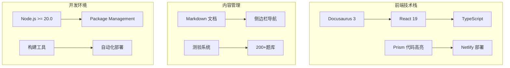
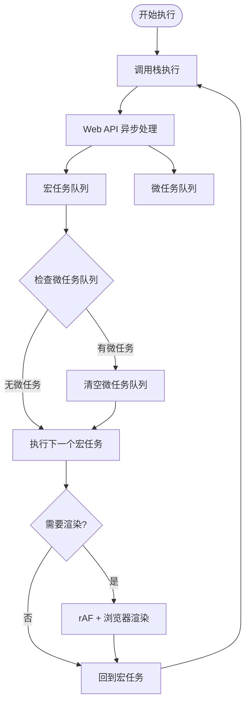
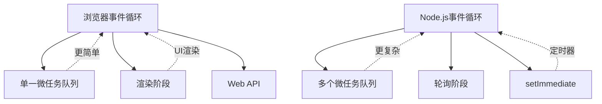
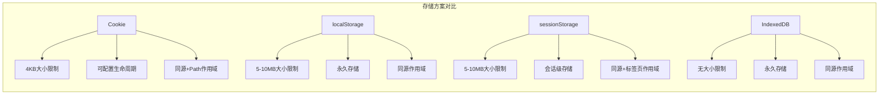
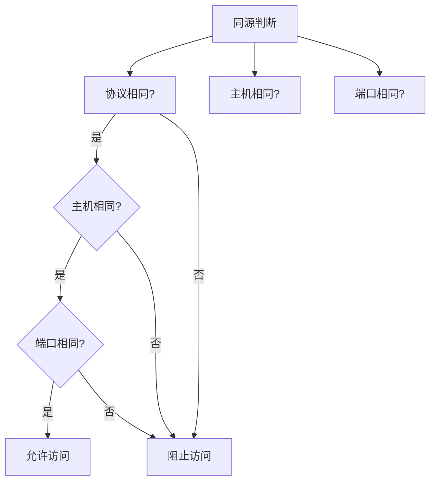
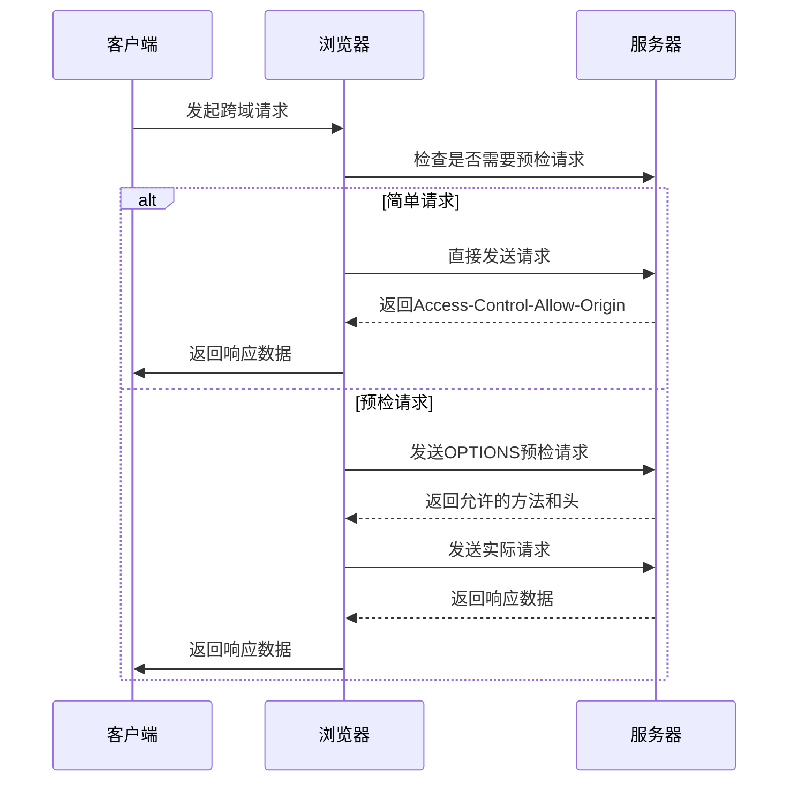
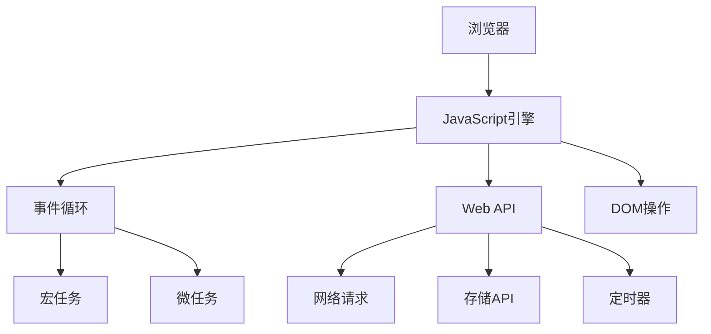
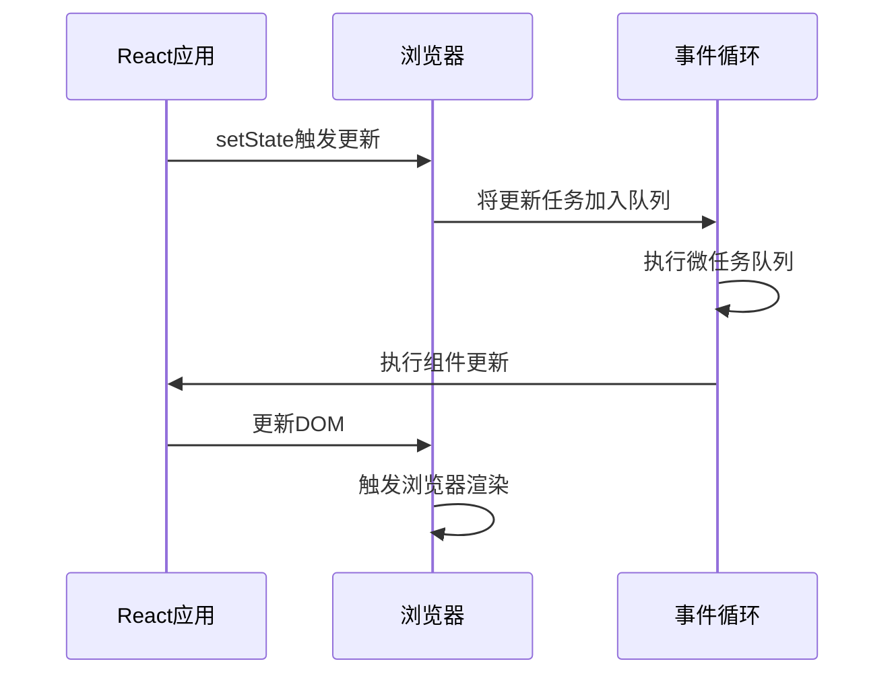
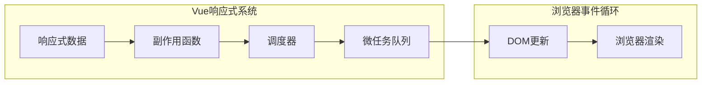
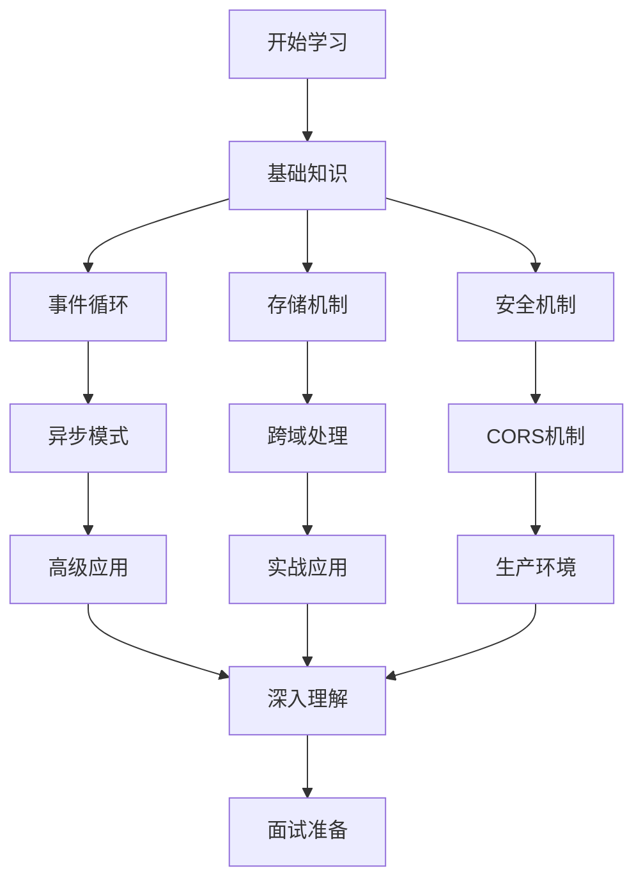

# 浏览器原理

<cite>
**本文档引用的文件**
- [README.md](file://README.md)
- [package.json](file://package.json)
- [docs/browser/event-loop.md](file://docs/browser/event-loop.md)
- [docs/browser/storage-cors.md](file://docs/browser/storage-cors.md)
- [docs/intro.md](file://docs/intro.md)
- [docs/javascript/index.md](file://docs/javascript/index.md)
- [docs/react/index.md](file://docs/react/index.md)
- [docs/vue/index.md](file://docs/vue/index.md)
</cite>

## 目录
1. [简介](#简介)
2. [项目概述](#项目概述)
3. [浏览器原理核心内容](#浏览器原理核心内容)
4. [事件循环机制详解](#事件循环机制详解)
5. [浏览器存储与跨域安全](#浏览器存储与跨域安全)
6. [与其他技术栈的关系](#与其他技术栈的关系)
7. [学习路径建议](#学习路径建议)
8. [总结](#总结)

## 简介

浏览器原理是前端开发的基础核心知识，涵盖了JavaScript引擎、Web API、事件循环、存储机制、跨域安全等多个重要概念。本知识库专门整理了浏览器原理相关的深度文档，帮助开发者建立扎实的前端理论基础。

## 项目概述

这是一个基于Docusaurus 3构建的前端面试知识库项目，专注于提供系统化的前端开发知识体系。项目采用现代化的技术栈，包括React 19、TypeScript、Prism代码高亮等，为用户提供优秀的阅读体验。

### 项目特色

- **200+精选面试题**：涵盖JavaScript、TypeScript、React、Vue、AI应用开发、工程化、性能优化等核心领域
- **45+深度文档**：从基础概念到源码解析，层层递进的学习体系
- **在线测验系统**：随机出题、即时反馈、错题回顾、分数统计
- **难度分级标注**：🟢 Easy / 🟡 Medium / 🔴 Hard三级标注，便于个性化学习
- **响应式设计**：完美适配手机、平板、桌面端设备

### 技术架构



**图表来源**
- [package.json:17-34](file://package.json#L17-L34)
- [README.md:50-56](file://README.md#L50-L56)

**章节来源**
- [README.md:1-106](file://README.md#L1-L106)
- [package.json:1-51](file://package.json#L1-L51)

## 浏览器原理核心内容

浏览器原理涉及多个相互关联的概念，构成了现代Web开发的理论基础。以下是核心知识点的概览：

### 核心概念关系图

```mermaid
mindmap
root((浏览器原理))
JavaScript引擎
调用栈
内存管理
事件循环
Web API
DOM操作
网络请求
定时器
存储API
浏览器内核
渲染引擎
JavaScript引擎
网络层
存储层
安全机制
同源策略
CORS
安全头
```

### 学习内容分布

项目中的浏览器原理相关内容主要集中在以下两个核心文档中：

1. **事件循环机制** - 深入解析JavaScript异步编程的核心原理
2. **存储与跨域安全** - 详细说明浏览器存储方案和跨域处理策略

**章节来源**
- [docs/browser/event-loop.md:11-16](file://docs/browser/event-loop.md#L11-L16)
- [docs/browser/storage-cors.md:12-16](file://docs/browser/storage-cors.md#L12-L16)

## 事件循环机制详解

事件循环是JavaScript异步编程的基石，理解它对于预测代码执行顺序至关重要。本节将深入解析事件循环的工作原理和应用场景。

### 事件循环核心组件



**图表来源**
- [docs/browser/event-loop.md:86-110](file://docs/browser/event-loop.md#L86-L110)

### 事件循环执行步骤

事件循环的每一轮执行都遵循特定的步骤序列：

1. **执行宏任务**：从宏任务队列中取出一个任务执行
2. **清空微任务**：执行该宏任务中产生的所有微任务
3. **检查渲染**：根据需要执行requestAnimationFrame和浏览器渲染
4. **循环往复**：回到步骤1继续下一轮

### 微任务优先级

微任务的执行遵循特定的优先级顺序：

```mermaid
graph LR
Priority[微任务优先级] --> First[queueMicrotask() 最高优先级]
Priority --> Second[Promise.then/catch]
Priority --> Third[MutationObserver]
Priority --> Fourth[async/await 本质是Promise]
```

**图表来源**
- [docs/browser/event-loop.md:112-127](file://docs/browser/event-loop.md#L112-L127)

### 经典执行顺序分析

#### 基础题分析
```javascript
console.log('1');

setTimeout(() => {
  console.log('2');
}, 0);

Promise.resolve().then(() => {
  console.log('3');
});

console.log('4');

// 输出顺序：1 → 4 → 3 → 2
```

#### 进阶题分析
```javascript
async function async1() {
  console.log('async1 start');
  await async2();
  console.log('async1 end');
}

async function async2() {
  console.log('async2');
}

console.log('script start');

setTimeout(() => {
  console.log('setTimeout');
}, 0);

async1();

new Promise((resolve) => {
  console.log('promise1');
  resolve();
}).then(() => {
  console.log('promise2');
});

console.log('script end');

// 输出顺序：script start → async1 start → async2 → promise1 → script end → async1 end → promise2 → setTimeout
```

**章节来源**
- [docs/browser/event-loop.md:129-218](file://docs/browser/event-loop.md#L129-L218)

### Node.js事件循环对比

虽然浏览器和Node.js都使用事件循环，但它们在实现细节上存在显著差异：



**图表来源**
- [docs/browser/event-loop.md:242-292](file://docs/browser/event-loop.md#L242-L292)

**章节来源**
- [docs/browser/event-loop.md:242-376](file://docs/browser/event-loop.md#L242-L376)

## 浏览器存储与跨域安全

浏览器存储和跨域是前端开发中最常遇到的两个基础问题。正确的存储方案选择和跨域处理策略直接影响应用的安全性和性能。

### 存储方案对比



**图表来源**
- [docs/browser/storage-cors.md:20-35](file://docs/browser/storage-cors.md#L20-L35)

### Cookie安全属性详解

Cookie的安全性通过多个属性进行控制：

| 属性 | 说明 | 安全影响 |
|------|------|----------|
| HttpOnly | 禁止JavaScript访问，防止XSS攻击 | 高 |
| Secure | 仅通过HTTPS传输 | 高 |
| SameSite | 控制跨站请求中的Cookie发送 | 中 |
| Domain | 指定Cookie可用的域名范围 | 中 |
| Path | 指定Cookie可用的路径范围 | 中 |
| Expires/Max-Age | 控制Cookie的过期时间 | 低 |

### 同源策略详解

同源策略是浏览器安全的基石，它规定了不同源之间的访问限制：



**图表来源**
- [docs/browser/storage-cors.md:166-198](file://docs/browser/storage-cors.md#L166-L198)

### CORS跨域处理机制

CORS（跨域资源共享）提供了受控的跨域访问机制：



**图表来源**
- [docs/browser/storage-cors.md:220-289](file://docs/browser/storage-cors.md#L220-L289)

### 跨域解决方案对比

| 方案 | 适用场景 | 优点 | 缺点 | 安全性 |
|------|----------|------|------|--------|
| CORS | 服务器可控的跨域 | 标准规范，功能完整 | 需要服务器配置 | 高 |
| 代理 | 开发环境或内网 | 简单易用 | 生产环境复杂 | 中 |
| JSONP | 仅GET请求 | 兼容性好 | 安全风险高 | 低 |
| postMessage | iframe通信 | 安全可靠 | 仅限窗口通信 | 高 |
| WebSocket | 实时通信 | 全双工通信 | 配置复杂 | 中 |

**章节来源**
- [docs/browser/storage-cors.md:18-480](file://docs/browser/storage-cors.md#L18-L480)

## 与其他技术栈的关系

浏览器原理作为前端开发的基础，与各个技术栈都有密切的联系。理解这些关系有助于建立完整的知识体系。

### 与JavaScript的关系



**图表来源**
- [docs/javascript/index.md:13-26](file://docs/javascript/index.md#L13-L26)

### 与React的关系

React作为前端框架，深度依赖浏览器的事件循环机制：



**图表来源**
- [docs/react/index.md:23-34](file://docs/react/index.md#L23-L34)

### 与Vue的关系

Vue的响应式系统同样依赖于浏览器的事件循环：



**图表来源**
- [docs/vue/index.md:29-43](file://docs/vue/index.md#L29-L43)

**章节来源**
- [docs/javascript/index.md:1-39](file://docs/javascript/index.md#L1-L39)
- [docs/react/index.md:1-39](file://docs/react/index.md#L1-L39)
- [docs/vue/index.md:1-48](file://docs/vue/index.md#L1-L48)

## 学习路径建议

基于浏览器原理的重要性和复杂性，建议采用渐进式的学习方法：

### 学习路径规划



### 难度递进建议

1. **基础阶段（🟢 Easy）**：理解基本概念和简单应用
2. **进阶阶段（🟡 Medium）**：掌握复杂场景和最佳实践  
3. **高级阶段（🔴 Hard）**：深入源码理解和性能优化

### 实践建议

- **动手实验**：通过代码示例验证理论知识
- **性能测试**：使用浏览器开发者工具分析性能
- **源码阅读**：研究主流框架的实现原理
- **问题解决**：结合实际项目中的问题加深理解

## 总结

浏览器原理是前端开发的理论基础，涵盖了JavaScript引擎、Web API、事件循环、存储机制、跨域安全等多个重要概念。通过系统化的学习和实践，开发者可以：

1. **建立扎实的理论基础**：深入理解JavaScript异步编程的本质
2. **提高问题解决能力**：能够准确预测代码执行顺序和调试异步问题
3. **增强安全意识**：正确处理跨域和存储安全问题
4. **提升性能优化水平**：基于事件循环原理进行性能优化
5. **为高级框架学习奠定基础**：理解React、Vue等框架的底层原理

本知识库提供了系统化的学习材料和实践指导，建议按照学习路径逐步深入，结合实际项目经验，最终达到对浏览器原理的全面掌握。