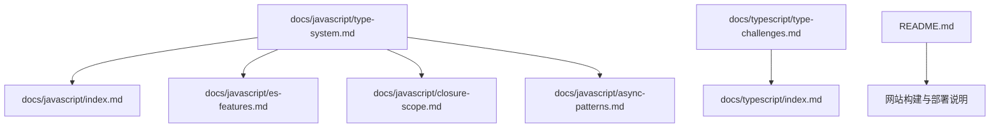
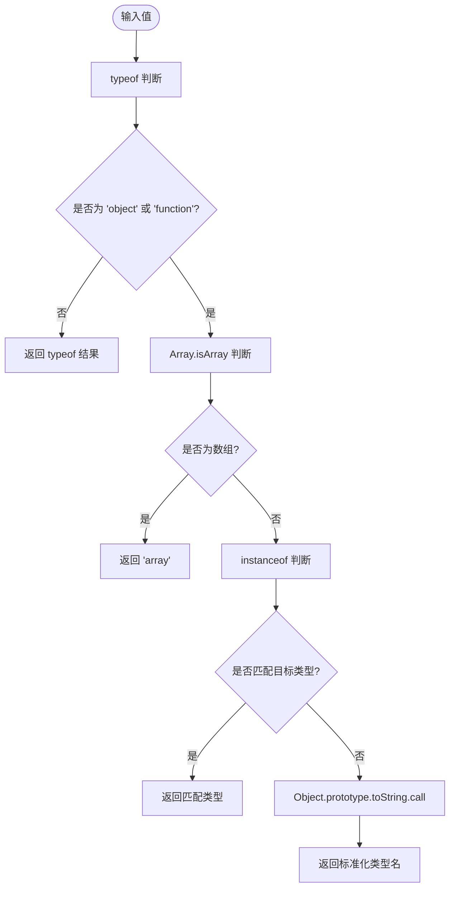
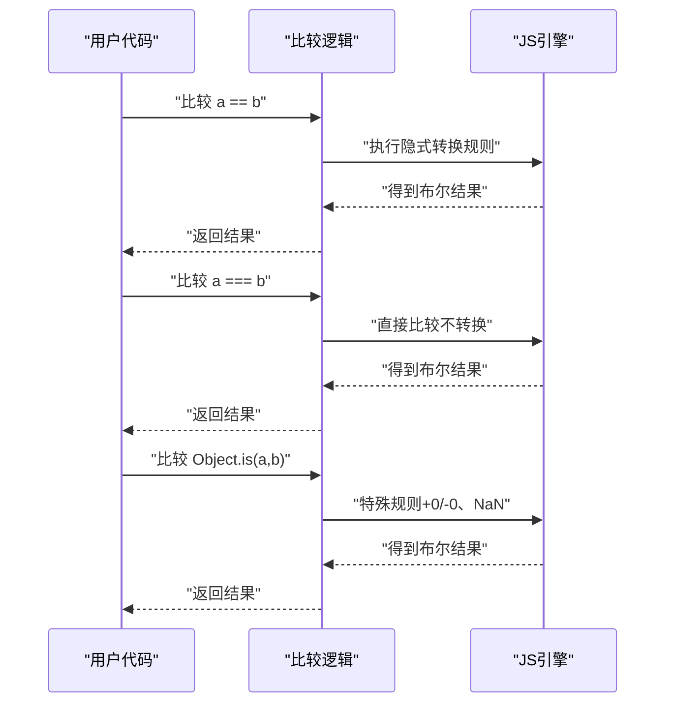
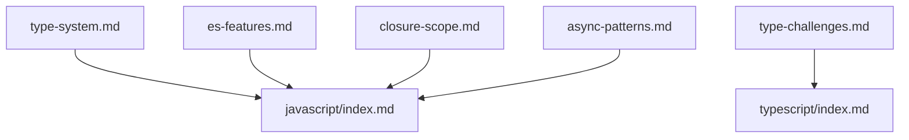

# 类型系统

<cite>
**本文引用的文件**
- [docs/javascript/type-system.md](file://docs/javascript/type-system.md)
- [docs/javascript/index.md](file://docs/javascript/index.md)
- [docs/javascript/es-features.md](file://docs/javascript/es-features.md)
- [docs/javascript/closure-scope.md](file://docs/javascript/closure-scope.md)
- [docs/javascript/async-patterns.md](file://docs/javascript/async-patterns.md)
- [docs/typescript/type-challenges.md](file://docs/typescript/type-challenges.md)
- [README.md](file://README.md)
</cite>

## 目录
1. [引言](#引言)
2. [项目结构](#项目结构)
3. [核心组件](#核心组件)
4. [架构总览](#架构总览)
5. [详细组件分析](#详细组件分析)
6. [依赖分析](#依赖分析)
7. [性能考虑](#性能考虑)
8. [故障排查指南](#故障排查指南)
9. [结论](#结论)
10. [附录](#附录)

## 引言
本篇文档围绕 JavaScript 类型系统与类型判断展开，系统梳理原始类型与引用类型的分类、类型判断方法（typeof、instanceof、Array.isArray、Object.prototype.toString）、相等性判断（==、===、Object.is）以及常见陷阱与最佳实践，并结合前端面试高频问题进行深入分析。同时补充 ES6+ 特性对类型行为的影响，以及与 TypeScript 类型体操的对比视角，帮助读者建立从运行时到编译期的完整类型认知。

## 项目结构
该仓库以 Docusaurus 构建的文档站点为主，JavaScript 类型相关内容集中在 docs/javascript 目录下，TypeScript 类型挑战位于 docs/typescript 目录。整体结构清晰，便于按主题检索与学习。

图表来源
- [docs/javascript/type-system.md:1-68](file://docs/javascript/type-system.md#L1-L68)
- [docs/javascript/index.md:1-16](file://docs/javascript/index.md#L1-L16)
- [docs/javascript/es-features.md:1-98](file://docs/javascript/es-features.md#L1-L98)
- [docs/javascript/closure-scope.md:1-88](file://docs/javascript/closure-scope.md#L1-L88)
- [docs/javascript/async-patterns.md:1-106](file://docs/javascript/async-patterns.md#L1-L106)
- [docs/typescript/type-challenges.md:1-98](file://docs/typescript/type-challenges.md#L1-L98)
- [README.md:1-42](file://README.md#L1-L42)

章节来源
- [docs/javascript/type-system.md:1-68](file://docs/javascript/type-system.md#L1-L68)
- [docs/javascript/index.md:1-16](file://docs/javascript/index.md#L1-L16)
- [README.md:1-42](file://README.md#L1-L42)

## 核心组件
- 原始类型与引用类型：明确区分 string、number、bigint、boolean、undefined、symbol、null 与 Object（含 Array、Function、Date、RegExp 等）。
- 类型判断方法：typeof、instanceof、Array.isArray、Object.prototype.toString。
- 相等性判断：==（隐式转换）、===（严格相等）、Object.is（区分 +0/-0 与 NaN）。
- ES6+ 影响：可选链、空值合并、箭头函数、Map/Object 差异等对类型行为与开发实践的影响。
- TypeScript 视角：类型体操（模板字符串类型、条件类型、递归）对“类型系统”的延伸理解。

章节来源
- [docs/javascript/type-system.md:10-68](file://docs/javascript/type-system.md#L10-L68)
- [docs/javascript/es-features.md:39-98](file://docs/javascript/es-features.md#L39-L98)
- [docs/typescript/type-challenges.md:10-98](file://docs/typescript/type-challenges.md#L10-L98)

## 架构总览
从“类型系统”到“类型判断”的知识路径如下：
- 基础类型与引用类型作为“数据模型”
- 类型判断方法作为“探测器”，用于在运行时确认数据形态
- 相等性判断作为“比较器”，决定语义等价与性能差异
- ES6+ 语法增强影响类型使用边界与安全边界
- TypeScript 类型体操提供“编译期类型推导”的能力边界

（此图为概念性架构示意，不直接映射具体源码文件）

## 详细组件分析

### 原始类型与引用类型
- 原始类型（Primitive）：string、number、bigint、boolean、undefined、symbol、null。这些类型不可变，赋值传递的是值拷贝。
- 引用类型（Reference）：Object 及其派生（Array、Function、Date、RegExp 等）。引用类型可变，赋值传递的是引用地址。

建议与注意
- null 的 typeof 为 "object" 是历史遗留问题，应避免仅依赖 typeof 判断 null。
- 数组属于 Object 的一种，应使用 Array.isArray 或 Object.prototype.toString 区分。

章节来源
- [docs/javascript/type-system.md:10-14](file://docs/javascript/type-system.md#L10-L14)
- [docs/javascript/type-system.md:64-66](file://docs/javascript/type-system.md#L64-L66)

### 类型判断方法：typeof、instanceof、Array.isArray、Object.prototype.toString
- typeof：返回字符串，如 "string"、"number"、"boolean"、"undefined"、"function"、"object"、"bigint"、"symbol"。注意 typeof null 为 "object"。
- instanceof：基于原型链判断实例关系，适用于对象与构造函数；对跨 iframe 的对象判断可能失效。
- Array.isArray：专门判断数组，不受 iframe 影响，优于 typeof []。
- Object.prototype.toString.call(value)：返回形如 "[object Xxx]" 的字符串，再提取类型名，可覆盖所有内置类型（null、array、date、regexp 等）。

图表来源
- [docs/javascript/type-system.md:16-39](file://docs/javascript/type-system.md#L16-L39)

章节来源
- [docs/javascript/type-system.md:16-39](file://docs/javascript/type-system.md#L16-L39)

### 相等性判断：==、===、Object.is
- ==：存在隐式类型转换，规则复杂且易出错，不推荐在严格场景使用。
- ===：严格相等，不进行类型转换，是最安全的比较方式之一。
- Object.is：与 === 基本一致，但能区分 +0 与 -0、NaN 与 NaN 的特殊情况。

图表来源
- [docs/javascript/type-system.md:41-60](file://docs/javascript/type-system.md#L41-L60)

章节来源
- [docs/javascript/type-system.md:41-60](file://docs/javascript/type-system.md#L41-L60)

### ES6+ 对类型系统的影响
- 可选链与空值合并：减少对 undefined/null 的显式判断，提升可读性与健壮性。
- 箭头函数：this 绑定不同，影响某些 API 的调用方式与类型期望。
- Map 与 Object：键类型、迭代顺序、大小属性等差异，影响数据结构选择与类型处理策略。
- 展开/剩余运算符：在数组与对象上的使用，可能改变类型推断与运行时行为。

章节来源
- [docs/javascript/es-features.md:26-98](file://docs/javascript/es-features.md#L26-L98)

### TypeScript 类型体操与运行时类型的关系
- TypeScript 在编译期进行类型检查与推导，支持模板字符串类型、条件类型、递归等高级技巧。
- 运行时仍需遵循 JavaScript 的 typeof、instanceof 等规则，二者互补：编译期约束 + 运行时校验。

章节来源
- [docs/typescript/type-challenges.md:10-98](file://docs/typescript/type-challenges.md#L10-L98)

## 依赖分析
- 文档模块间依赖关系
  - type-system.md 作为核心入口，被 js 基础索引导航引用。
  - es-features.md、closure-scope.md、async-patterns.md 与 type-system.md 并列，共同构成“JavaScript 基础”主题。
  - type-challenges.md 与 ts 基础索引并列，形成“TypeScript”主题。
- 依赖耦合
  - 各模块相对独立，通过导航卡片聚合展示，便于按需学习。
  - type-system.md 与 es-features.md 在“类型与结构”上存在交叉引用关系（如数组、对象、可选链等）。

图表来源
- [docs/javascript/type-system.md:1-68](file://docs/javascript/type-system.md#L1-L68)
- [docs/javascript/index.md:1-16](file://docs/javascript/index.md#L1-L16)
- [docs/javascript/es-features.md:1-98](file://docs/javascript/es-features.md#L1-L98)
- [docs/javascript/closure-scope.md:1-88](file://docs/javascript/closure-scope.md#L1-L88)
- [docs/javascript/async-patterns.md:1-106](file://docs/javascript/async-patterns.md#L1-L106)
- [docs/typescript/type-challenges.md:1-98](file://docs/typescript/type-challenges.md#L1-L98)

章节来源
- [docs/javascript/index.md:1-16](file://docs/javascript/index.md#L1-L16)
- [docs/typescript/index.md:1-16](file://docs/typescript/index.md#L1-L16)

## 性能考虑
- 类型判断的性能
  - typeof 通常最快，适合快速分支。
  - Array.isArray 与 instanceof 在大型对象树上较稳定，instanceof 跨 iframe 时可能失效。
  - Object.prototype.toString.call 具有统一性，但涉及字符串处理与正则切片，性能略低。
- 相等性判断的性能
  - === 无转换成本，推荐优先使用。
  - == 存在隐式转换，可能引入额外开销与不确定性。
  - Object.is 在极少数情况下（+0/-0、NaN）有额外判断，但整体收益大于风险。
- ES6+ 语法
  - 可选链与空值合并减少重复判断，提升可读性与维护性，对性能影响可忽略。

（本节为通用指导，不直接分析具体源码文件）

## 故障排查指南
- typeof null 返回 "object"
  - 现象：typeof null 为 "object"。
  - 排查：不要仅依赖 typeof 判断 null，应显式比较 value === null。
  - 参考路径：[docs/javascript/type-system.md:18-25](file://docs/javascript/type-system.md#L18-L25)
- 数组误判为普通对象
  - 现象：typeof [] 为 "object"。
  - 排查：使用 Array.isArray 或 Object.prototype.toString.call 区分。
  - 参考路径：[docs/javascript/type-system.md:18-25](file://docs/javascript/type-system.md#L18-L25)
- 隐式转换导致的错误
  - 现象：0 == ''、false == '0' 等看似不合理的结果。
  - 排查：统一使用 ===，必要时显式转换（如 Number、String、Boolean）。
  - 参考路径：[docs/javascript/type-system.md:41-53](file://docs/javascript/type-system.md#L41-L53)
- +0 与 -0、NaN 的特殊性
  - 现象：+0 === -0 为 true，NaN === NaN 为 false。
  - 排查：使用 Object.is 区分 +0/-0 与 NaN。
  - 参考路径：[docs/javascript/type-system.md:55-60](file://docs/javascript/type-system.md#L55-L60)
- 跨 iframe 的 instanceof 失效
  - 现象：iframe 内外的对象 instanceof 失效。
  - 排查：改用 Array.isArray 或 Object.prototype.toString.call。
  - 参考路径：[docs/javascript/type-system.md:23-25](file://docs/javascript/type-system.md#L23-L25)

章节来源
- [docs/javascript/type-system.md:18-60](file://docs/javascript/type-system.md#L18-L60)

## 结论
JavaScript 类型系统以原始类型与引用类型为基础，配合多种类型判断与相等性判断方法，构成了运行时行为的关键。在工程实践中，应优先使用 ===、Array.isArray、Object.prototype.toString.call 等更可靠的方法；同时借助 ES6+ 的可选链、空值合并等语法提升安全性与可读性；在 TypeScript 场景下，利用类型体操强化编译期约束。综合运用这些手段，可以在保证正确性的同时提升开发效率与代码质量。

（本节为总结性内容，不直接分析具体源码文件）

## 附录
- 开发与部署参考
  - 本地开发、构建与部署命令可参考根目录 README。
  - 参考路径：[README.md:5-42](file://README.md#L5-L42)

章节来源
- [README.md:5-42](file://README.md#L5-L42)