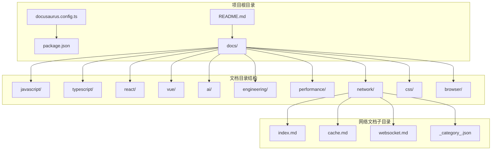
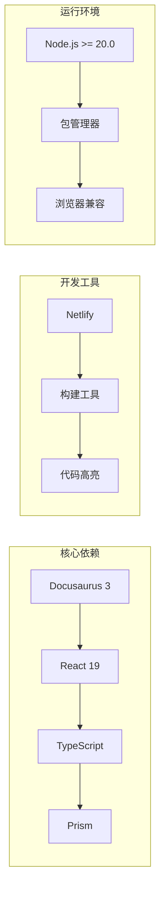
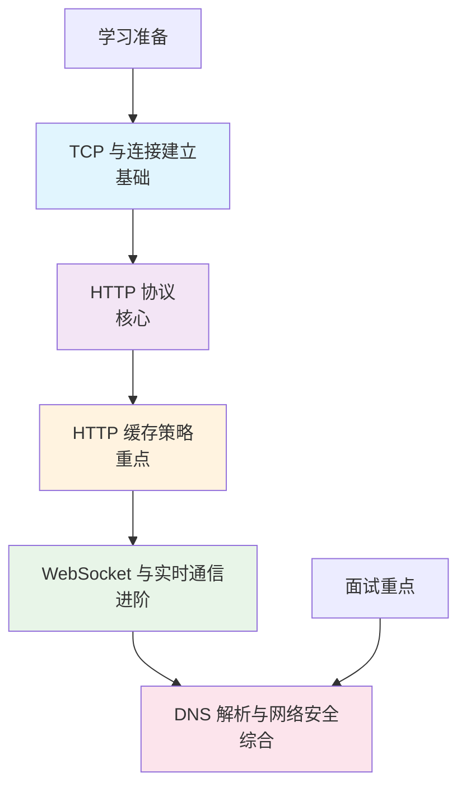
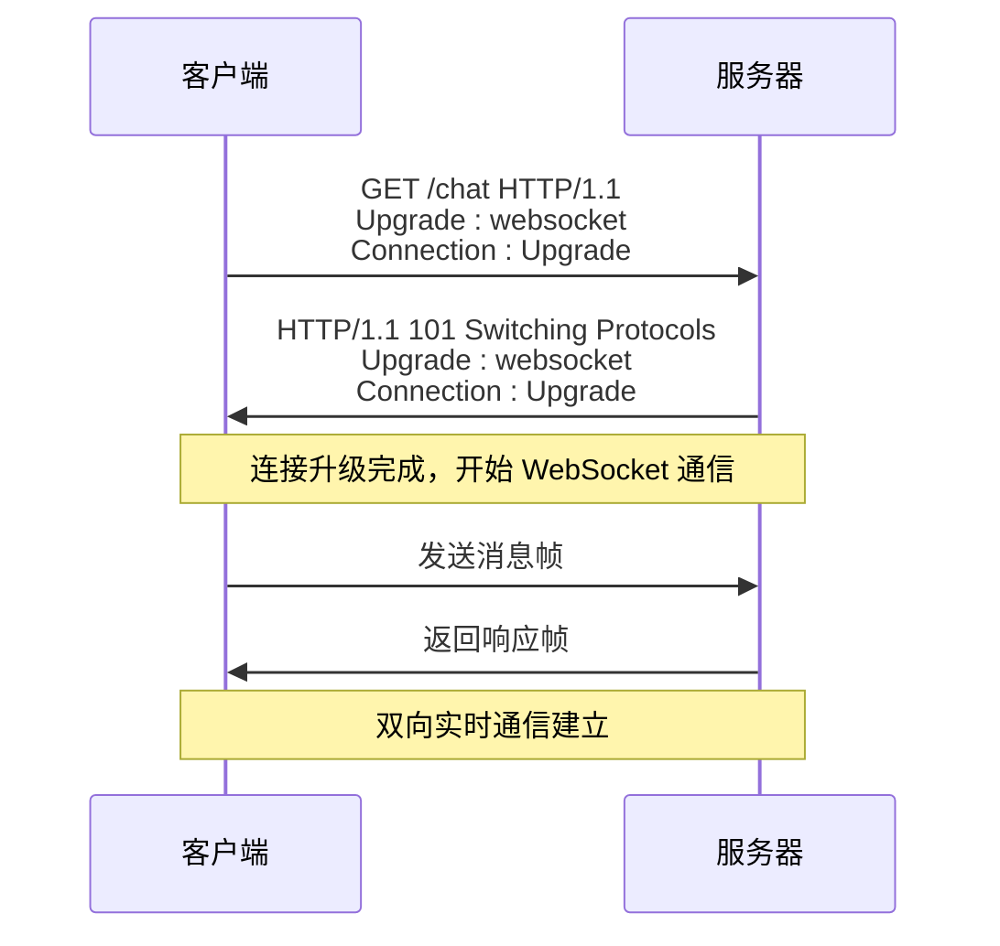
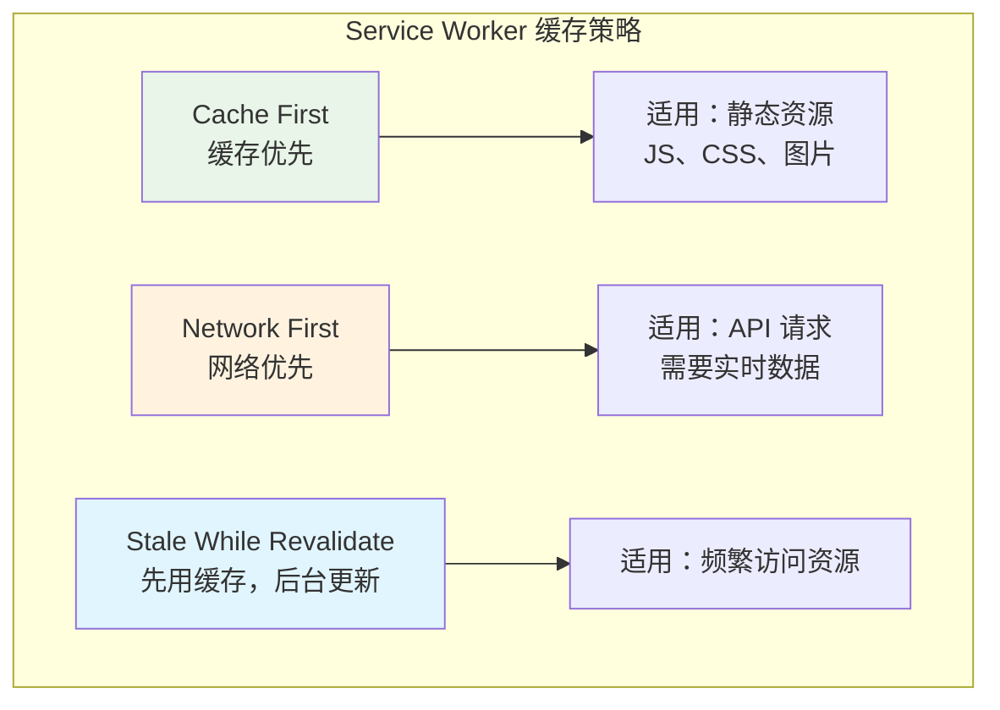

# 计算机网络

<cite>
**本文档引用的文件**
- [README.md](file://README.md)
- [docs/network/index.md](file://docs/network/index.md)
- [docs/network/cache.md](file://docs/network/cache.md)
- [docs/network/websocket.md](file://docs/network/websocket.md)
- [docs/network/_category_.json](file://docs/network/_category_.json)
- [package.json](file://package.json)
- [docusaurus.config.ts](file://docusaurus.config.ts)
</cite>

## 目录
1. [简介](#简介)
2. [项目结构](#项目结构)
3. [核心组件](#核心组件)
4. [架构概览](#架构概览)
5. [详细组件分析](#详细组件分析)
6. [依赖分析](#依赖分析)
7. [性能考虑](#性能考虑)
8. [故障排除指南](#故障排除指南)
9. [结论](#结论)

## 简介

这是一个基于 Docusaurus 3 的前端面试知识库项目，专门整理和分享计算机网络相关的面试知识点。该项目提供了系统化的学习路径，涵盖了从基础概念到高级应用的完整知识体系。

该项目的主要特色包括：
- **200+ 精选面试题** - 涵盖 JavaScript、TypeScript、React、Vue、AI 应用开发、工程化、性能优化
- **45+ 深度文档** - 从基础概念到源码解析，层层递进
- **在线测验系统** - 随机出题、即时反馈、错题回顾、分数统计
- **AI 前沿专题** - LLM 集成、RAG、流式响应、AI SDK 等热门方向
- **难度分级** - 🟢 Easy / 🟡 Medium / 🔴 Hard 三级标注
- **响应式设计** - 完美适配手机、平板、桌面端

## 项目结构

该项目采用模块化的文档组织方式，计算机网络相关内容位于 `docs/network/` 目录下，包含以下核心文件：



**图表来源**
- [README.md:58-83](file://README.md#L58-L83)
- [docs/network/index.md:1-40](file://docs/network/index.md#L1-L40)

**章节来源**
- [README.md:58-83](file://README.md#L58-L83)
- [package.json:1-51](file://package.json#L1-L51)

## 核心组件

### 网络文档分类系统

项目中的计算机网络部分采用了清晰的文档分类体系，每个文档都有明确的学习目标和难度等级：

| 文档名称 | 难度等级 | 主要内容 | 学习时长 |
|---------|---------|---------|---------|
| TCP 与连接建立 | 🟡 中等 | 三次握手、四次挥手、TCP 与 UDP、拥塞控制 | 2-3小时 |
| HTTP 协议 | 🟡 中等 | HTTP 版本演进、请求方法、状态码、HTTPS | 2-3小时 |
| HTTP 缓存策略 | 🟡 中等 | 强缓存、协商缓存、Service Worker 缓存 | 3-4小时 |
| WebSocket 与实时通信 | 🟡 中等 | WebSocket、SSE、轮询对比 | 3-4小时 |
| DNS 解析与网络安全 | 🟡 中等 | DNS 解析、XSS/CSRF/点击劫持、安全头 | 2-3小时 |

### 技术栈与依赖

项目基于现代化的前端技术栈构建：



**图表来源**
- [package.json:17-27](file://package.json#L17-L27)
- [README.md:50-56](file://README.md#L50-L56)

**章节来源**
- [package.json:17-27](file://package.json#L17-L27)
- [README.md:50-56](file://README.md#L50-L56)

## 架构概览

### 学习路径设计

项目为计算机网络学习提供了清晰的路径规划，从基础到高级逐步深入：



**图表来源**
- [docs/network/index.md:23-26](file://docs/network/index.md#L23-L26)

### 面试考察重点

项目特别标注了面试中的高频考点：

1. **TCP 三次握手**：深入理解为什么是三次而不是两次或四次
2. **HTTP 版本差异**：HTTP/1.1 vs 2.0 vs 3.0 的核心改进
3. **缓存策略**：强缓存与协商缓存的配合使用
4. **HTTPS 握手**：TLS 握手过程与证书验证
5. **Web 安全**：XSS、CSRF 的原理与防御方案
6. **跨域解决方案**：CORS、代理、JSONP 的适用场景

**章节来源**
- [docs/network/index.md:28-36](file://docs/network/index.md#L28-L36)

## 详细组件分析

### HTTP 缓存策略详解

HTTP 缓存是前端性能优化的核心手段，项目提供了全面的缓存策略指导：

#### 缓存分类与优先级

```mermaid
flowchart TD
A[发起 HTTP 请求] --> B{是否有缓存?}
B --> |否| C[发起网络请求]
B --> |是| D[检查 Cache-Control]
D --> E{no-store?}
E --> |是| C
E --> |否| F{max-age/Expires 未过期?}
F --> |是| G[直接使用缓存<br/>(200 from cache)]
F --> |否| H[发送条件请求<br/>If-None-Match/If-Modified-Since]
H --> I{304 Not Modified?}
I --> |是| G
I --> |否| J[使用新响应<br/>更新缓存]
C --> K[使用新响应<br/>更新缓存]
```

**图表来源**
- [docs/network/cache.md:105-140](file://docs/network/cache.md#L105-L140)

#### 缓存策略实践

项目提供了针对不同类型资源的缓存策略建议：

| 资源类型 | 推荐策略 | 原因 |
|---------|---------|------|
| HTML | `no-cache` | 入口文件需要获取最新的资源引用列表 |
| JS/CSS（带 hash） | `max-age=31536000, immutable` | 文件名变化即内容变化，可永久缓存 |
| 图片 | `max-age=2592000` | 图片更新频率低，30 天缓存 |
| API 响应 | `no-store` 或短 `max-age` | 数据实时性要求高 |
| 字体文件 | `max-age=31536000, immutable` | 字体几乎不变 |

**章节来源**
- [docs/network/cache.md:188-197](file://docs/network/cache.md#L188-L197)

### WebSocket 实时通信架构

WebSocket 提供了全双工的实时通信能力，项目详细分析了其工作机制：

#### WebSocket 握手流程



**图表来源**
- [docs/network/websocket.md:50-75](file://docs/network/websocket.md#L50-L75)

#### 通信方式对比分析

项目提供了多种实时通信方式的详细对比：

| 特性 | HTTP 轮询 | 长轮询 | SSE | WebSocket |
|------|----------|--------|-----|-----------|
| 通信方向 | 单向（客户端拉） | 单向（客户端拉） | 单向（服务器推） | 全双工 |
| 协议 | HTTP | HTTP | HTTP | WebSocket（基于 TCP） |
| 实时性 | 差（取决于轮询间隔） | 较好 | 好 | 最好 |
| 服务器压力 | 大（频繁请求） | 中等 | 小 | 小 |
| 浏览器支持 | 全部 | 全部 | 除 IE 外 | 全部 |
| 自动重连 | 手动实现 | 手动实现 | 内置 | 手动实现 |
| 二进制数据 | 不支持 | 不支持 | 不支持 | 支持 |

**章节来源**
- [docs/network/websocket.md:12-24](file://docs/network/websocket.md#L12-L24)

### Service Worker 缓存策略

项目还深入探讨了 Service Worker 的缓存实现：

#### 三种主要缓存策略



**图表来源**
- [docs/network/cache.md:235-283](file://docs/network/cache.md#L235-L283)

**章节来源**
- [docs/network/cache.md:235-283](file://docs/network/cache.md#L235-L283)

## 依赖分析

### 技术栈依赖关系

项目的技术栈采用了松耦合的设计，各组件之间依赖关系清晰：

```mermaid
graph TD
subgraph "运行时依赖"
A[Docusaurus Core] --> B[React 19]
B --> C[React DOM]
C --> D[Prism React Renderer]
end
subgraph "开发时依赖"
E[TypeScript] --> F[@types/react]
F --> G[@docusaurus/types]
G --> H[@docusaurus/tsconfig]
end
subgraph "构建工具"
I[搜索功能] --> J[@easyops-cn/docusaurus-search-local]
K[MDX 支持] --> L[@mdx-js/react]
end
```

**图表来源**
- [package.json:17-34](file://package.json#L17-L34)

### 环境要求与兼容性

项目对运行环境有明确的要求：

- **Node.js**: >= 20.0（确保使用最新的 ECMAScript 特性和性能优化）
- **包管理器**: npm / yarn / pnpm（支持多种包管理工具）
- **浏览器兼容性**: 现代浏览器完全支持（IE 例外）

**章节来源**
- [README.md:29-32](file://README.md#L29-L32)
- [package.json:35-49](file://package.json#L35-L49)

## 性能考虑

### 缓存优化策略

项目强调了合理的缓存策略对性能的重要性：

1. **分层缓存**：强缓存优先于协商缓存，减少不必要的网络请求
2. **资源分类**：不同类型资源采用不同的缓存策略
3. **长期缓存**：对静态资源使用长期缓存策略
4. **智能失效**：通过内容哈希实现资源的智能失效

### 实时通信性能

对于 WebSocket 和 SSE 等实时通信方式，项目提供了性能优化建议：

1. **连接复用**：避免频繁建立和断开连接
2. **心跳保活**：定期发送心跳包维持连接活跃
3. **指数退避**：断线重连时采用指数退避策略
4. **流量控制**：合理控制消息发送频率

## 故障排除指南

### 常见网络问题诊断

#### 缓存相关问题

1. **缓存未生效**
   - 检查 Cache-Control 头部设置
   - 验证浏览器缓存策略
   - 确认服务器响应头配置

2. **缓存更新延迟**
   - 使用内容哈希实现智能失效
   - 配置合理的缓存过期时间
   - 实施缓存预热策略

#### WebSocket 连接问题

1. **连接失败**
   - 检查服务器 WebSocket 服务状态
   - 验证防火墙和代理配置
   - 确认 SSL/TLS 证书有效性

2. **连接中断**
   - 实现心跳保活机制
   - 配置断线重连策略
   - 监控网络质量变化

**章节来源**
- [docs/network/websocket.md:148-240](file://docs/network/websocket.md#L148-L240)
- [docs/network/cache.md:284-313](file://docs/network/cache.md#L284-L313)

## 结论

这个计算机网络知识库项目为前端开发者提供了一个系统化、实用性强的学习资源。通过精心设计的文档结构、丰富的实例代码和深入的理论分析，帮助开发者掌握计算机网络的核心概念和实践技能。

项目的特色在于：
- **实用性导向**：所有内容都围绕面试和实际工作需求
- **循序渐进**：从基础概念到高级应用的完整学习路径
- **技术前沿**：涵盖最新的网络技术和最佳实践
- **易于维护**：基于 Docusaurus 的现代化文档系统

无论是准备前端面试还是提升网络编程技能，这个项目都是一个宝贵的参考资料。