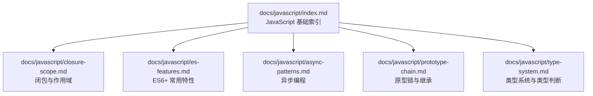
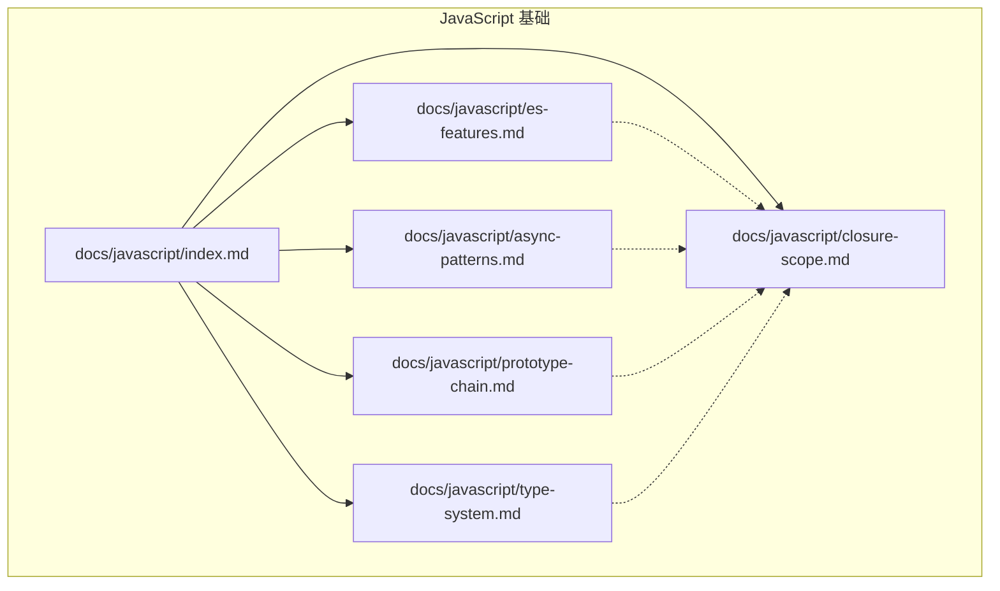
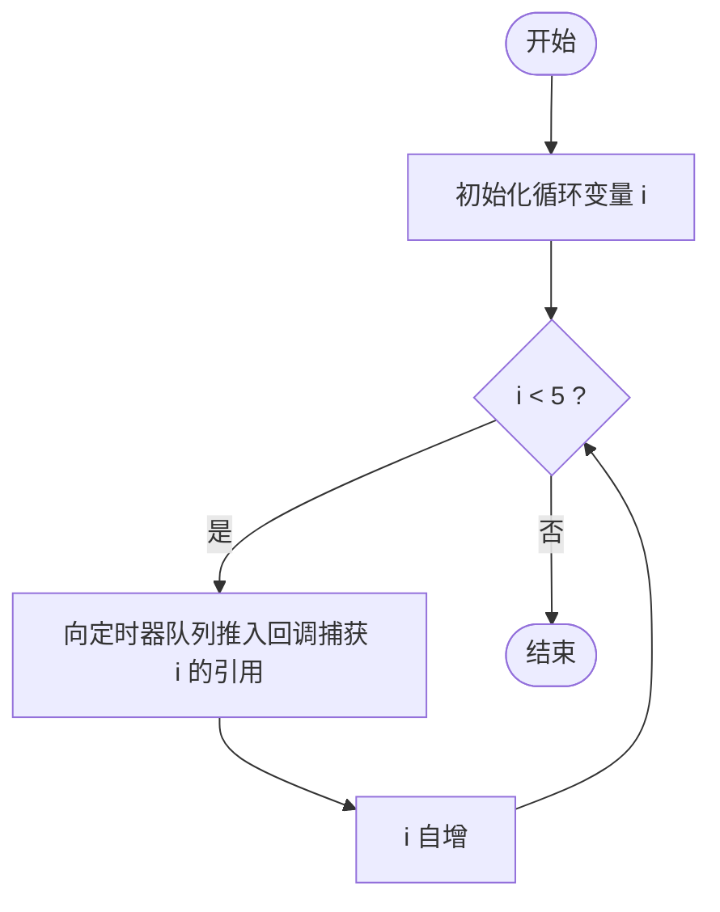
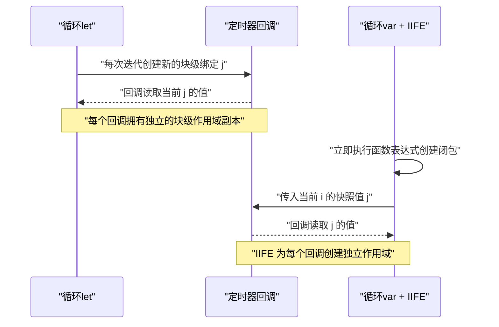
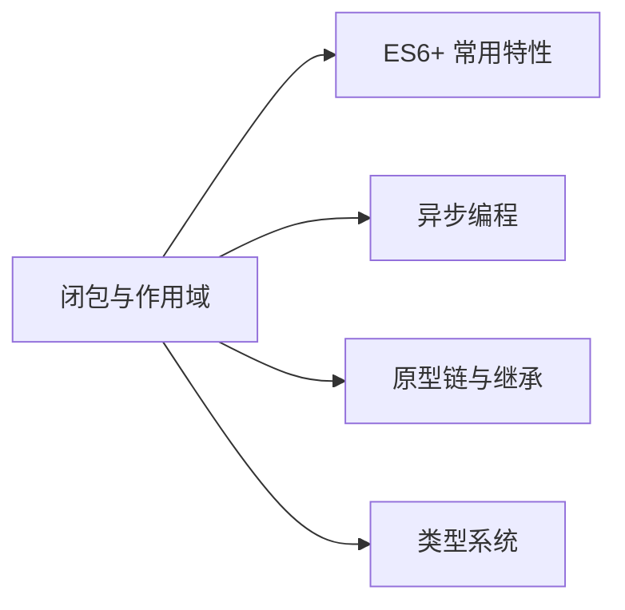

# 闭包和作用域

<cite>
**本文引用的文件**
- [docs/javascript/closure-scope.md](file://docs/javascript/closure-scope.md)
- [docs/javascript/index.md](file://docs/javascript/index.md)
- [docs/javascript/es-features.md](file://docs/javascript/es-features.md)
- [docs/javascript/async-patterns.md](file://docs/javascript/async-patterns.md)
- [docs/javascript/prototype-chain.md](file://docs/javascript/prototype-chain.md)
- [docs/javascript/type-system.md](file://docs/javascript/type-system.md)
- [README.md](file://README.md)
</cite>

## 目录
1. [引言](#引言)
2. [项目结构](#项目结构)
3. [核心组件](#核心组件)
4. [架构总览](#架构总览)
5. [详细组件分析](#详细组件分析)
6. [依赖分析](#依赖分析)
7. [性能考虑](#性能考虑)
8. [故障排查指南](#故障排查指南)
9. [结论](#结论)
10. [附录](#附录)

## 引言
本文件围绕 JavaScript 的“闭包与作用域”主题，系统梳理词法作用域与动态作用域的区别、变量提升与不同作用域（函数作用域、块级作用域）的特点与使用场景，深入解析闭包的形成机制、工作原理与典型应用（回调函数、模块模式、事件处理）。同时结合前端面试常见问题，给出可操作的思路与注意事项，并对作用域链查找机制及其性能影响进行说明。为便于读者理解，文档在不直接粘贴代码的前提下，通过“章节来源”标注具体示例所在位置，帮助读者快速定位到仓库中的原始示例与讲解。

## 项目结构
该项目基于 Docusaurus 构建，文档位于 docs/javascript 目录下，围绕 JavaScript 的多个核心主题组织内容，其中“闭包与作用域”作为独立条目与其他专题并列呈现。整体结构清晰，便于按主题检索与学习。

图表来源
- [docs/javascript/index.md:1-16](file://docs/javascript/index.md#L1-L16)
- [docs/javascript/closure-scope.md:1-88](file://docs/javascript/closure-scope.md#L1-L88)
- [docs/javascript/es-features.md:1-98](file://docs/javascript/es-features.md#L1-L98)
- [docs/javascript/async-patterns.md:1-106](file://docs/javascript/async-patterns.md#L1-L106)
- [docs/javascript/prototype-chain.md:1-108](file://docs/javascript/prototype-chain.md#L1-L108)
- [docs/javascript/type-system.md:1-68](file://docs/javascript/type-system.md#L1-L68)

章节来源
- [docs/javascript/index.md:1-16](file://docs/javascript/index.md#L1-L16)

## 核心组件
- 闭包与作用域专题：系统讲解闭包的定义、形成机制、作用域链、常见陷阱与修复方案，并给出循环中闭包的经典面试题与多种修复策略。
- ES6+ 常用特性：涵盖箭头函数与普通函数的差异、this 绑定特点、可选链与空值合并等，为理解闭包与作用域提供语言层面的支撑。
- 异步编程：解释 Promise、async/await 的执行顺序与微任务机制，有助于理解闭包在异步回调中的行为与时机。
- 原型链与继承：从底层机制角度解释对象与函数的关系，辅助理解作用域与 this 的绑定链条。
- 类型系统：明确原始类型与引用类型，为变量提升、作用域与闭包的语义边界提供基础。

章节来源
- [docs/javascript/closure-scope.md:1-88](file://docs/javascript/closure-scope.md#L1-L88)
- [docs/javascript/es-features.md:1-98](file://docs/javascript/es-features.md#L1-L98)
- [docs/javascript/async-patterns.md:1-106](file://docs/javascript/async-patterns.md#L1-L106)
- [docs/javascript/prototype-chain.md:1-108](file://docs/javascript/prototype-chain.md#L1-L108)
- [docs/javascript/type-system.md:1-68](file://docs/javascript/type-system.md#L1-L68)

## 架构总览
以下图示从“主题-示例-机制”的维度，展示“闭包与作用域”在知识体系中的位置与关联：

图表来源
- [docs/javascript/index.md:1-16](file://docs/javascript/index.md#L1-L16)
- [docs/javascript/closure-scope.md:1-88](file://docs/javascript/closure-scope.md#L1-L88)
- [docs/javascript/es-features.md:1-98](file://docs/javascript/es-features.md#L1-L98)
- [docs/javascript/async-patterns.md:1-106](file://docs/javascript/async-patterns.md#L1-L106)
- [docs/javascript/prototype-chain.md:1-108](file://docs/javascript/prototype-chain.md#L1-L108)
- [docs/javascript/type-system.md:1-68](file://docs/javascript/type-system.md#L1-L68)

## 详细组件分析

### 1. 闭包与作用域专题
- 闭包的定义与形成机制：函数对外部作用域变量的引用，使其在外部函数执行完毕后仍可访问。
- 经典面试题：循环中的闭包陷阱（var 与 let 的差异、IIFE 修复方案）。
- 作用域链与词法作用域：在函数定义时确定，而非调用时；外部作用域变量在定义时被捕获。
- 关键要点：闭包持有外部变量引用可能带来内存占用；let/const 的块级作用域能规避多数闭包陷阱；闭包常用于数据私有化、函数工厂、柯里化等。

章节来源
- [docs/javascript/closure-scope.md:10-27](file://docs/javascript/closure-scope.md#L10-L27)
- [docs/javascript/closure-scope.md:29-61](file://docs/javascript/closure-scope.md#L29-L61)
- [docs/javascript/closure-scope.md:63-87](file://docs/javascript/closure-scope.md#L63-L87)

#### 经典面试题：循环中的闭包（流程图）

图表来源
- [docs/javascript/closure-scope.md:33-38](file://docs/javascript/closure-scope.md#L33-L38)

#### 修复方案对比（序列图）

图表来源
- [docs/javascript/closure-scope.md:44-61](file://docs/javascript/closure-scope.md#L44-L61)

### 2. ES6+ 常用特性与作用域
- 箭头函数与 this 绑定：箭头函数不绑定自己的 this，而是继承外层作用域的 this；普通函数的 this 在调用时确定。
- 其他相关特性：解构赋值、展开运算符/剩余参数、Map/Object 差异、可选链与空值合并等，为理解作用域与闭包的实际使用提供语言工具支持。

章节来源
- [docs/javascript/es-features.md:39-58](file://docs/javascript/es-features.md#L39-L58)
- [docs/javascript/es-features.md:92-98](file://docs/javascript/es-features.md#L92-L98)

### 3. 异步编程与闭包
- Promise 与微任务：理解 await 后的代码进入微任务队列，有助于把握闭包在异步回调中的执行时机与副作用。
- 事件循环：宏任务与微任务的调度顺序，影响闭包在异步场景下的可见性与生命周期。

章节来源
- [docs/javascript/async-patterns.md:48-75](file://docs/javascript/async-patterns.md#L48-L75)
- [docs/javascript/async-patterns.md:76-98](file://docs/javascript/async-patterns.md#L76-L98)

### 4. 原型链与继承
- 原型三角关系：constructor、prototype、instance 的相互指向，有助于理解函数与对象在作用域与 this 绑定中的角色。
- instanceof 原理：沿原型链查找，辅助判断对象类型与作用域链上的属性来源。

章节来源
- [docs/javascript/prototype-chain.md:10-34](file://docs/javascript/prototype-chain.md#L10-L34)
- [docs/javascript/prototype-chain.md:89-100](file://docs/javascript/prototype-chain.md#L89-L100)

### 5. 类型系统
- 原始类型与引用类型：明确变量与对象在内存中的存储与传递方式，有助于理解闭包对变量的引用与潜在的内存占用。
- 类型判断工具：Object.prototype.toString 与 Array.isArray 等，为调试闭包与作用域问题提供可靠手段。

章节来源
- [docs/javascript/type-system.md:10-39](file://docs/javascript/type-system.md#L10-L39)
- [docs/javascript/type-system.md:41-68](file://docs/javascript/type-system.md#L41-L68)

## 依赖分析
- 主题内聚：闭包与作用域专题与 ES6+、异步编程、原型链、类型系统存在交叉引用，共同构成对 JavaScript 语言机制的完整认知。
- 示例依赖：各专题均以“章节来源”标注示例位置，便于读者在仓库中快速定位原始示例与讲解。

图表来源
- [docs/javascript/closure-scope.md:1-88](file://docs/javascript/closure-scope.md#L1-L88)
- [docs/javascript/es-features.md:1-98](file://docs/javascript/es-features.md#L1-L98)
- [docs/javascript/async-patterns.md:1-106](file://docs/javascript/async-patterns.md#L1-L106)
- [docs/javascript/prototype-chain.md:1-108](file://docs/javascript/prototype-chain.md#L1-L108)
- [docs/javascript/type-system.md:1-68](file://docs/javascript/type-system.md#L1-L68)

## 性能考虑
- 闭包导致的内存占用：由于闭包持有外部变量的引用，若长期保留或作用域过大，可能造成内存占用增加。应遵循“最小必要原则”，及时释放不再使用的外部变量引用。
- 作用域链查找成本：作用域链越长，变量解析耗时越高。建议：
  - 将频繁访问的变量提升至更靠近的内层作用域；
  - 避免过深的嵌套层级；
  - 使用块级作用域（let/const）减少不必要的全局或外层变量暴露。
- 异步回调中的闭包：在高频异步场景（如事件循环、定时器）中，注意避免闭包持有大对象或长生命周期资源，防止内存泄漏。

## 故障排查指南
- 循环中闭包陷阱
  - 症状：使用 var 声明的循环变量在回调中总是取到最后一次迭代的值。
  - 修复：改用 let（块级作用域）或通过 IIFE 为每次迭代创建独立作用域。
  - 参考示例路径：[docs/javascript/closure-scope.md:29-61](file://docs/javascript/closure-scope.md#L29-L61)
- this 绑定错误
  - 症状：箭头函数内部读取不到期望的 this。
  - 修复：在需要动态 this 的上下文中使用普通函数，或显式绑定 this。
  - 参考示例路径：[docs/javascript/es-features.md:39-58](file://docs/javascript/es-features.md#L39-L58)
- 作用域链误解
  - 症状：函数在定义时的作用域与调用时的 this 不一致。
  - 修复：理解词法作用域与动态作用域的区别，确保变量解析按定义时的外层作用域进行。
  - 参考示例路径：[docs/javascript/closure-scope.md:63-80](file://docs/javascript/closure-scope.md#L63-L80)
- 内存泄漏
  - 症状：页面长时间运行后内存持续增长。
  - 修复：避免闭包持有大对象或 DOM 引用；及时解除监听与清理定时器；使用 WeakMap/WeakSet 存储弱引用。
  - 参考要点路径：[docs/javascript/closure-scope.md:82-87](file://docs/javascript/closure-scope.md#L82-L87)，[docs/javascript/es-features.md:96-98](file://docs/javascript/es-features.md#L96-L98)

## 结论
闭包与作用域是理解 JavaScript 行为的关键。通过掌握词法作用域、块级作用域与 this 绑定的特点，配合 ES6+ 的语言特性与异步模型，可以有效避免常见陷阱并写出更健壮的代码。在工程实践中，应关注作用域链长度与闭包的内存占用，合理使用 let/const、箭头函数与模块模式，以提升可维护性与性能。

## 附录
- 快速参考
  - 闭包 = 函数 + 外部作用域引用
  - 作用域链在函数定义时确定
  - let/const 可避免大多数闭包陷阱
  - 箭头函数不绑定 this，继承外层作用域
  - 异步回调中的闭包需谨慎管理生命周期

章节来源
- [docs/javascript/closure-scope.md:82-87](file://docs/javascript/closure-scope.md#L82-L87)
- [docs/javascript/es-features.md:39-58](file://docs/javascript/es-features.md#L39-L58)
- [docs/javascript/async-patterns.md:48-75](file://docs/javascript/async-patterns.md#L48-L75)