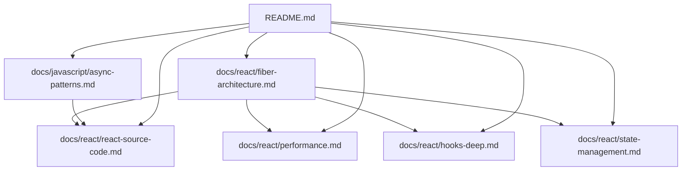
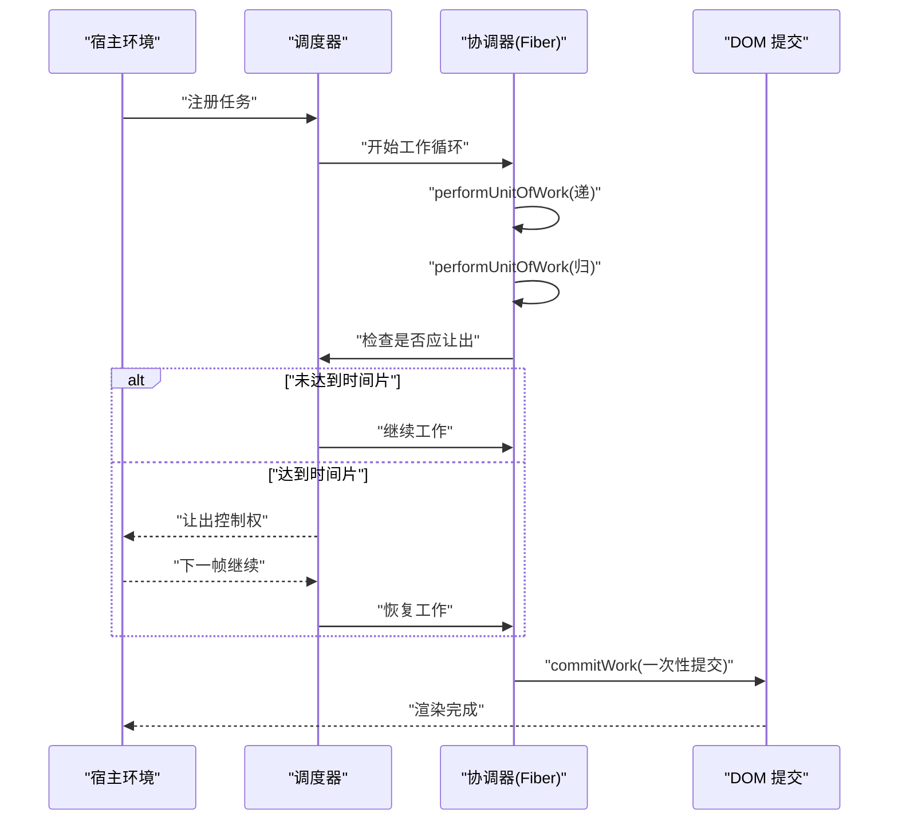
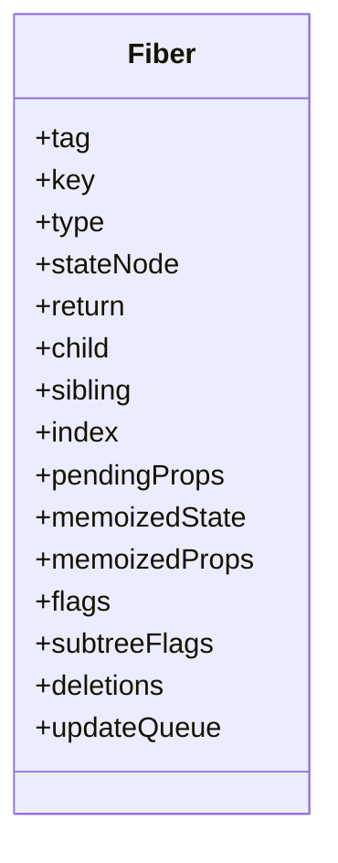
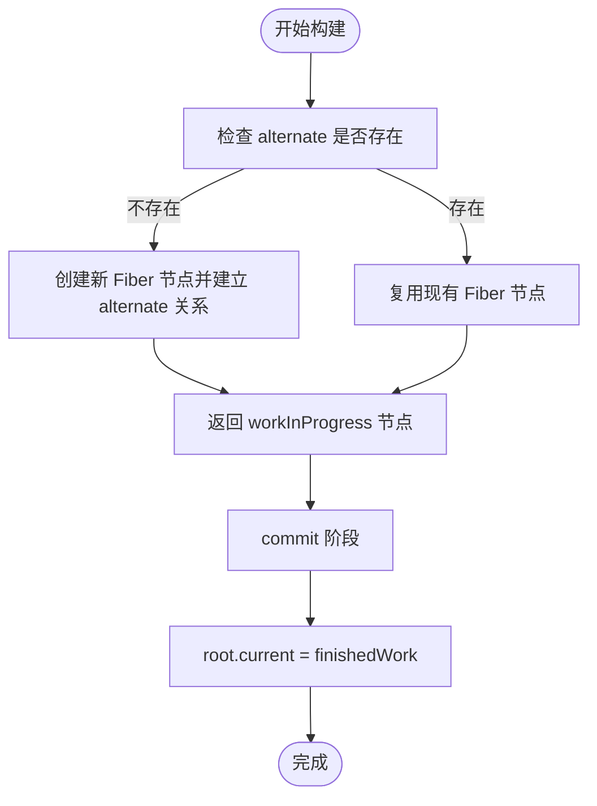
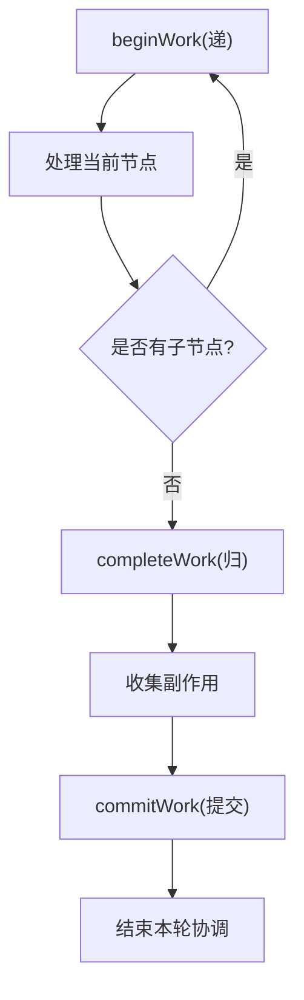
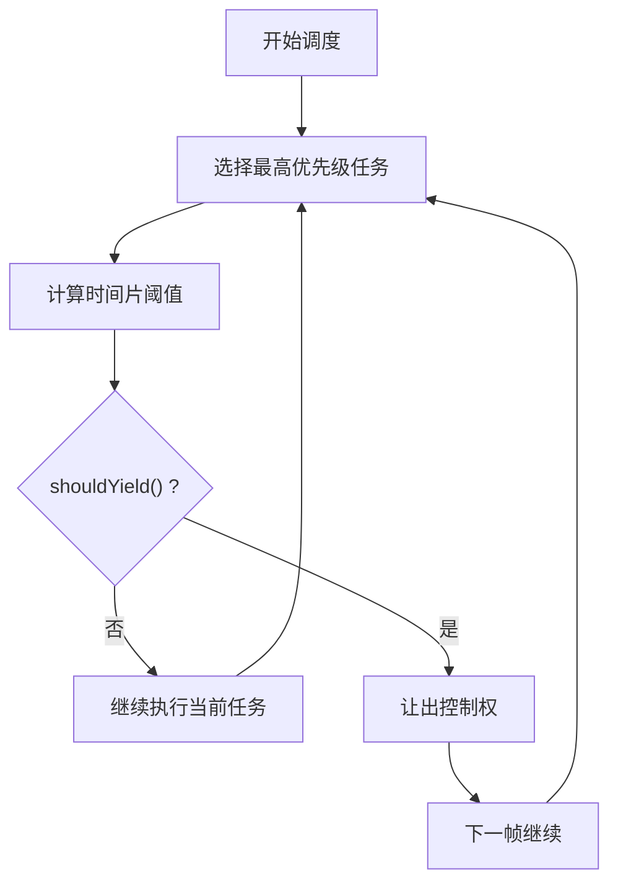
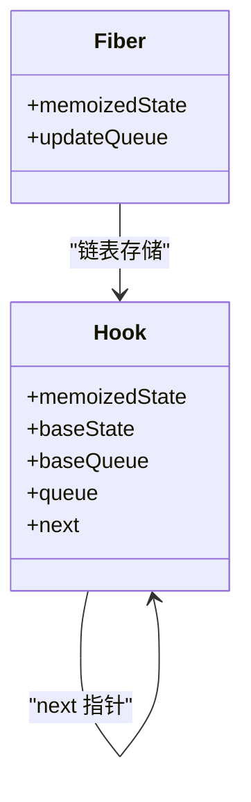
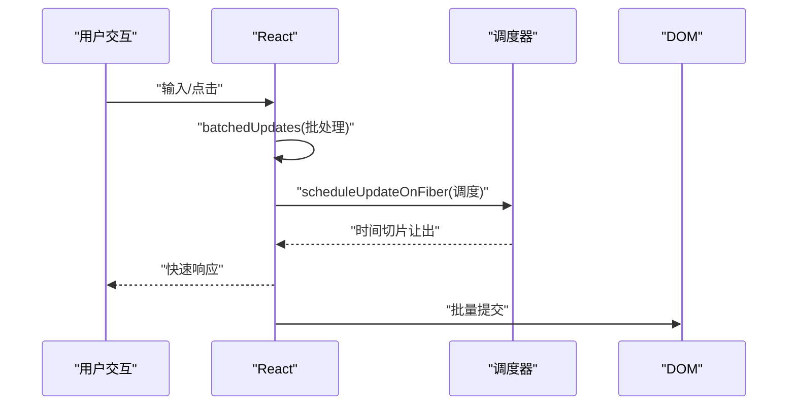
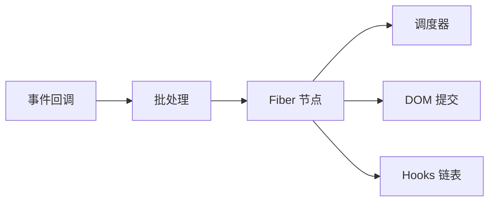

# Fiber 架构原理

<cite>
**本文引用的文件**
- [fiber-architecture.md](file://docs/react/fiber-architecture.md)
- [react-source-code.md](file://docs/react/react-source-code.md)
- [performance.md](file://docs/react/performance.md)
- [hooks-deep.md](file://docs/react/hooks-deep.md)
- [state-management.md](file://docs/react/state-management.md)
- [async-patterns.md](file://docs/javascript/async-patterns.md)
- [README.md](file://README.md)
</cite>

## 目录
1. [引言](#引言)
2. [项目结构](#项目结构)
3. [核心组件](#核心组件)
4. [架构总览](#架构总览)
5. [详细组件分析](#详细组件分析)
6. [依赖分析](#依赖分析)
7. [性能考量](#性能考量)
8. [故障排查指南](#故障排查指南)
9. [结论](#结论)
10. [附录](#附录)

## 引言
本技术文档围绕 React Fiber 架构展开，系统阐述其核心设计理念与实现原理，包括双缓存机制、可中断渲染、优先级调度、工作循环、协调算法、时间切片与并发渲染、批处理等高级特性，并通过与传统 Stack Reconciler 的对比，说明 Fiber 如何带来更流畅的用户体验。文档同时提供面向高级开发者的架构理解与优化建议，帮助读者在实践中更好地运用 Fiber。

## 项目结构
该仓库为文档站点，React 相关内容集中在 docs/react 目录，涵盖 Fiber 架构、源码解析、性能优化、Hooks 深入、状态管理等主题；JavaScript 异步模式相关内容位于 docs/javascript，有助于理解 Fiber 的时间切片与调度基础。

图表来源
- [fiber-architecture.md:1-97](file://docs/react/fiber-architecture.md#L1-L97)
- [react-source-code.md:1-480](file://docs/react/react-source-code.md#L1-L480)
- [performance.md:1-127](file://docs/react/performance.md#L1-L127)
- [hooks-deep.md:1-107](file://docs/react/hooks-deep.md#L1-L107)
- [state-management.md:1-104](file://docs/react/state-management.md#L1-L104)
- [async-patterns.md:1-106](file://docs/javascript/async-patterns.md#L1-L106)
- [README.md:1-42](file://README.md#L1-L42)

章节来源
- [README.md:1-42](file://README.md#L1-L42)

## 核心组件
- Fiber 节点：React 的最小工作单元，承载组件类型、链表父子兄弟关系、状态、副作用标记、更新队列等信息。
- 双缓存树：current 树（屏幕 UI）与 workInProgress 树（正在构建的新 UI），通过 alternate 指针交替，避免阻塞主线程。
- 协调循环：beginWork（递）→ completeWork（归）→ commitWork（提交），在可中断的时间片内逐步推进。
- 优先级与时间切片：基于调度器的优先级模型与时间片让渲染可中断，保证交互优先。
- Hooks 存储：以链表形式存储在 Fiber.memoizedState，支持 useState/useReducer 等 Hook 的按序执行与更新队列。
- 批处理：React 18+ 默认批处理事件回调，减少多次调度与重复渲染。

章节来源
- [fiber-architecture.md:14-58](file://docs/react/fiber-architecture.md#L14-L58)
- [react-source-code.md:69-93](file://docs/react/react-source-code.md#L69-L93)
- [react-source-code.md:108-141](file://docs/react/react-source-code.md#L108-L141)
- [react-source-code.md:146-186](file://docs/react/react-source-code.md#L146-L186)
- [react-source-code.md:190-231](file://docs/react/react-source-code.md#L190-L231)
- [react-source-code.md:359-392](file://docs/react/react-source-code.md#L359-L392)

## 架构总览
Fiber 将一次完整的渲染拆分为多个小任务，利用 requestIdleCallback 的 polyfill 实现时间切片，当主线程被更高优先级任务打断时，Fiber 可以暂停当前工作单元，稍后再恢复，从而避免长时间占用主线程。双缓存树确保 UI 更新在 commit 阶段一次性提交，避免中间态闪烁。

图表来源
- [react-source-code.md:152-186](file://docs/react/react-source-code.md#L152-L186)

## 详细组件分析

### Fiber 节点数据结构与链表关系
- 字段职责：tag/type/stateNode 等标识组件类型与实例；return/child/sibling/index 构成树与链表的双重结构；pendingProps/memoizedState/memoizedProps 表示待处理与已记忆的状态；flags/subtreeFlags/deletions 标记副作用与删除集合；updateQueue 存放更新队列。
- 链表遍历：通过 child/sibling 可以在不使用递归栈的情况下进行深度优先遍历，便于中断与恢复。

图表来源
- [fiber-architecture.md:16-38](file://docs/react/fiber-architecture.md#L16-L38)
- [react-source-code.md:69-93](file://docs/react/react-source-code.md#L69-L93)

章节来源
- [fiber-architecture.md:14-38](file://docs/react/fiber-architecture.md#L14-L38)
- [react-source-code.md:69-93](file://docs/react/react-source-code.md#L69-L93)

### 双缓存机制与树切换
- 两棵 Fiber 树：current 树代表当前屏幕 UI；workInProgress 树在构建过程中逐步生成。
- alternate 指针：每个 Fiber 节点维护 alternate 指针，指向对应的另一个树的节点，首次渲染创建，后续更新复用。
- 切换时机：commit 阶段完成后，root.current 指向 finishedWork，完成 UI 切换。

图表来源
- [react-source-code.md:117-141](file://docs/react/react-source-code.md#L117-L141)

章节来源
- [react-source-code.md:108-141](file://docs/react/react-source-code.md#L108-L141)

### 协调过程与工作循环
- beginWork：自顶向下处理节点，决定是否需要子节点。
- completeWork：自底向上回溯，收集副作用（如插入、更新、删除）。
- commitWork：一次性将副作用应用到真实 DOM，保证一致性。
- 工作循环：workLoopSync（同步一次性完成）与 workLoopConcurrent（时间切片中断）两种模式；performUnitOfWork 作为单个任务单元，按需让出。

图表来源
- [fiber-architecture.md:52-58](file://docs/react/fiber-architecture.md#L52-L58)
- [react-source-code.md:146-186](file://docs/react/react-source-code.md#L146-L186)

章节来源
- [fiber-architecture.md:52-58](file://docs/react/fiber-architecture.md#L52-L58)
- [react-source-code.md:146-186](file://docs/react/react-source-code.md#L146-L186)

### 优先级调度与时间切片
- 优先级模型：Immediate/UserBlocking/Normal/Low/Idle 等优先级，用于区分交互、过渡与空闲任务。
- 时间切片：shouldYield 控制是否让出控制权，默认每 5ms 左右让出一次，保证主线程可响应用户输入。
- Lane 模型：React 18 的 Lane 位掩码模型用于表达任务优先级与并发约束，支持 Transition 与 Idle 等场景。

图表来源
- [react-source-code.md:286-305](file://docs/react/react-source-code.md#L286-L305)
- [fiber-architecture.md:60-69](file://docs/react/fiber-architecture.md#L60-L69)

章节来源
- [react-source-code.md:286-305](file://docs/react/react-source-code.md#L286-L305)
- [fiber-architecture.md:60-69](file://docs/react/fiber-architecture.md#L60-L69)

### Hooks 在 Fiber 中的存储与更新
- Hook 链表：每个 Fiber.memoizedState 指向 Hook 链表头，链表节点包含 memoizedState/baseState/baseQueue/queue/next。
- useState/useReducer：首次渲染初始化状态与 dispatch；重渲染从队列中取出更新，按序执行。
- useEffect/useLayoutEffect：在 commit 阶段不同阶段执行，useLayoutEffect 同步、useEffect 异步，避免阻塞绘制。

图表来源
- [react-source-code.md:196-231](file://docs/react/react-source-code.md#L196-L231)

章节来源
- [react-source-code.md:190-231](file://docs/react/react-source-code.md#L190-L231)

### 并发特性与批处理
- 并发 API：useTransition/useDeferredValue 用于标记低优先级更新，使高优交互（如输入）优先响应。
- 批处理：React 18+ 默认对事件回调进行批处理，减少多次调度与重复渲染；flushSyncCallbacks 在批处理完成后统一刷新。

图表来源
- [fiber-architecture.md:71-89](file://docs/react/fiber-architecture.md#L71-L89)
- [react-source-code.md:359-392](file://docs/react/react-source-code.md#L359-L392)

章节来源
- [fiber-architecture.md:71-89](file://docs/react/fiber-architecture.md#L71-L89)
- [react-source-code.md:359-392](file://docs/react/react-source-code.md#L359-L392)

### 与传统 Stack Reconciler 的对比
- Stack Reconciler：同步递归，大型更新会阻塞主线程，导致卡顿。
- Fiber：可中断的异步渲染，时间切片让渲染与用户交互交替进行，显著提升交互流畅度。
- Fiber 的优势体现在：双缓存树减少中间态、优先级调度与时间切片保证响应性、commit 阶段一次性提交确保一致性。

章节来源
- [fiber-architecture.md:10-12](file://docs/react/fiber-architecture.md#L10-L12)

## 依赖分析
- Fiber 与调度器：Fiber 通过调度器实现时间切片与优先级调度。
- Fiber 与 DOM：协调器在 commit 阶段一次性提交副作用到 DOM，保证一致性。
- Fiber 与 Hooks：Hooks 以链表形式存储在 Fiber 上，按序执行，支持 useState/useReducer 等。
- Fiber 与批处理：事件回调默认批处理，减少调度次数，提高性能。

图表来源
- [react-source-code.md:146-186](file://docs/react/react-source-code.md#L146-L186)
- [react-source-code.md:359-392](file://docs/react/react-source-code.md#L359-L392)

章节来源
- [react-source-code.md:146-186](file://docs/react/react-source-code.md#L146-L186)
- [react-source-code.md:359-392](file://docs/react/react-source-code.md#L359-L392)

## 性能考量
- 使用 React.memo/useMemo/useCallback 减少不必要的重渲染与函数引用变化。
- 大数据列表采用虚拟滚动（如 react-window/react-virtual）降低 DOM 数量。
- 路由级代码分割（lazy/Suspense）减少首屏体积。
- 使用 React DevTools Profiler 分析渲染耗时与次数，定位热点组件。
- 合理使用并发 API（useTransition/useDeferredValue）分离高优与低优更新。

章节来源
- [performance.md:10-127](file://docs/react/performance.md#L10-L127)

## 故障排查指南
- 渲染卡顿：检查是否存在长任务未拆分，是否使用时间切片与优先级调度；确认批处理是否生效。
- 副作用异常：确认 useEffect/useLayoutEffect 的执行时机差异，避免在 useLayoutEffect 中进行昂贵操作。
- 状态错乱：确认 Hooks 按序执行，不要在条件/循环中调用；检查队列更新是否正确入队与出队。
- 性能瓶颈：使用 Profiler 识别渲染耗时组件，结合 memo 与虚拟列表优化。

章节来源
- [hooks-deep.md:30-53](file://docs/react/hooks-deep.md#L30-L53)
- [performance.md:104-127](file://docs/react/performance.md#L104-L127)

## 结论
Fiber 通过双缓存、可中断渲染、优先级调度与时间切片，将 React 的渲染从“一次性同步”转变为“可中断异步”，显著提升了交互流畅度与用户体验。配合批处理、并发 API 与现代性能优化手段，开发者可以在复杂应用中保持稳定的帧率与响应性。对于高级开发者而言，深入理解 Fiber 的工作循环、协调算法与 Hooks 存储机制，是实现高性能 React 应用的关键。

## 附录
- 推荐学习路径：先掌握 Fiber 概念与双缓存，再理解工作循环与优先级，最后结合 Hooks 与性能优化实践。
- 资源参考：React 官方文档、React 源码、React 技术揭秘、Just React。