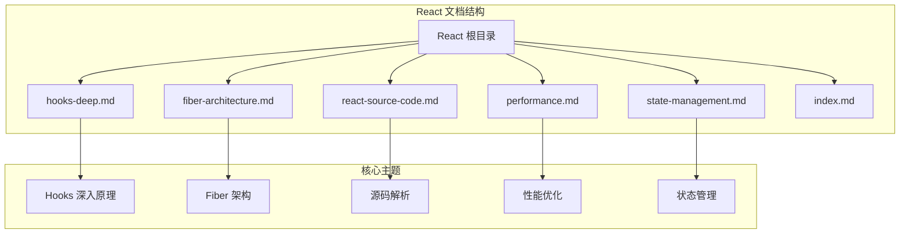
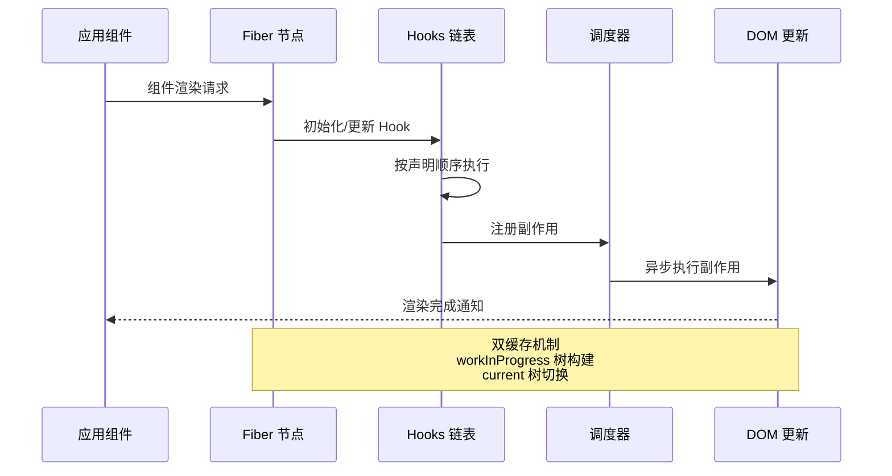
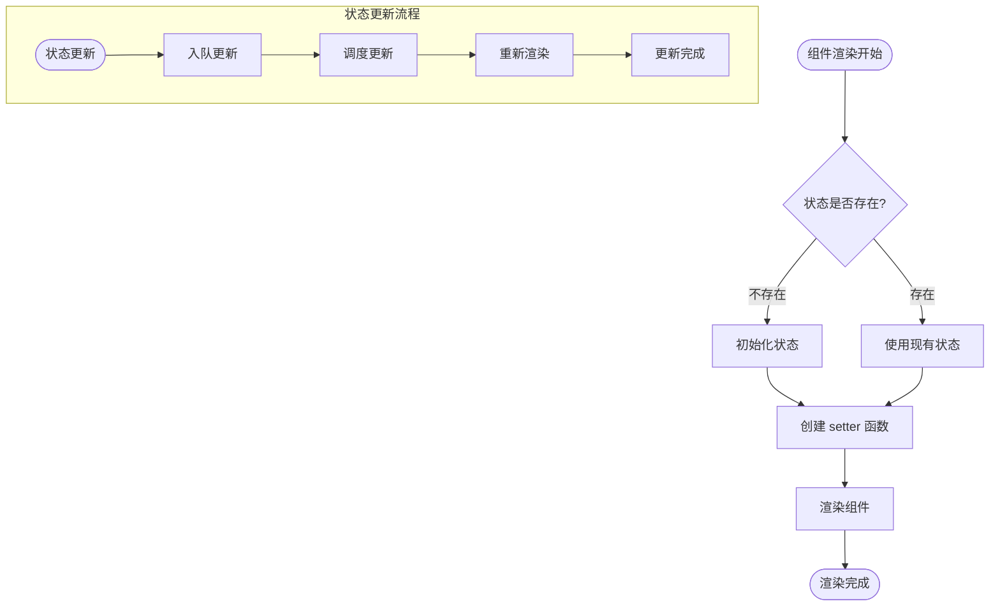
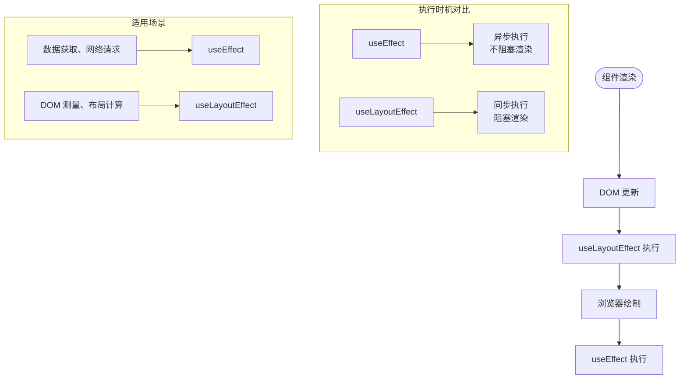
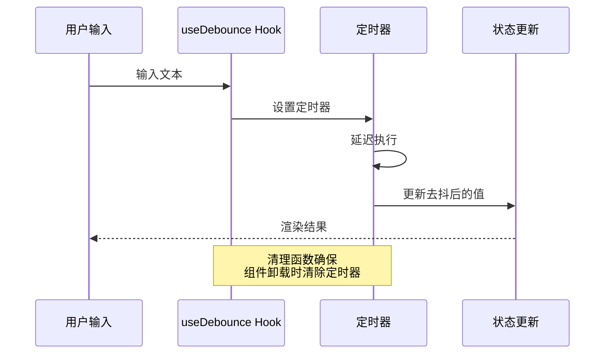
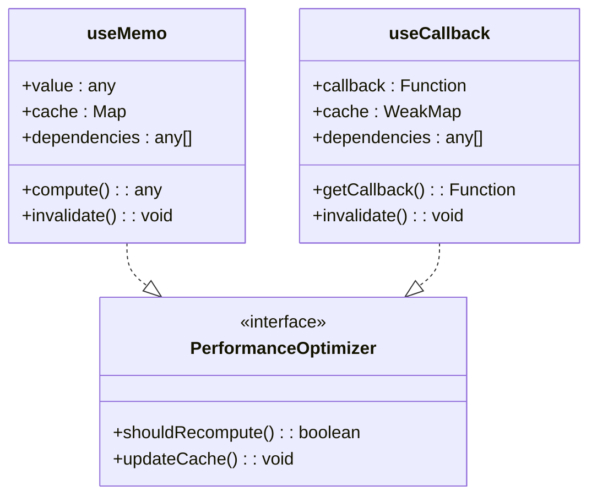
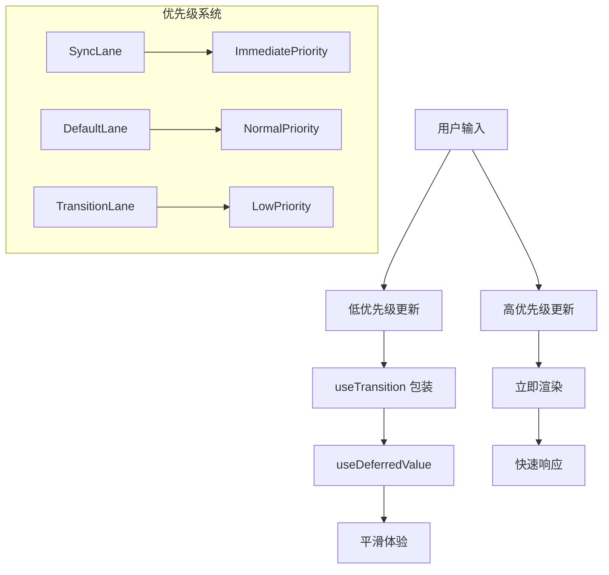
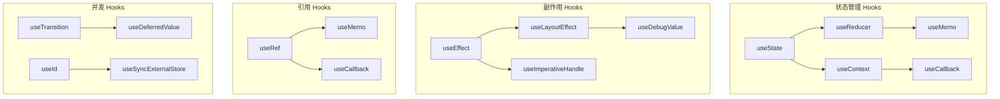
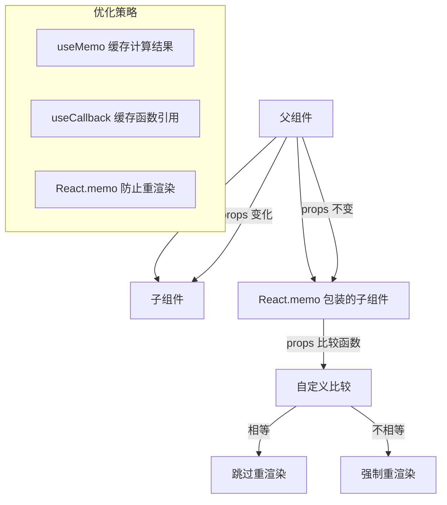

# Hooks 深入理解

<cite>
**本文档引用的文件**
- [hooks-deep.md](file://docs/react/hooks-deep.md)
- [fiber-architecture.md](file://docs/react/fiber-architecture.md)
- [react-source-code.md](file://docs/react/react-source-code.md)
- [performance.md](file://docs/react/performance.md)
- [state-management.md](file://docs/react/state-management.md)
- [index.md](file://docs/react/index.md)
</cite>

## 目录
1. [引言](#引言)
2. [项目结构](#项目结构)
3. [核心组件](#核心组件)
4. [架构概览](#架构概览)
5. [详细组件分析](#详细组件分析)
6. [依赖分析](#依赖分析)
7. [性能考虑](#性能考虑)
8. [故障排除指南](#故障排除指南)
9. [结论](#结论)
10. [附录](#附录)

## 引言

本技术文档深入探讨 React Hooks 的核心概念和高级用法，涵盖 useState、useEffect、useContext、useReducer、useCallback、useMemo、useRef 等内置 Hooks 的深入原理和最佳实践。文档不仅解释了这些 Hooks 的工作原理，还提供了丰富的代码示例和实际应用场景，展示 Hooks 在复杂组件中的组合使用。

通过结合 React Fiber 架构、状态管理和性能优化等知识，本指南旨在帮助开发者建立对 React Hooks 的深度理解，掌握其在现代前端开发中的最佳实践和常见陷阱。

## 项目结构

该项目采用文档驱动的组织方式，专门针对 React 生态系统的各个重要主题进行深入讲解。React 相关文档位于 `docs/react/` 目录下，每个文件专注于特定的技术领域。

**图表来源**
- [index.md:1-16](file://docs/react/index.md#L1-L16)
- [hooks-deep.md:1-107](file://docs/react/hooks-deep.md#L1-L107)

**章节来源**
- [index.md:1-16](file://docs/react/index.md#L1-L16)

## 核心组件

### 内置 Hooks 概览

React 提供了多种内置 Hooks，每种都有其特定的用途和最佳实践：

| Hook 类型 | 主要用途 | 执行时机 | 典型场景 |
|-----------|----------|----------|----------|
| useState | 管理本地状态 | 渲染时 | 表单控件、UI 状态 |
| useEffect | 处理副作用 | 渲染后 | 数据获取、订阅、DOM 操作 |
| useContext | 访问上下文 | 渲染时 | 主题、用户信息 |
| useReducer | 复杂状态逻辑 | 渲染时 | 状态机、表单验证 |
| useCallback | 缓存函数引用 | 渲染时 | 优化子组件渲染 |
| useMemo | 缓存计算结果 | 渲染时 | 重计算、昂贵操作 |
| useRef | 创建可变引用 | 渲染时 | DOM 引用、跨渲染持久化 |

### Hooks 执行原理

React Hooks 的执行基于 Fiber 架构，在每次渲染时按照声明顺序执行。每个 Hook 在 Fiber 节点的 `memoizedState` 链表中维护其状态。

**章节来源**
- [hooks-deep.md:10-28](file://docs/react/hooks-deep.md#L10-L28)
- [react-source-code.md:190-231](file://docs/react/react-source-code.md#L190-L231)

## 架构概览

React Hooks 的工作原理与 Fiber 架构密切相关。Fiber 是 React 16 引入的协调引擎，实现了可中断的异步渲染。

**图表来源**
- [react-source-code.md:144-186](file://docs/react/react-source-code.md#L144-L186)
- [fiber-architecture.md:40-58](file://docs/react/fiber-architecture.md#L40-L58)

### Fiber 架构核心概念

1. **双缓存机制**：维护两棵 Fiber 树，一棵用于当前显示，另一棵用于构建新状态
2. **时间切片**：通过 `shouldYield()` 函数实现渲染中断，保证用户体验
3. **优先级调度**：不同的更新具有不同优先级，影响渲染顺序
4. **副作用收集**：在完成阶段收集所有需要执行的副作用

**章节来源**
- [fiber-architecture.md:10-97](file://docs/react/fiber-architecture.md#L10-L97)

## 详细组件分析

### useState 深入解析

useState 是最基础也是最重要的 Hook，它管理组件的本地状态。

#### 工作原理

**图表来源**
- [hooks-deep.md:12-28](file://docs/react/hooks-deep.md#L12-L28)
- [react-source-code.md:211-230](file://docs/react/react-source-code.md#L211-L230)

#### 高级用法模式

1. **函数式更新**：当新状态依赖于前一个状态时使用
2. **惰性初始化**：对于昂贵的初始化操作使用工厂函数
3. **批量更新**：理解 React 的批处理机制

**章节来源**
- [hooks-deep.md:10-28](file://docs/react/hooks-deep.md#L10-L28)
- [react-source-code.md:211-230](file://docs/react/react-source-code.md#L211-L230)

### useEffect vs useLayoutEffect

这两个 Hook 都用于处理副作用，但执行时机和适用场景有所不同。

**图表来源**
- [hooks-deep.md:30-46](file://docs/react/hooks-deep.md#L30-L46)
- [react-source-code.md:235-272](file://docs/react/react-source-code.md#L235-L272)

#### 清理函数的重要性

useEffect 返回的清理函数在以下时机执行：
- 下一次 effect 执行前
- 组件卸载时
- 依赖项变更时

**章节来源**
- [hooks-deep.md:30-46](file://docs/react/hooks-deep.md#L30-L46)
- [hooks-deep.md:104](file://docs/react/hooks-deep.md#L104)

### 自定义 Hook 设计模式

自定义 Hook 是 React 的强大功能，可以将可复用的逻辑封装起来。

#### 防抖 Hook 示例

**图表来源**
- [hooks-deep.md:56-85](file://docs/react/hooks-deep.md#L56-L85)

#### 设计原则

1. **单一职责**：每个自定义 Hook 应该专注于一个特定的功能
2. **命名规范**：以 `use` 开头，清晰表达功能意图
3. **依赖管理**：正确处理依赖数组，避免无限循环
4. **错误处理**：提供适当的错误边界和降级策略

**章节来源**
- [hooks-deep.md:54-85](file://docs/react/hooks-deep.md#L54-L85)

### useMemo 和 useCallback 优化

这两个 Hook 都用于性能优化，但解决的问题不同。

#### 缓存策略对比

**图表来源**
- [hooks-deep.md:87-99](file://docs/react/hooks-deep.md#L87-L99)
- [performance.md:28-46](file://docs/react/performance.md#L28-L46)

#### 使用场景

- **useMemo**：缓存昂贵的计算结果，避免重复计算
- **useCallback**：缓存函数引用，防止子组件不必要的重渲染

**章节来源**
- [hooks-deep.md:87-99](file://docs/react/hooks-deep.md#L87-L99)
- [performance.md:28-46](file://docs/react/performance.md#L28-L46)

### 并发模式下的 Hooks

React 18 引入了并发特性，Hooks 在新的执行模型下有重要变化。

#### useTransition 和 useDeferredValue

**图表来源**
- [fiber-architecture.md:71-89](file://docs/react/fiber-architecture.md#L71-L89)
- [react-source-code.md:282-305](file://docs/react/react-source-code.md#L282-L305)

**章节来源**
- [fiber-architecture.md:71-89](file://docs/react/fiber-architecture.md#L71-L89)
- [react-source-code.md:282-305](file://docs/react/react-source-code.md#L282-L305)

## 依赖分析

### Hooks 之间的相互关系

### 依赖数组的重要性

依赖数组决定了 Hook 的执行频率和行为：

1. **空数组**：只在挂载时执行一次
2. **包含变量**：当这些变量变化时重新执行
3. **省略**：每次渲染都重新执行（可能导致性能问题）

**章节来源**
- [hooks-deep.md:103-107](file://docs/react/hooks-deep.md#L103-L107)

## 性能考虑

### React.memo 与 Hooks 的配合

**图表来源**
- [performance.md:10-26](file://docs/react/performance.md#L10-L26)
- [performance.md:28-46](file://docs/react/performance.md#L28-L46)

### 大数据渲染优化

对于大量数据的渲染，推荐使用虚拟滚动技术：

1. **useVirtualizer**：基于 @tanstack/react-virtual 的虚拟滚动
2. **固定高度列表**：使用 react-window 或 react-virtual
3. **动态高度列表**：使用 react-virtuoso

**章节来源**
- [performance.md:69-102](file://docs/react/performance.md#L69-L102)

## 故障排除指南

### 常见问题和解决方案

#### 1. 依赖数组错误

**问题**：依赖数组遗漏或多余
**解决方案**：使用 ESLint 插件 `react-hooks/exhaustive-deps`

#### 2. 无限重渲染

**问题**：状态更新导致组件无限重渲染
**解决方案**：检查依赖数组，使用 useCallback 包装回调函数

#### 3. 内存泄漏

**问题**：未清理的副作用
**解决方案**：确保 useEffect 返回的清理函数正确清理定时器、订阅等

#### 4. 性能问题

**问题**：过度使用 useMemo/useCallback
**解决方案**：只在必要时使用，评估实际收益

**章节来源**
- [hooks-deep.md:101-107](file://docs/react/hooks-deep.md#L101-L107)
- [performance.md:120-127](file://docs/react/performance.md#L120-L127)

### 调试技巧

1. **React DevTools Profiler**：分析组件渲染时间和次数
2. **浏览器性能面板**：监控 JavaScript 执行时间
3. **日志记录**：在关键位置添加 console.log
4. **源码调试**：直接在 React 源码中添加断点

**章节来源**
- [react-source-code.md:413-421](file://docs/react/react-source-code.md#L413-L421)

## 结论

React Hooks 代表了函数式编程在 React 中的成功应用，它们简化了状态管理和副作用处理，提高了代码的可复用性和可测试性。

通过深入理解 Hooks 的工作原理、最佳实践和常见陷阱，开发者可以编写出更加高效、可维护的 React 应用。关键要点包括：

1. **理解执行时机**：掌握不同 Hook 的执行顺序和时机
2. **正确使用依赖数组**：避免无限重渲染和内存泄漏
3. **性能优化策略**：合理使用 useMemo/useCallback
4. **并发模式适应**：利用 React 18 的新特性
5. **自定义 Hook 设计**：遵循单一职责和命名规范

随着 React 生态系统的不断发展，新的 Hook 和特性（如 useActionState、useOptimistic 等）将继续丰富开发者的工具箱。保持学习和实践是掌握 React Hooks 的最佳途径。

## 附录

### 面试常见问题

#### 1. 为什么 React 要用虚拟 DOM？

虚拟 DOM 提供了跨平台能力、性能优化、声明式编程和可预测性等优势。

#### 2. React 18 的并发特性有哪些？

- 自动批处理更新
- useTransition 和 useDeferredValue
- 更好的 Suspense 支持
- 更精细的优先级控制

#### 3. 如何选择合适的状态管理方案？

- 组件内状态：useState
- 跨组件共享：useContext
- 复杂应用：Zustand、Redux Toolkit
- 服务端状态：TanStack Query

### 学习资源推荐

1. **官方文档**：React 官方文档和 React DevTools
2. **源码阅读**：React GitHub 仓库和相关博客
3. **实践项目**：构建个人项目来练习 Hooks 的使用
4. **社区资源**：React 论坛、Stack Overflow、GitHub Discussions