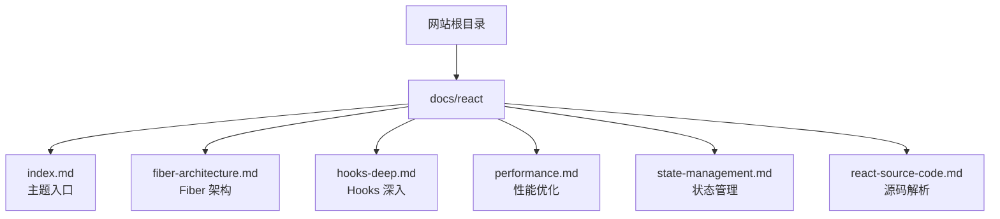
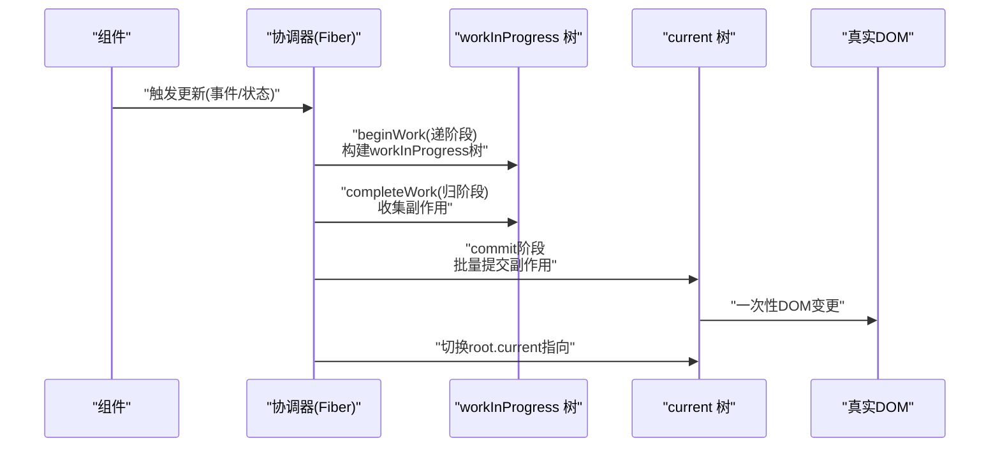
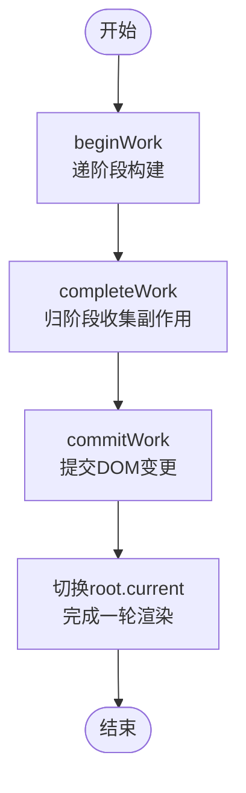
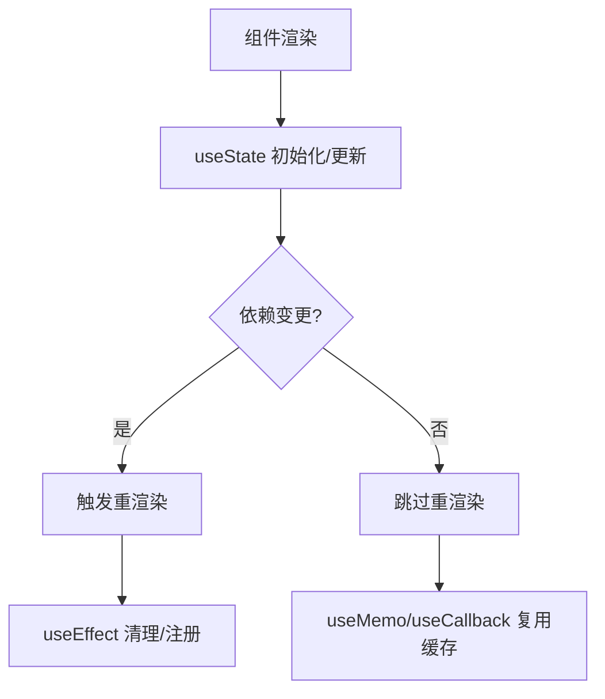
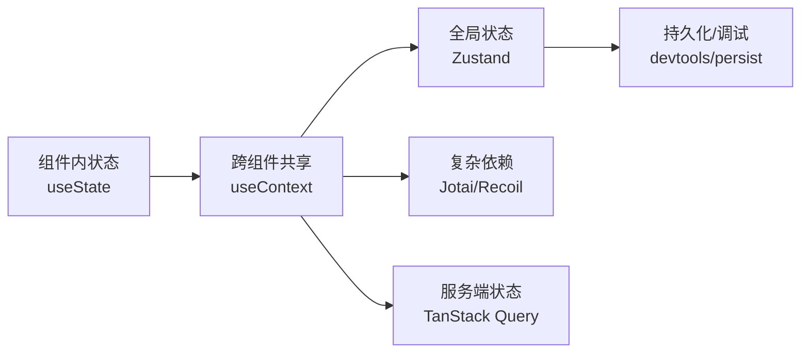
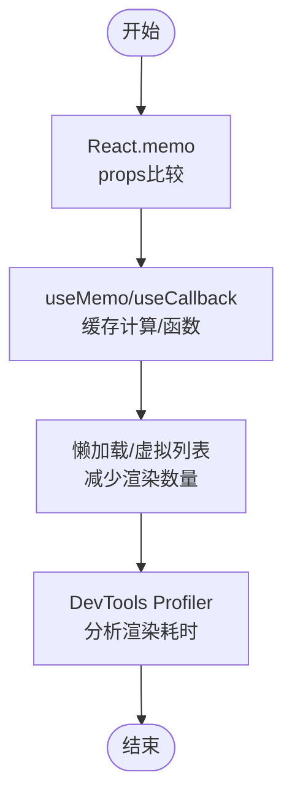
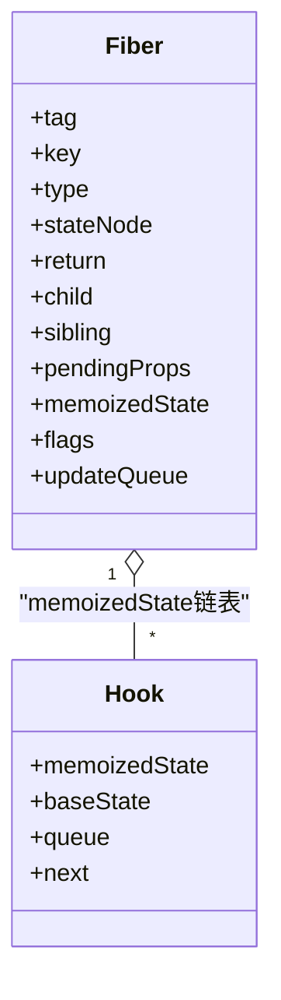
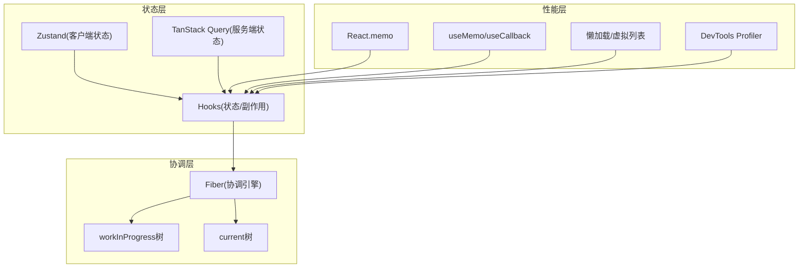

# React 深度解析

<cite>
**本文引用的文件**
- [docs/react/index.md](file://docs/react/index.md)
- [docs/react/fiber-architecture.md](file://docs/react/fiber-architecture.md)
- [docs/react/hooks-deep.md](file://docs/react/hooks-deep.md)
- [docs/react/performance.md](file://docs/react/performance.md)
- [docs/react/state-management.md](file://docs/react/state-management.md)
- [docs/react/react-source-code.md](file://docs/react/react-source-code.md)
- [README.md](file://README.md)
</cite>

## 目录
1. [引言](#引言)
2. [项目结构](#项目结构)
3. [核心组件](#核心组件)
4. [架构总览](#架构总览)
5. [详细组件分析](#详细组件分析)
6. [依赖分析](#依赖分析)
7. [性能考量](#性能考量)
8. [故障排查指南](#故障排查指南)
9. [结论](#结论)
10. [附录](#附录)

## 引言
本技术文档围绕 React 的核心概念与高级特性展开，系统梳理 Fiber 架构、Hooks 深入理解、状态管理策略与性能优化技巧。文档基于仓库内的 React 相关文档，结合虚拟 DOM、协调算法、调度机制等内部工作机制，提供面向不同经验层次开发者的进阶学习路径与最佳实践参考。

## 项目结构
该知识库采用 Docusaurus 静态站点生成器，React 相关内容集中在 docs/react 目录下，形成主题化的知识卡片式导航结构。整体组织方式便于按主题检索与深度阅读。

图表来源
- [docs/react/index.md:1-16](file://docs/react/index.md#L1-L16)
- [docs/react/fiber-architecture.md:1-97](file://docs/react/fiber-architecture.md#L1-L97)
- [docs/react/hooks-deep.md:1-107](file://docs/react/hooks-deep.md#L1-L107)
- [docs/react/performance.md:1-127](file://docs/react/performance.md#L1-L127)
- [docs/react/state-management.md:1-104](file://docs/react/state-management.md#L1-L104)
- [docs/react/react-source-code.md:1-480](file://docs/react/react-source-code.md#L1-L480)

章节来源
- [docs/react/index.md:1-16](file://docs/react/index.md#L1-L16)
- [README.md:1-42](file://README.md#L1-L42)

## 核心组件
本节从仓库文档中提炼 React 的关键主题模块，作为后续深入分析的基础。

- Fiber 架构：解释可中断渲染、双缓存机制、协调过程与优先级调度。
- Hooks 深入：useState、useEffect/useLayoutEffect、自定义 Hook、useMemo/useCallback。
- 状态管理：useState/context、Zustand、TanStack Query 对比与选型。
- 性能优化：React.memo、useMemo/useCallback、代码分割、虚拟列表、性能分析工具。
- 源码解析：React 19 新特性、Fiber 工作循环、Hooks 存储结构、并发与批处理。

章节来源
- [docs/react/fiber-architecture.md:1-97](file://docs/react/fiber-architecture.md#L1-L97)
- [docs/react/hooks-deep.md:1-107](file://docs/react/hooks-deep.md#L1-L107)
- [docs/react/state-management.md:1-104](file://docs/react/state-management.md#L1-L104)
- [docs/react/performance.md:1-127](file://docs/react/performance.md#L1-L127)
- [docs/react/react-source-code.md:1-480](file://docs/react/react-source-code.md#L1-L480)

## 架构总览
React 的渲染管线由“协调（Reconciliation）+ 提交（Commit）”构成，Fiber 作为可中断的调度单元，配合双缓存树与优先级模型，实现时间切片与并发更新。以下图示化展示从组件更新到 DOM 提交的关键步骤。

图表来源
- [docs/react/fiber-architecture.md:52-58](file://docs/react/fiber-architecture.md#L52-L58)
- [docs/react/react-source-code.md:146-186](file://docs/react/react-source-code.md#L146-L186)

## 详细组件分析

### Fiber 架构
- 设计动机：解决 Stack Reconciler 同步递归导致的主线程阻塞问题，引入可中断的异步渲染。
- Fiber 节点结构：包含链表父子关系、状态字段、副作用标记与更新队列。
- 双缓存机制：current 树与 workInProgress 树交替工作，构建完成后统一提交，降低渲染抖动。
- 协调过程：beginWork 递阶段处理节点，completeWork 归阶段收集副作用，commitWork 一次性提交。
- 优先级调度：Lane 模型划分同步、连续输入、默认、过渡、空闲等优先级，支撑时间切片与并发特性。
- 并发特性：useTransition/useDeferredValue 等 API 支持低优先级更新与延迟值。

图表来源
- [docs/react/fiber-architecture.md:52-58](file://docs/react/fiber-architecture.md#L52-L58)
- [docs/react/fiber-architecture.md:40-50](file://docs/react/fiber-architecture.md#L40-L50)

章节来源
- [docs/react/fiber-architecture.md:10-97](file://docs/react/fiber-architecture.md#L10-L97)
- [docs/react/react-source-code.md:108-141](file://docs/react/react-source-code.md#L108-L141)

### Hooks 深入
- useState 工作原理：简化实现体现“按序挂载、函数式 setState、触发重渲染”的核心逻辑。
- useEffect vs useLayoutEffect：执行时机差异决定是否阻塞渲染；前者适合副作用，后者适合同步读取布局。
- 自定义 Hook：封装可复用逻辑，如防抖 Hook，注意清理函数与依赖数组。
- useMemo/useCallback：缓存计算结果与函数引用，避免子组件不必要重渲染；过度使用可能适得其反。

图表来源
- [docs/react/hooks-deep.md:10-28](file://docs/react/hooks-deep.md#L10-L28)
- [docs/react/hooks-deep.md:30-46](file://docs/react/hooks-deep.md#L30-L46)
- [docs/react/hooks-deep.md:87-107](file://docs/react/hooks-deep.md#L87-L107)

章节来源
- [docs/react/hooks-deep.md:1-107](file://docs/react/hooks-deep.md#L1-L107)

### 状态管理策略
- 方案对比：useState（组件内）、useContext（跨组件）、Redux（单一数据源）、Zustand（轻量）、Jotai（原子化）、Recoil（图状态）。
- Zustand 推荐：API 简洁、体积小、支持中间件（devtools/persist），适合中小型应用。
- 服务端状态：TanStack Query 管理查询、缓存、失效与乐观更新。
- 选型建议：优先组件内状态，共享时再选择合适的状态库；服务端用 TanStack Query，客户端用 Zustand/Jotai。

图表来源
- [docs/react/state-management.md:10-20](file://docs/react/state-management.md#L10-L20)
- [docs/react/state-management.md:21-65](file://docs/react/state-management.md#L21-L65)
- [docs/react/state-management.md:67-96](file://docs/react/state-management.md#L67-L96)

章节来源
- [docs/react/state-management.md:1-104](file://docs/react/state-management.md#L1-L104)

### 性能优化技术
- React.memo：在 props 不变时跳过重渲染；可自定义比较函数。
- useMemo/useCallback：缓存昂贵计算与函数引用，配合 React.memo 使用。
- 代码分割：路由级懒加载与 Suspense 提供占位，降低首屏体积。
- 虚拟列表：大列表渲染通过仅渲染可视区域项，显著降低 DOM 数量。
- 性能分析：React DevTools Profiler 记录渲染耗时与次数，定位热点组件。

图表来源
- [docs/react/performance.md:10-26](file://docs/react/performance.md#L10-L26)
- [docs/react/performance.md:28-46](file://docs/react/performance.md#L28-L46)
- [docs/react/performance.md:48-67](file://docs/react/performance.md#L48-L67)
- [docs/react/performance.md:69-102](file://docs/react/performance.md#L69-L102)
- [docs/react/performance.md:104-127](file://docs/react/performance.md#L104-L127)

章节来源
- [docs/react/performance.md:1-127](file://docs/react/performance.md#L1-L127)

### 源码解析要点
- React 19 新特性：Actions（异步状态管理）、use() Hook、ref 作为 prop、文档元数据支持。
- Fiber 工作循环：同步/并发两种模式，时间切片通过 shouldYield 控制让出控制权。
- Hooks 存储：以链表形式保存在 Fiber.memoizedState，useState 内部委托 useReducer。
- 并发与批处理：优先级系统、Suspense 挂起处理、React 18 默认批处理更新。
- Server Components：服务端组件与客户端组件的混合渲染与流协议。

图表来源
- [docs/react/react-source-code.md:68-93](file://docs/react/react-source-code.md#L68-L93)
- [docs/react/react-source-code.md:196-231](file://docs/react/react-source-code.md#L196-L231)

章节来源
- [docs/react/react-source-code.md:1-480](file://docs/react/react-source-code.md#L1-L480)

## 依赖分析
React 生态围绕“协调引擎 + 状态管理 + 性能工具”形成闭环。Fiber 作为核心调度器，Hooks 提供声明式状态与副作用抽象，状态库（Zustand/TanStack Query）负责应用状态与服务端状态管理，性能工具（DevTools Profiler）贯穿开发与调试流程。

图表来源
- [docs/react/fiber-architecture.md:14-38](file://docs/react/fiber-architecture.md#L14-L38)
- [docs/react/hooks-deep.md:87-107](file://docs/react/hooks-deep.md#L87-L107)
- [docs/react/state-management.md:21-65](file://docs/react/state-management.md#L21-L65)
- [docs/react/performance.md:10-26](file://docs/react/performance.md#L10-L26)

章节来源
- [docs/react/fiber-architecture.md:1-97](file://docs/react/fiber-architecture.md#L1-L97)
- [docs/react/hooks-deep.md:1-107](file://docs/react/hooks-deep.md#L1-L107)
- [docs/react/state-management.md:1-104](file://docs/react/state-management.md#L1-L104)
- [docs/react/performance.md:1-127](file://docs/react/performance.md#L1-L127)

## 性能考量
- 合理使用 memo 与缓存：在高频渲染且计算昂贵的场景使用 useMemo/useCallback，避免滥用导致额外开销。
- 代码分割与懒加载：按路由拆分，结合 Suspense 提升首屏体验。
- 大列表优化：采用虚拟滚动减少 DOM 节点数量，提升滚动流畅度。
- 并发与优先级：利用 useTransition/useDeferredValue 区分交互与后台任务，避免阻塞用户操作。
- 开发工具：使用 Profiler 定位热点组件与长任务，持续优化渲染路径。

## 故障排查指南
- 渲染异常：检查 useEffect 清理函数是否正确释放资源，避免内存泄漏与重复订阅。
- 性能瓶颈：通过 Profiler 分析渲染耗时，结合 React.memo/useMemo/useCallback 优化热点路径。
- 状态不一致：确认状态提升与共享边界，避免多份状态副本；服务端状态使用 TanStack Query 的缓存与失效策略。
- 并发问题：区分 useEffect 与 useLayoutEffect 的执行时机，确保布局读写在正确阶段进行。
- 依赖数组：严格维护依赖列表，防止闭包捕获陈旧值或遗漏依赖导致的错误行为。

章节来源
- [docs/react/hooks-deep.md:30-46](file://docs/react/hooks-deep.md#L30-L46)
- [docs/react/performance.md:104-127](file://docs/react/performance.md#L104-L127)
- [docs/react/state-management.md:67-96](file://docs/react/state-management.md#L67-L96)

## 结论
本仓库提供了从基础到进阶的 React 知识体系：以 Fiber 架构为核心，串联 Hooks、状态管理与性能优化，并辅以源码解析与实战建议。建议读者按主题循序渐进学习，结合实际项目验证与迭代，逐步掌握 React 的内部机制与工程化实践。

## 附录
- 学习路径建议：先理解 Fiber 与并发模型，再深入 Hooks 与状态管理，最后结合性能工具与源码阅读巩固认知。
- 推荐资源：React 官方文档、React 源码、《React 技术揭秘》、Just React 等。