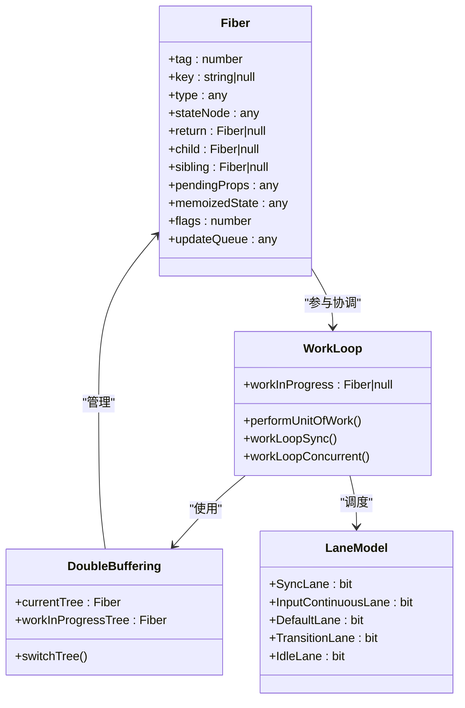
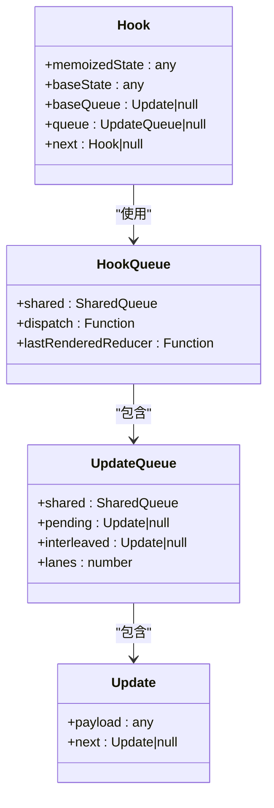
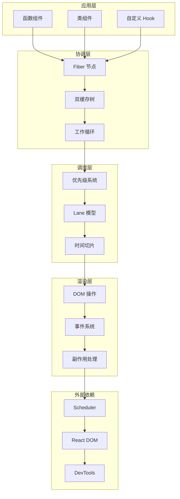
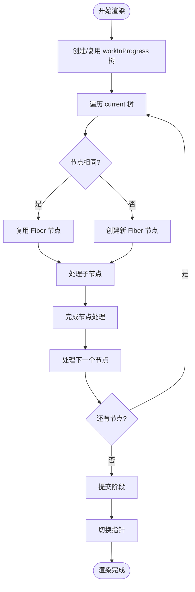
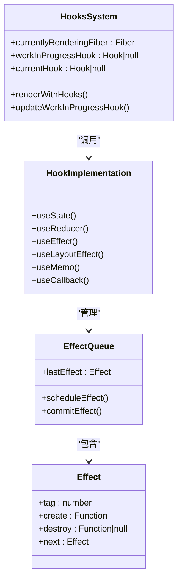
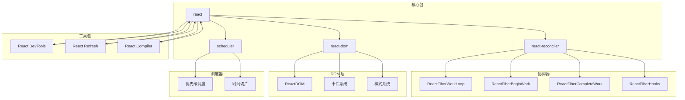
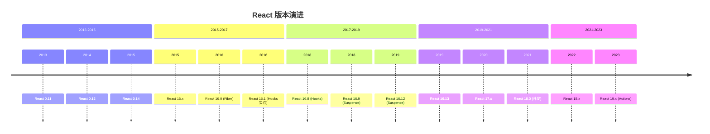
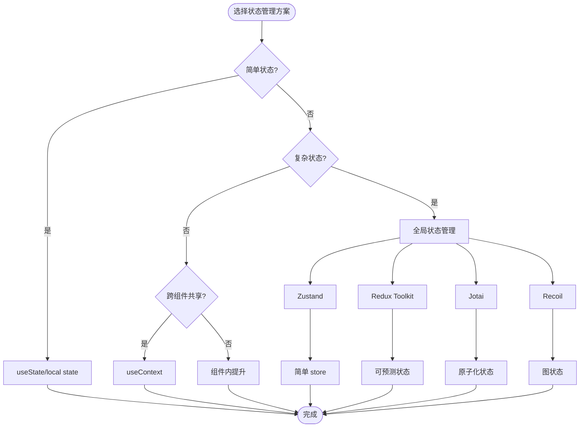
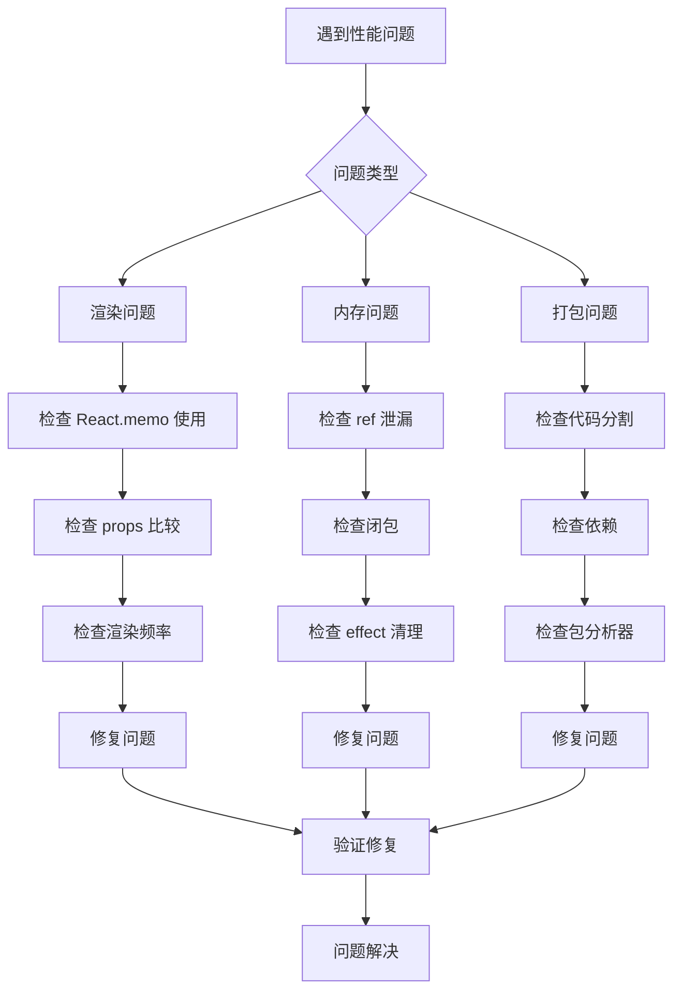
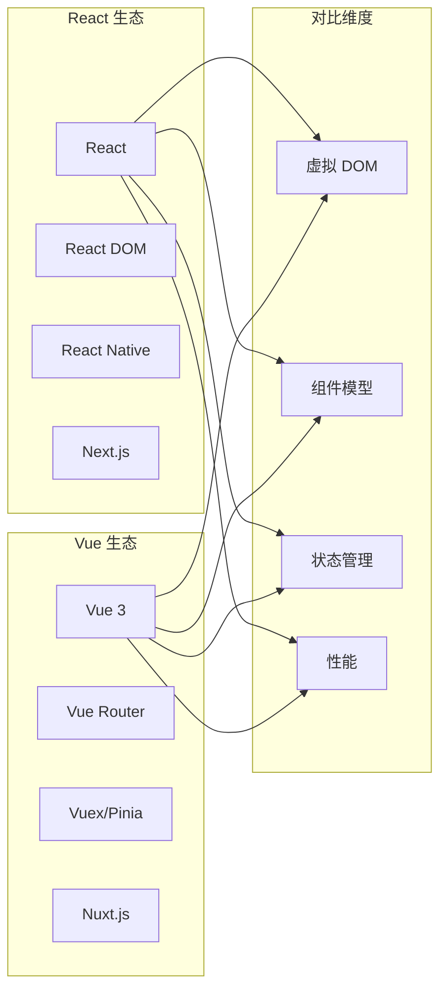

# React 源码分析

<cite>
**本文档引用的文件**
- [react-source-code.md](file://docs/react/react-source-code.md)
- [fiber-architecture.md](file://docs/react/fiber-architecture.md)
- [hooks-deep.md](file://docs/react/hooks-deep.md)
- [performance.md](file://docs/react/performance.md)
- [state-management.md](file://docs/react/state-management.md)
- [index.md](file://docs/react/index.md)
- [intro.md](file://docs/intro.md)
- [lifecycle.md](file://docs/vue/lifecycle.md)
- [virtual-dom.md](file://docs/vue/virtual-dom.md)
</cite>

## 目录
1. [引言](#引言)
2. [项目结构](#项目结构)
3. [核心组件](#核心组件)
4. [架构总览](#架构总览)
5. [详细组件分析](#详细组件分析)
6. [依赖关系分析](#依赖关系分析)
7. [性能考量](#性能考量)
8. [故障排除指南](#故障排除指南)
9. [结论](#结论)
10. [附录](#附录)

## 引言

React 源码分析是一个复杂而深奥的主题，涉及现代前端框架的核心设计理念和技术实现。本文档旨在为高级开发者提供深入的技术洞察，帮助理解 React 的内部工作机制、架构设计哲学以及演进历程。

React 从最初的 Stack Reconciler 发展到现在的 Fiber 架构，经历了重大的技术变革。这些变革不仅提升了性能表现，更重要的是为现代 Web 应用提供了更好的用户体验和开发体验。

## 项目结构

基于现有文档，React 相关的知识库组织呈现以下结构：

```mermaid
graph TB
subgraph "React 知识库"
A[React 主页] --> B[Fiber 架构]
A --> C[Hooks 深入]
A --> D[性能优化]
A --> E[状态管理]
A --> F[源码解析]
B --> G[双缓存机制]
B --> H[优先级调度]
B --> I[时间切片]
C --> J[useState 实现]
C --> K[useEffect 区别]
C --> L[自定义 Hook]
D --> M[React.memo]
D --> N[useMemo/useCallback]
D --> O[代码分割]
E --> P[Zustand 方案]
E --> Q[React Query]
E --> R[Redux 对比]
F --> S[React 19 变化]
F --> T[Actions 异步状态]
F --> U[use() Hook]
end
```

**图表来源**
- [index.md:1-16](file://docs/react/index.md#L1-L16)
- [react-source-code.md:1-480](file://docs/react/react-source-code.md#L1-L480)

**章节来源**
- [index.md:1-16](file://docs/react/index.md#L1-L16)
- [intro.md:12-19](file://docs/intro.md#L12-L19)

## 核心组件

### Fiber 架构组件

React 的 Fiber 架构是整个源码分析的核心，它引入了可中断的渲染机制：



**图表来源**
- [fiber-architecture.md:16-38](file://docs/react/fiber-architecture.md#L16-L38)
- [react-source-code.md:69-93](file://docs/react/react-source-code.md#L69-L93)

### Hooks 系统组件

Hooks 系统是 React 16.8 引入的重要特性，它改变了函数组件的状态管理模式：



**图表来源**
- [react-source-code.md:197-204](file://docs/react/react-source-code.md#L197-L204)
- [hooks-deep.md:10-28](file://docs/react/hooks-deep.md#L10-L28)

**章节来源**
- [fiber-architecture.md:10-97](file://docs/react/fiber-architecture.md#L10-L97)
- [react-source-code.md:108-231](file://docs/react/react-source-code.md#L108-L231)
- [hooks-deep.md:10-107](file://docs/react/hooks-deep.md#L10-L107)

## 架构总览

React 源码的整体架构可以分为以下几个层次：



**图表来源**
- [react-source-code.md:146-186](file://docs/react/react-source-code.md#L146-L186)
- [fiber-architecture.md:52-69](file://docs/react/fiber-architecture.md#L52-L69)

### 设计哲学分析

React 的设计哲学体现在以下几个方面：

1. **可中断渲染**：通过 Fiber 架构实现的时间切片，解决了大型应用的性能问题
2. **声明式编程**：开发者只需关注状态变化，无需直接操作 DOM
3. **渐进式升级**：从 Stack Reconciler 到 Fiber 的平滑过渡
4. **模块化设计**：清晰的分层架构便于维护和扩展

**章节来源**
- [react-source-code.md:427-437](file://docs/react/react-source-code.md#L427-L437)
- [fiber-architecture.md:10-12](file://docs/react/fiber-architecture.md#L10-L12)

## 详细组件分析

### 工作循环机制

React 的工作循环是 Fiber 架构的核心执行机制：

```mermaid
sequenceDiagram
participant Root as 根节点
participant Loop as 工作循环
participant Begin as beginWork
participant Complete as completeWork
participant Commit as commitWork
Root->>Loop : 开始渲染
Loop->>Begin : 处理当前节点
Begin->>Begin : 递归处理子节点
Begin->>Complete : 到达叶子节点
Complete->>Complete : 收集副作用
Complete->>Commit : 提交阶段
Commit->>Commit : 执行 DOM 操作
Commit->>Loop : 继续下一个节点
Loop->>Loop : 检查是否需要中断
alt 需要中断
Loop->>Loop : 让出控制权
else 继续执行
Loop->>Begin : 继续处理
end
Loop->>Root : 渲染完成
```

**图表来源**
- [react-source-code.md:152-186](file://docs/react/react-source-code.md#L152-L186)
- [fiber-architecture.md:52-58](file://docs/react/fiber-architecture.md#L52-L58)

### 双缓存机制详解

双缓存机制是 React 性能优化的关键：



**图表来源**
- [react-source-code.md:118-136](file://docs/react/react-source-code.md#L118-L136)
- [fiber-architecture.md:40-50](file://docs/react/fiber-architecture.md#L40-L50)

**章节来源**
- [react-source-code.md:146-186](file://docs/react/react-source-code.md#L146-L186)
- [react-source-code.md:108-141](file://docs/react/react-source-code.md#L108-L141)

### Hooks 系统实现

Hooks 系统的实现体现了 React 的创新设计：



**图表来源**
- [react-source-code.md:196-231](file://docs/react/react-source-code.md#L196-L231)
- [hooks-deep.md:30-46](file://docs/react/hooks-deep.md#L30-L46)

**章节来源**
- [react-source-code.md:190-231](file://docs/react/react-source-code.md#L190-L231)
- [hooks-deep.md:30-85](file://docs/react/hooks-deep.md#L30-L85)

### 并发特性实现

React 18 引入的并发特性是重要的架构升级：

```mermaid
flowchart LR
subgraph "用户交互"
A[用户输入]
B[点击按钮]
C[表单输入]
end
subgraph "优先级系统"
D[SyncLane]
E[InputContinuousLane]
F[DefaultLane]
G[TransitionLane]
H[IdleLane]
end
subgraph "时间切片"
I[shouldYield()]
J[5ms 切片]
K[继续执行]
end
subgraph "Suspense"
L[Suspense 边界]
M[fallback 渲染]
N[数据加载完成]
end
A --> D
B --> E
C --> F
D --> I
E --> I
F --> I
I --> J
J --> K
K --> L
L --> M
M --> N
```

**图表来源**
- [react-source-code.md:287-324](file://docs/react/react-source-code.md#L287-L324)
- [fiber-architecture.md:60-69](file://docs/react/fiber-architecture.md#L60-L69)

**章节来源**
- [react-source-code.md:282-324](file://docs/react/react-source-code.md#L282-L324)
- [fiber-architecture.md:71-89](file://docs/react/fiber-architecture.md#L71-L89)

## 依赖关系分析

React 源码的依赖关系体现了清晰的模块化设计：



**图表来源**
- [react-source-code.md:400-411](file://docs/react/react-source-code.md#L400-L411)

### 版本演进分析

React 的版本演进展示了持续的架构改进：



**章节来源**
- [react-source-code.md:15-58](file://docs/react/react-source-code.md#L15-L58)

## 性能考量

React 的性能优化策略体现了深度的架构思考：

### 性能优化技术栈

```mermaid
graph TB
subgraph "渲染优化"
A[React.memo]
B[useMemo]
C[useCallback]
D[useDeferredValue]
end
subgraph "代码分割"
E[lazy]
F[Suspense]
G[路由级别分割]
end
subgraph "虚拟化"
H[react-window]
I[@tanstack/react-virtual]
J[固定大小列表]
end
subgraph "分析工具"
K[React DevTools Profiler]
L[Chrome DevTools]
M[Bundle Analyzer]
end
A --> N[避免不必要重渲染]
B --> O[缓存计算结果]
C --> P[缓存函数引用]
D --> Q[延迟昂贵值]
E --> R[按需加载]
F --> S[占位符渲染]
G --> T[大数据优化]
K --> U[性能瓶颈识别]
L --> V[内存泄漏检测]
M --> W[包体积分析]
```

**图表来源**
- [performance.md:10-127](file://docs/react/performance.md#L10-L127)

**章节来源**
- [performance.md:10-127](file://docs/react/performance.md#L10-L127)

### 状态管理最佳实践



**图表来源**
- [state-management.md:10-104](file://docs/react/state-management.md#L10-L104)

**章节来源**
- [state-management.md:10-104](file://docs/react/state-management.md#L10-L104)

## 故障排除指南

### 常见问题诊断



**章节来源**
- [performance.md:104-127](file://docs/react/performance.md#L104-L127)

### 调试技巧

1. **源码调试**：在关键位置添加日志输出
2. **DevTools 分析**：使用 React DevTools Profiler
3. **性能监控**：监控渲染时间和内存使用
4. **网络分析**：分析代码分割效果

## 结论

React 源码分析揭示了一个精心设计的现代前端框架架构。通过 Fiber 架构、Hooks 系统、并发特性和完善的性能优化体系，React 为现代 Web 应用提供了强大的技术基础。

### 核心设计优势

1. **可预测性**：声明式编程模型使状态管理更加直观
2. **可扩展性**：模块化架构支持持续的功能扩展
3. **可维护性**：清晰的代码结构便于长期维护
4. **性能稳定性**：多层优化策略确保应用性能

### 学习路径建议

对于想要深入理解 React 源码的开发者，建议按照以下路径进行：

1. **理论基础**：理解虚拟 DOM 和组件模型
2. **架构理解**：掌握 Fiber 架构和双缓存机制
3. **核心实现**：深入研究 Hooks 系统和工作循环
4. **性能优化**：学习各种优化技术和最佳实践
5. **源码阅读**：结合实际代码进行深入分析

## 附录

### 相关技术对比

与其他前端框架的对比有助于更好地理解 React 的独特优势：



**章节来源**
- [lifecycle.md:10-190](file://docs/vue/lifecycle.md#L10-L190)
- [virtual-dom.md:10-117](file://docs/vue/virtual-dom.md#L10-L117)

### 学习资源推荐

1. **官方文档**：React 官方文档和 API 参考
2. **源码阅读**：GitHub 上的 React 源码仓库
3. **社区资源**：React 技术博客和论坛讨论
4. **实践项目**：通过实际项目加深理解