# 性能优化技巧

<cite>
**本文档引用的文件**
- [docs/react/performance.md](file://docs/react/performance.md)
- [docs/react/hooks-deep.md](file://docs/react/hooks-deep.md)
- [docs/react/fiber-architecture.md](file://docs/react/fiber-architecture.md)
- [docs/react/state-management.md](file://docs/react/state-management.md)
- [docs/react/react-source-code.md](file://docs/react/react-source-code.md)
- [docs/performance/rendering-optimization.md](file://docs/performance/rendering-optimization.md)
- [docs/performance/loading-optimization.md](file://docs/performance/loading-optimization.md)
- [package.json](file://package.json)
- [README.md](file://README.md)
</cite>

## 目录
1. [简介](#简介)
2. [项目结构](#项目结构)
3. [核心组件](#核心组件)
4. [架构概览](#架构概览)
5. [详细组件分析](#详细组件分析)
6. [依赖分析](#依赖分析)
7. [性能考虑](#性能考虑)
8. [故障排除指南](#故障排除指南)
9. [结论](#结论)
10. [附录](#附录)

## 简介

本指南专注于React应用的性能优化实践，基于仓库中的高质量文档内容，系统性地介绍了从基础到高级的性能优化策略。内容涵盖组件渲染优化、内存泄漏预防、Bundle体积优化等多个维度，特别深入讲解了React.memo、useMemo、useCallback的使用场景和性能影响，懒加载组件的实现方法，以及代码分割的最佳实践。

通过理论与实践相结合的方式，本指南旨在帮助开发者建立完整的React性能优化知识体系，提供可操作的优化建议和性能监控方案。

## 项目结构

该知识库采用Docusaurus静态站点生成器构建，专门用于知识管理和文档分享。项目结构清晰，按照主题分类组织React和性能优化相关的文档内容。

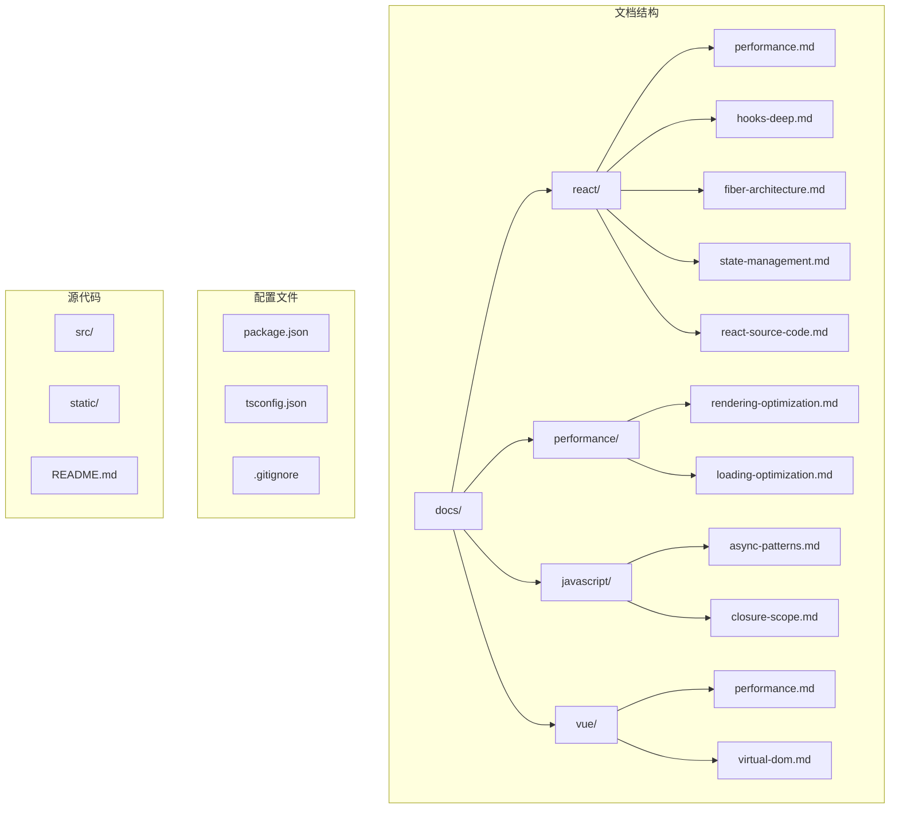

**图表来源**
- [package.json:1-50](file://package.json#L1-L50)
- [README.md:1-42](file://README.md#L1-L42)

**章节来源**
- [package.json:1-50](file://package.json#L1-L50)
- [README.md:1-42](file://README.md#L1-L42)

## 核心组件

基于仓库文档，React性能优化的核心组件主要包括以下几类：

### 1. React.memo 组件优化
React.memo提供了组件级别的渲染优化，通过浅比较props来避免不必要的重渲染。

### 2. Hooks 性能优化
- **useMemo**: 缓存计算结果，避免重复计算
- **useCallback**: 缓存函数引用，配合React.memo使用
- **自定义Hook**: 如防抖Hook等性能优化工具

### 3. 虚拟滚动组件
使用react-virtual等库实现大数据列表的高性能渲染。

### 4. 性能分析工具
React DevTools Profiler用于性能分析和渲染时间监控。

**章节来源**
- [docs/react/performance.md:10-127](file://docs/react/performance.md#L10-L127)
- [docs/react/hooks-deep.md:87-107](file://docs/react/hooks-deep.md#L87-L107)

## 架构概览

React性能优化的整体架构可以分为三个层次：渲染层优化、计算层优化和加载层优化。

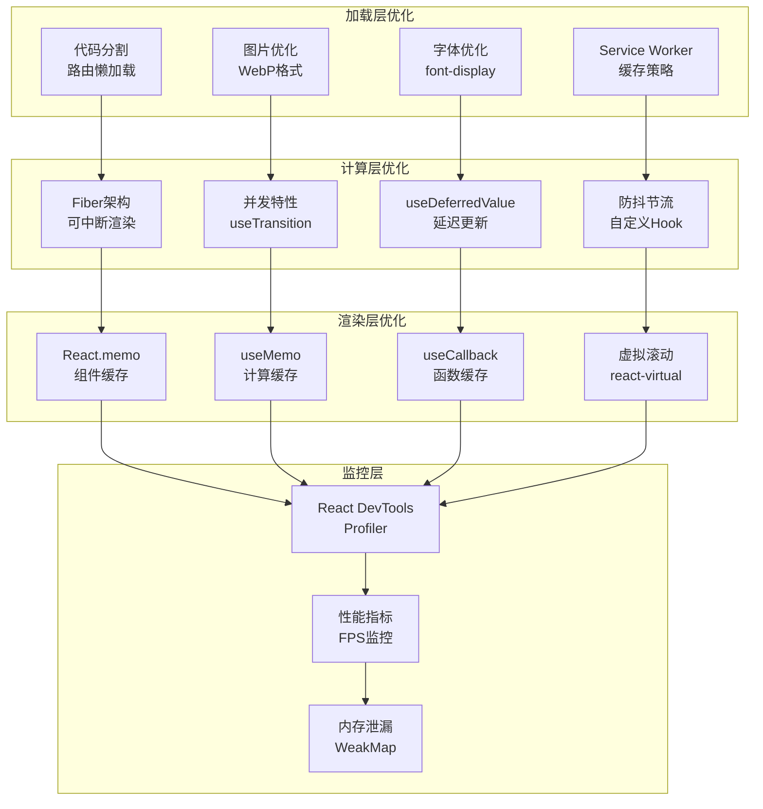

**图表来源**
- [docs/react/performance.md:10-127](file://docs/react/performance.md#L10-L127)
- [docs/react/fiber-architecture.md:71-97](file://docs/react/fiber-architecture.md#L71-L97)
- [docs/performance/rendering-optimization.md:16-747](file://docs/performance/rendering-optimization.md#L16-L747)

## 详细组件分析

### React.memo 组件优化

React.memo是React提供的高阶组件，用于优化函数组件的渲染性能。

#### 基本使用模式

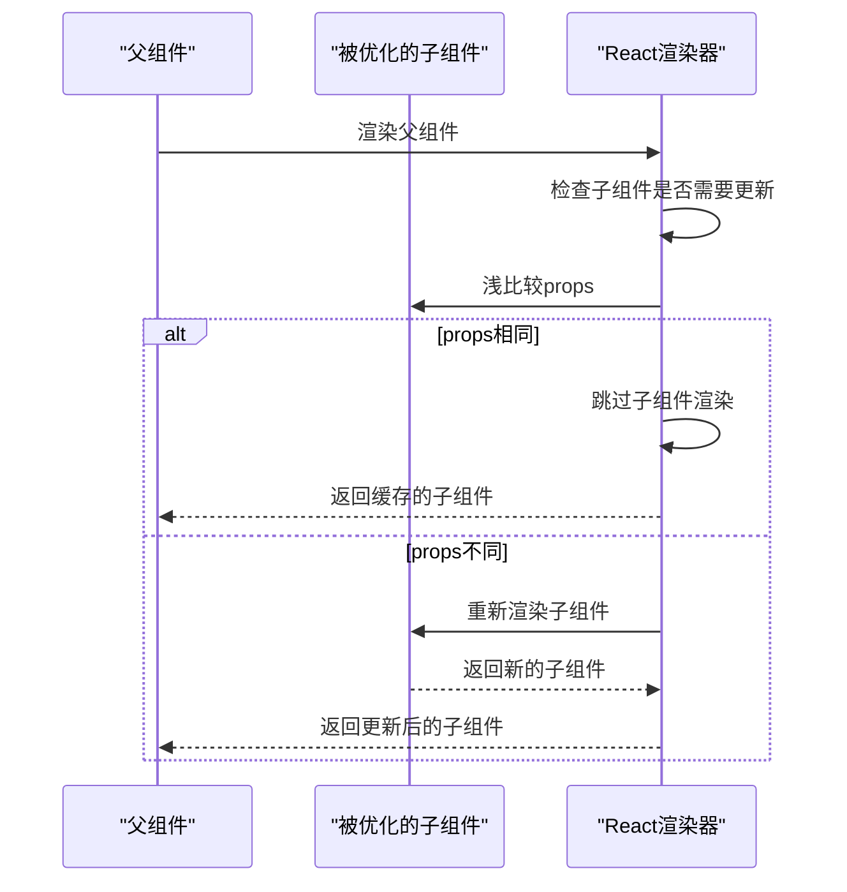

**图表来源**
- [docs/react/performance.md:10-26](file://docs/react/performance.md#L10-L26)

#### 自定义比较函数

当默认的浅比较无法满足需求时，可以通过自定义比较函数来精确控制组件的更新逻辑。

**章节来源**
- [docs/react/performance.md:10-26](file://docs/react/performance.md#L10-L26)

### useMemo 和 useCallback 深入分析

这两个Hook是React性能优化的核心工具，分别解决不同的性能问题。

#### useMemo 的工作原理

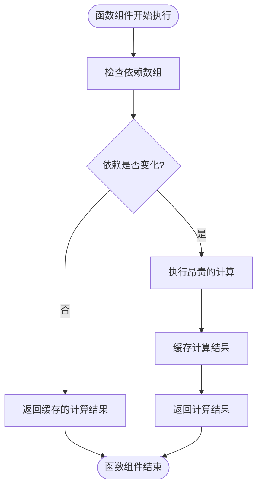

**图表来源**
- [docs/react/performance.md:28-46](file://docs/react/performance.md#L28-L46)

#### useCallback 的应用场景

useCallback主要用于缓存函数引用，防止子组件因为函数引用变化而重新渲染。

**章节来源**
- [docs/react/performance.md:28-46](file://docs/react/performance.md#L28-L46)
- [docs/react/hooks-deep.md:87-107](file://docs/react/hooks-deep.md#L87-L107)

### 虚拟滚动实现

对于大数据列表，虚拟滚动是提升性能的关键技术。

#### 虚拟滚动的工作机制

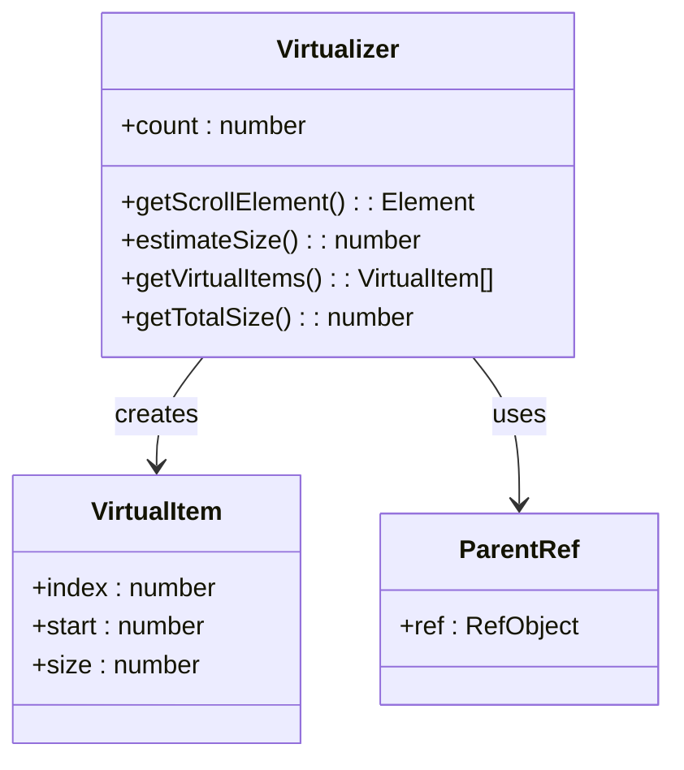

**图表来源**
- [docs/react/performance.md:69-102](file://docs/react/performance.md#L69-L102)

**章节来源**
- [docs/react/performance.md:69-102](file://docs/react/performance.md#L69-L102)

### Fiber 架构与性能优化

React 16+引入的Fiber架构是现代React性能优化的基础。

#### Fiber 节点结构

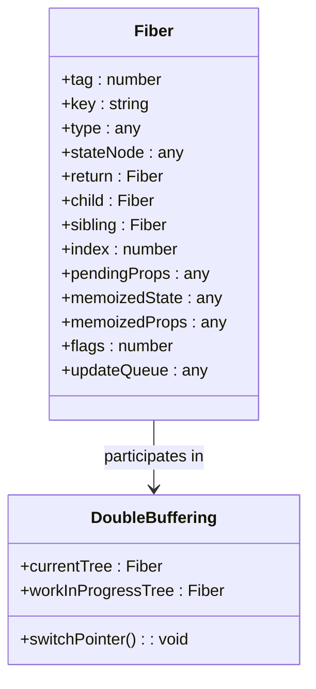

**图表来源**
- [docs/react/fiber-architecture.md:14-50](file://docs/react/fiber-architecture.md#L14-L50)

#### 并发特性的性能优势

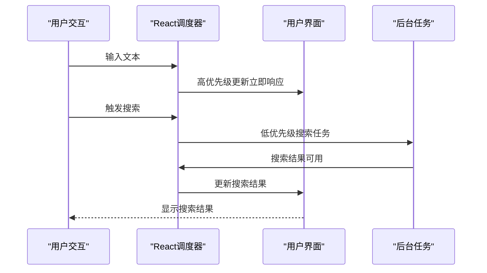

**图表来源**
- [docs/react/fiber-architecture.md:71-97](file://docs/react/fiber-architecture.md#L71-L97)

**章节来源**
- [docs/react/fiber-architecture.md:10-97](file://docs/react/fiber-architecture.md#L10-L97)

### 性能分析工具使用

React DevTools Profiler是性能分析的重要工具。

#### Profiler 的基本使用

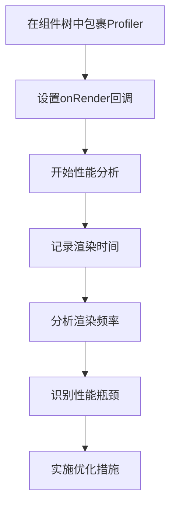

**图表来源**
- [docs/react/performance.md:104-118](file://docs/react/performance.md#L104-L118)

**章节来源**
- [docs/react/performance.md:104-118](file://docs/react/performance.md#L104-L118)

## 依赖分析

基于项目配置文件，React性能优化相关的依赖关系如下：

```mermaid
graph TB
subgraph "React生态"
A[react@^19.0.0]
B[react-dom@^19.0.0]
C[react-devtools@latest]
end
subgraph "性能优化库"
D[@tanstack/react-virtual]
E[@tanstack/react-query]
F[zustand]
end
subgraph "开发工具"
G[docusaurus/core@3.10.1]
H[@docusaurus/preset-classic@3.10.1]
I[typescript@~6.0.2]
end
A --> D
A --> E
A --> F
G --> A
H --> A
I --> A
```

**图表来源**
- [package.json:17-33](file://package.json#L17-L33)

**章节来源**
- [package.json:17-33](file://package.json#L17-L33)

## 性能考虑

### 渲染性能优化

根据渲染优化文档，浏览器渲染流程是理解性能优化的基础。

#### 关键渲染路径

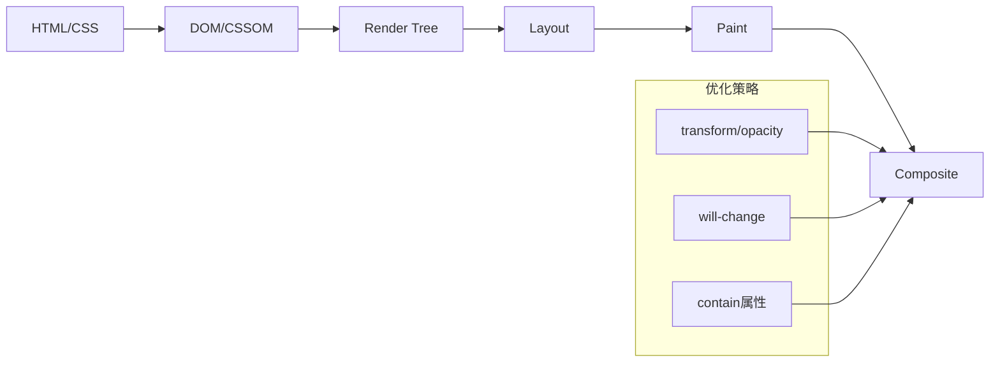

**图表来源**
- [docs/performance/rendering-optimization.md:16-35](file://docs/performance/rendering-optimization.md#L16-L35)

#### 重排重绘的影响

不同CSS属性对渲染性能的影响差异很大：

| 属性类别 | 触发类型 | 性能影响 | 优化建议 |
|---------|---------|---------|---------|
| transform | Composite | 最低 | 优先使用transform动画 |
| opacity | Composite | 最低 | 使用opacity切换 |
| color/background | Paint+Composite | 中等 | 避免频繁修改 |
| width/height | Layout+Paint+Composite | 最高 | 减少几何属性变更 |

**章节来源**
- [docs/performance/rendering-optimization.md:16-113](file://docs/performance/rendering-optimization.md#L16-L113)

### 加载性能优化

加载性能直接影响用户体验，特别是首屏加载时间。

#### 代码分割策略

```mermaid
graph TB
subgraph "Webpack配置"
A[splitChunks]
B[cacheGroups]
C[vendor]
D[common]
end
subgraph "路由懒加载"
E[lazy()]
F[Suspense]
G[fallback]
end
subgraph "组件懒加载"
H[按需加载]
I[条件渲染]
J[用户交互触发]
end
A --> B
B --> C
B --> D
E --> F
F --> G
H --> I
I --> J
```

**图表来源**
- [docs/performance/loading-optimization.md:116-144](file://docs/performance/loading-optimization.md#L116-L144)

#### 图片优化最佳实践

| 优化策略 | 实现方式 | 性能收益 | 适用场景 |
|---------|---------|---------|---------|
| 格式选择 | WebP/AVIF | 20-30% | 现代浏览器 |
| 响应式图片 | srcset/sizes | 15-25% | 多设备适配 |
| 懒加载 | loading="lazy" | 30-50% | 长页面 |
| CDN处理 | 动态压缩 | 10-20% | 大流量 |

**章节来源**
- [docs/performance/loading-optimization.md:96-285](file://docs/performance/loading-optimization.md#L96-L285)

### 内存优化策略

内存泄漏是影响应用长期性能的重要因素。

#### 常见内存泄漏场景

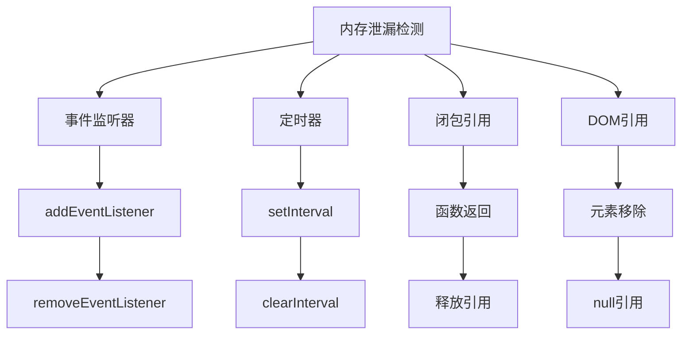

**图表来源**
- [docs/performance/rendering-optimization.md:501-561](file://docs/performance/rendering-optimization.md#L501-L561)

#### 防御性编程技巧

- 使用WeakMap避免对象引用导致的内存泄漏
- 及时清理定时器和事件监听器
- 在组件卸载时清理所有副作用
- 使用useEffect的清理函数模式

**章节来源**
- [docs/performance/rendering-optimization.md:501-596](file://docs/performance/rendering-optimization.md#L501-L596)

## 故障排除指南

### 性能问题诊断流程

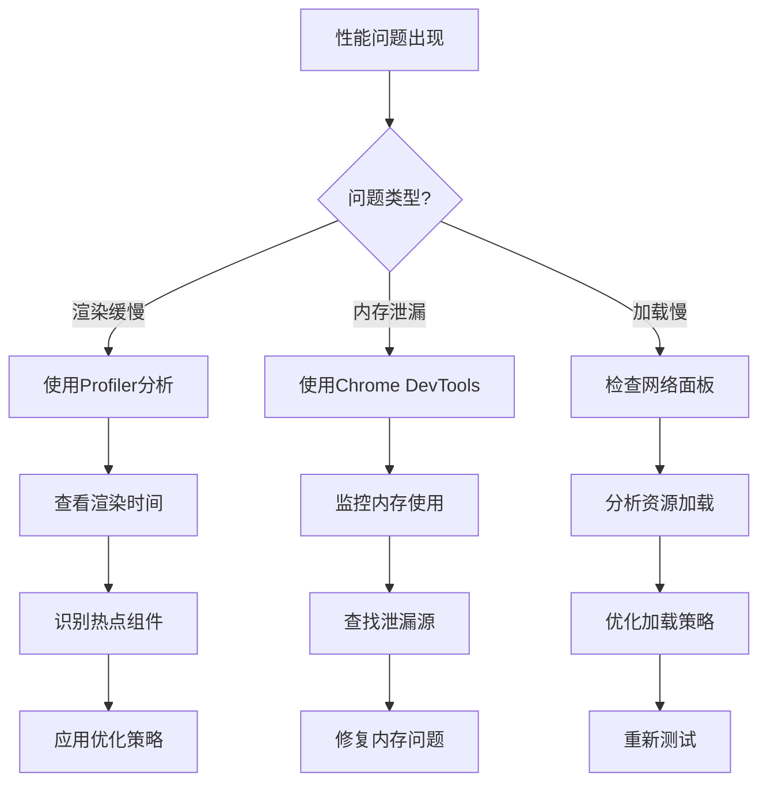

### 常见性能问题及解决方案

| 问题类型 | 诊断方法 | 解决方案 | 预防措施 |
|---------|---------|---------|---------|
| 组件重渲染频繁 | React DevTools Profiler | 使用React.memo/useMemo | 优化props比较 |
| 计算密集型操作 | 性能面板分析 | 使用Web Worker | 异步处理 |
| 大列表渲染卡顿 | 滚动性能测试 | 实施虚拟滚动 | 分页加载 |
| 内存泄漏 | 内存快照分析 | 清理事件监听器 | 生命周期管理 |

**章节来源**
- [docs/react/performance.md:104-127](file://docs/react/performance.md#L104-L127)
- [docs/performance/rendering-optimization.md:600-646](file://docs/performance/rendering-optimization.md#L600-L646)

## 结论

通过系统性地学习和应用这些性能优化技巧，开发者可以显著提升React应用的性能表现。关键在于：

1. **理解底层原理**：掌握Fiber架构、渲染流程和内存管理机制
2. **合理使用优化工具**：正确运用React.memo、useMemo、useCallback等工具
3. **实施分层优化**：从渲染层、计算层到加载层全方位优化
4. **建立监控体系**：持续监控性能指标，及时发现和解决问题
5. **预防性设计**：在开发初期就考虑性能因素，避免后期大规模重构

记住，性能优化是一个持续的过程，需要在开发实践中不断积累经验和优化策略。

## 附录

### 性能优化检查清单

- [ ] 组件重渲染分析和优化
- [ ] 依赖项检查和优化
- [ ] 大数据列表虚拟化
- [ ] 资源加载优化
- [ ] 内存使用监控
- [ ] 性能指标监控
- [ ] 用户体验测试

### 推荐学习资源

- React官方文档和源码
- Chrome DevTools性能面板
- Web性能优化最佳实践
- 社区性能优化案例研究