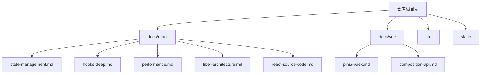
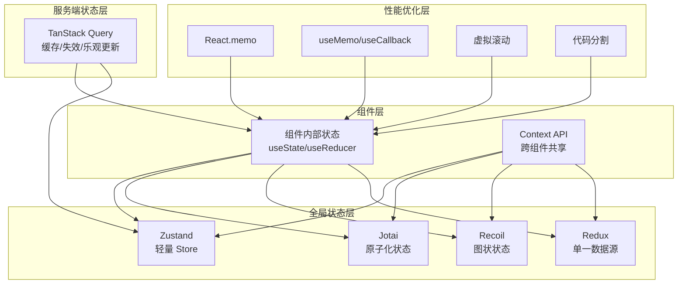
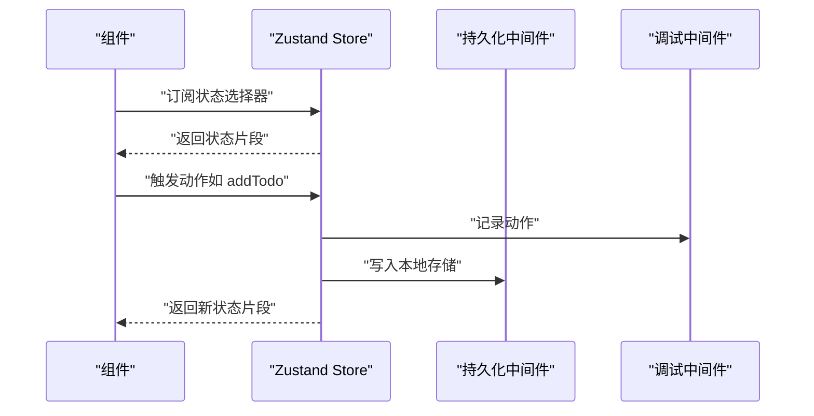
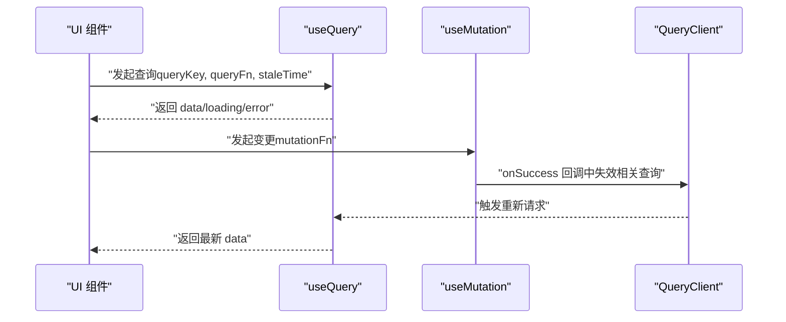
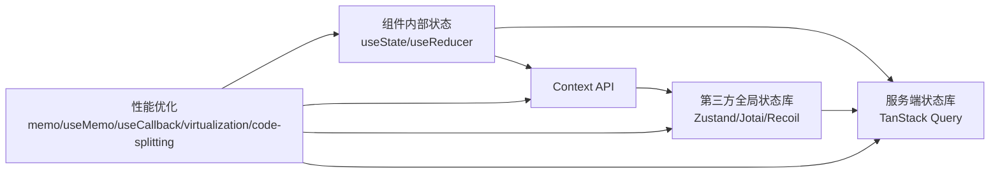

# 状态管理策略

<cite>
**本文引用的文件**
- [docs/react/state-management.md](file://docs/react/state-management.md)
- [docs/react/hooks-deep.md](file://docs/react/hooks-deep.md)
- [docs/react/performance.md](file://docs/react/performance.md)
- [docs/react/fiber-architecture.md](file://docs/react/fiber-architecture.md)
- [docs/react/react-source-code.md](file://docs/react/react-source-code.md)
- [docs/vue/pinia-vuex.md](file://docs/vue/pinia-vuex.md)
- [docs/vue/composition-api.md](file://docs/vue/composition-api.md)
- [README.md](file://README.md)
</cite>

## 目录
1. [引言](#引言)
2. [项目结构](#项目结构)
3. [核心组件](#核心组件)
4. [架构总览](#架构总览)
5. [详细组件分析](#详细组件分析)
6. [依赖分析](#依赖分析)
7. [性能考量](#性能考量)
8. [故障排查指南](#故障排查指南)
9. [结论](#结论)
10. [附录](#附录)

## 引言
本技术文档围绕 React 应用中的状态管理策略展开，系统梳理本地状态、全局状态、服务端状态同步等主题；深入讲解 Context API 的使用场景与性能考虑，useState/useReducer 的选择策略；并结合仓库现有资料，给出第三方状态管理库（Redux、Zustand、Jotai、Recoil）的适用场景建议。同时，提供状态提升、状态下沉、状态抽取等设计模式的实际应用思路，解释状态持久化、状态重置、状态同步等常见需求的解决方案，并结合项目实战经验，为不同规模与复杂度的应用提供状态管理方案选择指导。

## 项目结构
该仓库是一个基于 Docusaurus 的静态网站，React 相关的知识内容集中在 docs/react 目录下，涵盖状态管理、Hooks 深入、性能优化、Fiber 架构、React 源码解析等内容；Vue 相关的状态管理知识集中在 docs/vue 目录下，包含 Pinia/Vuex 对比与使用示例。整体结构清晰，便于读者按主题检索与学习。

图表来源
- [README.md:1-42](file://README.md#L1-L42)

章节来源
- [README.md:1-42](file://README.md#L1-L42)

## 核心组件
本节聚焦于 React 状态管理的关键概念与实践要点，结合仓库文档中的要点进行归纳总结。

- 本地状态管理
  - 组件内状态优先：通过 useState 管理简单组件内部状态，避免过早引入全局状态。
  - 提升共享状态：当多个组件需要共享状态时，将状态提升至最近公共祖先，再通过 props 传递。
  - 状态下沉：将状态下沉到更接近使用的组件，减少不必要的重渲染与耦合。
  - 状态抽取：将重复的状态逻辑抽取为自定义 Hook，提高复用性与可测试性。

- 全局状态管理
  - Context API：适用于主题、语言、用户偏好等轻量跨组件共享场景。
  - 第三方库：
    - Zustand：轻量 Store，API 简洁，支持中间件，适合中小型应用。
    - Jotai：原子化状态，适合细粒度状态管理。
    - Recoil：图状状态，适合复杂依赖关系。
    - Redux：单一数据源 + 纯函数，适合大型应用，但模板代码较多。

- 服务端状态同步
  - TanStack Query（原 React Query）：统一管理服务端状态，提供缓存、失效、乐观更新等能力，适合与后端 API 的数据同步。

- 设计模式
  - 状态提升：将共享状态提升到共同祖先，避免多处重复维护。
  - 状态下沉：将状态下沉到消费组件附近，降低上层组件的复杂度。
  - 状态抽取：封装为自定义 Hook，便于复用与测试。

- 常见需求
  - 状态持久化：使用中间件或插件（如 Zustand 的 persist、Pinia 的持久化插件）实现本地存储。
  - 状态重置：提供 reset 函数或 action，清空或恢复默认状态。
  - 状态同步：通过查询客户端状态与服务端状态的双向同步策略，确保一致性。

章节来源
- [docs/react/state-management.md:10-104](file://docs/react/state-management.md#L10-L104)
- [docs/react/hooks-deep.md:54-107](file://docs/react/hooks-deep.md#L54-L107)
- [docs/vue/pinia-vuex.md:10-191](file://docs/vue/pinia-vuex.md#L10-L191)

## 架构总览
下图展示了 React 应用中状态管理的整体架构：组件内部状态（useState/useReducer）负责局部逻辑；Context API 负责跨组件共享；第三方状态库（Zustand/Jotai/Recoil）负责全局状态；TanStack Query 负责服务端状态同步；性能优化手段（memo、useMemo/useCallback、虚拟滚动、代码分割）贯穿各层。

图表来源
- [docs/react/state-management.md:10-104](file://docs/react/state-management.md#L10-L104)
- [docs/react/performance.md:10-127](file://docs/react/performance.md#L10-L127)

## 详细组件分析

### Zustand（推荐）
Zustand 是一个轻量的 React 状态管理库，具备以下特点：
- 体积小（约 1KB），API 简洁，易于上手。
- 支持中间件，如 devtools、persist 等，便于调试与持久化。
- 适合中小型应用，替代 Context API 或 Redux Toolkit 的轻量方案。

实现要点（来自仓库示例）：
- 创建 Store：通过 create 定义状态与动作。
- 中间件：devtools 用于开发调试，persist 用于本地持久化。
- 组件使用：通过选择器订阅状态片段，避免无关重渲染。

图表来源
- [docs/react/state-management.md:21-65](file://docs/react/state-management.md#L21-L65)

章节来源
- [docs/react/state-management.md:21-65](file://docs/react/state-management.md#L21-L65)

### TanStack Query（服务端状态）
TanStack Query 提供统一的服务端状态管理能力：
- 查询缓存：通过 queryKey 管理缓存，支持 staleTime 控制新鲜度。
- 变更操作：useMutation 管理变更，成功后可主动失效相关查询。
- 乐观更新：可在变更成功后立即更新视图，提升用户体验。

图表来源
- [docs/react/state-management.md:67-96](file://docs/react/state-management.md#L67-L96)

章节来源
- [docs/react/state-management.md:67-96](file://docs/react/state-management.md#L67-L96)

### Context API 的使用与性能
Context API 适合轻量跨组件共享（如主题、语言），但不当使用会导致不必要的重渲染：
- 仅在必要时提升状态，避免过度提升造成组件耦合。
- 将 Context 的 Provider 层级尽量靠近使用点，减少上层组件重渲染。
- 结合 React.memo、useMemo/useCallback 降低渲染成本。

章节来源
- [docs/react/state-management.md:10-20](file://docs/react/state-management.md#L10-L20)
- [docs/react/performance.md:10-46](file://docs/react/performance.md#L10-L46)

### useState 与 useReducer 的选择策略
- 简单状态：优先使用 useState，逻辑清晰、易维护。
- 复杂状态与派生逻辑：使用 useReducer，将状态更新逻辑集中到 reducer，便于测试与演进。
- 与 Hooks 深入理解相结合：useReducer 内部基于 useState 实现，有助于把握底层机制。

章节来源
- [docs/react/state-management.md:14-17](file://docs/react/state-management.md#L14-L17)
- [docs/react/react-source-code.md:212-230](file://docs/react/react-source-code.md#L212-L230)

### 设计模式：状态提升、状态下沉、状态抽取
- 状态提升：将共享状态提升到最近公共祖先，通过 props 传递。
- 状态下沉：将状态下沉到消费组件附近，降低上层复杂度。
- 状态抽取：封装为自定义 Hook，复用状态逻辑，提升可测试性。

章节来源
- [docs/react/hooks-deep.md:54-107](file://docs/react/hooks-deep.md#L54-L107)

### 第三方状态管理库对比与适用场景
- Zustand：轻量、简洁、支持中间件，适合中小型应用。
- Jotai：原子化状态，适合细粒度状态管理。
- Recoil：图状状态，适合复杂依赖关系。
- Redux：单一数据源 + 纯函数，适合大型应用，但模板代码较多。

章节来源
- [docs/react/state-management.md:12-19](file://docs/react/state-management.md#L12-L19)

### 状态持久化、重置与同步
- 持久化：Zustand 的 persist 中间件、Pinia 的持久化插件均可实现本地存储。
- 重置：提供 reset 函数或 action，清空或恢复默认状态。
- 同步：通过查询客户端状态与服务端状态的双向同步策略，确保一致性。

章节来源
- [docs/react/state-management.md:25-65](file://docs/react/state-management.md#L25-L65)
- [docs/vue/pinia-vuex.md:150-182](file://docs/vue/pinia-vuex.md#L150-L182)

## 依赖分析
本节从概念层面梳理状态管理相关依赖关系与耦合度，帮助读者理解何时引入第三方库以及如何避免过度耦合。

图表来源
- [docs/react/state-management.md:10-104](file://docs/react/state-management.md#L10-L104)
- [docs/react/performance.md:10-127](file://docs/react/performance.md#L10-L127)

## 性能考量
- 渲染优化
  - React.memo：在 props 不变时跳过重渲染。
  - useMemo/useCallback：缓存计算结果与函数引用，减少子组件重渲染。
- 大列表优化
  - 虚拟滚动：使用 @tanstack/react-virtual 等库，仅渲染可视区域。
- 代码分割
  - 路由级别懒加载，减少首屏体积。
- 性能分析
  - 使用 React DevTools Profiler 进行性能分析与定位。

章节来源
- [docs/react/performance.md:10-127](file://docs/react/performance.md#L10-L127)

## 故障排查指南
- 常见问题
  - 状态未更新：检查是否正确使用选择器订阅状态片段，避免不必要的重渲染。
  - 性能问题：确认是否滥用 useMemo/useCallback，是否使用了 React.memo 与虚拟滚动。
  - 服务端状态未同步：确认 queryKey 设置是否一致，是否在 onSuccess 中调用了失效方法。
- 调试技巧
  - Zustand devtools：记录动作与状态变化，便于回放与调试。
  - React DevTools Profiler：定位长任务与重渲染热点。

章节来源
- [docs/react/state-management.md:98-104](file://docs/react/state-management.md#L98-L104)
- [docs/react/performance.md:104-127](file://docs/react/performance.md#L104-L127)

## 结论
- 优先使用组件内状态（useState），只在需要共享时提升。
- 服务端状态用 TanStack Query，客户端状态用 Zustand/Jotai。
- Redux Toolkit 简化了 Redux 的使用，但仍有较多模板代码。
- Zustand 体积小（约 1KB）、API 简洁、支持中间件，适合中小型应用。
- 在大型应用中，可考虑 Redux；在需要细粒度状态或复杂依赖关系时，可考虑 Jotai/Recoil。
- 结合性能优化手段（memo、useMemo/useCallback、虚拟滚动、代码分割）提升整体体验。

章节来源
- [docs/react/state-management.md:98-104](file://docs/react/state-management.md#L98-L104)

## 附录
- 相关文档索引
  - React 状态管理：[docs/react/state-management.md](file://docs/react/state-management.md)
  - Hooks 深入：[docs/react/hooks-deep.md](file://docs/react/hooks-deep.md)
  - 性能优化：[docs/react/performance.md](file://docs/react/performance.md)
  - Fiber 架构：[docs/react/fiber-architecture.md](file://docs/react/fiber-architecture.md)
  - React 源码解析：[docs/react/react-source-code.md](file://docs/react/react-source-code.md)
  - Vue 状态管理（Pinia/Vuex）：[docs/vue/pinia-vuex.md](file://docs/vue/pinia-vuex.md)
  - Vue 组合式 API：[docs/vue/composition-api.md](file://docs/vue/composition-api.md)