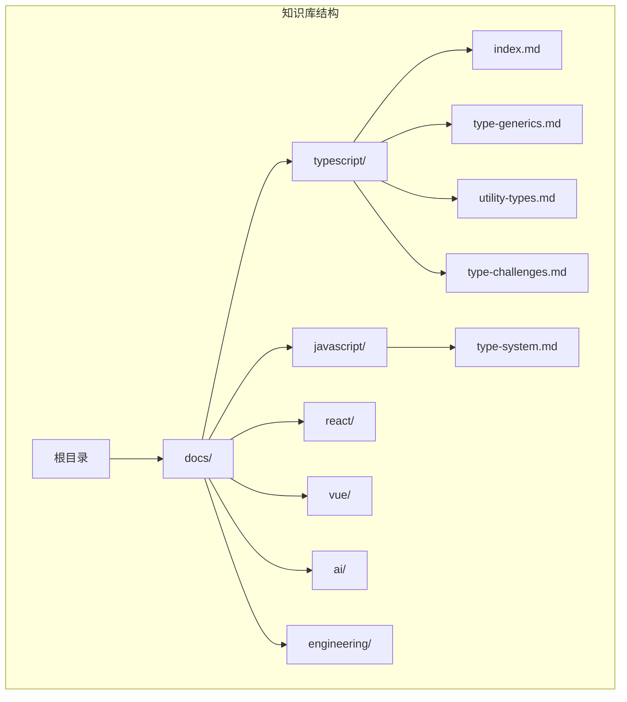
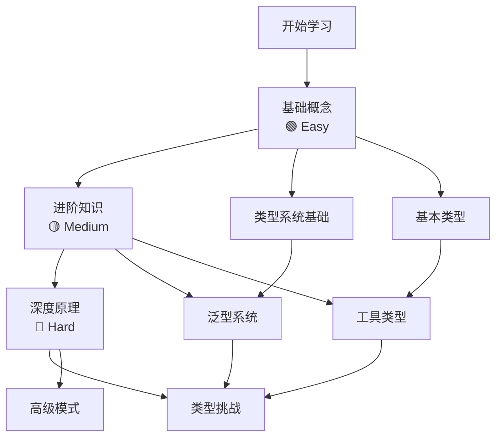
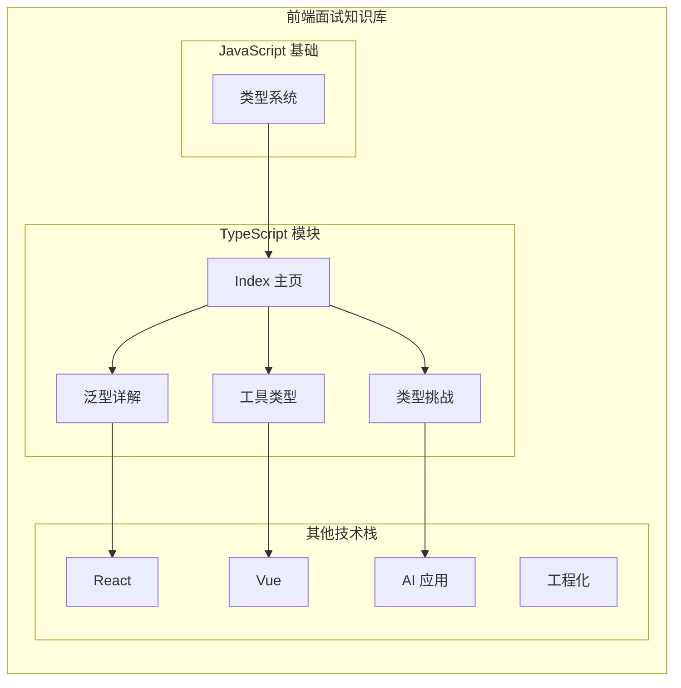
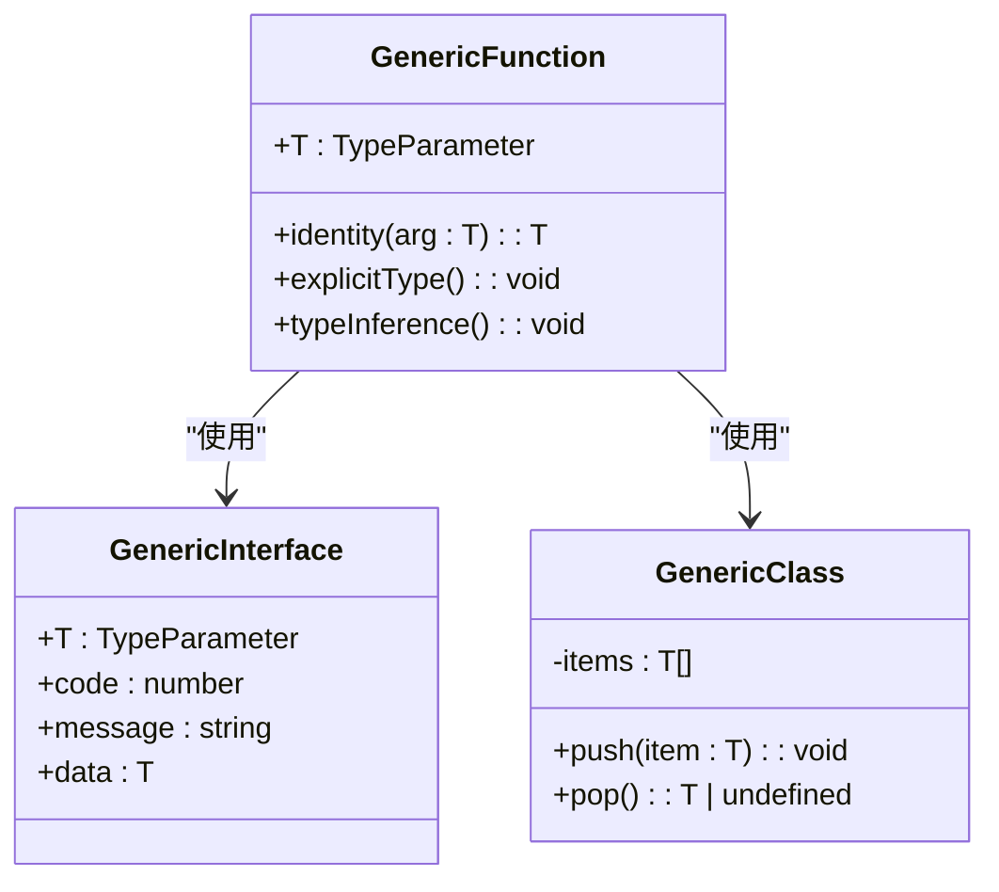
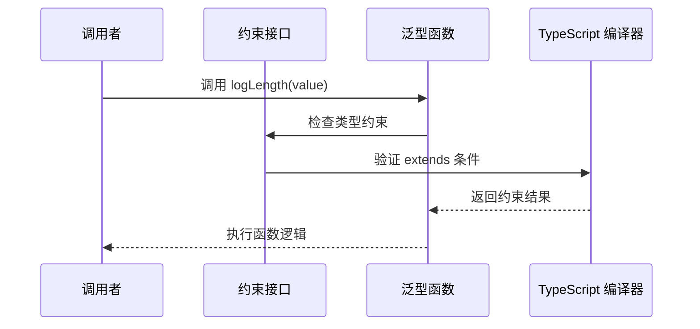
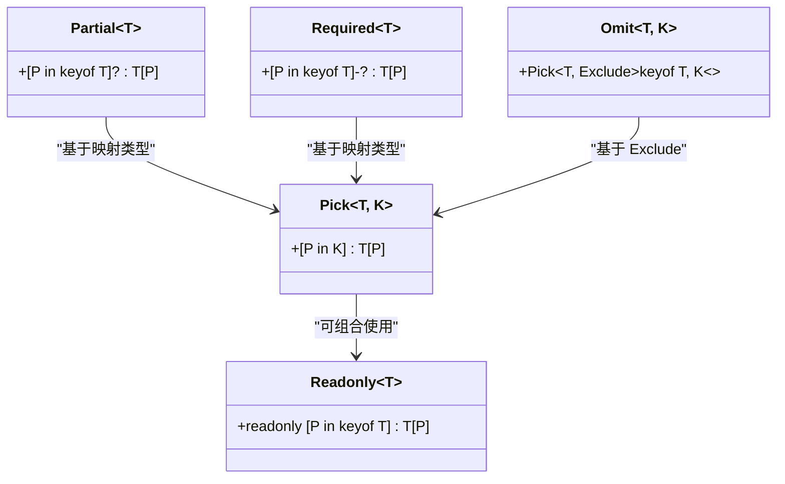
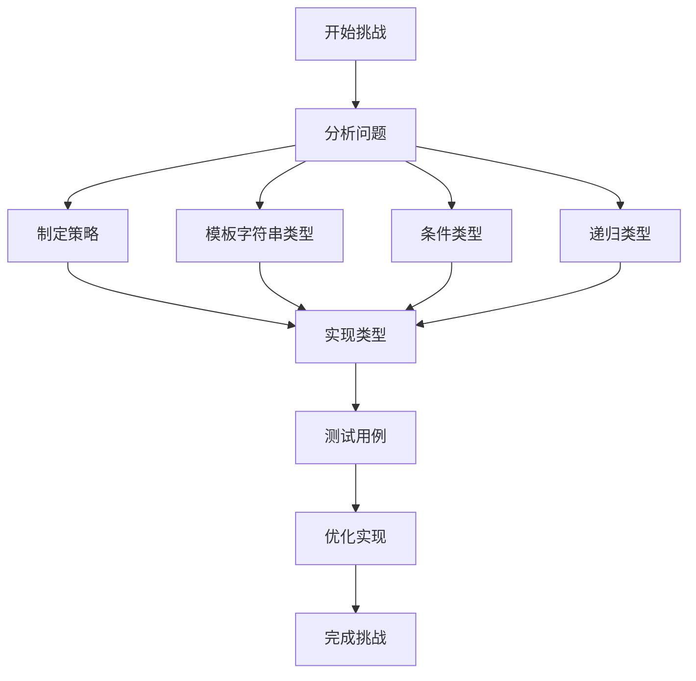
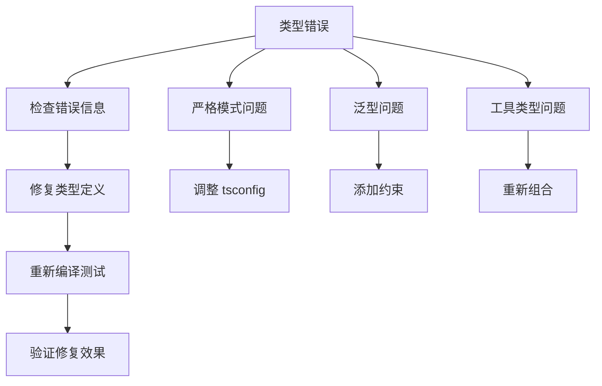

# TypeScript 进阶应用

<cite>
**本文档引用的文件**
- [docs/typescript/index.md](file://docs/typescript/index.md)
- [docs/typescript/type-generics.md](file://docs/typescript/type-generics.md)
- [docs/typescript/utility-types.md](file://docs/typescript/utility-types.md)
- [docs/typescript/type-challenges.md](file://docs/typescript/type-challenges.md)
- [docs/javascript/type-system.md](file://docs/javascript/type-system.md)
- [docs/intro.md](file://docs/intro.md)
- [package.json](file://package.json)
- [tsconfig.json](file://tsconfig.json)
</cite>

## 目录
1. [引言](#引言)
2. [项目结构](#项目结构)
3. [核心组件](#核心组件)
4. [架构概览](#架构概览)
5. [详细组件分析](#详细组件分析)
6. [依赖关系分析](#依赖关系分析)
7. [性能考虑](#性能考虑)
8. [故障排除指南](#故障排除指南)
9. [结论](#结论)
10. [附录](#附录)

## 引言

本知识库专注于 TypeScript 进阶应用，为不同水平的开发者提供从基础到高级的完整学习路径。TypeScript 作为 JavaScript 的超集，通过静态类型系统为大型前端项目提供了强大的类型安全保障和开发体验提升。

本知识库涵盖了 TypeScript 的核心特性，包括泛型系统、工具类型、类型挑战等高级概念，旨在帮助开发者在实际项目中充分发挥 TypeScript 的价值。

## 项目结构

该知识库采用模块化的文档组织方式，每个主题都有独立的文档文件，便于学习者按需选择学习内容。



**图表来源**
- [docs/typescript/index.md:1-16](file://docs/typescript/index.md#L1-L16)
- [docs/typescript/type-generics.md:1-107](file://docs/typescript/type-generics.md#L1-L107)
- [docs/typescript/utility-types.md:1-94](file://docs/typescript/utility-types.md#L1-L94)
- [docs/typescript/type-challenges.md:1-98](file://docs/typescript/type-challenges.md#L1-L98)

**章节来源**
- [docs/typescript/index.md:1-16](file://docs/typescript/index.md#L1-L16)
- [docs/intro.md:1-35](file://docs/intro.md#L1-L35)

## 核心组件

### TypeScript 学习路径

知识库为不同技能水平的开发者设计了清晰的学习路径：



**图表来源**
- [docs/intro.md:21-25](file://docs/intro.md#L21-L25)

### 技术栈配置

项目使用现代的 TypeScript 配置，确保开发体验和类型检查的准确性。

**章节来源**
- [package.json:1-50](file://package.json#L1-L50)
- [tsconfig.json:1-13](file://tsconfig.json#L1-L13)

## 架构概览

### 文档架构设计



**图表来源**
- [docs/intro.md:8-35](file://docs/intro.md#L8-L35)
- [docs/typescript/index.md:1-16](file://docs/typescript/index.md#L1-L16)

### 开发环境配置

项目采用严格的 TypeScript 配置，确保类型安全性和开发体验：

**章节来源**
- [package.json:17-33](file://package.json#L17-L33)
- [tsconfig.json:6-10](file://tsconfig.json#L6-L10)

## 详细组件分析

### 泛型系统详解

#### 泛型基础概念

泛型是 TypeScript 类型系统的核心特性，它允许创建可复用的组件，支持多种类型而非单一类型。



**图表来源**
- [docs/typescript/type-generics.md:14-36](file://docs/typescript/type-generics.md#L14-L36)

#### 泛型约束机制

泛型约束通过 `extends` 关键字限制类型参数的范围，确保类型的安全性。



**图表来源**
- [docs/typescript/type-generics.md:40-63](file://docs/typescript/type-generics.md#L40-L63)

**章节来源**
- [docs/typescript/type-generics.md:10-107](file://docs/typescript/type-generics.md#L10-L107)

### 工具类型系统

#### 内置工具类型的实现原理

TypeScript 提供了丰富的内置工具类型，这些类型都是通过条件类型和映射类型实现的。



**图表来源**
- [docs/typescript/utility-types.md:88-98](file://docs/typescript/utility-types.md#L88-L98)

#### 实战应用场景

工具类型在实际项目中的应用展示了其强大的类型安全能力。

**章节来源**
- [docs/typescript/utility-types.md:10-94](file://docs/typescript/utility-types.md#L10-L94)

### 类型挑战实战

#### 高级类型编程技巧

类型挑战体现了 TypeScript 类型系统的强大表达能力，涉及递归、条件类型、模板字符串类型等多个高级特性。



**图表来源**
- [docs/typescript/type-challenges.md:92-98](file://docs/typescript/type-challenges.md#L92-L98)

**章节来源**
- [docs/typescript/type-challenges.md:1-98](file://docs/typescript/type-challenges.md#L1-L98)

## 依赖关系分析

### 技术栈依赖

```mermaid
graph TB
subgraph "运行时依赖"
React[react ^19.0.0]
ReactDOM[react-dom ^19.0.0]
Docusaurus[@docusaurus/core 3.10.1]
end
subgraph "开发时依赖"
TypeScript[typescript ~6.0.2]
DocusaurusTypes[@docusaurus/types 3.10.1]
DocusaurusTSConfig[@docusaurus/tsconfig 3.10.1]
end
subgraph "构建工具"
MDX[MDX-JS]
Prism[Prism React Renderer]
CLSX[CLSX]
end
Docusaurus --> React
Docusaurus --> ReactDOM
Docusaurus --> MDX
Docusaurus --> Prism
Docusaurus --> CLSX
TypeScript --> DocusaurusTypes
TypeScript --> DocusaurusTSConfig
```

**图表来源**
- [package.json:17-33](file://package.json#L17-L33)

### 类型系统依赖关系

TypeScript 的类型系统建立在 JavaScript 基础之上，提供了额外的类型安全保障。

**章节来源**
- [package.json:1-50](file://package.json#L1-L50)
- [tsconfig.json:1-13](file://tsconfig.json#L1-L13)

## 性能考虑

### 编译时与运行时性能

TypeScript 的类型信息在编译时被完全移除，不会影响运行时性能：

- **编译时开销**：类型检查和编译过程
- **运行时性能**：零运行时开销（类型信息被擦除）
- **开发体验**：IDE 支持、智能提示、错误检测

### 最佳实践建议

1. **合理使用泛型**：避免过度复杂的泛型定义
2. **组合工具类型**：利用现有工具类型减少重复代码
3. **保持可读性**：在保证类型安全的前提下提高代码可读性
4. **渐进式采用**：在现有项目中逐步引入 TypeScript

## 故障排除指南

### 常见类型错误



### 调试技巧

1. **启用严格模式**：在 tsconfig 中设置严格模式选项
2. **使用类型断言**：在必要时使用类型断言进行调试
3. **分步编译**：逐步注释代码定位问题
4. **查看编译输出**：使用 tsc --noEmit 查看类型检查结果

**章节来源**
- [tsconfig.json:6-10](file://tsconfig.json#L6-L10)

## 结论

本知识库为 TypeScript 进阶应用提供了系统性的学习路径，从基础概念到高级技巧，涵盖了现代前端开发中 TypeScript 的核心应用场景。

通过深入理解泛型系统、工具类型和类型挑战，开发者可以在大型项目中充分利用 TypeScript 的类型安全保障，提高代码质量和开发效率。同时，知识库强调了在实际项目中保持代码可读性和实用性的平衡，避免过度复杂的类型编程。

## 附录

### 学习资源推荐

- **官方文档**：TypeScript 官方文档和手册
- **实践项目**：在实际项目中应用学到的概念
- **社区资源**：TypeScript 社区的最佳实践分享
- **持续学习**：关注 TypeScript 新版本的功能更新

### 快速参考

- **难度等级**：🟢 Easy（基础）🟡 Medium（进阶）🔴 Hard（高级）
- **学习顺序**：建议按照难度等级循序渐进学习
- **实践建议**：理论结合实践，多做类型挑战练习
- **团队协作**：在团队中推广 TypeScript 最佳实践