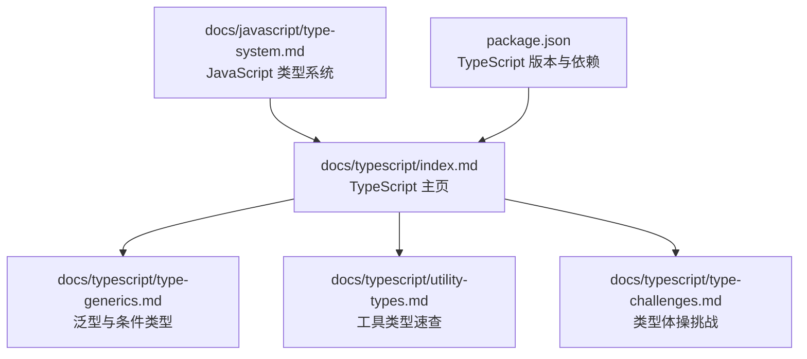
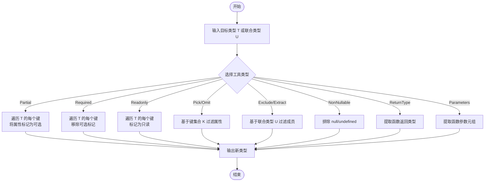
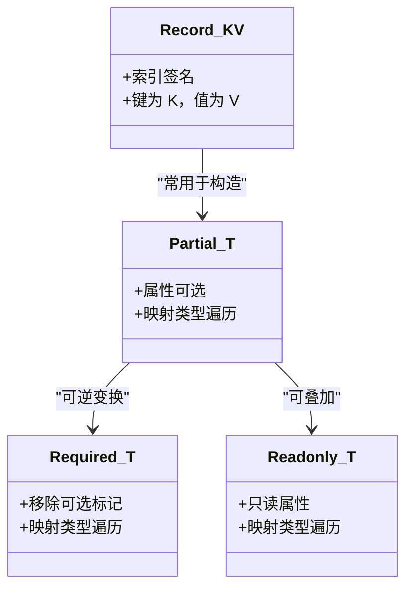
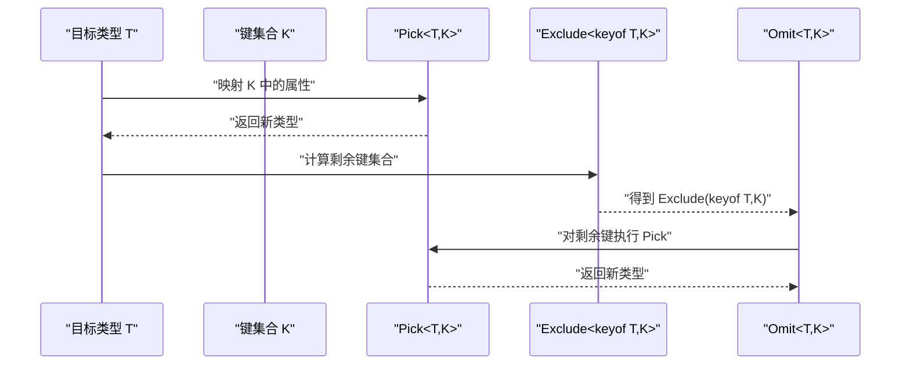
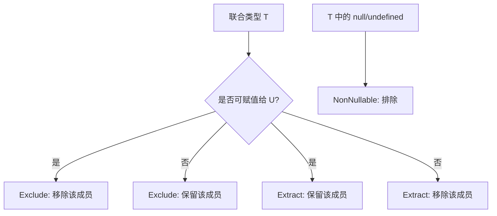
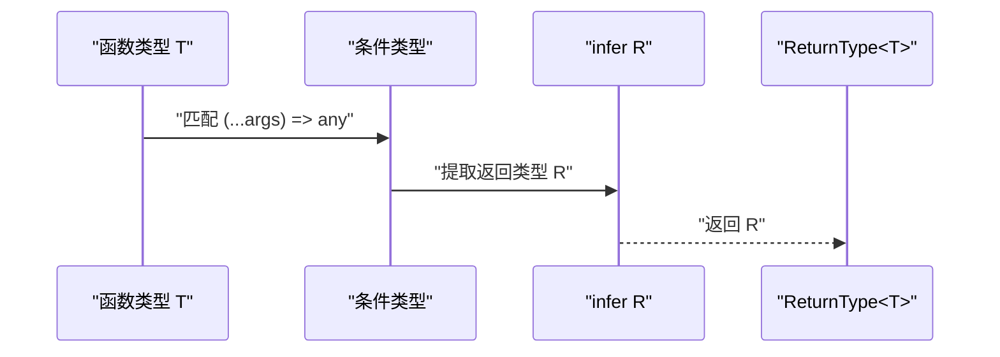
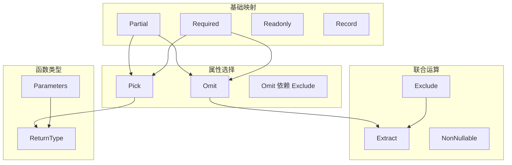

# 工具类型详解

<cite>
**本文档引用的文件**
- [utility-types.md](file://docs/typescript/utility-types.md)
- [type-generics.md](file://docs/typescript/type-generics.md)
- [type-challenges.md](file://docs/typescript/type-challenges.md)
- [type-system.md](file://docs/javascript/type-system.md)
- [index.md](file://docs/typescript/index.md)
- [package.json](file://package.json)
</cite>

## 目录
1. [简介](#简介)
2. [项目结构](#项目结构)
3. [核心组件](#核心组件)
4. [架构概览](#架构概览)
5. [详细组件分析](#详细组件分析)
6. [依赖关系分析](#依赖关系分析)
7. [性能考量](#性能考量)
8. [故障排查指南](#故障排查指南)
9. [结论](#结论)
10. [附录](#附录)

## 简介
本文件系统化梳理 TypeScript 内置工具类型的实现原理与实践应用，重点覆盖以下类型：
- 基础变换：Partial、Required、Readonly、Record
- 属性选择：Pick、Omit
- 联合类型运算：Exclude、Extract、NonNullable
- 函数类型：ReturnType、Parameters
- 进阶应用：InstanceType、ThisParameterType、OmitThisParameter、Uppercase/Lowercase/Capitalize/Uncapitalize 等

通过源码级实现机制解读、组合使用范式、实战场景（API 设计、表单处理、状态管理）以及性能与注意事项，帮助读者建立完整的工具类型知识体系。

## 项目结构
该仓库采用 Docusaurus 文档站点组织方式，TypeScript 相关内容分布在 docs/typescript 目录下，配合 JavaScript 类型系统基础文档形成完整知识链路。

图表来源
- [index.md:1-16](file://docs/typescript/index.md#L1-L16)
- [type-generics.md:1-107](file://docs/typescript/type-generics.md#L1-L107)
- [utility-types.md:1-94](file://docs/typescript/utility-types.md#L1-L94)
- [type-challenges.md:1-98](file://docs/typescript/type-challenges.md#L1-L98)
- [type-system.md:1-68](file://docs/javascript/type-system.md#L1-L68)
- [package.json:1-50](file://package.json#L1-L50)

章节来源
- [index.md:1-16](file://docs/typescript/index.md#L1-L16)
- [package.json:1-50](file://package.json#L1-L50)

## 核心组件
本节聚焦于 TypeScript 内置工具类型的定义与行为特征，结合源码级实现机制进行深入解析。

- Partial<T>
  - 作用：将对象类型的所有属性标记为可选
  - 实现机制：映射类型 + 可选属性修饰符
  - 复杂度：时间复杂度 O(n)，空间复杂度 O(n)，n 为属性数量
  - 典型场景：表单更新、部分字段补全、API PATCH 请求体

- Required<T>
  - 作用：移除所有属性的可选标记
  - 实现机制：映射类型 + 必选属性修饰符
  - 典型场景：与 Partial 组合实现“部分可选 + 部分必选”的复合类型

- Readonly<T>
  - 作用：将对象类型的所有属性标记为只读
  - 实现机制：映射类型 + 只读修饰符
  - 典型场景：配置对象、状态快照、不可变数据流

- Record<K, V>
  - 作用：构造“键为 K、值为 V”的映射类型
  - 实现机制：索引签名
  - 典型场景：状态映射、配置字典、事件处理器注册表

- Pick<T, K>
  - 作用：从 T 中选取 K 对应的属性集合
  - 实现机制：映射类型 + 交集键名
  - 典型场景：接口裁剪、字段白名单

- Omit<T, K>
  - 作用：从 T 中排除 K 对应的属性集合
  - 实现机制：Pick + Exclude 的组合
  - 典型场景：接口去噪、字段黑名单

- Exclude<T, U>
  - 作用：从联合类型 T 中排除可赋值给 U 的成员
  - 实现机制：条件类型 + infer
  - 典型场景：枚举过滤、状态机状态剔除

- Extract<T, U>
  - 作用：从联合类型 T 中提取可赋值给 U 的成员
  - 实现机制：条件类型 + infer
  - 典型场景：类型筛选、状态机状态保留

- NonNullable<T>
  - 作用：排除 T 中的 null 与 undefined
  - 实现机制：条件类型
  - 典型场景：输入校验、安全访问

- ReturnType<T>
  - 作用：获取函数类型 T 的返回类型
  - 实现机制：条件类型 + infer
  - 典型场景：高阶函数、装饰器、异步结果类型推导

- Parameters<T>
  - 作用：获取函数类型 T 的参数元组类型
  - 实现机制：条件类型 + infer
  - 典型场景：函数签名提取、中间件参数传递

- 进阶工具类型
  - InstanceType<T>：获取构造函数类型 T 的实例类型
  - ThisParameterType<T>：提取函数类型 T 的 this 参数类型
  - OmitThisParameter<T>：移除函数类型 T 的 this 参数
  - Uppercase/Lowercase/Capitalize/Uncapitalize：字符串模板类型中的大小写转换

章节来源
- [utility-types.md:10-61](file://docs/typescript/utility-types.md#L10-L61)
- [type-generics.md:85-99](file://docs/typescript/type-generics.md#L85-L99)
- [type-generics.md:65-83](file://docs/typescript/type-generics.md#L65-L83)

## 架构概览
工具类型在 TypeScript 类型系统中的工作流程如下：

图表来源
- [utility-types.md:10-61](file://docs/typescript/utility-types.md#L10-L61)
- [type-generics.md:85-99](file://docs/typescript/type-generics.md#L85-L99)
- [type-generics.md:65-83](file://docs/typescript/type-generics.md#L65-L83)

## 详细组件分析

### 基础变换类型：Partial、Required、Readonly、Record
- 实现模式
  - 映射类型：通过 [P in keyof T] 遍历对象属性
  - 属性修饰符：?（可选）、-（移除可选）、+（强制必选）、readonly（只读）
  - 索引签名：Record<K, V> 使用 [P: K] 的索引签名
- 性能特征
  - 时间复杂度：O(n)，n 为属性数量
  - 空间复杂度：O(n)，生成新的属性映射
- 实践建议
  - 优先使用 Pick/Omit 进行字段级裁剪，避免不必要的 Partial/Required
  - Readonly 适用于配置对象或状态快照，防止意外修改

图表来源
- [type-generics.md:88-92](file://docs/typescript/type-generics.md#L88-L92)
- [utility-types.md:38-39](file://docs/typescript/utility-types.md#L38-L39)

章节来源
- [utility-types.md:20-29](file://docs/typescript/utility-types.md#L20-L29)
- [type-generics.md:88-92](file://docs/typescript/type-generics.md#L88-L92)

### 属性选择类型：Pick、Omit
- 实现要点
  - Pick<T, K extends keyof T>：直接映射 K 中的属性
  - Omit<T, K extends keyof T>：通过 Exclude<keyof T, K> 计算剩余键集合，再调用 Pick
- 复杂度
  - Pick：O(k)，k 为 K 的长度
  - Omit：O(t)，t 为 T 的属性总数
- 组合使用
  - Pick + Partial：实现“部分字段可选”的复合类型
  - Pick + Required：实现“部分字段必选”的复合类型

图表来源
- [type-generics.md:94-98](file://docs/typescript/type-generics.md#L94-L98)

章节来源
- [utility-types.md:30-36](file://docs/typescript/utility-types.md#L30-L36)
- [type-generics.md:94-98](file://docs/typescript/type-generics.md#L94-L98)

### 联合类型运算：Exclude、Extract、NonNullable
- Exclude<T, U>
  - 语义：从 T 中排除可赋值给 U 的成员
  - 应用：状态过滤、权限控制、枚举剔除
- Extract<T, U>
  - 语义：从 T 中提取可赋值给 U 的成员
  - 应用：类型筛选、状态保留
- NonNullable<T>
  - 语义：排除 null 与 undefined
  - 应用：输入校验、安全访问、防空指针

图表来源
- [utility-types.md:41-52](file://docs/typescript/utility-types.md#L41-L52)

章节来源
- [utility-types.md:41-52](file://docs/typescript/utility-types.md#L41-L52)

### 函数类型：ReturnType、Parameters
- ReturnType<T>
  - 机制：条件类型 + infer 提取函数返回类型
  - 场景：高阶函数、装饰器、异步结果类型推导
- Parameters<T>
  - 机制：条件类型 + infer 提取函数参数元组
  - 场景：中间件参数传递、函数签名提取

图表来源
- [type-generics.md:74-78](file://docs/typescript/type-generics.md#L74-L78)

章节来源
- [utility-types.md:54-60](file://docs/typescript/utility-types.md#L54-L60)
- [type-generics.md:74-78](file://docs/typescript/type-generics.md#L74-L78)

### 进阶工具类型与组合策略
- InstanceType<T>
  - 用途：获取构造函数类型 T 的实例类型
  - 场景：工厂函数、依赖注入容器
- ThisParameterType<T> / OmitThisParameter<T>
  - 用途：提取/移除函数的 this 参数类型
  - 场景：回调函数签名兼容、事件处理器类型推导
- 字符串模板类型：Uppercase/Lowercase/Capitalize/Uncapitalize
  - 用途：类型层面的字符串大小写转换
  - 场景：API 字段命名规范、枚举键生成

章节来源
- [utility-types.md:54-60](file://docs/typescript/utility-types.md#L54-L60)
- [type-generics.md:65-83](file://docs/typescript/type-generics.md#L65-L83)

## 依赖关系分析
工具类型之间的依赖与组合关系如下：

图表来源
- [type-generics.md:88-99](file://docs/typescript/type-generics.md#L88-L99)
- [utility-types.md:30-60](file://docs/typescript/utility-types.md#L30-L60)

章节来源
- [type-generics.md:88-99](file://docs/typescript/type-generics.md#L88-L99)
- [utility-types.md:30-60](file://docs/typescript/utility-types.md#L30-L60)

## 性能考量
- 编译期开销
  - 工具类型均为编译期类型变换，不引入运行时开销
  - 复杂嵌套的映射类型可能增加编译时间，建议保持可读性优先
- 类型深度与复杂度
  - 深度嵌套的映射类型（如 DeepReadonly）在大型接口上会显著增加编译负担
  - 建议仅在必要时使用深度变换，避免过度工程化
- 组合策略
  - 将多个工具类型组合使用时，注意中间类型的复杂度增长
  - 优先使用 Pick/Omit 进行字段级裁剪，减少不必要的属性遍历

章节来源
- [type-generics.md:101-107](file://docs/typescript/type-generics.md#L101-L107)
- [type-challenges.md:92-98](file://docs/typescript/type-challenges.md#L92-L98)

## 故障排查指南
- 常见问题
  - 键名不存在：当 K 不在 keyof T 中时，Pick/Omit 会报错
  - 可选性冲突：Partial 与 Required 的组合需谨慎，避免相互抵消
  - 函数签名不匹配：ReturnType/Parameters 依赖严格的函数签名
- 调试技巧
  - 使用 TypeScript Playground 分步查看中间类型
  - 将复杂类型拆分为多个简单工具类型组合，便于定位问题
  - 对大型接口使用 Pick/Omit 进行局部调试
- 最佳实践
  - 保持类型定义简洁，避免过度复杂的类型体操
  - 在团队内约定工具类型使用规范，统一命名与组合策略

章节来源
- [type-generics.md:101-107](file://docs/typescript/type-generics.md#L101-L107)
- [type-challenges.md:92-98](file://docs/typescript/type-challenges.md#L92-L98)

## 结论
TypeScript 工具类型是类型系统的重要组成部分，通过映射类型、条件类型与 infer 的组合，实现了强大的类型变换能力。掌握这些工具类型的实现原理与适用场景，能够显著提升 API 接口设计、表单处理、状态管理等领域的类型安全性与开发效率。建议在实际项目中遵循“可读性优先”的原则，合理组合使用工具类型，避免过度工程化带来的维护成本。

## 附录

### 实战应用场景
- API 接口设计
  - 使用 Partial 实现 PATCH 请求体的“部分字段可选”
  - 使用 Pick/Omit 裁剪响应模型，去除敏感字段
  - 使用 ReturnType/Parameters 提取接口签名，统一错误处理
- 表单处理
  - 使用 Partial<Record<keyof T, string>> 构造表单错误映射
  - 使用 Partial<Record<keyof T, boolean>> 标记字段交互状态
- 状态管理
  - 使用 Readonly 包装全局状态，防止意外修改
  - 使用 Record 构造状态映射，支持动态键值扩展

章节来源
- [utility-types.md:63-86](file://docs/typescript/utility-types.md#L63-L86)

### 相关资源
- TypeScript 官方文档与版本信息
  - 当前项目使用 TypeScript ~6.0.2，建议关注版本差异带来的工具类型行为变化

章节来源
- [package.json:27-33](file://package.json#L27-L33)