# 泛型系统深入

<cite>
**本文档引用的文件**
- [type-generics.md](file://docs/typescript/type-generics.md)
- [utility-types.md](file://docs/typescript/utility-types.md)
- [type-challenges.md](file://docs/typescript/type-challenges.md)
- [type-system.md](file://docs/javascript/type-system.md)
- [index.md](file://docs/typescript/index.md)
- [package.json](file://package.json)
- [tsconfig.json](file://tsconfig.json)
</cite>

## 目录
1. [引言](#引言)
2. [项目结构](#项目结构)
3. [核心组件](#核心组件)
4. [架构概览](#架构概览)
5. [详细组件分析](#详细组件分析)
6. [依赖分析](#依赖分析)
7. [性能考虑](#性能考虑)
8. [故障排除指南](#故障排除指南)
9. [结论](#结论)
10. [附录](#附录)

## 引言

TypeScript 泛型系统是现代前端开发中不可或缺的重要特性，它为开发者提供了强大的类型安全性和代码复用能力。本项目专注于深入讲解 TypeScript 泛型系统，涵盖从基础概念到高级应用的完整知识体系。

泛型允许你创建可复用的组件，这些组件可以支持多种类型而非单一类型。通过泛型，你可以编写更加灵活和类型安全的代码，避免重复的类型声明，提升代码的可维护性和可扩展性。

本项目基于 Docusaurus 静态站点生成器构建，采用 Markdown 格式组织内容，配合 TypeScript 类型检查确保文档质量。项目结构清晰，分为多个主题模块，每个模块都专注于泛型系统的特定方面。

## 项目结构

该项目采用模块化的文档组织方式，专门针对 TypeScript 泛型系统进行深入讲解：

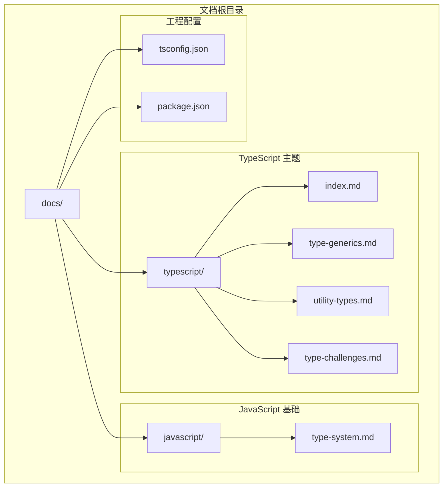

**图表来源**
- [index.md:1-16](file://docs/typescript/index.md#L1-L16)
- [type-generics.md:1-107](file://docs/typescript/type-generics.md#L1-L107)
- [utility-types.md:1-94](file://docs/typescript/utility-types.md#L1-L94)
- [type-challenges.md:1-98](file://docs/typescript/type-challenges.md#L1-L98)

**章节来源**
- [index.md:1-16](file://docs/typescript/index.md#L1-L16)
- [package.json:1-50](file://package.json#L1-L50)
- [tsconfig.json:1-13](file://tsconfig.json#L1-L13)

## 核心组件

### 泛型基础概念

泛型是 TypeScript 类型系统的核心特性之一，它允许你创建可复用的组件，这些组件可以支持多种类型而非单一类型。

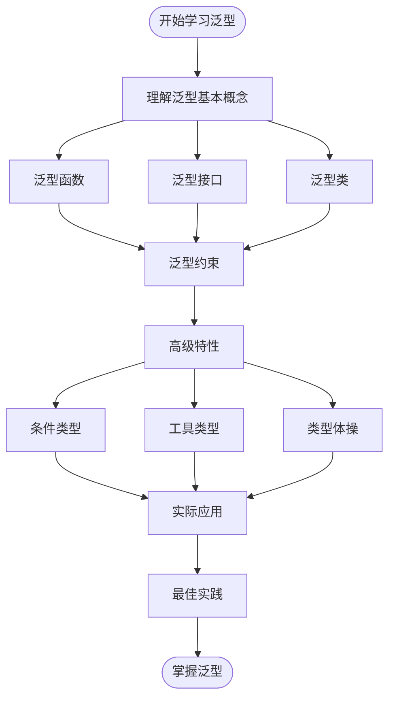

**图表来源**
- [type-generics.md:10-36](file://docs/typescript/type-generics.md#L10-L36)

### 泛型约束系统

泛型约束是限制泛型参数可用类型的机制，通过 `extends` 关键字实现：

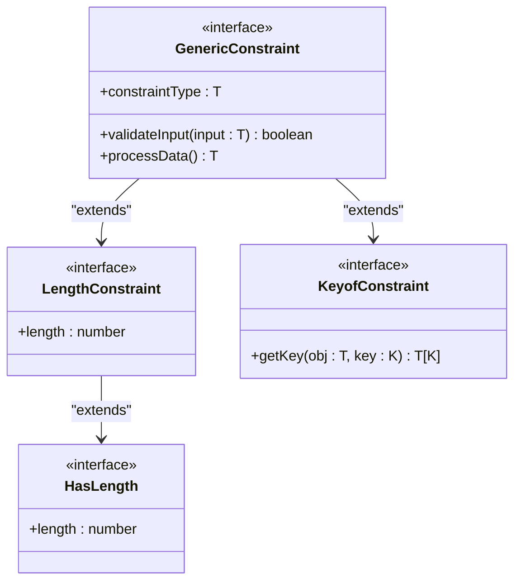

**图表来源**
- [type-generics.md:38-63](file://docs/typescript/type-generics.md#L38-L63)

**章节来源**
- [type-generics.md:10-107](file://docs/typescript/type-generics.md#L10-L107)

## 架构概览

### 泛型系统整体架构

TypeScript 泛型系统由多个层次组成，从基础的类型参数到高级的条件类型和工具类型：

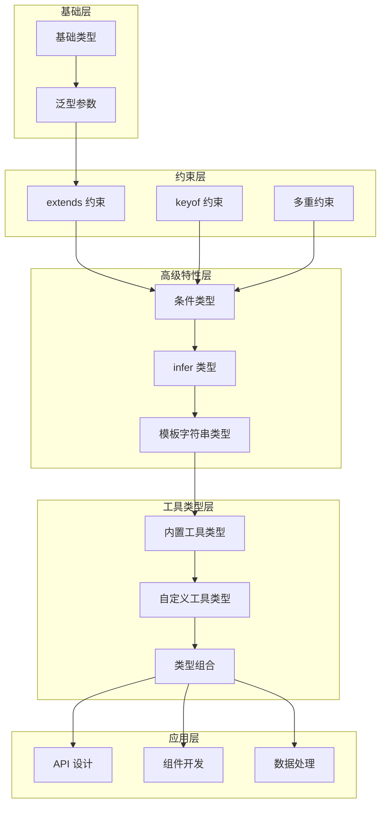

**图表来源**
- [type-generics.md:65-99](file://docs/typescript/type-generics.md#L65-L99)
- [utility-types.md:10-61](file://docs/typescript/utility-types.md#L10-L61)

### 类型系统集成架构

TypeScript 泛型系统与底层类型系统紧密集成：

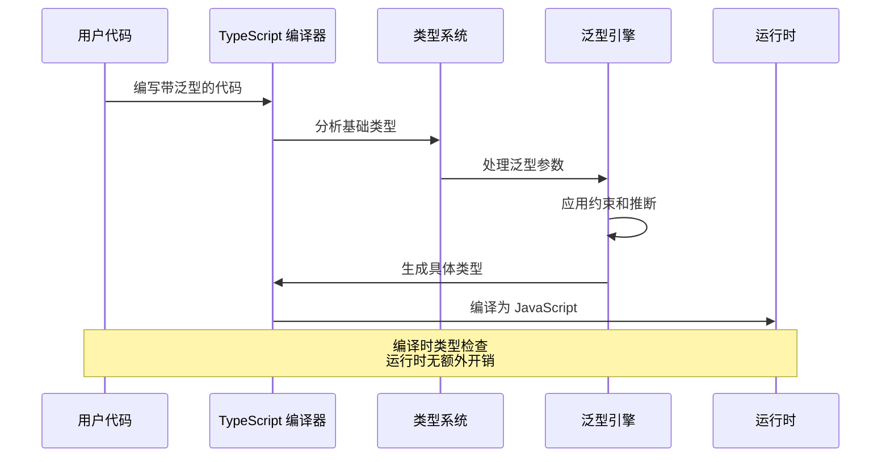

**图表来源**
- [type-generics.md:101-107](file://docs/typescript/type-generics.md#L101-L107)

## 详细组件分析

### 泛型函数详解

泛型函数是最常用的泛型形式，允许你在不牺牲类型安全性的前提下创建可复用的函数。

#### 基础泛型函数模式

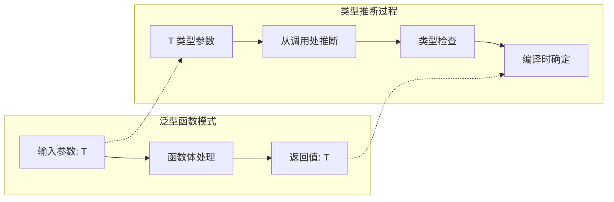

**图表来源**
- [type-generics.md:14-22](file://docs/typescript/type-generics.md#L14-L22)

#### 泛型函数的实际应用

在 API 设计中，泛型函数可以提供类型安全的数据传输：

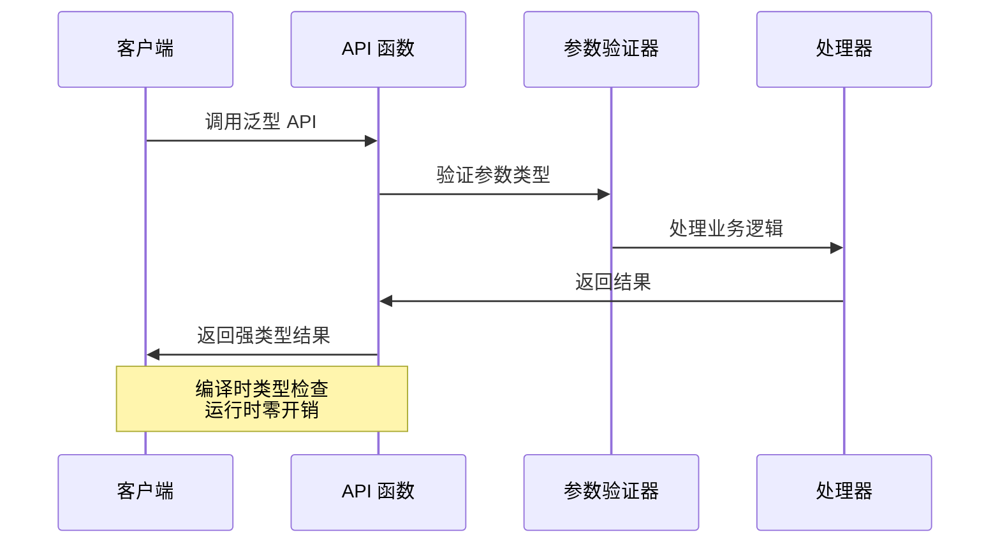

**图表来源**
- [utility-types.md:63-86](file://docs/typescript/utility-types.md#L63-L86)

**章节来源**
- [type-generics.md:14-36](file://docs/typescript/type-generics.md#L14-L36)

### 泛型接口设计

泛型接口为对象结构提供了类型安全的抽象，特别适用于 API 响应和配置对象。

#### 接口泛型的设计模式

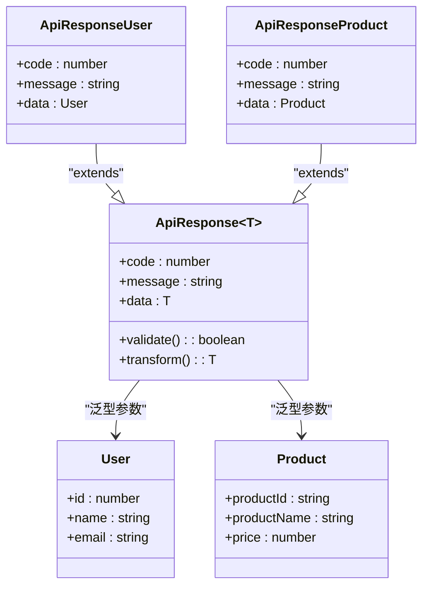

**图表来源**
- [type-generics.md:23-28](file://docs/typescript/type-generics.md#L23-L28)

#### 接口泛型的最佳实践

在实际项目中，泛型接口应该遵循以下原则：

1. **单一职责原则**：每个泛型接口专注于一个特定的功能领域
2. **类型安全**：确保泛型参数的正确使用和验证
3. **向后兼容**：设计时考虑未来可能的扩展需求
4. **文档完整性**：为泛型参数提供清晰的注释和示例

**章节来源**
- [type-generics.md:23-28](file://docs/typescript/type-generics.md#L23-L28)

### 泛型类实现

泛型类允许你创建类型安全的类，这些类可以在实例化时确定其类型参数。

#### 栈数据结构的泛型实现

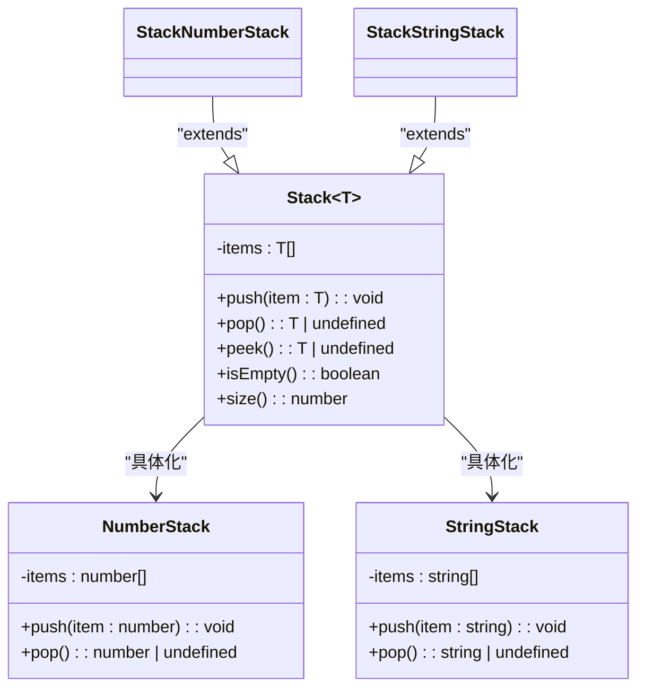

**图表来源**
- [type-generics.md:30-35](file://docs/typescript/type-generics.md#L30-L35)

#### 泛型类的设计考量

实现泛型类时需要考虑：

- **类型约束**：合理使用 `extends` 约束确保类型安全
- **性能优化**：避免不必要的类型检查开销
- **内存管理**：注意泛型实例的生命周期管理
- **错误处理**：提供清晰的错误信息和回退策略

**章节来源**
- [type-generics.md:30-36](file://docs/typescript/type-generics.md#L30-L36)

### 泛型约束系统

泛型约束是控制泛型参数可用范围的重要机制，通过 `extends` 关键字实现。

#### 约束类型详解

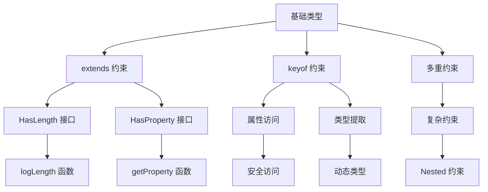

**图表来源**
- [type-generics.md:38-63](file://docs/typescript/type-generics.md#L38-L63)

#### 约束的实际应用

在实际开发中，泛型约束主要用于：

1. **API 参数验证**：确保传入的参数具有必需的方法或属性
2. **配置对象约束**：限制配置选项的可用范围
3. **回调函数约束**：确保回调函数满足特定的签名要求
4. **事件处理器约束**：保证事件处理器能够处理预期的事件类型

**章节来源**
- [type-generics.md:38-63](file://docs/typescript/type-generics.md#L38-L63)

### 条件类型系统

条件类型是 TypeScript 中最强大的类型操作特性之一，它允许你根据类型关系选择不同的类型。

#### 条件类型的工作原理

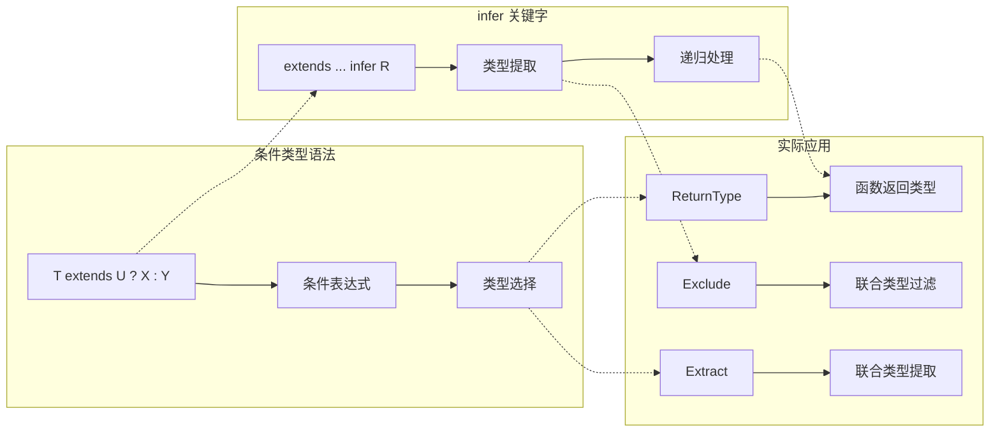

**图表来源**
- [type-generics.md:65-83](file://docs/typescript/type-generics.md#L65-L83)

#### 条件类型的高级应用

条件类型可以实现复杂的类型操作：

1. **类型分支**：根据条件选择不同的类型分支
2. **类型提取**：使用 `infer` 关键字提取嵌套类型
3. **递归处理**：支持深度类型分析和转换
4. **模板字符串类型**：结合模板字符串进行类型解析

**章节来源**
- [type-generics.md:65-83](file://docs/typescript/type-generics.md#L65-L83)

### 工具类型详解

TypeScript 内置了许多实用的工具类型，它们为常见的类型操作提供了简洁的解决方案。

#### 内置工具类型的分类

```mermaid
graph TB
subgraph "属性操作类"
Partial[Partial<T>]
Required[Required<T>]
Readonly[Readonly<T>]
end
subgraph "属性选择类"
Pick[Pick<T, K>]
Omit[Omit<T, K>]
Record[Record<K, V>]
end
subgraph "联合类型操作类"
Exclude[Exclude<T, U>]
Extract[Extract<T, U>]
NonNullable[NonNullable<T>]
end
subgraph "函数类型操作类"
ReturnType[ReturnType<T>]
Parameters[Parameters<T>]
ConstructorParameters[ConstructorParameters<T>]
end
subgraph "特殊用途类"
ThisParameterType[ThisParameterType<T>]
OmitThisParameter[OmitThisParameter<T>]
Awaited[Awaited<T>]
end
Partial --> PropertyOps[属性操作]
Required --> PropertyOps
Readonly --> PropertyOps
Pick --> SelectionOps[属性选择]
Omit --> SelectionOps
Record --> SelectionOps
Exclude --> UnionOps[联合类型操作]
Extract --> UnionOps
NonNullable --> UnionOps
ReturnType --> FunctionOps[函数类型操作]
Parameters --> FunctionOps
ConstructorParameters --> FunctionOps
ThisParameterType --> SpecialOps[特殊用途]
OmitThisParameter --> SpecialOps
Awaited --> SpecialOps
```

**图表来源**
- [utility-types.md:10-61](file://docs/typescript/utility-types.md#L10-L61)

#### 工具类型的实战应用

在实际项目中，工具类型可以解决许多常见的类型问题：

1. **表单状态管理**：使用 `FormState<T>` 模式管理复杂的表单状态
2. **API 响应处理**：通过 `ApiResponse<T>` 统一处理 API 响应格式
3. **配置对象管理**：使用 `Partial<T>` 实现渐进式配置更新
4. **事件系统设计**：通过工具类型实现类型安全的事件处理

**章节来源**
- [utility-types.md:10-94](file://docs/typescript/utility-types.md#L10-L94)

### 类型体操实践

类型体操是 TypeScript 高级特性的综合应用，展示了泛型系统的强大能力。

#### 复杂类型操作示例

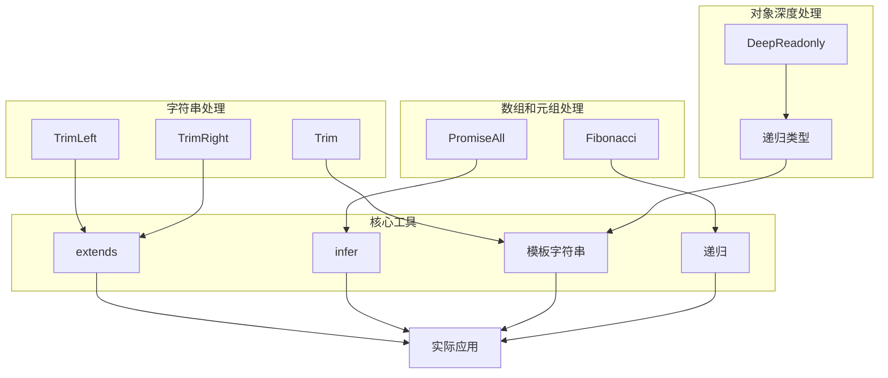

**图表来源**
- [type-challenges.md:10-90](file://docs/typescript/type-challenges.md#L10-L90)

#### 类型体操的设计原则

虽然类型体操展示了 TypeScript 的强大能力，但在实际项目中应该：

1. **保持可读性**：优先考虑代码的可读性和可维护性
2. **适度使用**：避免过度复杂的类型操作影响开发效率
3. **充分测试**：确保复杂的类型操作在各种情况下都能正常工作
4. **文档记录**：为复杂的类型操作提供详细的注释和示例

**章节来源**
- [type-challenges.md:10-98](file://docs/typescript/type-challenges.md#L10-L98)

## 依赖分析

### TypeScript 生态系统集成

该项目的 TypeScript 配置展现了现代前端开发的依赖管理策略：

```mermaid
graph TB
subgraph "核心依赖"
TS[TypeScript ~6.0.2]
Docusaurus[Docusaurus 3.10.1]
React[React ^19.0.0]
end
subgraph "开发依赖"
TSConfig[@docusaurus/tsconfig]
Types[@types/react]
ModuleAlias[@docusaurus/module-type-aliases]
end
subgraph "构建工具"
Build[Docusaurus Build]
Serve[Docusaurus Serve]
TypeCheck[tsc 类型检查]
end
subgraph "运行环境"
Node[Node >=20.0]
Browser[现代浏览器]
end
TS --> Docusaurus
React --> Docusaurus
Docusaurus --> Build
Docusaurus --> Serve
TSConfig --> TypeCheck
Types --> TypeCheck
ModuleAlias --> Build
Build --> Browser
Serve --> Browser
TypeCheck --> Node
```

**图表来源**
- [package.json:17-33](file://package.json#L17-L33)
- [tsconfig.json:4-12](file://tsconfig.json#L4-L12)

### 类型系统依赖关系

TypeScript 泛型系统与其他类型特性存在密切的依赖关系：

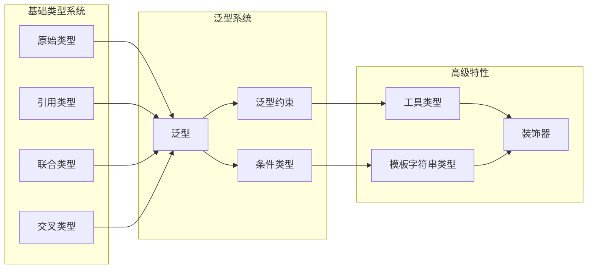

**图表来源**
- [type-generics.md:10-107](file://docs/typescript/type-generics.md#L10-L107)
- [utility-types.md:10-94](file://docs/typescript/utility-types.md#L10-L94)

**章节来源**
- [package.json:17-33](file://package.json#L17-L33)
- [tsconfig.json:4-12](file://tsconfig.json#L4-L12)

## 性能考虑

### 编译时与运行时性能

TypeScript 泛型系统的一个重要特点是其完全的编译时特性：

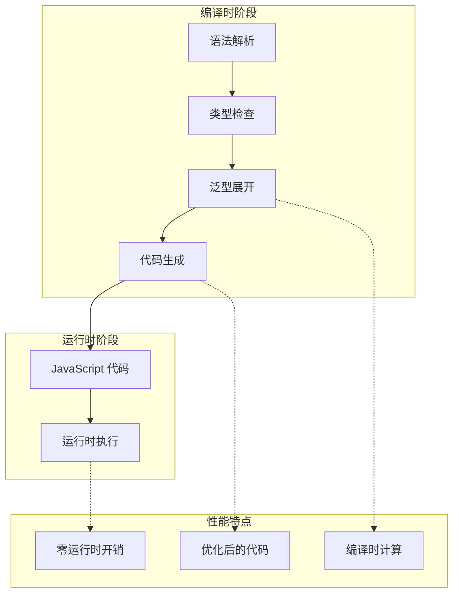

**图表来源**
- [type-generics.md:101-107](file://docs/typescript/type-generics.md#L101-L107)

### 性能优化建议

基于泛型系统的特性，以下是性能优化的建议：

1. **避免过度复杂的泛型**：简单的泛型通常比复杂的条件类型更快
2. **合理使用类型缓存**：TypeScript 编译器会缓存类型检查结果
3. **减少深层嵌套**：深度嵌套的泛型可能影响编译性能
4. **使用工具类型**：内置工具类型经过高度优化
5. **避免不必要的类型断言**：类型断言会绕过类型检查

## 故障排除指南

### 常见问题诊断

#### 类型推断失败

当 TypeScript 无法正确推断泛型参数时，通常会出现以下问题：

1. **明确指定类型参数**：在调用时显式指定泛型参数
2. **检查约束条件**：确保传入的类型满足泛型约束
3. **简化复杂类型**：将复杂的类型表达式分解为简单步骤

#### 编译错误排查

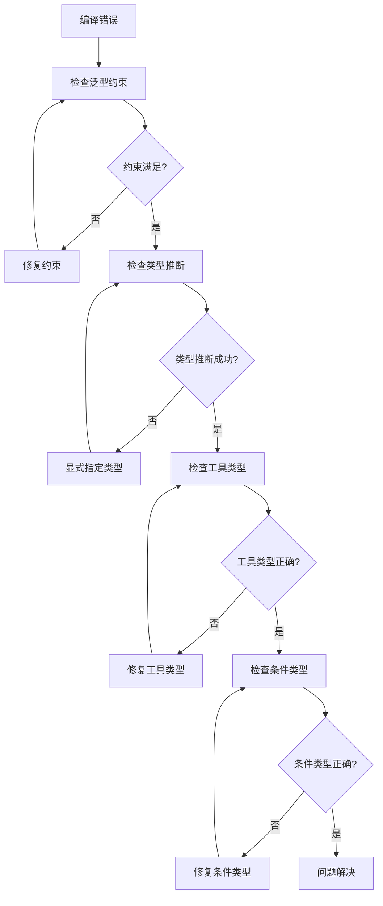

#### 运行时行为异常

由于泛型在编译时被擦除，运行时通常不会有额外的性能开销，但需要注意：

1. **类型断言的安全性**：确保类型断言不会导致运行时错误
2. **API 兼容性**：泛型 API 的变化可能影响现有代码
3. **第三方库集成**：确保第三方库的泛型定义符合预期

**章节来源**
- [type-generics.md:101-107](file://docs/typescript/type-generics.md#L101-L107)

## 结论

TypeScript 泛型系统为现代前端开发提供了强大的类型安全保障和代码复用能力。通过本项目的深入学习，你应该能够：

1. **掌握泛型的基础概念**：理解泛型如何提高代码的灵活性和类型安全性
2. **熟练运用泛型的各种形式**：包括泛型函数、接口和类
3. **理解和应用高级特性**：如泛型约束、条件类型和工具类型
4. **解决实际开发中的问题**：将泛型应用于 API 设计、组件开发和数据处理
5. **遵循最佳实践**：在保持代码可读性的同时充分利用泛型的优势

泛型系统的核心价值在于它能够在编译时提供完整的类型检查，同时在运行时不产生任何性能开销。这种设计使得 TypeScript 成为了现代前端开发的理想选择。

## 附录

### 学习路径建议

对于初学者，建议按照以下顺序学习：

1. **基础概念**：从简单的泛型函数开始
2. **约束系统**：学习如何限制泛型参数的范围
3. **工具类型**：掌握常用的内置工具类型
4. **高级特性**：深入了解条件类型和模板字符串类型
5. **实践应用**：在实际项目中应用所学知识
6. **类型体操**：挑战更复杂的类型操作

### 资源推荐

- **官方文档**：TypeScript 官方手册中的泛型章节
- **社区资源**：TypeScript 社区的各种教程和示例
- **开源项目**：研究优秀的开源项目如何使用泛型
- **工具书**：专门讲解 TypeScript 高级特性的书籍

### 最佳实践清单

- **保持简单**：优先使用简单的泛型而不是复杂的类型操作
- **文档完整**：为复杂的泛型提供清晰的注释和示例
- **测试充分**：确保泛型代码在各种情况下都能正常工作
- **性能考虑**：在功能和性能之间找到平衡点
- **团队协作**：确保团队成员都理解并遵循相同的泛型使用规范