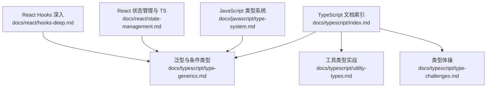
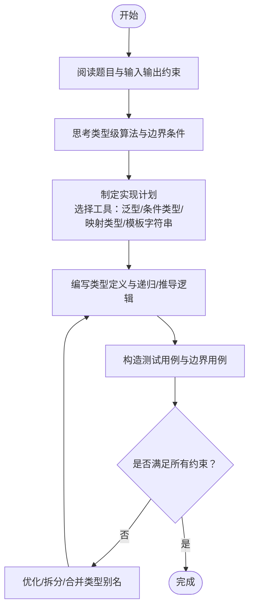
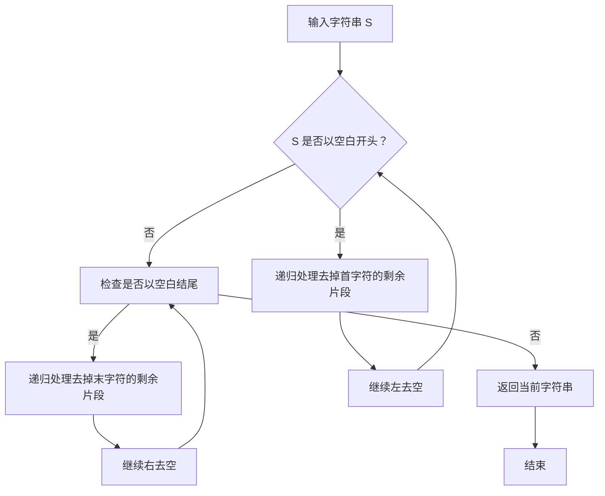
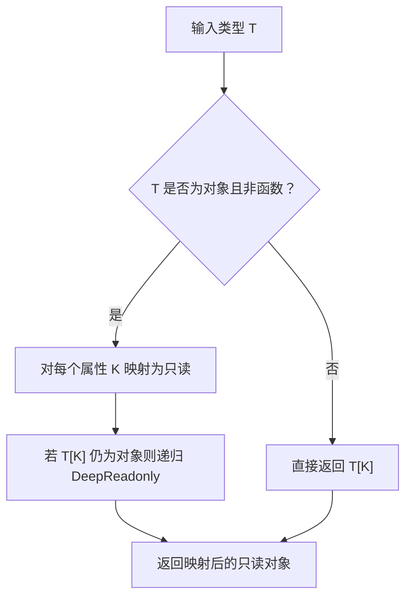
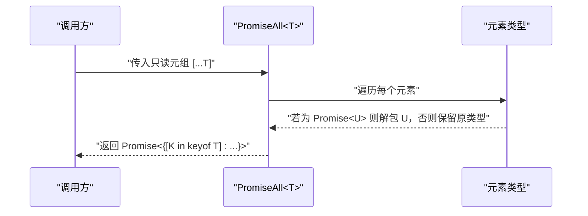
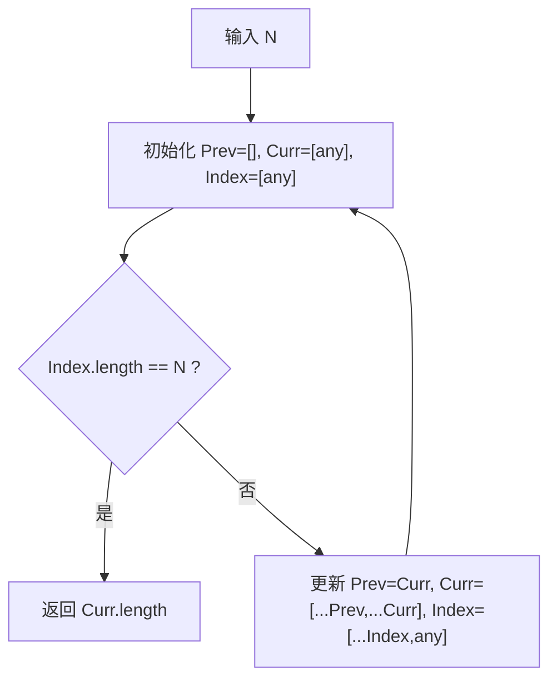
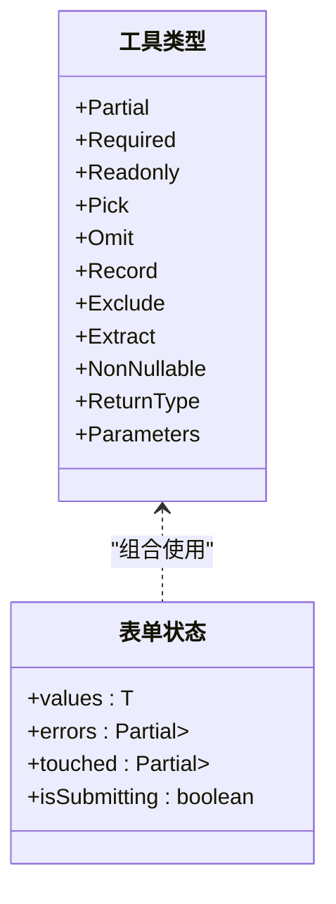
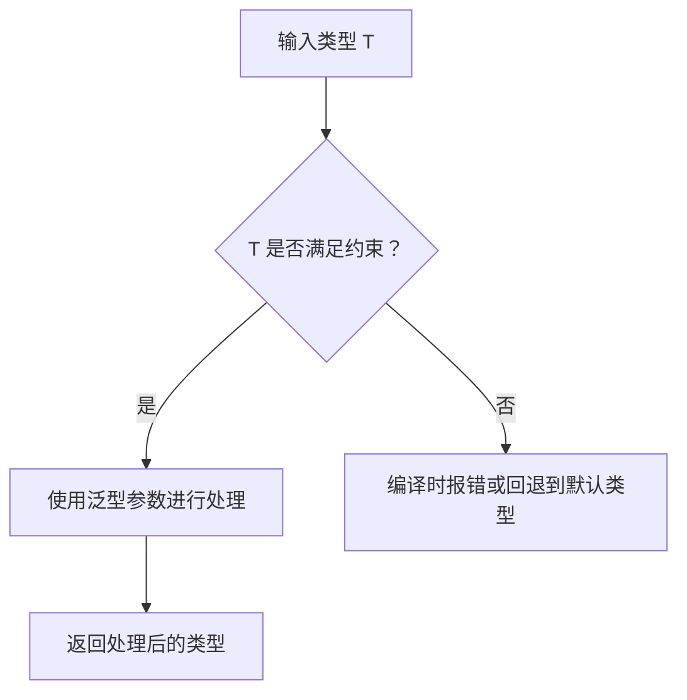
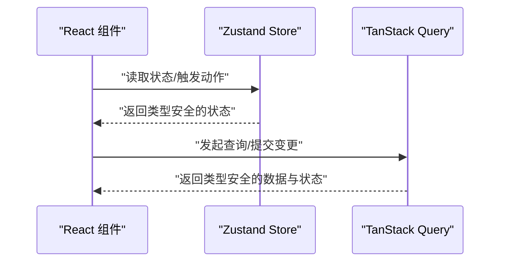
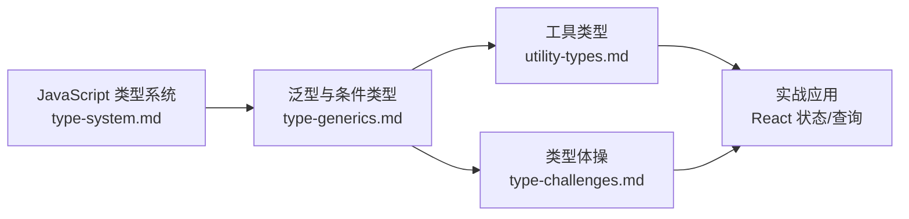

# 类型挑战练习

<cite>
**本文引用的文件**
- [docs/typescript/type-challenges.md](file://docs/typescript/type-challenges.md)
- [docs/typescript/utility-types.md](file://docs/typescript/utility-types.md)
- [docs/typescript/type-generics.md](file://docs/typescript/type-generics.md)
- [docs/javascript/type-system.md](file://docs/javascript/type-system.md)
- [docs/typescript/index.md](file://docs/typescript/index.md)
- [docs/react/state-management.md](file://docs/react/state-management.md)
- [docs/react/hooks-deep.md](file://docs/react/hooks-deep.md)
</cite>

## 目录
1. [引言](#引言)
2. [项目结构](#项目结构)
3. [核心组件](#核心组件)
4. [架构总览](#架构总览)
5. [详细组件分析](#详细组件分析)
6. [依赖分析](#依赖分析)
7. [性能考虑](#性能考虑)
8. [故障排查指南](#故障排查指南)
9. [结论](#结论)
10. [附录](#附录)

## 引言
本学习文档围绕 TypeScript 类型挑战展开，系统梳理从基础到进阶的类型编程题目与技巧，涵盖泛型、条件类型、映射类型、分布式条件类型、模板字符串类型、递归与数值计算等核心能力。通过“题目—思路—实现—扩展”的结构，帮助读者建立类型级别的抽象思维，掌握在真实项目中如何用类型约束提升安全性与可维护性。

## 项目结构
该仓库以文档形式组织 TypeScript 学习资源，主要涉及：
- 泛型与条件类型基础
- 工具类型的实战应用
- 类型体操（高阶类型编程）
- JavaScript 类型系统基础
- React 与 TypeScript 的集成实践

图表来源
- [docs/typescript/index.md:1-16](file://docs/typescript/index.md#L1-L16)
- [docs/typescript/type-generics.md:1-107](file://docs/typescript/type-generics.md#L1-L107)
- [docs/typescript/utility-types.md:1-94](file://docs/typescript/utility-types.md#L1-L94)
- [docs/typescript/type-challenges.md:1-98](file://docs/typescript/type-challenges.md#L1-L98)
- [docs/javascript/type-system.md:1-68](file://docs/javascript/type-system.md#L1-L68)
- [docs/react/state-management.md:1-104](file://docs/react/state-management.md#L1-L104)
- [docs/react/hooks-deep.md:1-107](file://docs/react/hooks-deep.md#L1-L107)

章节来源
- [docs/typescript/index.md:1-16](file://docs/typescript/index.md#L1-L16)

## 核心组件
- 泛型与条件类型：掌握泛型约束、infer 提取、条件类型分支与递归。
- 工具类型：内置工具类型速查与组合使用，面向表单、网络请求等常见场景。
- 类型体操：字符串处理、深度只读、数组元素类型推导、斐波那契数列等高阶技巧。
- JavaScript 类型系统：为理解 TS 类型推断与运行时行为提供基础。
- React 与 TS：在状态管理与 Hooks 中应用类型约束，提升开发体验。

章节来源
- [docs/typescript/type-generics.md:10-107](file://docs/typescript/type-generics.md#L10-L107)
- [docs/typescript/utility-types.md:10-94](file://docs/typescript/utility-types.md#L10-L94)
- [docs/typescript/type-challenges.md:10-98](file://docs/typescript/type-challenges.md#L10-L98)
- [docs/javascript/type-system.md:10-68](file://docs/javascript/type-system.md#L10-L68)
- [docs/react/state-management.md:21-104](file://docs/react/state-management.md#L21-L104)
- [docs/react/hooks-deep.md:10-107](file://docs/react/hooks-deep.md#L10-L107)

## 架构总览
下面以“题目—思路—实现—验证”的流程图展示类型挑战的典型路径，帮助读者形成系统化的解题方法论。

## 详细组件分析

### 组件一：字符串处理（Trim）
- 难度：中等
- 技巧要点：模板字符串类型匹配、递归、infer 提取
- 思路拆解：
  - 定义空白字符联合类型
  - 左右分别递归去除首尾空白
  - 使用模板字符串类型进行模式匹配与剩余片段提取
- 实现参考路径：
  - [实现 Trim 的类型定义:10-26](file://docs/typescript/type-challenges.md#L10-L26)
- 扩展建议：
  - 支持更多空白字符（如全角空格）
  - 将左右去空封装为独立工具类型，便于复用

图表来源
- [docs/typescript/type-challenges.md:10-26](file://docs/typescript/type-challenges.md#L10-L26)

章节来源
- [docs/typescript/type-challenges.md:10-26](file://docs/typescript/type-challenges.md#L10-L26)

### 组件二：深度只读（DeepReadonly）
- 难度：中等偏上
- 技巧要点：映射类型 + 条件类型 + 递归
- 思路拆解：
  - 对对象属性逐一映射
  - 若属性为对象且非函数，则递归应用深度只读
  - 函数类型保持不变（避免破坏函数签名）
- 实现参考路径：
  - [实现 DeepReadonly 的类型定义:28-54](file://docs/typescript/type-challenges.md#L28-L54)
- 实战应用：
  - 配置对象、响应数据结构的只读约束
  - 与工具类型组合：如与 Pick/Omit 派生子类型

图表来源
- [docs/typescript/type-challenges.md:28-54](file://docs/typescript/type-challenges.md#L28-L54)

章节来源
- [docs/typescript/type-challenges.md:28-54](file://docs/typescript/type-challenges.md#L28-L54)

### 组件三：Promise.all 类型推导（PromiseAll）
- 难度：中等偏上
- 技巧要点：元组映射、条件类型 + infer、Promise 解包
- 思路拆解：
  - 输入为只读元组，使用映射类型遍历索引
  - 对每个元素判断是否为 Promise，若是则解包其类型，否则保留原类型
  - 输出为 Promise 包裹的元组
- 实现参考路径：
  - [实现 PromiseAll 的函数声明与类型推导:56-72](file://docs/typescript/type-challenges.md#L56-L72)
- 实战应用：
  - 并行请求聚合的类型安全返回值
  - 与 React Query/TanStack Query 的类型集成

图表来源
- [docs/typescript/type-challenges.md:56-72](file://docs/typescript/type-challenges.md#L56-L72)

章节来源
- [docs/typescript/type-challenges.md:56-72](file://docs/typescript/type-challenges.md#L56-L72)

### 组件四：斐波那契数列（Fibonacci）
- 难度：困难
- 技巧要点：数组长度模拟数值、递归、条件类型终止
- 思路拆解：
  - 使用两个数组模拟前一项与当前项，索引数组模拟计数
  - 通过数组长度比较控制递归终止
  - 返回当前项的长度作为类型级数值
- 实现参考路径：
  - [实现 Fibonacci 的类型定义:74-90](file://docs/typescript/type-challenges.md#L74-L90)
- 注意事项：
  - 类型体操应保持可读性优先，避免过度复杂
  - 可以拆分为多个辅助类型以提升可维护性

图表来源
- [docs/typescript/type-challenges.md:74-90](file://docs/typescript/type-challenges.md#L74-L90)

章节来源
- [docs/typescript/type-challenges.md:74-90](file://docs/typescript/type-challenges.md#L74-L90)

### 组件五：工具类型速查与实战
- 难度：入门到中等
- 技巧要点：内置工具类型组合、映射类型、条件类型
- 实战示例：
  - 表单状态类型：values、errors、touched、isSubmitting 的统一建模
  - 与 Partial/Pick/Omit/Record 组合，实现灵活的类型派生
- 实现参考路径：
  - [内置工具类型速查:10-61](file://docs/typescript/utility-types.md#L10-L61)
  - [表单类型实战:63-86](file://docs/typescript/utility-types.md#L63-L86)
- 关键点：
  - Partial 适合更新操作（只传需要修改的字段）
  - Pick/Omit 适合从已有类型派生子类型
  - Record 适合构造映射类型
  - 可以组合使用：如 Partial<Pick<User, 'name' | 'age'>> 等

图表来源
- [docs/typescript/utility-types.md:10-86](file://docs/typescript/utility-types.md#L10-L86)

章节来源
- [docs/typescript/utility-types.md:10-86](file://docs/typescript/utility-types.md#L10-L86)

### 组件六：泛型与条件类型基础
- 难度：入门到中等
- 技巧要点：泛型约束、infer 提取、条件类型分支
- 示例路径：
  - [泛型函数/接口/类示例:14-36](file://docs/typescript/type-generics.md#L14-L36)
  - [泛型约束与 keyof 约束:38-63](file://docs/typescript/type-generics.md#L38-L63)
  - [条件类型与 infer 提取:65-83](file://docs/typescript/type-generics.md#L65-L83)
  - [常见泛型工具类型定义:85-99](file://docs/typescript/type-generics.md#L85-L99)
- 关键点：
  - 泛型是类型系统的“参数”，让函数/类型更灵活
  - extends 用于约束泛型的范围
  - infer 在条件类型中提取类型
  - 泛型不会增加运行时开销（编译后被擦除）

图表来源
- [docs/typescript/type-generics.md:38-83](file://docs/typescript/type-generics.md#L38-L83)

章节来源
- [docs/typescript/type-generics.md:10-99](file://docs/typescript/type-generics.md#L10-L99)

### 组件七：JavaScript 类型系统基础
- 难度：入门
- 内容要点：原始类型与引用类型、typeof 与 instanceof 的差异、类型判断函数、相等性判断
- 实践价值：
  - 理解 TS 类型推断与运行时行为的差异
  - 为 TS 类型体操提供运行时对照与边界意识
- 实现参考路径：
  - [类型系统与类型判断:10-68](file://docs/javascript/type-system.md#L10-L68)

章节来源
- [docs/javascript/type-system.md:10-68](file://docs/javascript/type-system.md#L10-L68)

### 组件八：React 与 TypeScript 的集成实践
- 难度：中等
- 内容要点：Zustand 状态管理、React Query/TanStack Query 的类型使用、自定义 Hook 的类型约束
- 实践价值：
  - 在真实项目中应用类型约束，提升状态与异步数据的类型安全
  - 结合 Hooks 的生命周期与副作用，构建健壮的类型模型
- 实现参考路径：
  - [Zustand 状态管理与 TS:21-65](file://docs/react/state-management.md#L21-L65)
  - [React Query/TanStack Query 类型使用:67-96](file://docs/react/state-management.md#L67-L96)
  - [Hooks 深入与类型约束:10-107](file://docs/react/hooks-deep.md#L10-L107)

图表来源
- [docs/react/state-management.md:21-96](file://docs/react/state-management.md#L21-L96)
- [docs/react/hooks-deep.md:10-107](file://docs/react/hooks-deep.md#L10-L107)

章节来源
- [docs/react/state-management.md:21-96](file://docs/react/state-management.md#L21-L96)
- [docs/react/hooks-deep.md:10-107](file://docs/react/hooks-deep.md#L10-L107)

## 依赖分析
- 内聚性：各组件围绕“类型编程”主题，彼此互补（泛型/条件类型为基，工具类型为用，体操为高阶实践）
- 耦合性：类型体操依赖于泛型与条件类型；工具类型依赖于映射类型与条件类型；实战应用依赖于上述基础
- 外部依赖：React 生态（Zustand、TanStack Query）与 Hooks 为真实项目集成提供范例

图表来源
- [docs/typescript/type-generics.md:10-107](file://docs/typescript/type-generics.md#L10-L107)
- [docs/typescript/utility-types.md:10-94](file://docs/typescript/utility-types.md#L10-L94)
- [docs/typescript/type-challenges.md:10-98](file://docs/typescript/type-challenges.md#L10-L98)
- [docs/javascript/type-system.md:10-68](file://docs/javascript/type-system.md#L10-L68)
- [docs/react/state-management.md:21-96](file://docs/react/state-management.md#L21-L96)

章节来源
- [docs/typescript/type-generics.md:10-107](file://docs/typescript/type-generics.md#L10-L107)
- [docs/typescript/utility-types.md:10-94](file://docs/typescript/utility-types.md#L10-L94)
- [docs/typescript/type-challenges.md:10-98](file://docs/typescript/type-challenges.md#L10-L98)
- [docs/javascript/type-system.md:10-68](file://docs/javascript/type-system.md#L10-L68)
- [docs/react/state-management.md:21-96](file://docs/react/state-management.md#L21-L96)

## 性能考虑
- 类型体操的可读性优先：避免过度复杂的递归与嵌套，必要时拆分辅助类型
- 工具类型的组合：合理使用内置工具类型，减少重复实现
- React 集成：在状态管理与查询中利用类型约束，避免运行时错误导致的额外开销
- 开发体验：借助编辑器的类型提示与快速修复，提高迭代效率

## 故障排查指南
- 编译报错：检查泛型约束是否满足、条件类型分支是否覆盖所有情况
- 类型推断异常：确认 infer 的位置与作用域，避免在不合适的上下文中使用
- 递归类型过深：适当引入辅助类型或限制递归深度
- 实战集成问题：核对 React 状态与查询的类型签名，确保与组件消费方式一致

## 结论
通过系统化的类型挑战训练，读者可以逐步掌握 TypeScript 的高级类型能力，并将其应用于真实项目的类型约束与架构设计中。建议以“从易到难、从基础到实战”的节奏推进，注重可读性与可维护性，持续在实践中巩固与拓展。

## 附录
- 题目清单入口：[TypeScript 文档索引:11-15](file://docs/typescript/index.md#L11-L15)
- 相关主题：泛型、条件类型、映射类型、模板字符串类型、分布式条件类型、递归与数值计算
- 实战参考：Zustand、TanStack Query、React Hooks 的类型使用