# Vue 框架精通

<cite>
**本文引用的文件**
- [docs/vue/index.md](file://docs/vue/index.md)
- [docs/vue/vue3-features.md](file://docs/vue/vue3-features.md)
- [docs/vue/reactivity-system.md](file://docs/vue/reactivity-system.md)
- [docs/vue/composition-api.md](file://docs/vue/composition-api.md)
- [docs/vue/virtual-dom.md](file://docs/vue/virtual-dom.md)
- [docs/vue/vue-router.md](file://docs/vue/vue-router.md)
- [docs/vue/pinia-vuex.md](file://docs/vue/pinia-vuex.md)
- [docs/vue/component-communication.md](file://docs/vue/component-communication.md)
- [docs/vue/compiler-optimization.md](file://docs/vue/compiler-optimization.md)
- [docs/vue/performance.md](file://docs/vue/performance.md)
- [docs/vue/lifecycle.md](file://docs/vue/lifecycle.md)
- [docs/vue/vue-source-code.md](file://docs/vue/vue-source-code.md)
- [package.json](file://package.json)
- [README.md](file://README.md)
</cite>

## 目录
1. [简介](#简介)
2. [项目结构](#项目结构)
3. [核心组件](#核心组件)
4. [架构总览](#架构总览)
5. [详细组件分析](#详细组件分析)
6. [依赖分析](#依赖分析)
7. [性能考量](#性能考量)
8. [故障排查指南](#故障排查指南)
9. [结论](#结论)
10. [附录](#附录)

## 简介
本技术文档面向希望深入掌握 Vue 3 的开发者，系统梳理其核心概念与高级特性，包括响应式系统原理、组合式 API 应用、虚拟 DOM 与 Diff 算法、路由系统、状态管理对比、编译优化与运行时优化策略，并结合实际项目经验给出最佳实践与学习路径。文档同时覆盖 Vue 3 的新特性（如 Fragment、Teleport、Suspense、v-model 变化、defineModel、defineExpose、defineOptions、useAttrs/useSlots、Tree-shaking）以及生命周期、组件通信模式、性能优化与源码解析要点，帮助不同经验水平的读者建立完整的知识体系。

## 项目结构
该知识库采用 Docusaurus 构建，Vue 相关内容集中在 docs/vue 目录下，围绕“基础概念—高级特性—工程实践”的层次组织，便于读者循序渐进学习。

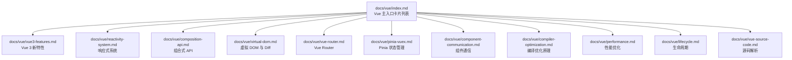

图表来源
- [docs/vue/index.md:1-16](file://docs/vue/index.md#L1-L16)
- [docs/vue/vue3-features.md:1-253](file://docs/vue/vue3-features.md#L1-L253)
- [docs/vue/reactivity-system.md:1-109](file://docs/vue/reactivity-system.md#L1-L109)
- [docs/vue/composition-api.md:1-145](file://docs/vue/composition-api.md#L1-L145)
- [docs/vue/virtual-dom.md:1-117](file://docs/vue/virtual-dom.md#L1-L117)
- [docs/vue/vue-router.md:1-185](file://docs/vue/vue-router.md#L1-L185)
- [docs/vue/pinia-vuex.md:1-191](file://docs/vue/pinia-vuex.md#L1-L191)
- [docs/vue/component-communication.md:1-238](file://docs/vue/component-communication.md#L1-L238)
- [docs/vue/compiler-optimization.md:1-180](file://docs/vue/compiler-optimization.md#L1-L180)
- [docs/vue/performance.md:1-206](file://docs/vue/performance.md#L1-L206)
- [docs/vue/lifecycle.md:1-190](file://docs/vue/lifecycle.md#L1-L190)
- [docs/vue/vue-source-code.md:1-386](file://docs/vue/vue-source-code.md#L1-L386)

章节来源
- [docs/vue/index.md:1-16](file://docs/vue/index.md#L1-L16)

## 核心组件
- 响应式系统：Vue 3 以 Proxy 替代 Object.defineProperty，实现惰性递归、新增/删除属性检测、Map/Set 支持与 Tree-shaking 友好的按需引入。
- 组合式 API：按逻辑关注点组织代码，提供 Composables、生命周期钩子、Provide/Inject、<script setup> 等能力，更适合 TypeScript。
- 虚拟 DOM 与 Diff：静态提升、Patch Flags、Block Tree、最长递增子序列优化，显著降低运行时比较成本。
- 编译优化：静态提升、补丁标记、事件缓存、Block Fragment 等，使 Template 比 JSX 享有更多编译期优化。
- 路由系统：Hash/History 模式、导航守卫、路由懒加载、动态路由与元信息。
- 状态管理：Pinia 相比 Vuex 在 API 设计、TypeScript 支持、模块化与体积上的优势。
- 组件通信：Props/Emit/v-model、ref/$parent、$attrs、Provide/Inject、Pinia 等多种模式及适用场景。
- 生命周期：setup 替代 beforeCreate/created，新增 keep-alive 钩子与错误捕获钩子。
- 性能优化：组件懒加载、v-once/v-memo、shallowRef/shallowReactive、大列表虚拟滚动、keep-alive 缓存、computed 与 methods 的选择、markRaw 与浅层响应式。

章节来源
- [docs/vue/reactivity-system.md:1-109](file://docs/vue/reactivity-system.md#L1-L109)
- [docs/vue/composition-api.md:1-145](file://docs/vue/composition-api.md#L1-L145)
- [docs/vue/virtual-dom.md:1-117](file://docs/vue/virtual-dom.md#L1-L117)
- [docs/vue/compiler-optimization.md:1-180](file://docs/vue/compiler-optimization.md#L1-L180)
- [docs/vue/vue-router.md:1-185](file://docs/vue/vue-router.md#L1-L185)
- [docs/vue/pinia-vuex.md:1-191](file://docs/vue/pinia-vuex.md#L1-L191)
- [docs/vue/component-communication.md:1-238](file://docs/vue/component-communication.md#L1-L238)
- [docs/vue/lifecycle.md:1-190](file://docs/vue/lifecycle.md#L1-L190)
- [docs/vue/performance.md:1-206](file://docs/vue/performance.md#L1-L206)

## 架构总览
Vue 3 的整体架构分为“编译阶段”和“运行时阶段”，配合编译期优化与运行时调度，形成高效的渲染管线。

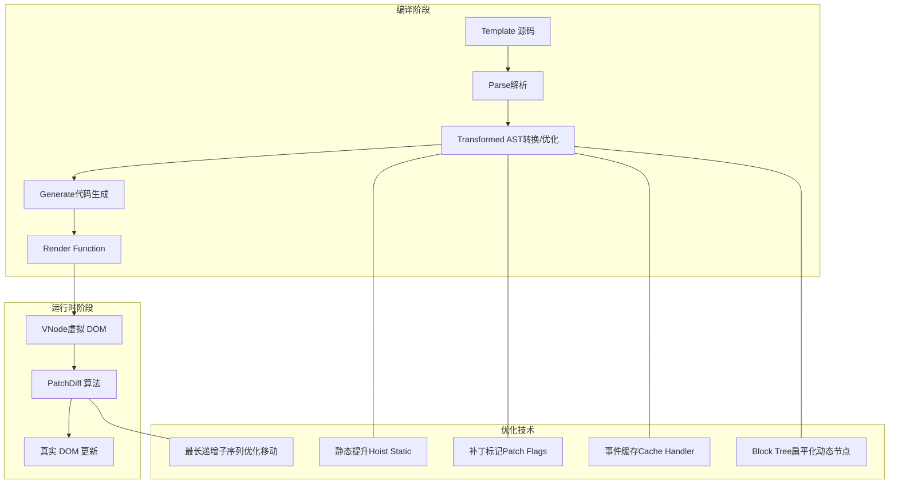

图表来源
- [docs/vue/compiler-optimization.md:10-20](file://docs/vue/compiler-optimization.md#L10-L20)
- [docs/vue/virtual-dom.md:30-77](file://docs/vue/virtual-dom.md#L30-L77)
- [docs/vue/vue-source-code.md:125-158](file://docs/vue/vue-source-code.md#L125-L158)

## 详细组件分析

### 响应式系统
- 核心差异：Vue 2 使用 Object.defineProperty，Vue 3 使用 Proxy；Proxy 支持新增/删除属性、数组索引与长度变化、Map/Set，惰性递归，Tree-shaking 友好。
- 依赖收集：WeakMap/Map/Set 三层结构，track/trigger/effect 形成响应式闭环。
- 工具 API：ref、reactive、toRef、toRefs；watchEffect 自动追踪依赖，watch 需显式指定。
- 调度器：微任务队列去重与排序，保证更新顺序与一致性。

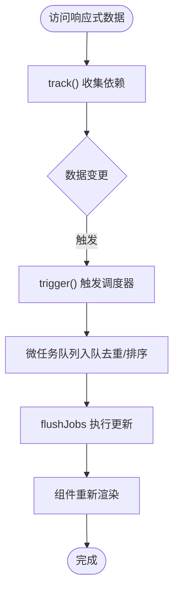

图表来源
- [docs/vue/reactivity-system.md:74-80](file://docs/vue/reactivity-system.md#L74-L80)
- [docs/vue/vue-source-code.md:161-194](file://docs/vue/vue-source-code.md#L161-L194)

章节来源
- [docs/vue/reactivity-system.md:10-109](file://docs/vue/reactivity-system.md#L10-L109)
- [docs/vue/vue-source-code.md:39-119](file://docs/vue/vue-source-code.md#L39-L119)

### 组合式 API 与逻辑复用
- 组织方式：按逻辑关注点替代 Options API 的按选项组织，提升可维护性与可测试性。
- 组合式函数（Composables）：useCounter、useFetch 等，封装可复用逻辑。
- Provide/Inject：跨层级共享响应式数据或只读配置。
- 生命周期钩子：与 Options API 对应映射，便于迁移与理解。

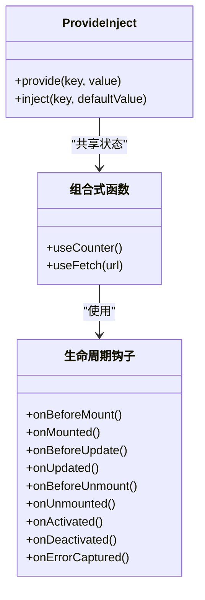

图表来源
- [docs/vue/composition-api.md:48-145](file://docs/vue/composition-api.md#L48-L145)

章节来源
- [docs/vue/composition-api.md:10-145](file://docs/vue/composition-api.md#L10-L145)

### 虚拟 DOM 与 Diff 算法
- 虚拟 DOM：用 JS 对象描述真实 DOM，支持最小化 DOM 操作。
- Vue 3 优化：
  - 静态提升：静态节点仅创建一次。
  - Patch Flags：位标记跳过静态属性比较。
  - 最长递增子序列：优化乱序节点移动。
  - Block Tree：扁平化动态节点，跳过静态子树遍历。
- Template 比 JSX 有更多编译期优化空间。

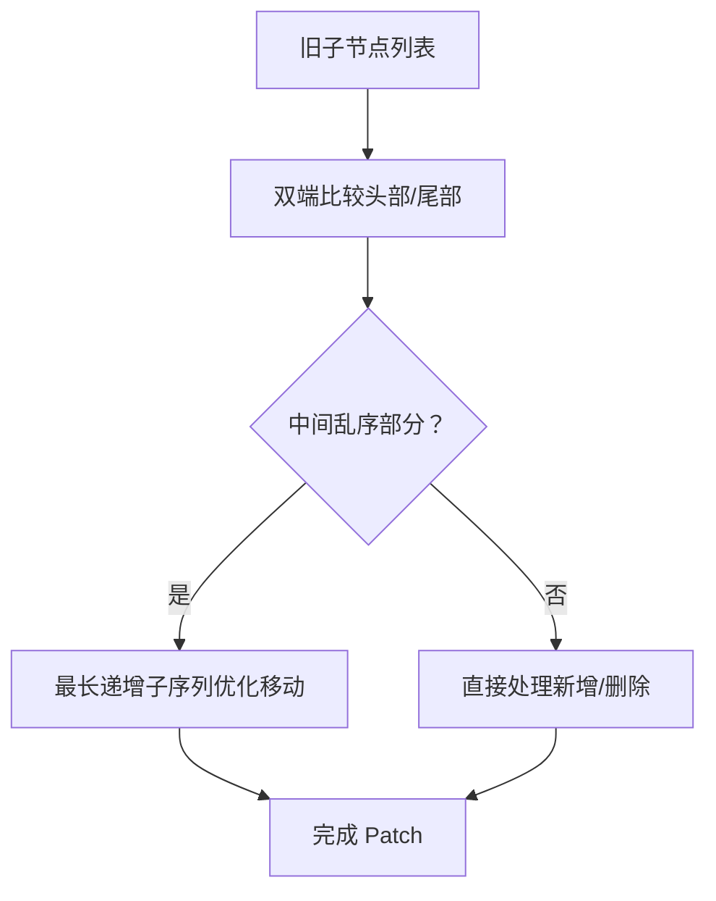

图表来源
- [docs/vue/virtual-dom.md:66-77](file://docs/vue/virtual-dom.md#L66-L77)
- [docs/vue/compiler-optimization.md:73-98](file://docs/vue/compiler-optimization.md#L73-L98)

章节来源
- [docs/vue/virtual-dom.md:10-117](file://docs/vue/virtual-dom.md#L10-L117)
- [docs/vue/compiler-optimization.md:22-180](file://docs/vue/compiler-optimization.md#L22-L180)

### 编译优化原理
- 编译流程：Template → AST → Transformed AST → Render Function。
- 关键优化：
  - 静态提升：Hoist Static，静态节点只创建一次。
  - Patch Flags：位标记，跳过静态属性比较。
  - 事件缓存：保持函数引用稳定，减少子组件重渲染。
  - Block Tree：扁平化动态节点，O(n) 优化为 O(1)。
  - v-if/v-for Block Fragment：整块替换，避免逐节点 diff。

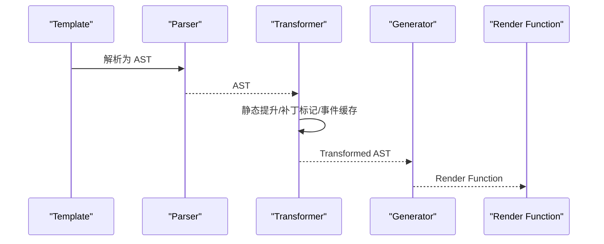

图表来源
- [docs/vue/compiler-optimization.md:10-20](file://docs/vue/compiler-optimization.md#L10-L20)
- [docs/vue/compiler-optimization.md:22-115](file://docs/vue/compiler-optimization.md#L22-L115)

章节来源
- [docs/vue/compiler-optimization.md:1-180](file://docs/vue/compiler-optimization.md#L1-L180)

### Vue Router
- 路由模式：Hash（默认，URL 带 #）与 History（需服务端配置 fallback）。
- 导航守卫：全局 beforeEach/afterEach、路由独享 beforeEnter、组件内 onBeforeRouteLeave/Update。
- 路由懒加载：配合 Suspense 优化首屏加载体验。
- 动态路由：根据权限动态添加/删除路由，支持检查与枚举。
- 元信息（meta）：用于鉴权、标题、缓存等控制。

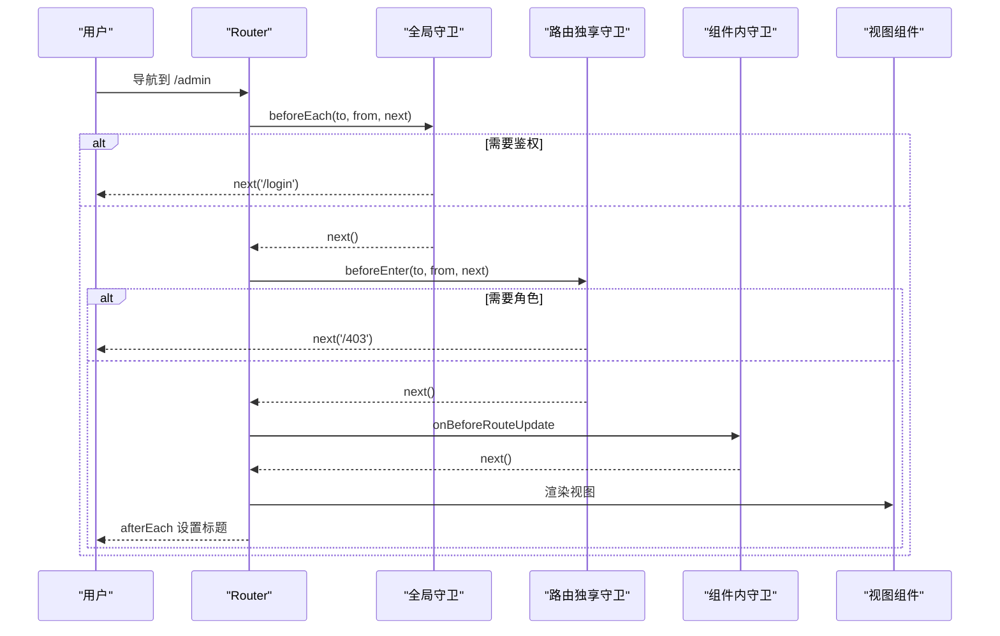

图表来源
- [docs/vue/vue-router.md:50-104](file://docs/vue/vue-router.md#L50-L104)
- [docs/vue/vue-router.md:122-147](file://docs/vue/vue-router.md#L122-L147)

章节来源
- [docs/vue/vue-router.md:1-185](file://docs/vue/vue-router.md#L1-L185)

### Pinia 状态管理
- 与 Vuex 对比：去掉 mutations，actions 直接修改 state；天然模块化；TypeScript 完美支持；体积更小。
- 基础用法：defineStore，state/getters/actions；Composition API 风格更灵活。
- 组件使用：storeToRefs 解构保持响应式；actions 直接解构。
- 插件系统：$subscribe/$onAction 日志与错误监控；持久化插件或第三方库。
- 最佳实践：优先使用 Composition API 风格；避免直接解构丢失响应式；合理拆分 store。

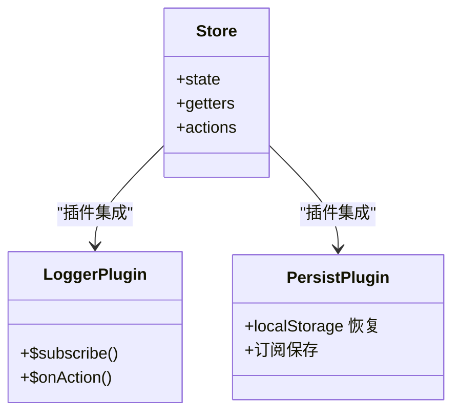

图表来源
- [docs/vue/pinia-vuex.md:21-92](file://docs/vue/pinia-vuex.md#L21-L92)
- [docs/vue/pinia-vuex.md:126-176](file://docs/vue/pinia-vuex.md#L126-L176)

章节来源
- [docs/vue/pinia-vuex.md:1-191](file://docs/vue/pinia-vuex.md#L1-L191)

### 组件通信模式
- 父子：Props（单向数据流）、Emit（事件回传）、v-model（语法糖）、ref（调用子组件方法）、$attrs（透传属性）。
- 兄弟/跨层级：共同父组件中转、Provide/Inject、Pinia。
- 全局：Pinia（推荐），避免 EventBus。
- 选择指南：按场景选择合适方式，复杂状态优先 Pinia。

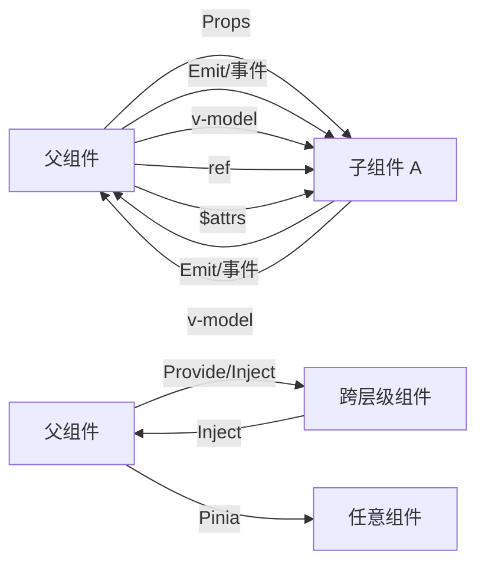

图表来源
- [docs/vue/component-communication.md:19-238](file://docs/vue/component-communication.md#L19-L238)

章节来源
- [docs/vue/component-communication.md:1-238](file://docs/vue/component-communication.md#L1-L238)

### 生命周期
- Vue 3 生命周期：setup 替代 beforeCreate/created；新增 onActivated/onDeactivated；错误捕获 onErrorCaptured。
- 执行顺序：父子组件挂载顺序、更新顺序、卸载顺序；setup 在 beforeCreate 之前执行。
- 常见场景：onMounted 访问 DOM/发起请求/初始化第三方库；onUnmounted 清理副作用；keep-alive 钩子用于缓存场景。

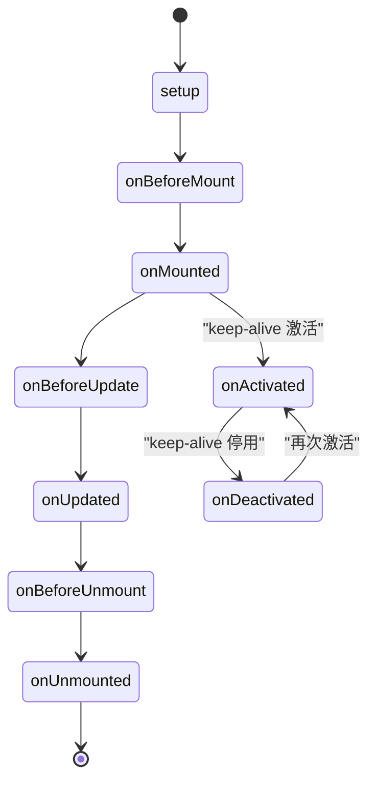

图表来源
- [docs/vue/lifecycle.md:10-36](file://docs/vue/lifecycle.md#L10-L36)
- [docs/vue/lifecycle.md:113-135](file://docs/vue/lifecycle.md#L113-L135)

章节来源
- [docs/vue/lifecycle.md:1-190](file://docs/vue/lifecycle.md#L1-L190)

### 性能优化
- 组件懒加载：defineAsyncComponent + Suspense；延迟显示 loading，超时处理。
- v-once/v-memo：静态内容只渲染一次；条件缓存，依赖变化才重新渲染。
- shallowRef/shallowReactive：只追踪一层变化，适合大数据对象；配合 triggerRef 手动触发。
- 大列表优化：虚拟滚动（@tanstack/vue-virtualizer 等）只渲染可见区域。
- keep-alive：缓存组件实例，限制 max 防止内存泄漏。
- computed vs methods：computed 有缓存，methods 每次渲染都执行。
- 避免不必要的响应式：markRaw 跳过 Proxy 包裹；非响应数据直接使用。

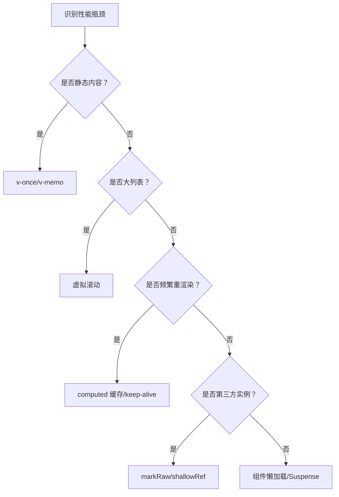

图表来源
- [docs/vue/performance.md:10-206](file://docs/vue/performance.md#L10-L206)

章节来源
- [docs/vue/performance.md:1-206](file://docs/vue/performance.md#L1-L206)

### Vue 3 新特性
- Fragment（多根节点）：解除单根节点限制，注意 attribute 继承。
- Teleport（传送门）：将组件 DOM 渲染到指定位置，适合弹窗、Tooltip。
- Suspense（异步组件）：父组件等待子组件异步资源加载，提供 fallback 插槽。
- v-model 变化：Vue 3 使用 modelValue/update:modelValue，支持多 v-model。
- defineModel（Vue 3.4+）：简化 v-model 组件实现，支持修饰符。
- defineExpose：控制组件对外暴露的 API。
- defineOptions：在 script setup 中定义组件选项。
- useAttrs/useSlots：访问非 prop 属性与插槽。
- Tree-shaking：按需引入，未使用的 API 不会打包。
- 内置组件增强：Transition/TransitionGroup 支持更多动画与钩子。

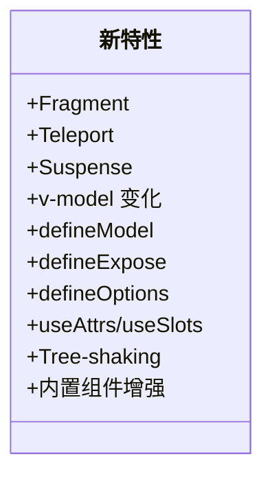

图表来源
- [docs/vue/vue3-features.md:10-253](file://docs/vue/vue3-features.md#L10-L253)

章节来源
- [docs/vue/vue3-features.md:1-253](file://docs/vue/vue3-features.md#L1-L253)

### 源码解析要点
- Monorepo 架构：reactivity/runtime-core/runtime-dom/compiler-core/compiler-dom/compiler-sfc/vue/shared。
- 响应式：Proxy 实现，WeakMap/Map/Set 三层结构，track/trigger/effect。
- 编译器：静态提升、Patch Flags、事件缓存、Block Tree。
- 调度器：微任务队列去重与排序，保证更新顺序。
- Diff：最长递增子序列优化移动。
- 组件渲染：setupComponent → setup → render → patch。
- EffectScope：统一管理响应式副作用，组件卸载时清理。

章节来源
- [docs/vue/vue-source-code.md:14-386](file://docs/vue/vue-source-code.md#L14-L386)

## 依赖分析
- 开发与构建：Docusaurus 3.x（@docusaurus/core、preset-classic），React 19，TypeScript 6.x。
- 运行时依赖：@mdx-js/react、clsx、prism-react-renderer。
- 浏览器兼容：生产环境 >0.5%，不支持 Opera Mini；开发环境 Chrome/Firefox/Safari 最近版本。

章节来源
- [package.json:17-49](file://package.json#L17-L49)

## 性能考量
- 编译期优化优先：Template 比 JSX 享有更多静态分析与优化机会。
- 运行时优化：Patch Flags、最长递增子序列、Block Tree、事件缓存。
- 组件层面：keep-alive 缓存、v-once/v-memo、computed 缓存、shallowRef/shallowReactive、markRaw。
- 数据层面：响应式按需、避免深层嵌套、合理拆分 store。
- 资源层面：路由懒加载、异步组件 + Suspense、虚拟滚动。

[本节为通用性能指导，不直接分析具体文件]

## 故障排查指南
- 路由 History 模式 404：确认服务端 fallback 配置（如 Nginx try_files）。
- 导航守卫执行顺序：全局 beforeEach → 路由 beforeEnter → 组件内守卫 → 全局 afterEach。
- v-model 多字段：使用多个 v-model:prop 或 defineModel 多个字段。
- Provide/Inject 非响应式：确保传递的是 ref/reactive 对象。
- keep-alive 缓存溢出：设置 max 限制，必要时手动移除缓存。
- 性能问题定位：使用 v-memo/cached 组件、computed 缓存、虚拟滚动、markRaw/shallowRef。

章节来源
- [docs/vue/vue-router.md:42-48](file://docs/vue/vue-router.md#L42-L48)
- [docs/vue/vue-router.md:178-185](file://docs/vue/vue-router.md#L178-L185)
- [docs/vue/component-communication.md:91-109](file://docs/vue/component-communication.md#L91-L109)
- [docs/vue/performance.md:187-206](file://docs/vue/performance.md#L187-L206)

## 结论
Vue 3 通过 Proxy 响应式、编译期优化与运行时调度，在性能、开发体验与可维护性上实现了显著提升。结合组合式 API、完善的生命周期与丰富的通信模式，以及 Pinia 等现代化状态管理，Vue 3 成为现代前端开发的优选框架。建议从响应式与组合式 API 入手，逐步掌握编译优化、路由与状态管理，并在实践中持续应用性能优化策略。

[本节为总结性内容，不直接分析具体文件]

## 附录
- 学习路径建议：
  - 基础：响应式系统、组合式 API、生命周期。
  - 进阶：虚拟 DOM 与 Diff、编译优化、组件通信。
  - 实战：Vue Router、Pinia、性能优化、源码阅读。
- 推荐资源：Vue 3 官方文档、Vue Mastery、Vue.js 技术揭秘、GitHub 源码仓库。

[本节为概念性内容，不直接分析具体文件]