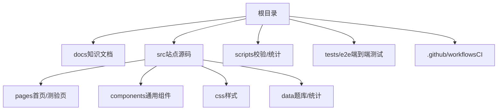
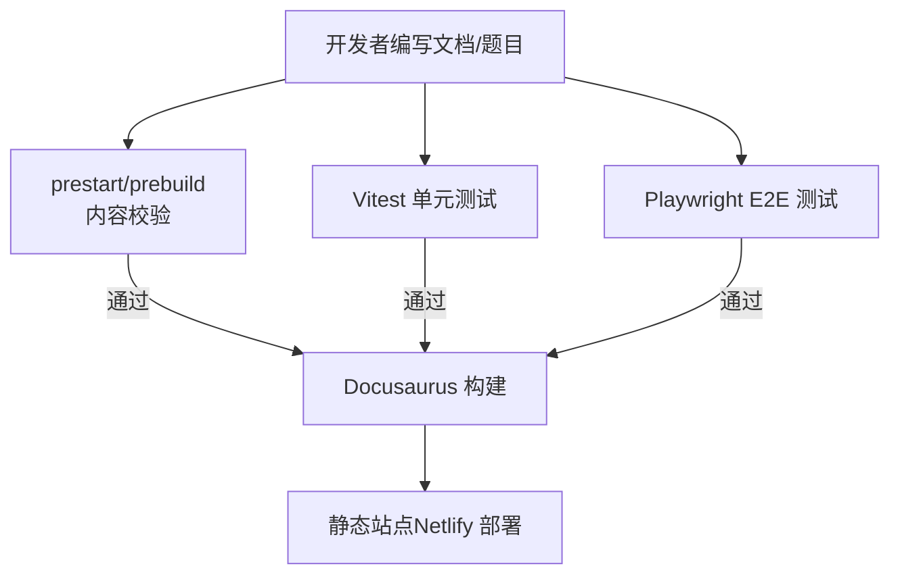
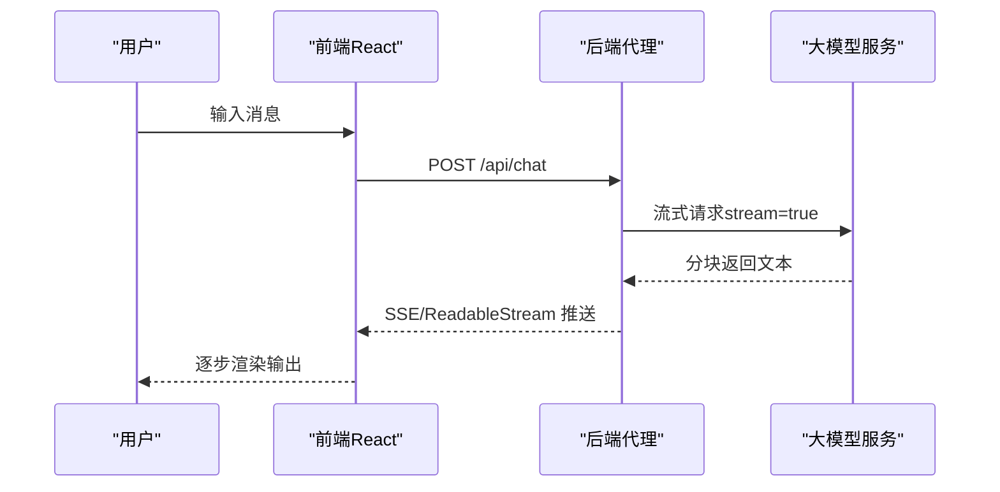
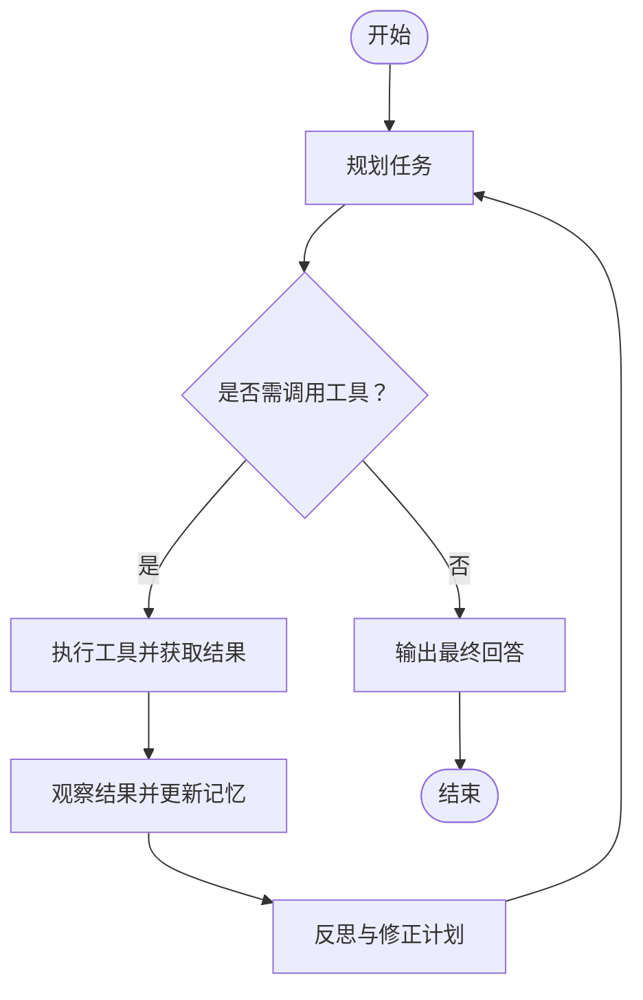
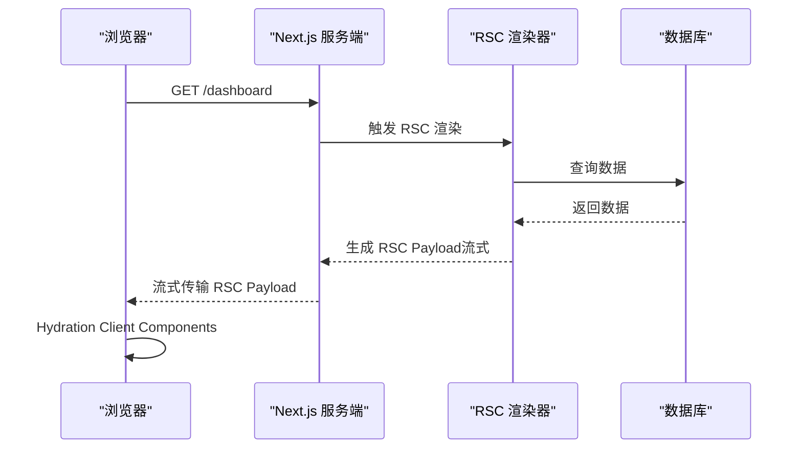
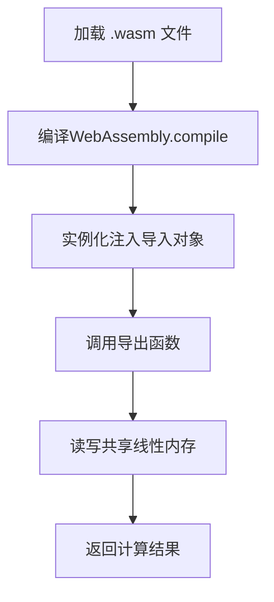
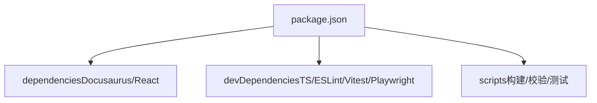

# 前沿技术探索

<cite>
**本文引用的文件**
- [README.md](file://README.md)
- [package.json](file://package.json)
- [docs/intro.md](file://docs/intro.md)
- [docs/about.md](file://docs/about.md)
- [docs/ai/index.md](file://docs/ai/index.md)
- [docs/agent-development/index.md](file://docs/agent-development/index.md)
- [docs/react-advanced/index.md](file://docs/react-advanced/index.md)
- [docs/react-advanced/server-components.md](file://docs/react-advanced/server-components.md)
- [docs/react-advanced/suspense-concurrent.md](file://docs/react-advanced/suspense-concurrent.md)
- [docs/wasm/index.md](file://docs/wasm/index.md)
- [docs/wasm/wasm-basics.md](file://docs/wasm/wasm-basics.md)
- [docs/wasm/wasm-js-interaction.md](file://docs/wasm/wasm-js-interaction.md)
- [docs/webgl/index.md](file://docs/webgl/index.md)
- [docs/webgl/webgl-basics.md](file://docs/webgl/webgl-basics.md)
- [docs/webgl/threejs.md](file://docs/webgl/threejs.md)
- [docs/ai/llm-integration.md](file://docs/ai/llm-integration.md)
- [docs/ai/streaming-response.md](file://docs/ai/streaming-response.md)
</cite>

## 目录
1. [引言](#引言)
2. [项目结构](#项目结构)
3. [核心组件](#核心组件)
4. [架构总览](#架构总览)
5. [详细组件分析](#详细组件分析)
6. [依赖关系分析](#依赖关系分析)
7. [性能考量](#性能考量)
8. [故障排查指南](#故障排查指南)
9. [结论](#结论)
10. [附录](#附录)

## 引言
本仓库是一个基于 Docusaurus 的前端面试与 AI 开发知识库，覆盖 JavaScript、TypeScript、React、Vue、浏览器、网络、工程化、AI、可视化等专题。文档体系围绕“前沿技术”展开，重点包括：
- AI 应用开发（LLM 集成、流式响应、RAG、向量数据库）
- Agent 开发（规划、记忆、工具调用、多 Agent 协作）
- React 进阶（Server Components、并发模式、React 19 新特性）
- WebAssembly（基础概念、JS 互操作、性能优化）
- WebGL 与 Three.js（渲染管线、着色器、场景构建）

本项目提供在线测验系统、内容校验脚本、E2E 测试与持续集成，确保内容质量与可维护性。

**章节来源**
- [README.md:1-88](file://README.md#L1-L88)
- [docs/intro.md:1-36](file://docs/intro.md#L1-L36)
- [docs/about.md:1-111](file://docs/about.md#L1-L111)

## 项目结构
仓库采用“文档驱动 + 站点生成”的结构：
- docs：按主题划分的 Markdown/MDX 文档
- src/pages、src/components：Docusaurus 页面与组件
- scripts：内容统计与题库校验脚本
- tests/e2e：Playwright 端到端测试
- .github/workflows：CI 配置

**图表来源**
- [README.md:51-61](file://README.md#L51-L61)
- [package.json:1-67](file://package.json#L1-L67)

**章节来源**
- [README.md:51-61](file://README.md#L51-L61)
- [package.json:1-67](file://package.json#L1-L67)

## 核心组件
- 站点与文档：Docusaurus 3 静态站点，Markdown/MDX 内容组织为分类导航与卡片列表。
- 测验系统：支持按分类选择题数、即时解析、本地答题历史与错题本。
- 内容校验：prestart/prebuild 钩子执行题库校验，保证题目 ID 唯一、答案合法、分类一致等。
- 测试与 CI：Vitest 单元测试、Playwright E2E 测试、ESLint/Prettier/TSC 检查。

**章节来源**
- [README.md:14-40](file://README.md#L14-L40)
- [README.md:63-79](file://README.md#L63-L79)
- [package.json:15-24](file://package.json#L15-L24)

## 架构总览
从“前端站点 + 内容生产 + 质量保障”的角度看，整体流程如下：

**图表来源**
- [README.md:14-40](file://README.md#L14-L40)
- [README.md:63-79](file://README.md#L63-L79)
- [package.json:15-24](file://package.json#L15-L24)

## 详细组件分析

### AI 应用开发
- LLM 集成：推荐后端代理转发请求，避免暴露 API Key；使用 Vercel AI SDK 简化前端交互。
- 流式响应：SSE 或 ReadableStream 实现打字机效果；注意中断与错误重试。
- RAG 与向量数据库：检索增强生成的前端实现与嵌入向量处理。

**图表来源**
- [docs/ai/llm-integration.md:1-103](file://docs/ai/llm-integration.md#L1-L103)
- [docs/ai/streaming-response.md:1-166](file://docs/ai/streaming-response.md#L1-L166)

**章节来源**
- [docs/ai/index.md:1-41](file://docs/ai/index.md#L1-L41)
- [docs/ai/llm-integration.md:1-103](file://docs/ai/llm-integration.md#L1-L103)
- [docs/ai/streaming-response.md:1-166](file://docs/ai/streaming-response.md#L1-L166)

### Agent 开发实战
- 核心能力：感知环境、自主规划、调用工具、记忆上下文、反思纠错。
- 架构模式：ReAct、Plan-and-Execute、状态机；单/多 Agent 对比。
- 工具调用与 Function Calling：自定义工具、编排工作流。
- 记忆系统：短期/长期/工作记忆、向量数据库、上下文管理。
- 工作流编排：顺序/分支/循环、人机协作。
- 多 Agent 协作：主从/对等/层级模式、团队分工与冲突解决。

**图表来源**
- [docs/agent-development/index.md:1-140](file://docs/agent-development/index.md#L1-L140)

**章节来源**
- [docs/agent-development/index.md:1-140](file://docs/agent-development/index.md#L1-L140)

### React 进阶（RSC、并发模式、React 19）
- Server Components：服务端直接访问数据源，流式传输 RSC Payload，减少客户端 Bundle。
- Suspense 与并发模式：Fiber 时间切片、优先级调度、useTransition/useDeferredValue。
- React 19 新特性：Actions、useOptimistic、useActionState、编译器优化。

**图表来源**
- [docs/react-advanced/server-components.md:1-369](file://docs/react-advanced/server-components.md#L1-L369)
- [docs/react-advanced/index.md:1-184](file://docs/react-advanced/index.md#L1-L184)

**章节来源**
- [docs/react-advanced/index.md:1-184](file://docs/react-advanced/index.md#L1-L184)
- [docs/react-advanced/server-components.md:1-369](file://docs/react-advanced/server-components.md#L1-L369)
- [docs/react-advanced/suspense-concurrent.md:1-447](file://docs/react-advanced/suspense-concurrent.md#L1-L447)

### WebAssembly（WASM）
- 基础概念：二进制格式、模块段、栈式虚拟机、线性内存、类型系统。
- JS 互操作：值传递、字符串/二进制数据传递、externref 引用传递、导入/导出机制。
- 性能调优：减少边界调用、批量数据传入、SharedArrayBuffer 多线程。

**图表来源**
- [docs/wasm/wasm-basics.md:1-299](file://docs/wasm/wasm-basics.md#L1-L299)
- [docs/wasm/wasm-js-interaction.md:1-461](file://docs/wasm/wasm-js-interaction.md#L1-L461)

**章节来源**
- [docs/wasm/index.md:1-86](file://docs/wasm/index.md#L1-L86)
- [docs/wasm/wasm-basics.md:1-299](file://docs/wasm/wasm-basics.md#L1-L299)
- [docs/wasm/wasm-js-interaction.md:1-461](file://docs/wasm/wasm-js-interaction.md#L1-L461)

### WebGL 与 Three.js
- 渲染管线：顶点着色器 → 图元装配 → 光栅化 → 片元着色器 → 帧缓冲区。
- 基础概念：Buffer、Texture、Uniform、帧缓冲区、错误处理。
- Three.js：场景、相机、灯光、几何体、材质、动画、模型加载。

**图表来源**
- [docs/webgl/webgl-basics.md:1-669](file://docs/webgl/webgl-basics.md#L1-L669)
- [docs/webgl/index.md:1-511](file://docs/webgl/index.md#L1-L511)
- [docs/webgl/threejs.md:1-800](file://docs/webgl/threejs.md#L1-L800)

**章节来源**
- [docs/webgl/index.md:1-511](file://docs/webgl/index.md#L1-L511)
- [docs/webgl/webgl-basics.md:1-669](file://docs/webgl/webgl-basics.md#L1-L669)
- [docs/webgl/threejs.md:1-800](file://docs/webgl/threejs.md#L1-L800)

## 依赖关系分析
- 运行时依赖：Docusaurus 3、React 19、搜索插件、Prism 语法高亮。
- 开发依赖：TypeScript、ESLint、Prettier、Vitest、Playwright。
- 脚本命令：validate:content、typecheck、lint、format、test、test:e2e、build。

**图表来源**
- [package.json:1-67](file://package.json#L1-L67)

**章节来源**
- [package.json:1-67](file://package.json#L1-L67)

## 性能考量
- 站点构建与缓存：Docusaurus 静态站点，合理拆分路由与组件，利用增量构建。
- AI 流式输出：优先 SSE/ReadableStream，减少首屏等待；注意中断与重试策略。
- WASM 性能：将循环移入 WASM，批量传入数据，避免频繁跨边界调用；必要时使用 SharedArrayBuffer。
- WebGL 渲染：减少 draw call、合批渲染、纹理图集、LOD、避免 CPU-GPU 同步。

[本节为通用指导，不直接分析具体文件]

## 故障排查指南
- 内容校验失败：运行 npm run validate:content，检查题目 ID 唯一、分类合法、选项不重复、答案在选项中、解析非空等。
- 构建失败：先执行 npm run typecheck、npm run lint、npm run format:check，修复类型与格式问题后再构建。
- 测试失败：npm run test 与 npm run test:e2e，定位断言失败用例与浏览器自动化问题。
- 部署问题：确认 Netlify 使用 npm run build 产物，静态路由与 404 页面由 Docusaurus 自动生成。

**章节来源**
- [README.md:63-79](file://README.md#L63-L79)
- [README.md:81-83](file://README.md#L81-L83)

## 结论
本知识库以“前沿技术”为主线，系统化呈现 AI 应用、Agent 开发、React 进阶、WebAssembly 与 WebGL/Three.js 的核心要点与实践路径。通过严格的校验与测试流程，确保内容质量与学习体验。建议读者按专题路线循序渐进，结合实战案例加深理解。

[本节为总结性内容，不直接分析具体文件]

## 附录
- 学习路线建议：
  - AI：工具入门 → LLM 集成 → 流式响应 → RAG → 向量数据库
  - Agent：概念与架构 → 工具与记忆 → 规划与推理 → 工作流编排 → 多 Agent 协作
  - React：RSC → 并发模式 → React 19 新特性
  - WASM：基础概念 → JS 互操作 → 性能优化
  - WebGL：渲染管线 → 着色器 → 框架（Three.js）

[本节为补充信息，不直接分析具体文件]