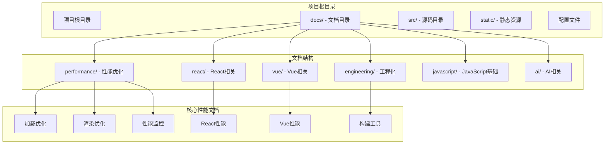
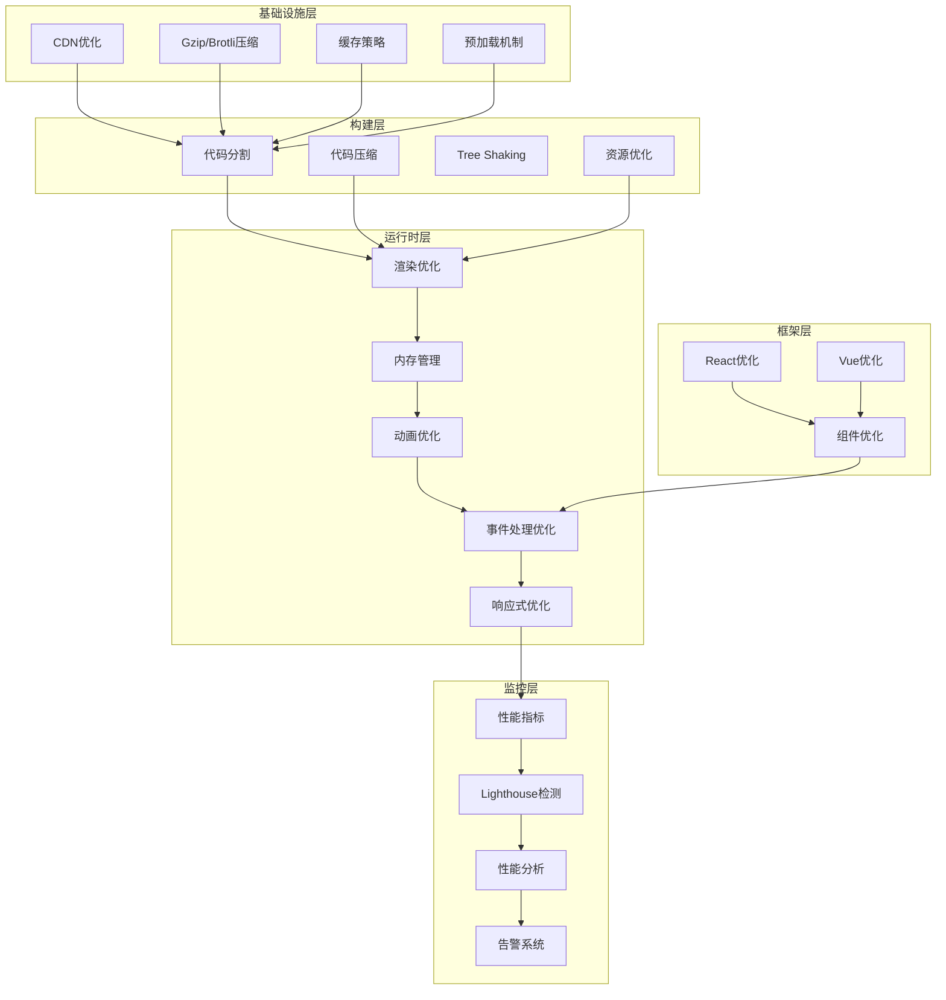
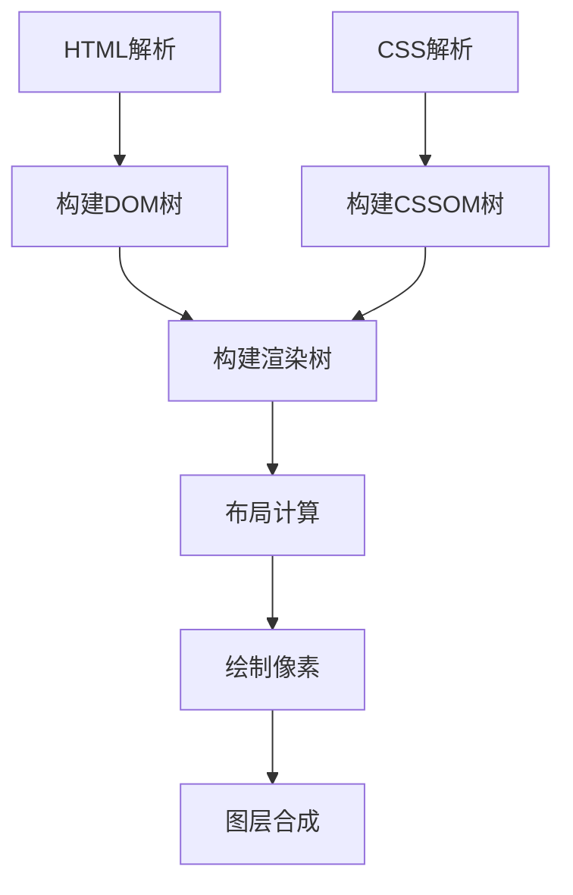
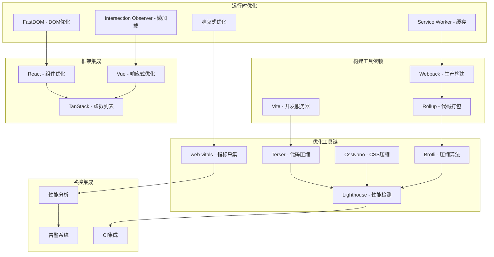
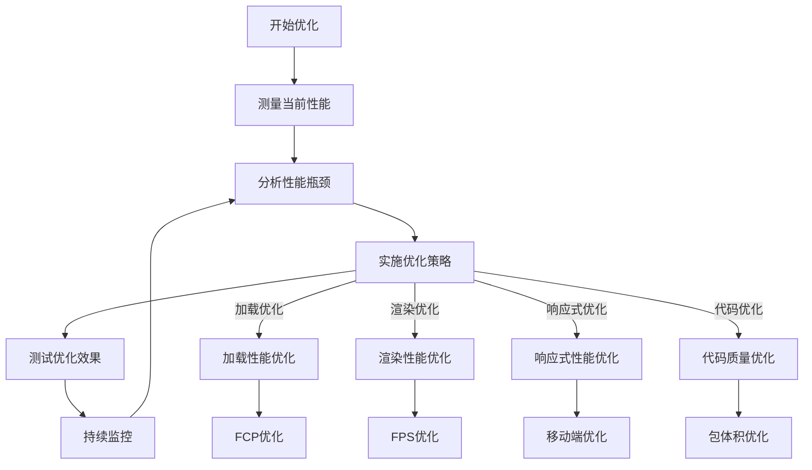
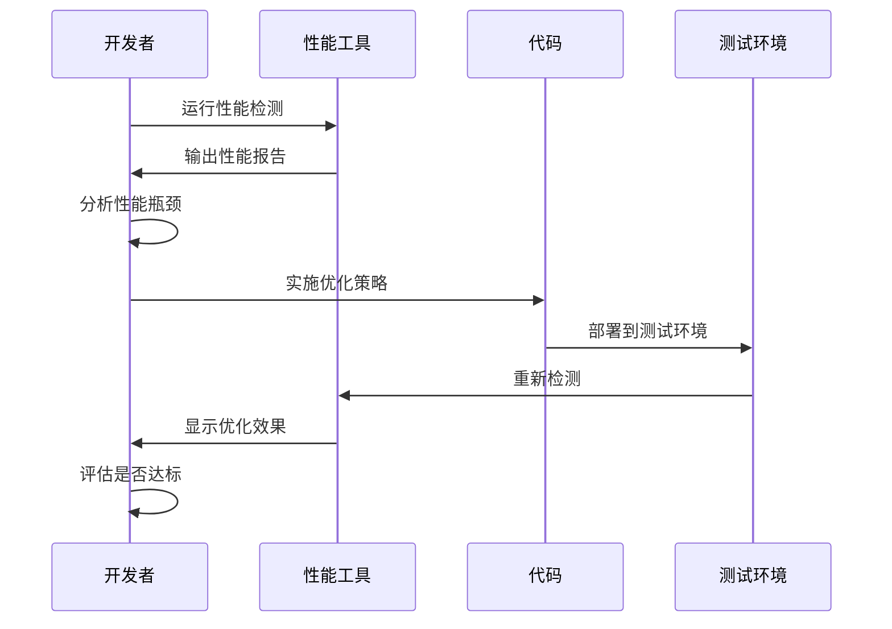

# 前端性能优化

<cite>
**本文档引用的文件**
- [loading-optimization.md](file://docs/performance/loading-optimization.md)
- [rendering-optimization.md](file://docs/performance/rendering-optimization.md)
- [performance-monitoring.md](file://docs/performance/performance-monitoring.md)
- [performance.md](file://docs/react/performance.md)
- [performance.md](file://docs/vue/performance.md)
- [bundler.md](file://docs/engineering/bundler.md)
- [package.json](file://package.json)
- [README.md](file://README.md)
- [custom.css](file://src/css/custom.css)
- [styles.module.css](file://src/components/HomepageFeatures/styles.module.css)
- [index.module.css](file://src/pages/index.module.css)
</cite>

## 目录
1. [引言](#引言)
2. [项目结构](#项目结构)
3. [核心组件](#核心组件)
4. [架构概览](#架构概览)
5. [详细组件分析](#详细组件分析)
6. [依赖关系分析](#依赖关系分析)
7. [性能考虑因素](#性能考虑因素)
8. [故障排除指南](#故障排除指南)
9. [结论](#结论)
10. [附录](#附录)

## 引言

前端性能优化是现代Web开发中的关键环节，直接影响用户体验和业务指标。本指南基于Docusaurus知识库中的性能优化相关内容，系统性地介绍了前端性能优化的各个方面，包括加载性能优化、渲染性能优化等核心主题。

前端性能优化不仅仅是技术问题，更是用户体验设计的重要组成部分。优秀的性能优化能够：
- 提升用户满意度和留存率
- 改善搜索引擎排名
- 降低带宽成本
- 提高应用的可访问性

**更新** 本次更新特别关注响应式设计优化，包括移动端动画效果、平滑滚动行为、触摸交互优化，以及性能监控和加载性能优化的增强。

## 项目结构

该项目是一个基于Docusaurus的静态网站生成器，专门用于知识库管理。项目结构清晰，采用模块化组织方式：



**图表来源**
- [README.md:1-42](file://README.md#L1-L42)
- [package.json:1-50](file://package.json#L1-L50)

**章节来源**
- [README.md:1-42](file://README.md#L1-L42)
- [package.json:1-50](file://package.json#L1-L50)

## 核心组件

### 加载性能优化组件

加载性能优化是用户对网站的第一印象，直接影响用户留存率。该组件涵盖了资源压缩、代码分割、图片优化等多个方面。

### 渲染性能优化组件

渲染性能优化关注浏览器渲染机制，通过理解关键渲染路径来优化页面的流畅度。

### 性能监控组件

**新增** 性能监控组件提供了完整的性能指标采集、分析和告警体系，包括Web Vitals指标、长任务监控、布局偏移检测等。

### 响应式设计优化组件

**新增** 响应式设计优化组件专注于移动端体验，包括动画效果优化、平滑滚动行为、触摸交互优化等。

### 框架特定优化组件

针对React和Vue框架的性能优化策略，包括组件优化、虚拟列表、缓存策略等。

**章节来源**
- [loading-optimization.md:10-575](file://docs/performance/loading-optimization.md#L10-L575)
- [rendering-optimization.md:10-747](file://docs/performance/rendering-optimization.md#L10-L747)
- [performance-monitoring.md:10-895](file://docs/performance/performance-monitoring.md#L10-L895)
- [performance.md:8-127](file://docs/react/performance.md#L8-L127)
- [performance.md:8-206](file://docs/vue/performance.md#L8-L206)

## 架构概览

前端性能优化体系采用分层架构，从底层基础设施到上层应用优化形成完整的优化链条：



**图表来源**
- [loading-optimization.md:350-425](file://docs/performance/loading-optimization.md#L350-L425)
- [rendering-optimization.md:16-63](file://docs/performance/rendering-optimization.md#L16-L63)
- [performance-monitoring.md:407-407](file://docs/performance/performance-monitoring.md#L407-L407)
- [bundler.md:10-103](file://docs/engineering/bundler.md#L10-L103)

## 详细组件分析

### 加载性能优化详解

#### 资源压缩与合并

资源压缩是性能优化的基础，通过减少传输数据量来提升加载速度。主要策略包括：

**代码压缩策略**
- JavaScript压缩：使用Terser等工具进行代码压缩
- CSS压缩：使用cssnano等工具优化样式文件
- HTML压缩：移除空白字符和注释

**压缩算法对比**

| 压缩方式 | 压缩率 | 速度 | 浏览器支持 |
|----------|--------|------|------------|
| Gzip | 60-70% | 快 | 所有浏览器 |
| Brotli | 70-80% | 中等 | 现代浏览器 |

**章节来源**
- [loading-optimization.md:16-94](file://docs/performance/loading-optimization.md#L16-L94)

#### 代码分割与懒加载

代码分割是现代前端应用的重要优化策略，通过将大文件拆分为多个小文件来减少首屏加载时间。

**Webpack代码分割配置**
- 第三方库单独打包
- 公共模块提取
- 路由级别的代码分割

**框架特定实现**

**React路由懒加载**
```javascript
import { lazy, Suspense } from 'react';

const Home = lazy(() => import('./pages/Home'));
const About = lazy(() => import('./pages/About'));

function App() {
  return (
    <Suspense fallback={<Loading />}>
      <Routes>
        <Route path="/" element={<Home />} />
        <Route path="/about" element={<About />} />
      </Routes>
    </Suspense>
  );
}
```

**Vue路由懒加载**
```javascript
const routes = [
  {
    path: '/',
    component: () => import('./views/Home.vue'),
  },
  {
    path: '/dashboard',
    component: () => import(/* webpackChunkName: "dashboard" */ './views/Dashboard.vue'),
  },
];
```

**章节来源**
- [loading-optimization.md:96-215](file://docs/performance/loading-optimization.md#L96-L215)

#### 图片优化策略

图片是网页中最大的资源之一，优化图片可以显著提升页面性能。

**图片格式选择指南**
- 照片类：JPEG/ WebP（有损压缩）
- 图标/Logo：PNG/ SVG/ WebP
- 简单动画：GIF/ APNG/ WebP
- 复杂插画：SVG/ WebP

**懒加载实现**
```javascript
// Intersection Observer实现懒加载
function lazyLoadImages() {
  const images = document.querySelectorAll('img.lazy');
  
  const observer = new IntersectionObserver((entries) => {
    entries.forEach(entry => {
      if (entry.isIntersecting) {
        const img = entry.target;
        img.src = img.dataset.src;
        img.classList.remove('lazy');
        observer.unobserve(img);
      }
    });
  }, {
    rootMargin: '50px 0px',
  });

  images.forEach(img => observer.observe(img));
}
```

**响应式图片**
```html

```

**章节来源**
- [loading-optimization.md:218-346](file://docs/performance/loading-optimization.md#L218-L346)

#### 预加载与预获取

预加载机制允许浏览器提前获取关键资源，减少用户等待时间。

**资源提示类型**
- DNS预解析：`<link rel="dns-prefetch">`
- 预连接：`<link rel="preconnect">`
- 预加载：`<link rel="preload">`
- 预获取：`<link rel="prefetch">`
- 预渲染：`<link rel="prerender">`

**Service Worker缓存策略**
```javascript
const CACHE_NAME = 'v1';
const ASSETS = [
  '/',
  '/index.html',
  '/styles/main.css',
  '/scripts/app.js',
];

self.addEventListener('install', (event) => {
  event.waitUntil(
    caches.open(CACHE_NAME).then((cache) => {
      return cache.addAll(ASSETS);
    })
  );
});

self.addEventListener('fetch', (event) => {
  event.respondWith(
    caches.match(event.request).then((response) => {
      return response || fetch(event.request);
    })
  );
}
```

**章节来源**
- [loading-optimization.md:349-425](file://docs/performance/loading-optimization.md#L349-L425)

### 渲染性能优化详解

#### 浏览器渲染流程

理解浏览器渲染机制是优化渲染性能的关键。

**关键渲染路径**


**图表来源**
- [rendering-optimization.md:18-35](file://docs/performance/rendering-optimization.md#L18-L35)

**渲染开销对比**

| 操作类型 | 触发范围 | 性能开销 | 优化建议 |
|----------|----------|----------|----------|
| transform | 只触发Composite | 最便宜 | ✅ 优先使用 |
| opacity | 只触发Composite | 最便宜 | ✅ 优先使用 |
| color | 触发Paint+Composite | 中等 | ⚠️ 合理使用 |
| width/height | 触发Layout+Paint+Composite | 最贵 | ❌ 避免频繁修改 |

**章节来源**
- [rendering-optimization.md:16-63](file://docs/performance/rendering-optimization.md#L16-L63)

#### 重排与重绘优化

**避免强制同步布局**
```javascript
// ❌ 错误模式：读写交替
function badLayout() {
  const elements = document.querySelectorAll('.item');
  elements.forEach(el => {
    const width = el.offsetWidth; // 读取
    el.style.width = width + 10 + 'px'; // 写入
  });
}

// ✅ 正确模式：批量读取，批量写入
function goodLayout() {
  const elements = document.querySelectorAll('.item');
  
  // 批量读取
  const widths = Array.from(elements).map(el => el.offsetWidth);
  
  // 批量写入
  elements.forEach((el, i) => {
    el.style.width = widths[i] + 10 + 'px';
  });
}
```

**FastDOM优化**
```javascript
import fastdom from 'fastdom';

function optimizedLayout() {
  const elements = document.querySelectorAll('.item');
  
  elements.forEach(el => {
    fastdom.measure(() => {
      const width = el.offsetWidth;
      
      fastdom.mutate(() => {
        el.style.width = width + 10 + 'px';
      });
    });
  });
}
```

**章节来源**
- [rendering-optimization.md:66-163](file://docs/performance/rendering-optimization.md#L66-L163)

#### CSS动画优化

**GPU加速策略**
```css
/* 提升到合成层 */
.accelerated {
  /* 方法1：will-change */
  will-change: transform;
  
  /* 方法2：transform: translateZ(0) */
  transform: translateZ(0);
  
  /* 方法3：backface-visibility */
  backface-visibility: hidden;
}
```

**CSS contain隔离**
```css
.isolated-component {
  /* 布局隔离：内部布局不影响外部 */
  contain: layout;
  
  /* 样式隔离：计数器等不影响外部 */
  contain: style;
  
  /* 绘制隔离：内容不超出边界 */
  contain: paint;
  
  /* 完全隔离（推荐用于组件） */
  contain: strict;
  
  /* 内容隔离（常用） */
  contain: content;
}
```

**章节来源**
- [rendering-optimization.md:167-234](file://docs/performance/rendering-optimization.md#L167-L234)

#### JavaScript执行优化

**长任务拆分**
```javascript
// ✅ 使用时间切片
function processLargeArrayAsync(items, chunkSize = 100) {
  let index = 0;
  
  function processChunk() {
    const chunk = items.slice(index, index + chunkSize);
    chunk.forEach(item => heavyComputation(item));
    index += chunkSize;
    
    if (index < items.length) {
      requestAnimationFrame(processChunk);
    }
  }
  
  processChunk();
}
```

**Web Worker使用**
```javascript
// main.js - 主线程
const worker = new Worker('worker.js');

worker.postMessage({ data: largeDataset });

worker.onmessage = (event) => {
  const result = event.data;
  updateUI(result);
};

// worker.js - 工作线程
self.onmessage = (event) => {
  const { data } = event;
  
  // 耗时计算放在 Worker 中
  const result = heavyComputation(data);
  
  self.postMessage(result);
};
```

**章节来源**
- [rendering-optimization.md:279-371](file://docs/performance/rendering-optimization.md#L279-L371)

#### 列表渲染优化

**虚拟列表实现**
```javascript
// React虚拟列表
import { FixedSizeList } from 'react-window';

function VirtualList({ items }) {
  const Row = ({ index, style }) => (
    <div style={style}>
      {items[index].name}
    </div>
  );

  return (
    <FixedSizeList
      height={600}
      width="100%"
      itemCount={items.length}
      itemSize={50}
    >
      {Row}
    </FixedSizeList>
  );
}
```

**Vue虚拟列表**
```vue
<template>
  <RecycleScroller
    :items="items"
    :item-size="50"
    key-field="id"
  >
    <template #default="{ item }">
      <div class="list-item">
        {{ item.name }}
      </div>
    </template>
  </RecycleScroller>
</template>
```

**章节来源**
- [rendering-optimization.md:375-435](file://docs/performance/rendering-optimization.md#L375-L435)

#### 事件处理优化

**事件委托**
```javascript
// ✅ 事件委托
function goodEventHandling() {
  const list = document.querySelector('.list');
  
  list.addEventListener('click', (event) => {
    if (event.target.matches('.list-item')) {
      handleClick(event);
    }
  });
}
```

**防抖与节流**
```javascript
// 防抖：等待一段时间后执行
function debounce(fn, delay) {
  let timer = null;
  return function (...args) {
    clearTimeout(timer);
    timer = setTimeout(() => fn.apply(this, args), delay);
  };
}

// 节流：固定时间间隔执行
function throttle(fn, interval) {
  let lastTime = 0;
  return function (...args) {
    const now = Date.now();
    if (now - lastTime >= interval) {
      lastTime = now;
      fn.apply(this, args);
    }
  };
}
```

**章节来源**
- [rendering-optimization.md:439-497](file://docs/performance/rendering-optimization.md#L439-L497)

### 响应式设计优化详解

**新增** 响应式设计优化专注于移动端体验的全面提升，包括动画效果、滚动行为和触摸交互的优化。

#### 移动端动画效果优化

**CSS3硬件加速**
```css
/* 移动端动画优化 */
.mobile-animation {
  /* 使用transform3d启用GPU加速 */
  transform: translate3d(0, 0, 0);
  
  /* 启用合成层 */
  will-change: transform;
  
  /* 优化动画性能 */
  animation-duration: 0.3s;
  animation-timing-function: cubic-bezier(0.4, 0, 0.2, 1);
}

/* 卡片入场动画优化 */
.featureCard {
  animation: fadeInUp 0.6s ease-out both;
  /* 优化动画曲线 */
  animation-timing-function: cubic-bezier(0.4, 0, 0.2, 1);
}

/* 首页英雄banner动画 */
.heroBanner {
  animation: gradientFloat 15s ease-in-out infinite;
  /* 优化动画性能 */
  transform: translateZ(0);
  backface-visibility: hidden;
}
```

**JavaScript动画优化**
```javascript
// 使用requestAnimationFrame优化动画
function animateMobile(element, callback) {
  let startTime = null;
  
  function step(timestamp) {
    if (!startTime) startTime = timestamp;
    const progress = Math.min((timestamp - startTime) / 300, 1);
    
    // 使用缓动函数
    const easedProgress = 1 - Math.pow(1 - progress, 3);
    
    // 应用变换
    element.style.transform = `translate3d(${easedProgress * 100}px, 0, 0)`;
    
    if (progress < 1) {
      requestAnimationFrame(step);
    } else if (callback) {
      callback();
    }
  }
  
  requestAnimationFrame(step);
}

// 触摸拖拽优化
class TouchDrag {
  constructor(element) {
    this.element = element;
    this.startX = 0;
    this.currentX = 0;
    this.isDragging = false;
    
    this.initEvents();
  }
  
  initEvents() {
    this.element.addEventListener('touchstart', this.handleTouchStart.bind(this));
    this.element.addEventListener('touchmove', this.handleTouchMove.bind(this));
    this.element.addEventListener('touchend', this.handleTouchEnd.bind(this));
  }
  
  handleTouchStart(e) {
    this.startX = e.touches[0].clientX;
    this.currentX = this.startX;
    this.isDragging = true;
    
    // 阻止默认滚动
    e.preventDefault();
  }
  
  handleTouchMove(e) {
    if (!this.isDragging) return;
    
    const deltaX = e.touches[0].clientX - this.startX;
    this.currentX = this.startX + deltaX;
    
    // 应用transform而非left/top
    this.element.style.transform = `translate3d(${this.currentX}px, 0, 0)`;
    
    e.preventDefault();
  }
  
  handleTouchEnd(e) {
    this.isDragging = false;
    
    // 回弹动画
    if (Math.abs(deltaX) > 50) {
      this.animateToPosition(this.currentX > 0 ? 100 : -100);
    } else {
      this.animateToPosition(0);
    }
  }
  
  animateToPosition(target) {
    const startTime = Date.now();
    const duration = 300;
    
    const animate = () => {
      const elapsed = Date.now() - startTime;
      const progress = Math.min(elapsed / duration, 1);
      
      // 缓动函数
      const eased = 1 - Math.pow(1 - progress, 3);
      const currentPosition = eased * (target - 0);
      
      this.element.style.transform = `translate3d(${currentPosition}px, 0, 0)`;
      
      if (progress < 1) {
        requestAnimationFrame(animate);
      }
    };
    
    requestAnimationFrame(animate);
  }
}
```

**章节来源**
- [custom.css:558-800](file://src/css/custom.css#L558-L800)
- [styles.module.css:1-119](file://src/components/HomepageFeatures/styles.module.css#L1-L119)
- [index.module.css:1-683](file://src/pages/index.module.css#L1-L683)

#### 平滑滚动行为优化

**原生滚动优化**
```css
/* 平滑滚动优化 */
.smooth-scroll {
  /* 启用硬件加速滚动 */
  -webkit-overflow-scrolling: touch;
  scroll-behavior: smooth;
}

/* 自定义滚动条 */
.custom-scrollbar::-webkit-scrollbar {
  width: 6px;
  height: 6px;
}

.custom-scrollbar::-webkit-scrollbar-track {
  background: rgba(0, 0, 0, 0.05);
  border-radius: 3px;
}

.custom-scrollbar::-webkit-scrollbar-thumb {
  background: rgba(99, 102, 241, 0.3);
  border-radius: 3px;
}

.custom-scrollbar::-webkit-scrollbar-thumb:hover {
  background: rgba(99, 102, 241, 0.5);
}

/* 滚动惯性优化 */
.inertia-scroll {
  -webkit-overflow-scrolling: touch;
  scroll-behavior: smooth;
  overscroll-behavior: contain;
}
```

**JavaScript滚动优化**
```javascript
// 滚动性能优化
class SmoothScroll {
  constructor(options = {}) {
    this.options = {
      speed: options.speed || 1000,
      easing: options.easing || 'easeInOutCubic',
      offset: options.offset || 0,
      ...options
    };
    
    this.isScrolling = false;
    this.scrollTarget = 0;
    this.scrollStartTime = 0;
    
    this.init();
  }
  
  init() {
    // 监听滚动事件
    window.addEventListener('scroll', this.throttleScroll.bind(this));
    
    // 监听键盘导航
    window.addEventListener('keydown', this.handleKeyboardNav.bind(this));
  }
  
  throttleScroll() {
    if (!this.isScrolling) {
      this.isScrolling = true;
      requestAnimationFrame(() => {
        this.updateScrollPosition();
        this.isScrolling = false;
      });
    }
  }
  
  updateScrollPosition() {
    const scrollTop = window.pageYOffset;
    const scrollHeight = document.documentElement.scrollHeight - window.innerHeight;
    const progress = scrollTop / scrollHeight;
    
    // 更新滚动进度指示器
    this.updateScrollIndicator(progress);
    
    // 触发滚动相关的动画
    this.triggerScrollAnimations(scrollTop);
  }
  
  // 滚动到目标位置
  scrollTo(target, options = {}) {
    const finalOptions = { ...this.options, ...options };
    const startTime = Date.now();
    const startScroll = window.pageYOffset;
    const distance = target - startScroll;
    
    const animateScroll = () => {
      const elapsed = Date.now() - startTime;
      const progress = Math.min(elapsed / finalOptions.speed, 1);
      
      // 应用缓动函数
      const easedProgress = this.easeInOutCubic(progress);
      const currentPosition = startScroll + distance * easedProgress;
      
      window.scrollTo(0, currentPosition);
      
      if (progress < 1) {
        requestAnimationFrame(animateScroll);
      } else if (finalOptions.callback) {
        finalOptions.callback();
      }
    };
    
    animateScroll();
  }
  
  // 缓动函数
  easeInOutCubic(t) {
    return t < 0.5 ? 4 * t * t * t : (t - 1) * (2 * t - 2) * (2 * t - 2) + 1;
  }
  
  // 滚动动画触发
  triggerScrollAnimations(scrollTop) {
    const animatedElements = document.querySelectorAll('[data-animate-on-scroll]');
    
    animatedElements.forEach(element => {
      const elementTop = element.getBoundingClientRect().top + scrollTop;
      const elementBottom = elementTop + element.offsetHeight;
      const viewportCenter = scrollTop + window.innerHeight / 2;
      
      // 检查元素是否进入视口
      if (elementTop < viewportCenter && elementBottom > viewportCenter) {
        const progress = Math.min(Math.max((viewportCenter - elementTop) / (element.offsetHeight + window.innerHeight), 0), 1);
        
        // 触发动画
        this.animateOnScroll(element, progress);
      }
    });
  }
  
  animateOnScroll(element, progress) {
    const animations = element.dataset.animateOnScroll.split(',');
    
    animations.forEach(anim => {
      switch (anim.trim()) {
        case 'fade':
          element.style.opacity = progress;
          break;
        case 'slide-up':
          element.style.transform = `translate3d(0, ${(1 - progress) * 50}px, 0)`;
          break;
        case 'scale':
          element.style.transform = `scale3d(${0.8 + progress * 0.2}, ${0.8 + progress * 0.2}, 1)`;
          break;
      }
    });
  }
  
  // 键盘导航
  handleKeyboardNav(e) {
    if (e.key === 'ArrowUp' || e.key === 'ArrowDown') {
      e.preventDefault();
      const direction = e.key === 'ArrowUp' ? -1 : 1;
      this.scrollTo(window.pageYOffset + direction * window.innerHeight * 0.8);
    }
  }
}

// 使用示例
const smoothScroll = new SmoothScroll({
  speed: 800,
  easing: 'easeOutQuart'
});
```

**章节来源**
- [custom.css:558-800](file://src/css/custom.css#L558-L800)
- [index.module.css:623-683](file://src/pages/index.module.css#L623-L683)

#### 触摸交互优化

**触摸手势优化**
```css
/* 触摸反馈优化 */
.touch-feedback {
  /* 启用触摸反馈 */
  -webkit-tap-highlight-color: transparent;
  -webkit-touch-callout: none;
  -webkit-user-select: none;
  -moz-user-select: none;
  -ms-user-select: none;
  user-select: none;
}

/* 按钮触摸效果 */
.touch-button {
  /* 触摸目标最小尺寸 */
  min-height: 44px;
  min-width: 44px;
  
  /* 触摸时的视觉反馈 */
  transition: background-color 0.2s ease;
}

.touch-button:active {
  background-color: rgba(99, 102, 241, 0.1);
}

/* 滑动手势优化 */
.swipe-gesture {
  /* 启用硬件加速 */
  transform: translateZ(0);
  backface-visibility: hidden;
  
  /* 触摸事件优化 */
  -webkit-touch-action: pan-x manipulation;
  touch-action: pan-x manipulation;
}

/* 长按优化 */
.long-press {
  -webkit-touch-action: manipulation;
  touch-action: manipulation;
  
  /* 长按时的视觉反馈 */
  -webkit-tap-highlight-color: rgba(0, 0, 0, 0.1);
}
```

**JavaScript触摸交互**
```javascript
// 触摸交互优化
class TouchInteraction {
  constructor(element, options = {}) {
    this.element = element;
    this.options = {
      tapThreshold: options.tapThreshold || 150,
      swipeThreshold: options.swipeThreshold || 50,
      longPressThreshold: options.longPressThreshold || 500,
      ...options
    };
    
    this.startTime = 0;
    this.startX = 0;
    this.startY = 0;
    this.isTap = false;
    this.isSwipe = false;
    this.longPressTimer = null;
    
    this.initEvents();
  }
  
  initEvents() {
    this.element.addEventListener('touchstart', this.handleTouchStart.bind(this));
    this.element.addEventListener('touchmove', this.handleTouchMove.bind(this));
    this.element.addEventListener('touchend', this.handleTouchEnd.bind(this));
    this.element.addEventListener('touchcancel', this.handleTouchCancel.bind(this));
  }
  
  handleTouchStart(e) {
    const touch = e.touches[0];
    
    this.startTime = Date.now();
    this.startX = touch.clientX;
    this.startY = touch.clientY;
    this.isTap = true;
    this.isSwipe = false;
    
    // 开始长按计时器
    this.longPressTimer = setTimeout(() => {
      this.dispatchLongPress();
    }, this.options.longPressThreshold);
    
    // 阻止默认行为
    e.preventDefault();
  }
  
  handleTouchMove(e) {
    if (!this.isTap) return;
    
    const touch = e.touches[0];
    const deltaX = Math.abs(touch.clientX - this.startX);
    const deltaY = Math.abs(touch.clientY - this.startY);
    
    // 检查是否为滑动
    if (deltaX > this.options.swipeThreshold || deltaY > this.options.swipeThreshold) {
      this.isTap = false;
      this.isSwipe = true;
      
      // 取消长按
      if (this.longPressTimer) {
        clearTimeout(this.longPressTimer);
        this.longPressTimer = null;
      }
    }
    
    e.preventDefault();
  }
  
  handleTouchEnd(e) {
    const currentTime = Date.now();
    const duration = currentTime - this.startTime;
    
    // 取消长按计时器
    if (this.longPressTimer) {
      clearTimeout(this.longPressTimer);
      this.longPressTimer = null;
    }
    
    if (this.isTap && duration <= this.options.tapThreshold) {
      this.dispatchTap();
    } else if (this.isSwipe) {
      this.dispatchSwipe(e);
    }
    
    e.preventDefault();
  }
  
  handleTouchCancel(e) {
    this.cleanup();
    e.preventDefault();
  }
  
  dispatchTap() {
    const tapEvent = new CustomEvent('tap', {
      detail: {
        clientX: this.startX,
        clientY: this.startY,
        timestamp: this.startTime
      }
    });
    
    this.element.dispatchEvent(tapEvent);
  }
  
  dispatchLongPress() {
    const longPressEvent = new CustomEvent('longpress', {
      detail: {
        clientX: this.startX,
        clientY: this.startY,
        duration: this.options.longPressThreshold
      }
    });
    
    this.element.dispatchEvent(longPressEvent);
  }
  
  dispatchSwipe(e) {
    const touch = e.changedTouches[0];
    const deltaX = touch.clientX - this.startX;
    const deltaY = touch.clientY - this.startY;
    
    let direction = '';
    if (Math.abs(deltaX) > Math.abs(deltaY)) {
      direction = deltaX > 0 ? 'right' : 'left';
    } else {
      direction = deltaY > 0 ? 'down' : 'up';
    }
    
    const swipeEvent = new CustomEvent('swipe', {
      detail: {
        direction,
        deltaX,
        deltaY,
        velocity: Math.sqrt(deltaX * deltaX + deltaY * deltaY) / (Date.now() - this.startTime)
      }
    });
    
    this.element.dispatchEvent(swipeEvent);
  }
  
  cleanup() {
    if (this.longPressTimer) {
      clearTimeout(this.longPressTimer);
      this.longPressTimer = null;
    }
  }
}

// 使用示例
const touchButton = document.querySelector('.touch-button');
const touchInteraction = new TouchInteraction(touchButton, {
  tapThreshold: 150,
  swipeThreshold: 30,
  longPressThreshold: 500
});

touchButton.addEventListener('tap', (e) => {
  console.log('按钮被点击:', e.detail);
});

touchButton.addEventListener('longpress', (e) => {
  console.log('长按事件:', e.detail);
});

touchButton.addEventListener('swipe', (e) => {
  console.log('滑动手势:', e.detail.direction);
});
```

**章节来源**
- [custom.css:558-800](file://src/css/custom.css#L558-L800)
- [styles.module.css:1-119](file://src/components/HomepageFeatures/styles.module.css#L1-L119)

### 性能监控详解

**新增** 性能监控提供了完整的Web Vitals指标采集、分析和告警体系。

#### Web Vitals指标监控

**核心指标采集**
```javascript
// Web Vitals指标采集
class WebVitalsMonitor {
  constructor() {
    this.metrics = {};
    this.init();
  }
  
  init() {
    // 使用web-vitals库
    import('web-vitals').then(({ onLCP, onINP, onCLS, onTTFB, onFCP }) => {
      // 监控LCP（最大内容绘制）
      onLCP((metric) => {
        this.metrics.lcp = metric;
        this.reportMetric('lcp', metric);
      });
      
      // 监控INP（不连续输入延迟）
      onINP((metric) => {
        this.metrics.inp = metric;
        this.reportMetric('inp', metric);
      });
      
      // 监控CLS（累积布局偏移）
      onCLS((metric) => {
        this.metrics.cls = metric;
        this.reportMetric('cls', metric);
      });
      
      // 监控TTFB（首字节时间）
      onTTFB((metric) => {
        this.metrics.ttfb = metric;
        this.reportMetric('tffb', metric);
      });
      
      // 监控FCP（首次内容绘制）
      onFCP((metric) => {
        this.metrics.fcp = metric;
        this.reportMetric('fcp', metric);
      });
    });
  }
  
  reportMetric(name, metric) {
    const payload = {
      name,
      value: metric.value,
      rating: metric.rating,
      id: metric.id,
      delta: metric.delta,
      navigationType: metric.navigationType,
      url: window.location.href,
      userAgent: navigator.userAgent,
      timestamp: Date.now(),
      viewport: {
        width: window.innerWidth,
        height: window.innerHeight,
        devicePixelRatio: window.devicePixelRatio
      }
    };
    
    // 发送到监控服务
    this.sendToAnalytics(payload);
  }
  
  sendToAnalytics(metric) {
    // 使用sendBeacon确保页面卸载时也能发送
    if (navigator.sendBeacon) {
      navigator.sendBeacon('/api/analytics/web-vitals', JSON.stringify(metric));
    } else {
      fetch('/api/analytics/web-vitals', {
        method: 'POST',
        body: JSON.stringify(metric),
        keepalive: true
      });
    }
  }
}

// 初始化监控
const webVitalsMonitor = new WebVitalsMonitor();
```

**长任务监控**
```javascript
// 长任务监控
class LongTaskMonitor {
  constructor() {
    this.longTasks = [];
    this.init();
  }
  
  init() {
    // 监控长任务
    const observer = new PerformanceObserver((list) => {
      list.getEntries().forEach((entry) => {
        if (entry.duration > 50) { // 超过50ms的任务
          this.longTasks.push({
            duration: entry.duration,
            startTime: entry.startTime,
            containerName: entry.attribution?.[0]?.containerName || 'unknown',
            url: window.location.href,
            timestamp: Date.now()
          });
          
          this.reportLongTask(entry);
        }
      });
    });
    
    observer.observe({ type: 'longtask', buffered: true });
  }
  
  reportLongTask(task) {
    const payload = {
      type: 'long-task',
      duration: task.duration,
      startTime: task.startTime,
      containerName: task.attribution?.[0]?.containerName || 'unknown',
      url: window.location.href,
      userAgent: navigator.userAgent,
      timestamp: Date.now()
    };
    
    this.sendToAnalytics(payload);
  }
  
  sendToAnalytics(task) {
    if (navigator.sendBeacon) {
      navigator.sendBeacon('/api/analytics/long-tasks', JSON.stringify(task));
    } else {
      fetch('/api/analytics/long-tasks', {
        method: 'POST',
        body: JSON.stringify(task),
        keepalive: true
      });
    }
  }
}

// 初始化长任务监控
const longTaskMonitor = new LongTaskMonitor();
```

**布局偏移监控**
```javascript
// 布局偏移监控
class LayoutShiftMonitor {
  constructor() {
    this.sessionShifts = [];
    this.init();
  }
  
  init() {
    // 监控布局偏移
    const observer = new PerformanceObserver((list) => {
      list.getEntries().forEach((entry) => {
        // 忽略用户交互引起的偏移（500ms内）
        if (!entry.hadRecentInput) {
          this.sessionShifts.push({
            value: entry.value,
            startTime: entry.startTime,
            url: window.location.href,
            timestamp: Date.now()
          });
          
          this.reportLayoutShift(entry);
        }
      });
    });
    
    observer.observe({ type: 'layout-shift', buffered: true });
    
    // 定期上报会话中的布局偏移
    setInterval(() => {
      if (this.sessionShifts.length > 0) {
        const totalShift = this.sessionShifts.reduce((sum, shift) => sum + shift.value, 0);
        
        this.reportSessionShift(totalShift, this.sessionShifts.length);
        this.sessionShifts = []; // 清空会话记录
      }
    }, 5000);
  }
  
  reportLayoutShift(shift) {
    const payload = {
      type: 'layout-shift',
      value: shift.value,
      startTime: shift.startTime,
      url: window.location.href,
      userAgent: navigator.userAgent,
      timestamp: Date.now()
    };
    
    this.sendToAnalytics(payload);
  }
  
  reportSessionShift(totalValue, count) {
    const payload = {
      type: 'layout-shift-session',
      totalValue,
      count,
      averageValue: totalValue / count,
      url: window.location.href,
      timestamp: Date.now()
    };
    
    this.sendToAnalytics(payload);
  }
  
  sendToAnalytics(shift) {
    if (navigator.sendBeacon) {
      navigator.sendBeacon('/api/analytics/layout-shifts', JSON.stringify(shift));
    } else {
      fetch('/api/analytics/layout-shifts', {
        method: 'POST',
        body: JSON.stringify(shift),
        keepalive: true
      });
    }
  }
}

// 初始化布局偏移监控
const layoutShiftMonitor = new LayoutShiftMonitor();
```

**章节来源**
- [performance-monitoring.md:17-40](file://docs/performance/performance-monitoring.md#L17-L40)
- [performance-monitoring.md:53-86](file://docs/performance/performance-monitoring.md#L53-L86)
- [performance-monitoring.md:203-243](file://docs/performance/performance-monitoring.md#L203-L243)
- [performance-monitoring.md:245-284](file://docs/performance/performance-monitoring.md#L245-L284)

### 框架特定优化

#### React性能优化

**组件优化策略**
- `React.memo`：避免不必要的重渲染
- `useMemo`：缓存计算结果
- `useCallback`：缓存函数引用

**虚拟列表实现**
```javascript
import { useVirtualizer } from '@tanstack/react-virtual';

function VirtualList({ items }) {
  const parentRef = useRef(null);

  const virtualizer = useVirtualizer({
    count: items.length,
    getScrollElement: () => parentRef.current,
    estimateSize: () => 50,
  });

  return (
    <div ref={parentRef} style={{ height: '400px', overflow: 'auto' }}>
      <div style={{ height: `${virtualizer.getTotalSize()}px` }}>
        {virtualizer.getVirtualItems().map((virtualRow) => (
          <div
            key={virtualRow.index}
            style={{
              position: 'absolute',
              top: `${virtualRow.start}px`,
              height: `${virtualRow.size}px`,
            }}
          >
            {items[virtualRow.index].name}
          </div>
        ))}
      </div>
    </div>
  );
}
```

**章节来源**
- [performance.md:8-127](file://docs/react/performance.md#L8-L127)

#### Vue性能优化

**组件懒加载**
```vue
<script setup>
import { defineAsyncComponent } from 'vue';

const HeavyChart = defineAsyncComponent(() =>
  import('./components/HeavyChart.vue')
);

const AdminPanel = defineAsyncComponent({
  loader: () => import('./components/AdminPanel.vue'),
  loadingComponent: LoadingSpinner,
  errorComponent: ErrorDisplay,
  delay: 200,
  timeout: 10000,
});
</script>
```

**响应式优化**
```typescript
import { shallowRef, shallowReactive, triggerRef } from 'vue';

// shallowRef：只有 .value 变化才触发更新
const data = shallowRef({ list: [] });

// markRaw：标记为非响应式
const chart = markRaw(new Chart());
```

**章节来源**
- [performance.md:8-206](file://docs/vue/performance.md#L8-L206)

## 依赖关系分析

前端性能优化涉及多个层面的依赖关系，形成了复杂的优化生态系统：



**图表来源**
- [bundler.md:10-103](file://docs/engineering/bundler.md#L10-L103)
- [package.json:17-26](file://package.json#L17-L26)

**章节来源**
- [bundler.md:10-103](file://docs/engineering/bundler.md#L10-L103)
- [package.json:17-26](file://package.json#L17-L26)

## 性能考虑因素

### 性能指标与测量

前端性能优化需要建立科学的测量体系，常用的性能指标包括：

**核心性能指标**
- **FCP（首屏内容绘制时间）**：页面首次绘制内容的时间
- **LCP（最大内容绘制时间）**：页面主要内容完成渲染的时间
- **FID（首次输入延迟）**：用户首次交互的响应时间
- **CLS（累积布局偏移）**：页面布局稳定性的指标
- **INP（不连续输入延迟）**：持续交互的响应时间

**测量工具**
- **Lighthouse**：自动化性能检测工具
- **Chrome DevTools**：开发者工具中的性能面板
- **WebPageTest**：跨地区性能测试
- **Real User Monitoring**：真实用户监控

### 不同规模项目的优化策略

**小型项目（< 5个页面）**
- 重点优化首屏加载时间
- 使用CDN托管静态资源
- 启用Gzip/Brotli压缩
- 图片格式优化为WebP

**中型项目（5-50个页面）**
- 实施代码分割策略
- 建立缓存策略
- 优化图片懒加载
- 使用Service Worker

**大型项目（> 50个页面）**
- 完整的性能监控体系
- 组件级别的性能优化
- 虚拟列表和无限滚动
- 多CDN部署策略

### 性能优化最佳实践

**渐进式优化**


**章节来源**
- [loading-optimization.md:515-566](file://docs/performance/loading-optimization.md#L515-L566)
- [rendering-optimization.md:650-738](file://docs/performance/rendering-optimization.md#L650-L738)

## 故障排除指南

### 常见性能问题诊断

**加载缓慢问题**
1. **检查网络请求**
   - 使用Network面板查看请求时间
   - 分析是否有重复请求
   - 检查缓存策略是否生效

2. **分析资源大小**
   - 检查JS/CSS文件大小
   - 分析图片资源占用
   - 识别未使用的代码

**渲染卡顿问题**
1. **监控帧率**
   - 使用Performance面板录制
   - 分析长任务和阻塞操作
   - 检查重排重绘频率

2. **组件优化**
   - 检查不必要的重渲染
   - 分析props传递
   - 优化事件处理

**内存泄漏问题**
1. **监控内存使用**
   - 使用Memory面板分析
   - 检查事件监听器
   - 分析闭包引用

**移动端性能问题**
1. **检查触摸响应**
   - 使用Touch Bar调试触摸事件
   - 分析手势冲突
   - 优化滚动性能

2. **验证动画性能**
   - 检查GPU加速使用
   - 分析动画帧率
   - 优化CSS3动画

**章节来源**
- [rendering-optimization.md:501-596](file://docs/performance/rendering-optimization.md#L501-L596)

### 性能优化实施步骤

**实施流程**


**优化验证**
- 使用Lighthouse进行自动化测试
- 在真实设备上验证性能
- 建立性能基线和目标值
- 持续监控性能指标变化

## 结论

前端性能优化是一个系统性的工程，需要从多个维度综合考虑。通过合理运用本文介绍的优化策略和技术，可以显著提升Web应用的性能表现。

**关键要点总结**
- 加载性能优化是用户体验的第一关
- 渲染性能优化确保页面流畅度
- 响应式设计优化提升移动端体验
- 框架特定优化发挥技术优势
- 建立完善的监控和测试体系
- 采用渐进式的优化策略

**未来发展方向**
- 更智能的自动化优化工具
- AI驱动的性能预测和优化
- 更严格的性能预算管理
- 更完善的性能监控生态
- 更好的移动端性能优化策略

通过持续学习和实践这些优化技术，开发者可以建立系统的性能优化意识和技能，为用户提供更好的Web应用体验。

## 附录

### 性能优化工具推荐

**开发工具**
- **Webpack Bundle Analyzer**：分析打包结果
- **BundlePhobia**：查询npm包对包体积的影响
- **PurgeCSS**：移除未使用的CSS代码

**监控工具**
- **Sentry**：错误监控和性能追踪
- **Google Analytics**：用户行为分析
- **New Relic**：应用性能监控

**测试工具**
- **WebPageTest**：跨地区性能测试
- **GTmetrix**：网站性能分析
- **PageSpeed Insights**：Google官方性能检测

### 学习资源

**官方文档**
- [Web.dev性能优化指南](https://web.dev/performance/)
- [MDN性能优化](https://developer.mozilla.org/zh-CN/docs/Web/Performance)
- [Chrome开发者工具文档](https://developer.chrome.com/docs/devtools/)

**社区资源**
- [前端性能优化最佳实践](https://perf-tooling.today/)
- [CSS-Tricks性能指南](https://css-tricks.com/)
- [高性能JavaScript](https://addyosmani.com/resources/high-performance-javascript/)