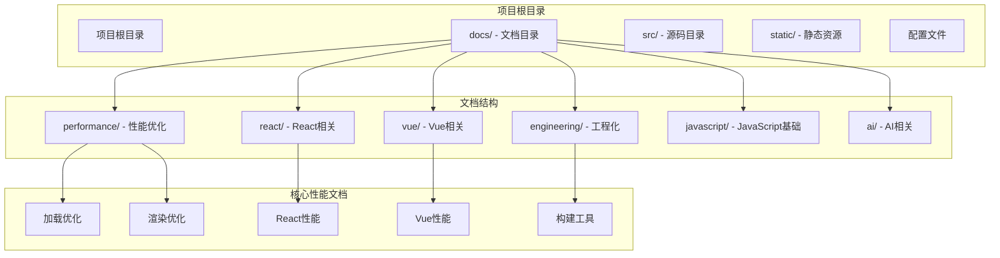
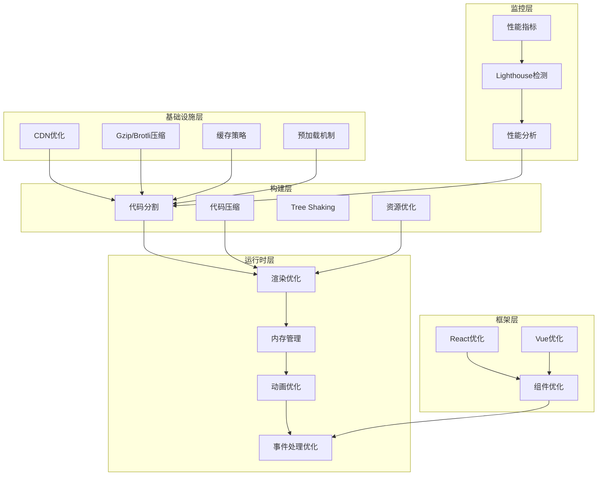
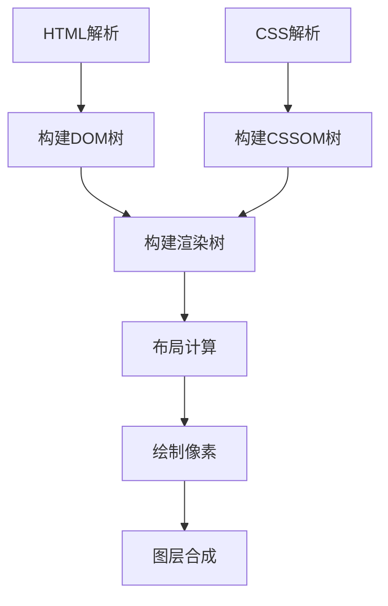
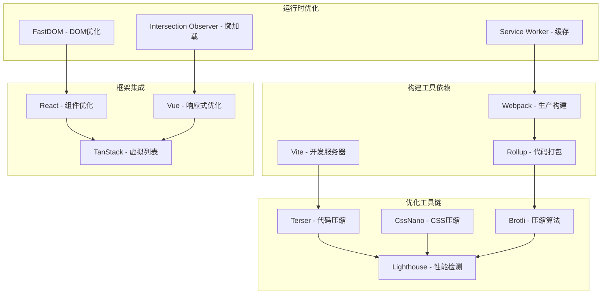
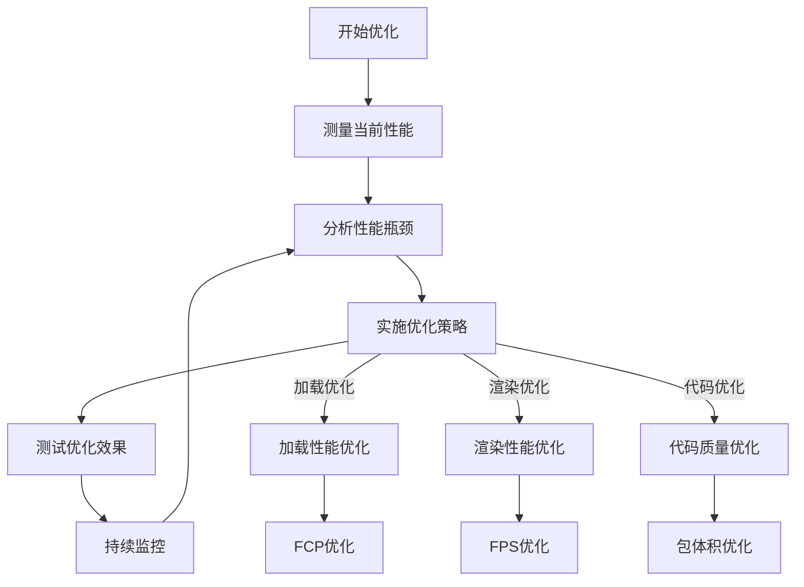
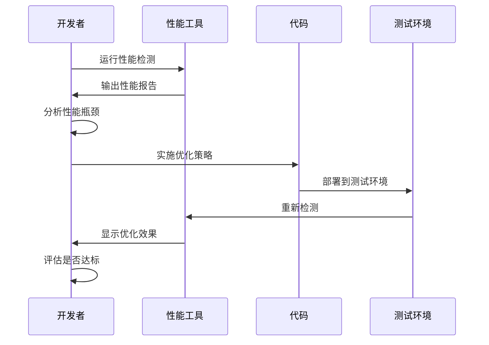

# 前端性能优化

<cite>
**本文档引用的文件**
- [loading-optimization.md](file://docs/performance/loading-optimization.md)
- [rendering-optimization.md](file://docs/performance/rendering-optimization.md)
- [performance.md](file://docs/react/performance.md)
- [performance.md](file://docs/vue/performance.md)
- [bundler.md](file://docs/engineering/bundler.md)
- [package.json](file://package.json)
- [README.md](file://README.md)
</cite>

## 目录
1. [引言](#引言)
2. [项目结构](#项目结构)
3. [核心组件](#核心组件)
4. [架构概览](#架构概览)
5. [详细组件分析](#详细组件分析)
6. [依赖关系分析](#依赖关系分析)
7. [性能考虑因素](#性能考虑因素)
8. [故障排除指南](#故障排除指南)
9. [结论](#结论)
10. [附录](#附录)

## 引言

前端性能优化是现代Web开发中的关键环节，直接影响用户体验和业务指标。本指南基于Docusaurus知识库中的性能优化相关内容，系统性地介绍了前端性能优化的各个方面，包括加载性能优化、渲染性能优化等核心主题。

前端性能优化不仅仅是技术问题，更是用户体验设计的重要组成部分。优秀的性能优化能够：
- 提升用户满意度和留存率
- 改善搜索引擎排名
- 降低带宽成本
- 提高应用的可访问性

## 项目结构

该项目是一个基于Docusaurus的静态网站生成器，专门用于知识库管理。项目结构清晰，采用模块化组织方式：



**图表来源**
- [README.md:1-42](file://README.md#L1-L42)
- [package.json:1-50](file://package.json#L1-L50)

**章节来源**
- [README.md:1-42](file://README.md#L1-L42)
- [package.json:1-50](file://package.json#L1-L50)

## 核心组件

### 加载性能优化组件

加载性能优化是用户对网站的第一印象，直接影响用户留存率。该组件涵盖了资源压缩、代码分割、图片优化等多个方面。

### 渲染性能优化组件

渲染性能优化关注浏览器渲染机制，通过理解关键渲染路径来优化页面的流畅度。

### 框架特定优化组件

针对React和Vue框架的性能优化策略，包括组件优化、虚拟列表、缓存策略等。

**章节来源**
- [loading-optimization.md:10-575](file://docs/performance/loading-optimization.md#L10-L575)
- [rendering-optimization.md:10-747](file://docs/performance/rendering-optimization.md#L10-L747)
- [performance.md:8-127](file://docs/react/performance.md#L8-L127)
- [performance.md:8-206](file://docs/vue/performance.md#L8-L206)

## 架构概览

前端性能优化体系采用分层架构，从底层基础设施到上层应用优化形成完整的优化链条：



**图表来源**
- [loading-optimization.md:350-425](file://docs/performance/loading-optimization.md#L350-L425)
- [rendering-optimization.md:16-63](file://docs/performance/rendering-optimization.md#L16-L63)
- [bundler.md:10-103](file://docs/engineering/bundler.md#L10-L103)

## 详细组件分析

### 加载性能优化详解

#### 资源压缩与合并

资源压缩是性能优化的基础，通过减少传输数据量来提升加载速度。主要策略包括：

**代码压缩策略**
- JavaScript压缩：使用Terser等工具进行代码压缩
- CSS压缩：使用cssnano等工具优化样式文件
- HTML压缩：移除空白字符和注释

**压缩算法对比**

| 压缩方式 | 压缩率 | 速度 | 浏览器支持 |
|----------|--------|------|------------|
| Gzip | 60-70% | 快 | 所有浏览器 |
| Brotli | 70-80% | 中等 | 现代浏览器 |

**章节来源**
- [loading-optimization.md:16-94](file://docs/performance/loading-optimization.md#L16-L94)

#### 代码分割与懒加载

代码分割是现代前端应用的重要优化策略，通过将大文件拆分为多个小文件来减少首屏加载时间。

**Webpack代码分割配置**
- 第三方库单独打包
- 公共模块提取
- 路由级别的代码分割

**框架特定实现**

**React路由懒加载**
```javascript
import { lazy, Suspense } from 'react';

const Home = lazy(() => import('./pages/Home'));
const About = lazy(() => import('./pages/About'));

function App() {
  return (
    <Suspense fallback={<Loading />}>
      <Routes>
        <Route path="/" element={<Home />} />
        <Route path="/about" element={<About />} />
      </Routes>
    </Suspense>
  );
}
```

**Vue路由懒加载**
```javascript
const routes = [
  {
    path: '/',
    component: () => import('./views/Home.vue'),
  },
  {
    path: '/dashboard',
    component: () => import(/* webpackChunkName: "dashboard" */ './views/Dashboard.vue'),
  },
];
```

**章节来源**
- [loading-optimization.md:96-215](file://docs/performance/loading-optimization.md#L96-L215)

#### 图片优化策略

图片是网页中最大的资源之一，优化图片可以显著提升页面性能。

**图片格式选择指南**
- 照片类：JPEG/ WebP（有损压缩）
- 图标/Logo：PNG/ SVG/ WebP
- 简单动画：GIF/ APNG/ WebP
- 复杂插画：SVG/ WebP

**懒加载实现**
```javascript
// Intersection Observer实现懒加载
function lazyLoadImages() {
  const images = document.querySelectorAll('img.lazy');
  
  const observer = new IntersectionObserver((entries) => {
    entries.forEach(entry => {
      if (entry.isIntersecting) {
        const img = entry.target;
        img.src = img.dataset.src;
        img.classList.remove('lazy');
        observer.unobserve(img);
      }
    });
  }, {
    rootMargin: '50px 0px',
  });

  images.forEach(img => observer.observe(img));
}
```

**响应式图片**
```html

```

**章节来源**
- [loading-optimization.md:218-346](file://docs/performance/loading-optimization.md#L218-L346)

#### 预加载与预获取

预加载机制允许浏览器提前获取关键资源，减少用户等待时间。

**资源提示类型**
- DNS预解析：`<link rel="dns-prefetch">`
- 预连接：`<link rel="preconnect">`
- 预加载：`<link rel="preload">`
- 预获取：`<link rel="prefetch">`
- 预渲染：`<link rel="prerender">`

**Service Worker缓存策略**
```javascript
const CACHE_NAME = 'v1';
const ASSETS = [
  '/',
  '/index.html',
  '/styles/main.css',
  '/scripts/app.js',
];

self.addEventListener('install', (event) => {
  event.waitUntil(
    caches.open(CACHE_NAME).then((cache) => {
      return cache.addAll(ASSETS);
    })
  );
});

self.addEventListener('fetch', (event) => {
  event.respondWith(
    caches.match(event.request).then((response) => {
      return response || fetch(event.request);
    })
  );
});
```

**章节来源**
- [loading-optimization.md:349-425](file://docs/performance/loading-optimization.md#L349-L425)

### 渲染性能优化详解

#### 浏览器渲染流程

理解浏览器渲染机制是优化渲染性能的关键。

**关键渲染路径**


**图表来源**
- [rendering-optimization.md:18-35](file://docs/performance/rendering-optimization.md#L18-L35)

**渲染开销对比**

| 操作类型 | 触发范围 | 性能开销 | 优化建议 |
|----------|----------|----------|----------|
| transform | 只触发Composite | 最便宜 | ✅ 优先使用 |
| opacity | 只触发Composite | 最便宜 | ✅ 优先使用 |
| color | 触发Paint+Composite | 中等 | ⚠️ 合理使用 |
| width/height | 触发Layout+Paint+Composite | 最贵 | ❌ 避免频繁修改 |

**章节来源**
- [rendering-optimization.md:16-63](file://docs/performance/rendering-optimization.md#L16-L63)

#### 重排与重绘优化

**避免强制同步布局**
```javascript
// ❌ 错误模式：读写交替
function badLayout() {
  const elements = document.querySelectorAll('.item');
  elements.forEach(el => {
    const width = el.offsetWidth; // 读取
    el.style.width = width + 10 + 'px'; // 写入
  });
}

// ✅ 正确模式：批量读取，批量写入
function goodLayout() {
  const elements = document.querySelectorAll('.item');
  
  // 批量读取
  const widths = Array.from(elements).map(el => el.offsetWidth);
  
  // 批量写入
  elements.forEach((el, i) => {
    el.style.width = widths[i] + 10 + 'px';
  });
}
```

**FastDOM优化**
```javascript
import fastdom from 'fastdom';

function optimizedLayout() {
  const elements = document.querySelectorAll('.item');
  
  elements.forEach(el => {
    fastdom.measure(() => {
      const width = el.offsetWidth;
      
      fastdom.mutate(() => {
        el.style.width = width + 10 + 'px';
      });
    });
  });
}
```

**章节来源**
- [rendering-optimization.md:66-163](file://docs/performance/rendering-optimization.md#L66-L163)

#### CSS动画优化

**GPU加速策略**
```css
/* 提升到合成层 */
.accelerated {
  /* 方法1：will-change */
  will-change: transform;
  
  /* 方法2：transform: translateZ(0) */
  transform: translateZ(0);
  
  /* 方法3：backface-visibility */
  backface-visibility: hidden;
}
```

**CSS contain隔离**
```css
.isolated-component {
  /* 布局隔离：内部布局不影响外部 */
  contain: layout;
  
  /* 样式隔离：计数器等不影响外部 */
  contain: style;
  
  /* 绘制隔离：内容不超出边界 */
  contain: paint;
  
  /* 完全隔离（推荐用于组件） */
  contain: strict;
  
  /* 内容隔离（常用） */
  contain: content;
}
```

**章节来源**
- [rendering-optimization.md:167-234](file://docs/performance/rendering-optimization.md#L167-L234)

#### JavaScript执行优化

**长任务拆分**
```javascript
// ✅ 使用时间切片
function processLargeArrayAsync(items, chunkSize = 100) {
  let index = 0;
  
  function processChunk() {
    const chunk = items.slice(index, index + chunkSize);
    chunk.forEach(item => heavyComputation(item));
    index += chunkSize;
    
    if (index < items.length) {
      requestAnimationFrame(processChunk);
    }
  }
  
  processChunk();
}
```

**Web Worker使用**
```javascript
// main.js - 主线程
const worker = new Worker('worker.js');

worker.postMessage({ data: largeDataset });

worker.onmessage = (event) => {
  const result = event.data;
  updateUI(result);
};

// worker.js - 工作线程
self.onmessage = (event) => {
  const { data } = event;
  
  // 耗时计算放在 Worker 中
  const result = heavyComputation(data);
  
  self.postMessage(result);
};
```

**章节来源**
- [rendering-optimization.md:279-371](file://docs/performance/rendering-optimization.md#L279-L371)

#### 列表渲染优化

**虚拟列表实现**
```javascript
// React虚拟列表
import { FixedSizeList } from 'react-window';

function VirtualList({ items }) {
  const Row = ({ index, style }) => (
    <div style={style}>
      {items[index].name}
    </div>
  );

  return (
    <FixedSizeList
      height={600}
      width="100%"
      itemCount={items.length}
      itemSize={50}
    >
      {Row}
    </FixedSizeList>
  );
}
```

**Vue虚拟列表**
```vue
<template>
  <RecycleScroller
    :items="items"
    :item-size="50"
    key-field="id"
  >
    <template #default="{ item }">
      <div class="list-item">
        {{ item.name }}
      </div>
    </template>
  </RecycleScroller>
</template>
```

**章节来源**
- [rendering-optimization.md:375-435](file://docs/performance/rendering-optimization.md#L375-L435)

#### 事件处理优化

**事件委托**
```javascript
// ✅ 事件委托
function goodEventHandling() {
  const list = document.querySelector('.list');
  
  list.addEventListener('click', (event) => {
    if (event.target.matches('.list-item')) {
      handleClick(event);
    }
  });
}
```

**防抖与节流**
```javascript
// 防抖：等待一段时间后执行
function debounce(fn, delay) {
  let timer = null;
  return function (...args) {
    clearTimeout(timer);
    timer = setTimeout(() => fn.apply(this, args), delay);
  };
}

// 节流：固定时间间隔执行
function throttle(fn, interval) {
  let lastTime = 0;
  return function (...args) {
    const now = Date.now();
    if (now - lastTime >= interval) {
      lastTime = now;
      fn.apply(this, args);
    }
  };
}
```

**章节来源**
- [rendering-optimization.md:439-497](file://docs/performance/rendering-optimization.md#L439-L497)

### 框架特定优化

#### React性能优化

**组件优化策略**
- `React.memo`：避免不必要的重渲染
- `useMemo`：缓存计算结果
- `useCallback`：缓存函数引用

**虚拟列表实现**
```javascript
import { useVirtualizer } from '@tanstack/react-virtual';

function VirtualList({ items }) {
  const parentRef = useRef(null);

  const virtualizer = useVirtualizer({
    count: items.length,
    getScrollElement: () => parentRef.current,
    estimateSize: () => 50,
  });

  return (
    <div ref={parentRef} style={{ height: '400px', overflow: 'auto' }}>
      <div style={{ height: `${virtualizer.getTotalSize()}px` }}>
        {virtualizer.getVirtualItems().map((virtualRow) => (
          <div
            key={virtualRow.index}
            style={{
              position: 'absolute',
              top: `${virtualRow.start}px`,
              height: `${virtualRow.size}px`,
            }}
          >
            {items[virtualRow.index].name}
          </div>
        ))}
      </div>
    </div>
  );
}
```

**章节来源**
- [performance.md:8-127](file://docs/react/performance.md#L8-L127)

#### Vue性能优化

**组件懒加载**
```vue
<script setup>
import { defineAsyncComponent } from 'vue';

const HeavyChart = defineAsyncComponent(() =>
  import('./components/HeavyChart.vue')
);

const AdminPanel = defineAsyncComponent({
  loader: () => import('./components/AdminPanel.vue'),
  loadingComponent: LoadingSpinner,
  errorComponent: ErrorDisplay,
  delay: 200,
  timeout: 10000,
});
</script>
```

**响应式优化**
```typescript
import { shallowRef, shallowReactive, triggerRef } from 'vue';

// shallowRef：只有 .value 变化才触发更新
const data = shallowRef({ list: [] });

// markRaw：标记为非响应式
const chart = markRaw(new Chart());
```

**章节来源**
- [performance.md:8-206](file://docs/vue/performance.md#L8-L206)

## 依赖关系分析

前端性能优化涉及多个层面的依赖关系，形成了复杂的优化生态系统：



**图表来源**
- [bundler.md:10-103](file://docs/engineering/bundler.md#L10-L103)
- [package.json:17-26](file://package.json#L17-L26)

**章节来源**
- [bundler.md:10-103](file://docs/engineering/bundler.md#L10-L103)
- [package.json:17-26](file://package.json#L17-L26)

## 性能考虑因素

### 性能指标与测量

前端性能优化需要建立科学的测量体系，常用的性能指标包括：

**核心性能指标**
- **FCP（首屏内容绘制时间）**：页面首次绘制内容的时间
- **LCP（最大内容绘制时间）**：页面主要内容完成渲染的时间
- **FID（首次输入延迟）**：用户首次交互的响应时间
- **CLS（累积布局偏移）**：页面布局稳定性的指标
- **INP（不连续输入延迟）**：持续交互的响应时间

**测量工具**
- **Lighthouse**：自动化性能检测工具
- **Chrome DevTools**：开发者工具中的性能面板
- **WebPageTest**：跨地区性能测试
- **Real User Monitoring**：真实用户监控

### 不同规模项目的优化策略

**小型项目（< 5个页面）**
- 重点优化首屏加载时间
- 使用CDN托管静态资源
- 启用Gzip/Brotli压缩
- 图片格式优化为WebP

**中型项目（5-50个页面）**
- 实施代码分割策略
- 建立缓存策略
- 优化图片懒加载
- 使用Service Worker

**大型项目（> 50个页面）**
- 完整的性能监控体系
- 组件级别的性能优化
- 虚拟列表和无限滚动
- 多CDN部署策略

### 性能优化最佳实践

**渐进式优化**


**章节来源**
- [loading-optimization.md:515-566](file://docs/performance/loading-optimization.md#L515-L566)
- [rendering-optimization.md:650-738](file://docs/performance/rendering-optimization.md#L650-L738)

## 故障排除指南

### 常见性能问题诊断

**加载缓慢问题**
1. **检查网络请求**
   - 使用Network面板查看请求时间
   - 分析是否有重复请求
   - 检查缓存策略是否生效

2. **分析资源大小**
   - 检查JS/CSS文件大小
   - 分析图片资源占用
   - 识别未使用的代码

**渲染卡顿问题**
1. **监控帧率**
   - 使用Performance面板录制
   - 分析长任务和阻塞操作
   - 检查重排重绘频率

2. **组件优化**
   - 检查不必要的重渲染
   - 分析props传递
   - 优化事件处理

**内存泄漏问题**
1. **监控内存使用**
   - 使用Memory面板分析
   - 检查事件监听器
   - 分析闭包引用

**章节来源**
- [rendering-optimization.md:501-596](file://docs/performance/rendering-optimization.md#L501-L596)

### 性能优化实施步骤

**实施流程**


**优化验证**
- 使用Lighthouse进行自动化测试
- 在真实设备上验证性能
- 建立性能基线和目标值
- 持续监控性能指标变化

## 结论

前端性能优化是一个系统性的工程，需要从多个维度综合考虑。通过合理运用本文介绍的优化策略和技术，可以显著提升Web应用的性能表现。

**关键要点总结**
- 加载性能优化是用户体验的第一关
- 渲染性能优化确保页面流畅度
- 框架特定优化发挥技术优势
- 建立完善的监控和测试体系
- 采用渐进式的优化策略

**未来发展方向**
- 更智能的自动化优化工具
- AI驱动的性能预测和优化
- 更严格的性能预算管理
- 更完善的性能监控生态

通过持续学习和实践这些优化技术，开发者可以建立系统的性能优化意识和技能，为用户提供更好的Web应用体验。

## 附录

### 性能优化工具推荐

**开发工具**
- **Webpack Bundle Analyzer**：分析打包结果
- **BundlePhobia**：查询npm包对包体积的影响
- **PurgeCSS**：移除未使用的CSS代码

**监控工具**
- **Sentry**：错误监控和性能追踪
- **Google Analytics**：用户行为分析
- **New Relic**：应用性能监控

**测试工具**
- **WebPageTest**：跨地区性能测试
- **GTmetrix**：网站性能分析
- **PageSpeed Insights**：Google官方性能检测

### 学习资源

**官方文档**
- [Web.dev性能优化指南](https://web.dev/performance/)
- [MDN性能优化](https://developer.mozilla.org/zh-CN/docs/Web/Performance)
- [Chrome开发者工具文档](https://developer.chrome.com/docs/devtools/)

**社区资源**
- [前端性能优化最佳实践](https://perf-tooling.today/)
- [CSS-Tricks性能指南](https://css-tricks.com/)
- [高性能JavaScript](https://addyosmani.com/resources/high-performance-javascript/)