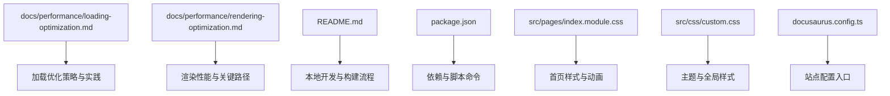
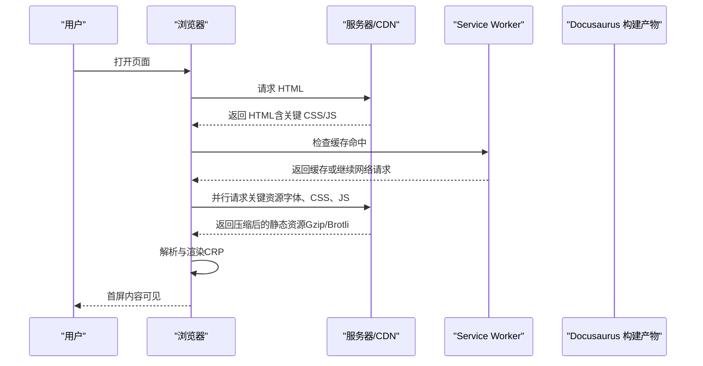
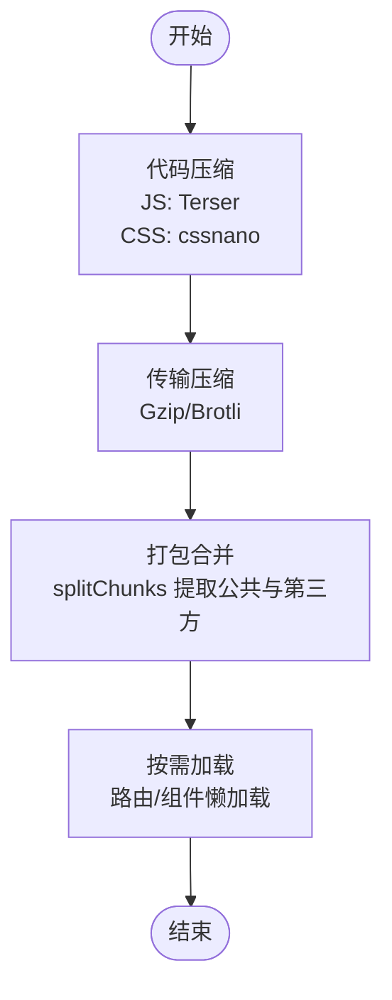
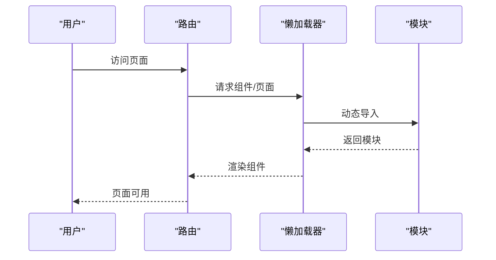
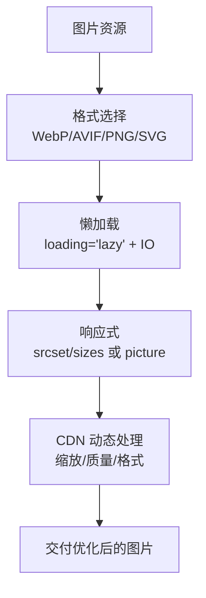
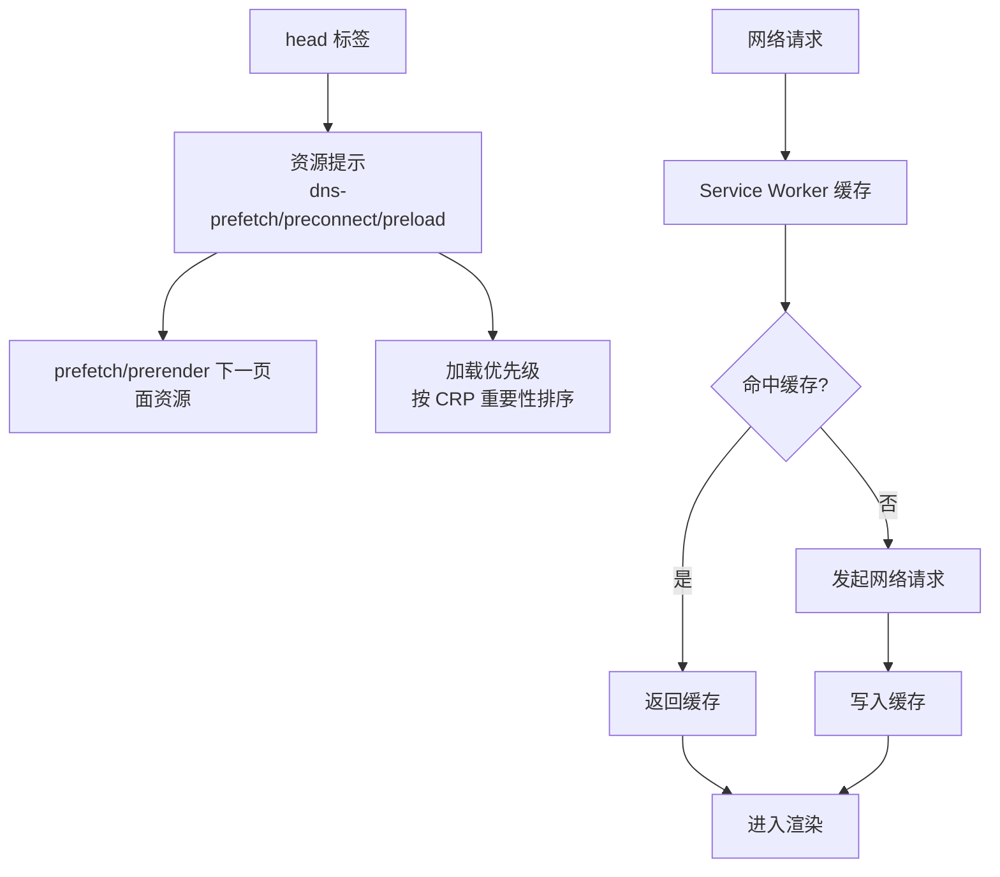
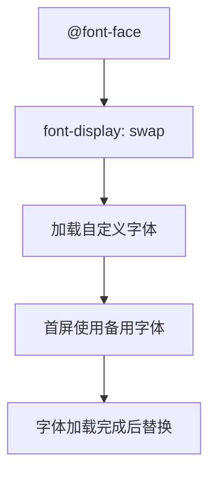
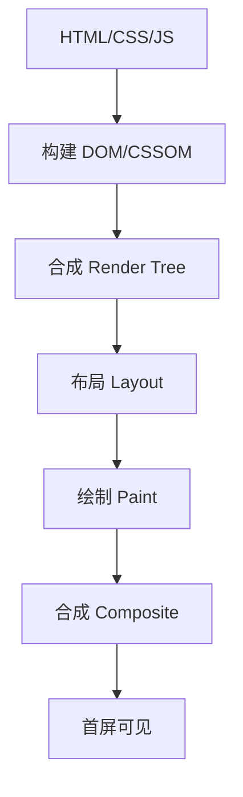
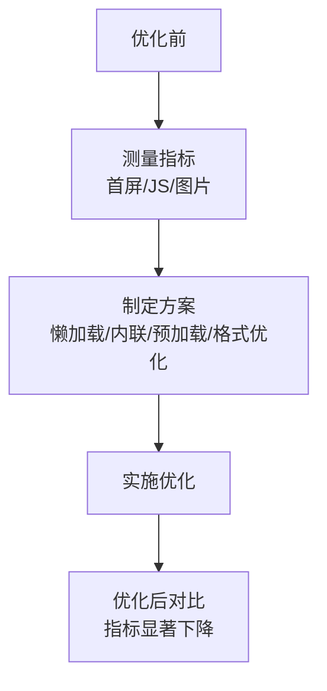
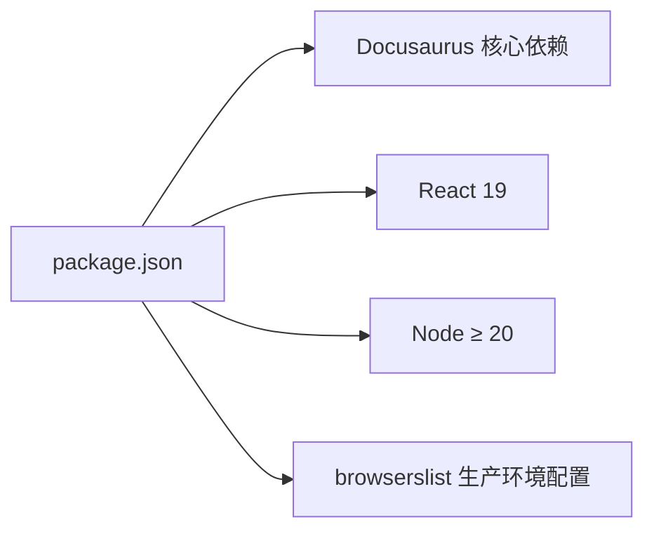

# 加载性能优化

<cite>
**本文引用的文件**
- [docs/performance/loading-optimization.md](file://docs/performance/loading-optimization.md)
- [docs/performance/rendering-optimization.md](file://docs/performance/rendering-optimization.md)
- [README.md](file://README.md)
- [package.json](file://package.json)
- [src/pages/index.module.css](file://src/pages/index.module.css)
- [src/css/custom.css](file://src/css/custom.css)
- [docusaurus.config.ts](file://docusaurus.config.ts)
</cite>

## 目录
1. [引言](#引言)
2. [项目结构](#项目结构)
3. [核心组件](#核心组件)
4. [架构总览](#架构总览)
5. [详细组件分析](#详细组件分析)
6. [依赖分析](#依赖分析)
7. [性能考量](#性能考量)
8. [故障排查指南](#故障排查指南)
9. [结论](#结论)
10. [附录](#附录)

## 引言
本指南聚焦“加载性能优化”，系统讲解前端页面加载过程中的关键策略与落地方法，覆盖资源压缩与合并、代码分割与懒加载、图片优化、预加载与预获取、字体优化、Service Worker 缓存等。同时结合 Docusaurus 知识库项目现状，给出可操作的优化建议与最佳实践，并通过实战案例展示优化前后对比，帮助开发者建立系统性的加载性能优化能力。

## 项目结构
该知识库采用 Docusaurus 3 静态站点生成器，文档内容位于 docs 目录，前端样式位于 src 目录，构建产物位于 build 目录。整体结构清晰，便于进行加载性能优化的落地与验证。

**图表来源**
- [README.md:1-42](file://README.md#L1-L42)
- [package.json:1-50](file://package.json#L1-L50)
- [src/pages/index.module.css:1-438](file://src/pages/index.module.css#L1-L438)
- [src/css/custom.css:1-644](file://src/css/custom.css#L1-L644)

**章节来源**
- [README.md:1-42](file://README.md#L1-L42)
- [package.json:1-50](file://package.json#L1-L50)

## 核心组件
围绕加载性能优化，本项目文档提供了以下核心内容：
- 资源压缩与合并：JS/CSS 压缩、Gzip/Brotli 压缩、打包合并策略
- 代码分割与懒加载：Webpack 分包、路由懒加载、组件懒加载
- 图片优化：格式选择、懒加载、响应式图片、CDN 动态处理
- 预加载与预获取：DNS 预解析、预连接、preload/prefetch/prerender、Service Worker 缓存
- 字体优化：font-display 策略、字体子集化
- 关键渲染路径与首屏加载：CRP 概念、首屏时间指标、内联关键 CSS
- 实战案例：电商首页优化前后对比与优化清单

这些内容直接对应加载性能优化的六大支柱：减小体积、减少请求数、异步加载、利用缓存、优化关键路径、提升交互体验。

**章节来源**
- [docs/performance/loading-optimization.md:16-575](file://docs/performance/loading-optimization.md#L16-L575)

## 架构总览
下图展示了从用户访问到页面可交互的关键路径，以及加载优化在其中的切入点：

**图表来源**
- [docs/performance/loading-optimization.md:349-425](file://docs/performance/loading-optimization.md#L349-L425)
- [docs/performance/rendering-optimization.md:16-35](file://docs/performance/rendering-optimization.md#L16-L35)

## 详细组件分析

### 资源压缩与合并
- 代码压缩：JS 使用 Terser，CSS 使用 cssnano，显著降低传输体积
- 传输压缩：Nginx 配置 Gzip 与 Brotli；Brotli 压缩率更高，现代浏览器支持良好
- 打包合并：Webpack splitChunks 提取第三方库与公共模块，减少重复与体积

**图表来源**
- [docs/performance/loading-optimization.md:16-94](file://docs/performance/loading-optimization.md#L16-L94)
- [docs/performance/loading-optimization.md:116-144](file://docs/performance/loading-optimization.md#L116-L144)

**章节来源**
- [docs/performance/loading-optimization.md:16-94](file://docs/performance/loading-optimization.md#L16-L94)
- [docs/performance/loading-optimization.md:116-144](file://docs/performance/loading-optimization.md#L116-L144)

### 代码分割与懒加载
- Webpack 分包：vendor 与 common 缓存友好，提升复用率
- 路由懒加载：React/Vue 场景下的按需加载，降低首屏 JS 体积
- 组件懒加载：在用户交互时再加载重型组件，提升首屏感知速度

**图表来源**
- [docs/performance/loading-optimization.md:146-214](file://docs/performance/loading-optimization.md#L146-L214)

**章节来源**
- [docs/performance/loading-optimization.md:96-216](file://docs/performance/loading-optimization.md#L96-L216)

### 图片优化策略
- 格式选择：优先 WebP/AVIF，图标/Logo 用 PNG/SVG/WebP
- 懒加载：原生 loading="lazy" 与 Intersection Observer
- 响应式图片：srcset/sizes 与 picture 元素
- CDN 动态处理：按需缩放、质量与格式转换

**图表来源**
- [docs/performance/loading-optimization.md:218-345](file://docs/performance/loading-optimization.md#L218-L345)

**章节来源**
- [docs/performance/loading-optimization.md:218-345](file://docs/performance/loading-optimization.md#L218-L345)

### 预加载与预获取
- 资源提示：dns-prefetch、preconnect、preload、prefetch、prerender
- 加载优先级：最高（主文档、关键 CSS）、高（字体、关键 JS）、中（视口内图片、异步脚本）、低（预加载资源、非关键 CSS）、最低（预获取、懒加载图片）
- Service Worker 缓存：安装期缓存关键资产，fetch 时优先返回缓存

**图表来源**
- [docs/performance/loading-optimization.md:349-425](file://docs/performance/loading-optimization.md#L349-L425)

**章节来源**
- [docs/performance/loading-optimization.md:349-427](file://docs/performance/loading-optimization.md#L349-L427)

### 字体优化
- font-display：swap 优先保证首屏文字可见，随后替换为自定义字体
- 字体子集化：仅包含常用字符，显著缩小字体体积

**图表来源**
- [docs/performance/loading-optimization.md:429-462](file://docs/performance/loading-optimization.md#L429-L462)

**章节来源**
- [docs/performance/loading-optimization.md:429-462](file://docs/performance/loading-optimization.md#L429-L462)

### 关键渲染路径与首屏加载
- 关键渲染路径（CRP）：HTML→DOM，CSS→CSSOM，Render Tree→Layout→Paint→Composite
- 首屏加载时间：通过内联关键 CSS、预加载关键资源、减少阻塞渲染的 JS/CSS 来缩短
- 项目现状：首页样式包含动画与渐变，建议内联首屏关键 CSS，延迟非关键样式

**图表来源**
- [docs/performance/rendering-optimization.md:16-35](file://docs/performance/rendering-optimization.md#L16-L35)
- [src/pages/index.module.css:1-438](file://src/pages/index.module.css#L1-L438)

**章节来源**
- [docs/performance/rendering-optimization.md:16-35](file://docs/performance/rendering-optimization.md#L16-L35)
- [src/pages/index.module.css:1-438](file://src/pages/index.module.css#L1-L438)

### 实战案例：电商首页优化
- 优化前：首屏 4.2 秒，JS 1.8MB，图片 3.5MB
- 优化措施：路由懒加载、WebP+懒加载、内联关键 CSS、预加载关键接口
- 优化后：首屏 1.1 秒（↓74%），JS 450KB（↓75%），图片 800KB（↓77%）

**图表来源**
- [docs/performance/loading-optimization.md:466-512](file://docs/performance/loading-optimization.md#L466-L512)

**章节来源**
- [docs/performance/loading-optimization.md:466-512](file://docs/performance/loading-optimization.md#L466-L512)

## 依赖分析
- 构建与运行：Docusaurus 3、React 19、Node ≥ 20
- 开发脚本：start/build/deploy/serve 等命令
- 浏览器兼容：browserslist 生产环境 >0.5%，非死循环，非 Opera Mini

**图表来源**
- [package.json:1-50](file://package.json#L1-L50)

**章节来源**
- [package.json:1-50](file://package.json#L1-L50)

## 性能考量
- 传输体积与请求数：优先使用 Brotli，合理拆分与合并，减少重复依赖
- 首屏体验：内联关键 CSS，预加载关键资源，避免阻塞渲染的 JS/CSS
- 图片与字体：格式优化、懒加载、响应式与 CDN 处理、font-display 与子集化
- 缓存策略：强缓存（Cache-Control）+ 协商缓存（ETag）+ Service Worker
- 交互与渲染：避免强制同步布局，使用 transform/opacity，requestAnimationFrame

[本节为通用指导，无需特定文件引用]

## 故障排查指南
- 首屏过慢
  - 检查是否内联关键 CSS、是否阻塞渲染的资源过多
  - 使用资源提示与预加载关键资源
- 图片加载慢
  - 是否使用 WebP/AVIF，是否懒加载，是否响应式
  - CDN 是否开启动态处理（缩放/质量/格式）
- 字体闪烁或空白
  - font-display 设置是否合理（swap/optional/block）
  - 是否启用字体子集化
- Service Worker 缓存问题
  - 检查安装与缓存清单是否正确
  - 确认 fetch 拦截逻辑与版本控制

**章节来源**
- [docs/performance/loading-optimization.md:395-425](file://docs/performance/loading-optimization.md#L395-L425)
- [docs/performance/loading-optimization.md:429-462](file://docs/performance/loading-optimization.md#L429-L462)

## 结论
加载性能优化是一个系统工程，需要从资源体积、请求数、加载顺序、缓存与关键路径等多个维度协同优化。结合本项目现状，建议优先实施：内联首屏关键 CSS、启用 Brotli 压缩、路由与组件懒加载、图片格式与懒加载优化、字体子集化与 font-display、Service Worker 缓存与资源提示。通过持续监控与迭代，可显著缩短首屏时间，提升用户留存与转化。

[本节为总结性内容，无需特定文件引用]

## 附录
- 推荐资源
  - [Web.dev 性能优化指南](https://web.dev/performance/)
  - [MDN 性能优化](https://developer.mozilla.org/zh-CN/docs/Web/Performance)
  - [Google PageSpeed Insights](https://pagespeed.web.dev/)
  - [Lighthouse 文档](https://developer.chrome.com/docs/lighthouse/)

**章节来源**
- [docs/performance/loading-optimization.md:569-575](file://docs/performance/loading-optimization.md#L569-L575)