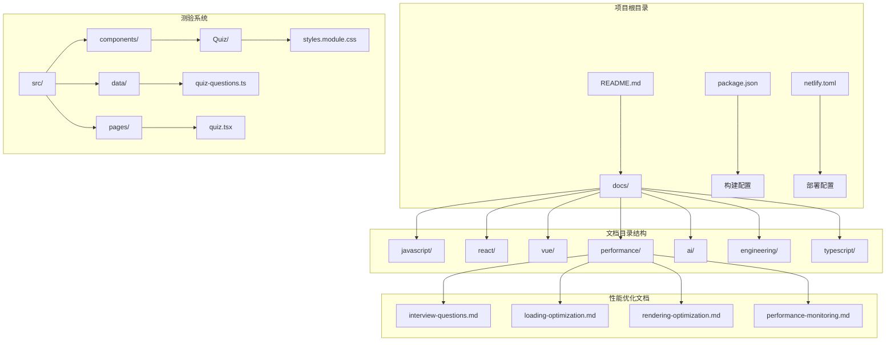
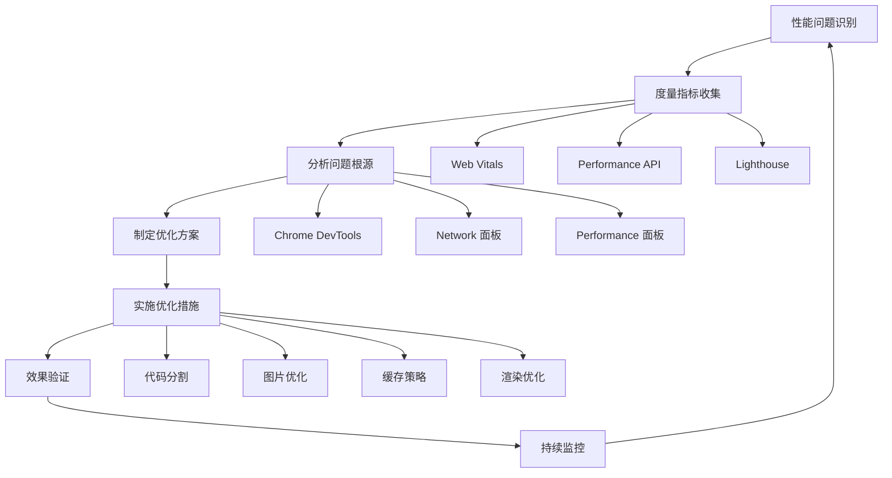
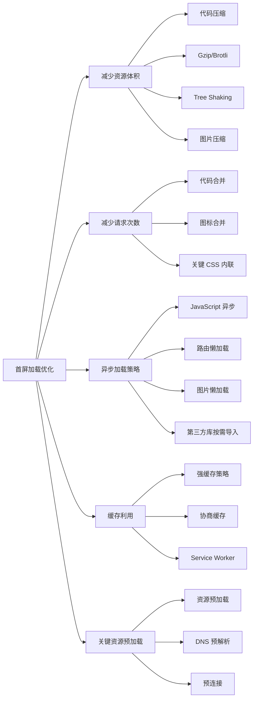
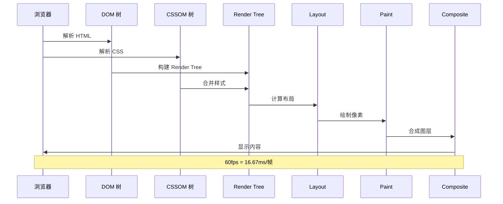
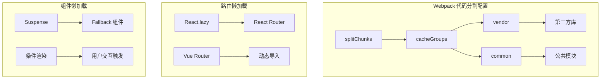
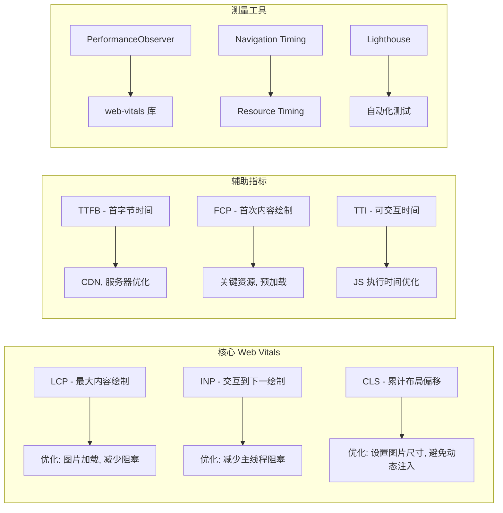
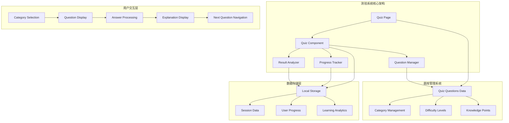
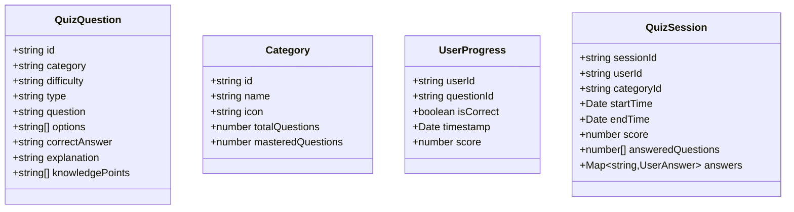
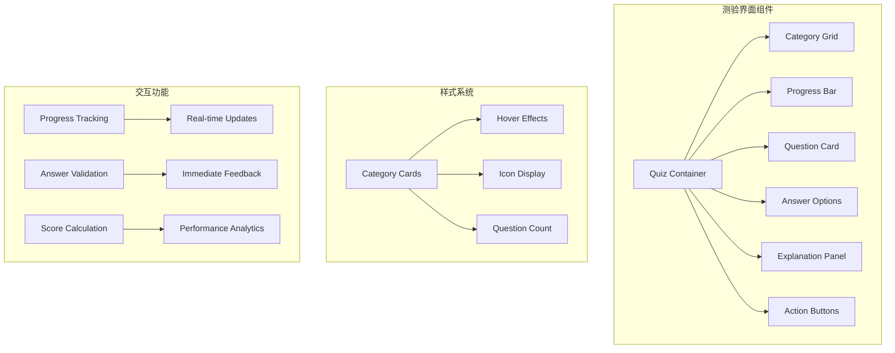

# 性能优化面试题精选

<cite>
**本文档引用的文件**
- [interview-questions.md](file://docs/performance/interview-questions.md)
- [loading-optimization.md](file://docs/performance/loading-optimization.md)
- [rendering-optimization.md](file://docs/performance/rendering-optimization.md)
- [performance-monitoring.md](file://docs/performance/performance-monitoring.md)
- [README.md](file://README.md)
- [package.json](file://package.json)
- [netlify.toml](file://netlify.toml)
- [intro.md](file://docs/intro.md)
- [quiz-questions.ts](file://src/data/quiz-questions.ts)
- [quiz.tsx](file://src/pages/quiz.tsx)
- [styles.module.css](file://src/components/Quiz/styles.module.css)
</cite>

## 更新摘要
**变更内容**
- 新增测验系统（Quiz System）章节，详细介绍测验功能的架构和实现
- 更新核心组件分析，加入测验系统的组件结构
- 增加测验系统的技术架构图和组件关系图
- 扩展面试准备建议，包含测验系统的使用方法
- 更新项目结构，反映新增的测验系统文件

## 目录
1. [简介](#简介)
2. [项目结构](#项目结构)
3. [核心组件](#核心组件)
4. [架构概览](#架构概览)
5. [详细组件分析](#详细组件分析)
6. [测验系统集成](#测验系统集成)
7. [依赖分析](#依赖分析)
8. [性能考虑](#性能考虑)
9. [故障排除指南](#故障排除指南)
10. [结论](#结论)
11. [附录](#附录)

## 简介

本项目是一个专门针对前端性能优化面试的知识库，涵盖了从基础概念到高级技巧的全方位性能优化内容。该项目基于 Docusaurus 构建，提供了系统化的性能优化知识体系，特别适合准备前端性能优化相关面试的开发者。

**项目特色更新**：
- **测验系统集成**：新增智能测验功能，支持多分类题库和个性化学习路径
- **互动式学习**：通过测验系统提供实时反馈和学习进度追踪
- **面试准备工具**：测验系统作为面试准备的扩展工具，提升学习效果

项目的核心价值在于：
- **系统性**：从加载性能到渲染性能，从网络优化到监控体系的完整覆盖
- **实用性**：每个知识点都配有具体的优化方案和实战案例
- **面试导向**：专注于面试官常问的问题和考察要点
- **可操作性**：提供可直接应用的优化策略和最佳实践
- **智能化**：测验系统提供个性化的学习体验和进度追踪

## 项目结构

该项目采用 Docusaurus 静态站点生成器构建，具有清晰的文档组织结构和新增的测验系统：



**图表来源**
- [README.md:1-42](file://README.md#L1-L42)
- [package.json:1-50](file://package.json#L1-L50)
- [netlify.toml:1-9](file://netlify.toml#L1-L9)

**章节来源**
- [README.md:1-42](file://README.md#L1-L42)
- [package.json:1-50](file://package.json#L1-L50)
- [netlify.toml:1-9](file://netlify.toml#L1-L9)

## 核心组件

### 性能优化知识体系

项目构建了一个完整的性能优化知识体系，包含以下核心模块：

#### 1. 面试题精选模块
- **页面加载类**：首屏加载时间优化、白屏问题排查、第三方库优化
- **渲染性能类**：重排重绘原理、长任务处理、DOM 操作优化
- **网络优化类**：缓存策略、HTTP/2 优化、资源预加载
- **框架优化类**：React 优化、Vue 优化、状态管理优化
- **综合场景类**：优化落地流程、常见误区、实战案例

#### 2. 优化技术模块
- **加载优化**：代码压缩、代码分割、图片优化、预加载策略
- **渲染优化**：浏览器渲染流程、CSS 动画优化、JavaScript 执行优化
- **监控体系**：性能指标、监控平台、自动化测试

#### 3. 测验系统模块（新增）
- **智能题库**：多分类题库管理、难度分级、知识点覆盖
- **学习路径**：个性化学习计划、进度追踪、错题回顾
- **交互体验**：响应式设计、实时反馈、学习统计
- **数据管理**：用户答题记录、学习数据分析、结果统计

**章节来源**
- [interview-questions.md:15-777](file://docs/performance/interview-questions.md#L15-L777)
- [loading-optimization.md:1-575](file://docs/performance/loading-optimization.md#L1-L575)
- [rendering-optimization.md:1-747](file://docs/performance/rendering-optimization.md#L1-L747)

## 架构概览

### 知识库架构设计

```mermaid
graph TB
subgraph "前端性能优化知识库"
A[面试题精选] --> B[加载性能优化]
A --> C[渲染性能优化]
A --> D[性能监控]
B --> E[代码压缩]
B --> F[图片优化]
B --> G[资源预加载]
C --> H[重排重绘]
C --> I[CSS 动画]
C --> J[JavaScript 优化]
D --> K[Web Vitals]
D --> L[Performance API]
D --> M[Lighthouse]
end
subgraph "测验系统架构"
N[Quiz System] --> O[题库管理]
N --> P[学习路径]
N --> Q[交互界面]
N --> R[数据统计]
O --> S[多分类题库]
O --> T[难度分级]
P --> U[个性化学习]
P --> V[进度追踪]
Q --> W[响应式设计]
Q --> X[实时反馈]
R --> Y[答题记录]
R --> Z[学习分析]
end
subgraph "技术栈"
AA[Docusaurus 3.10.1]
AB[React 19.0.0]
AC[TypeScript 6.0.2]
AD[MDX 支持]
AE[@docusaurus/faster]
AF[prism-react-renderer]
AG[clsx]
end
subgraph "部署架构"
AH[Netlify 部署]
AI[SPA 路由]
AJ[静态资源]
AK[测验系统集成]
end
A --> AA
B --> AA
C --> AA
D --> AA
N --> AA
AA --> AH
AK --> AH
```

**图表来源**
- [package.json:17-26](file://package.json#L17-L26)
- [netlify.toml:1-9](file://netlify.toml#L1-L9)

### 性能优化流程架构



**图表来源**
- [performance-monitoring.md:645-671](file://docs/performance/performance-monitoring.md#L645-L671)

## 详细组件分析

### 面试题精选模块分析

#### 页面加载类优化策略

**首屏加载时间优化**是面试中的高频问题，需要从多个维度进行分析：



**图表来源**
- [interview-questions.md:29-55](file://docs/performance/interview-questions.md#L29-L55)

**章节来源**
- [interview-questions.md:17-71](file://docs/performance/interview-questions.md#L17-L71)

#### 渲染性能优化深度解析

**重排（Reflow）与重绘（Repaint）**是理解浏览器渲染机制的关键概念：



**图表来源**
- [rendering-optimization.md:20-35](file://docs/performance/rendering-optimization.md#L20-L35)

**章节来源**
- [rendering-optimization.md:66-140](file://docs/performance/rendering-optimization.md#L66-L140)

### 加载性能优化模块

#### 代码分割与懒加载策略

**代码分割**是现代前端应用性能优化的重要手段：



**图表来源**
- [loading-optimization.md:118-144](file://docs/performance/loading-optimization.md#L118-L144)

**章节来源**
- [loading-optimization.md:96-215](file://docs/performance/loading-optimization.md#L96-L215)

### 性能监控模块

#### Web Vitals 指标体系

**Web Vitals**是 Google 推荐的核心性能指标：



**图表来源**
- [performance-monitoring.md:21-52](file://docs/performance/performance-monitoring.md#L21-L52)

**章节来源**
- [performance-monitoring.md:17-86](file://docs/performance/performance-monitoring.md#L17-L86)

## 测验系统集成

### 测验系统架构设计

**新增的测验系统**为项目提供了智能化的学习体验，集成了完整的题库管理和学习追踪功能：



**图表来源**
- [quiz.tsx:1-50](file://src/pages/quiz.tsx#L1-L50)
- [quiz-questions.ts:1-484](file://src/data/quiz-questions.ts#L1-L484)

### 测验系统组件分析

#### 题库数据结构

测验系统使用 TypeScript 定义了完整的题库数据结构：



**图表来源**
- [quiz-questions.ts:1-484](file://src/data/quiz-questions.ts#L1-L484)

#### 用户界面组件

测验系统采用现代化的响应式设计，提供了丰富的用户交互体验：



**图表来源**
- [styles.module.css:1-522](file://src/components/Quiz/styles.module.css#L1-L522)

**章节来源**
- [quiz-questions.ts:1-484](file://src/data/quiz-questions.ts#L1-L484)
- [quiz.tsx:1-50](file://src/pages/quiz.tsx#L1-L50)
- [styles.module.css:1-522](file://src/components/Quiz/styles.module.css#L1-L522)

## 依赖分析

### 技术栈依赖关系

```mermaid
graph TB
subgraph "核心依赖"
A[@docusaurus/core] --> B[静态站点生成]
C[react] --> D[UI 框架]
E[react-dom] --> F[DOM 操作]
end
subgraph "开发依赖"
G[typescript] --> H[类型检查]
I[@types/react] --> J[React 类型]
K[@docusaurus/module-type-aliases] --> L[Docusaurus 类型]
end
subgraph "构建工具"
M[browserslist] --> N[兼容性配置]
O[prism-react-renderer] --> P[代码高亮]
Q[clsx] --> R[类名合并]
end
subgraph "测验系统依赖"
S[quiz-questions.ts] --> T[题库数据管理]
U[styles.module.css] --> V[样式组件化]
W[quiz.tsx] --> X[页面组件]
end
subgraph "部署配置"
Y[netlify] --> Z[静态托管]
AA[SPA 路由] --> BB[单页应用]
end
A --> Y
C --> AA
E --> AA
S --> Y
U --> Y
W --> Y
```

**图表来源**
- [package.json:17-33](file://package.json#L17-L33)
- [netlify.toml:1-9](file://netlify.toml#L1-L9)

### 性能优化相关依赖

项目中涉及的性能优化相关依赖包括：

- **@docusaurus/faster**: Docusaurus 性能优化扩展
- **@docusaurus/preset-classic**: 经典预设，包含多种优化特性
- **prism-react-renderer**: 代码高亮，提升文档渲染性能
- **clsx**: 类名合并工具，减少 DOM 操作

**章节来源**
- [package.json:17-33](file://package.json#L17-L33)

## 性能考虑

### 构建性能优化

项目在构建阶段采用了多项优化策略：

1. **TypeScript 类型检查**：通过 `typecheck` 脚本在构建前进行类型检查
2. **Browserslist 配置**：针对现代浏览器优化，减少 polyfill
3. **静态资源优化**：Docusaurus 自动处理静态资源的优化和缓存
4. **测验系统优化**：题库数据采用 TypeScript 类型定义，提升开发效率

### 运行时性能优化

1. **SPA 路由**：通过 Netlify 的 SPA 路由配置，支持单页应用的客户端路由
2. **代码分割**：Docusaurus 自动进行代码分割，提升页面加载速度
3. **静态内容托管**：使用 Netlify 的 CDN 加速静态资源分发
4. **测验系统性能**：采用 React 组件化设计，支持虚拟 DOM 和高效的 UI 更新

### 开发体验优化

1. **热重载**：开发服务器支持实时更新
2. **本地开发**：一键启动本地开发环境
3. **构建优化**：生产构建自动进行代码压缩和优化
4. **测验系统开发**：TypeScript 提供完整的类型安全和智能提示

## 故障排除指南

### 常见性能问题诊断

#### 首屏加载缓慢

**症状表现**：
- 页面空白时间过长
- 资源加载阻塞
- 交互延迟明显

**诊断步骤**：
1. 使用 Chrome DevTools Network 面板分析资源加载
2. 检查关键资源的加载顺序
3. 分析是否存在阻塞渲染的资源
4. 检查缓存策略的有效性

**解决方案**：
- 实施代码分割和懒加载
- 优化图片格式和大小
- 使用 CDN 和缓存策略
- 关键 CSS 内联

#### 渲染性能问题

**症状表现**：
- 页面卡顿
- 滚动不流畅
- 动画掉帧

**诊断步骤**：
1. 使用 Chrome DevTools Performance 面板分析渲染性能
2. 检查是否存在长任务
3. 分析重排重绘的频率
4. 监控内存使用情况

**解决方案**：
- 使用 transform 和 opacity 优化动画
- 实施虚拟列表优化大数据渲染
- 避免强制同步布局
- 使用 requestAnimationFrame

#### 监控系统问题

**症状表现**：
- 性能指标缺失
- 数据上报失败
- 监控告警异常

**诊断步骤**：
1. 检查网络连接和防火墙设置
2. 验证监控 SDK 的初始化
3. 检查采样率和过滤规则
4. 分析数据传输和存储

**解决方案**：
- 实施优雅降级策略
- 增加重试机制
- 优化数据上报频率
- 建立监控告警机制

#### 测验系统问题

**症状表现**：
- 题目加载失败
- 答题无响应
- 进度保存异常
- 样式显示错误

**诊断步骤**：
1. 检查题库数据格式是否正确
2. 验证 React 组件的渲染逻辑
3. 检查本地存储的数据完整性
4. 分析样式文件的加载情况

**解决方案**：
- 实施数据验证和错误处理
- 增加组件的健壮性
- 优化数据持久化策略
- 完善样式文件的加载机制

**章节来源**
- [performance-monitoring.md:675-780](file://docs/performance/performance-monitoring.md#L675-L780)

## 结论

本项目构建了一个全面而实用的前端性能优化知识库，具有以下特点：

### 核心优势

1. **系统完整性**：从基础概念到高级技巧的完整覆盖
2. **实用性强**：每个知识点都配有具体的优化方案和实战案例
3. **面试导向**：专注于面试官常问的问题和考察要点
4. **可操作性**：提供可直接应用的优化策略和最佳实践
5. **智能化扩展**：新增测验系统提供个性化的学习体验

### 学习价值

- **理论基础**：深入理解浏览器渲染机制和性能指标
- **实践技能**：掌握各种性能优化技术和工具
- **问题解决**：培养系统性的问题分析和解决能力
- **面试准备**：为前端性能优化相关面试做好充分准备
- **学习工具**：测验系统提供智能化的学习辅助工具

### 发展前景

随着前端技术的不断发展，性能优化仍然是前端开发的核心技能之一。本项目为学习者提供了：
- 持续更新的技术内容
- 实战案例的积累
- 社区交流和分享的机会
- 职业发展的支撑
- 智能化学习工具的创新应用

## 附录

### 性能优化最佳实践清单

#### 加载优化
- 实施代码分割和懒加载
- 优化图片格式和大小
- 使用 CDN 和缓存策略
- 关键 CSS 内联
- 减少 HTTP 请求

#### 渲染优化
- 使用 transform 和 opacity 优化动画
- 避免强制同步布局
- 实施虚拟列表优化大数据渲染
- 使用 requestAnimationFrame
- 减少 DOM 操作

#### 监控优化
- 建立完整的性能指标体系
- 实施自动化性能测试
- 建立监控告警机制
- 持续跟踪性能趋势

#### 面试准备建议
- 系统学习性能优化理论
- 实践各种优化技术
- 准备具体案例和数据
- 练习问题分析和解决思路
- **测验系统使用**：利用智能测验系统进行针对性练习和知识巩固

#### 测验系统使用指南
- **多分类学习**：根据个人薄弱环节选择相应题库
- **难度分级**：从简单到困难逐步提升
- **错题回顾**：重点复习错误题目，巩固知识点
- **进度追踪**：监控学习进度，及时调整学习计划
- **实时反馈**：获得即时的答案解析和学习建议

**章节来源**
- [interview-questions.md:743-777](file://docs/performance/interview-questions.md#L743-L777)
- [quiz-questions.ts:1-484](file://src/data/quiz-questions.ts#L1-L484)
- [styles.module.css:1-522](file://src/components/Quiz/styles.module.css#L1-L522)