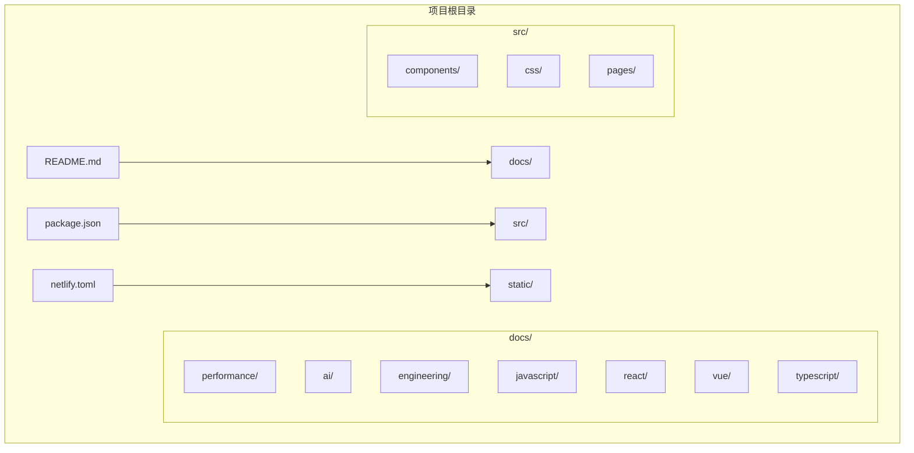
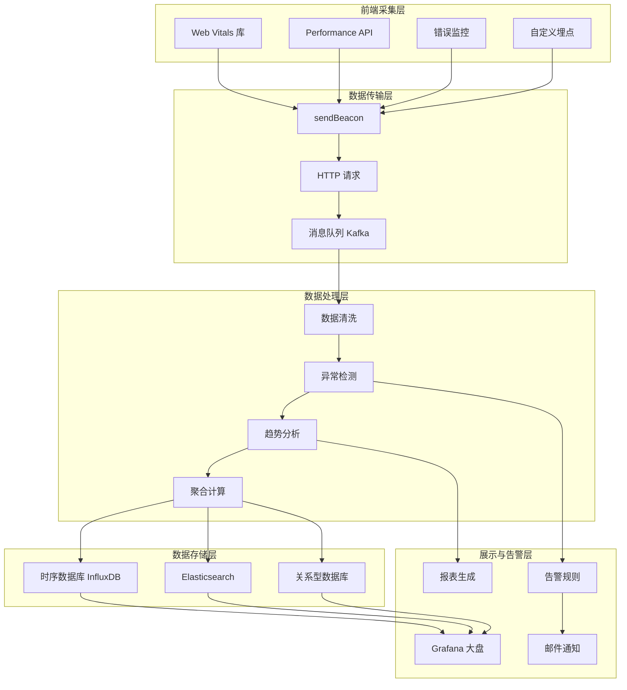
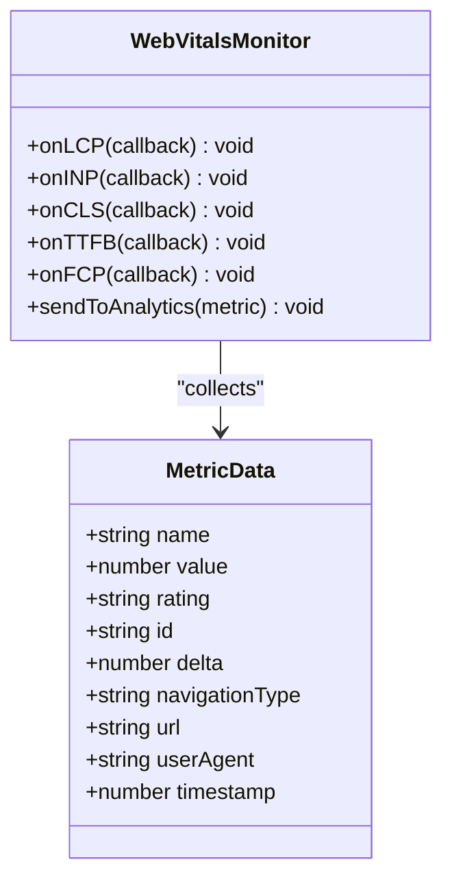
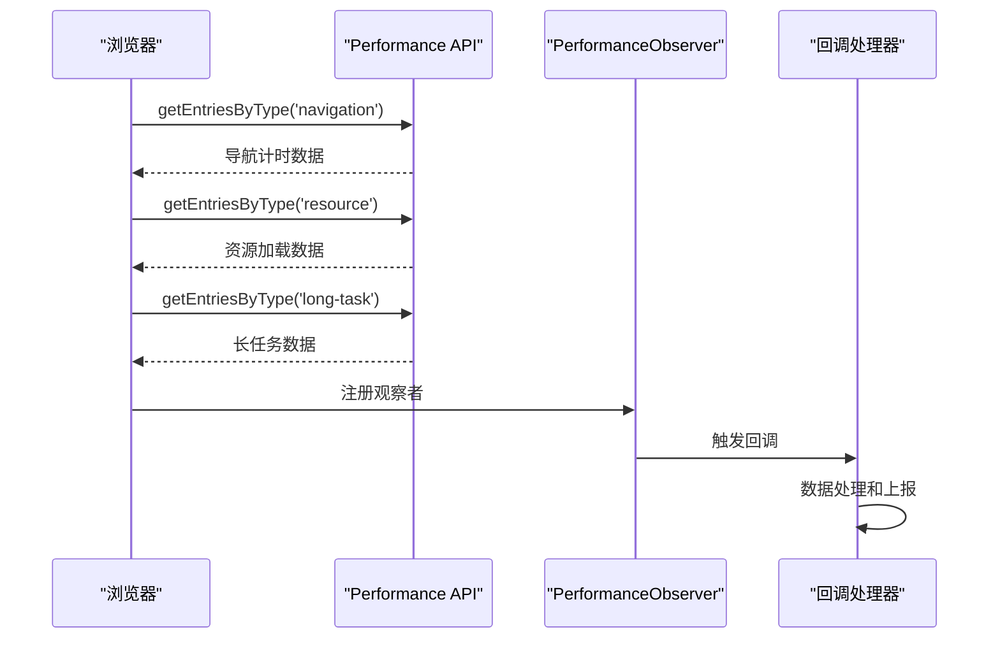
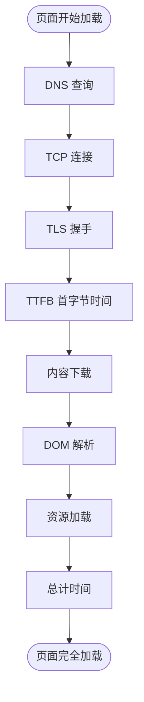
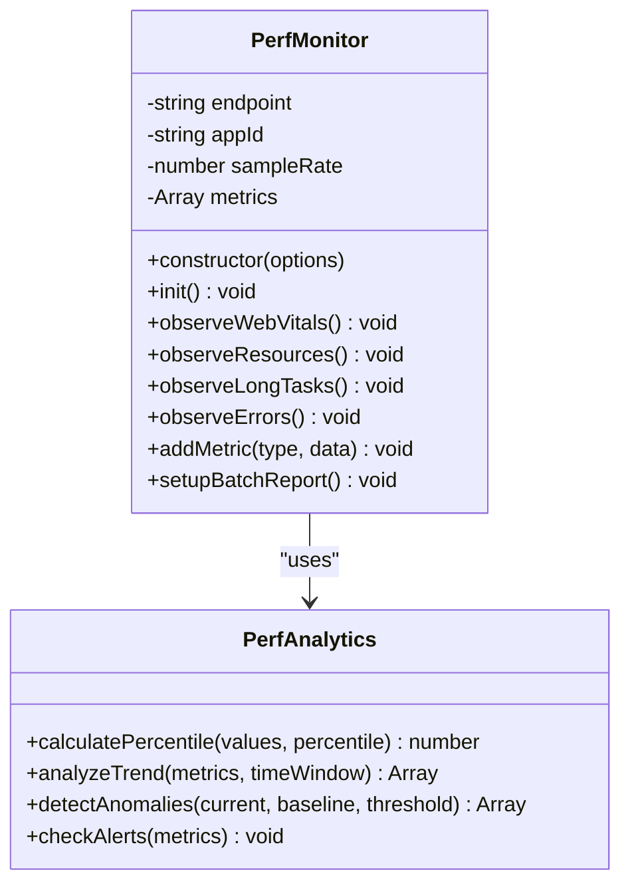
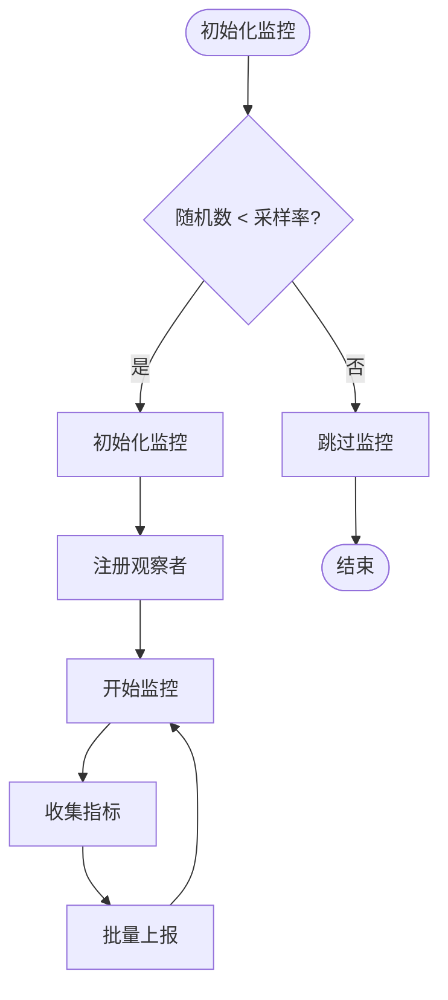
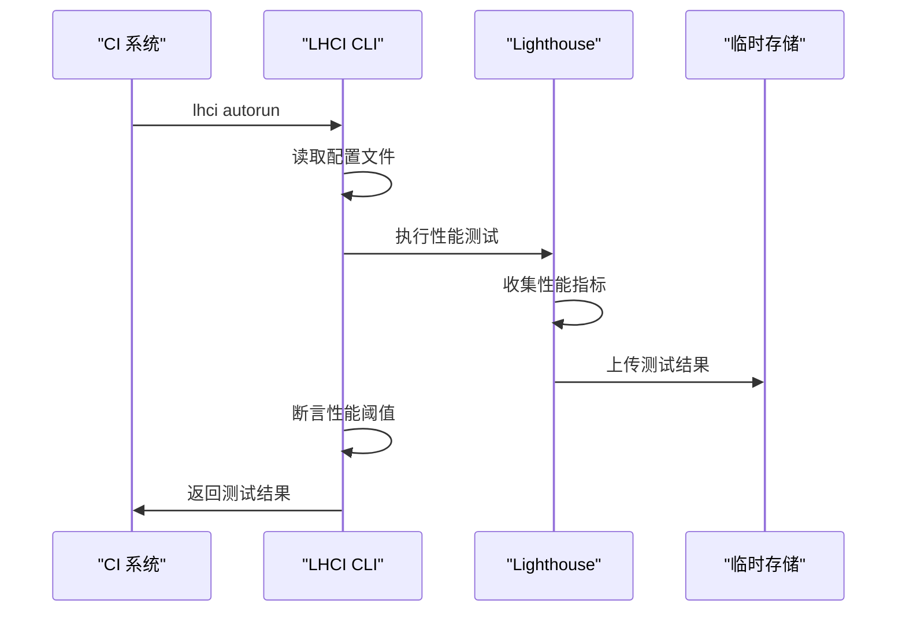
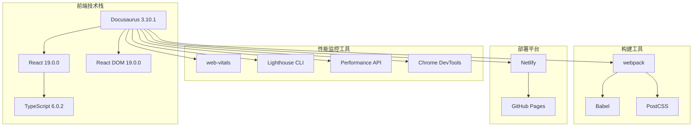

# 性能监控

<cite>
**本文档引用的文件**
- [README.md](file://README.md)
- [package.json](file://package.json)
- [netlify.toml](file://netlify.toml)
- [performance-monitoring.md](file://docs/performance/performance-monitoring.md)
- [loading-optimization.md](file://docs/performance/loading-optimization.md)
- [rendering-optimization.md](file://docs/performance/rendering-optimization.md)
- [interview-questions.md](file://docs/performance/interview-questions.md)
- [index.module.css](file://src/pages/index.module.css)
</cite>

## 目录
1. [简介](#简介)
2. [项目结构](#项目结构)
3. [核心组件](#核心组件)
4. [架构概览](#架构概览)
5. [详细组件分析](#详细组件分析)
6. [依赖关系分析](#依赖关系分析)
7. [性能考量](#性能考量)
8. [故障排除指南](#故障排除指南)
9. [结论](#结论)
10. [附录](#附录)

## 简介
本项目是一个基于 Docusaurus 的静态网站生成器，专注于前端性能优化知识的整理与分享。项目特别强调性能监控体系的建设，涵盖了从指标采集、数据分析到告警通知的完整闭环。

该项目的核心价值在于提供一套系统性的性能监控解决方案，包括：
- Web Vitals 核心指标采集
- 性能 API 深度使用
- Lighthouse 持续集成
- 自定义监控平台搭建
- 实战案例与最佳实践

## 项目结构
项目采用标准的 Docusaurus 3.x 结构，主要目录组织如下：

**图表来源**
- [README.md:1-42](file://README.md#L1-L42)
- [package.json:1-50](file://package.json#L1-L50)

**章节来源**
- [README.md:1-42](file://README.md#L1-L42)
- [package.json:1-50](file://package.json#L1-L50)

## 核心组件
基于项目内容分析，性能监控系统包含以下核心组件：

### 1. 指标采集层
- **Web Vitals 采集**：使用 web-vitals 库进行核心指标监控
- **Performance API 监控**：导航计时、资源计时、长任务监控
- **自定义指标**：错误监控、资源加载监控

### 2. 数据传输层
- **sendBeacon 传输**：确保页面卸载时的数据发送
- **批量上报机制**：定期批量发送减少请求次数
- **采样控制**：降低服务端压力

### 3. 数据处理层
- **数据分析服务**：计算百分位数、趋势分析
- **异常检测**：同比/环比阈值检测
- **告警生成**：性能回归告警

### 4. 展示与存储层
- **Grafana 可视化**：实时性能大盘
- **时序数据库**：InfluxDB 存储指标数据
- **Elasticsearch**：日志和错误数据存储

**章节来源**
- [performance-monitoring.md:407-821](file://docs/performance/performance-monitoring.md#L407-L821)

## 架构概览
完整的性能监控架构分为五个层次：

**图表来源**
- [performance-monitoring.md:787-821](file://docs/performance/performance-monitoring.md#L787-L821)

## 详细组件分析

### Web Vitals 指标采集
Web Vitals 是 Google 推荐的核心用户体验指标，包含以下四个关键指标：

**图表来源**
- [performance-monitoring.md:55-86](file://docs/performance/performance-monitoring.md#L55-L86)

#### 核心指标详解
| 指标 | 衡量内容 | 采集方式 | 优化方向 |
|------|----------|----------|----------|
| **LCP** | 最大内容元素渲染时间 | PerformanceObserver | 图片优化、减少阻塞资源 |
| **INP** | 用户交互响应延迟 | PerformanceObserver | 减少主线程阻塞、拆分长任务 |
| **CLS** | 页面布局稳定性 | PerformanceObserver | 设置图片尺寸、避免动态注入 |
| **TTFB** | 服务器响应速度 | Navigation Timing | CDN、服务器优化、缓存 |
| **FCP** | 首次内容绘制 | PerformanceObserver | 减少关键资源、预加载 |
| **TTI** | 页面可交互时间 | Lighthouse | 减少 JS 执行时间 |

**章节来源**
- [performance-monitoring.md:17-52](file://docs/performance/performance-monitoring.md#L17-L52)

### Performance API 深度使用
Performance API 提供了详细的性能数据采集能力：

**图表来源**
- [performance-monitoring.md:90-284](file://docs/performance/performance-monitoring.md#L90-L284)

#### 导航计时分析
导航计时提供了页面加载的详细时间分解：

**图表来源**
- [performance-monitoring.md:94-149](file://docs/performance/performance-monitoring.md#L94-L149)

**章节来源**
- [performance-monitoring.md:90-284](file://docs/performance/performance-monitoring.md#L90-L284)

### 自定义监控 SDK
项目实现了完整的监控 SDK，包含以下功能特性：

**图表来源**
- [performance-monitoring.md:411-611](file://docs/performance/performance-monitoring.md#L411-L611)

#### 采样控制机制
监控 SDK 实现了智能采样控制，平衡数据完整性和性能开销：

**图表来源**
- [performance-monitoring.md:422-440](file://docs/performance/performance-monitoring.md#L422-L440)

**章节来源**
- [performance-monitoring.md:407-611](file://docs/performance/performance-monitoring.md#L407-L611)

### Lighthouse 持续集成
Lighthouse 作为自动化性能测试工具，提供了全面的性能评估：

**图表来源**
- [performance-monitoring.md:326-366](file://docs/performance/performance-monitoring.md#L326-L366)

#### Lighthouse 评分体系
Lighthouse 提供了多维度的性能评估：

| 评估维度 | 权重 | 关键指标 | 优化建议 |
|----------|------|----------|----------|
| **Performance** | 25% | FCP、SI、LCP、TTI、TBT、CLS | 减少阻塞时间、优化资源加载 |
| **Accessibility** | 15% | 色彩对比度、ARIA 标签、键盘导航 | 提升可访问性 |
| **Best Practices** | 15% | HTTPS、控制台错误、图片尺寸 | 遵循最佳实践 |
| **SEO** | 15% | meta 标签、结构化数据、移动端适配 | 优化搜索引擎可见性 |

**章节来源**
- [performance-monitoring.md:288-403](file://docs/performance/performance-monitoring.md#L288-L403)

## 依赖关系分析
项目的技术栈和依赖关系如下：

**图表来源**
- [package.json:17-33](file://package.json#L17-L33)

**章节来源**
- [package.json:1-50](file://package.json#L1-50)

## 性能考量
基于项目内容分析，性能监控系统的关键考量因素：

### 1. 指标选择与权重
- **核心 Web Vitals**：LCP、INP、CLS 作为主要指标
- **传统指标**：TTFB、FCP、TTI 作为补充指标
- **资源指标**：资源大小、请求数量、缓存命中率

### 2. 数据采集策略
- **实时监控**：使用 PerformanceObserver 实时采集
- **批量上报**：减少请求频率，降低网络开销
- **采样控制**：平衡数据质量和性能影响

### 3. 存储与查询优化
- **时序数据库**：适合存储时间序列性能数据
- **索引策略**：按时间、指标类型、URL 等维度建立索引
- **数据归档**：历史数据冷热分离存储

### 4. 可视化与告警
- **实时监控面板**：Grafana 实时展示关键指标
- **阈值告警**：基于同比/环比变化的智能告警
- **趋势分析**：长期趋势和短期波动分析

## 故障排除指南

### 1. 指标采集问题
**问题现象**：某些指标无法正常采集
**排查步骤**：
1. 检查浏览器兼容性
2. 验证 PerformanceObserver 是否可用
3. 确认网络环境和权限设置
4. 检查 CSP 策略配置

**解决方案**：
- 使用 polyfill 增强兼容性
- 实现降级方案处理异常情况
- 添加详细的错误日志记录

### 2. 数据传输失败
**问题现象**：监控数据无法正常上报
**排查步骤**：
1. 检查 sendBeacon API 支持情况
2. 验证网络连接状态
3. 确认服务器端点可用性
4. 检查请求头和跨域配置

**解决方案**：
- 实现多种传输方式的降级处理
- 添加重试机制和错误恢复
- 优化请求负载大小

### 3. 性能影响问题
**问题现象**：监控系统本身影响页面性能
**排查步骤**：
1. 分析监控代码的执行时间
2. 检查内存使用情况
3. 评估网络请求开销
4. 监控 CPU 使用率

**解决方案**：
- 实施采样控制机制
- 优化数据处理逻辑
- 减少不必要的计算和网络请求

**章节来源**
- [performance-monitoring.md:825-884](file://docs/performance/performance-monitoring.md#L825-L884)

## 结论
本项目提供了一个完整的前端性能监控解决方案，具有以下特点：

### 核心优势
1. **系统性**：覆盖从指标采集到告警通知的完整流程
2. **实用性**：结合实际项目经验，提供可操作的优化建议
3. **可扩展性**：模块化的架构设计，便于功能扩展
4. **易用性**：提供详细的配置示例和最佳实践

### 技术亮点
- 基于 Web Vitals 的现代化指标体系
- 智能采样控制，平衡数据质量与性能影响
- Lighthouse 持续集成，确保性能回归控制
- 完整的监控平台架构设计

### 应用价值
该监控体系不仅适用于本项目，也可直接应用于其他前端项目的性能监控需求，为提升用户体验和网站性能提供强有力的技术支撑。

## 附录

### 性能监控最佳实践
1. **指标选择**：优先关注用户感知指标（LCP、INP、CLS）
2. **采样策略**：根据业务规模调整采样率
3. **告警阈值**：基于历史数据设定合理的阈值
4. **持续优化**：定期回顾和调整监控策略

### 常用工具推荐
- **性能分析**：Chrome DevTools、Lighthouse
- **监控平台**：Grafana + InfluxDB
- **错误监控**：Sentry、Bugsnag
- **APM 工具**：New Relic、DataDog