# 性能监控

<cite>
**本文档引用的文件**
- [README.md](file://README.md)
- [package.json](file://package.json)
- [loading-optimization.md](file://docs/performance/loading-optimization.md)
- [rendering-optimization.md](file://docs/performance/rendering-optimization.md)
- [react-performance.md](file://docs/react/performance.md)
- [vue-performance.md](file://docs/vue/performance.md)
- [index.module.css](file://src/pages/index.module.css)
- [tsconfig.json](file://tsconfig.json)
</cite>

## 目录
1. [简介](#简介)
2. [项目结构](#项目结构)
3. [核心组件](#核心组件)
4. [架构概览](#架构概览)
5. [详细组件分析](#详细组件分析)
6. [依赖关系分析](#依赖关系分析)
7. [性能考虑](#性能考虑)
8. [故障排除指南](#故障排除指南)
9. [结论](#结论)

## 简介

本指南旨在为前端性能监控建立完整的实施体系，涵盖Web Vitals指标监控、性能数据埋点采集、性能监控平台搭建等核心技术。通过系统化的监控体系建设，帮助开发者建立完善的性能监控体系，提升用户体验并降低维护成本。

## 项目结构

该知识库采用Docusaurus静态站点生成器构建，主要包含以下结构：

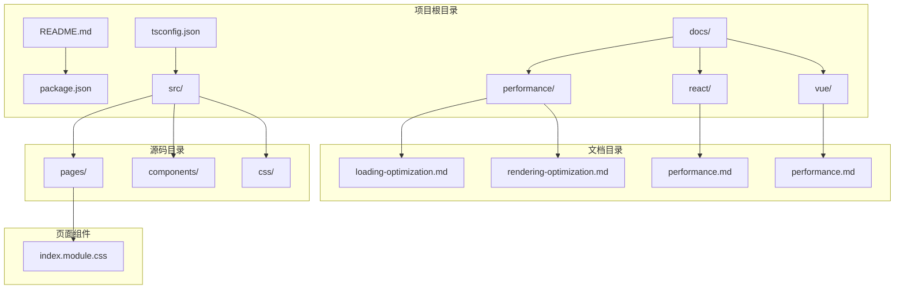

**图表来源**
- [README.md:1-42](file://README.md#L1-L42)
- [package.json:1-50](file://package.json#L1-L50)

**章节来源**
- [README.md:1-42](file://README.md#L1-L42)
- [package.json:1-50](file://package.json#L1-L50)

## 核心组件

### 性能监控基础架构

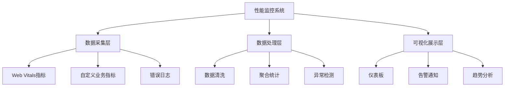

### Web Vitals指标体系

Web Vitals是Google提出的现代Web性能标准，包含三个核心指标：

| 指标名称 | 定义 | 重要性 | 监控阈值 |
|---------|------|--------|----------|
| LCP | 最大内容绘制 | 页面可见内容渲染速度 | ≤2.5秒 |
| FID | 首次输入延迟 | 交互响应速度 | ≤100ms |
| CLS | 累积布局偏移 | 页面稳定性 | ≤0.1 |

**章节来源**
- [loading-optimization.md:10-575](file://docs/performance/loading-optimization.md#L10-L575)
- [rendering-optimization.md:10-747](file://docs/performance/rendering-optimization.md#L10-L747)

## 架构概览

### 性能监控技术栈

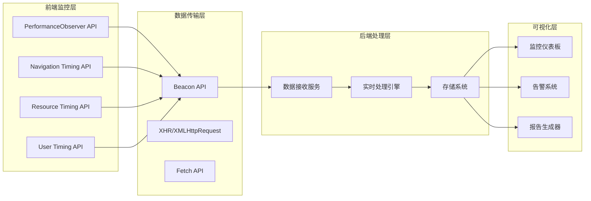

### 性能监控数据流

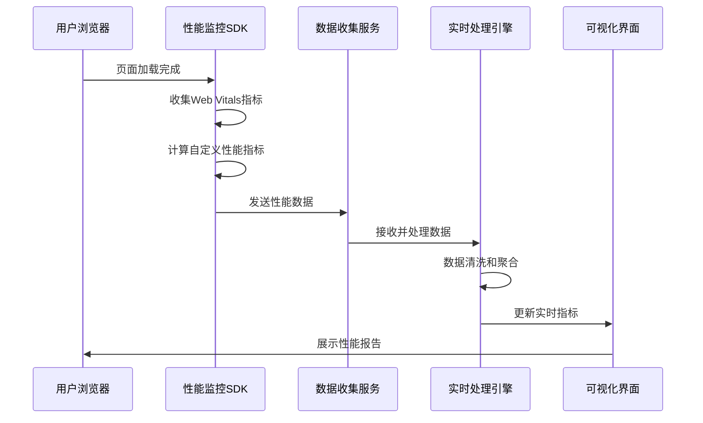

**图表来源**
- [loading-optimization.md:395-425](file://docs/performance/loading-optimization.md#L395-L425)
- [rendering-optimization.md:104-118](file://docs/react/performance.md#L104-L118)

## 详细组件分析

### 1. Web Vitals监控实现

#### LCP（最大内容绘制）监控

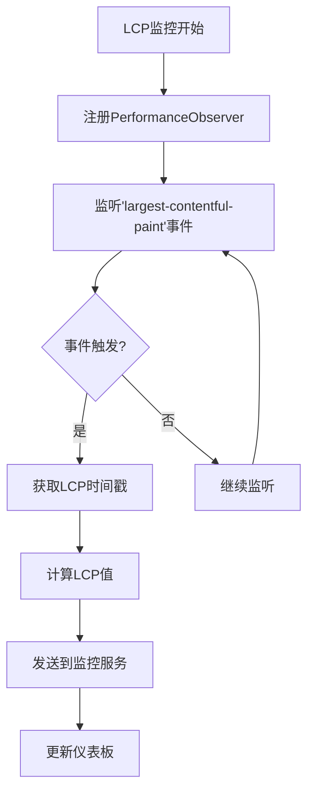

**图表来源**
- [loading-optimization.md:395-425](file://docs/performance/loading-optimization.md#L395-L425)

#### FID（首次输入延迟）监控

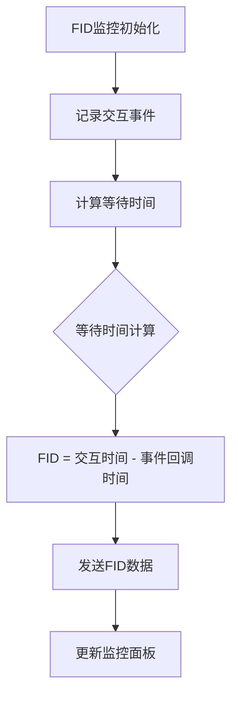

**图表来源**
- [rendering-optimization.md:104-118](file://docs/react/performance.md#L104-L118)

#### CLS（累积布局偏移）监控

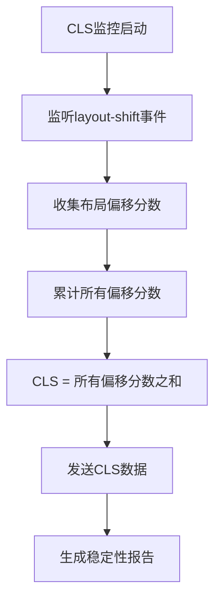

**章节来源**
- [loading-optimization.md:10-575](file://docs/performance/loading-optimization.md#L10-L575)
- [rendering-optimization.md:10-747](file://docs/performance/rendering-optimization.md#L10-L747)

### 2. 性能数据埋点采集

#### 基础性能指标采集

| 指标类型 | 采集方法 | 数据格式 | 采集频率 |
|---------|---------|----------|----------|
| 页面加载时间 | Navigation Timing API | JSON | 单次 |
| 资源加载时间 | Resource Timing API | JSON | 每个资源 |
| 用户交互延迟 | User Timing API | JSON | 每次交互 |
| 渲染性能 | PerformanceObserver | JSON | 实时 |

#### 自定义业务指标

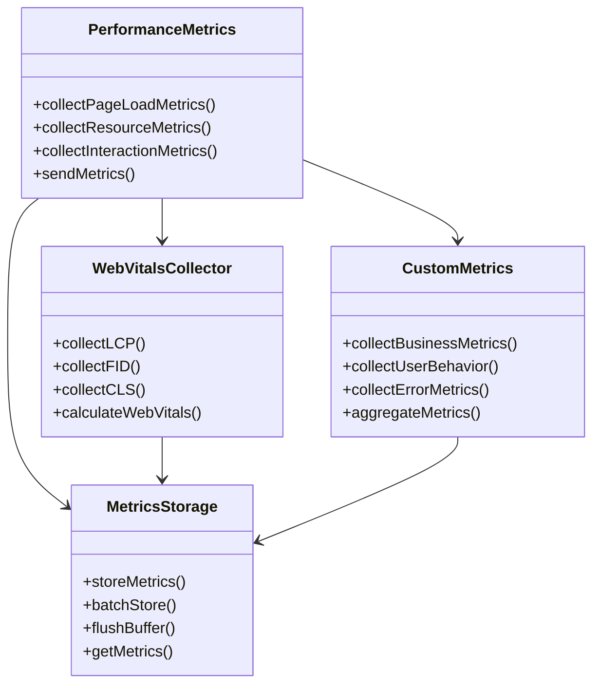

**图表来源**
- [loading-optimization.md:395-425](file://docs/performance/loading-optimization.md#L395-L425)
- [rendering-optimization.md:104-118](file://docs/react/performance.md#L104-L118)

**章节来源**
- [loading-optimization.md:395-425](file://docs/performance/loading-optimization.md#L395-L425)
- [rendering-optimization.md:104-118](file://docs/react/performance.md#L104-L118)

### 3. 性能监控平台搭建

#### 数据收集服务架构

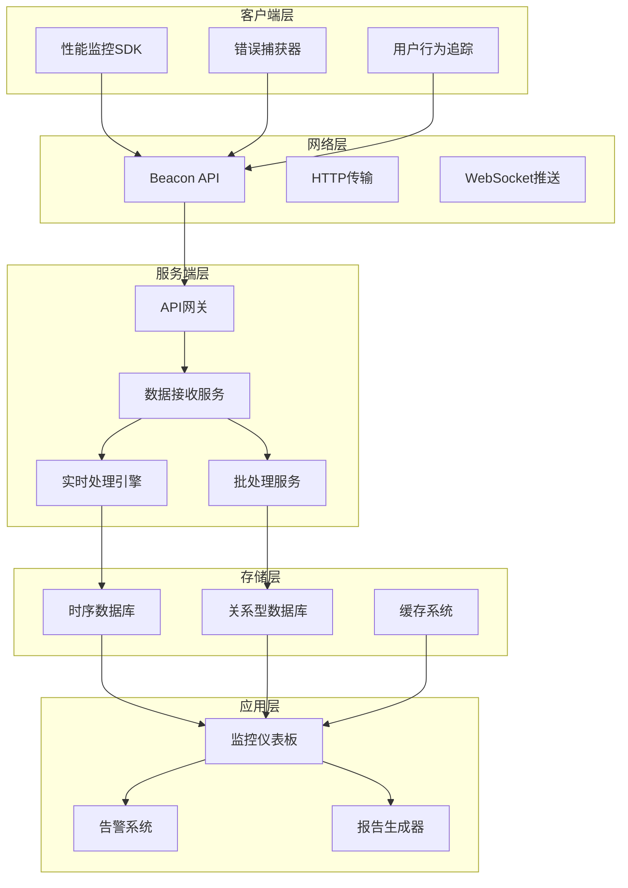

**图表来源**
- [loading-optimization.md:395-425](file://docs/performance/loading-optimization.md#L395-L425)

#### 实时性能监控实现

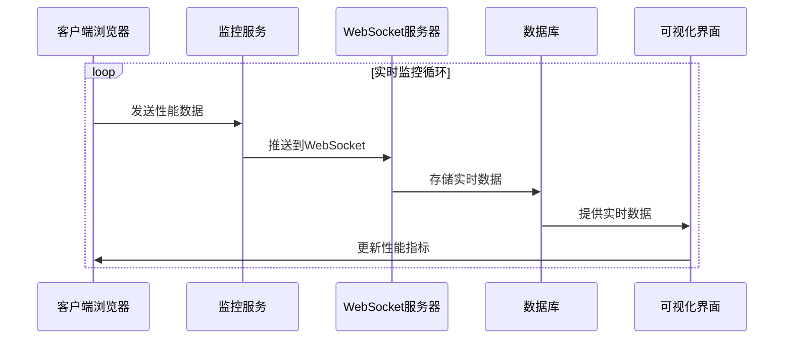

**章节来源**
- [loading-optimization.md:395-425](file://docs/performance/loading-optimization.md#L395-L425)

### 4. 框架特定性能监控

#### React性能监控

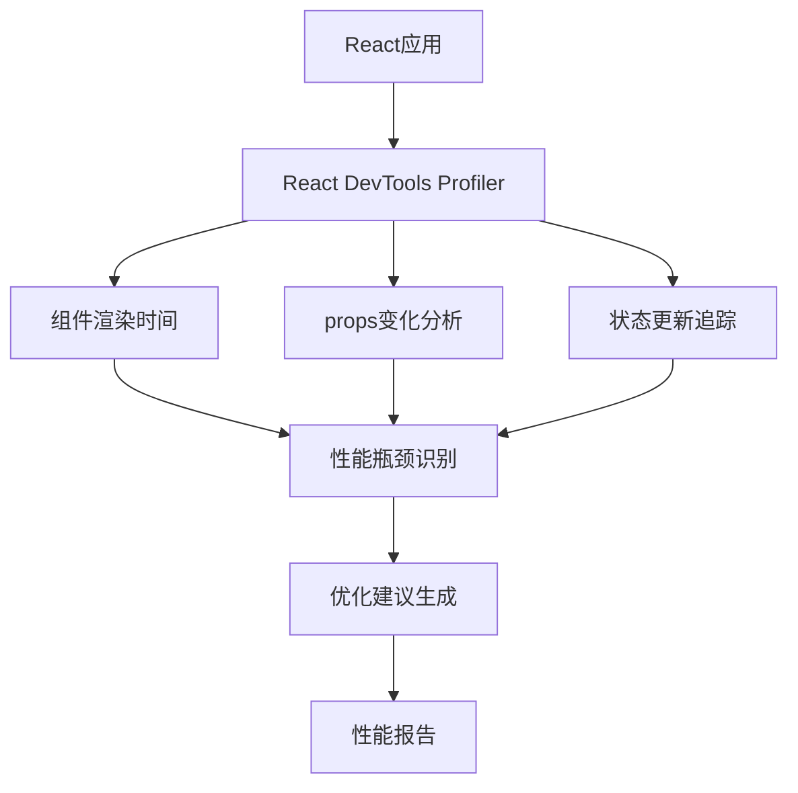

**图表来源**
- [react-performance.md:104-118](file://docs/react/performance.md#L104-L118)

#### Vue性能监控

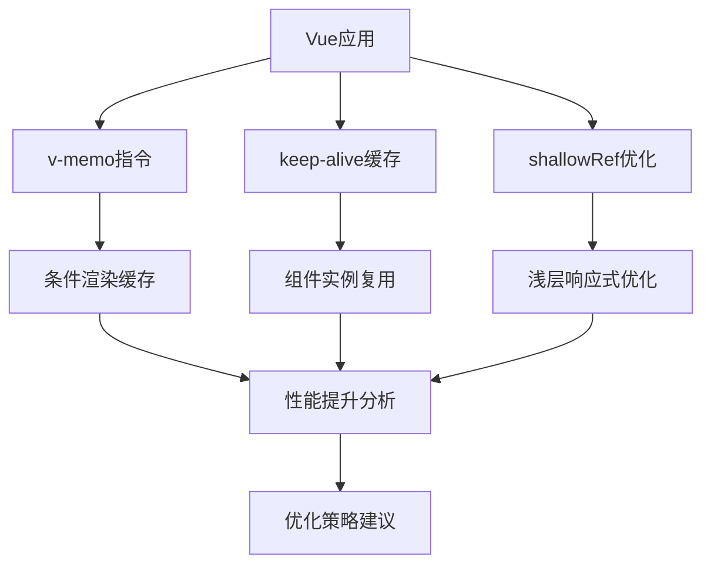

**图表来源**
- [vue-performance.md:187-206](file://docs/vue/performance.md#L187-L206)

**章节来源**
- [react-performance.md:10-127](file://docs/react/performance.md#L10-L127)
- [vue-performance.md:1-206](file://docs/vue/performance.md#L1-L206)

## 依赖关系分析

### 性能监控依赖关系

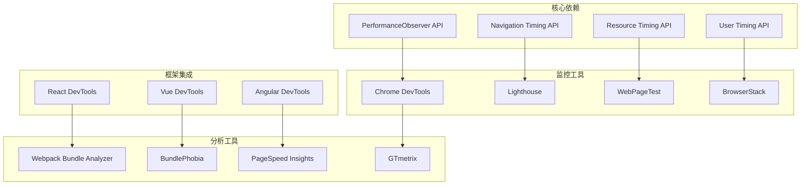

**图表来源**
- [package.json:17-33](file://package.json#L17-L33)

### 性能优化工具链

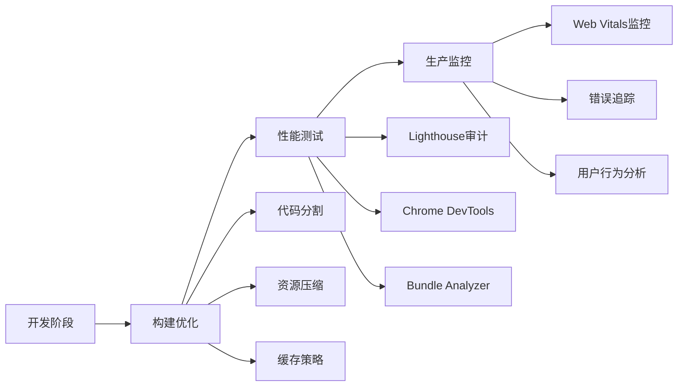

**章节来源**
- [package.json:17-33](file://package.json#L17-L33)

## 性能考虑

### 性能监控最佳实践

#### 1. 数据采集策略

- **采样策略**：根据用户特征进行差异化采样
- **数据脱敏**：保护用户隐私信息
- **批量传输**：减少网络请求次数
- **降噪处理**：过滤异常数据点

#### 2. 监控指标设计

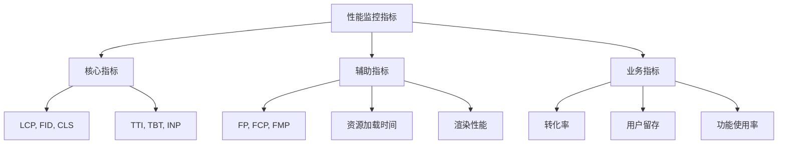

#### 3. 性能优化建议

基于现有文档中的性能优化技术，建议重点关注：

- **加载性能优化**：代码分割、资源压缩、图片优化
- **渲染性能优化**：避免重排重绘、使用GPU加速、虚拟滚动
- **内存管理**：防止内存泄漏、合理使用缓存
- **网络优化**：预加载、CDN、缓存策略

**章节来源**
- [loading-optimization.md:10-575](file://docs/performance/loading-optimization.md#L10-L575)
- [rendering-optimization.md:10-747](file://docs/performance/rendering-optimization.md#L10-L747)

## 故障排除指南

### 常见性能监控问题

#### 1. 数据采集失败

**问题症状**：
- 监控数据缺失
- 指标显示异常
- 数据传输失败

**解决方案**：
- 检查网络连接状态
- 验证API密钥有效性
- 确认跨域设置正确
- 检查防火墙配置

#### 2. 性能指标异常

**问题症状**：
- 指标值过高
- 数据波动异常
- 趋势分析异常

**解决方案**：
- 分析用户群体差异
- 检查版本升级影响
- 验证数据采集逻辑
- 调整采样策略

#### 3. 监控系统性能问题

**问题症状**：
- 系统响应缓慢
- 数据处理延迟
- 存储空间不足

**解决方案**：
- 优化数据库查询
- 增加缓存层
- 扩展存储容量
- 调整处理队列

### 性能监控调试技巧

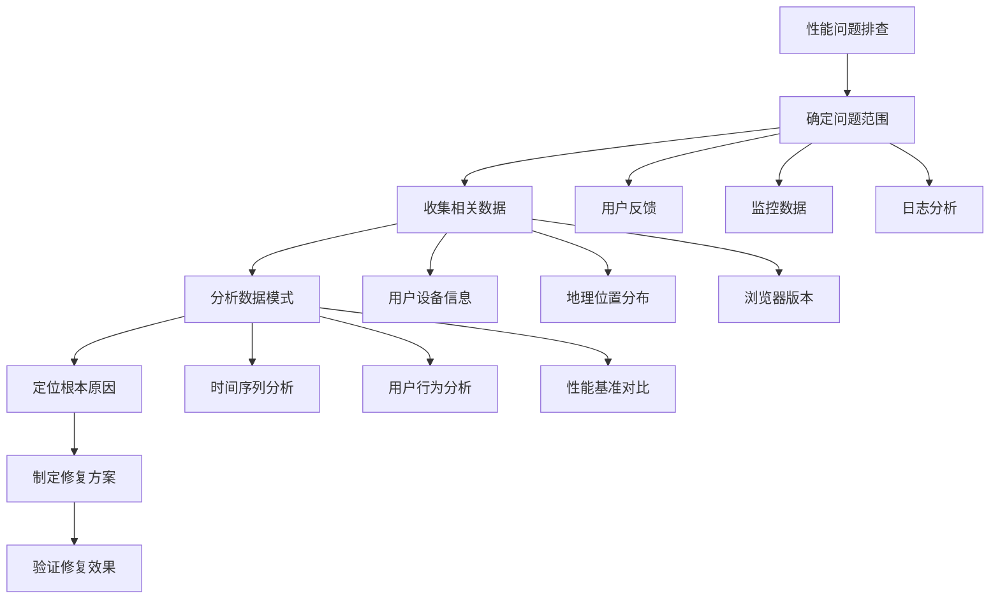

**章节来源**
- [loading-optimization.md:10-575](file://docs/performance/loading-optimization.md#L10-L575)
- [rendering-optimization.md:10-747](file://docs/performance/rendering-optimization.md#L10-L747)

## 结论

通过建立完善的性能监控体系，可以有效提升用户体验质量，降低维护成本，并为产品迭代提供数据支撑。建议按照以下步骤实施：

1. **基础建设**：部署Web Vitals监控，建立数据采集管道
2. **指标体系**：定义核心监控指标，建立阈值体系
3. **平台搭建**：构建监控仪表板，实现实时可视化
4. **持续优化**：基于监控数据持续优化性能
5. **团队协作**：建立性能监控团队，制定响应流程

通过系统化的性能监控实施，可以确保应用在各种环境下都能提供优质的用户体验，同时为业务发展提供强有力的技术支撑。