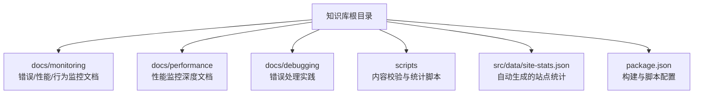
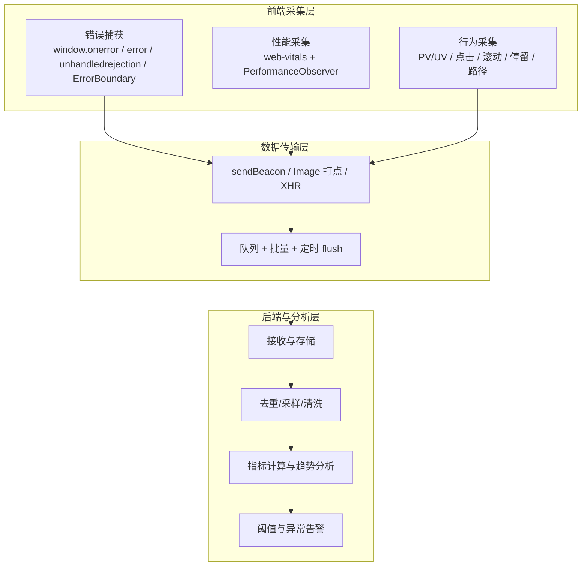
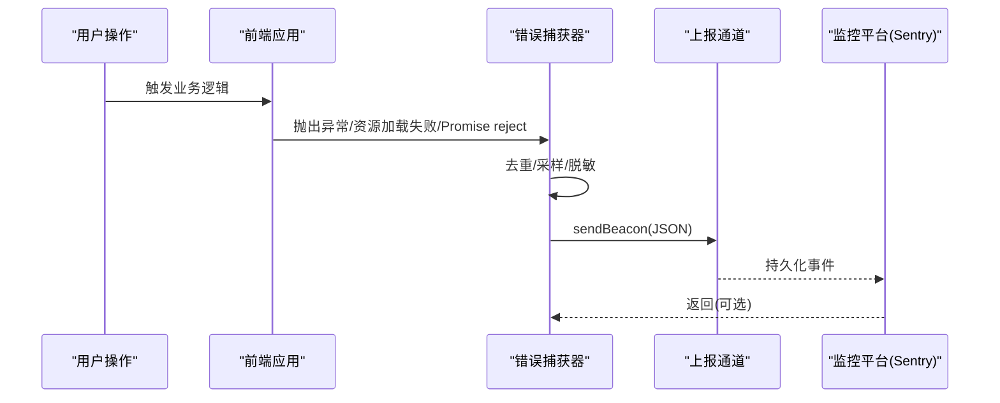
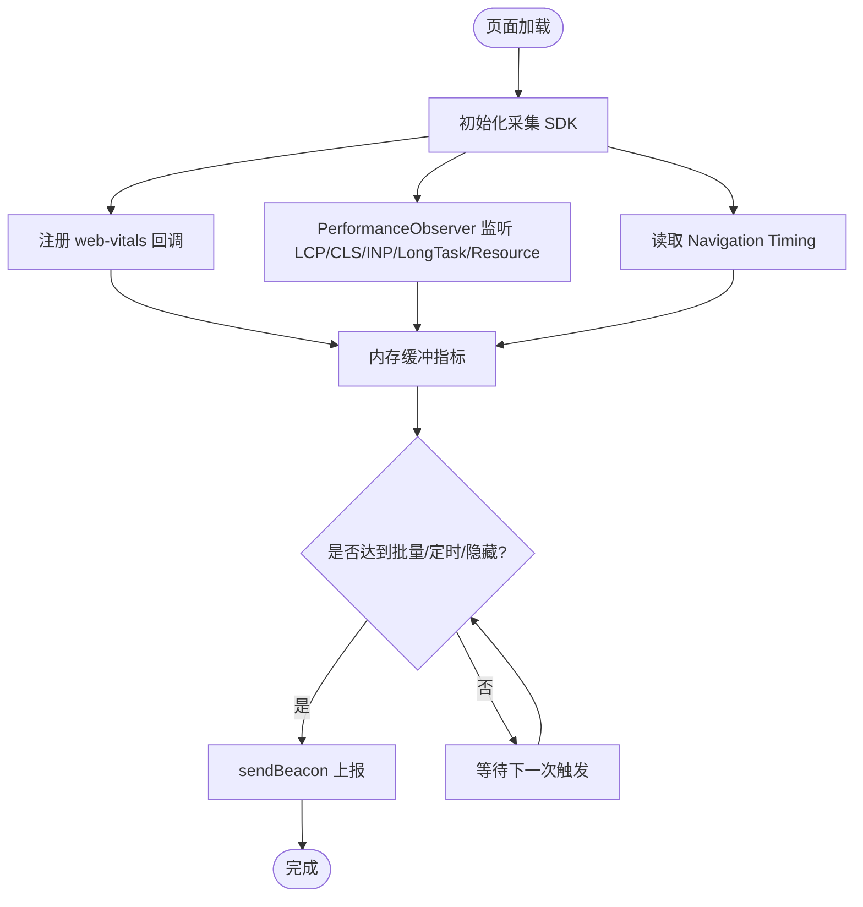
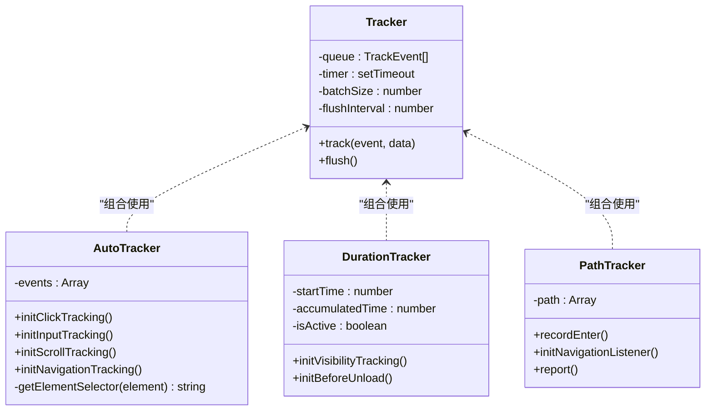
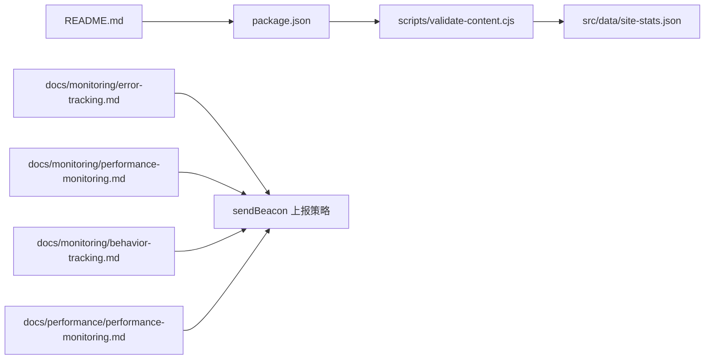

# 监控解决方案

<cite>
**本文引用的文件**
- [README.md](file://README.md)
- [package.json](file://package.json)
- [scripts/validate-content.cjs](file://scripts/validate-content.cjs)
- [docs/monitoring/error-tracking.md](file://docs/monitoring/error-tracking.md)
- [docs/monitoring/performance-monitoring.md](file://docs/monitoring/performance-monitoring.md)
- [docs/monitoring/behavior-tracking.md](file://docs/monitoring/behavior-tracking.md)
- [docs/performance/performance-monitoring.md](file://docs/performance/performance-monitoring.md)
- [docs/debugging/error-handling.md](file://docs/debugging/error-handling.md)
</cite>

## 目录
1. [引言](#引言)
2. [项目结构](#项目结构)
3. [核心组件](#核心组件)
4. [架构总览](#架构总览)
5. [详细组件分析](#详细组件分析)
6. [依赖关系分析](#依赖关系分析)
7. [性能考量](#性能考量)
8. [故障排查指南](#故障排查指南)
9. [结论](#结论)
10. [附录](#附录)

## 引言
本方案面向前端工程，提供一套完整的“错误捕获与上报、性能监控（Web Vitals）、用户行为追踪”的监控体系。文档基于仓库中的监控相关文档与脚本，系统化梳理了指标采集、上报策略、平台集成与面试要点，帮助读者快速搭建可落地的前端监控方案。

## 项目结构
本项目为基于 Docusaurus 的知识库，包含大量技术文档与测验系统。监控相关内容集中在 docs/monitoring 与 docs/performance 目录下，并提供质量校验脚本用于内容统计与题库校验。

图表来源
- [README.md:1-88](file://README.md#L1-L88)
- [package.json:1-67](file://package.json#L1-L67)

章节来源
- [README.md:1-88](file://README.md#L1-L88)
- [package.json:1-67](file://package.json#L1-L67)

## 核心组件
- 错误捕获与上报：覆盖 JS 运行时、资源加载、Promise 异常、框架级错误；提供 Sentry 接入与 Source Map 上传、数据过滤与脱敏策略。
- 性能监控：围绕 Web Vitals（LCP、INP、CLS、TTFB、FCP）与 Navigation Timing、Long Task、Resource Timing 等 API 进行采集与上报；提供自定义打点与评分分级。
- 用户行为追踪：支持代码埋点、可视化埋点、无痕埋点；实现 PV/UV、点击、滚动深度、停留时长、用户路径等关键指标。

章节来源
- [docs/monitoring/error-tracking.md:1-420](file://docs/monitoring/error-tracking.md#L1-L420)
- [docs/monitoring/performance-monitoring.md:1-423](file://docs/monitoring/performance-monitoring.md#L1-L423)
- [docs/monitoring/behavior-tracking.md:1-527](file://docs/monitoring/behavior-tracking.md#L1-L527)
- [docs/performance/performance-monitoring.md:1-800](file://docs/performance/performance-monitoring.md#L1-L800)

## 架构总览
整体架构分为三层：前端采集 SDK、数据传输层、后端分析与告警。前端负责多源数据采集与批量上报，传输层保证页面关闭时也能可靠发送，后端负责聚合、去重、采样、趋势分析与异常告警。

图表来源
- [docs/monitoring/error-tracking.md:341-380](file://docs/monitoring/error-tracking.md#L341-L380)
- [docs/monitoring/performance-monitoring.md:309-373](file://docs/monitoring/performance-monitoring.md#L309-L373)
- [docs/monitoring/behavior-tracking.md:61-148](file://docs/monitoring/behavior-tracking.md#L61-L148)
- [docs/performance/performance-monitoring.md:407-549](file://docs/performance/performance-monitoring.md#L407-L549)

## 详细组件分析

### 错误捕获与上报
- 全局捕获方式
  - try-catch：仅同步错误，侵入性强。
  - window.onerror：捕获同步运行时错误，跨域脚本需 CORS。
  - window.addEventListener('error', fn, true)：捕获资源加载错误，必须使用捕获阶段。
  - unhandledrejection：捕获未处理的 Promise 异常。
  - 框架级：React ErrorBoundary、Vue errorHandler。
- 上报策略
  - 防抖去重：同一错误短时间内不重复上报。
  - 上报通道：优先 sendBeacon（页面关闭仍可靠），兼容 Image 打点与 XHR。
- Sentry 接入
  - 初始化、Tracing 集成、采样率与环境标识。
  - beforeBreadcrumb 过滤无用日志；beforeSend 过滤扩展引起的错误并补充上下文。
  - Source Map 上传：构建插件上传至 Sentry，生产环境不部署 .map。
- 手动上报
  - captureException、captureMessage、setUser、setTag、setExtra。

图表来源
- [docs/monitoring/error-tracking.md:43-145](file://docs/monitoring/error-tracking.md#L43-L145)
- [docs/monitoring/error-tracking.md:239-339](file://docs/monitoring/error-tracking.md#L239-L339)
- [docs/monitoring/error-tracking.md:341-380](file://docs/monitoring/error-tracking.md#L341-L380)

章节来源
- [docs/monitoring/error-tracking.md:1-420](file://docs/monitoring/error-tracking.md#L1-L420)
- [docs/debugging/error-handling.md:63-177](file://docs/debugging/error-handling.md#L63-L177)

### 性能监控（Web Vitals 与 Performance API）
- 核心指标
  - LCP、INP、CLS、TTFB、FCP 目标值与采集 API。
- 采集方式
  - web-vitals 库一键采集。
  - PerformanceObserver 手动采集 LCP、CLS、FID/INP、Long Task、Resource Timing。
  - Navigation Timing 获取完整加载时间线。
- 自定义打点
  - PerfTracker 封装 mark/measure，记录业务关键路径耗时。
- 评分与分级
  - 根据阈值将指标划分为 good/needs-improvement/poor。
- 平台化采集 SDK
  - 采样控制、Web Vitals、资源、长任务、错误统一收集，visibilitychange 与定时 flush，sendBeacon 上报。

图表来源
- [docs/monitoring/performance-monitoring.md:30-69](file://docs/monitoring/performance-monitoring.md#L30-L69)
- [docs/monitoring/performance-monitoring.md:71-196](file://docs/monitoring/performance-monitoring.md#L71-L196)
- [docs/monitoring/performance-monitoring.md:198-271](file://docs/monitoring/performance-monitoring.md#L198-L271)
- [docs/monitoring/performance-monitoring.md:309-373](file://docs/monitoring/performance-monitoring.md#L309-L373)
- [docs/performance/performance-monitoring.md:407-549](file://docs/performance/performance-monitoring.md#L407-L549)

章节来源
- [docs/monitoring/performance-monitoring.md:1-423](file://docs/monitoring/performance-monitoring.md#L1-L423)
- [docs/performance/performance-monitoring.md:1-800](file://docs/performance/performance-monitoring.md#L1-L800)

### 用户行为追踪
- 埋点方案分类
  - 代码埋点：精准灵活但开发量大。
  - 可视化埋点：无需发版但不够灵活。
  - 无痕埋点：全量覆盖但数据量大需清洗。
- 基础 SDK
  - Tracker 类：队列 + 批量大小 + 定时器 flush；beforeunload/visibilitychange 兜底上报。
- 典型场景
  - PV/UV：页面进入与路由变化时上报。
  - 点击事件：声明式埋点、装饰器/HOC、全局代理 data-track-*。
  - 无痕埋点：自动采集 click/input/scroll/navigation，敏感字段脱敏。
  - 停留时长：visibilitychange 累计计时，beforeunload 上报。
  - 用户路径：记录页面流转序列，周期性上报。

图表来源
- [docs/monitoring/behavior-tracking.md:61-148](file://docs/monitoring/behavior-tracking.md#L61-L148)
- [docs/monitoring/behavior-tracking.md:254-396](file://docs/monitoring/behavior-tracking.md#L254-L396)
- [docs/monitoring/behavior-tracking.md:398-445](file://docs/monitoring/behavior-tracking.md#L398-L445)
- [docs/monitoring/behavior-tracking.md:447-505](file://docs/monitoring/behavior-tracking.md#L447-L505)

章节来源
- [docs/monitoring/behavior-tracking.md:1-527](file://docs/monitoring/behavior-tracking.md#L1-L527)

## 依赖关系分析
- 文档与脚本依赖
  - README 提供项目概览与命令说明。
  - package.json 定义构建、校验、测试等脚本。
  - scripts/validate-content.cjs 在启动与构建前执行，统计文档数量、题目数量与分类数，并写入 src/data/site-stats.json。
- 监控文档之间的耦合
  - 错误与性能文档均强调 sendBeacon 作为可靠上报通道。
  - 性能文档同时覆盖 web-vitals 与原生 Performance API，形成互补。
  - 行为追踪文档提供多种埋点方案与通用 SDK 设计模式。

图表来源
- [README.md:1-88](file://README.md#L1-L88)
- [package.json:1-67](file://package.json#L1-L67)
- [scripts/validate-content.cjs:1-55](file://scripts/validate-content.cjs#L1-L55)
- [docs/monitoring/error-tracking.md:341-380](file://docs/monitoring/error-tracking.md#L341-L380)
- [docs/monitoring/performance-monitoring.md:30-69](file://docs/monitoring/performance-monitoring.md#L30-L69)
- [docs/monitoring/behavior-tracking.md:61-148](file://docs/monitoring/behavior-tracking.md#L61-L148)
- [docs/performance/performance-monitoring.md:407-549](file://docs/performance/performance-monitoring.md#L407-L549)

章节来源
- [README.md:1-88](file://README.md#L1-L88)
- [package.json:1-67](file://package.json#L1-L67)
- [scripts/validate-content.cjs:1-55](file://scripts/validate-content.cjs#L1-L55)

## 性能考量
- 上报可靠性
  - 优先使用 sendBeacon，确保页面关闭或跳转时数据不丢失。
  - 结合 visibilitychange 与 beforeunload 提前 flush，提高成功率。
- 数据降噪
  - 错误去重：按 message/source/lineno 生成键，短时间缓存避免风暴。
  - 性能采样：生产环境降低 tracesSampleRate 与指标采样率，减少带宽压力。
  - 过滤无关错误：如浏览器扩展导致的异常。
- 采集开销
  - 使用 buffered: true 获取历史条目，避免遗漏。
  - 对高频事件（如 scroll）采用 requestAnimationFrame 节流。
  - 只关注慢资源与长任务，降低上报量。

[本节为通用指导，不直接分析具体文件]

## 故障排查指南
- 常见问题定位
  - 跨域脚本错误：检查 crossorigin 属性与服务端 CORS 响应头。
  - 资源加载失败：通过 error 事件捕获 target.src/href 并上报。
  - Promise 未处理异常：unhandledrejection 事件捕获 reason 与 stack。
  - 框架错误：ErrorBoundary 与 Vue errorHandler 补充 componentStack/info。
- 上报链路验证
  - 本地控制台观察 sendBeacon 请求是否发出。
  - 检查 Source Map 是否正确上传并与 release 对应。
  - 确认 beforeSend/beforeBreadcrumb 过滤规则是否符合预期。
- 性能问题定位
  - 使用 PerformanceObserver 定位长任务与布局偏移。
  - 借助 Navigation Timing 分析 TTFB、DNS/TCP/TLS 耗时。
  - 结合 Lighthouse 报告与 CI 断言，持续回归性能预算。

章节来源
- [docs/monitoring/error-tracking.md:382-398](file://docs/monitoring/error-tracking.md#L382-L398)
- [docs/monitoring/error-tracking.md:239-339](file://docs/monitoring/error-tracking.md#L239-L339)
- [docs/performance/performance-monitoring.md:288-403](file://docs/performance/performance-monitoring.md#L288-L403)

## 结论
本方案以“错误、性能、行为”三大维度构建前端监控体系，强调可靠上报、数据降噪与可观测性闭环。通过 web-vitals 与 Performance API 的组合采集、Sentry 的深度集成以及行为埋点的多方案适配，可在不同规模项目中快速落地并持续优化用户体验。

[本节为总结性内容，不直接分析具体文件]

## 附录
- 常用命令与流程
  - 本地开发：npm start
  - 构建与部署：npm run build
  - 内容校验：npm run validate:content（启动与构建前自动执行）
  - 类型检查与 Lint：npm run typecheck、npm run lint
  - 测试：npm test、npm run test:e2e
  - 完整质量检查：npm run check

章节来源
- [README.md:14-34](file://README.md#L14-L34)
- [package.json:5-24](file://package.json#L5-L24)
- [scripts/validate-content.cjs:1-55](file://scripts/validate-content.cjs#L1-L55)