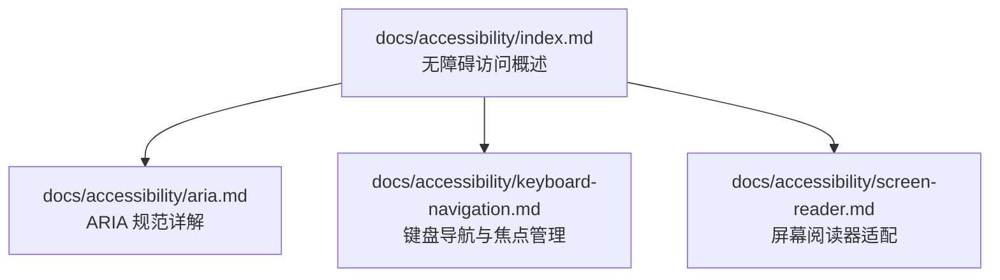
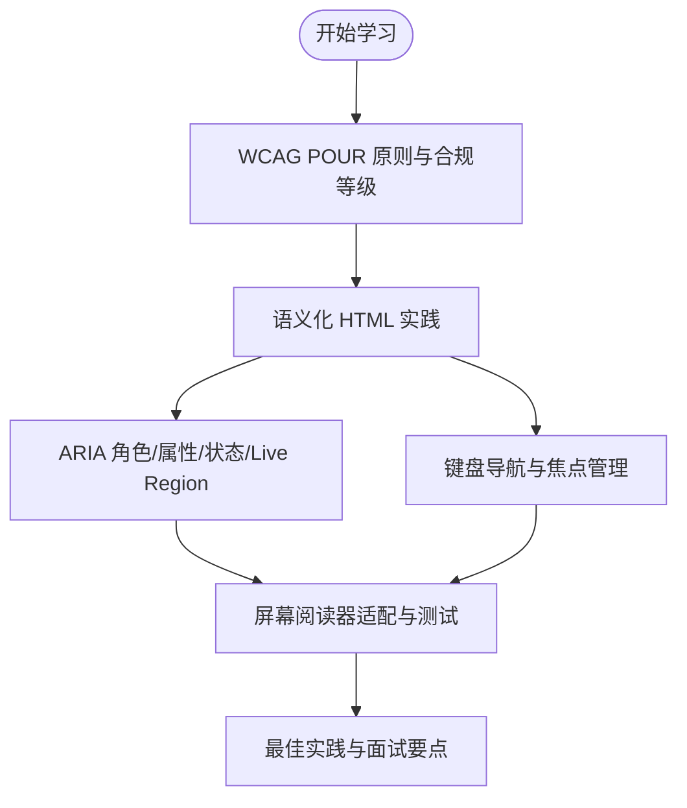
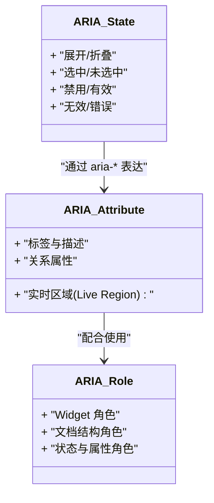
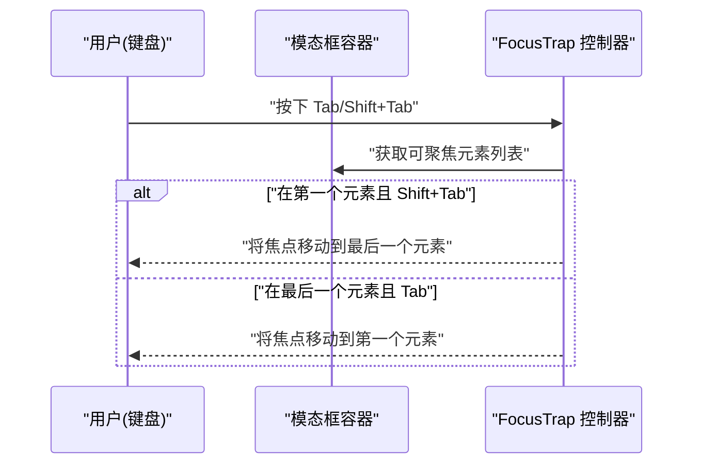
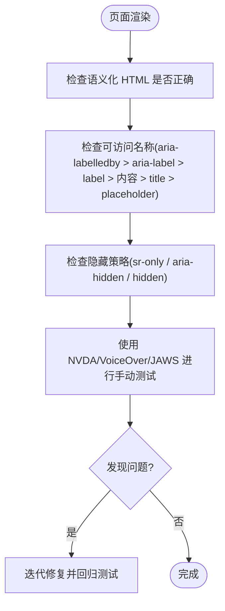
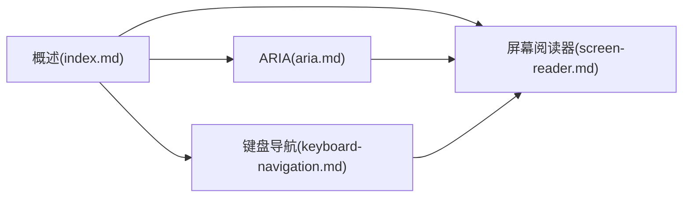

# 无障碍访问

<cite>
**本文引用的文件**   
- [README.md](file://README.md)
- [docs/accessibility/index.md](file://docs/accessibility/index.md)
- [docs/accessibility/aria.md](file://docs/accessibility/aria.md)
- [docs/accessibility/keyboard-navigation.md](file://docs/accessibility/keyboard-navigation.md)
- [docs/accessibility/screen-reader.md](file://docs/accessibility/screen-reader.md)
</cite>

## 目录
1. [简介](#简介)
2. [项目结构](#项目结构)
3. [核心组件](#核心组件)
4. [架构总览](#架构总览)
5. [详细组件分析](#详细组件分析)
6. [依赖关系分析](#依赖关系分析)
7. [性能与可维护性建议](#性能与可维护性建议)
8. [故障排查指南](#故障排查指南)
9. [结论](#结论)
10. [附录](#附录)

## 简介
本仓库是一个基于 Docusaurus 的前端面试与 AI 开发知识库，包含大量主题文档与测验系统。其中“无障碍访问”专题提供系统化学习路径，涵盖 WCAG 原则、ARIA 规范、键盘导航与焦点管理、屏幕阅读器适配等关键内容，帮助读者构建符合标准的可访问 Web 应用。

## 项目结构
无障碍相关文档集中于 docs/accessibility 目录，采用“主题化 + 子文档”的组织方式：
- 概述页：介绍 WCAG POUR 原则、合规等级、知识图谱与学习建议
- ARIA 规范详解：角色、属性、状态、Live Region、命名与描述、最佳实践
- 键盘导航与焦点管理：Tab 顺序、Focus Trap、Roving TabIndex、快捷键设计、焦点可见性与 Skip Link
- 屏幕阅读器适配：语义化 HTML、隐藏策略、测试清单、常见场景与面试要点

图表来源
- [docs/accessibility/index.md:56-84](file://docs/accessibility/index.md#L56-L84)

章节来源
- [docs/accessibility/index.md:1-104](file://docs/accessibility/index.md#L1-L104)

## 核心组件
- WCAG 2.1 原则与合规等级：POUR（可感知、可操作、可理解、健壮性）；A/AA/AAA 三级要求
- ARIA 体系：role、aria-* 属性、状态与 Live Region、命名与描述、五条规则与常见错误
- 键盘交互：tabindex 行为、Focus Trap、Roving TabIndex、快捷键设计与焦点可见性
- 屏幕阅读器：语义化 HTML、表格/表单无障碍、隐藏元素策略、NVDA/VoiceOver/JAWS 测试流程

章节来源
- [docs/accessibility/index.md:37-55](file://docs/accessibility/index.md#L37-L55)
- [docs/accessibility/aria.md:9-30](file://docs/accessibility/aria.md#L9-L30)
- [docs/accessibility/keyboard-navigation.md:9-18](file://docs/accessibility/keyboard-navigation.md#L9-L18)
- [docs/accessibility/screen-reader.md:9-24](file://docs/accessibility/screen-reader.md#L9-L24)

## 架构总览
从文档视角看，无障碍专题以“概述”为入口，向下辐射到三大技术域：ARIA、键盘交互、屏幕阅读器。三者相互支撑：
- 语义化 HTML 是基础
- ARIA 用于补充原生语义不足
- 键盘与焦点管理确保可操作
- 屏幕阅读器验证最终体验

[此图为概念流程图，不直接映射具体源码文件]

## 详细组件分析

### 组件一：ARIA 规范详解
- 第一规则：优先使用原生 HTML，避免错误的 ARIA
- 角色分类：Widget、文档结构、状态与属性
- 属性与关系：标签与描述、控制关系、阅读顺序
- Live Region：播报优先级（assertive/polite/off）
- 状态：展开、选中、禁用、无效等
- 最佳实践：五条规则、常见错误、自定义组件模式

图表来源
- [docs/accessibility/aria.md:31-84](file://docs/accessibility/aria.md#L31-L84)
- [docs/accessibility/aria.md:85-186](file://docs/accessibility/aria.md#L85-L186)

章节来源
- [docs/accessibility/aria.md:9-30](file://docs/accessibility/aria.md#L9-L30)
- [docs/accessibility/aria.md:187-247](file://docs/accessibility/aria.md#L187-L247)

### 组件二：键盘导航与焦点管理
- Tab 顺序与 tabindex：默认顺序、编程式聚焦、自然顺序保持
- Focus Trap：模态框/下拉菜单中限制焦点范围
- Roving TabIndex：组内方向键切换，仅活动项在 Tab 顺序
- 快捷键设计：可发现、可关闭、不冲突、一致性
- 焦点可见性：移除 outline 的误区、focus-visible 的使用
- Skip Link：快速跳转到主要内容

图表来源
- [docs/accessibility/keyboard-navigation.md:75-138](file://docs/accessibility/keyboard-navigation.md#L75-L138)

章节来源
- [docs/accessibility/keyboard-navigation.md:20-74](file://docs/accessibility/keyboard-navigation.md#L20-L74)
- [docs/accessibility/keyboard-navigation.md:174-273](file://docs/accessibility/keyboard-navigation.md#L174-L273)
- [docs/accessibility/keyboard-navigation.md:274-330](file://docs/accessibility/keyboard-navigation.md#L274-L330)
- [docs/accessibility/keyboard-navigation.md:331-392](file://docs/accessibility/keyboard-navigation.md#L331-L392)

### 组件三：屏幕阅读器适配
- 主流阅读器：NVDA、JAWS、VoiceOver、TalkBack、Narrator
- 语义化 HTML：标题层级、Landmark、表格与表单无障碍
- 隐藏策略：视觉隐藏但 AT 可见（sr-only）、AT 隐藏但视觉可见、对所有人隐藏
- 测试流程：VoiceOver/NVDA/JAWS 常用快捷键与检查清单
- 最佳实践：可访问名称计算优先级、常见问题与解决方案

图表来源
- [docs/accessibility/screen-reader.md:25-151](file://docs/accessibility/screen-reader.md#L25-L151)
- [docs/accessibility/screen-reader.md:152-244](file://docs/accessibility/screen-reader.md#L152-L244)
- [docs/accessibility/screen-reader.md:245-330](file://docs/accessibility/screen-reader.md#L245-L330)
- [docs/accessibility/screen-reader.md:331-357](file://docs/accessibility/screen-reader.md#L331-L357)

章节来源
- [docs/accessibility/screen-reader.md:9-24](file://docs/accessibility/screen-reader.md#L9-L24)
- [docs/accessibility/screen-reader.md:300-330](file://docs/accessibility/screen-reader.md#L300-L330)
- [docs/accessibility/screen-reader.md:369-423](file://docs/accessibility/screen-reader.md#L369-L423)

## 依赖关系分析
- 文档间依赖：概述页作为入口，链接到 ARIA、键盘导航、屏幕阅读器三个子主题
- 知识点耦合：
  - 语义化 HTML 贯穿所有子主题
  - ARIA 与键盘交互紧密配合（如 tablist/tab 的键盘行为）
  - 屏幕阅读器测试是对前两者的综合验证

图表来源
- [docs/accessibility/index.md:56-84](file://docs/accessibility/index.md#L56-L84)

章节来源
- [docs/accessibility/index.md:56-84](file://docs/accessibility/index.md#L56-L84)

## 性能与可维护性建议
- 渐进增强：从 A 级起步，逐步达到 AA 级合规，降低一次性改造成本
- 工具链集成：结合自动化工具（如 Lighthouse、axe）与人工测试（键盘 + 屏幕阅读器），形成持续保障
- 代码规范：在团队内建立无障碍 Checklist，纳入 PR 审查流程
- 组件库建设：封装可访问的通用组件（模态框、选项卡、通知），统一实现 Focus Trap、Roving TabIndex、Live Region 等能力

[本节为通用建议，不直接分析具体文件]

## 故障排查指南
- 图标按钮无名称：添加 aria-label 或 sr-only 文本
- 动态内容不播报：为容器添加 aria-live 或 role="alert"/"status"
- 重复播报：使用 aria-hidden 去除冗余文本
- 自定义控件无角色：补全正确的 role 与必要状态
- 焦点丢失：路由切换后主动聚焦新内容或 main/h1
- 焦点不可见：避免全局 outline:none，使用 focus-visible 提供清晰样式
- Skip Link 无效：确保锚点存在且目标可聚焦

章节来源
- [docs/accessibility/screen-reader.md:359-368](file://docs/accessibility/screen-reader.md#L359-L368)
- [docs/accessibility/keyboard-navigation.md:331-392](file://docs/accessibility/keyboard-navigation.md#L331-L392)

## 结论
无障碍访问不仅是合规要求，更是提升整体用户体验的关键。通过掌握 WCAG 原则、正确运用 ARIA、完善键盘与焦点管理，并结合屏幕阅读器测试，可以构建包容、稳健的 Web 产品。建议在项目中建立常态化无障碍保障机制，持续提升质量与可及性。

[本节为总结，不直接分析具体文件]

## 附录
- 项目概览与本地开发命令参考 README 中的说明，便于搭建与运行知识库站点，辅助无障碍内容的编写与预览。

章节来源
- [README.md:14-34](file://README.md#L14-L34)