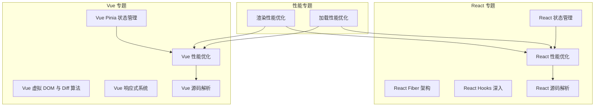
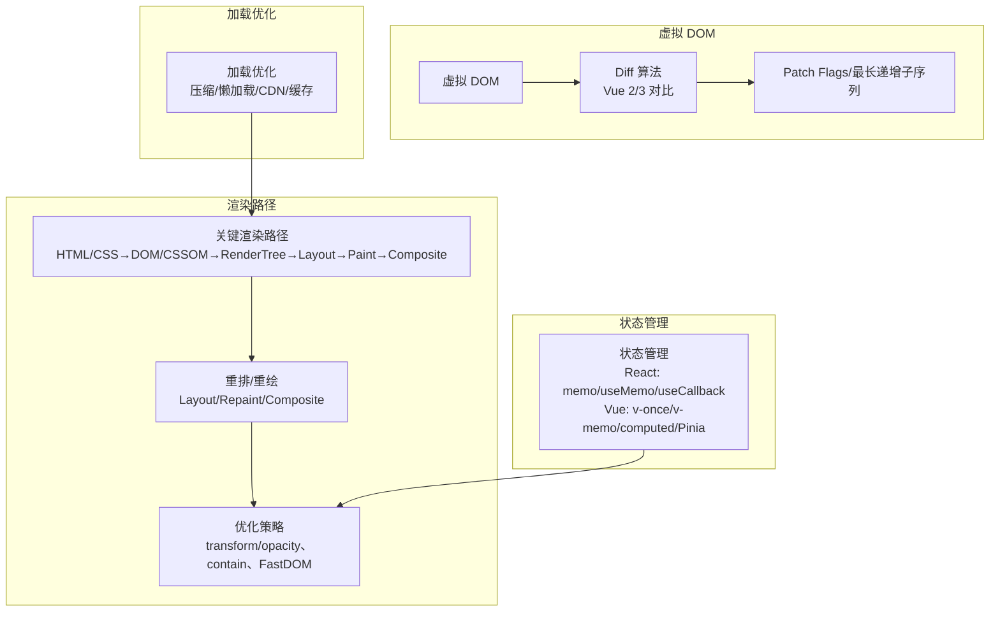
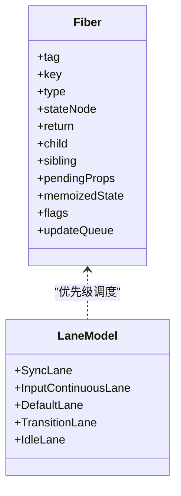
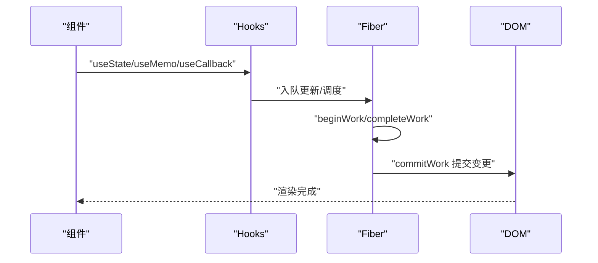
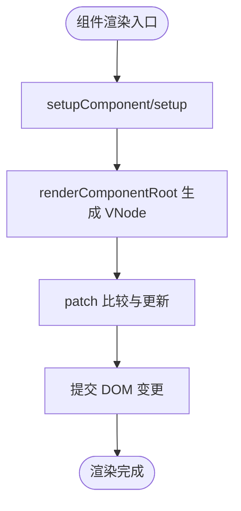
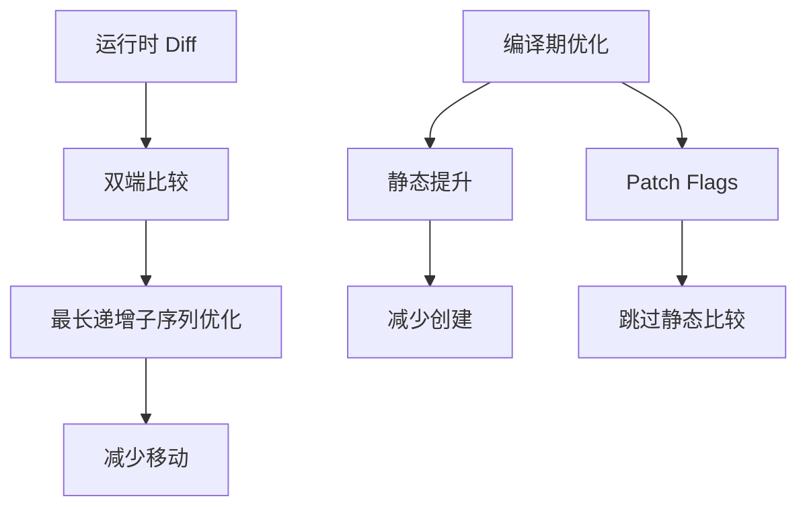
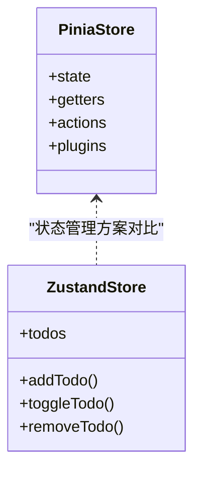
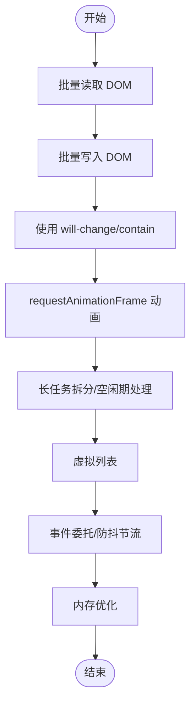
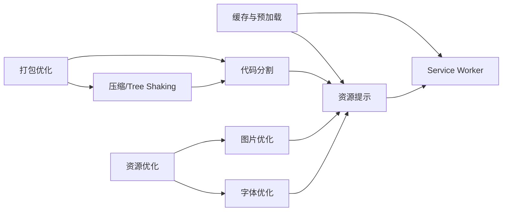
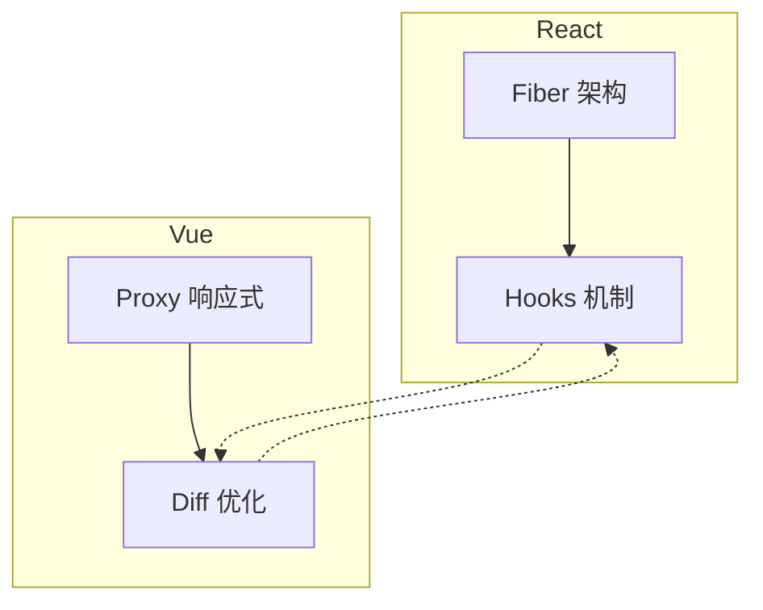

# 框架性能优化

<cite>
**本文档引用的文件**
- [渲染性能优化](file://docs/performance/rendering-optimization.md)
- [加载性能优化](file://docs/performance/loading-optimization.md)
- [React 性能优化](file://docs/react/performance.md)
- [React Fiber 架构](file://docs/react/fiber-architecture.md)
- [React Hooks 深入](file://docs/react/hooks-deep.md)
- [React 源码解析](file://docs/react/react-source-code.md)
- [Vue 性能优化](file://docs/vue/performance.md)
- [Vue 虚拟 DOM 与 Diff 算法](file://docs/vue/virtual-dom.md)
- [Vue 响应式系统](file://docs/vue/reactivity-system.md)
- [Vue 源码解析](file://docs/vue/vue-source-code.md)
- [React 状态管理](file://docs/react/state-management.md)
- [Vue Pinia 状态管理](file://docs/vue/pinia-vuex.md)
</cite>

## 目录
1. [简介](#简介)
2. [项目结构](#项目结构)
3. [核心组件](#核心组件)
4. [架构总览](#架构总览)
5. [详细组件分析](#详细组件分析)
6. [依赖分析](#依赖分析)
7. [性能考量](#性能考量)
8. [故障排查指南](#故障排查指南)
9. [结论](#结论)
10. [附录](#附录)

## 简介
本指南围绕 React 与 Vue 等主流前端框架的性能优化展开，系统梳理组件渲染优化、状态管理优化、虚拟 DOM 优化等核心技术，解释框架内部的性能机制与优化原理，并提供通用与框架特定的优化方案与最佳实践，帮助开发者充分发挥框架的性能潜力。

## 项目结构
该知识库以主题维度组织，涵盖渲染、加载、React、Vue 等专题，便于按需查阅与组合使用。

**图表来源**
- [渲染性能优化](file://docs/performance/rendering-optimization.md)
- [加载性能优化](file://docs/performance/loading-optimization.md)
- [React 性能优化](file://docs/react/performance.md)
- [React Fiber 架构](file://docs/react/fiber-architecture.md)
- [React Hooks 深入](file://docs/react/hooks-deep.md)
- [React 源码解析](file://docs/react/react-source-code.md)
- [Vue 性能优化](file://docs/vue/performance.md)
- [Vue 虚拟 DOM 与 Diff 算法](file://docs/vue/virtual-dom.md)
- [Vue 响应式系统](file://docs/vue/reactivity-system.md)
- [Vue 源码解析](file://docs/vue/vue-source-code.md)
- [React 状态管理](file://docs/react/state-management.md)
- [Vue Pinia 状态管理](file://docs/vue/pinia-vuex.md)

**章节来源**
- [渲染性能优化](file://docs/performance/rendering-optimization.md)
- [加载性能优化](file://docs/performance/loading-optimization.md)
- [React 性能优化](file://docs/react/performance.md)
- [Vue 性能优化](file://docs/vue/performance.md)

## 核心组件
- 渲染路径与重排重绘控制：理解关键渲染路径（CRP）、重排（Reflow）与重绘（Repaint）的触发条件与规避策略，掌握 transform/opacity 的合成层优化、contain 隔离、FastDOM 批量读写等手段。
- 虚拟 DOM 与 Diff 算法：对比 Vue 2/3 的 Diff 策略，理解 Vue 3 的静态提升、补丁标记（Patch Flags）、最长递增子序列优化；理解 React Fiber 的双缓存与时间切片。
- 状态管理优化：React 的 memo/useMemo/useCallback、代码分割、Zustand/TanStack Query；Vue 的 v-once/v-memo、shallowRef/shallowReactive、keep-alive、computed 与 Pinia。
- 加载与资源优化：Gzip/Brotli 压缩、代码分割、路由/组件懒加载、图片格式与懒加载、字体优化、Service Worker 缓存与资源提示。

**章节来源**
- [渲染性能优化](file://docs/performance/rendering-optimization.md)
- [Vue 虚拟 DOM 与 Diff 算法](file://docs/vue/virtual-dom.md)
- [React Fiber 架构](file://docs/react/fiber-architecture.md)
- [Vue 响应式系统](file://docs/vue/reactivity-system.md)
- [React Hooks 深入](file://docs/react/hooks-deep.md)
- [Vue 性能优化](file://docs/vue/performance.md)
- [React 性能优化](file://docs/react/performance.md)
- [加载性能优化](file://docs/performance/loading-optimization.md)

## 架构总览
从“渲染路径”“虚拟 DOM”“状态管理”“加载优化”四个维度，形成跨框架的性能优化体系。

**图表来源**
- [渲染性能优化](file://docs/performance/rendering-optimization.md)
- [Vue 虚拟 DOM 与 Diff 算法](file://docs/vue/virtual-dom.md)
- [Vue 响应式系统](file://docs/vue/reactivity-system.md)
- [Vue 性能优化](file://docs/vue/performance.md)
- [React 性能优化](file://docs/react/performance.md)
- [加载性能优化](file://docs/performance/loading-optimization.md)

## 详细组件分析

### React 渲染与 Fiber 架构
- Fiber 节点结构与双缓存：Fiber 是 React 的最小工作单元，维护链表父子兄弟关系与状态；双缓存机制在内存中构建 workInProgress 树，完成后一次性切换到 current 树，减少主线程阻塞。
- 协调与提交：beginWork 递归处理节点，completeWork 收集副作用，commitWork 一次性提交 DOM 变更。
- 优先级与时间切片：Lane 模型划分优先级，useTransition/useDeferredValue 实现低优先级更新与延迟值，结合 requestIdleCallback 的 polyfill 实现时间切片。
- Hooks 存储与调度：Hooks 以链表存储在 Fiber.memoizedState，useState/useReducer 通过队列与调度器实现批处理与异步更新。

**图表来源**
- [React Fiber 架构](file://docs/react/fiber-architecture.md)
- [React 源码解析](file://docs/react/react-source-code.md)

**章节来源**
- [React Fiber 架构](file://docs/react/fiber-architecture.md)
- [React 源码解析](file://docs/react/react-source-code.md)

### React 渲染优化与 Hooks 深入
- 渲染优化：React.memo 避免不必要重渲染；useMemo/useCallback 缓存计算结果与函数引用；代码分割（React.lazy/Suspense）减少首屏体积；虚拟列表（react-window/react-virtual）优化长列表。
- Hooks 深入：useState 简化实现；useEffect 与 useLayoutEffect 的执行时机与适用场景；自定义 Hook（如防抖 Hook）封装可复用逻辑；useMemo/useCallback 的正确使用与潜在陷阱。

**图表来源**
- [React Hooks 深入](file://docs/react/hooks-deep.md)
- [React 源码解析](file://docs/react/react-source-code.md)

**章节来源**
- [React 性能优化](file://docs/react/performance.md)
- [React Hooks 深入](file://docs/react/hooks-deep.md)

### Vue 渲染与响应式系统
- 响应式系统：Vue 3 使用 Proxy 实现响应式，惰性递归、支持新增/删除属性与 Map/Set；依赖收集通过 WeakMap/Map/Set 三层结构实现，track/trigger 机制保证精确更新。
- 组件渲染：setupComponent → setup → renderComponentRoot → patch，Fragment/Teleport/Suspense 等特性通过特殊处理实现。
- 调度器：微任务队列去重与排序，确保父组件先于子组件执行，避免重复渲染。
- EffectScope：统一管理副作用生命周期，便于组件卸载时清理。

**图表来源**
- [Vue 源码解析](file://docs/vue/vue-source-code.md)

**章节来源**
- [Vue 响应式系统](file://docs/vue/reactivity-system.md)
- [Vue 源码解析](file://docs/vue/vue-source-code.md)

### Vue 虚拟 DOM 与 Diff 算法
- 静态提升：编译期将静态节点提升为常量，减少运行时创建。
- 补丁标记（Patch Flags）：编译器标记动态内容类型，运行时跳过静态比较。
- 最长递增子序列：优化乱序节点移动，减少 DOM 操作。
- Template 与 JSX：Template 更利于编译期优化，JSX 需要运行时 diff。

**图表来源**
- [Vue 虚拟 DOM 与 Diff 算法](file://docs/vue/virtual-dom.md)

**章节来源**
- [Vue 虚拟 DOM 与 Diff 算法](file://docs/vue/virtual-dom.md)

### Vue 性能优化与状态管理
- 组件懒加载：defineAsyncComponent + Suspense；v-once 仅渲染一次；v-memo 条件缓存；computed 缓存 vs methods；shallowRef/shallowReactive 降低响应式开销；keep-alive 缓存组件实例。
- Pinia 状态管理：Composition API 风格更灵活，TypeScript 推导更好；插件系统支持日志与持久化；storeToRefs 解构保持响应式。
- React 状态管理：Zustand 轻量简洁、支持中间件；TanStack Query 管理服务端状态；Redux Toolkit 简化 Redux 使用。

**图表来源**
- [Vue Pinia 状态管理](file://docs/vue/pinia-vuex.md)
- [React 状态管理](file://docs/react/state-management.md)

**章节来源**
- [Vue 性能优化](file://docs/vue/performance.md)
- [Vue Pinia 状态管理](file://docs/vue/pinia-vuex.md)
- [React 状态管理](file://docs/react/state-management.md)

### 渲染性能优化（通用与框架特定）
- 关键渲染路径：HTML/CSS→DOM/CSSOM→RenderTree→Layout→Paint→Composite；尽量避免 Layout，优先使用 transform/opacity。
- 重排与重绘：几何属性变化、内容变化、结构变化触发重排；视觉属性变化触发重绘；避免强制同步布局，使用 FastDOM 批量读写。
- CSS 动画优化：使用 will-change/translateZ/backface-visibility 提升合成层；contain 隔离减少影响范围；requestAnimationFrame 帧同步动画。
- JavaScript 执行优化：长任务拆分、requestIdleCallback 空闲期处理、Web Worker 执行耗时任务。
- 列表渲染优化：虚拟列表（react-window/react-virtual/vue-virtual-scroller）只渲染可见区域。
- 事件处理优化：事件委托、防抖与节流。
- 内存优化：清理事件监听器、定时器、WeakMap/WeakRef 避免内存泄漏。

**图表来源**
- [渲染性能优化](file://docs/performance/rendering-optimization.md)

**章节来源**
- [渲染性能优化](file://docs/performance/rendering-optimization.md)

### 加载性能优化（打包与资源）
- 资源压缩：JavaScript 压缩（Terser）、CSS 压缩（cssnano）；Gzip/Brotli 压缩；Tree Shaking 移除死代码。
- 代码分割：Webpack splitChunks、路由/组件懒加载；魔法注释指定 chunk 名称。
- 图片优化：WebP/AVIF 格式、懒加载、srcset/sizes 响应式；CDN 动态处理。
- 字体优化：font-display swap、字体子集化。
- 缓存与预加载：强缓存/协商缓存、Service Worker、DNS 预解析/预连接、preload/prefetch/prerender。

**图表来源**
- [加载性能优化](file://docs/performance/loading-optimization.md)

**章节来源**
- [加载性能优化](file://docs/performance/loading-optimization.md)

## 依赖分析
- React 与 Vue 的共同点：均通过虚拟 DOM 降低真实 DOM 操作；均强调最小化更新；均支持懒加载与代码分割；均提供状态管理方案。
- 差异点：React 以 Fiber 实现可中断渲染与时间切片；Vue 以 Proxy 实现响应式与编译期优化（静态提升、Patch Flags）。
- 优化耦合：渲染优化与加载优化相互促进；状态管理优化减少不必要的重渲染；虚拟 DOM 优化提升 Diff 效率。

**图表来源**
- [React Fiber 架构](file://docs/react/fiber-architecture.md)
- [Vue 响应式系统](file://docs/vue/reactivity-system.md)
- [Vue 虚拟 DOM 与 Diff 算法](file://docs/vue/virtual-dom.md)

**章节来源**
- [React Fiber 架构](file://docs/react/fiber-architecture.md)
- [Vue 响应式系统](file://docs/vue/reactivity-system.md)
- [Vue 虚拟 DOM 与 Diff 算法](file://docs/vue/virtual-dom.md)

## 性能考量
- 渲染路径：优先合成层（transform/opacity），避免 Layout；使用 contain 隔离；批量读写 DOM。
- 虚拟 DOM：利用编译期优化（静态提升、Patch Flags）与运行时优化（最长递增子序列）；合理选择 Template/JSX。
- 状态管理：组件内状态优先；共享状态使用轻量方案（Zustand/Pinia）；避免深层响应式包裹大对象。
- 加载优化：压缩与懒加载并举；关键资源 preload；字体与图片优化；缓存策略与资源提示。
- 工具与监控：React Profiler、Vue DevTools、Lighthouse、WebPageTest 等工具辅助定位瓶颈。

[本节为通用指导，无需具体文件引用]

## 故障排查指南
- 渲染卡顿：检查是否存在强制同步布局、频繁重排、长任务未拆分；使用 requestIdleCallback 或 Web Worker。
- 重渲染过多：React 使用 React.memo/useMemo/useCallback；Vue 使用 v-memo/computed/shallowRef。
- 首屏慢：检查资源体积、请求数、关键 CSS 内联、路由/组件懒加载、CDN 与缓存策略。
- 内存泄漏：确认事件监听器、定时器、第三方实例引用及时清理；使用 WeakMap/WeakRef。

**章节来源**
- [渲染性能优化](file://docs/performance/rendering-optimization.md)
- [Vue 性能优化](file://docs/vue/performance.md)
- [React 性能优化](file://docs/react/performance.md)

## 结论
通过深入理解 React 的 Fiber 架构与 Vue 的 Proxy 响应式系统，结合虚拟 DOM 与 Diff 算法的编译期与运行时优化，辅以渲染路径控制、状态管理与加载优化的综合策略，开发者可以在不同场景下实现稳定、流畅的用户体验。建议以“先优化渲染路径与虚拟 DOM，再优化状态管理与加载”的顺序逐步推进，并持续使用性能工具进行验证与迭代。

[本节为总结，无需具体文件引用]

## 附录
- 推荐资源：React 官方文档、Vue 3 官方文档、web.dev 性能指南、Lighthouse 文档、Chrome DevTools Profiler。

[本节为补充信息，无需具体文件引用]