# 渲染性能优化

<cite>
**本文档引用的文件**
- [rendering-optimization.md](file://docs/performance/rendering-optimization.md)
- [loading-optimization.md](file://docs/performance/loading-optimization.md)
- [README.md](file://README.md)
- [package.json](file://package.json)
- [styles.module.css](file://src/components/HomepageFeatures/styles.module.css)
- [custom.css](file://src/css/custom.css)
- [index.module.css](file://src/pages/index.module.css)
</cite>

## 目录
1. [简介](#简介)
2. [项目结构](#项目结构)
3. [核心组件](#核心组件)
4. [架构概览](#架构概览)
5. [详细组件分析](#详细组件分析)
6. [依赖关系分析](#依赖关系分析)
7. [性能考虑](#性能考虑)
8. [故障排除指南](#故障排除指南)
9. [结论](#结论)
10. [附录](#附录)

## 简介

渲染性能优化是现代Web开发中的关键领域，直接影响用户体验和页面流畅度。本文档基于Docusaurus静态网站生成器的知识库项目，深入探讨浏览器渲染机制和性能优化策略。

**"60fps = 每帧 16.67ms，超过这个时间用户就会感到卡顿"**

渲染性能优化涉及多个层面：浏览器渲染管道、重排重绘避免、合成层与GPU加速、CSS动画优化、JavaScript执行优化等。通过理解这些核心技术，开发者可以显著提升页面的渲染性能。

## 项目结构

该项目是一个基于Docusaurus 3.10.1的现代化静态网站生成器，专门用于构建前端面试知识库。项目采用模块化的文档组织方式，重点关注性能优化领域的知识分享。

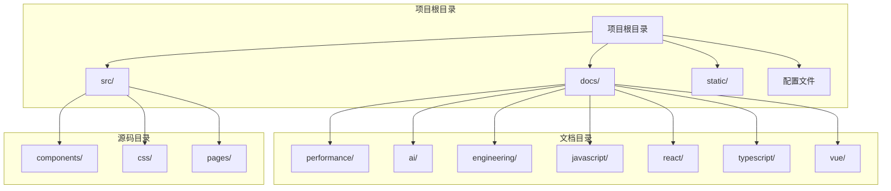

**图表来源**
- [README.md:1-42](file://README.md#L1-L42)
- [package.json:1-50](file://package.json#L1-L50)

**章节来源**
- [README.md:1-42](file://README.md#L1-L42)
- [package.json:1-50](file://package.json#L1-L50)

## 核心组件

### 渲染性能文档核心内容

项目中的渲染性能优化文档涵盖了浏览器渲染管道的完整流程，包括关键渲染路径（CRP）的六个阶段：

1. **HTML解析** → 构建DOM树
2. **CSS解析** → 构建CSSOM树  
3. **合并** → 构建Render Tree
4. **布局（Layout）** → 计算元素位置和大小
5. **绘制（Paint）** → 填充像素
6. **合成（Composite）** → 合成图层 → 显示

### 性能优化策略分类

根据渲染开销的不同，属性被分为三个等级：

- **最便宜（只触发Composite）**：transform、opacity、filter
- **中等（触发Paint + Composite）**：color、background-color、box-shadow、outline
- **最贵（触发Layout + Paint + Composite）**：width、height、margin、padding、border、top、left、display、position、font-size

**章节来源**
- [rendering-optimization.md:16-62](file://docs/performance/rendering-optimization.md#L16-L62)

## 架构概览

### 浏览器渲染管道架构

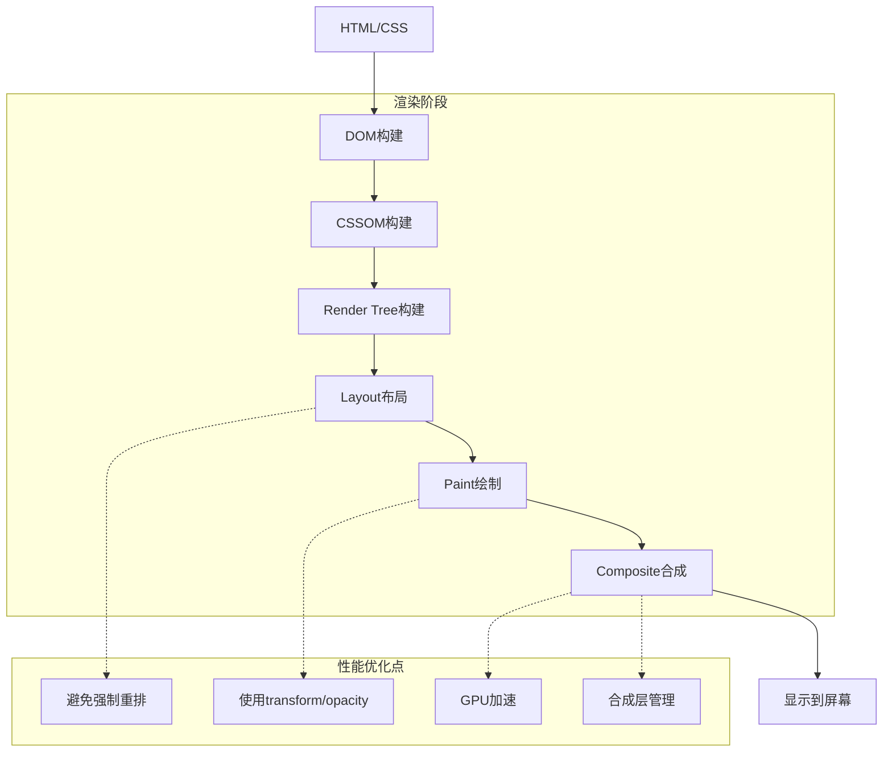

**图表来源**
- [rendering-optimization.md:18-35](file://docs/performance/rendering-optimization.md#L18-L35)

### 重排重绘避免策略

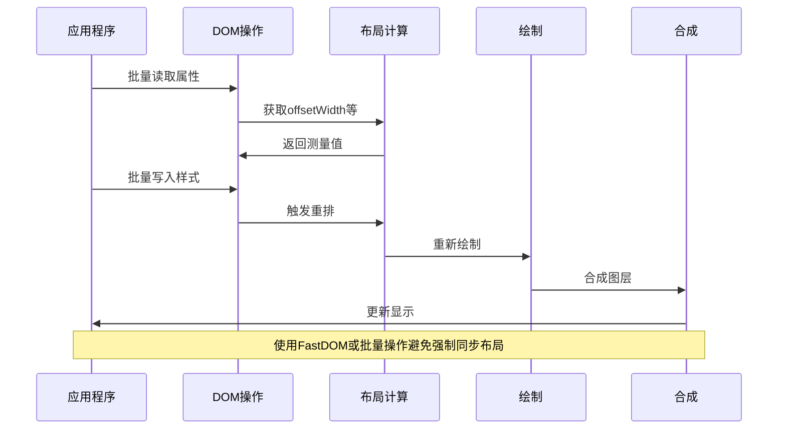

**图表来源**
- [rendering-optimization.md:114-163](file://docs/performance/rendering-optimization.md#L114-L163)

**章节来源**
- [rendering-optimization.md:66-163](file://docs/performance/rendering-optimization.md#L66-L163)

## 详细组件分析

### CSS动画优化组件

#### transform和opacity优化

CSS动画优化的核心在于选择正确的属性以最小化渲染开销：

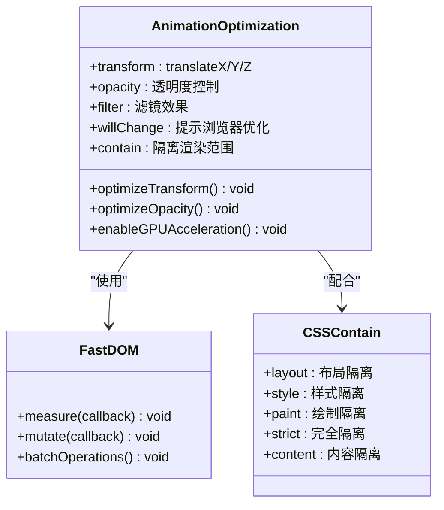

**图表来源**
- [rendering-optimization.md:169-234](file://docs/performance/rendering-optimization.md#L169-L234)

#### GPU加速实现

现代浏览器通过合成层实现GPU加速，将重绘操作从主线程转移到GPU：

```mermaid
flowchart LR
A[普通元素] --> B[触发Layout]
B --> C[触发Paint]
C --> D[触发Composite]
E[合成层元素] --> F[提升到合成层]
F --> G[GPU处理]
G --> H[独立更新]
subgraph "合成层优化"
I[will-change: transform]
J[transform: translateZ(0)]
K[backface-visibility: hidden]
end
F -.-> I
F -.-> J
F -.-> K
```

**图表来源**
- [rendering-optimization.md:193-213](file://docs/performance/rendering-optimization.md#L193-L213)

**章节来源**
- [rendering-optimization.md:167-234](file://docs/performance/rendering-optimization.md#L167-L234)

### JavaScript执行优化组件

#### 长任务处理策略

```mermaid
flowchart TD
A[长任务检测] --> B{任务时长 > 50ms?}
B --> |是| C[时间切片处理]
B --> |否| D[直接执行]
C --> E[requestAnimationFrame切片]
E --> F[scheduler.yield()让出主线程]
F --> G[Web Worker异步处理]
subgraph "优化策略"
H[时间切片]
I[scheduler API]
J[Web Worker]
K[requestIdleCallback]
end
C -.-> H
C -.-> I
C -.-> J
C -.-> K
```

**图表来源**
- [rendering-optimization.md:279-345](file://docs/performance/rendering-optimization.md#L279-L345)

#### 事件处理优化

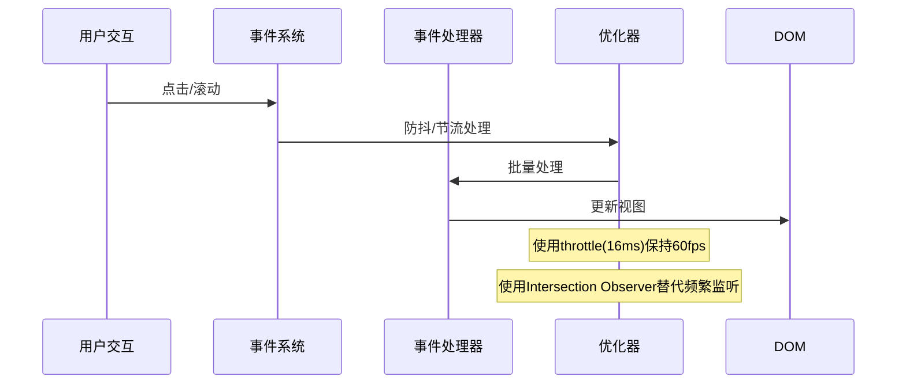

**图表来源**
- [rendering-optimization.md:439-497](file://docs/performance/rendering-optimization.md#L439-L497)

**章节来源**
- [rendering-optimization.md:279-497](file://docs/performance/rendering-optimization.md#L279-L497)

### 列表渲染优化组件

#### 虚拟列表实现

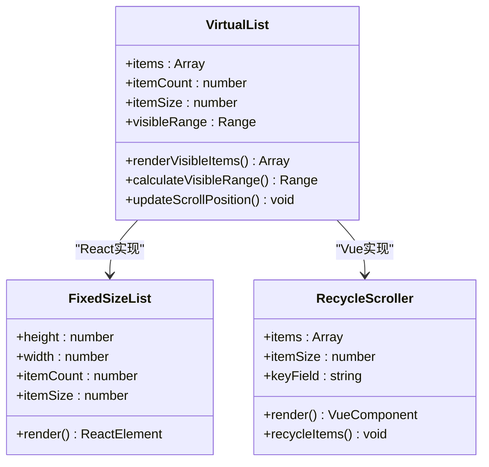

**图表来源**
- [rendering-optimization.md:375-435](file://docs/performance/rendering-optimization.md#L375-L435)

**章节来源**
- [rendering-optimization.md:375-435](file://docs/performance/rendering-optimization.md#L375-L435)

### 内存优化组件

#### 内存泄漏防护

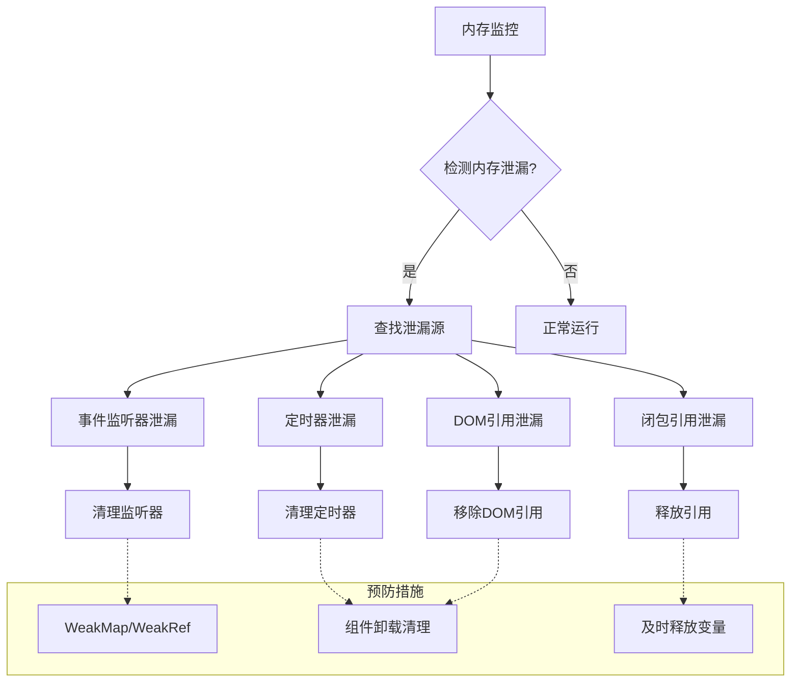

**图表来源**
- [rendering-optimization.md:501-596](file://docs/performance/rendering-optimization.md#L501-L596)

**章节来源**
- [rendering-optimization.md:501-596](file://docs/performance/rendering-optimization.md#L501-L596)

## 依赖关系分析

### 项目依赖架构

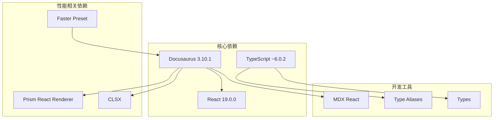

**图表来源**
- [package.json:17-33](file://package.json#L17-L33)

### 样式系统依赖

项目采用模块化CSS架构，结合Docusaurus的主题系统：

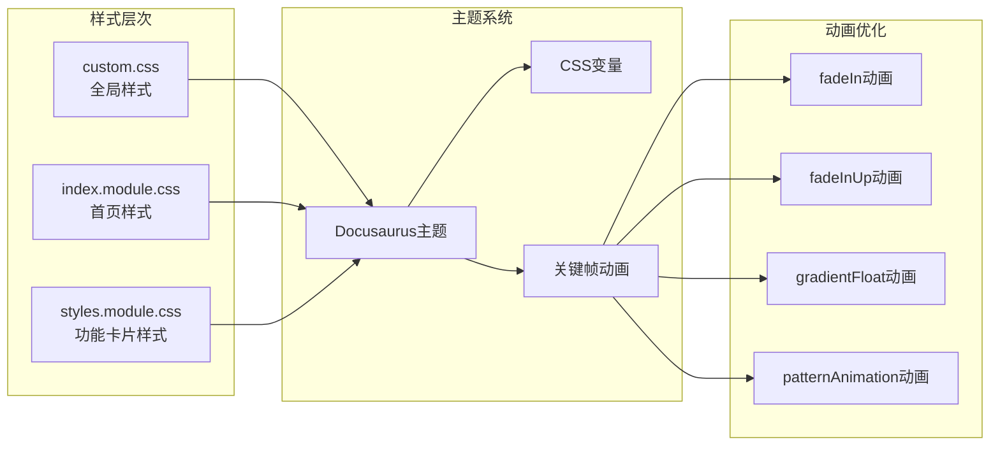

**图表来源**
- [custom.css:1-644](file://src/css/custom.css#L1-L644)
- [index.module.css:1-438](file://src/pages/index.module.css#L1-L438)
- [styles.module.css:1-119](file://src/components/HomepageFeatures/styles.module.css#L1-L119)

**章节来源**
- [package.json:17-33](file://package.json#L17-L33)
- [custom.css:1-644](file://src/css/custom.css#L1-L644)
- [index.module.css:1-438](file://src/pages/index.module.css#L1-L438)
- [styles.module.css:1-119](file://src/components/HomepageFeatures/styles.module.css#L1-L119)

## 性能考虑

### 渲染性能基准

根据文档内容，渲染性能的关键指标：

- **帧率要求**：60fps（每帧16.67ms）
- **长任务阈值**：>50ms（阻塞主线程）
- **事件处理频率**：节流至16ms（60fps）

### 优化优先级

```mermaid
flowchart TD
A[性能优化优先级] --> B[避免强制重排]
A --> C[使用transform/opacity]
A --> D[GPU加速]
A --> E[内存优化]
B --> F[批量DOM操作]
B --> G[FastDOM模式]
B --> H[避免强制同步布局]
C --> I[合成层优化]
C --> J[will-change属性]
C --> K[CSS containment]
D --> L[translateZ(0)]
D --> M[backface-visibility]
D --> N[GPU处理重绘]
E --> O[内存泄漏防护]
E --> P[WeakMap/WeakRef]
E --> Q[及时释放引用]
```

### 性能测试方法

项目提供了多种性能测试和监控方法：

1. **浏览器开发者工具**：使用Performance面板分析渲染瓶颈
2. **Frame Timing API**：精确测量帧时间
3. **Lighthouse审计**：自动化性能评估
4. **PageSpeed Insights**：Google提供的性能分析工具

**章节来源**
- [rendering-optimization.md:741-747](file://docs/performance/rendering-optimization.md#L741-L747)

## 故障排除指南

### 常见渲染问题诊断

#### 重排重绘问题

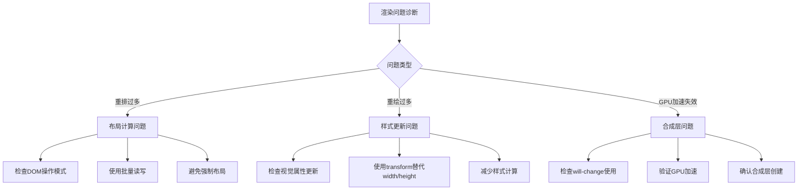

#### 性能瓶颈识别

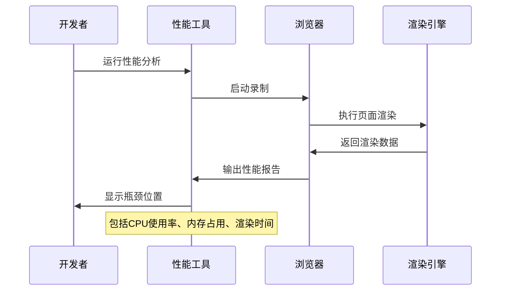

**章节来源**
- [rendering-optimization.md:650-737](file://docs/performance/rendering-optimization.md#L650-L737)

### 优化实施检查清单

- [ ] 检查所有DOM操作是否批量执行
- [ ] 确认使用transform/opacity替代布局属性
- [ ] 验证GPU加速是否正确启用
- [ ] 确保内存泄漏得到防护
- [ ] 检查事件处理是否合理节流
- [ ] 验证虚拟列表实现是否正确
- [ ] 确认CSS containment使用恰当

## 结论

渲染性能优化是一个多维度的复杂工程，需要从浏览器渲染机制、代码实现、资源管理等多个角度综合考虑。通过理解关键渲染路径、掌握重排重绘避免策略、合理使用GPU加速、优化JavaScript执行和内存管理，可以显著提升页面性能。

现代Web开发中，性能优化不再是可选项，而是必需品。随着用户对体验要求的不断提高，掌握这些核心技术将成为前端开发者的必备技能。

## 附录

### 实战案例参考

项目提供了多个实际优化案例：

1. **滚动列表优化**：使用Intersection Observer替代频繁滚动监听
2. **电商首页优化**：通过代码分割、图片优化、关键CSS内联等手段
3. **组件懒加载**：React和Vue的虚拟列表实现

### 学习资源

- [Rendering Performance - web.dev](https://web.dev/rendering-performance/)
- [Inside look at modern web browser](https://developer.chrome.com/blog/inside-browser-part3/)
- [CSS Triggers](https://csstriggers.com/) - 查看哪些CSS属性会触发重排/重绘
- [Frame Timing API](https://developer.mozilla.org/en-US/docs/Web/API/Frame_Timing_API)

**章节来源**
- [rendering-optimization.md:600-646](file://docs/performance/rendering-optimization.md#L600-L646)
- [loading-optimization.md:466-512](file://docs/performance/loading-optimization.md#L466-L512)