# 网络性能优化

<cite>
**本文档引用的文件**
- [README.md](file://README.md)
- [package.json](file://package.json)
- [docs/performance/index.md](file://docs/performance/index.md)
- [docs/performance/loading-optimization.md](file://docs/performance/loading-optimization.md)
- [docs/performance/rendering-optimization.md](file://docs/performance/rendering-optimization.md)
- [docs/intro.md](file://docs/intro.md)
</cite>

## 目录
1. [简介](#简介)
2. [项目结构](#项目结构)
3. [核心组件](#核心组件)
4. [架构概览](#架构概览)
5. [详细组件分析](#详细组件分析)
6. [依赖分析](#依赖分析)
7. [性能考虑](#性能考虑)
8. [故障排除指南](#故障排除指南)
9. [结论](#结论)
10. [附录](#附录)

## 简介

网络性能优化是现代 Web 应用开发中的关键环节，直接影响用户体验和业务指标。本指南深入讲解网络传输层面的性能优化策略，包括缓存策略设计、CDN 加速配置、HTTP/2 与 HTTP/3 协议优化等核心技术。

在网络性能优化中，我们重点关注以下方面：
- **传输效率**：通过压缩、缓存和协议优化提升数据传输速度
- **连接管理**：合理利用连接复用和多路复用技术
- **资源分发**：通过 CDN 和边缘网络优化资源获取
- **请求优化**：减少不必要的请求和优化请求顺序

## 项目结构

该项目是一个基于 Docusaurus 的静态网站生成器，专门用于前端性能优化知识的整理和分享。项目结构清晰，采用文档驱动的方式组织内容。

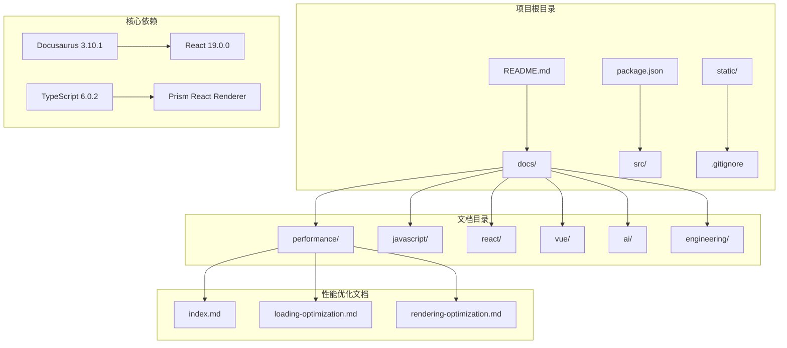

**图表来源**
- [package.json:17-26](file://package.json#L17-L26)
- [docs/performance/index.md:107-134](file://docs/performance/index.md#L107-L134)

**章节来源**
- [README.md:1-42](file://README.md#L1-L42)
- [package.json:1-50](file://package.json#L1-L50)
- [docs/performance/index.md:107-134](file://docs/performance/index.md#L107-L134)

## 核心组件

### 性能优化框架

项目提供了完整的前端性能优化知识体系，涵盖加载、渲染、网络等多个维度：

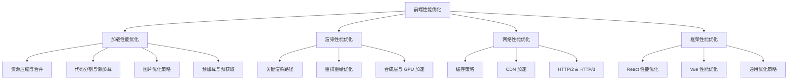

**图表来源**
- [docs/performance/index.md:107-134](file://docs/performance/index.md#L107-L134)

### 核心性能指标

项目定义了关键的性能指标体系，用于衡量和监控优化效果：

| 指标 | 全称 | 衡量内容 | 目标值 | 重要性 |
|------|------|----------|--------|--------|
| **LCP** | Largest Contentful Paint | 最大内容绘制时间 | < 2.5s | 高 |
| **FID** | First Input Delay | 首次输入延迟 | < 100ms | 高 |
| **CLS** | Cumulative Layout Shift | 累计布局偏移 | < 0.1 | 高 |
| **INP** | Interaction to Next Paint | 交互响应时间 | < 200ms | 中 |
| **TTFB** | Time to First Byte | 首字节时间 | < 800ms | 中 |

**章节来源**
- [docs/performance/index.md:49-58](file://docs/performance/index.md#L49-L58)

## 架构概览

### 网络优化架构

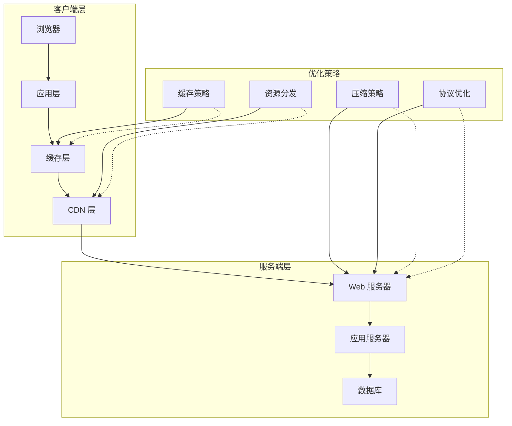

**图表来源**
- [docs/performance/loading-optimization.md:72-85](file://docs/performance/loading-optimization.md#L72-L85)
- [docs/performance/loading-optimization.md:314-345](file://docs/performance/loading-optimization.md#L314-L345)

### 缓存层次结构

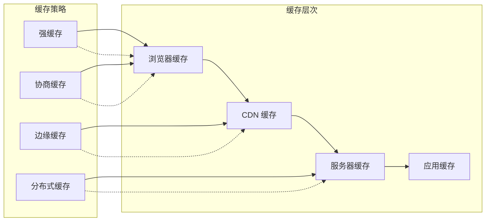

**图表来源**
- [docs/performance/loading-optimization.md:417-424](file://docs/performance/loading-optimization.md#L417-L424)

## 详细组件分析

### 缓存策略设计

#### 强缓存与协商缓存

缓存策略是网络性能优化的核心，需要根据资源特性和更新频率进行合理配置：

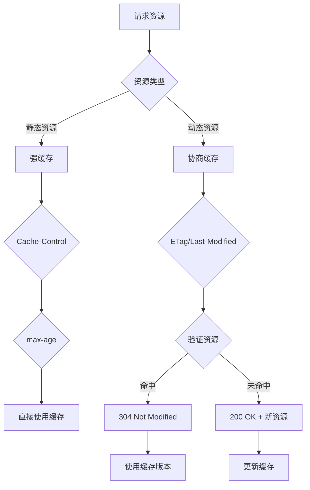

**图表来源**
- [docs/performance/loading-optimization.md:417-424](file://docs/performance/loading-optimization.md#L417-L424)

#### Service Worker 缓存

Service Worker 提供了强大的离线缓存能力，可以实现复杂的缓存策略：

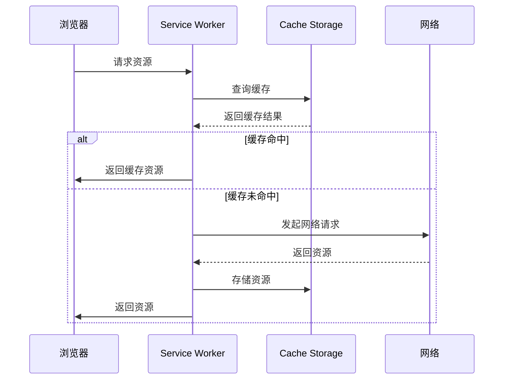

**图表来源**
- [docs/performance/loading-optimization.md:397-425](file://docs/performance/loading-optimization.md#L397-L425)

**章节来源**
- [docs/performance/loading-optimization.md:395-425](file://docs/performance/loading-optimization.md#L395-L425)

### CDN 加速配置

#### CDN 优化策略

CDN（内容分发网络）通过将资源缓存到全球分布的边缘节点，显著提升资源访问速度：

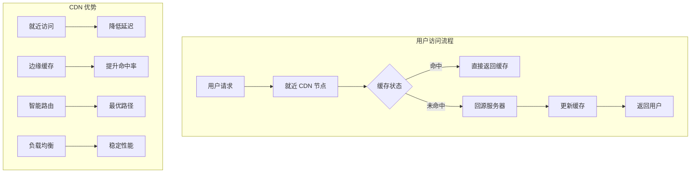

**图表来源**
- [docs/performance/loading-optimization.md:314-345](file://docs/performance/loading-optimization.md#L314-L345)

#### 图片 CDN 优化

图片是网络传输中的大头，CDN 优化尤为重要：

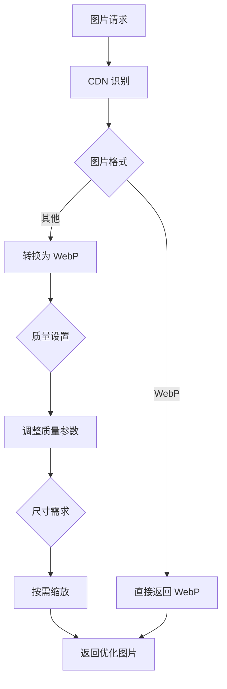

**图表来源**
- [docs/performance/loading-optimization.md:316-345](file://docs/performance/loading-optimization.md#L316-L345)

**章节来源**
- [docs/performance/loading-optimization.md:314-345](file://docs/performance/loading-optimization.md#L314-L345)

### HTTP/2 与 HTTP/3 协议优化

#### HTTP/2 多路复用

HTTP/2 通过多路复用解决了 HTTP/1.x 的队头阻塞问题：

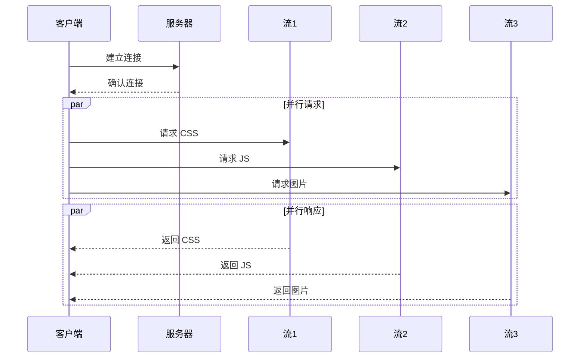

**图表来源**
- [docs/performance/index.md:93](file://docs/performance/index.md#L93)

#### HTTP/3 QUIC 协议

HTTP/3 基于 QUIC 协议，进一步提升了连接建立和传输效率：

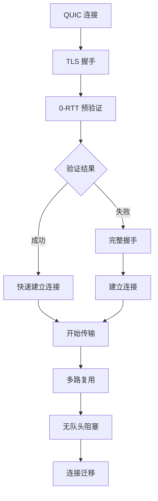

**图表来源**
- [docs/performance/index.md:93](file://docs/performance/index.md#L93)

**章节来源**
- [docs/performance/index.md:91-96](file://docs/performance/index.md#L91-L96)

### 资源压缩与优化

#### 压缩算法对比

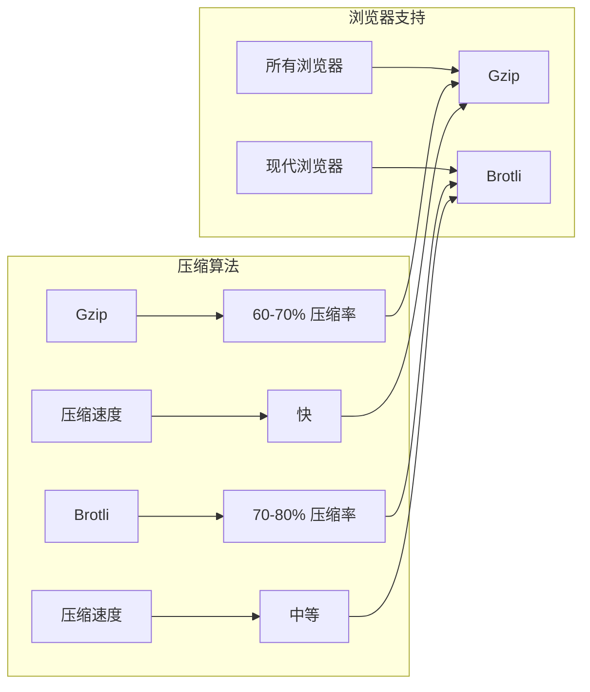

**图表来源**
- [docs/performance/loading-optimization.md:87-93](file://docs/performance/loading-optimization.md#L87-L93)

#### 代码压缩策略

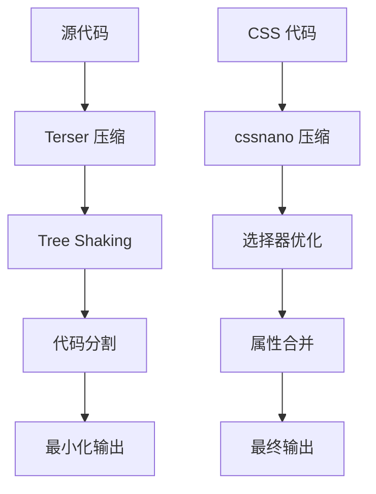

**图表来源**
- [docs/performance/loading-optimization.md:38-70](file://docs/performance/loading-optimization.md#L38-L70)

**章节来源**
- [docs/performance/loading-optimization.md:72-85](file://docs/performance/loading-optimization.md#L72-L85)

### 预加载与预获取

#### 资源提示策略

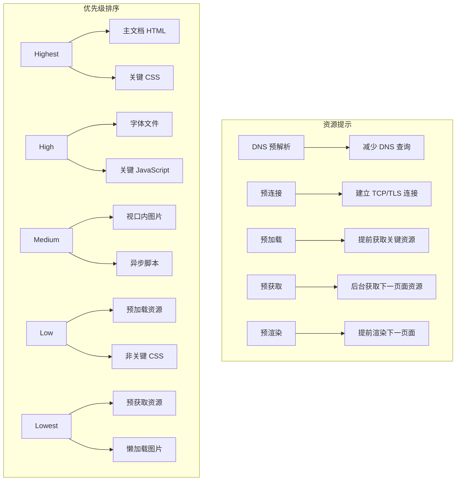

**图表来源**
- [docs/performance/loading-optimization.md:351-393](file://docs/performance/loading-optimization.md#L351-L393)

**章节来源**
- [docs/performance/loading-optimization.md:351-393](file://docs/performance/loading-optimization.md#L351-L393)

## 依赖分析

### 技术栈依赖

项目采用现代化的技术栈，确保性能和开发体验：

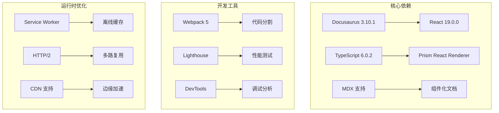

**图表来源**
- [package.json:17-33](file://package.json#L17-L33)

### 性能优化工具链

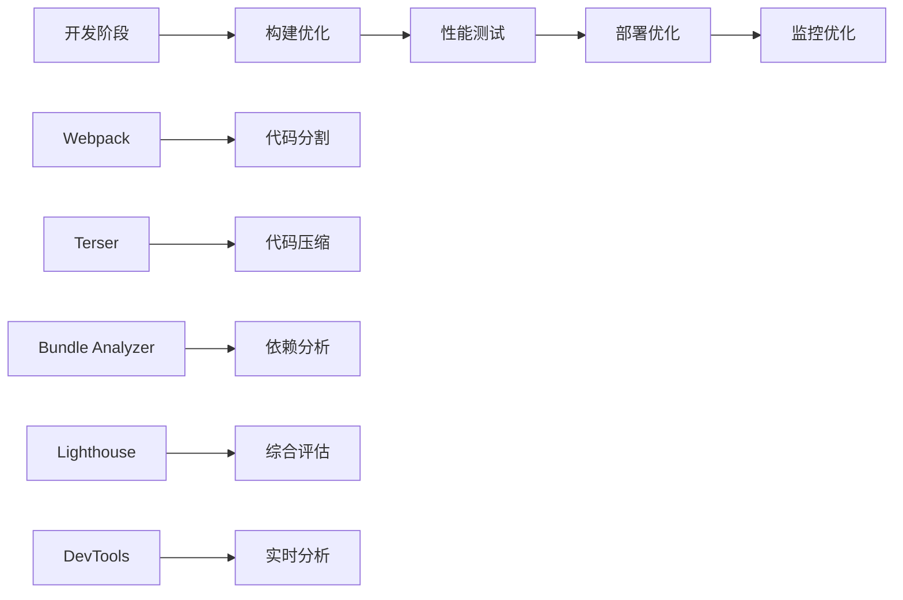

**图表来源**
- [docs/performance/index.md:97-106](file://docs/performance/index.md#L97-L106)

**章节来源**
- [package.json:17-33](file://package.json#L17-L33)
- [docs/performance/index.md:97-106](file://docs/performance/index.md#L97-L106)

## 性能考虑

### 性能优化最佳实践

基于项目文档总结的最佳实践：

#### 缓存策略最佳实践
- **静态资源**：使用强缓存（Cache-Control: max-age）
- **动态资源**：使用协商缓存（ETag/Last-Modified）
- **关键资源**：预加载和预连接
- **图片资源**：CDN 缓存 + 格式优化

#### 网络优化最佳实践
- **协议升级**：优先使用 HTTP/2 或 HTTP/3
- **连接复用**：启用持久连接
- **资源压缩**：Gzip/Brotli 压缩
- **CDN 部署**：就近分发和边缘缓存

#### 性能监控最佳实践
- **核心指标**：LCP、FID、CLS、INP、TTFB
- **持续监控**：生产环境性能监控
- **基准测试**：定期性能回归测试
- **用户体验**：以用户感知为准绳

### 性能优化检查清单

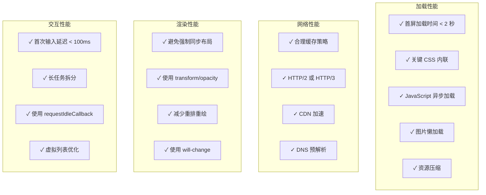

**图表来源**
- [docs/performance/index.md:70-96](file://docs/performance/index.md#L70-L96)

## 故障排除指南

### 常见性能问题诊断

#### 缓存相关问题
- **问题**：资源更新后仍使用旧版本
- **诊断**：检查 Cache-Control 和 ETag 设置
- **解决**：使用版本号或哈希值控制缓存失效

#### CDN 相关问题
- **问题**：CDN 缓存命中率低
- **诊断**：检查缓存配置和资源指纹
- **解决**：优化缓存键和过期策略

#### 协议相关问题
- **问题**：HTTP/2 未生效
- **诊断**：检查服务器配置和浏览器支持
- **解决**：升级服务器和客户端

### 性能测试工具使用

#### Lighthouse 使用指南
1. **安装**：npm install -g lighthouse
2. **测试**：lighthouse https://example.com
3. **分析**：查看报告中的性能建议
4. **优化**：针对具体问题进行优化

#### Chrome DevTools 使用指南
1. **打开**：F12 -> Performance 面板
2. **录制**：点击录制按钮
3. **分析**：查看网络面板和性能面板
4. **优化**：根据分析结果优化代码

**章节来源**
- [docs/performance/index.md:97-106](file://docs/performance/index.md#L97-L106)

## 结论

网络性能优化是一个系统性的工程，需要从多个维度协同优化。基于本项目的分析，我们可以得出以下结论：

1. **缓存策略**是网络优化的基础，需要根据资源特性制定合理的缓存策略
2. **CDN 加速**能够显著提升资源访问速度，特别是在全球范围内部署时
3. **协议升级**（HTTP/2/3）能够充分利用现代网络特性，提升传输效率
4. **压缩优化**是提升传输速度的重要手段，需要平衡压缩率和压缩速度
5. **监控体系**是持续优化的保障，需要建立完善的性能监控和测试体系

通过综合运用这些优化策略，可以显著提升 Web 应用的网络性能，改善用户体验，提高业务指标。

## 附录

### 性能优化工具推荐

| 工具类别 | 工具名称 | 主要功能 | 使用场景 |
|----------|----------|----------|----------|
| 性能评估 | Lighthouse | 综合性能评估 | 项目启动前评估 |
| 性能分析 | Chrome DevTools | 实时性能分析 | 开发调试 |
| 真实测试 | WebPageTest | 多地点测试 | 生产环境验证 |
| 包分析 | Bundle Analyzer | 依赖关系可视化 | 代码分割优化 |
| 性能监控 | Performance API | 代码埋点 | 生产环境监控 |

### 关键配置参考

#### Nginx 压缩配置
```nginx
gzip on;
gzip_types text/plain text/css application/json application/javascript;
gzip_min_length 1024;
gzip_comp_level 6;

brotli on;
brotli_types text/plain text/css application/json application/javascript;
brotli_comp_level 6;
```

#### Service Worker 缓存配置
```javascript
const CACHE_NAME = 'v1';
const ASSETS = [
  '/',
  '/index.html',
  '/styles/main.css',
  '/scripts/app.js',
  '/images/logo.png',
];
```

**章节来源**
- [docs/performance/loading-optimization.md:72-85](file://docs/performance/loading-optimization.md#L72-L85)
- [docs/performance/loading-optimization.md:397-406](file://docs/performance/loading-optimization.md#L397-L406)