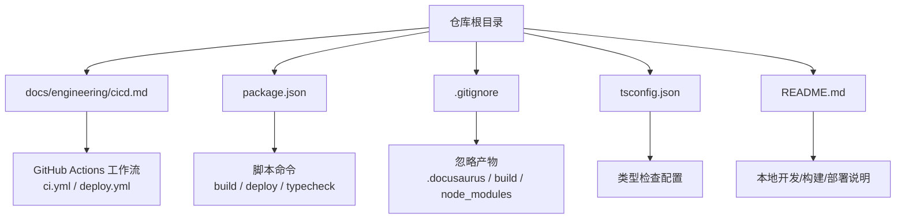
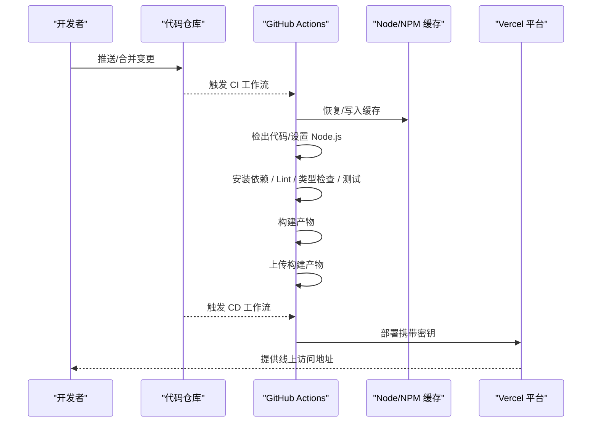
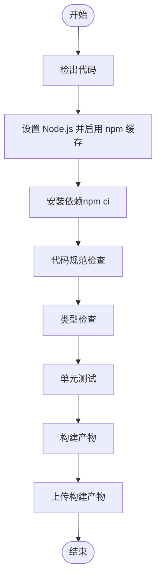
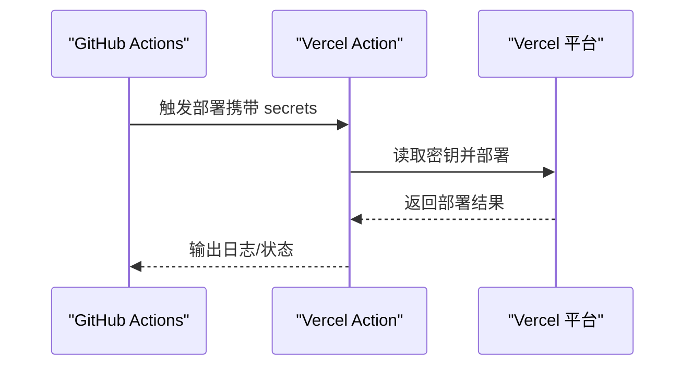
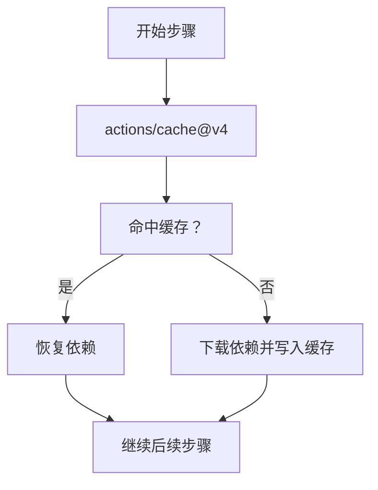
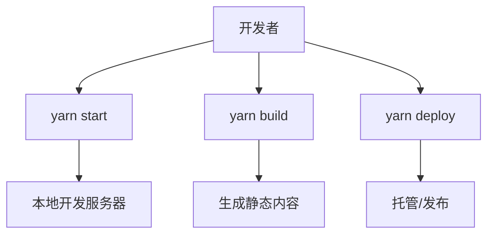
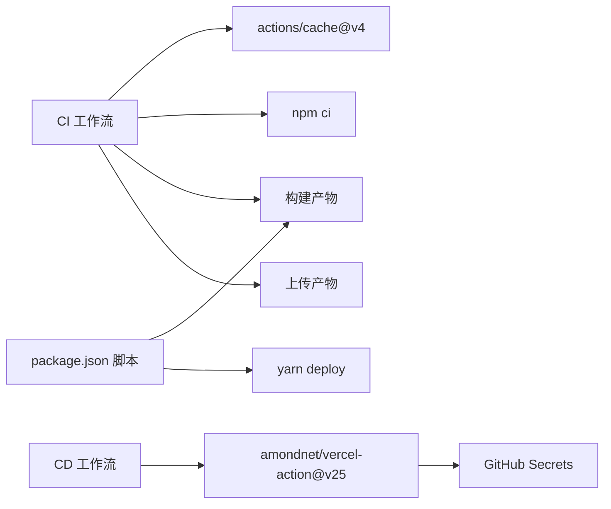

# CI/CD 流程设计

<cite>
**本文引用的文件**   
- [docs/engineering/cicd.md](file://docs/engineering/cicd.md)
- [README.md](file://README.md)
- [package.json](file://package.json)
- [.gitignore](file://.gitignore)
- [tsconfig.json](file://tsconfig.json)
</cite>

## 目录
1. [引言](#引言)
2. [项目结构](#项目结构)
3. [核心组件](#核心组件)
4. [架构总览](#架构总览)
5. [详细组件分析](#详细组件分析)
6. [依赖关系分析](#依赖关系分析)
7. [性能考量](#性能考量)
8. [故障排查指南](#故障排查指南)
9. [结论](#结论)
10. [附录](#附录)

## 引言
本指南围绕“CI/CD 流程设计”展开，结合仓库中已有的 GitHub Actions 配置与 Docusaurus 网站构建部署实践，系统阐述持续集成与持续部署的关键概念、流程设计与实施方法。内容覆盖自动化测试、代码质量检查、构建与部署、版本与发布策略、回滚机制、常见问题排查与性能优化建议，并提供可直接落地的配置参考路径。

## 项目结构
该仓库采用 Docusaurus 静态站点生成器，工程化文档与 CI/CD 配置集中在 docs 目录与根目录配置文件中。CI/CD 的关键实践体现在 GitHub Actions 工作流与构建脚本中。

图示来源
- [docs/engineering/cicd.md](file://docs/engineering/cicd.md)
- [package.json](file://package.json)
- [.gitignore](file://.gitignore)
- [tsconfig.json](file://tsconfig.json)
- [README.md](file://README.md)

章节来源
- [docs/engineering/cicd.md:1-101](file://docs/engineering/cicd.md#L1-L101)
- [README.md:1-42](file://README.md#L1-L42)
- [package.json:1-50](file://package.json#L1-L50)
- [.gitignore:1-20](file://.gitignore#L1-L20)
- [tsconfig.json:1-13](file://tsconfig.json#L1-L13)

## 核心组件
- 持续集成流水线（CI）
  - 触发条件：推送主分支、打开/更新拉取请求
  - 步骤：检出代码、设置 Node.js 运行环境、安装依赖、代码规范检查、类型检查、单元测试、构建、上传产物
- 持续部署流水线（CD）
  - 触发条件：推送主分支
  - 步骤：检出代码、部署到 Vercel（读取密钥）
- 缓存优化
  - 使用 actions/cache 缓存 Node 模块，提升重复执行效率
- 构建与部署脚本
  - package.json 中定义了 docusaurus 的 start/build/deploy 等脚本
- 类型检查
  - tsconfig.json 扩展 Docusaurus 默认 TS 配置，启用严格模式与排除构建目录

章节来源
- [docs/engineering/cicd.md:10-101](file://docs/engineering/cicd.md#L10-L101)
- [package.json:5-16](file://package.json#L5-L16)
- [tsconfig.json:4-12](file://tsconfig.json#L4-L12)

## 架构总览
下图展示从代码提交到静态站点上线的整体流程，涵盖 CI/CD 关键节点与外部服务集成。

图示来源
- [docs/engineering/cicd.md:12-80](file://docs/engineering/cicd.md#L12-L80)

## 详细组件分析

### 组件一：GitHub Actions 基础 CI 配置
- 触发条件：对 main 分支的 push 与 pull_request
- 主要步骤：
  - 检出代码
  - 设置 Node.js（含缓存 npm）
  - 安装依赖（使用 npm ci）
  - Lint、类型检查、测试
  - 构建
  - 上传构建产物
- 关键要点：
  - 使用 npm ci 保证依赖一致性
  - 通过 actions/cache 缓存模块以加速流水线
  - 上传构建产物便于后续阶段使用

图示来源
- [docs/engineering/cicd.md:22-55](file://docs/engineering/cicd.md#L22-L55)

章节来源
- [docs/engineering/cicd.md:10-55](file://docs/engineering/cicd.md#L10-L55)

### 组件二：自动部署到 Vercel
- 触发条件：对 main 分支的 push
- 步骤：
  - 检出代码
  - 使用 amondnet/vercel-action 部署
  - 读取 secrets（VERCEL_TOKEN、VERCEL_ORG_ID、VERCEL_PROJECT_ID）
  - 传入 --prod 参数进行生产部署
- 关键要点：
  - 密钥通过 GitHub Secrets 管理
  - 仅在主分支触发，避免非主线改动误部署

图示来源
- [docs/engineering/cicd.md:63-80](file://docs/engineering/cicd.md#L63-L80)

章节来源
- [docs/engineering/cicd.md:57-80](file://docs/engineering/cicd.md#L57-L80)

### 组件三：缓存优化
- 使用 actions/cache 缓存 ~/.npm 目录
- 通过 hashFiles 计算 key，支持 restore-keys 回退
- 显著缩短后续流水线执行时间

图示来源
- [docs/engineering/cicd.md:84-92](file://docs/engineering/cicd.md#L84-L92)

章节来源
- [docs/engineering/cicd.md:82-92](file://docs/engineering/cicd.md#L82-L92)

### 组件四：构建与部署脚本
- package.json 中定义了 docusaurus 的常用脚本：
  - start、build、deploy、clear、serve、typecheck 等
- README.md 提供本地开发、构建与部署的说明（包含 GitHub Pages 部署方式）

图示来源
- [package.json:5-16](file://package.json#L5-L16)
- [README.md:5-42](file://README.md#L5-L42)

章节来源
- [package.json:5-16](file://package.json#L5-L16)
- [README.md:5-42](file://README.md#L5-L42)

### 组件五：类型检查配置
- tsconfig.json 扩展 @docusaurus/tsconfig
- 启用严格模式与排除构建目录，确保 IDE 体验与手动类型检查一致

章节来源
- [tsconfig.json:4-12](file://tsconfig.json#L4-L12)

## 依赖关系分析
- CI/CD 与构建脚本耦合度低，CI 专注质量门禁，构建与部署由 package.json 脚本统一管理
- 缓存策略与依赖安装方式（npm ci）强关联，直接影响流水线性能
- 密钥管理通过 GitHub Secrets 与 Vercel Action 集成，降低泄露风险

图示来源
- [docs/engineering/cicd.md:12-80](file://docs/engineering/cicd.md#L12-L80)
- [package.json:5-16](file://package.json#L5-L16)

章节来源
- [docs/engineering/cicd.md:12-80](file://docs/engineering/cicd.md#L12-L80)
- [package.json:5-16](file://package.json#L5-L16)

## 性能考量
- 使用 npm ci 替代 npm install，确保依赖锁定与一致性，减少构建不确定性
- 利用 actions/cache 缓存 node_modules，显著缩短流水线时间
- 将构建产物上传为 Artifact，便于后续阶段复用，避免重复构建
- 在大型项目中，可按模块拆分任务并行执行，进一步缩短总耗时

## 故障排查指南
- 依赖安装失败
  - 症状：CI 中安装依赖报错或超时
  - 排查：确认 .npmrc 或 registry 配置；检查网络与缓存命中情况
  - 参考：[docs/engineering/cicd.md:35-36](file://docs/engineering/cicd.md#L35-L36)
- 类型检查/测试失败
  - 症状：类型检查或测试阶段中断
  - 排查：查看具体错误日志；在本地运行对应脚本复现
  - 参考：[package.json:15](file://package.json#L15)、[tsconfig.json:6-10](file://tsconfig.json#L6-L10)
- 构建产物缺失
  - 症状：CD 阶段找不到 dist 或构建产物
  - 排查：确认 CI 最终步骤是否上传产物；核对构建输出目录
  - 参考：[docs/engineering/cicd.md:50-54](file://docs/engineering/cicd.md#L50-L54)
- Vercel 部署失败
  - 症状：CD 阶段部署报错
  - 排查：检查 secrets 是否正确配置；确认项目 ID/组织 ID；查看 Vercel 日志
  - 参考：[docs/engineering/cicd.md:73-79](file://docs/engineering/cicd.md#L73-L79)
- 本地开发差异
  - 症状：本地可运行但 CI 失败
  - 排查：统一 Node 版本与包管理器；确保 .gitignore 忽略构建产物
  - 参考：[README.md:11-25](file://README.md#L11-L25)、[.gitignore:1-10](file://.gitignore#L1-L10)

章节来源
- [docs/engineering/cicd.md:35-54](file://docs/engineering/cicd.md#L35-L54)
- [docs/engineering/cicd.md:73-79](file://docs/engineering/cicd.md#L73-L79)
- [package.json:15](file://package.json#L15)
- [tsconfig.json:6-10](file://tsconfig.json#L6-L10)
- [README.md:11-25](file://README.md#L11-L25)
- [.gitignore:1-10](file://.gitignore#L1-L10)

## 结论
本仓库已具备完善的 CI/CD 基础：通过 GitHub Actions 实现质量门禁与自动化部署，配合缓存与 npm ci 提升稳定性与效率。建议在现有基础上扩展：
- 引入多环境（预发/生产）与灰度发布策略
- 增加安全扫描（依赖漏洞、代码扫描）
- 丰富测试矩阵（跨浏览器/跨 Node 版本）
- 建立回滚与蓝绿发布机制，保障线上变更可控可逆

## 附录
- 配置参考路径
  - CI 基础配置：[docs/engineering/cicd.md:12-55](file://docs/engineering/cicd.md#L12-L55)
  - 自动部署到 Vercel：[docs/engineering/cicd.md:59-80](file://docs/engineering/cicd.md#L59-L80)
  - 缓存优化：[docs/engineering/cicd.md:84-92](file://docs/engineering/cicd.md#L84-L92)
  - 构建与部署脚本：[package.json:5-16](file://package.json#L5-L16)
  - 本地开发与部署说明：[README.md:5-42](file://README.md#L5-L42)
  - 类型检查配置：[tsconfig.json:4-12](file://tsconfig.json#L4-L12)
  - 忽略文件：[.gitignore:1-20](file://.gitignore#L1-L20)