# 工程化实践

<cite>
**本文引用的文件**
- [README.md](file://README.md)
- [package.json](file://package.json)
- [tsconfig.json](file://tsconfig.json)
- [docs/engineering/bundler.md](file://docs/engineering/bundler.md)
- [docs/engineering/cicd.md](file://docs/engineering/cicd.md)
- [docs/engineering/docker.md](file://docs/engineering/docker.md)
- [docs/engineering/git-workflow.md](file://docs/engineering/git-workflow.md)
- [docs/engineering/monorepo.md](file://docs/engineering/monorepo.md)
- [docs/engineering/package-management.md](file://docs/engineering/package-management.md)
- [docs/performance/loading-optimization.md](file://docs/performance/loading-optimization.md)
- [docs/performance/rendering-optimization.md](file://docs/performance/rendering-optimization.md)
- [src/css/custom.css](file://src/css/custom.css)
- [src/pages/index.module.css](file://src/pages/index.module.css)
</cite>

## 更新摘要
**所做更改**
- 新增 Docker 容器化指南章节，包含多阶段构建、镜像优化和 CI/CD 集成
- 新增 Git 工作流程与代码规范章节，涵盖 Git Flow、ESLint、Prettier 和 Husky
- 新增 Monorepo 方案章节，介绍 pnpm workspace、Turborepo 和 Nx
- 新增包管理最佳实践章节，比较 npm、yarn、pnpm 工具特性
- 更新学习路线图，反映新增的工程化实践内容
- 扩展面试考察重点，包含容器化和包管理相关内容

## 目录
1. [简介](#简介)
2. [项目结构](#项目结构)
3. [核心组件](#核心组件)
4. [架构总览](#架构总览)
5. [详细组件分析](#详细组件分析)
6. [依赖关系分析](#依赖关系分析)
7. [性能考量](#性能考量)
8. [故障排查指南](#故障排查指南)
9. [结论](#结论)
10. [附录](#附录)

## 简介
本技术文档围绕前端工程化实践展开，系统梳理构建工具、CI/CD 流程、容器化部署、代码规范、包管理和性能监控的关键要点，并结合仓库中的 Docusaurus 文档站点实现，给出可落地的配置思路与优化策略。读者将获得从开发体验、构建效率、质量保障到性能优化的完整工程化体系认知。

## 项目结构
该仓库是一个基于 Docusaurus 的静态站点，文档内容集中在 docs 目录，样式与页面位于 src 目录，根目录包含构建与部署脚本、类型检查配置等。工程化专题现已扩展至七大核心领域：构建工具、CI/CD、Git 工作流、Monorepo、包管理、Docker 容器化和性能优化。

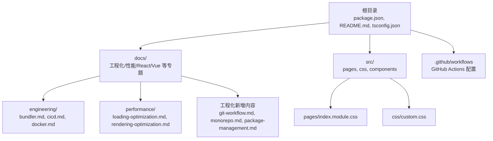

**图表来源**
- [package.json:1-51](file://package.json#L1-L51)
- [docs/engineering/bundler.md:1-103](file://docs/engineering/bundler.md#L1-L103)
- [docs/engineering/cicd.md:1-101](file://docs/engineering/cicd.md#L1-L101)
- [docs/engineering/docker.md:1-222](file://docs/engineering/docker.md#L1-L222)
- [docs/engineering/git-workflow.md:1-196](file://docs/engineering/git-workflow.md#L1-L196)
- [docs/engineering/monorepo.md:1-164](file://docs/engineering/monorepo.md#L1-L164)
- [docs/engineering/package-management.md:1-156](file://docs/engineering/package-management.md#L1-L156)
- [docs/performance/loading-optimization.md:1-575](file://docs/performance/loading-optimization.md#L1-L575)
- [docs/performance/rendering-optimization.md:1-747](file://docs/performance/rendering-optimization.md#L1-L747)
- [src/pages/index.module.css:1-200](file://src/pages/index.module.css#L1-L200)
- [src/css/custom.css:1-200](file://src/css/custom.css#L1-L200)

**章节来源**
- [README.md:1-42](file://README.md#L1-L42)
- [package.json:1-51](file://package.json#L1-L51)
- [tsconfig.json:1-13](file://tsconfig.json#L1-L13)

## 核心组件
- **构建与开发工具链**：Docusaurus 3.x、TypeScript、Browserslist
- **文档工程化**：工程化专题（构建工具、CI/CD、Git 工作流、Monorepo、包管理、Docker 容器化）、性能优化专题（加载与渲染）
- **样式与主题**：自定义 CSS 变量、暗色主题适配、动画与交互增强
- **部署与运维**：本地开发、构建、部署命令；可对接 GitHub Pages 或 Vercel
- **新增工程化实践**：容器化部署、代码规范工具链、多包管理策略

**章节来源**
- [package.json:17-33](file://package.json#L17-L33)
- [package.json:34-48](file://package.json#L34-L48)
- [docs/engineering/bundler.md:10-103](file://docs/engineering/bundler.md#L10-L103)
- [docs/performance/loading-optimization.md:10-575](file://docs/performance/loading-optimization.md#L10-L575)
- [docs/performance/rendering-optimization.md:10-747](file://docs/performance/rendering-optimization.md#L10-L747)
- [src/css/custom.css:6-33](file://src/css/custom.css#L6-L33)

## 架构总览
下图展示从开发到部署的整体流程，涵盖本地开发、构建、测试、代码规范、容器化部署与部署各环节。

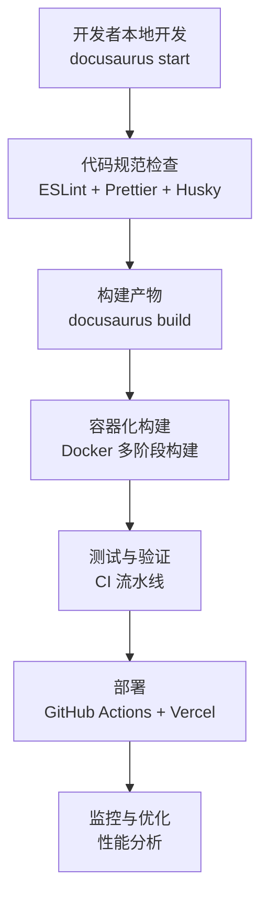

**图表来源**
- [README.md:11-25](file://README.md#L11-L25)
- [docs/engineering/cicd.md:12-55](file://docs/engineering/cicd.md#L12-L55)
- [docs/engineering/cicd.md:59-80](file://docs/engineering/cicd.md#L59-L80)
- [docs/engineering/git-workflow.md:119-139](file://docs/engineering/git-workflow.md#L119-L139)
- [docs/engineering/docker.md:169-191](file://docs/engineering/docker.md#L169-L191)

## 详细组件分析

### 构建工具：Webpack 与 Vite 对比与实践
- **开发体验差异**：Vite 基于原生 ESM，按需编译，冷启动更快；Webpack 需全量打包。
- **生产构建**：Vite 使用 Rollup；Webpack 自带优化能力（SplitChunks、Tree Shaking）。
- **Tree Shaking 要求**：ESM 导出、package.json 标记副作用或白名单。
- **代码分割**：通过 SplitChunks、路由懒加载、组件懒加载降低首屏体积。
- **长效缓存**：Content Hash 与文件名指纹提升缓存命中率。

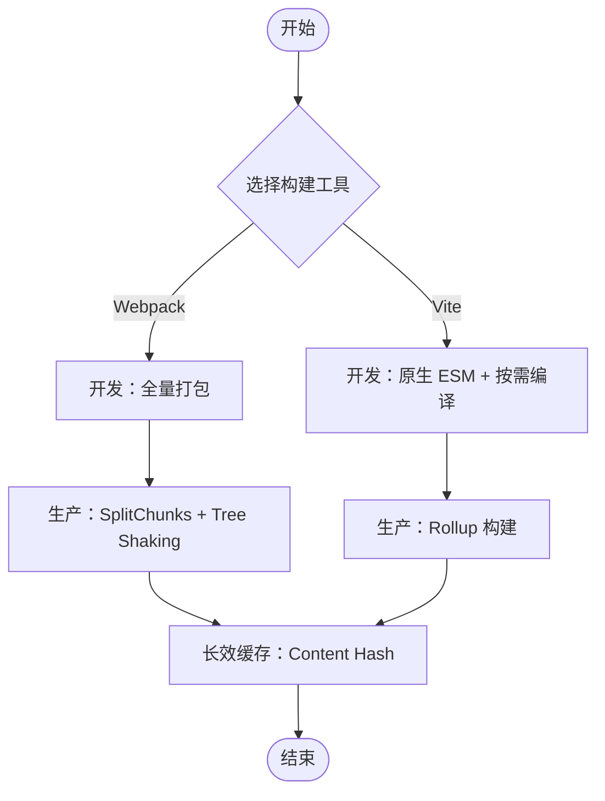

**图表来源**
- [docs/engineering/bundler.md:10-103](file://docs/engineering/bundler.md#L10-L103)

**章节来源**
- [docs/engineering/bundler.md:10-103](file://docs/engineering/bundler.md#L10-L103)

### CI/CD 流程：GitHub Actions 与自动部署
- **基础流水线**：拉取代码、设置 Node.js、安装依赖、Lint、类型检查、测试、构建、上传制品。
- **自动部署**：在主分支推送时触发，使用 vercel-action 部署至 Vercel。
- **缓存优化**：缓存 node_modules，提升 CI 速度。
- **安全与一致性**：使用 npm ci，Secrets 管理令牌。

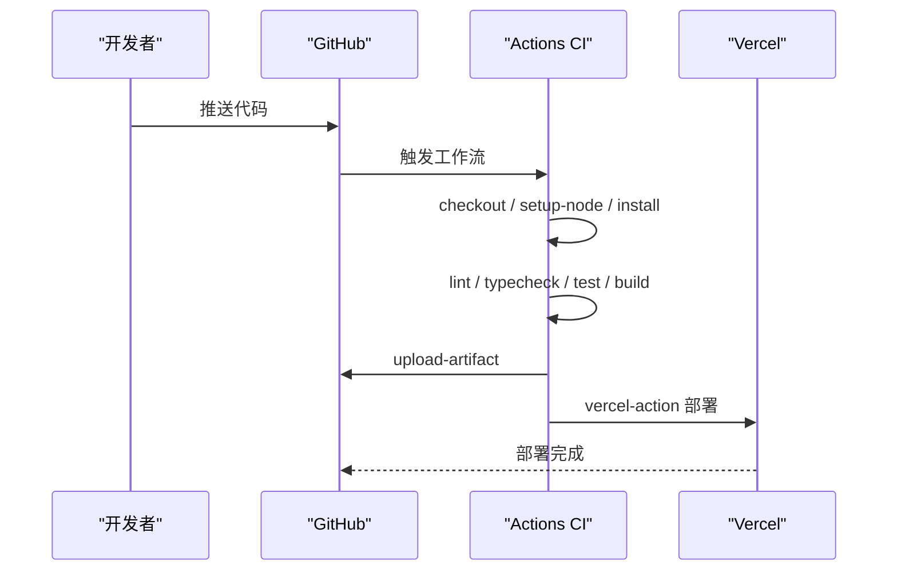

**图表来源**
- [docs/engineering/cicd.md:12-55](file://docs/engineering/cicd.md#L12-L55)
- [docs/engineering/cicd.md:59-80](file://docs/engineering/cicd.md#L59-L80)

**章节来源**
- [docs/engineering/cicd.md:10-101](file://docs/engineering/cicd.md#L10-L101)

### Docker 容器化：多阶段构建与优化策略
- **核心概念**：镜像（只读模板）、容器（运行实例）、Dockerfile（构建脚本）、Docker Compose（多容器编排）。
- **多阶段构建**：大幅减小最终镜像体积，构建工具和依赖不进入最终镜像。
- **镜像优化**：使用 Alpine 或 distroless 基础镜像，合理利用构建缓存层。
- **Nginx 配置**：SPA 路由回退、静态资源缓存、Gzip 压缩。
- **Compose 编排**：前后端分离、数据库持久化、环境变量管理。

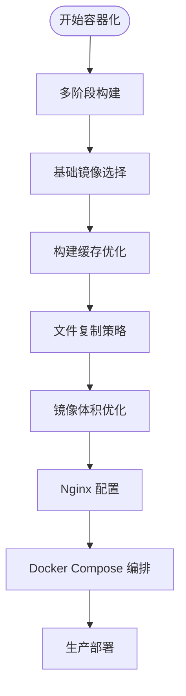

**图表来源**
- [docs/engineering/docker.md:19-49](file://docs/engineering/docker.md#L19-L49)
- [docs/engineering/docker.md:78-118](file://docs/engineering/docker.md#L78-L118)
- [docs/engineering/docker.md:128-167](file://docs/engineering/docker.md#L128-L167)

**章节来源**
- [docs/engineering/docker.md:8-222](file://docs/engineering/docker.md#L8-L222)

### Git 工作流程与代码规范：ESLint + Prettier + Husky
- **工作流对比**：Git Flow（大型项目）、GitHub Flow（推荐）、Trunk-Based（高频发布）。
- **代码规范工具链**：ESLint 配置、Prettier 格式化、ESLint + Prettier 集成。
- **Git Hooks**：Husky + lint-staged，提交前自动检查和格式化。
- **提交规范**：Conventional Commits，清晰描述变更类型和范围。

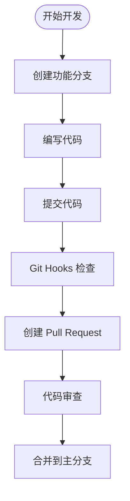

**图表来源**
- [docs/engineering/git-workflow.md:10-54](file://docs/engineering/git-workflow.md#L10-L54)
- [docs/engineering/git-workflow.md:119-139](file://docs/engineering/git-workflow.md#L119-L139)
- [docs/engineering/git-workflow.md:141-153](file://docs/engineering/git-workflow.md#L141-L153)

**章节来源**
- [docs/engineering/git-workflow.md:8-196](file://docs/engineering/git-workflow.md#L8-L196)

### Monorepo 方案：pnpm workspace + Turborepo
- **Monorepo vs Multirepo**：单一仓库管理多个项目，支持原子提交和依赖统一管理。
- **pnpm Workspace**：原生支持，轻量级 Monorepo 管理，包间互相引用。
- **Turborepo**：增量构建和任务缓存，支持远程缓存和并行执行。
- **Nx 替代方案**：全功能企业级工具，插件丰富。

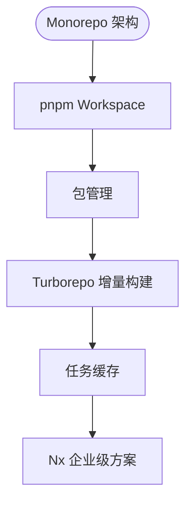

**图表来源**
- [docs/engineering/monorepo.md:25-46](file://docs/engineering/monorepo.md#L25-L46)
- [docs/engineering/monorepo.md:60-85](file://docs/engineering/monorepo.md#L60-L85)
- [docs/engineering/monorepo.md:104-126](file://docs/engineering/monorepo.md#L104-L126)

**章节来源**
- [docs/engineering/monorepo.md:8-164](file://docs/engineering/monorepo.md#L8-L164)

### 包管理最佳实践：npm vs yarn vs pnpm
- **工具对比**：npm（市场份额最高）、yarn（原生支持 Workspace）、pnpm（安装速度最快）。
- **依赖管理**：严格依赖、内容寻址存储、硬链接机制。
- **版本管理**：语义化版本（SemVer）、锁文件机制、依赖冲突处理。
- **常用命令**：依赖安装、npx 临时执行、npm scripts、发布管理。

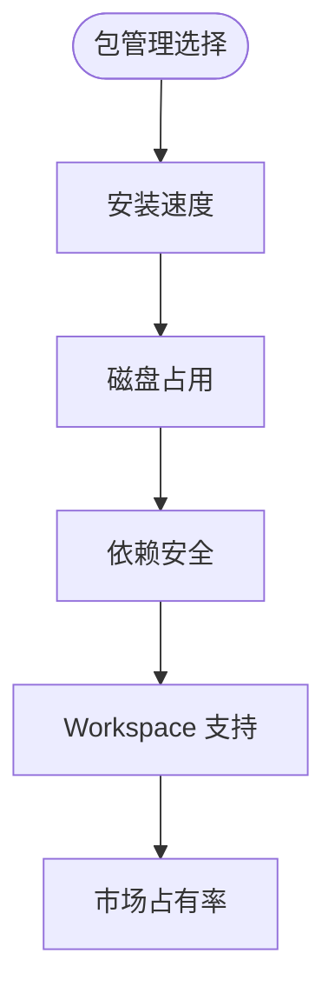

**图表来源**
- [docs/engineering/package-management.md:10-21](file://docs/engineering/package-management.md#L10-L21)
- [docs/engineering/package-management.md:74-97](file://docs/engineering/package-management.md#L74-L97)
- [docs/engineering/package-management.md:118-156](file://docs/engineering/package-management.md#L118-L156)

**章节来源**
- [docs/engineering/package-management.md:8-156](file://docs/engineering/package-management.md#L8-L156)

### 性能优化：加载与渲染双维度
- **加载优化**：压缩（JS/CSS）、Gzip/Brotli、代码分割、路由/组件懒加载、图片优化（格式、懒加载、响应式、CDN）、预加载/预获取、Service Worker 缓存、字体优化（font-display、子集化）。
- **渲染优化**：理解关键渲染路径（DOM/CSSOM → RenderTree → Layout/Paint/Composite）、区分重排与重绘、避免强制同步布局、使用 transform/opacity、GPU 加速、contain 隔离、requestAnimationFrame、长任务拆分、Web Worker、事件委托与防抖节流、内存优化（WeakMap/WeakRef、及时释放引用）。

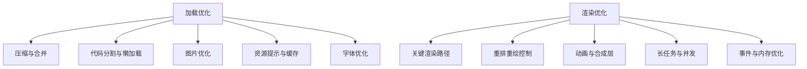

**图表来源**
- [docs/performance/loading-optimization.md:16-575](file://docs/performance/loading-optimization.md#L16-L575)
- [docs/performance/rendering-optimization.md:16-747](file://docs/performance/rendering-optimization.md#L16-L747)

**章节来源**
- [docs/performance/loading-optimization.md:16-575](file://docs/performance/loading-optimization.md#L16-L575)
- [docs/performance/rendering-optimization.md:16-747](file://docs/performance/rendering-optimization.md#L16-L747)

### 样式与主题：现代化文档界面
- **CSS 变量**：统一主色、阴影、字体、行高、间距等。
- **暗色主题**：通过 data-theme 切换，适配导航栏、卡片、表格、标签等组件。
- **动画与交互**：入场动画、悬停效果、滚动条美化、打印样式优化。
- **页面级样式**：首页横幅、统计卡片、技术栈网格、CTA 区域等。

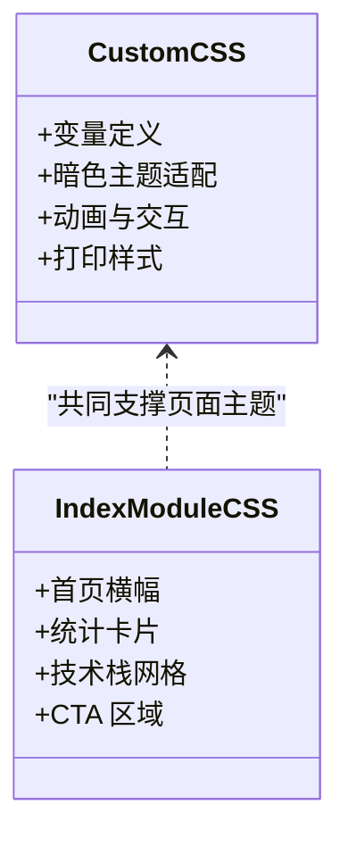

**图表来源**
- [src/css/custom.css:6-33](file://src/css/custom.css#L6-L33)
- [src/pages/index.module.css:1-200](file://src/pages/index.module.css#L1-L200)

**章节来源**
- [src/css/custom.css:1-200](file://src/css/custom.css#L1-L200)
- [src/pages/index.module.css:1-200](file://src/pages/index.module.css#L1-L200)

## 依赖关系分析
- **运行时依赖**：@docusaurus/core、@docusaurus/preset-classic、react、react-dom、prism-react-renderer、clsx 等。
- **开发依赖**：@docusaurus/module-type-aliases、@docusaurus/tsconfig、@docusaurus/types、typescript、@types/react。
- **浏览器兼容**：browserslist 配置生产与开发环境目标。
- **类型检查**：tsconfig 继承 @docusaurus/tsconfig 并启用严格模式。
- **新增工程化依赖**：Docker 相关工具、Git 工具链、Monorepo 管理工具、包管理工具。

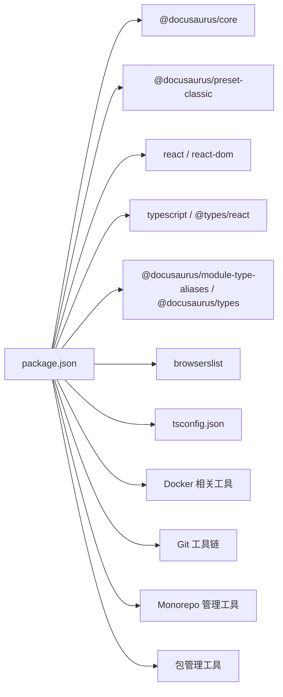

**图表来源**
- [package.json:17-33](file://package.json#L17-L33)
- [package.json:34-48](file://package.json#L34-L48)
- [tsconfig.json:4-12](file://tsconfig.json#L4-L12)

**章节来源**
- [package.json:17-48](file://package.json#L17-L48)
- [tsconfig.json:1-13](file://tsconfig.json#L1-L13)

## 性能考量
- **构建阶段**
  - 选择 Vite 以获得更快的开发体验；复杂项目仍可用 Webpack 的生态优势。
  - 启用 Tree Shaking 与 ESM 导出，配合 package.json 的副作用标记。
  - 使用 SplitChunks 与路由/组件懒加载，减少首屏体积。
  - 生产构建开启压缩（JS/CSS）与传输压缩（Gzip/Brotli）。
- **容器化阶段**
  - 使用多阶段构建减小镜像体积，构建工具不进入最终镜像。
  - 合理选择基础镜像（Alpine、distroless），利用构建缓存层。
  - Nginx 配置静态资源缓存和 Gzip 压缩。
- **代码规范阶段**
  - ESLint + Prettier + Husky 提交前检查，保证代码质量一致性。
  - Git Flow 工作流，确保代码审查和版本管理规范。
- **Monorepo 阶段**
  - pnpm workspace 管理包依赖，避免幽灵依赖问题。
  - Turborepo 增量构建，提升构建效率。
- **运行阶段**
  - 首屏优化：内联关键 CSS、预加载关键资源、图片懒加载与响应式、Service Worker 缓存。
  - 渲染优化：避免重排重绘、使用 transform/opacity、GPU 加速、contain 隔离、requestAnimationFrame。
  - 长任务与并发：时间切片、Web Worker、事件委托与防抖节流。
  - 内存优化：WeakMap/WeakRef、及时释放引用、清理事件监听器与定时器。

**章节来源**
- [docs/engineering/bundler.md:73-103](file://docs/engineering/bundler.md#L73-L103)
- [docs/engineering/docker.md:128-167](file://docs/engineering/docker.md#L128-L167)
- [docs/engineering/git-workflow.md:119-139](file://docs/engineering/git-workflow.md#L119-L139)
- [docs/engineering/monorepo.md:60-102](file://docs/engineering/monorepo.md#L60-L102)
- [docs/performance/loading-optimization.md:16-575](file://docs/performance/loading-optimization.md#L16-L575)
- [docs/performance/rendering-optimization.md:16-747](file://docs/performance/rendering-optimization.md#L16-L747)

## 故障排查指南
- **构建失败**
  - 检查 Node.js 版本是否满足 engines 要求。
  - 使用 npm ci 替代 npm install，确保依赖一致性。
  - 类型错误：运行 typecheck，修正 tsconfig 严格模式相关问题。
- **CI/CD 失败**
  - 确认 Secrets 是否正确配置（Vercel 令牌、组织 ID、项目 ID）。
  - 缓存命中问题：确认缓存 key 与 package-lock.json 哈希一致。
  - 权限问题：确保 Actions 工作流权限允许部署。
- **容器化问题**
  - 镜像构建失败：检查 Dockerfile 语法和依赖安装步骤。
  - 多阶段构建问题：确认构建缓存层顺序和文件复制策略。
  - Compose 编排问题：检查服务依赖关系和网络配置。
- **代码规范问题**
  - ESLint 报错：检查配置文件语法和规则设置。
  - Git Hooks 失败：确认 Husky 初始化和 lint-staged 配置。
  - 提交规范问题：遵循 Conventional Commits 规范。
- **Monorepo 问题**
  - 依赖解析失败：检查 pnpm workspace 配置和包引用语法。
  - Turborepo 缓存问题：清理缓存目录并重新构建。
  - 包发布问题：确认版本号和发布配置。
- **性能退化**
  - 首屏加载慢：检查是否遗漏关键 CSS 内联、图片格式是否合适、是否存在不必要的第三方库。
  - 渲染卡顿：排查强制同步布局、长任务、重排重绘频繁的样式变更。
  - 内存泄漏：检查事件监听器、定时器、闭包引用是否及时清理。

**章节来源**
- [package.json:46-48](file://package.json#L46-L48)
- [docs/engineering/cicd.md:82-101](file://docs/engineering/cicd.md#L82-L101)
- [docs/engineering/docker.md:169-191](file://docs/engineering/docker.md#L169-L191)
- [docs/engineering/git-workflow.md:166-196](file://docs/engineering/git-workflow.md#L166-L196)
- [docs/engineering/monorepo.md:138-164](file://docs/engineering/monorepo.md#L138-L164)
- [docs/performance/rendering-optimization.md:501-596](file://docs/performance/rendering-optimization.md#L501-L596)

## 结论
本工程化实践文档以 Docusaurus 文档站点为载体，系统阐述了构建工具选型、CI/CD 流水线设计、容器化部署、代码规范、包管理和性能优化策略。通过合理选择构建工具、规范 CI/CD 流程、落实加载与渲染优化、采用 Docker 容器化、建立 Git 工作流程、实施 Monorepo 管理和优化包管理策略，可显著提升开发体验与产品性能。建议在团队内形成标准化的工程规范与检查清单，持续迭代与优化。

## 附录
- **常用命令**
  - 启动本地开发：yarn start
  - 生成构建产物：yarn build
  - 类型检查：yarn typecheck
  - 部署（SSH/GitHub 用户名）：yarn deploy
  - Docker 构建：docker build -t app:latest .
  - Git 工作流：git checkout -b feature/name
  - Monorepo 管理：pnpm -r run build
  - 包管理：pnpm add lodash
- **参考资源**
  - Web.dev 性能优化指南
  - MDN 性能优化
  - Google PageSpeed Insights
  - Lighthouse 文档
  - Rendering Performance（web.dev）
  - Docker 官方文档
  - Git 工作流最佳实践
  - Monorepo 管理指南
  - 包管理工具对比分析