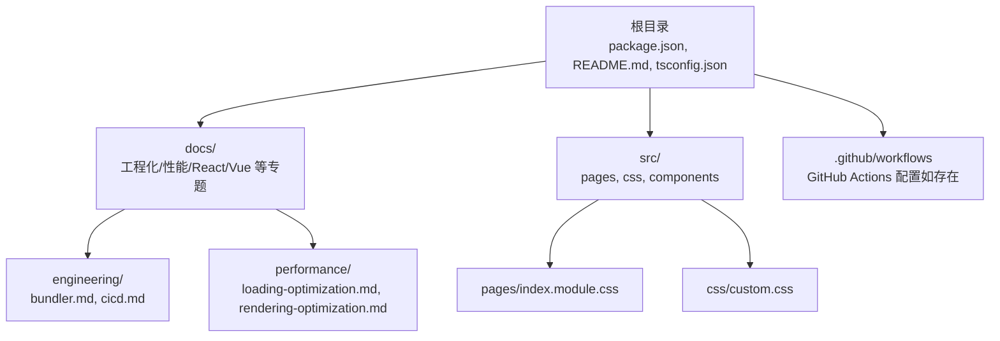
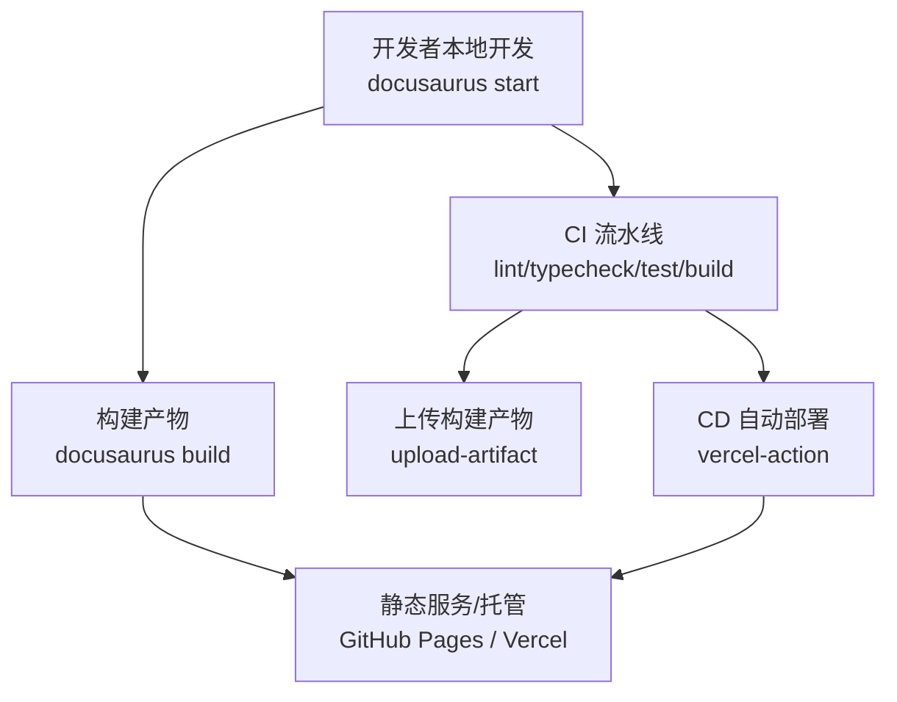
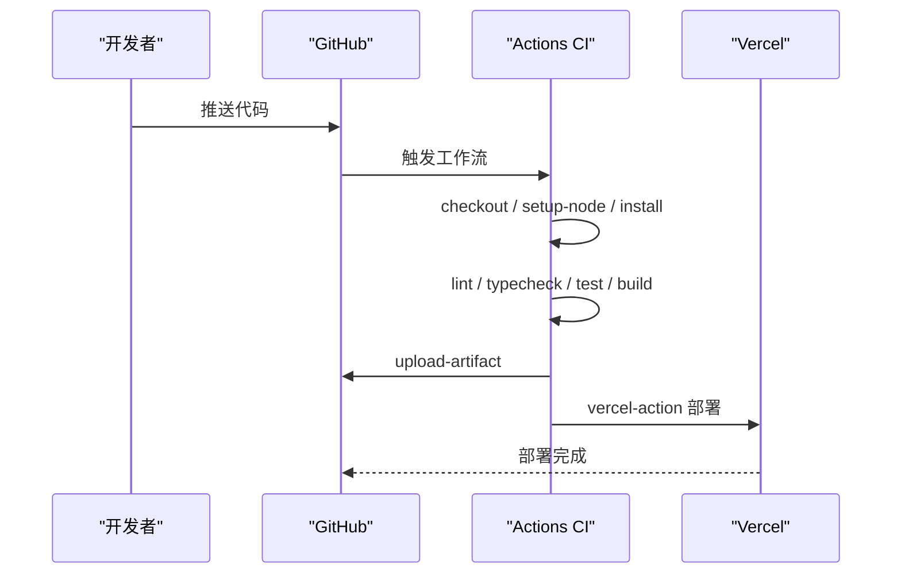
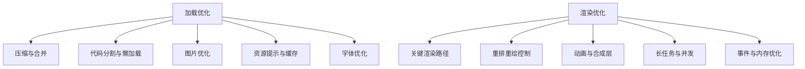
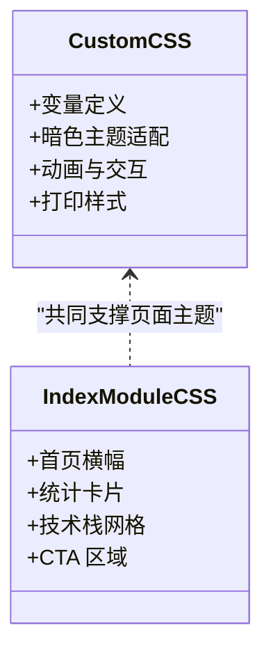
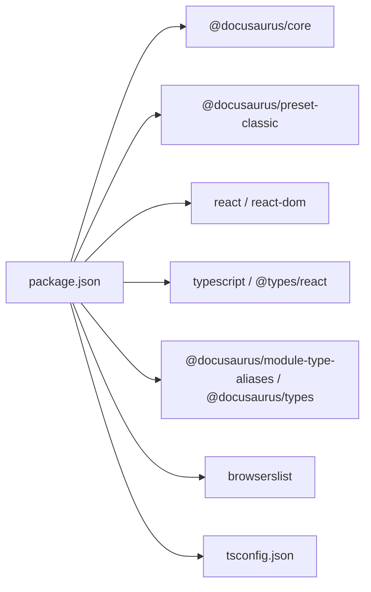

# 工程化实践

<cite>
**本文引用的文件**
- [README.md](file://README.md)
- [package.json](file://package.json)
- [tsconfig.json](file://tsconfig.json)
- [docs/engineering/index.md](file://docs/engineering/index.md)
- [docs/engineering/bundler.md](file://docs/engineering/bundler.md)
- [docs/engineering/cicd.md](file://docs/engineering/cicd.md)
- [docs/performance/loading-optimization.md](file://docs/performance/loading-optimization.md)
- [docs/performance/rendering-optimization.md](file://docs/performance/rendering-optimization.md)
- [src/pages/index.module.css](file://src/pages/index.module.css)
- [src/css/custom.css](file://src/css/custom.css)
</cite>

## 目录
1. [简介](#简介)
2. [项目结构](#项目结构)
3. [核心组件](#核心组件)
4. [架构总览](#架构总览)
5. [详细组件分析](#详细组件分析)
6. [依赖关系分析](#依赖关系分析)
7. [性能考量](#性能考量)
8. [故障排查指南](#故障排查指南)
9. [结论](#结论)
10. [附录](#附录)

## 简介
本技术文档围绕前端工程化实践展开，系统梳理构建工具、CI/CD 流程与性能监控的关键要点，并结合仓库中的 Docusaurus 文档站点实现，给出可落地的配置思路与优化策略。读者将获得从开发体验、构建效率、质量保障到性能优化的完整工程化体系认知。

## 项目结构
该仓库是一个基于 Docusaurus 的静态站点，文档内容集中在 docs 目录，样式与页面位于 src 目录，根目录包含构建与部署脚本、类型检查配置等。

**图表来源**
- [package.json:1-50](file://package.json#L1-L50)
- [docs/engineering/index.md:1-16](file://docs/engineering/index.md#L1-L16)
- [docs/engineering/bundler.md:1-103](file://docs/engineering/bundler.md#L1-L103)
- [docs/engineering/cicd.md:1-101](file://docs/engineering/cicd.md#L1-L101)
- [docs/performance/loading-optimization.md:1-575](file://docs/performance/loading-optimization.md#L1-L575)
- [docs/performance/rendering-optimization.md:1-747](file://docs/performance/rendering-optimization.md#L1-L747)
- [src/pages/index.module.css:1-438](file://src/pages/index.module.css#L1-L438)
- [src/css/custom.css:1-644](file://src/css/custom.css#L1-L644)

**章节来源**
- [README.md:1-42](file://README.md#L1-L42)
- [package.json:1-50](file://package.json#L1-L50)
- [tsconfig.json:1-13](file://tsconfig.json#L1-L13)

## 核心组件
- 构建与开发工具链：Docusaurus 3.x、TypeScript、Browserslist
- 文档工程化：工程化专题（构建工具、CI/CD）、性能优化专题（加载与渲染）
- 样式与主题：自定义 CSS 变量、暗色主题适配、动画与交互增强
- 部署与运维：本地开发、构建、部署命令；可对接 GitHub Pages 或 Vercel

**章节来源**
- [package.json:17-33](file://package.json#L17-L33)
- [package.json:34-48](file://package.json#L34-L48)
- [docs/engineering/index.md:7-16](file://docs/engineering/index.md#L7-L16)
- [docs/performance/loading-optimization.md:10-575](file://docs/performance/loading-optimization.md#L10-L575)
- [docs/performance/rendering-optimization.md:10-747](file://docs/performance/rendering-optimization.md#L10-L747)
- [src/css/custom.css:6-33](file://src/css/custom.css#L6-L33)

## 架构总览
下图展示从开发到部署的整体流程，涵盖本地开发、构建、测试与部署各环节。

**图表来源**
- [README.md:11-25](file://README.md#L11-L25)
- [docs/engineering/cicd.md:12-55](file://docs/engineering/cicd.md#L12-L55)
- [docs/engineering/cicd.md:59-80](file://docs/engineering/cicd.md#L59-L80)

## 详细组件分析

### 构建工具：Webpack 与 Vite 对比与实践
- 开发体验差异：Vite 基于原生 ESM，按需编译，冷启动更快；Webpack 需全量打包。
- 生产构建：Vite 使用 Rollup；Webpack 自带优化能力（SplitChunks、Tree Shaking）。
- Tree Shaking 要求：ESM 导出、package.json 标记副作用或白名单。
- 代码分割：通过 SplitChunks、路由懒加载、组件懒加载降低首屏体积。
- 长效缓存：Content Hash 与文件名指纹提升缓存命中率。

**图表来源**
- [docs/engineering/bundler.md:10-103](file://docs/engineering/bundler.md#L10-L103)

**章节来源**
- [docs/engineering/bundler.md:10-103](file://docs/engineering/bundler.md#L10-L103)

### CI/CD 流程：GitHub Actions 与自动部署
- 基础流水线：拉取代码、设置 Node.js、安装依赖、Lint、类型检查、测试、构建、上传制品。
- 自动部署：在主分支推送时触发，使用 vercel-action 部署至 Vercel。
- 缓存优化：缓存 node_modules，提升 CI 速度。
- 安全与一致性：使用 npm ci，Secrets 管理令牌。

**图表来源**
- [docs/engineering/cicd.md:12-55](file://docs/engineering/cicd.md#L12-L55)
- [docs/engineering/cicd.md:59-80](file://docs/engineering/cicd.md#L59-L80)

**章节来源**
- [docs/engineering/cicd.md:10-101](file://docs/engineering/cicd.md#L10-L101)

### 性能优化：加载与渲染双维度
- 加载优化：压缩（JS/CSS）、Gzip/Brotli、代码分割、路由/组件懒加载、图片优化（格式、懒加载、响应式、CDN）、预加载/预获取、Service Worker 缓存、字体优化（font-display、子集化）。
- 渲染优化：理解关键渲染路径（DOM/CSSOM → RenderTree → Layout/Paint/Composite）、区分重排与重绘、避免强制同步布局、使用 transform/opacity、GPU 加速、contain 隔离、requestAnimationFrame、长任务拆分、Web Worker、事件委托与防抖节流、内存优化（WeakMap/WeakRef、及时释放引用）。

**图表来源**
- [docs/performance/loading-optimization.md:16-575](file://docs/performance/loading-optimization.md#L16-L575)
- [docs/performance/rendering-optimization.md:16-747](file://docs/performance/rendering-optimization.md#L16-L747)

**章节来源**
- [docs/performance/loading-optimization.md:16-575](file://docs/performance/loading-optimization.md#L16-L575)
- [docs/performance/rendering-optimization.md:16-747](file://docs/performance/rendering-optimization.md#L16-L747)

### 样式与主题：现代化文档界面
- CSS 变量：统一主色、阴影、字体、行高、间距等。
- 暗色主题：通过 data-theme 切换，适配导航栏、卡片、表格、标签等组件。
- 动画与交互：入场动画、悬停效果、滚动条美化、打印样式优化。
- 页面级样式：首页横幅、统计卡片、技术栈网格、CTA 区域等。

**图表来源**
- [src/css/custom.css:6-33](file://src/css/custom.css#L6-L33)
- [src/pages/index.module.css:1-438](file://src/pages/index.module.css#L1-L438)

**章节来源**
- [src/css/custom.css:1-644](file://src/css/custom.css#L1-L644)
- [src/pages/index.module.css:1-438](file://src/pages/index.module.css#L1-L438)

## 依赖关系分析
- 运行时依赖：@docusaurus/core、@docusaurus/preset-classic、react、react-dom、prism-react-renderer、clsx 等。
- 开发依赖：@docusaurus/module-type-aliases、@docusaurus/tsconfig、@docusaurus/types、typescript、@types/react。
- 浏览器兼容：browserslist 配置生产与开发环境目标。
- 类型检查：tsconfig 继承 @docusaurus/tsconfig 并启用严格模式。

**图表来源**
- [package.json:17-33](file://package.json#L17-L33)
- [package.json:34-48](file://package.json#L34-L48)
- [tsconfig.json:4-12](file://tsconfig.json#L4-L12)

**章节来源**
- [package.json:17-48](file://package.json#L17-L48)
- [tsconfig.json:1-13](file://tsconfig.json#L1-L13)

## 性能考量
- 构建阶段
  - 选择 Vite 以获得更快的开发体验；复杂项目仍可用 Webpack 的生态优势。
  - 启用 Tree Shaking 与 ESM 导出，配合 package.json 的副作用标记。
  - 使用 SplitChunks 与路由/组件懒加载，减少首屏体积。
  - 生产构建开启压缩（JS/CSS）与传输压缩（Gzip/Brotli）。
- 运行阶段
  - 首屏优化：内联关键 CSS、预加载关键资源、图片懒加载与响应式、Service Worker 缓存。
  - 渲染优化：避免重排重绘、使用 transform/opacity、GPU 加速、contain 隔离、requestAnimationFrame。
  - 长任务与并发：时间切片、Web Worker、事件委托与防抖节流。
  - 内存优化：WeakMap/WeakRef、及时释放引用、清理事件监听器与定时器。

**章节来源**
- [docs/engineering/bundler.md:73-103](file://docs/engineering/bundler.md#L73-L103)
- [docs/performance/loading-optimization.md:16-575](file://docs/performance/loading-optimization.md#L16-L575)
- [docs/performance/rendering-optimization.md:16-747](file://docs/performance/rendering-optimization.md#L16-L747)

## 故障排查指南
- 构建失败
  - 检查 Node.js 版本是否满足 engines 要求。
  - 使用 npm ci 替代 npm install，确保依赖一致性。
  - 类型错误：运行 typecheck，修正 tsconfig 严格模式相关问题。
- CI/CD 失败
  - 确认 Secrets 是否正确配置（Vercel 令牌、组织 ID、项目 ID）。
  - 缓存命中问题：确认缓存 key 与 package-lock.json 哈希一致。
  - 权限问题：确保 Actions 工作流权限允许部署。
- 性能退化
  - 首屏加载慢：检查是否遗漏关键 CSS 内联、图片格式是否合适、是否存在不必要的第三方库。
  - 渲染卡顿：排查强制同步布局、长任务、重排重绘频繁的样式变更。
  - 内存泄漏：检查事件监听器、定时器、闭包引用是否及时清理。

**章节来源**
- [package.json:46-48](file://package.json#L46-L48)
- [docs/engineering/cicd.md:82-101](file://docs/engineering/cicd.md#L82-L101)
- [docs/performance/rendering-optimization.md:501-596](file://docs/performance/rendering-optimization.md#L501-L596)

## 结论
本工程化实践文档以 Docusaurus 文档站点为载体，系统阐述了构建工具选型、CI/CD 流水线设计与性能优化策略。通过合理选择构建工具、规范 CI/CD 流程、落实加载与渲染优化，可显著提升开发体验与产品性能。建议在团队内形成标准化的工程规范与检查清单，持续迭代与优化。

## 附录
- 常用命令
  - 启动本地开发：yarn start
  - 生成构建产物：yarn build
  - 类型检查：yarn typecheck
  - 部署（SSH/GitHub 用户名）：yarn deploy
- 参考资源
  - Web.dev 性能优化指南
  - MDN 性能优化
  - Google PageSpeed Insights
  - Lighthouse 文档
  - Rendering Performance（web.dev）