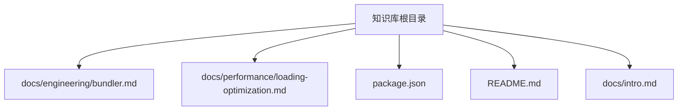
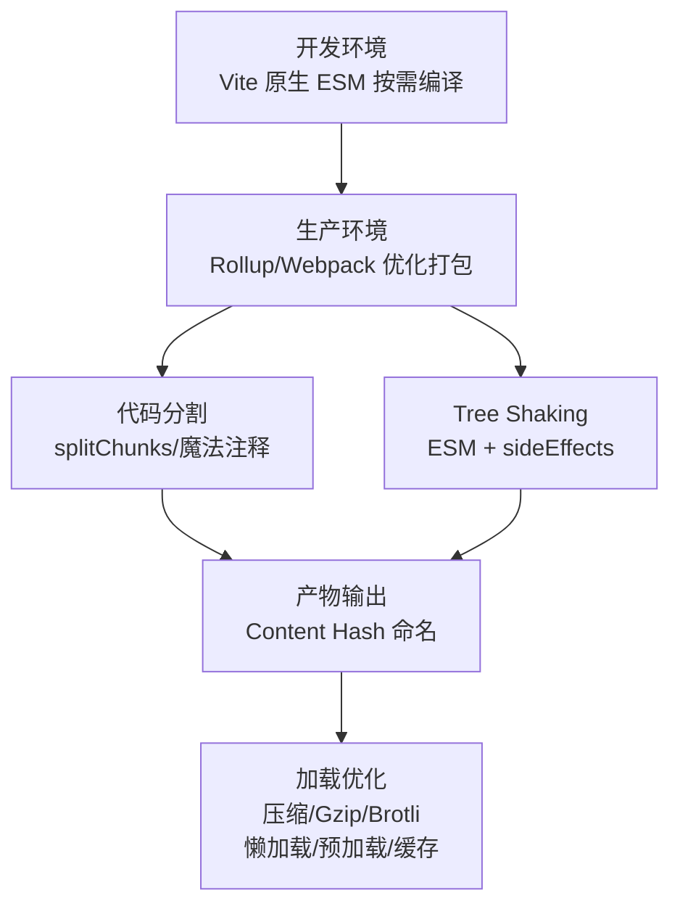
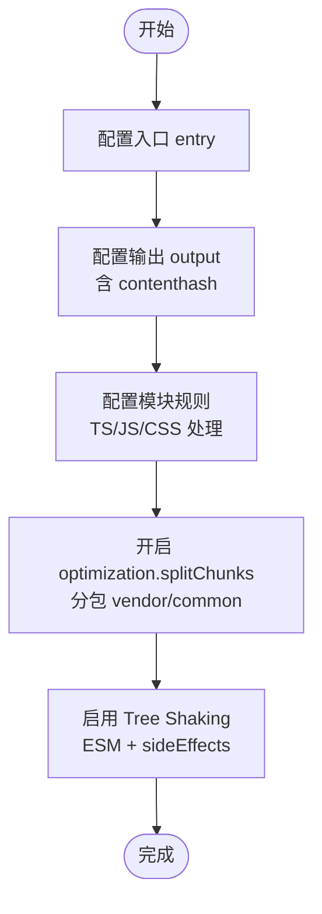
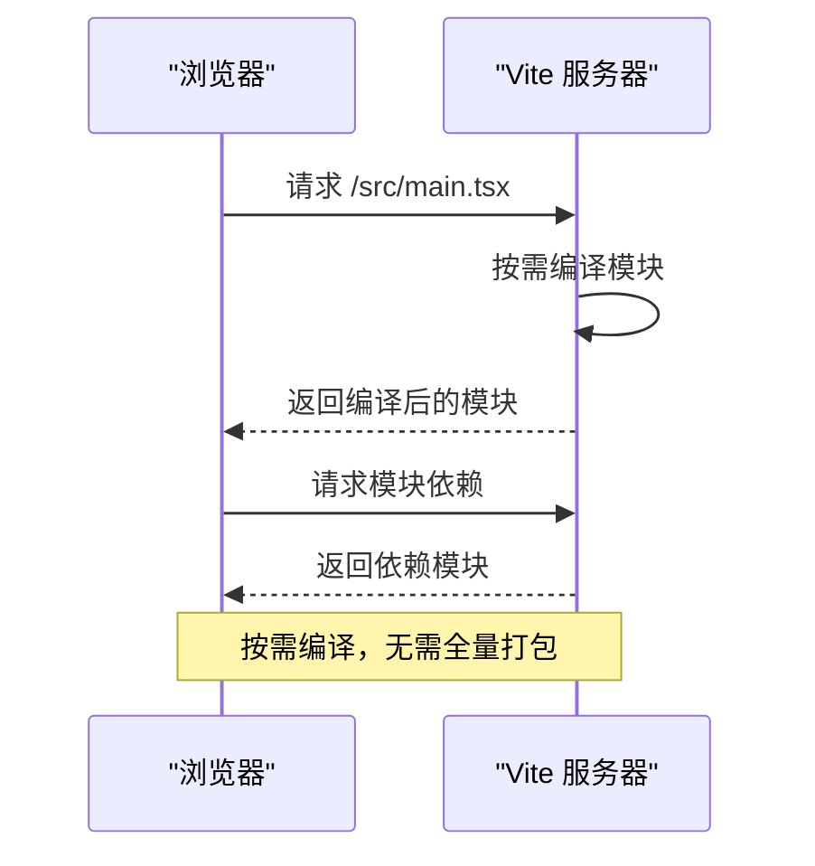
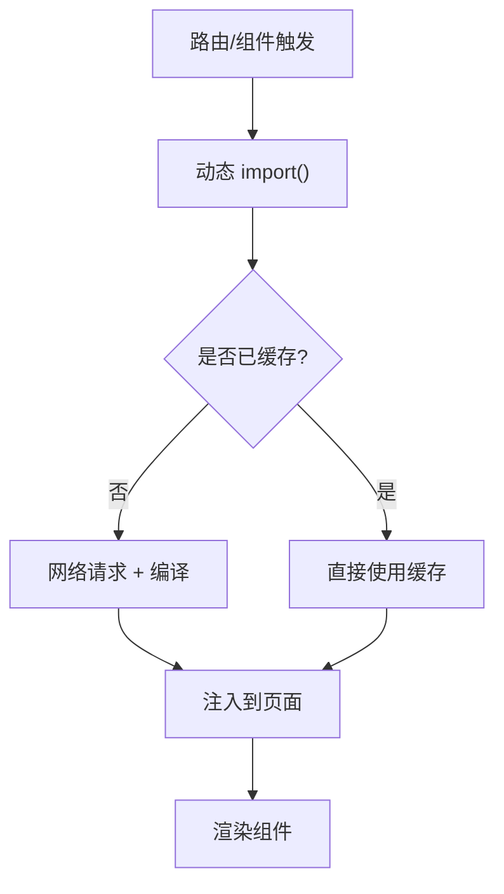
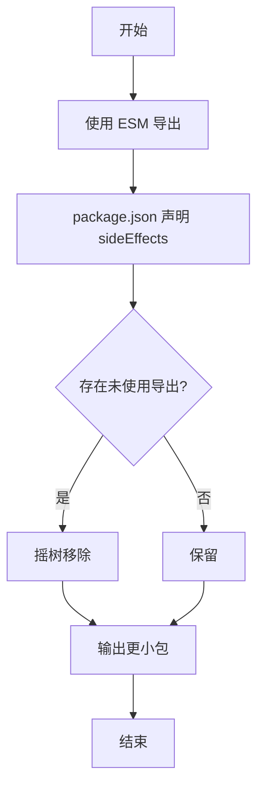
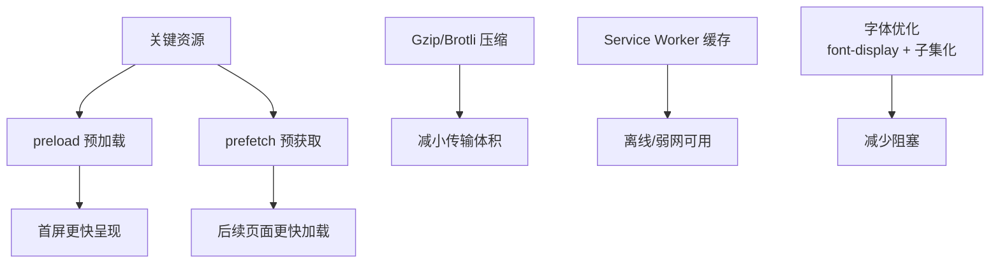
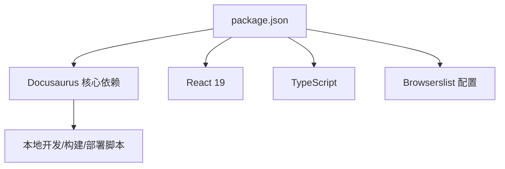

# 构建工具配置

<cite>
**本文引用的文件**
- [bundler.md](file://docs/engineering/bundler.md)
- [loading-optimization.md](file://docs/performance/loading-optimization.md)
- [package.json](file://package.json)
- [README.md](file://README.md)
- [intro.md](file://docs/intro.md)
</cite>

## 目录
1. [简介](#简介)
2. [项目结构](#项目结构)
3. [核心组件](#核心组件)
4. [架构总览](#架构总览)
5. [详细组件分析](#详细组件分析)
6. [依赖关系分析](#依赖关系分析)
7. [性能考量](#性能考量)
8. [故障排查指南](#故障排查指南)
9. [结论](#结论)
10. [附录](#附录)

## 简介
本文件围绕构建工具配置展开，聚焦于 Webpack 与 Vite 的核心概念、配置方法与优化策略，结合仓库中的工程化与性能优化文档，给出可操作的配置要点、工作原理、打包流程、性能优化技巧与常见问题的解决方案。目标是帮助开发者在实际项目中选择合适的构建工具并进行高效配置。

## 项目结构
该知识库采用 Docusaurus 静态站点生成器，工程化与性能优化相关内容分别位于 docs/engineering 与 docs/performance 下。构建工具配置主题主要来自“工程化”与“加载性能优化”两篇文档；同时，根目录的 package.json 描述了运行脚本与依赖生态，README.md 提供了本地开发与构建命令。

**图示来源**
- [bundler.md:1-103](file://docs/engineering/bundler.md#L1-L103)
- [loading-optimization.md:1-575](file://docs/performance/loading-optimization.md#L1-L575)
- [package.json:1-50](file://package.json#L1-L50)
- [README.md:1-42](file://README.md#L1-L42)
- [intro.md:1-35](file://docs/intro.md#L1-L35)

**章节来源**
- [package.json:1-50](file://package.json#L1-L50)
- [README.md:1-42](file://README.md#L1-L42)
- [intro.md:1-35](file://docs/intro.md#L1-L35)

## 核心组件
- 构建工具对比与选型：仓库提供了 Webpack 与 Vite 的特性对比，强调 Vite 在开发体验与热更新方面的优势，以及 Webpack 在复杂项目中的生态成熟度。
- Webpack 核心配置：包含入口、输出、模块规则、优化（代码分割）等关键配置片段路径，便于直接定位到具体配置位置。
- Tree Shaking：强调使用 ESM 语法与 package.json 的 sideEffects 配置以启用摇树优化。
- 加载性能优化：涵盖压缩、Gzip/Brotli、代码分割、路由/组件懒加载、预加载与预获取、Service Worker 缓存、字体优化等，形成完整的加载性能优化体系。

**章节来源**
- [bundler.md:10-102](file://docs/engineering/bundler.md#L10-L102)
- [loading-optimization.md:16-575](file://docs/performance/loading-optimization.md#L16-L575)

## 架构总览
下图展示了从开发到生产的典型构建流程，映射到仓库中的配置与优化思路：开发阶段利用 Vite 的原生 ESM 按需编译；生产阶段通过 Rollup（Vite）或 Webpack 的优化能力进行打包与分包；同时配合压缩、缓存与懒加载策略提升加载性能。

**图示来源**
- [bundler.md:10-102](file://docs/engineering/bundler.md#L10-L102)
- [loading-optimization.md:96-575](file://docs/performance/loading-optimization.md#L96-L575)

## 详细组件分析

### Webpack 核心配置与优化
- 入口与输出：定义入口文件与输出目录、文件命名（含 contenthash 以实现长效缓存）。
- 模块规则：针对 TS/JS 与 CSS 的 loader 配置，体现多语言与样式的统一处理。
- 优化策略：通过 splitChunks 对第三方库与公共模块进行分包，降低重复与首屏体积。
- Tree Shaking：要求使用 ESM 并在 package.json 中正确声明 sideEffects，确保死代码被移除。

**图示来源**
- [bundler.md:35-71](file://docs/engineering/bundler.md#L35-L71)

**章节来源**
- [bundler.md:35-71](file://docs/engineering/bundler.md#L35-L71)

### Vite 原理与开发体验
- 原理：开发阶段利用浏览器原生 ESM，拦截请求并按需编译，避免全量打包，显著提升冷启动与热更新速度。
- 适用场景：新项目优先考虑 Vite，以获得更好的开发体验与更快的迭代效率。

**图示来源**
- [bundler.md:20-33](file://docs/engineering/bundler.md#L20-L33)

**章节来源**
- [bundler.md:20-33](file://docs/engineering/bundler.md#L20-L33)

### 代码分割与懒加载
- Webpack 代码分割：通过 splitChunks 的 cacheGroups 对第三方库与公共模块进行分包，提升缓存命中与复用。
- 路由懒加载：在 React 与 Vue 中分别展示路由懒加载的实现方式，结合 Suspense 与动态 import。
- 组件懒加载：在需要时再加载重型组件，减少初始包体与首屏等待。

**图示来源**
- [loading-optimization.md:116-190](file://docs/performance/loading-optimization.md#L116-L190)

**章节来源**
- [loading-optimization.md:96-190](file://docs/performance/loading-optimization.md#L96-L190)

### Tree Shaking 配置与实践
- ESM 导出：使用具名导出而非默认导出，确保摇树识别。
- sideEffects：全局关闭或精确声明副作用文件，避免误删有副作用的代码。
- 实践建议：在模块层面保持纯函数与无副作用设计，最大化摇树收益。

**图示来源**
- [bundler.md:73-94](file://docs/engineering/bundler.md#L73-L94)

**章节来源**
- [bundler.md:73-94](file://docs/engineering/bundler.md#L73-L94)

### 加载性能优化策略
- 压缩与传输：生产环境启用 Gzip/Brotli 压缩，显著降低传输体积。
- 预加载与预获取：通过资源提示提前建立连接与加载关键资源，缩短首屏时间。
- Service Worker 缓存：离线与弱网环境下提升访问稳定性与速度。
- 字体优化：使用 font-display swap 与字体子集化，平衡可读性与加载速度。

**图示来源**
- [loading-optimization.md:350-425](file://docs/performance/loading-optimization.md#L350-L425)

**章节来源**
- [loading-optimization.md:72-93](file://docs/performance/loading-optimization.md#L72-L93)
- [loading-optimization.md:350-425](file://docs/performance/loading-optimization.md#L350-L425)
- [loading-optimization.md:429-462](file://docs/performance/loading-optimization.md#L429-L462)

## 依赖关系分析
- 运行时与脚本：仓库使用 Docusaurus 作为静态站点生成器，提供本地开发、构建与部署脚本；Node 版本要求较高，确保现代工具链稳定运行。
- 依赖生态：React 19 与 Docusaurus 3.x 为核心依赖，配合 TypeScript 与相关类型定义，支撑文档与示例的开发与校验。

**图示来源**
- [package.json:17-49](file://package.json#L17-L49)

**章节来源**
- [package.json:1-50](file://package.json#L1-L50)
- [README.md:5-25](file://README.md#L5-L25)

## 性能考量
- 开发体验：Vite 的原生 ESM 按需编译带来更快的冷启动与热更新，适合新项目与快速迭代。
- 生产优化：结合代码分割、Tree Shaking、压缩与缓存策略，显著降低首屏加载时间与传输体积。
- 选型建议：新项目优先考虑 Vite；若项目涉及复杂生态或特定兼容需求，可评估 Webpack 的成熟生态与插件覆盖。

**章节来源**
- [bundler.md:10-18](file://docs/engineering/bundler.md#L10-L18)
- [bundler.md:96-102](file://docs/engineering/bundler.md#L96-L102)

## 故障排查指南
- 开发阶段冷启动慢：确认是否使用 Vite 的原生 ESM 按需编译；检查依赖体积与动态导入是否合理。
- 生产包过大：启用 splitChunks 对第三方库与公共模块分包；开启 Tree Shaking 并清理副作用代码；启用 Gzip/Brotli 压缩。
- 首屏加载慢：实施路由/组件懒加载；使用资源预加载与预获取；内联关键 CSS；优化图片与字体加载策略。
- 缓存失效频繁：使用 contenthash 命名输出文件；合理配置强缓存与协商缓存；避免非必要的长缓存破坏。

**章节来源**
- [bundler.md:35-71](file://docs/engineering/bundler.md#L35-L71)
- [loading-optimization.md:96-190](file://docs/performance/loading-optimization.md#L96-L190)
- [loading-optimization.md:350-425](file://docs/performance/loading-optimization.md#L350-L425)

## 结论
本知识库围绕构建工具配置与加载性能优化提供了系统化的指导：以 Vite 的开发体验与 Webpack 的生态成熟度为基础，结合代码分割、Tree Shaking、压缩与缓存等策略，形成从开发到生产的完整优化闭环。建议在新项目中优先采用 Vite，并在复杂场景下结合 Webpack 的深度定制能力，最终实现快速迭代与极致性能的平衡。

## 附录
- 实战参考：可结合仓库中的“加载性能优化”文档，按需引入路由懒加载、组件懒加载、预加载与预获取、Service Worker 缓存等策略，逐步验证优化效果。
- 配置定位：所有配置片段均可通过文档中的“章节来源”快速定位到具体文件与行号，便于复制与修改。

**章节来源**
- [loading-optimization.md:466-512](file://docs/performance/loading-optimization.md#L466-L512)