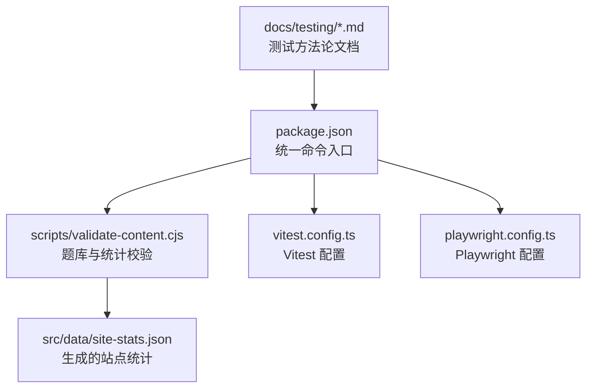
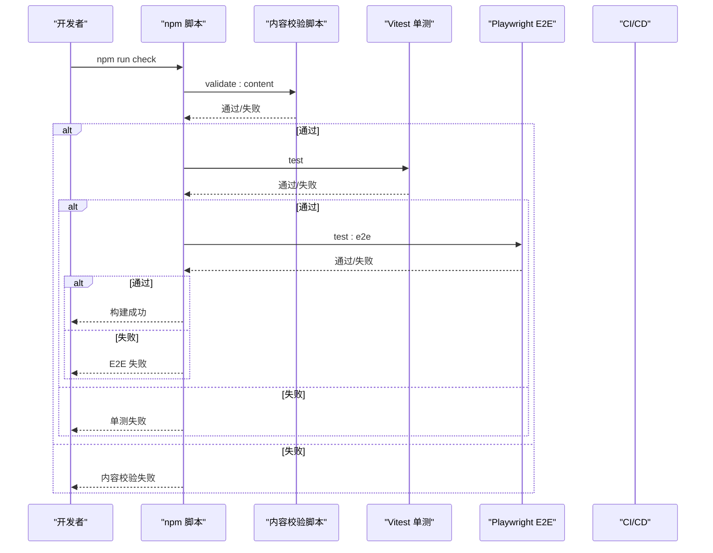
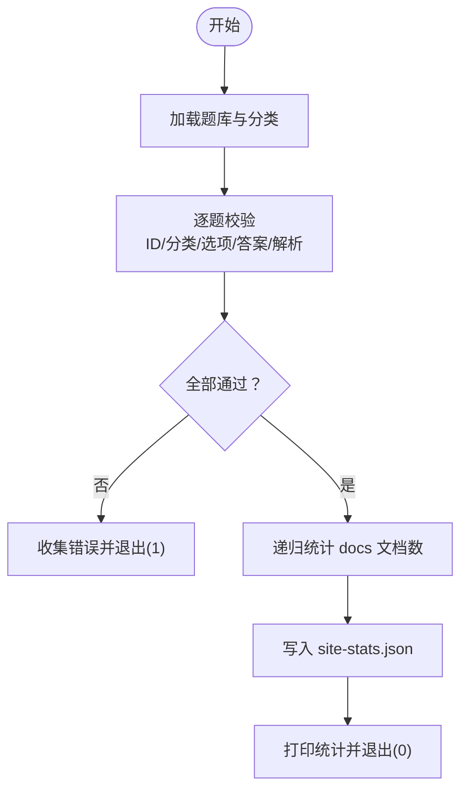
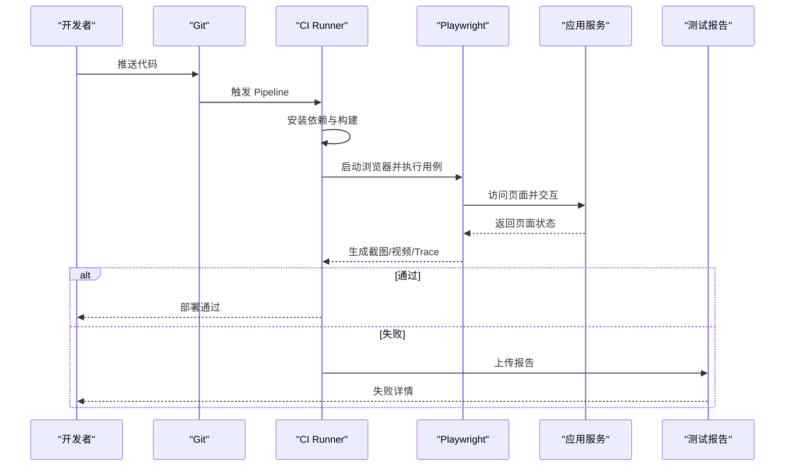
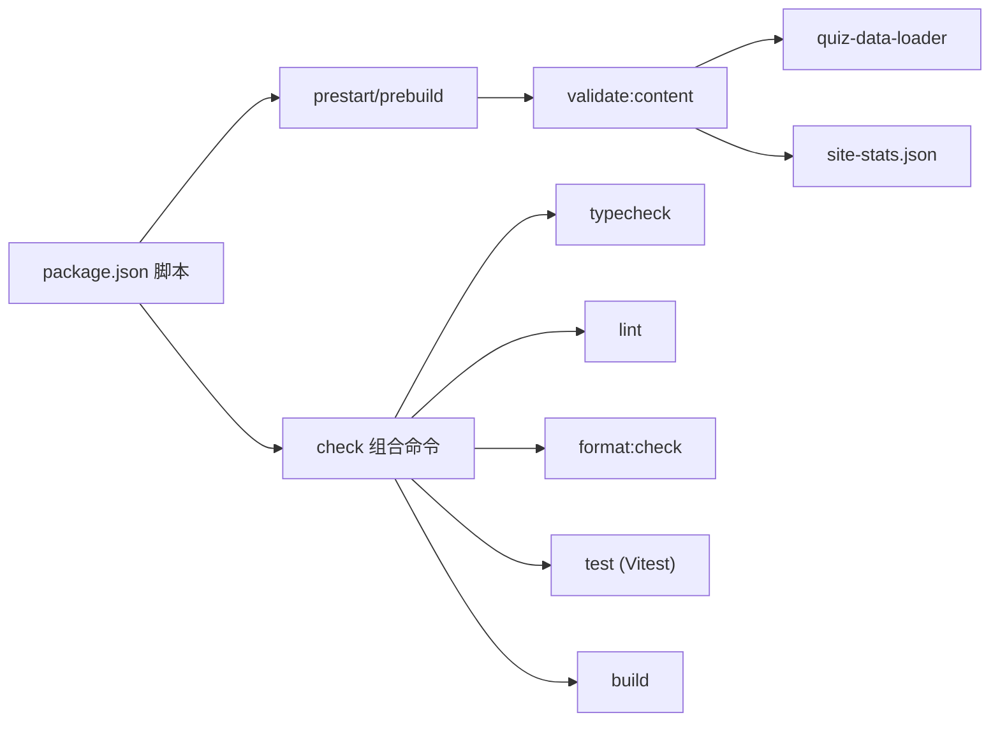

# 测试策略

<cite>
**本文引用的文件**   
- [README.md](file://README.md)
- [package.json](file://package.json)
- [vitest.config.ts](file://vitest.config.ts)
- [playwright.config.ts](file://playwright.config.ts)
- [scripts/validate-content.cjs](file://scripts/validate-content.cjs)
- [scripts/quiz-data-loader.cjs](file://scripts/quiz-data-loader.cjs)
- [docs/testing/unit-testing.md](file://docs/testing/unit-testing.md)
- [docs/testing/react-testing.md](file://docs/testing/react-testing.md)
- [docs/testing/e2e-testing.md](file://docs/testing/e2e-testing.md)
</cite>

## 目录
1. [引言](#引言)
2. [项目结构](#项目结构)
3. [核心组件](#核心组件)
4. [架构总览](#架构总览)
5. [详细组件分析](#详细组件分析)
6. [依赖分析](#依赖分析)
7. [性能考虑](#性能考虑)
8. [故障排查指南](#故障排查指南)
9. [结论](#结论)
10. [附录](#附录)

## 引言
本仓库是一个基于 Docusaurus 的前端面试与 AI 开发知识库，包含大量文档、在线测验与答题历史。为确保内容质量与功能稳定性，项目建立了覆盖“内容校验 + 单元测试 + 端到端测试”的完整测试策略：
- 内容校验：在启动与构建前自动校验题库与统计信息，防止错误数据进入生产。
- 单元测试：使用 Vitest 对可测试逻辑进行快速验证，支持覆盖率门禁。
- 端到端测试：使用 Playwright 模拟真实用户操作，保障关键流程稳定。

## 项目结构
测试相关的关键位置与职责如下：
- docs/testing：测试方法论与最佳实践文档（单元、React 组件、E2E）。
- scripts：内容校验脚本，负责题库合法性检查与站点统计生成。
- vitest.config.ts / playwright.config.ts：单测与 E2E 运行配置。
- package.json：统一入口命令，串联校验、类型检查、Lint、格式化、单测与构建。
- README.md：面向贡献者的使用说明与命令清单。

图表来源
- [package.json:1-67](file://package.json#L1-L67)
- [scripts/validate-content.cjs:1-55](file://scripts/validate-content.cjs#L1-L55)
- [vitest.config.ts:1-18](file://vitest.config.ts#L1-L18)
- [playwright.config.ts:1-15](file://playwright.config.ts#L1-L15)

章节来源
- [README.md:1-88](file://README.md#L1-L88)
- [package.json:1-67](file://package.json#L1-L67)

## 核心组件
- 内容校验器（validate-content）
  - 职责：校验题目 ID 唯一性、分类合法、选项值不重复、答案有效、解析非空、分类计数与实际一致；扫描 docs 目录统计文档数量并写入 site-stats.json。
  - 触发时机：prestart/prebuild 钩子，确保本地开发与构建前必过。
- 单元测试（Vitest）
  - 职责：对 src/utils 等可测试逻辑进行断言，支持覆盖率阈值与 HMR 加速。
  - 入口：npm test 执行 run 模式。
- 端到端测试（Playwright）
  - 职责：在真实浏览器中验证关键业务流程，支持多浏览器并行、失败截图/录屏、Trace 回放。
  - 入口：npm run test:e2e。

章节来源
- [scripts/validate-content.cjs:1-55](file://scripts/validate-content.cjs#L1-L55)
- [scripts/quiz-data-loader.cjs:1-16](file://scripts/quiz-data-loader.cjs#L1-L16)
- [package.json:1-67](file://package.json#L1-L67)
- [docs/testing/unit-testing.md:1-368](file://docs/testing/unit-testing.md#L1-L368)
- [docs/testing/e2e-testing.md:1-460](file://docs/testing/e2e-testing.md#L1-L460)

## 架构总览
整体测试流水线将“内容质量 + 代码质量 + 行为质量”串联起来，形成从提交到部署的全链路门禁。

图表来源
- [package.json:1-67](file://package.json#L1-L67)
- [scripts/validate-content.cjs:1-55](file://scripts/validate-content.cjs#L1-L55)
- [docs/testing/e2e-testing.md:267-333](file://docs/testing/e2e-testing.md#L267-L333)

## 详细组件分析

### 内容校验器（validate-content）
- 输入
  - 题库数据源：由 quiz-data-loader 动态加载 src/data/quiz-questions.ts。
  - 文档目录：docs/** 下的 Markdown/MDX 文件。
- 处理逻辑
  - 遍历题目集合，校验 ID 唯一、分类存在、问题与解析非空、选项值唯一、答案有效、题型与答案结构匹配。
  - 遍历分类集合，校验每个分类至少有一题且 count 与实际数量一致。
  - 递归统计 docs 下文档数，输出 { documents, questions, categories } 至 src/data/site-stats.json。
- 输出
  - 成功：打印统计摘要并返回 0。
  - 失败：打印所有错误并退出码 1，阻断后续步骤。

图表来源
- [scripts/validate-content.cjs:1-55](file://scripts/validate-content.cjs#L1-L55)
- [scripts/quiz-data-loader.cjs:1-16](file://scripts/quiz-data-loader.cjs#L1-L16)

章节来源
- [scripts/validate-content.cjs:1-55](file://scripts/validate-content.cjs#L1-L55)
- [scripts/quiz-data-loader.cjs:1-16](file://scripts/quiz-data-loader.cjs#L1-L16)

### 单元测试（Vitest）
- 目标
  - 对 src/utils 等纯函数或可隔离逻辑进行快速验证。
  - 结合覆盖率阈值，保证新增/修改代码具备足够覆盖。
- 关键能力
  - 兼容 Jest API，便于迁移与复用现有用例。
  - 原生 ESM、HMR 加速，提升开发体验。
  - 可通过 coverage.thresholds 设置分支、函数、行、语句门槛。
- 建议
  - 优先为业务核心路径编写用例，采用 AAA 模式组织。
  - 对外部依赖使用 Mock/Stub/Spy，避免耦合实现细节。

章节来源
- [docs/testing/unit-testing.md:1-368](file://docs/testing/unit-testing.md#L1-L368)
- [package.json:1-67](file://package.json#L1-L67)

### React 组件测试（RTL + userEvent）
- 原则
  - 以用户视角编写测试，关注可观察行为而非内部状态。
  - 查询优先级：无障碍查询 > 语义查询 > data-testid。
- 场景
  - 渲染测试：断言初始 UI 结构与属性。
  - 事件测试：使用 userEvent 模拟点击、输入、提交等交互。
  - 异步测试：使用 findBy/waitFor 等待网络或副作用完成。
  - Hook 测试：renderHook 验证返回值与副作用。
- 网络层 Mock
  - 推荐 MSW 拦截请求，保持与真实网络层一致，降低测试与实现耦合。

章节来源
- [docs/testing/react-testing.md:1-396](file://docs/testing/react-testing.md#L1-L396)

### 端到端测试（Playwright）
- 目标
  - 在真实浏览器中验证关键用户旅程，提供最高置信度。
- 关键能力
  - 多浏览器并行执行、跨域无限制、失败截图/录屏/Trace。
  - 选择器策略：优先 getByRole/getByLabel，其次文本/图片，最后 data-testid。
  - Page Object 模式封装页面操作，提高复用性与可读性。
- CI 集成
  - 安装依赖、安装浏览器、执行测试、上传报告。

图表来源
- [docs/testing/e2e-testing.md:267-333](file://docs/testing/e2e-testing.md#L267-L333)

章节来源
- [docs/testing/e2e-testing.md:1-460](file://docs/testing/e2e-testing.md#L1-L460)

## 依赖分析
- 脚本与命令
  - prestart/prebuild 依赖 validate:content，确保内容与统计正确。
  - check 串联 validate:content、typecheck、lint、format:check、test、build，作为统一质量门禁。
- 外部工具链
  - TypeScript 用于类型检查与 TS 源码转译（题库加载）。
  - ESLint/Prettier 保障代码风格与一致性。
  - Vitest 与 Playwright 分别承担单元与 E2E 测试。

图表来源
- [package.json:1-67](file://package.json#L1-L67)
- [scripts/validate-content.cjs:1-55](file://scripts/validate-content.cjs#L1-L55)
- [scripts/quiz-data-loader.cjs:1-16](file://scripts/quiz-data-loader.cjs#L1-L16)

章节来源
- [package.json:1-67](file://package.json#L1-L67)

## 性能考虑
- 单元测试
  - 利用 Vitest 的 HMR 与并行执行特性，缩短反馈周期。
  - 合理划分测试粒度，避免大对象深拷贝与重型初始化。
- 端到端测试
  - 仅覆盖关键路径，减少不稳定用例。
  - 使用语义化选择器与自动等待，降低重试开销。
  - 在 CI 中启用并行与失败重试，平衡速度与稳定性。

## 故障排查指南
- 内容校验失败
  - 常见原因：题目 ID 重复、未知分类、选项值重复、答案不在选项中、题型与答案结构不符、分类计数不一致。
  - 定位方法：查看控制台输出的错误列表，逐项修正后重新运行校验。
- 单测失败
  - 常见问题：Mock 未生效、异步未等待、断言过于脆弱。
  - 建议：使用 findBy 或 waitFor 处理异步；用角色/标签选择器替代 DOM 结构强依赖。
- E2E 失败
  - 常见问题：元素不可见、网络超时、跨域限制。
  - 建议：开启 Trace/截图/录屏；优化等待策略；必要时调整 baseURL 或使用 webServer 自启。

章节来源
- [scripts/validate-content.cjs:1-55](file://scripts/validate-content.cjs#L1-L55)
- [docs/testing/react-testing.md:205-271](file://docs/testing/react-testing.md#L205-L271)
- [docs/testing/e2e-testing.md:335-344](file://docs/testing/e2e-testing.md#L335-L344)

## 结论
本项目通过“内容校验 + 单元测试 + 端到端测试”的分层策略，在保证知识内容准确性的同时，提升了前端功能的稳定性与可维护性。建议在持续迭代中：
- 坚持先写测试再实现的 TDD 节奏，逐步扩大核心路径覆盖。
- 完善 E2E 用例，聚焦关键用户旅程，配合 CI 自动化门禁。
- 定期审视覆盖率与失败率，持续优化用例质量与执行效率。

## 附录
- 常用命令
  - npm run validate:content：校验题库并更新统计
  - npm run typecheck：TypeScript 检查
  - npm run lint：ESLint
  - npm run format:check：Prettier 检查
  - npm test：Vitest 单元测试
  - npm run test:e2e：Playwright 端到端测试
  - npm run check：完整质量检查（含构建）

章节来源
- [README.md:14-40](file://README.md#L14-L40)
- [package.json:1-67](file://package.json#L1-L67)